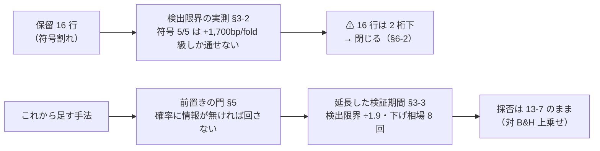
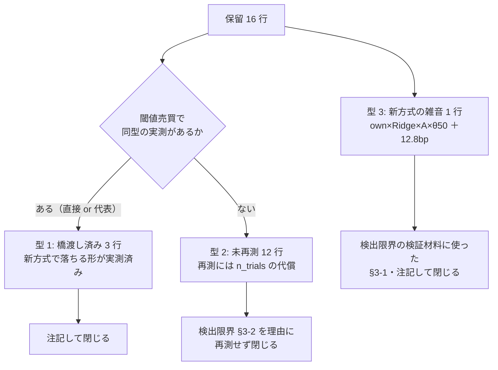
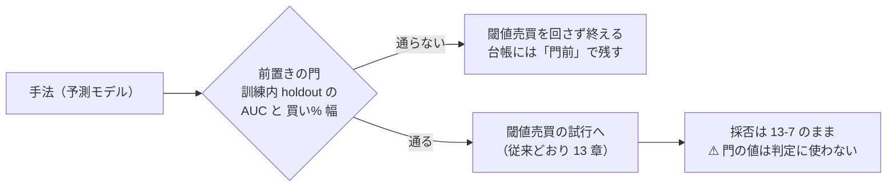
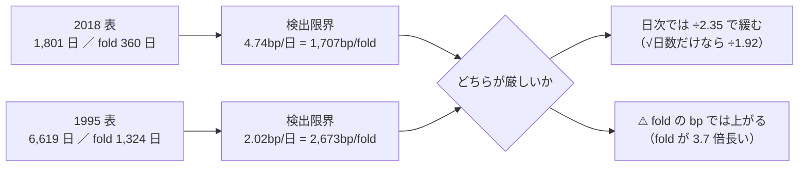

# 検証方式の判定力の検討（validation-power）

検討日: 2026-09-11（**完了**）。派生元: [プラン](../../../plans/archive/validation-scheme-review.md) ／ 規約: [rules.md](rules.md)（9・11・13 章が前提。**14 章の追記案が本書 §7**）／ 台帳: [ledger.md](ledger.md) ／ 直前の検証方式の記録: [threshold-trading.md](../threshold-trading.md)。

> ⚠ **これは投資助言ではなく調査資料である。** 特定の銘柄・売買を推奨しない。
> ⚠ **本検討で新しい試行は 1 つも回していない。n_trials は 91 のまま。** 数字はすべて既存 `runs/` の再現・再集計から出した【実測 2026-09-11】（そう書いていないものだけ【推測】）。
> ⚠ **rules.md への反映（§7 の 14 章案）は利用者の確認後。** 台帳・rules.md・コードは本検討では触っていない。

## 0. ここまでで分かったこと

⚠ **保留 16 行は「物差しを良くすれば白黒つく」大きさではなかった。** 現行の物差し（fold 5 本の符号全正）が拾えるのは **fold あたり約 +1,700bp 級（= B&H 1,652bp を倍にする級）** の実力だけで、保留 16 行の上乗せ（日次換算 +0.2〜+2.6bp 級・新方式の 1 行は +12.8bp/fold）は**検出限界の 2 桁下**にある（§3-2）。
したがって白黒は「再測」ではなく **検出限界の明文化と、閉じる処遇**でつける（§6-2）。物差し側で採る改善は、(1) **検証期間の延長**（検出限界 ÷1.9。raw は取得済みで表の再構築だけで済む）、(2) **前置きの門**（今回の 24 試行なら 24 とも回さずに済んだ）、(3) **診断列の追加**（fold 10 等分の符号・実効系列数）の 3 つ（§6-1）。

⚠ **[threshold-trading.md §7](../threshold-trading.md) の「検証方式の軸はこれで閉じる」との整合**（プラン §0 の再掲・確定）:
あれは「**実取引への近似を上げると数字は良くなるか**」への答え（ならない）であり、近似の軸は閉じたままである。
本検討の問いは「**今の物差しに、保留を白黒つける検出力があるか**」で、答えは「**この大きさの上乗せに対しては無い。そして期間を延ばしても足りない**」。
だから手法の側が狙うべきは、物差しが検出できる**レジーム級（数百〜数千 bp/fold）の効果**である — これは「下降トレンドの検知」タスクの向きと一致する（§3-2 の表）。

> この図の主張: ⚠ **保留 16 行の出口は「再測」ではない。** 検出限界の明文化で閉じ、これから来る手法には門と延長した期間を当てる。

| 問い | 答え |
| --- | --- |
| fold 数を 5 → 10・15 に増やすと白黒つくか | ⚠ **つかない。** 偶然の全符号正は 3.1% → 0.098% → 0.003% に減るが、**全符号正を要求する検出限界はむしろ上がる**（+1,700 → +2,800 → +3,700bp/fold 級。§3-1・§3-2）。診断列としては採る（採否には使わない） |
| 検証期間は延ばせるか | ✅ **延ばせる。raw 日足は 1994-11 から 8,000 本取得済み**（27 銘柄が上限に当たっている）。1995 開始で検証日数 ×3.7・検出限界 ÷1.94・既知の下げ相場 2〜3 回 → 8 回【推測】。⚠ ただし生存バイアスは深くなる（§3-3） |
| CPCV は入れるか | ⚠ **見送り。** 検証の総日数は増えず、経路の選び方が「選べた自由度」になる。ウォークフォワード（9 章 規約 1）とも衝突する（§3-4） |
| 実取引への近似の残差は楽観か | スプレッド由来では**楽観ではない**（SPY 実測 0.13〜0.26bp 対 仮定片道 2.5bp）。残るのは執行タイミング（翌寄りギャップ中央値 41bp/取引・符号対称）で、**採る候補が出たときの最終確認**として設計だけ残した（§4） |
| 無駄な試行は減らせるか | ✅ **減らせる形をしていた。** 訓練内 holdout の AUC と買い% 幅の門で、leak（通るべき）と本番 8 実行（通らないべき）が大差で分離する。閾値売買の追試 24 試行は**門があれば 1 つも回さずに済んだ**（§5） |
| 保留 16 行はどうするか | 型 1（橋渡し済み 3 行）と型 3（雑音 1 行）は注記して閉じる。型 2（未再測 12 行）も**再測せず閉じる**（検出限界の 2 桁下 ＋ own ex 8 行は再現幅 3.1〜6.9bp が平均 +0.3〜+2.6bp を上回る）。⚠ 台帳の判定列は変えない・手で書かない（§6-2） |

## 1. 検討の道具と検算（再集計の配線をまず疑う）

⚠ **runs/ に日次ポートフォリオ系列は保存されていない**（checks.json は fold 集計まで）。そこで **同一 config・同一種（0）の再現実行**で系列を再構成した。
再現は scratchpad 上のスクリプトで行い、**runs/ にもリポジトリにも何も書いていない**（1 実行 1 ディレクトリの規約 10 章を汚さない。処置は一切動かしていないので新しい試行ではない）。

検算（11 章 規約 7「まず配線を疑う」）— (A) 形式 4 本 ＋ leak 1 本の全行を保存済みの正本と突き合わせた:

| 再現した実行 | 突き合わせ | 結果 |
| --- | --- | --- |
| `trade_own_ridge_a` / `trade_own_lgbm_a` / `trade_ownex_ridge_a` / `trade_ownex_lgbm_a` / `trade_own_lgbm_a_leak` | `result.csv` 全 60 行 × 8 列（純利・粗利・的中率・IC・取引回数・保有日率・検証日数・本数） | ✅ **5 本とも一致**（最大差 3.6e-12 = 浮動小数点の丸め） |
| 同上 | `fitted/calibration_f*.json` の (a, b, source) | ✅ **完全一致**（差 0） |
| B&H の純利 | own 1652.02 / ownex 1650.62bp | ✅ 再現（プラン §4 の検算条件） |
| fold 集計（5 bin）の上乗せ | checks.json の `edge_vs_bh`（例: 雑音行 0＋−00・+12.79bp・t 0.13 ／ leak 5/5・t 17.14） | ✅ 一致 |

⚠ **(B) 銘柄別 4 本と leak (B) は再現していない**（本検討の再集計は (A) と保存済み `fitted/`・`per_symbol.csv` で足りる。§5 の (B) の門の値は保存済み fitted から読んだ）。

## 2. Phase 0 — 保留 16 行の棚卸し（3 型）

台帳の保留 25 行 = 無効・要再測（日足 × raw）9 行 ＋ **符号割れ 16 行**。前者は分割調整の誤りが原因で本検討の対象外。後者 16 行を 3 型に分ける。

> この図の主張: ⚠ **16 行は 3 つの型に割れ、型ごとに出口が違う。** どの型も出口は「再測」ではなかった（§6-2）。

16 行の全量（台帳 2026-09-10 生成時点。純利は旧方式が bp/日・新方式が bp/fold で**直接比べない** — 13-8）:

| # | 型 | 手法 | モデル | 特徴量の層 | 検証方式 | 純利bp | fold | 再現幅 | 実行 |
| ---: | :-: | --- | :-: | :-: | :-: | ---: | --- | --- | --- |
| 1 | **3** | 全部使う | Ridge | own | 閾値売買 A θ50 | ＋1664.8（上乗せ ＋12.8） | 1/5 0＋−00 | — | `…20-04-53_trade_own_ridge_a` |
| 2 | 2 | F1-2 相互情報量 | Ridge | own ex | 毎日往復 | ＋2.60 | 3/5 ＋＋−＋− | ⚠ 5 実行・4.35bp | `…16-18-54_impact_ex_2018` |
| 3 | 2 | F3-1 Lasso | Ridge | own ex | 毎日往復 | ＋2.59 | 1/5 ＋−−−− | ⚠ 5 実行・4.81bp | 同上 |
| 4 | 2 | F3-2 MDI | Ridge | own ex | 毎日往復 | ＋2.59 | 1/5 ＋−−−− | ⚠ 5 実行・6.92bp | 同上 |
| 5 | 2 | F1-2 相互情報量 | Ridge | own cs rel ll | 毎日往復 | ＋2.30 | 2/5 ＋−−＋− | — | `…19-42-54_cross_section_h1` |
| 6 | 2 | F2-3 Boruta | Ridge | own ex | 毎日往復 | ＋1.60 | 1/5 ＋−−−− | ⚠ 5 実行・4.62bp | `…16-18-54_impact_ex_2018` |
| 7 | **1** | 全部使う | LightGBM | own | 毎日往復 | ＋1.52 | 3/5 ＋−＋−＋ | — | `…17-27-16_gpu_lgbm_2018` |
| 8 | 2 | F1-1 相関 | Ridge | own ex | 毎日往復 | ＋1.45 | 2/5 ＋−−＋− | ⚠ 5 実行・6.04bp | `…16-18-54_impact_ex_2018` |
| 9 | 2 | F3-5 cMDA | Ridge | own cs rel ll | 毎日往復 | ＋1.45 | 2/5 ＋＋−−− | — | `…19-42-54_cross_section_h1` |
| 10 | **1** | F3-3 MDA | LightGBM | own | 毎日往復 | ＋1.35 | 3/5 ＋−＋−＋ | — | `…17-27-16_gpu_lgbm_2018` |
| 11 | **1** | 全部使う | MLP | own | 毎日往復 | ＋0.99 | 2/5 ＋−−−＋ | — | `…17-27-42_gpu_mlp_2018` |
| 12 | 2 | F3-3 MDA | Ridge | own ex | 毎日往復 | ＋0.64 | 1/5 ＋−−−− | ⚠ 5 実行・3.13bp | `…16-18-54_impact_ex_2018` |
| 13 | 2 | F1-3 mRMR | Ridge | own ex | 毎日往復 | ＋0.42 | 1/5 ＋−−−− | ⚠ 5 実行・5.04bp | 同上 |
| 14 | 2 | F1-5 FRESH | Ridge | own ex | 毎日往復 | ＋0.27 | 1/5 ＋−−−− | ⚠ 5 実行・4.53bp | 同上 |
| 15 | 2 | F3-1 Lasso | LightGBM | own cs rel ll | 毎日往復 | ＋0.30 | 3/5 ＋−−＋＋ | — | `…17-33-20_gpu_lgbm_cs` |
| 16 | 2 | F3-1 Lasso | Ridge | own cs rel ll | 毎日往復 | ＋0.24 | 2/5 ＋＋−−− | — | `…19-42-54_cross_section_h1` |

型 1 の「橋渡し」の強さは 3 行で違う（正直に区別する）:

| 行 | 橋渡し | 根拠 |
| --- | --- | --- |
| #7 own × LightGBM × 全部使う | ✅ **直接**（同じ表・同じモデルの対） | 新方式で **落とす**（上乗せ −54.8bp・0/5。[threshold-trading §3](../threshold-trading.md)）【実測】 |
| #10 own × LightGBM × MDA | 代表（同じ表・同じモデル・旧 fold の符号列が #7 と同一 ＋−＋−＋） | 較正 a ≈ 0 の退化は選んだ列の部分集合にも掛かる見込み【推測】 |
| #11 own × MLP × 全部使う | 代表（モデルが違う。追試しないと決めた経緯あり） | own で LightGBM と同型・断面で悪化の実測（[gpu-models](../gpu-models.md)）。ただし閾値売買では未実測【推測】 |

⚠ **型 2 の own ex 8 行（#2,3,4,6,8,12,13,14）は、再現の幅（3.13〜6.92bp）が平均（+0.27〜+2.60bp）を全行で上回っている。** 同じ鍵で 5 回回すと符号が入れ替わる大きさであり、これだけでも「採るの一歩手前」ではないことの実測になっている。

> ⚠ **この「再現の幅」への注記（2026-09-12 に追記）**: 当時の台帳は**表の開始日が違う実行も同じ鍵にまとめていた**ので、ここでいう幅には**期間の差が混ざっている**（own ex 8 行の 5 実行は 2018-01-31 開始の表 4 本と 2018-06-15 開始の表 1 本）。⚠ **「同じ条件で回し直した幅」ではない。** 期間を鍵に入れて割り直した台帳は §8-3 にあり、⚠ **閉じる判断そのものは変えていない**（大きさが検出限界の 2 桁下であることは期間の切り方に依らない）。

## 3. Phase 1 — 実効標本を増やす方向の試算

### 3-1. fold の引き直し（5 → 10・15）【実測】

処置（モデル・表・シミュレータ）は一切動かさず、**既存の 5 fold の検証日次系列を、各 fold 内で日数 2 等分・3 等分**して 10・15 bin の符号・t を再計算した（fold 境界＝強制清算の位置は動かないので、bin が清算をまたがない）。対 B&H 上乗せで見る（13-7）。

| 系列（θ=50・(A)） | 5 fold | 10 bin | 15 bin | 日次上乗せの σ |
| --- | --- | --- | --- | ---: |
| 雑音行 own × Ridge（#1） | 0＋−00・1/5・t 0.13 | 00＋＋−−0000・2/10・t 0.18 | 000＋−＋＋−−000000・3/15・t 0.05 | 52.6bp/日（非ゼロ日率 0.36） |
| 落とす own × LightGBM | 00−00・0/5・t −1.00 | 0000−−0000・0/10・t −1.47 | 000000＋−−000000・1/15・t −0.23 | 52.4bp/日 |
| 落とす ownex × Ridge | 0＋−−0・1/5・t −1.06 | 00−＋−−−＋00・2/10・t −1.25 | 000−−＋−−−−−−000・1/15・t −1.37 | 48.9bp/日 |
| ⚠ leak own × LightGBM | ＋＋＋＋＋・5/5・t 17.14 | ✅ **10/10・t 16.8** | ✅ **15/15・t 12.05** | 77.1bp/日 |

- ✅ **プラン Step 1-3 の合否検査は合格**: leak は 10 bin・15 bin でも全符号正のまま（fold が短すぎることはない）、雑音行は割れたまま
- ⚠ **ただし雑音行は「落とす」には変わらない**（上乗せの平均は正のまま・t は 0.1 前後のまま）。**fold を増やしても保留に白黒はつかない**
- DSR は日次系列そのものから計算するので bin の切り方では変わらない（雑音行 0.279 のまま）
- 買い% がほぼ定数の手法は B&H と一致する日が大半で、bin を細かくするほど **0（= B&H と完全一致）の bin が増えるだけ**（雑音行で 15 bin 中 9 個が 0）

**採否**: 10 bin の符号列は**診断列として採る**（偶然の全符号正が 3.1% → 0.098% に締まる・保留の「割れ方」が読みやすくなる）。⚠ **採否の判定は 5 fold のまま変えない**ので、検証方式の変更（13-8 の橋渡し）には当たらない。判定基準まで 10 bin に変えることは**しない**（次の §3-2 の理由による）。

### 3-2. 検出限界 — この物差しが拾える上乗せの大きさ【実測 σ からの試算】

日次上乗せの σ（§3-1 で実測 49〜77bp/日）を使うと、「全 bin 符号正」を安定して（確率 0.8 以上で）通過できる最小の上乗せ μ が計算できる: P(全 K bin > 0) = Φ(μ√L/σ)^K（L = 1801/K 日）。

| 要求 | σ=52.6bp/日（雑音行の実測） | 参考: σ=77.1（leak の実測） |
| --- | ---: | ---: |
| 符号 5/5（現行） | ⚠ **μ ≥ 約 +1,700bp/fold** | 約 +2,500bp/fold |
| 符号 10/10 | 約 +2,800bp/fold | 約 +4,200bp/fold |
| 符号 15/15 | 約 +3,800bp/fold | 約 +5,500bp/fold |
| （参考）t ≥ 2（1,801 日の系列全体） | 約 +890bp/fold | 約 +1,300bp/fold |
| （参考）t ≥ 2・検証期間を 1995 に延長（6,747 日） | 約 +460bp/fold | 約 +680bp/fold |

| # | 読み方 |
| ---: | --- |
| 1 | ⚠ **現行の「符号 5/5」が通せるのは B&H（1,652bp/fold）を倍にする級の実力だけ。** 保留 16 行（+12.8bp/fold・旧方式 +0.2〜+2.6bp/日）は**検出限界の 2 桁下**で、fold 数をどう切っても・期間をどう延ばしても、この物差しでは白黒つかない |
| 2 | ⚠ **fold 数を増やすと偽陽性は減るが検出限界は上がる**（5/5 の +1,700 → 10/10 の +2,800）。「採る」の判定を 10 bin にしてはいけない理由がこれ |
| 3 | ✅ **レジーム級の効果なら測れる。** B&H ポートフォリオの 2022 年の下げは年初 → 10-11 で **−2,953bp**【実測】。LightGBM が fold 3 を丸ごと休んだ実測でも、下げ足（fold 3 の前 1/3）だけで対 B&H **+756bp**、回復期を休み続けた分で −1,030bp だった。休むべき期間を正しく当てる手法の効果は数百〜数千 bp/fold の位置にあり、検出限界の上に出うる。⚠ **手法の探索は日次の小さな上乗せではなく、レジーム級に向けるべき** — 「下降トレンドの検知」タスクの向きと一致する |
| 4 | この試算は日次上乗せを独立な正規と置いた近似【推測】。尖度 30 の実測（checks.json）を考えれば実際の検出限界はさらに厳しい側に外れる |

### 3-3. 検証期間の延長【実測 ＋ 試算】

⚠ **raw の日足は既に 1994-11 から取得済み**（1 購読 8,000 本の上限。12 章 限界 3 の「上限」が日足では 32 年に相当する）。**再取得は不要で、features の表を 2018 年開始から前へ引き直すだけで済む。**

| シナリオ | 検証日数（5/6 換算） | 検出限界 | universe 63 のうち存在する銘柄 | 既知の下げ相場【推測】 |
| --- | ---: | ---: | ---: | ---: |
| 現行（2018-01 開始） | 1,801 日 | ×1 | 63 本 | 2〜3 回（2020・2022・2025?） |
| 2005-01 開始 | 約 4,660 日（×2.6） | ÷1.61 | 54 本 | 6 回程度 |
| 1995-06 開始 | 約 6,750 日（×3.7） | ÷1.94 | 29 本 | ⚠ **8 回程度**（1998・2000-02・2008-09・2011・2015-16・2018Q4・2020・2022） |

- ⚠ **27/63 銘柄は 8,000 本の上限に当たっている**（これ以上は遡れない）。2000 年以降に始まる銘柄が 17 本（GOOGL 2004・MA 2006・V 2008・AVGO 2009・TSLA 2010・META 2012・ABBV 2013・XLRE 2015・XLC 2018 など）あり、**早い期間ほどパネルが痩せる**（B&H・断面とも「そのとき存在した銘柄」の等加重で回すことになる）
- ⚠ **生存バイアスは深くなる**（12 章 限界 1。2026 年時点の時価総額上位を 1995 年に「知っていた」ことになる）。⚠ **ただし判定が対 B&H の上乗せである限り、生存銘柄のドリフトは基準線側も同じだけ持ち上げる**ので、「採る」を甘くする向きには効きにくい【推測】。エピソード表（§7 の 14-8）の読みには素直に効くので、延長したら 12 章に追記して残す
- (B) 銘柄別の fold 1 の訓練の薄さ（13-6 の 5）は、1995 開始なら約 1,100 日/銘柄に改善する（1995 時点から存在する銘柄に限る）
- ⚠ **中期ラベル（例: 60 日先）を使うなら fold 長との比が律速**: 現行の fold は 360 日で、60 日ラベルの実効標本は fold あたり 6 個分しかない。10 fold に切ると 180 日/fold で 3 個分になり検定にならない。**長いスケールのラベルは期間延長とセットでなければ成立しない**（fold 長はラベル地平の 6 倍以上を目安にする【推測】。§7 の 14-7）

**採否**: **採る（本命）。** 実装は後続タスク（features の 1995 表・橋渡し対・12 章への追記）。⚠ 延長した表で手法を回し直すのは**新しい試行**で n_trials に数える。橋渡しは 13-8 と同じ形（同じ手法 × モデルを 2018 表と延長表の両方で回した対を最初に 1 組作る）。

### 3-4. CPCV（組み合わせパージ CV）— 見送り

| 論点 | 中身 |
| --- | --- |
| 増えるもの | 検証「経路」の数（符号の分布が取れる） |
| ⚠ 増えないもの | **検証の総日数**。検出限界（§3-2）は経路を増やしても動かない |
| ⚠ 衝突 1 | 訓練が検証期間の**後ろ**のデータを含む形になり、ウォークフォワード（9 章 規約 1）と衝突する。市場のレジーム変化の下では楽観側に外れうる |
| ⚠ 衝突 2 | 経路・グループ数の選び方が「選べた自由度」になる（11 章 規約 4 の向き） |
| 手間 | 3 方向で最大（分割・パージ・集計の作り直し） |

**採否: 見送り。** 再開条件: 検出限界ではなく「符号判定の分散の見積り」自体が主目的になったとき。

### 3-5. 実効標本数の常時併記 — 採る

63 系列の実効系列数は **4.71 本（t 値の割引 0.273）**【実測。既存 checks.json より】。閾値売買の checks.json（`compute_trading`）にはこれが載っていない。
ポートフォリオ判定（等加重 1 本の系列）自体は日数で数えており正しいが、**per_symbol の「勝ち銘柄 58/63」を独立な 58 勝と読み違える**事故を防ぐため、実効系列数を閾値売買の checks にも常時併記する。**採る**（実装は後続タスク。判定は変えない）。

## 4. Phase 2 — 実取引への近似の残差の点検

⚠ **この方向は判定力を上げない**（threshold-trading §7 で実測済み）。目的は残差の棚卸しと「採る候補が出たときの最終確認」の設計だけ。

| 残差 | 実測・材料 | 向き | 扱い |
| --- | --- | --- | --- |
| コスト 5bp 固定（12 章 限界 7） | SPY の本番気配【実測 2026-09-08 市場時間・2 時点】: スプレッド 0.26bp・0.13bp（片道換算 ≤ 0.13bp）対 仮定片道 2.5bp。⚠ cert の気配は固定値（560.10/560.12）が返るので使えない（sandbox は相場を配信しない） | ✅ **楽観ではない**（SPY では 10 倍以上保守的）。⚠ ただし実測は 63 銘柄中 1 銘柄・2 時点だけ。残り 62 銘柄も大型株でスプレッドは数 bp 以下の見込み【推測】 | 現状のまま。板の厚み・約定確率は未検証のまま 12 章に残る |
| 終値執行（同時刻の気配で約定できる仮定） | ⚠ **翌寄りとのギャップ \|close→翌 open\| は中央値 41.4bp・平均 72.3bp・p90 161.6bp**【実測。adjusted 層 86 本 × 155,286 日（2019-07 以降）】。寄り付き（open）のデータは**ある**ので翌寄り執行の再シミュレーションは可能 | ⚠ 符号は対称で、系統的な楽観になるのは「シグナルが翌日のギャップと相関する」ときだけ。ただし 1 取引あたりの不確かさとしてはコスト仮定より 1 桁大きい | ⚠ **最終確認の門**（下）として設計だけ残す |
| 約定確率 100%（板・部分約定を見ない） | 実測なし。日足・大型株・小口（1 株〜）では約定しない側の外れは小さい【推測】 | 楽観側 | 12 章に残したまま |

**最終確認の門（設計のみ・実装しない）**: 台帳で「採る」候補が出たら、採る判定を確定する前に **(1) 執行を終値 → 翌寄りに変えた再シミュレーション**（open は取得済み）と **(2) 対象銘柄の実測スプレッドの取得**（tastytrade 本番気配。市場時間に `--step 3` 相当）を通し、上乗せの符号が保たれることを確認する。⚠ これは処置の変更ではなく頑健性の確認なので、n_trials には数えない（結果で判定を「採る → 保留」に下げる方向にしか使わない）。

## 5. Phase 3 — 前置きの門の設計（確率の質で足切る）

較正の実測 a ≈ 0（買い% がほぼ定数 = 確率に情報が無い）は、**閾値売買 24 試行を回す前に分かる形をしていた**（threshold-trading §2）。これを「前置きの門」にする。

> この図の主張: ⚠ **門は「回すかどうか」の足切りにだけ使い、採否の判定には使わない**（判定に混ぜると門自体が選べた自由度になる）。

### 5-1. 指標の実測 — leak と本番 8 実行は大差で分離する【実測】

指標はどちらも**訓練分割の内側の tail holdout**（較正の fit と同じ場所。13-2 の 2）から計算する。⚠ **検証 fold には特徴量にも触れない**（だから門は検証データの選別にならない — これが n_trials の論点の核心。§5-4）。

| 実行（(A) 形式・全部使う） | holdout AUC（fold 中央値） | 買い% p05-p95 幅（点・fold 中央値） | 較正 \|a\| 中央値 |
| --- | ---: | ---: | ---: |
| own × Ridge | 0.498 | 0.00（最大 7.1） | 3.9e-4 |
| own × LightGBM | 0.500 | 0.00 | 4.1e-5 |
| ownex × Ridge | 0.523 | 9.9（最大 15.2） | 22.2 |
| ownex × LightGBM | 0.518 | 0.00 | 1.7e-4 |
| ⚠ leak own × LightGBM | ✅ **1.000** | ✅ **100.0** | 2.8e+3 |

- ⚠ **\|a\| は予測値のスケールに依存する**（ownex × Ridge の 22.2 は予測値が小さいだけ）。スケールに依らないのは **買い% の幅**（= a·σ(pred) の写像）と **AUC** の 2 つで、門はこの 2 本で建てる
- (B) 銘柄別の較正 a（保存済み fitted・銘柄 × fold = 315 本）でも同じ形: own × LightGBM の \|a\| 中央値 3.6e-4 に対し leak (B) は 1.4e+3。⚠ 門は (A) プール形式で 1 回だけ計算すれば足りる（門を通らない手法は (B) も回さない）

### 5-2. 門の設計案

| 項目 | 案 | 根拠 |
| --- | --- | --- |
| 指標 1 | **訓練内 holdout の AUC ≥ 0.52**（5 fold の中央値） | 「上がるか」への単調な情報が皆無でないこと。既知の悪い 8 実行の最大は 0.523（ownex × Ridge）で、単独では締まらないから指標 2 と AND にする |
| 指標 2 | **買い% の p05-p95 幅 ≥ 20 点**（訓練内 holdout・5 fold の中央値） | θ=55 のヒステリシス帯（45〜55）の幅 10 点の 2 倍。これ未満だと 3 水準の θ で売買がほぼ定数化し、試行が「fold まるごと持つ/休む」に退化することが実測済み（threshold-trading §2） |
| 判定 | 両方を満たせば閾値売買へ。どちらか欠けたら**回さない** | 24 試行の実測: 本番 8 実行はどちらかで必ず落ち（幅の最大 15.2・AUC 単独通過は ownex × Ridge のみ）、leak は両方を大差で通る（1.000 / 100 点） |
| ⚠ 水準の由来 | **既知の 10 実行（良 2・悪 8）への当てはめで決めた**後知恵である。事前固定として効くのは**ここから先の手法**に対して | 13-3 の 4 と同じ向き。⚠ **結果を見て水準を動かしたら、動かした数だけ門は「選べた自由度」になる** |

### 5-3. 門の効果の見積り【実測からの反実仮想】

閾値売買の追試（2026-09-10）にこの門があったら: ⚠ **8 実行 × 3 閾値 = 24 試行は 1 つも回らず、n_trials は 67 のままだった**（今の 91 との差 24）。DSR の基準 SR0 は n_trials に単調なので、無関係な試行を止めることは**これから足す手法の DSR をそのまま守る**。

### 5-4. ⚠ 利用者の判断を仰ぐ 3 問（rules.md 14 章の確定に必要）

| # | 問い | 提案 | 代案 |
| ---: | --- | --- | --- |
| 1 | 門の水準（AUC 0.52・幅 20 点）をこの値で事前固定してよいか | 固定する（§5-2。以後、結果を見て動かさない。動かすなら動かした理由と数を 14 章に追記） | 水準を変える（そのときは「なぜその水準か」を先に書いてから固定する） |
| 2 | ⚠ **門前で落とした手法を n_trials に数えるか** | **数えない。** 門は訓練内 holdout だけを見ており、検証 fold の結果で選別していないから、多重検定の家系（検証結果に基づく選択）に入らない【この理屈自体は統計の標準的な整理。ただし解釈の余地あり】 | 保守的に「1 手法 = 1 試行」で数える（閾値 3 水準 × 形式 2 の 6 ではなく）。⚠ 数える側に倒しても DSR が甘くなることはない |
| 3 | 保留 16 行を §6-2 の処遇（全行閉じる・再測しない）でよいか | 閉じる（検出限界の 2 桁下。再測は +6〜+72 試行を払って白黒つかない見込みが高い） | 型 1 の #10・#11 だけ再測する（+6 試行/行。橋渡しの「代表」を実測に変える価値はある） |

✅ **決定（2026-09-11・利用者）: 問 1 = 固定 ／ 問 2 = 数えない（提案どおり） ／ 問 3 = 全行閉じる・再測しない。** これで rules.md 14 章の反映が解禁された（同日反映済み。§7 の注記を参照）。

## 6. Phase 4 — 採否の判定と反映

### 6-1. 3 方向の採点

| 改善 | 判定力への効き | n_trials への負担 | 実装の手間 | 採否 |
| --- | --- | --- | :-: | :-: |
| fold 10 等分の符号（診断列） | 偽陽性 3.1% → 0.098%。⚠ 採否には使わない（検出限界が上がるから） | なし（読み方の追加） | 小 | ✅ 採る |
| 実効系列数の常時併記 | per_symbol の過大読み防止 | なし | 小 | ✅ 採る |
| **検証期間の延長（1995 表）** | ⚠ **検出限界 ÷1.94・下げ相場 2〜3 → 8 回。3 方向で唯一、標本そのものが増える** | 延長表で回す再測・新手法は試行に数える（橋渡し対を含む） | 中 | ✅ **採る（本命）** |
| CPCV | 総日数が増えない・経路が自由度になる | 増える恐れ | 大 | ❌ 見送り |
| 近似の残差（方向 2） | 上げない（実測済み）。楽観の残りはスプレッド由来では無し | なし | 小（設計のみ） | 最終確認の門として設計だけ採る（§4） |
| **前置きの門（方向 3）** | ⚠ **無駄な試行を止める（今回なら 24/24）＝ 以後の DSR を守る** | ⚠ **減らす**（数え方は §5-4 の問 2） | 小〜中 | ✅ 採る（水準の確定は利用者） |

### 6-2. 保留 16 行の処遇（提案。⚠ 台帳は生成物なので手で書かず、反映は生成側の後続タスクで）

| 型 | 行 | 処遇 | 理由 |
| :-: | --- | --- | --- |
| 型 3（1 行） | #1 own × Ridge × A × θ50 | **(c) 閉じる**（判定列は保留のまま・注記を足す） | t 0.13・DSR 0.279 の雑音【実測】。検出限界（+1,700bp/fold 級）の 2 桁下（§3-2） |
| 型 1（3 行） | #7 | **(b) 代表済みとして閉じる** | 直接の橋渡しで「落とす」が実測済み（threshold-trading §3） |
| 〃 | #10・#11 | **(c) 閉じる** | 代表は【推測】混じり。再測（+6 試行/行）を払っても §3-2 の検出限界で白黒つかない見込み。⚠ 実測に変えたければ §5-4 の問 3 の代案 |
| 型 2（12 行） | #2〜6・8・9・12〜16 | **(c) 閉じる（再測しない）** | 大きさが検出限界の 2 桁下（§3-2）。own ex 8 行は再現幅 > 平均の実測（§2）。再測は 12 行 × 6 = 最大 +72 試行で、DSR の基準だけ上がる |

処遇の実装（後続タスク）: `config/catalog_notes.toml` を試行の行にも注記できる形に拡張し、台帳の「理由」列の末尾に「閉じた理由 ＋ 本書への参照」を機械で足す。⚠ **判定の列は変えない**（13-9 の 2: 旧行は再計算しない・消さない）。

### 6-3. 後続タスク（TODO に切り出し）

1. rules.md へ 14 章を反映（§7 の案。⚠ §5-4 の 3 問の回答が先）
2. 検証期間の延長: features の 1995 表の構築・橋渡し対・12 章への生存バイアス追記
3. 前置きの門の実装（`cli/run.py` の gate 節・checks への記録・台帳の「門前」判定）
4. 診断列の実装（fold 10 等分の符号・実効系列数を `compute_trading` に）
5. 台帳の注記拡張と保留 16 行の処遇の反映（catalog_notes の拡張）

## 7. rules.md 14 章の追記案（✅ 2026-09-11 反映済み — §5-4 の 3 問の決定を織り込んで [rules.md 14 章](rules.md) に入れた。正本はそちら。以下は起案時の記録）

> 以下は rules.md にそのまま足せる形で書いた案である。変更規約（rules.md 冒頭）の 2 問に最初に答える。
> 反映時の差分: 14-5 の水準を「固定」と明記（問 1）・門前は n_trials に数えないと確定し規律 3 つを追記（問 2）・変更規約の答えに保留 16 行の処遇（閉じる。問 3）を追記。

---

### 14. ⚠ 検証の判定力と前置きの門（2026-09-11）

| 変更規約の問い | 答え |
| --- | --- |
| なぜ変えたか | 台帳が採る 0・保留 25 行になり、物差しの検出力が律速になった。検出限界の実測（[validation-power.md](validation-power.md) §3-2）: 現行の「符号 5/5」が通せるのは fold あたり +1,700bp 級だけで、保留 16 行はその 2 桁下 |
| 変える前の結果をどう扱うか | ⚠ **旧 91 試行は残す・再計算しない・消さない。** 判定の列も変えない。変わるのは (1) 読み方（診断列・注記）、(2) これから回す手法の入り口（門）と期間 |

#### 14-1. 検証は「出力の契約」に対して定義する

手法の出力の契約は 1 点だけ — **銘柄 s・日 t のポジション（0/1 または買い% 1 本）を、t までの情報だけで出す**。検証（分割・パージ・シミュレータ・基準線・判定）はこの系列だけを受け取る。
⚠ **モデルの中身（スケールの組み合わせ・アンサンブル・レジーム分岐）を検証側は知らなくてよい。** だからモデルより先に検証を決められる。13 章は既にこの形であり、本条はそれを明文化する。

#### 14-2. 検出限界を数字で持つ

日次上乗せの σ（実測 49〜77bp/日）に対し、「符号 5/5」を確率 0.8 で通過できる最小の上乗せは約 +1,700bp/fold、t ≥ 2（1,801 日）は約 +890bp/fold（[validation-power.md](validation-power.md) §3-2）。
⚠ **この限界より 1 桁以上小さい効果を狙う手法は、回す前に「測れない」と判断してよい。** 逆に、レジーム級（数百〜数千 bp/fold）の仮説はこの物差しで測れる。

#### 14-3. 診断列 — 採否には使わない

閾値売買の checks に (1) **fold を日数 2 等分した 10 bin の上乗せ符号列**、(2) **実効系列数（63 → 実測 4.71 本）** を常時併記する。
⚠ **採否は 13-7（5 fold の上乗せ符号と DSR）のまま。** 10 bin を採否に使うと検出限界が上がる（§14-2 の向きと逆）。

#### 14-4. 検証期間の延長（1995 表）

- raw 日足は 1994-11 から 8,000 本取得済み。features の表を 1995 開始で作り直せば検証日数は 1,801 → 約 6,750 日（検出限界 ÷1.94）
- ⚠ **延長表で回した行は新しい試行として n_trials に数える。** 最初に橋渡し対（同じ手法 × モデルを 2018 表と延長表の両方で回した対）を 1 組作り、期間だけの差として読む（13-8 と同じ形）
- ⚠ **生存バイアスは深くなる**（2026 年の時価総額上位を 1995 年に知っていたことになる）。12 章に追記し、エピソード表（14-8）の読みでは常に思い出す。対 B&H 上乗せの判定では基準線側も同じだけ持ち上がるので、採るを甘くする向きには効きにくい【推測】

#### 14-5. 前置きの門 — 通らない手法は閾値売買を回さない

- 指標（どちらも**訓練分割の内側の tail holdout** から。検証 fold には触れない）: **holdout AUC ≥ 0.52** かつ **買い% p05-p95 幅 ≥ 20 点**（5 fold の中央値）
- ⚠ **門の値は採否に使わない。** 使うのは「回すかどうか」だけ
- ⚠ **水準は事前固定。** 結果を見て動かさない（動かすなら、動かした理由と数をここに追記してから）
- 門を通らなかった手法は台帳に**「門前」**の判定で残す（隠さない）。n_trials に数えるか: ★利用者の裁定（[validation-power.md](validation-power.md) §5-4 の問 2）
- 由来: 門があれば閾値売買の追試 24 試行は 1 つも回らなかった（leak は AUC 1.000・幅 100 点で通過。実測は validation-power.md §5-1）

#### 14-6. 基準線を 2 本足す（レジーム系の手法向け）

13-5 の基準線に加えて: (a) **各スケール単独**（複数スケールを合成する手法は、最良の単独スケールに勝って初めて合成の意味がある — 「全部使う」対 選別と同じ構図）、(b) ⚠ **同じ保有日率の乱択ゲート**（同じ日数だけでたらめに休む。種を固定して 1 本）。
(b) が「正しい日を休んだのか、ただ休んだだけか」を分離する。⚠ 基準線なので n_trials に数えない（13-9 の 4 と同じ）。

#### 14-7. パージ・fold 長はラベルの最長スケールに合わせる

- パージは**使うラベルの最長地平**ぶん落とす（9 章 規約 2 の適用の明文化）
- ⚠ **fold の長さはラベルの最長地平の 6 倍以上**を目安にする【推測の目安】。60 日ラベルを 180 日 fold で検定してはいけない（実効標本が fold あたり 3 個分になる）。足りなければ fold 数ではなく期間（14-4）を延ばす

#### 14-8. エピソード表は成果物 — 採否に使わない

既知の下げ相場ごとに退出・再進入・取れた/取れなかった bp を並べた表を成果物として残す（銘柄別 bp = 13-7 と同じ位置づけ）。
⚠ **実効標本は日数ではなく下降エピソードの回数**（1995 開始でも 8 回程度【推測】）で、検定には使えない。診断にだけ使う。

#### 14-9. 数値の組み合わせは学習・構造だけ事前固定

「中期 −10% × 短期 −20% で売り」のような**数値の組み合わせを事前固定しない**。訓練分割の内側で学習させ、fitted として `runs/` に残す（3 章 B・Platt の (a, b) と同じ扱い）。
事前固定するのは**構造だけ**: スケールの定義・出力が買い% 1 本であること・θ の水準・試す構成の数。⚠ 手で選んだ数値は 1 つずつが自由度で、結果を見て直せば検証データでの最適化になる。

---

## 8. 検算とテストの記録

| # | 確かめたこと | 結果 |
| ---: | --- | --- |
| 1 | 再現実行 5 本が保存済み `result.csv`（各 60 行 × 8 列）と一致するか | ✅ 最大差 3.6e-12（§1） |
| 2 | 再現の較正係数が `fitted/calibration_f*.json` と一致するか | ✅ 差 0（§1） |
| 3 | 5 bin の再集計が checks.json の `edge_vs_bh` と一致するか | ✅ 一致（雑音行・leak とも。§3-1） |
| 4 | leak（採るべき）と雑音行（落とすべき）を両方通したか | ✅ fold 引き直し（§3-1）と門（§5-1）の両方で、leak は通り・雑音行は通らない |
| 5 | 新しい試行・新しい fit を回していないか | ✅ 再現（同一 config・同一種）と再集計だけ。runs/・data/・台帳・rules.md は無変更。n_trials 91 のまま |

⚠ **再集計の一時スクリプトはリポジトリに残していない**（プラン §3 の方針。診断列を実装する後続タスクで `ail/validation/checks.py` とテストに昇格する）。

### 8-1. 実装での再現（2026-09-11・[プラン](../../../plans/archive/trading-gate.md)）

門を `ail/validation/gate.py` に実装し、⚠ **本書 §5-1 の表を実データで引き直した**（(A) 形式・全部使う・fold 中央値）。

| 実行 | 実装の AUC | §5-1 | 実装の 買い% 幅 | §5-1 | 門 |
| --- | ---: | ---: | ---: | ---: | :-: |
| own × Ridge | 0.4976 | 0.498 | 0.0001（最大 7.1465） | 0.00（最大 7.1） | ⚠ 門前 |
| own × LightGBM | 0.5000 | 0.500 | 0.0 | 0.00 | ⚠ 門前 |
| ownex × Ridge | 0.5235 | 0.523 | 9.9277（最大 15.2081） | 9.9（最大 15.2） | ⚠ 門前 |
| ownex × LightGBM | 0.5180 | 0.518 | 0.0 | 0.00 | ⚠ 門前 |
| ⚠ leak own × LightGBM | 1.0000 | 1.000 | 100.0 | 100.0 | ✅ 通過 |

✅ **§5-3 の反実仮想どおり**: 本番 4 実行はどれも門前（＝ 24 試行は 1 つも回らなかった）で、leak だけが大差で通る。
⚠ **この検算で新しい試行は数えていない**（門の計算は訓練内 holdout だけを見る。記録先を一時ディレクトリに逃がして回したので `runs/` は無変更）。台帳の再生成の差分も判定表の 1 行だけで、**91 試行・判定は不変**。

### 8-2. 検証期間の延長の実測（2026-09-11・[プラン](../../../plans/archive/validation-period-1995.md)）

⚠ **§3-3 は試算だった。** 1995 表を実際に作り、橋渡し対（同じ手法 × モデルを 2018 表と 1995 表で回した 1 組）まで通した結果を、試算と突き合わせる。
⚠ **この節で回した試行は 3 つ**（全部使う × Ridge × (A) × θ 3 水準。n_trials 91 → **94**）。leak 対照は台帳に入らないので数えない。

> この図の主張: ⚠ **期間を延ばすと検出限界は日次では下がるが、fold 単位の bp では上がる。** fold が 3.7 倍長くなるからで、⚠ **比べるときは必ず日次に直す。**

#### 8-2-1. 表の実測と §3-3 の試算の突き合わせ

`config/experiment/own_1995.toml` は `own_2018.toml` から **`start_date` を落としただけ**（層・粒度・地平・k・種・コストは同一）。列は `own_2018` と**完全に一致**する 41 列。

| 量 | §3-3 の試算 | 【実測 2026-09-11】 | 判定 |
| --- | --- | --- | :-: |
| 開始 | 1995-06 | **1995-02-10** | ✅ 試算より 4 か月早い（`own_` の 60 本の助走が終わった日） |
| 検証日数 | 約 6,750（×3.7） | **6,619（×3.67）** | ✅ ほぼ一致 |
| 検出限界 | ÷1.94 | **÷2.35（日次）** | ✅ 試算より良い（σ も下がったため。下） |
| 1995 時点の銘柄 | 29 本 | **29 本** | ✅ 一致 |
| 下げ相場（10% 以上） | 8 回程度【推測】 | **検証期間内に 11 回**（表全体では 14 回） | ✅ 試算を上回る |
| 再取得 | 不要 | **不要**（raw の 8,000 本をそのまま使えた。ビルド 33 秒） | ✅ |

⚠ **試算に無かった実測が 2 つある。**

1. ⚠ **検証期間は 1995 年からではなく 2000-05-10 から始まる。** 最初の 1/6（1995-02〜2000-05）は訓練にしか使われない。だから 1998 年の −23.8% は検証に入らない（下げ 14 回のうち検証期間内は 11 回）
2. ⚠ **早い fold ほどパネルが痩せる**: fold 1 が 54 銘柄・fold 2 が 59・fold 3 が 61・fold 4 以降が 63。1995 年時点では 29 本しかない（[rules.md 12-1](rules.md) に限界として追記した）

| fold | 検証期間 | 日数 | 銘柄 | 訓練の行 |
| ---: | --- | ---: | ---: | ---: |
| 1 | 2000-05-10 → 2005-08-16 | 1,324 | 54 | 43,809 |
| 2 | 2005-08-17 → 2010-11-17 | 1,324 | 59 | 111,335 |
| 3 | 2010-11-18 → 2016-02-24 | 1,323 | 61 | 186,004 |
| 4 | 2016-02-25 → 2021-05-27 | 1,324 | 63 | 265,651 |
| 5 | 2021-05-28 → 2026-09-04 | 1,324 | 63 | 348,309 |

#### 8-2-2. 検出限界の実測【実測】

§3-2 と同じ式（P(全 K bin > 0) = Φ(μ√L/σ)^K を 0.8 にする μ）を、両方の表の**実際の日次上乗せ系列**から引き直した。
⚠ **2018 表の側は §3-1・§3-2 を再現している**（σ 52.59 対 52.6 ／ 非ゼロ日率 0.363 対 0.36 ／ 限界 1,707 対「約 +1,700」bp/fold）＝ 配線の検算に合格。

| 表 | θ | 日数 L/fold | 日次上乗せの σ | 非ゼロ日率 | 検出限界（日次） | 検出限界（fold 単位） |
| --- | ---: | ---: | ---: | ---: | ---: | ---: |
| 2018 | 50 | 360.2 | 52.59bp | 0.363 | 4.74bp/日 | 1,707bp/fold |
| **1995** | 50 | 1,323.8 | **42.97bp** | 0.200 | ✅ **2.02bp/日** | ⚠ **2,673bp/fold** |
| 2018 | 55 | 360.2 | 74.89bp | 0.713 | 6.75bp/日 | 2,430bp/fold |
| 1995 | 55 | 1,323.8 | 115.91bp | 1.000 | 5.45bp/日 | 7,211bp/fold |

| # | 読み方 |
| ---: | --- |
| 1 | ✅ **日次では ÷2.35 に緩んだ**（試算の ÷1.94 より良い）。内訳は **√日数の ÷1.92** ＋ **σ が 52.6 → 43.0 に下がった分の ÷1.22** |
| 2 | ⚠ **σ は panel の性質ではなく手法の張り方で決まる**（非ゼロ日率 0.363 → 0.200 ＝ B&H と一致する日が増えた）。⚠ **別の手法なら σ は変わるので、一般の目安は ÷1.92 のほうを使う** |
| 3 | ⚠ **fold 単位の bp で書くと検出限界は上がる**（1,707 → 2,673bp/fold）。fold が 3.7 倍長いからで、⚠ **期間の効果を fold の bp で比べてはいけない** |
| 4 | ⚠ **それでも「符号 5/5」が通せるのは日次 +2bp 級**である。保留 16 行（旧方式 +0.2〜+2.6bp/日）は**まだ限界の境目〜下**にあり、⚠ **期間を延ばしても白黒はつかない**（§0 の結論は変わらない） |

#### 8-2-3. 橋渡し対 — 期間だけの差として読む

⚠ **1995 側は門前だったが、回すと先に決めてから回した**（[プラン](../../../plans/archive/validation-period-1995.md) の設計決定 4）。14-4 が橋渡し対を要求し、§3-3 が「延長表で回すのは新しい試行として数える」と書いているためで、[rules.md 14-5](rules.md) 規律 3 の形（`--ignore-gate`・普通に 3 試行として数える）である。

| 量（全部使う × Ridge × (A) × θ=50） | 2018 表 | 1995 表 |
| --- | ---: | ---: |
| 対 B&H 上乗せ | +12.79bp/fold | **+384.10bp/fold** |
| 〃 を日次に直すと | +0.036bp/日 | **+0.290bp/日** |
| fold の符号 | 1/5 `0＋−00` | **1/5 `＋0000`** |
| t | 0.13 | 1.00 |
| 10 bin の符号（診断列） | 2/10 | **1/10** |
| 取引回数 | 182 回/fold | 1,133 回/fold |
| 保有日率 | 0.794 | 0.829 |
| DSR | 0.279 | 0.621 |
| 判定 | 保留（閉じる注記つき） | **保留** |

⚠ **数字が大きくなったが、中身は同じ「1 fold だけ動いて残りは B&H と同一」である。**

| # | 読み方 |
| ---: | --- |
| 1 | ⚠ **上乗せ +384bp は fold 1（2000-05〜2005-08）の +1,920bp が全部**。fold 2〜5 の上乗せは**ちょうど 0.0**（買い% が定数で B&H と 1 日も違わない）。門の 買い% 幅も fold ごとに `[11.13, 0, 0.0001, 0, 0]` で、**情報があったのは fold 1 だけ** |
| 2 | ⚠ **fold 1 で勝ったのは「ドットコム崩壊を休めた」から**（同 fold の B&H は 5 年で +310bp しかない）。⚠ **1 エピソード 1 回ぶんの観測**であって、11 回の下げに対する実力ではない（14-8 と同じ注意） |
| 3 | ⚠ **DSR 0.279 → 0.621 は「良くなった」ではない。** 日数が 3.7 倍になって SR の推定が締まっただけで、fold の符号は 1/5 のまま（[rules.md 13-7](rules.md) の判定は符号）。⚠ **良い数字は根拠「中」が上限**（11 章 規約 2） |
| 4 | θ=55・60 は両方の表で大きく負（1995 表で −4,424 ／ −4,624bp/fold）。⚠ **θ を上げると休みすぎて B&H に負ける**形は期間を変えても同じ |
| 5 | 門の 2 指標も期間差が小さい: AUC 0.4976 → **0.524**（水準 0.52 を越えた）／ 買い% 幅 0.0001 → **0.0 点**（水準 20 点に遠い）。⚠ **期間を 3.7 倍にしても確率に情報は出てこない** |

#### 8-2-4. leak 対照（配線の検査。[rules.md 13-10](rules.md)）

1995 表の `_leak` でも跳ねた: 門は **AUC 1.000 / 幅 100.0 点**で通過、対 B&H 上乗せ **+81,363bp/fold・5/5・t 11.30**、10 bin も **10/10**、DSR 1.000。
✅ **較正 → 閾値 → 状態機械の配線は 1995 表でも生きている。**

#### 8-2-5. 台帳の「期間」列 — ⚠ 遡って埋めない

⚠ **期間を鍵に入れないと、1995 表の 3 試行は 2018 表の行にまとめられて数えられなかった**（`_collapse` は同じ鍵の実行を 1 行にする）。そこで鍵に**期間（表の開始日）**を足した。値は**その実行が実際に読んだ表**の最古の日で、`cli/run.py` が `inputs.json` に、`cli/build.py` が sidecar に残す。

当日は**記録の無い実行をすべて「—」に寄せた。** その時点で既存の 166 行・91 試行・判定（採る 0・落とす 66・保留 25）は 1 行も動かず、1995 表の 12 行（試行 3・基準線 9）が足されて **178 行・94 試行**だった。

⚠ **翌 2026-09-12 に利用者の決定で、記録の無い実行にも遡って当てた**（[プラン](../../../plans/archive/ledger-period-backfill.md)。実測は §8-3）。

| 見つけたこと【実測 2026-09-11】 | 中身 |
| --- | --- |
| ⚠ **1995 開始の表は前からあった** | `own_only_h1` の表は 1995-02-10 開始（431,759 行）。⚠ **`own_1995` と行数まで同じ** |
| ⚠ **台帳が期間の違う実行を同じ鍵にまとめていた** | **39 行（うち試行 27）**が開始日の違う表の実行を 1 行にまとめ、その差を**「再現の幅」として読んでいた**（例: `⚠ 5 実行・幅 4.35bp`）。内訳は 1995 開始と混ざるもの 26 行 ＋ 2018 開始どうし（01-31 と 06-15）で混ざるもの 13 行 |
| 遡って埋めた結果 | 178 行・94 試行 → **245 行・139 試行**。⚠ **DSR は全行で厳しくなる**（＝ 保守側）。⚠ **数字は 1 つも再計算していない**（§8-3） |

⚠ **もう 1 つ見つけた別件（✅ 2026-09-12 に直した。下の 8-2-6）**: `checks.json` の `n_trials` は、その実行自身のぶんを**二重に足していた**（`cli/run.py` が `summary.csv` を書いたあとに `checks.n_trials_now(extra)` を呼ぶので、台帳側で既に数えた行に `extra` がもう一度乗る）。1995 表の実行は 97 と記録されたが**正しくは 94**。

### 8-2-6. `n_trials` の二重計上を直した（2026-09-12・利用者決定・[プラン](../../../plans/archive/n-trials-double-count.md)）

⚠ **ずれは閾値売買の 8 実行だけではなかった。** 毎日往復の枝も同じ順序で、ずれ幅は各実行の `extra`（毎日往復では選別手法の本数ぶん・最大 9）。

| 実行 | 記録 | 正しい値 | ずれ | DSR（記録 → 正） |
| --- | ---: | ---: | ---: | --- |
| `own_impact_2018`（09-10） | 67 | 58 | ＋9 | 0.1453 → 0.1579 |
| `impact_both_2018` | 76 | 67 | ＋9 | 0.1249 → 0.1346 |
| `trade_own_ridge_a` | 73 | 70 | ＋3 | 0.2792 → 0.2843 |
| `trade_ownex_lgbm_b` | 94 | 91 | ＋3 | — |
| `trade_own_1995_ridge_a` | 97 | 94 | ＋3 | 0.6214 → 0.6256 |

⚠ **ずれは必ず「厳しい側」**（`n_trials` が多い ＝ DSR が低い）で、大きさは +0.004〜+0.013。⚠ **採否も管理画面の印も動かない**（判定は対 B&H 上乗せの符号で決まり DSR は判定式に入らない。管理画面の DSR の印は 0.95 が境目で、本番の実測は 0.12〜0.62・leak は 1.000）。

直し方: **`checks.n_trials_now()` を引数なしで呼び、台帳に数えさせる。** ⚠ **`extra` の引数そのものを消した**（残すと同じ間違いがまた書ける）。
⚠ **`extra` を足す方式はそもそも重複に弱かった**: 同じ設定を同じ表で回し直すと台帳の鍵では 1 試行のままだし、leak 対照は台帳に入らないので `extra` のぶんが丸ごと架空だった。

⚠ **過去の実行は直さない。** 理由は 2 つ。(1) 閾値売買は日次系列が保存されておらず `cli/report.py --recheck` で書き直せないので、毎日往復だけ直すと記録の中に 2 種類の数え方が混ざる。(2) ⚠ **2026-09-12 に台帳の鍵へ期間を足したので、いま数え直すと当時ではなく今の規則の数（139）が入る** — **過去の「正しい値」はもう一意に決まらない**。記録はそのまま残し、ずれの向きと大きさを本節に書いておく。

### 8-3. 期間を遡って埋めた（2026-09-12・利用者決定・[プラン](../../../plans/archive/ledger-period-backfill.md)）

⚠ **§8-2-5 で「★利用者の裁定」として残した件の結論。決定は「埋める」。**

遡り方は 3 段目を足しただけである（1. `inputs.panel_start` → 2. `features_meta.start` → 3. ⚠ **`features_file` が指す表の実物**）。
⚠ **3 は「行数が実行の記録と一致する」ときだけ使う。** 表は後から作り直されていることがあるので、⚠ **別の表の開始日を貼らないための門である。**

| 実行の内訳【実測 2026-09-12】 | 本数 |
| --- | ---: |
| 実行自身が記録していた（2026-09-11 以降） | 2 |
| ✅ 表の実物から遡れた | **38** |
| ⚠ 表が消えていて遡れない（`_repro_oldcsv`） | 1 |
| ⚠ **行数が合わず遡らなかった** — 記録 131,250 行に対し、いまの同名の表は 130,134 行（`own_impact_2018` は後で作り直されていた） | 1 |

表 27 本の読み取りは 0.12 秒で、台帳の生成は体感で変わらない。

| 量 | 遡る前 | 遡った後 |
| --- | ---: | ---: |
| 台帳の行 | 178 | **245** |
| 試行 `n_trials` | 94 | **139** |
| 落とす | 68 | 102 |
| 保留 | 26 | 37 |
| 基準線 | 84 | 106 |
| 採る | 0 | **0** |

⚠ **「割る」は再計算ではない。** 検算【実測 2026-09-12】: 遡る前の **178 行は 1 行も消えず**（実行・手法・純利・粗利・的中率・fold のすべてが一致）、⚠ **同じ実行・同じ手法で判定が変わったものは 0 件**。増えた 67 行は、これまで代表 1 本に隠れていた実行が表に出たものである。恒久のテストも足した（台帳の各行の純利が、その行の実行の `summary.csv` と一致すること）。

| # | 読み方 |
| ---: | --- |
| 1 | ⚠ **`n_trials` が 94 → 139 に増えるのは保守側の変更**（11 章 規約 4「数え落とすと必ず甘くなる」）。DSR の基準 SR0 が上がり、以後の手法はより厳しく測られる |
| 2 | ⚠ **「再現」の列が本来の意味に戻った。** これまで 39 行では期間差が「再現の幅」に化けており、⚠ **配線の疑い（11 章 規約 7）と読み違える形だった**。例: F3-1 × Ridge × own は「4 実行・幅 3.91bp」と出ていたが、同じ表どうしの幅は **0.50bp** で、残りは 1995 表・2018-01 表・2018-06 表の差だった |
| 3 | ⚠ **§2 の保留 16 行の根拠に注記が要る**（下）。own ex 8 行の「再現幅 3.1〜6.9bp」には**表の開始日の差（2018-01-31 と 2018-06-15）が混ざっていた** |
| 4 | ⚠ **割れて新しく出てきた保留の行は閉じていない。** `[[closed]]` 16 件は 2026-09-11 の台帳で当たっていた行（＝ そのとき代表だった実行の期間）に `period` で釘付けした。新しく出た保留は **F3-1 × Ridge × own ex と F3-1 × Ridge × own（どちらも期間 2018-01-31・純利 +0.61bp）の 2 行**で、⚠ **2026-09-11 の「閉じる」決定の対象ではない**ので開けたままにしてある（閉じるかは利用者の判断） |
