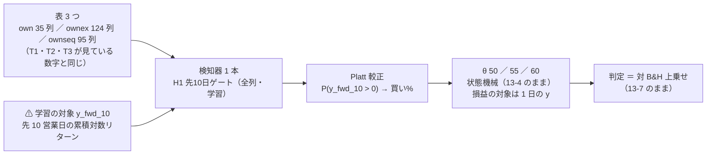

# 先 10 営業日を当てにいく形（「今後 2 週間くらい上がりそう ／ 下がりそう」）

作成日: 2026-09-27（§0 は**回す前**に書いた。§1 以降は回した後）。派生元: [プラン new-model-trader.md §3 Phase 2-1](../../plans/archive/new-model-trader.md)（親「titan を使って、新規の予測モデルと、複数の予測モデルを持ったトレーダーを作成する方法を確立する」の 1 つ目の実例）。
利用者の指示（2026-09-20。「システム説明」タブの「点に直す」の段への質問）: **「短期売買は手数料がかさむのと大きな上昇を見込めないので『明日は上がりそう』という予測は意味がない。『今後 2 週間くらい上がりそう下がりそう』というような予測はできるか？また既にあるか？」**
規約: [rules.md](feature-discovery/rules.md) 13・14・15 章（学習の対象をスケールにする）／ 決めごと K4（[プラン §2](../../plans/archive/new-model-trader.md)）。手順書: [howto-model-trader.md §1](../howto-model-trader.md)（この検証はその 1-1〜1-8 を初めて通した実例）。
関連: [downtrend-detection.md](downtrend-detection.md)（先 20 ／ 60 ／ 200 日。`trend` の 6 列だけ）／ [entry-timing.md](entry-timing.md) ／ [cgan-scenario.md](cgan-scenario.md)（SPY の先 5 日の分布）／ [validation-power.md](feature-discovery/validation-power.md)（検出限界）。

> ⚠ **これは投資助言ではなく調査資料である。** 特定の銘柄・売買を推奨しない。
> ⚠ **資金は動かしていない**（2026-08-27 の方針）。取得済みの日足（研究用の `data/`）だけを使った。
> ⚠ **数字はすべて【実測】**（自前の検証で出したもの）。良い数字は根拠「中」が上限（rules.md 11 章 規約 3）。

## 0. 事前固定（⚠ 回す前に書いた。2026-09-27）

### 0-1. 問いと、いまあるもの

| 問い | 回す前の答え |
| --- | --- |
| 「今後 2 週間くらい上がりそう」の予測は既にあるか | ⚠ **無い。** 実売買の 3 人（T1〜T3）と机上の config 90 本は全部 `horizon = 1`（明日の符号）。先を当てにいくのは 上がり調子の門 D1〜D4（先 20 ／ 60 ／ 200 営業日。⚠ 見ているのは `trend` の 6 列だけ。21 検証で採る 0）と 条件付き GAN（SPY の先 5 日の分布。落とす）。**5 日と 20 日のあいだ（10 営業日）** と **「いまの 3 本が見ている数字で先の日数を当てにいく形」** は空白 |
| できるか | ⚠ **作れる**（検知器の口と `y_fwd_{W}` のラベルは 15 章で既にある）。**効くかは別**で、それをここで測る |
| 質問の前提への補足 | 閾値売買は毎日往復ではなく、点（出力スコア）が線（売買基準値）の上にあるあいだ持ち続ける（費用は売り買いした日だけ ＝ 13-4）。これまでの負けの主因は手数料ではなく、点に中身が無いことと休んだあいだの上げの取り損ね（[downtrend-detection.md §4](downtrend-detection.md)。C3 のコストは負けの 7%【実測】） |

### 0-2. 試す形（構造だけ。数値は 1 つも手で置かない ＝ rules.md 14-9）

> この図の主張: 変えるのは「学習の対象」だけ。見る数字（3 つの表）・学習器・較正・θ・シミュレータ・判定は、実売買の 3 人と同じ物差しのまま。



| 決めごと | 中身 | 根拠 |
| --- | --- | --- |
| 動かす軸 | **学習の対象だけ**（1 日 → 先 10 営業日）。見る数字は 3 つの表をそのまま | 軸を 2 つ同時に動かさない（downtrend-detection.md プラン §7 と同じ） |
| 学習の対象 | `y_fwd_10` ＝ log(c[t+10]) − log(c[t])。買い% ＝ P(y_fwd_10 > 0) の Platt 較正 | rules.md 15-3 の 1 |
| 損益の対象 | ⚠ **1 日の `y` のまま**（シミュレータ 13-4 は変えない） | 15-3 の 2 |
| 見る数字 | 表の説明変数 **全部**（`own` 35 ／ `ownex` 124〔own ＋ cs ＋ rel ＋ ex・会社株 48〕／ `ownseq` 95〔own ＋ seq 60〕）。⚠ 選別しない | 「いまの 3 本が見ている数字」で先を当てにいく形 ＝ 空白そのもの |
| 学習器 | Ridge ／ LightGBM（config の `model` をそのまま検知器が呼ぶ） | K4 |
| 較正 | 訓練の日付の末尾 10% を holdout にし、**10 営業日ぶん（暦 15 日）パージ**して Platt（`date_holdout(label_bars=10)`） | 15-5 |
| パージ | `horizon_min = 21,600` 分 ＝ 10 営業日 × 1.5 × 1,440（暦で覆う） | 14-7・15-4 |
| θ・形式 | θ ∈ {50, 55, 60}・(A) 共通 1 本 | 13-3・13-6 |
| 期間・銘柄 | 2018-01-31〜（own_2018 と同じ）・63 銘柄（ownex は会社株 48） | 実売買の 3 人と揃える |
| 表 | ⚠ **3 つとも作り直す**（`y_fwd_10` の列が要る ＝ `features_from` では読めない）。説明変数の列は元の表と同じ式・尻が 10 本短くなる | 15-3 の 5 |
| 基準線 | 常に上（B&H）・直前リターンの符号（既存の 2 本）＋ 乱択ゲート（14-6 b。同じ保有日数で日付だけ壊す。自動で付く） | 13-5・15-6 |
| 数 | **3 表 × 2 学習器 × θ 3 ＝ 18 検証**（＋ leak 対照 6 実行 ＝ queue が足す）。⚠ **回したものは全部 `n_trials` に数える**（667 → 685 の見込み） | K4・14-10 規約 3 |
| 門 | 測って記録するが、**門前でも回す**（既定 ＝ 診断） | 14-10 規約 2 |
| 採否の物差し | 13-7 のまま: 対 B&H 上乗せ > 0 かつ fold の符号 5/5 で採る ／ 正だが割れる → 保留 ／ 0 以下 → 落とす | 13-7 |

⚠ **同じ表なのに `y_fwd_10` で作り直す**ので、元の表（own_2018 など）と説明変数の値は同じ式から出るが、⚠ **行は尻 10 本ぶん減る**。検証結果一覧の「期間」（開始日）は同じ 2018-01-31 のまま。既存の行は 1 つも動かない（新しい実験名・新しい検知器名で足すだけ）。

### 0-3. 先に書く見立て（⚠ 結果を見る前）

| # | 見立て | 理由 |
| ---: | --- | --- |
| 1 | **18 検証とも「採る」にならない**【推測】 | 両隣（先 5 日の cGAN・先 20 日の D1）が効いていない。先 10 日の答えは毎日 9 日ぶん重なるので独立な標本が約 1/10 に減り、検出限界（14-2。符号 5/5 は ＋1,700bp/fold 級）はさらに上がる |
| 2 | **leak 対照は 6 実行とも跳ねる**（上乗せ 5/5・t ≫ 2） | `LEAK_fwd_10`（答えそのもの）が説明変数に入る。跳ねなければ配線の穴 ＝ 結果を読まない |
| 3 | 買い% はまん中より上に寄り、**保有日率は 1 日の形より高い** | 先 10 日の「上がる割合」は 1 日より 50% から離れる（ドリフトが 10 倍積もる）ので、較正の切片 b が上に寄る |
| 4 | **取引回数は 1 日の形より少ない** | 先 10 日の予測は日をまたいで似た値になる（説明変数の多くが窓の統計量）ので、線をまたぐ回数が減る |
| 5 | ⚠ 3 と 4 が当たっても「効いた」ではない。B&H に退化した形（downtrend-detection.md §5 の学習ゲート）と区別するには乱択ゲートと上乗せの符号で見る | 15-6・14-6 b |

### 0-4. 回すもの（コマンド。⚠ 順は手間の小さい順 ＝ 14-10 規約 4）

```bash
cd experiments/feature-discovery
# 表 3 つ（＋ leak 対照の表 3 つ）。⚠ `y_fwd_10` の列が要るので作り直す
for e in trade_own_fwd10_ridge_a trade_ownex_fwd10_ridge_a trade_ownseq_fwd10_ridge_a; do
  .venv/bin/python -m cli.build --experiment $e; .venv/bin/python -m cli.build --experiment $e --leak; done
.venv/bin/python -m cli.queue --config fwd10           # 本番 6 ＋ leak 6。LightGBM の 3 本は features_from で表を読む
.venv/bin/python -m cli.report --catalog > ../../docs/specs/experiments/feature-discovery/ledger.md
```

| 実験名（config） | 表 | 学習器 | 表の持ち主 |
| --- | --- | --- | --- |
| `trade_own_fwd10_ridge_a` | own 35 | Ridge | ✅ この 1 本 |
| `trade_own_fwd10_lgbm_a` | own 35 | LightGBM | `features_from` |
| `trade_ownex_fwd10_ridge_a` | ownex 124（会社株 48） | Ridge | ✅ |
| `trade_ownex_fwd10_lgbm_a` | ownex 124 | LightGBM | `features_from` |
| `trade_ownseq_fwd10_ridge_a` | ownseq 95 | Ridge | ✅ |
| `trade_ownseq_fwd10_lgbm_a` | ownseq 95 | LightGBM | `features_from` |

コード: `ail/detectors/fwd.py`（検知器 `H1 先10日ゲート（全列・学習）`。⚠ 既存の `SCALES`・D1〜D4・C1〜C3 は 1 文字も変えない）／ 綴り `config/names.toml` の `h1-gate10` ／ テスト `tests/test_fwd.py`。
予測モデル名（rules.md 10-2）: `own.h1-gate10.ridge.shared` ／ `own.h1-gate10.lgbm.shared` ／ `own-cs-rel-ex.h1-gate10.ridge.shared~n48` ／ `own-cs-rel-ex.h1-gate10.lgbm.shared~n48` ／ `own-seq.h1-gate10.ridge.shared` ／ `own-seq.h1-gate10.lgbm.shared`（θ は `@50` などが後ろに付く）。

## 1. 一言で（2026-09-27 に回した。⚠ ここから下は結果を見て書いた）

⚠ **作れた。効かなかった。** 18 検証は **採る 0 ／ 保留 2 ／ 落とす 16**。保留の 2 行（ownex の θ=50・Ridge と LightGBM）は同じ保有日数の乱択ゲートには勝つ（＋307 ／ ＋247bp・t 1.35 ／ 1.40）が、⚠ **対 B&H は fold 2/5 で、検出限界の 6% の大きさ**。

⚠ **訂正（2026-09-27 夕）**: 最初に書いた版は `random_gate.mean_bp` を「乱択ゲートの対 B&H 上乗せ」と読み違え、「保留 2 行は乱択以下」と書いていた。正しくは **手法 − 乱択ゲート**（正なら乱択より良い）。`ail/validation/checks.py` の `_random_gate` を読んで直した。以下の表と文は直した後のもの。

| 問い | 答え |
| --- | --- |
| 「今後 2 週間くらい上がりそう」の予測は作れたか | ✅ **作れた。** 検知器 1 本（`H1 先10日ゲート（全列・学習）`）で 3 表 × 2 学習器が同じ物差しに載り、`cli.predict` も 63 銘柄の行を出した（§5） |
| 儲かったか | ⚠ **儲からない。** 18 検証のどれも B&H を fold 5/5 で超えない。最良は ownex × Ridge × θ=50 の **＋100.5bp/fold**（fold の符号 2/5・t 0.90）で、検出限界（符号 5/5 に要る ＋1,700bp/fold 級）の 6% |
| 保留の 2 行は「一歩手前」か | ⚠ **違う。** 2 行とも乱択ゲート（同じ保有日数で日付だけ壊したもの）には勝つ（手法 − 乱択 ＝ ＋307 ／ ＋247bp。t 1.35 ／ 1.40・fold 2/5 と 2/5〔残りは 0 ＝ 1 日も休まない fold〕）が、⚠ **対 B&H の上乗せは ＋101 ／ ＋69bp で fold 2/5・1/5、t 0.90 ／ 0.60**。符号 5/5 に要る ＋1,700bp/fold 級の 6%。⚠ **「休む日を当てた」と言うには t が小さく、多重検定（n_trials 685）を通していない**（rules.md 11 章 規約 5） |
| 1 日の形（T1〜T3 と同じ表・学習器）と比べてどうか | ⚠ **良くも悪くもなっていない。** own × Ridge −398（1 日: −271）／ own × LightGBM −223（−142）／ ownex × Ridge ＋101（−439）／ ownex × LightGBM ＋69（−65）bp/fold。⚠ fold の切れ目が少し違う（§4）ので数字は目安 |
| 先に書いた見立て（§0-3）は | 1「採る 0」✅ ／ 2「leak は跳ねる」✅（6/6・＋7,194〜＋8,070bp・t 12.6〜15.9）／ 3「保有日率は高い」✅（θ=50 で 0.77〜0.81 対 0.72〜0.78）／ 4「取引は少ない」△（θ=50 で 6 本中 4 本は減ったが、⚠ **保有の中央値は 2 日** ＝ 短い売買がまだ多い。§3） |
| 門（14-5）は | ⚠ **6 本とも門前**（AUC 0.487〜0.510・幅 0.8〜13.6 点）。回すと事前に決めて回し、18 検証として数えた |
| n_trials | **667 → 685**（検証結果一覧が数えた【実測】。保留 116 → 118・落とす 551 → 567） |

⚠ **これは「効かないことの証明」ではなく「この設定では効かなかった」である。** 限界は §4。

## 2. 結果【実測】

列の読み方: 純利は fold 1 本あたりの bp（5 fold の平均・63 銘柄等加重。ownex は 48 銘柄）。上乗せ ＝ 手法 − B&H の fold 平均と fold ごとの符号（0 ＝ B&H と同じ ＝ その fold は 1 日も休まなかった）。t は fold 5 本の t。**対 乱択 ＝ 手法 − 乱択ゲート**（同じ保有日数で日付だけ壊した基準線。正なら乱択より良い。14-6 b・採否に使わない）。判定は 13-7。

### 2-1. own 35 列（B&H ＋1,666bp。実行 `2026-09-27T14-21-10_trade_own_fwd10_ridge_a` ／ `14-21-25_…_lgbm_a`）

| 学習器 | θ | 純利 | 上乗せ | 符号 | t | 取引/fold | 保有日率 | 対 乱択 | 判定 |
| --- | ---: | ---: | ---: | --- | ---: | ---: | ---: | ---: | --- |
| Ridge | 50 | ＋1,269 | −398 | −＋−＋− | −1.56 | 445 | 0.81 | −245 | 落とす |
| Ridge | 55 | ＋1,413 | −254 | −−−−＋ | −0.94 | 91 | 0.75 | −53 | 落とす |
| Ridge | 60 | ＋392 | −1,274 | −−−−− | −5.71 | 55 | 0.39 | −282 | 落とす |
| LightGBM | 50 | ＋1,444 | −223 | −0−−− | −1.58 | 111 | 0.79 | ＋5 | 落とす |
| LightGBM | 55 | ＋1,556 | −110 | 00−−＋ | −0.54 | 60 | 0.73 | ＋214 | 落とす |
| LightGBM | 60 | ＋789 | −877 | 0−−−− | −2.78 | 20 | 0.28 | ＋88 | 落とす |

### 2-2. ownex 124 列・会社株 48（B&H ＋1,662bp。`14-21-51_trade_ownex_fwd10_ridge_a` ／ `14-22-08_…_lgbm_a`）

| 学習器 | θ | 純利 | 上乗せ | 符号 | t | 取引/fold | 保有日率 | 対 乱択 | 判定 |
| --- | ---: | ---: | ---: | --- | ---: | ---: | ---: | ---: | --- |
| Ridge | 50 | ＋1,763 | **＋101** | 0＋＋0− | ＋0.90 | 474 | 0.79 | **＋307** | **保留** |
| Ridge | 55 | ＋1,580 | −82 | 0−−0＋ | −0.41 | 111 | 0.78 | ＋49 | 落とす |
| Ridge | 60 | ＋702 | −960 | 0＋−−− | −1.89 | 42 | 0.40 | −30 | 落とす |
| LightGBM | 50 | ＋1,732 | **＋69** | 0＋−00 | ＋0.60 | 534 | 0.77 | **＋247** | **保留** |
| LightGBM | 55 | ＋1,283 | −379 | 0＋−0− | −0.85 | 273 | 0.60 | ＋195 | 落とす |
| LightGBM | 60 | ＋920 | −742 | 0−＋−− | −1.32 | 112 | 0.53 | ＋147 | 落とす |

⚠ **保留 2 行の読み方**: 上乗せの正は fold 2 本の小さな正（＋の fold は 2 本・0 の fold は「1 日も休まなかった」）。乱択ゲートには ＋307 ／ ＋247bp 勝っている（t 1.35 ／ 1.40）ので「休む日の選び方」に何かはあるかもしれないが、⚠ **対 B&H が fold 2/5・t 0.9 で、多重検定を通していない良い数字**。⚠ **保留は「採る」の一歩手前ではない**（rules.md 11 章 規約 5）。ownex は会社株 48 本の別の銘柄集合でもある（§4 の 4）。

### 2-3. ownseq 95 列（B&H ＋1,666bp。`14-22-51_trade_ownseq_fwd10_ridge_a` ／ `14-23-09_…_lgbm_a`）

| 学習器 | θ | 純利 | 上乗せ | 符号 | t | 取引/fold | 保有日率 | 対 乱択 | 判定 |
| --- | ---: | ---: | ---: | --- | ---: | ---: | ---: | ---: | --- |
| Ridge | 50 | ＋1,146 | −520 | −−−−− | −1.66 | 553 | 0.80 | −340 | 落とす |
| Ridge | 55 | ＋1,321 | −346 | −0−＋＋ | −1.20 | 103 | 0.78 | −196 | 落とす |
| Ridge | 60 | ＋449 | −1,217 | −−−−− | −8.56 | 59 | 0.38 | −354 | 落とす |
| LightGBM | 50 | ＋1,449 | −218 | 00−−− | −1.92 | 184 | 0.79 | −14 | 落とす |
| LightGBM | 55 | ＋1,540 | −126 | 00−−− | −1.17 | 116 | 0.79 | ＋69 | 落とす |
| LightGBM | 60 | ＋1,379 | −287 | −−−−− | −2.43 | 55 | 0.56 | ＋151 | 落とす |

⚠ `seq` の 60 列（過去 60 営業日の日次リターンそのもの）を変換せず Ridge に入れた形は、own 35 列だけより悪い（−520 対 −398）。⚠ **列を増やしても先 10 日の情報は増えなかった**（T3 QUANT が同じ列を区間の分位で読んで θ=50 で ＋62bp だったのとは別の形 ＝ 比べる対ではない）。

### 2-4. 配線・門・較正

| 項目 | 実測 |
| --- | --- |
| leak 対照（6 実行） | ✅ **全部跳ねた**: 上乗せ ＋7,194〜＋8,070bp/fold・fold 5/5・t 12.6〜15.9・DSR 1.000。⚠ **`LEAK_fwd_10`（答えそのもの）を説明変数に混ぜた形**で、混ぜなければ跳ねない（`tests/test_fwd.py`） |
| 門（訓練内 holdout・fold 中央値） | AUC: own Ridge 0.496 ／ own LightGBM 0.493 ／ ownex Ridge 0.510 ／ ownex LightGBM 0.490 ／ ownseq Ridge 0.487 ／ ownseq LightGBM 0.504。買い% の幅（p05〜p95）: 7.1 ／ 0.8 ／ 7.0 ／ 13.6 ／ 4.6 ／ 5.7 点。⚠ **6 本とも門前**（AUC < 0.52・幅 < 20 点）。⚠ 門は診断で採否に使わない（14-10 規約 2） |
| 較正（Platt。fold 1〜5） | ⚠ **傾き a の符号が fold で入れ替わる**（own Ridge: −28.6 ／ −5.6 ／ −14.4 ／ ＋13.5 ／ ＋6.0。ownex Ridge: −0.3 ／ ＋12.2 ／ −2.5 ／ ＋1.3 ／ −5.6）＝ 予測の向きが期間で逆になる（T1 の `own-ridge` と同じ癖）。切片 b は ＋0.6 → −0.03 → ＋0.12 と縮み、訓練の `y_fwd_10 > 0` の割合は 0.56〜0.59（1 日の `y` は 0.52） |
| 保有の長さ（holds.csv） | θ=50 の中央値は **2 日**（保有 1 日が 38%・2 日以下が 52%。own Ridge）。θ=55・60 では中央値 100 日超・強制清算 5〜9 割 ＝ ⚠ **持ち続ける期間と、日をまたいで細かく出入りする期間が混ざる** |

## 3. 見立ての答え合わせ（§0-3 の 5 つ）

| # | 見立て | 結果 |
| ---: | --- | --- |
| 1 | 18 検証とも採るにならない | ✅ 当たり（保留 2 ／ 落とす 16）。保留 2 行は乱択ゲートには勝つが対 B&H は fold 2/5 |
| 2 | leak は 6 実行とも跳ねる | ✅ 当たり（§2-4） |
| 3 | 買い% はまん中より上に寄り、保有日率は 1 日の形より高い | ✅ 当たり。θ=50 の保有日率 0.77〜0.81（1 日の形: own Ridge 0.72 ／ own LightGBM 0.78 ／ ownex Ridge 0.75 ／ ownex LightGBM 0.76）。θ=55 では差が大きい（0.60〜0.79 対 0.53〜0.66） |
| 4 | 取引回数は 1 日の形より少ない | △ **半分当たり**。θ=50 で own Ridge 445（1 日: 1,089）／ own LightGBM 111（353）／ ownex Ridge 474（1,694）／ ownex LightGBM 534（585）と減ったが、⚠ **保有の中央値は 2 日のまま**（§2-4）。説明変数は同じ窓の統計量でも、較正の傾き a が大きい fold では買い% が線の近くで細かく振れる |
| 5 | 3・4 が当たっても「効いた」ではない | ✅ そのとおりになった。上乗せの符号は最良でも 2/5。乱択ゲートには ownex の 6 行と own × LightGBM の 3 行が勝つが t は全部 2 未満（§2-2・§2-4） |

⚠ **質問の前提への答え**: 「先 10 日を当てる形にすれば売買が減って手数料が効かなくなる」は半分しか起きなかった（θ=50 の短い売買は残る）。⚠ **そして負けの主因は今回も手数料ではない**（own Ridge θ=50 の粗利 ＋1,304 − 純利 ＋1,269 ＝ 費用 35bp/fold に対し、上乗せは −398bp）。**点（出力スコア）に先 10 日の情報が無い**ことが主因で、AUC 0.49〜0.51 がそれを言っている。

## 4. ⚠ 限界と注意（読む前に）

| # | 限界 | 効き方 |
| ---: | --- | --- |
| 1 | ⚠ **表の尻が 10 本短い**（`y_fwd_10` のぶん。panel の終わりは 2026-08-24。1 日の形は 2026-09-04） | **fold の切れ目が数日ずれる**ので、1 日の形（T1〜T3 の実行）との数字の比較は目安。B&H も ＋1,652 → ＋1,666bp と動いた |
| 2 | ⚠ **検証結果一覧の基準線の行（常に上 ／ 直前リターンの符号 × own ／ ownex ／ ownseq）に「⚠ N 実行・幅 14.40bp」の印が付いた** | 基準線の識別項目は期間の**開始日**しか持たず、今回の表（終わりが 10 本短い）と同じ識別項目にまとまるため。⚠ **計算を変えたのではなく、表の終わりが違う**（限界 1 と同じ原因）。手法の行（H1）は新しい識別項目なので既存の行は 1 つも動いていない（削れた行は基準線の 37 行だけ ＝ `git diff` で確認） |
| 3 | 先 10 日の答えは毎日 9 日ぶん重なる | 較正・門の holdout は 15 暦日パージしてあるが、**独立な標本は約 1/10**。検出限界は 1 日の形より高い（[validation-power.md](feature-discovery/validation-power.md)） |
| 4 | ownex は会社株 48 本だけ（ETF は `rel_sec_*` を持てない） | own ／ ownseq（63 本）と B&H が違う。表をまたいで数字を比べない |
| 5 | 銘柄集合は 2026 年の時価総額上位（生存バイアス） | B&H が高く出る側。「休む」には厳しい |
| 6 | 学習器は Ridge ／ LightGBM の既定のまま・列は全部（選別なし） | 事前固定（14-9）。⚠ **結果を見て列や水準を変えて回し直さない** |
| 7 | ⚠ `cli.predict` の訓練は asof の 10 営業日前まで（§5） | 答えの端が asof の終値に触れる行が訓練に入る（プラン §3 Phase 2-1 の「Phase 3 に効く穴」）。✅ **2026-09-28 に直した**（Phase 3）: `split_asof` が最長の `y_fwd_W` の終わりで切る ＝ asof 2026-09-04 で `train_end` 2026-08-21 → **2026-08-20**（`.meta.jsonl` の `purge_bars = 10`）。`y_fwd_` の無い表（T1〜T3）は 1 ビットも変わらない |

## 5. 道の確認と、かかった時間【実測 2026-09-27・titan】（手順書 [howto-model-trader.md §1](../howto-model-trader.md) の 1-1〜1-8）

| 手順 | やったこと | 時間 ／ 結果 |
| --- | --- | --- |
| 1-1 事前固定 | §0 を書いた（回す前） | — |
| 1-2 検知器 | `ail/detectors/fwd.py`（`forward_gate(w, …)`・登録名 `H1 先10日ゲート（全列・学習）`）・`ail/bootstrap.py` に import 1 行。⚠ `scale._fit_calibration`（日付で切る holdout）を共用 | テスト `tests/test_fwd.py` 6 本（契約・ラベル無しで止まる・fit は訓練だけ・leak で跳ねる ／ 跳ねない・既存の登録名は無傷） |
| 1-3 綴り | `config/names.toml` `[method]` に `h1-gate10` | `tests/test_names.py` 通過 |
| 1-4 config | 6 本（表の持ち主 3 ＋ `features_from` 3）。⚠ **`label_scales = [10]` の表は既存の表を `features_from` で読めない**（`y_fwd_10` の列が無い）＝ 持ち主 3 本は表を作り直す | `config.resolve_experiment` 6 本 OK |
| 表 | `cli.build` × 6（本番 3 ＋ leak 3） | **3 分 16 秒**（1 本 31〜34 秒。14:17:52〜14:21:08） |
| 1-5 queue | `config/queue/fwd10.toml` → `cli.queue --config fwd10`（12 本・失敗 0） | **2 分 44 秒**（Ridge 7.7〜9.6 秒 ／ LightGBM 9.7〜14.7 秒 ／ leak 8〜29 秒。14:21:09〜14:23:53）。⚠ 見積り 1 時間の 1/20 |
| 1-6 検証結果一覧 | `cli.report --catalog` → `ledger.md`・`ledger_rows` | n_trials 667 → 685。⚠ 基準線の行に「幅 14.40bp」の印（§4 の 2） |
| 1-7 `cli.predict` | `--experiment trade_own_fwd10_ridge_a --method "H1 先10日ゲート（全列・学習）" --asof 2026-09-04` | **63 行・32 秒**（表 31 秒 ＋ fit 0.19 秒）。買い% 50.3〜53.2 の狭い帯。⚠ 訓練は 2026-08-21 まで（§4 の 7） |
| 1-8 説明 | `dashboard/models.toml` に `[[model]] id = "fwd10-gate"`（`history.names = ["*.h1-gate10.*"]`） | `dashboard/tests`（`test_models_tab`・`test_traders_tab`・`test_system_tab`）60 本通過。`test_real_history_matches_the_db` が保留 2 ／ 落とす 16 を DB と突き合わせた |
| テスト | 研究側 148 本（`test_fwd`・`test_names`・`test_ledger_rows`・`test_catalog`・`test_queue`・`test_trading_run`・`test_predict`・`test_downtrend`・`test_pairs`・`test_tsc`） | **65 秒・全部通過**。既定経路の指紋（`test_trading_run`・`test_predict`）は動いていない ＝ `assemble`・`fold_buy_pct` は触っていない |

⚠ **手順書の欄（Phase 6 で埋める「実測」）はこの表から写せる。** 手順書で足したい注意は 2 つ: (a) 先を当てる形は既存の表を `features_from` で読めない（1-4）／ (b) 基準線の行に「幅」の印が付く（1-6・§4 の 2）。

## 6. 次に効くこと（このタスクの外）

- ✅ **Phase 3**（プラン §3。2026-09-28）: `cli.predict` の `split_asof` を「最長のラベルぶん落とす」に直した（§4 の 7）。直した後の `H1` は 63 行・買い% 47.8〜55.1・表 37 秒 ＋ fit 0.19 秒【実測】
- 先 10 日の形を本番に入れる理由は無い（採る 0。対 B&H は最良でも 2/5）。**`H1` の検知器と `y_fwd_10` のラベルは Phase 2-3（深層学習 2 本・地平 10 日 ＝ K5）が相乗りする**
- ✅ 2026-09-27 利用者決定「修正」で `dashboard/system.toml` に足した。「システム説明」の「出力スコアに直す」の段の文（TODO のメモ）: この記録の §3 が根拠になる（毎日売り買いではなく線の上にあるあいだ持つ・先を当てる型は 20 日〜と 10 日で試して効かなかった）

## 7. 買う線と売る線を別に置く（2026-09-27 利用者の指示。⚠ §7-1〜7-3 は回す前に書いた）

利用者の指示（2026-09-27。§1〜§6 を読んだ後）: **「ownex × Ridge 60 の判定で買い。ownex × Ridge 50 の判定で売り」→「買いと売りの閾値を別の値にしたもので検証してください」**。規約は [rules.md 18 章](feature-discovery/rules.md)（同日に足した）。

### 7-1. 事前固定

| 決めごと | 中身 |
| --- | --- |
| 動かす軸 | **売る線の高さだけ**。出力スコア（買い%）は §2 の 6 本と同じもの（同じ表・同じ検知器・同じ学習器・同じ fold）。表は作り直さない（`features_from`） |
| 組（買い線, 売り線） | **(55, 50)・(60, 50)・(60, 55)** の 3 組。⚠ 利用者の例は (60, 50)。残り 2 組は「帯の広さ」と「売る線の高さ」を 1 つずつ動かした隣。⚠ **結果を見て足さない** |
| 意味 | 買い ＝ 買い% > 買い線 ／ 売り ＝ 買い% < 100 − 売り線（18-2）。(60, 50) ＝ 60 で買い 50 で売る（帯 50〜60）／ (60, 55) ＝ 60 で買い 45 で売る（帯 45〜60）／ (55, 50) ＝ 55 で買い 50 で売る（帯 50〜55） |
| 対象 | ⚠ **§2 の 6 本全部**（3 表 × 2 学習器）。ownex × Ridge だけにすると、結果を見て最良だった 1 本を選んだことになる（14-9） |
| 数 | **6 本 × 3 組 ＝ 18 検証**（＋ leak 対照 6 実行）。対称の行（θ 50 ／ 55 ／ 60）も同じ実行で出るが既存の識別項目にまとまる（再現・一致の検算 ＝ 数は増えない）。n_trials 685 → 703 の見込み |
| 名前 | 手法 `H1 先10日ゲート（全列・学習）〔売り線50〕`・閾値 ＝ 買い線。予測モデル名 `….h1-gate10-out50.…@60` |
| 基準線・判定 | 13-7 のまま（対 B&H・同じ θ の B&H 行）。乱択ゲートと逆売買は同じ形で付く |
| 変えたコード | `simulate(exit_threshold=)`（既定は同一）・`cli/run.py` の `threshold_pairs`（無い config は経路が同一）・`names.py` の `-outN`。テスト `tests/test_exit_line.py` 8 本・既定経路の指紋 `test_trading_run` は通過 |

### 7-2. 先に書く見立て

| # | 見立て | 理由 |
| ---: | --- | --- |
| 1 | **18 検証とも採るにならない**【推測】 | 出力スコアに先 10 日の情報が無い（AUC 0.49〜0.51・§2-4）。線の置き方は情報を作らない（[theta-placement.md](theta-placement.md) 案 3 も同じ結論） |
| 2 | (60, 50) は θ=60 より取引が増え保有日率が下がり、θ=50 より取引が減る。**保有日率は θ=50 と θ=60 のあいだ（0.4〜0.8）** | 作りから決まる（18-3 の 1） |
| 3 | (60, 50) の上乗せは θ=60（ownex × Ridge −960bp）より**負けが小さい**が、乱択ゲートとの差は 2 未満の t にとどまる | θ=60 の負けの主因は保有日率 0.40 で上げを取り損ねたこと。売る線を上げると降りるのが早くなり、休む日がさらに増える向きなので、改善しても符号 5/5 には届かない |
| 4 | (55, 50) は保有の中央値が短く（数日）、費用で θ=55 に負ける側に寄る | 18-3 の 3 |
| 5 | leak 対照は 6 実行とも跳ねる（対の行も 5/5） | `LEAK_fwd_10` は線の置き方に依らず効く |

### 7-3. 回すもの

```bash
cd experiments/feature-discovery
.venv/bin/python -m cli.queue --config fwd10_pairs      # 6 本 ＋ leak 6（表は作り直さない）
.venv/bin/python -m cli.report --catalog > ../../docs/specs/experiments/feature-discovery/ledger.md
```

config: `trade_{own,ownex,ownseq}_fwd10_{ridge,lgbm}_a_pairs.toml`（`features_from` ＋ `[trading] threshold_pairs = [[55, 50], [60, 50], [60, 55]]`）／ queue `fwd10_pairs.toml`。

### 7-4. 結果【実測 2026-09-27 15:16〜15:19・titan】（⚠ ここから下は回した後に書いた）

⚠ **18 検証とも落とす**（採る 0・保留 0）。**n_trials 685 → 703**。売る線を上げる（早く降りる）と、⚠ **6 本 × 3 組のうち 17 組で、同じ買う線の対称の行より上乗せが悪化した**（唯一の例外 own × Ridge (60, 50) −1,193 対 θ60 −1,274 も落とす）。対称の 18 行は同じ実行で再現し、識別項目・数字・判定とも 1 つも動かなかった（検算）。

列: 上乗せ ＝ 対 B&H（fold 平均・符号・t）。対 乱択 ＝ 手法 − 乱択ゲート（同じ保有日数で日付だけ壊す。正なら乱択より良い）。中央値 ＝ 1 取引の保有日数の中央値（営業日）・強制 ＝ 評価期間の末尾まで持ったままの割合。⚠ 比べる相手は同じ実行の対称の行（同じ買う線 θ）。

| 表 × 学習器 | (買い, 売り) | 上乗せ | 符号 | t | 取引/fold | 保有日率 | 対 乱択 | 中央値 | 強制 | 同じ買う線の対称の行（上乗せ ／ 保有日率 ／ 中央値） |
| --- | --- | ---: | --- | ---: | ---: | ---: | ---: | ---: | ---: | --- |
| own × Ridge | (55, 50) | −309 | −−−−＋ | −1.12 | 138 | 0.72 | −71 | 59 | 0.35 | θ55: −254 ／ 0.75 ／ 164 |
| own × Ridge | (60, 50) | −1,193 | −−−−− | −4.93 | 78 | 0.35 | −168 | 63 | 0.36 | θ60: −1,274 ／ 0.39 ／ 164 |
| own × Ridge | (60, 55) | −1,229 | −−−−− | −5.13 | 62 | 0.38 | −199 | 125 | 0.50 | 〃 |
| own × LightGBM | (55, 50) | −263 | −0−−＋ | −1.55 | 76 | 0.70 | ＋245 | 210 | 0.59 | θ55: −110 ／ 0.73 ／ 349 |
| own × LightGBM | (60, 50) | −905 | −−−−− | −2.83 | 24 | 0.27 | ＋103 | 347 | 0.72 | θ60: −877 ／ 0.28 ／ 358 |
| own × LightGBM | (60, 55) | −873 | 0−−−− | −2.81 | 21 | 0.28 | ＋77 | 358 | 0.87 | 〃 |
| ownex × Ridge | (55, 50) | −101 | 0＋−0＋ | −0.60 | 244 | 0.73 | ＋42 | 8 | 0.16 | θ55: −82 ／ 0.78 ／ 37 |
| ownex × Ridge | **(60, 50)** | −1,030 | 0−−−− | −2.19 | 138 | 0.36 | −21 | 10 | 0.15 | θ60: −960 ／ 0.40 ／ 83 |
| ownex × Ridge | (60, 55) | −1,080 | 0−−−− | −2.41 | 77 | 0.38 | −134 | 25 | 0.28 | 〃 |
| ownex × LightGBM | (55, 50) | −428 | 0＋−0− | −0.93 | 390 | 0.55 | ＋240 | 3 | 0.07 | θ55: −379 ／ 0.60 ／ 8 |
| ownex × LightGBM | (60, 50) | −943 | 0＋−−− | −1.97 | 248 | 0.32 | ＋126 | 3 | 0.07 | θ60: −742 ／ 0.53 ／ 31 |
| ownex × LightGBM | (60, 55) | −902 | 0−−−− | −1.85 | 198 | 0.36 | ＋87 | 8 | 0.09 | 〃 |
| ownseq × Ridge | (55, 50) | −507 | −−−−＋ | −1.97 | 185 | 0.72 | −184 | 35 | 0.26 | θ55: −346 ／ 0.78 ／ 127 |
| ownseq × Ridge | (60, 50) | −1,263 | −−−−− | −7.89 | 105 | 0.32 | −244 | 37 | 0.24 | θ60: −1,217 ／ 0.38 ／ 126 |
| ownseq × Ridge | (60, 55) | −1,180 | −−−−− | −9.12 | 70 | 0.37 | −266 | 117 | 0.43 | 〃 |
| ownseq × LightGBM | (55, 50) | −185 | 00−−− | −1.75 | 156 | 0.79 | ＋20 | 20 | 0.32 | θ55: −126 ／ 0.79 ／ 57 |
| ownseq × LightGBM | (60, 50) | −524 | −−−−− | −2.99 | 90 | 0.43 | ＋62 | 20.5 | 0.31 | θ60: −287 ／ 0.56 ／ 318 |
| ownseq × LightGBM | (60, 55) | −418 | −−−−− | −3.26 | 72 | 0.46 | ＋125 | 64.5 | 0.44 | 〃 |

利用者の例 **ownex × Ridge (60, 50)**: 60 で買い 50 で売ると、θ=60（40 で売る）より取引は 42 → 138 回/fold に増え、保有の中央値は 83 → 10 日に縮み、保有日率は 0.40 → 0.36 に下がった。上乗せは −960 → −1,030bp/fold で悪化、乱択ゲートとの差も ＋(−30) → −21 で変わらない。⚠ **早く降りても「降りた日」に情報が無いので、休む日が増えたぶんだけ上げを取り損ねる**。

leak 対照（6 実行）: 対の行も含めて全部跳ねた（上乗せ ＋7,194〜＋8,071bp・5/5・t 12.5〜15.9）。

#### 見立て（§7-2）の答え合わせ

| # | 見立て | 結果 |
| ---: | --- | --- |
| 1 | 18 検証とも採るにならない | ✅ 当たり（全部落とす） |
| 2 | (60, 50) は θ=60 より取引が増え、θ=50 より減る。保有日率は θ=50 と θ=60 のあいだ | △ 取引は ✅（6 本とも θ60 < (60, 50) < θ50）。⚠ **保有日率は「あいだ」ではなく θ=60 より低い**（6 本とも）。売る線を 40 → 50 に上げれば降りるのが早くなるので当然で、見立ての「あいだ」は書き間違い（`tests/test_exit_line.py` は正しい向きで固定してある） |
| 3 | (60, 50) は θ=60 より負けが小さい | ❌ **外れ**。6 本中 5 本で悪化（own × Ridge だけ −1,274 → −1,193）。「降りるのが早い ＝ 損を避ける」は、降りる合図に情報があるときだけ成り立つ |
| 4 | (55, 50) は保有が短く、費用で θ=55 に負ける側に寄る | ✅ 当たり（6 本とも θ55 より悪化。ownex × LightGBM は中央値 3 日・取引 390 回/fold） |
| 5 | leak は跳ねる | ✅ |

#### 読み方と限界

- **線の置き方は情報を作らない。** 買う線を上げても売る線を上げても、休む日が増えるだけで、休む日の選び方が乱択と変わらなければ B&H の上げを取り損ねる（downtrend-detection.md §4 と同じ形）。売る線を上げる案が効くのは「降りる合図に情報がある」ときで、それは 16 章の「出口を別の指標にする」か Phase 2-2 の損切りモデルの問い
- 本番に「売る線」を入れる理由は無い（採る 0。親プラン §7 の `threshold_exit` は保留のまま）
- 限界は §4 と同じ（表の尻・fold のずれ・独立標本 1/10・48 銘柄・生存バイアス）。加えて ⚠ **組は 3 つだけ**（帯を広げる側〔売る線 < 買う線 − 20〕は試していない ＝ θ=60 の売る線 40 より下は 13-3 規約 2 で置けない）
- かかった時間: queue 12 本 2 分 57 秒（15:16:20〜15:19:12。Ridge 8〜10 秒 ／ LightGBM 10〜30 秒）・表は作り直していない。コードの変更は研究側 3 か所（既定経路の指紋は動いていない ＝ `test_trading_run.py` 通過）
