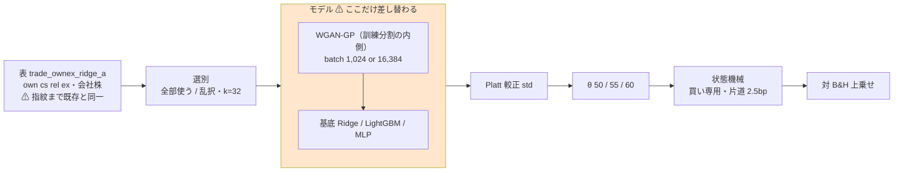
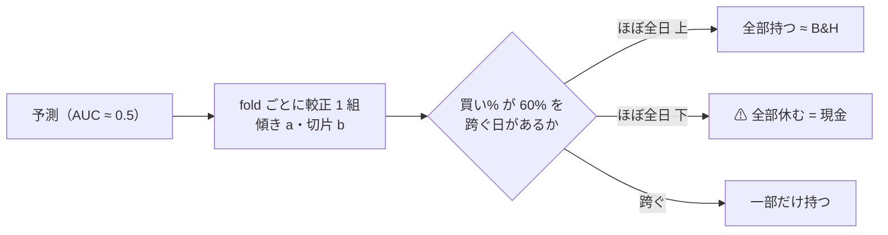
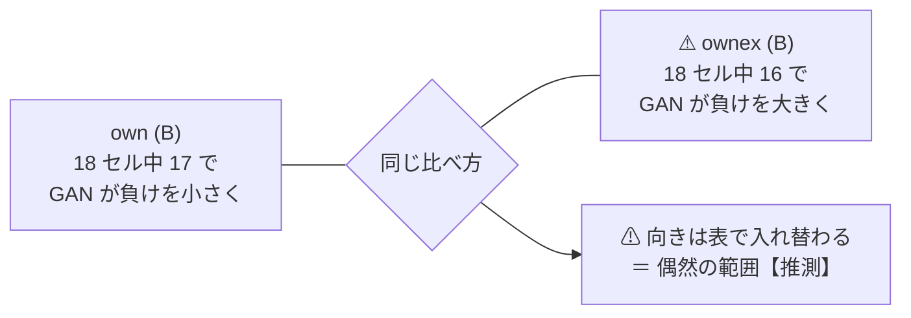

# GAN 増強 3 種 × 閾値売買 × ownex（batch 1,024 / 16,384）— ⚠ **36 行とも「落とす」**

⚠ **結論: 36 行（3 モデル × 2 形式 × 3 θ × batch 2 水準）とも「落とす」。** 上乗せは **−69.93 〜 −1,676.53bp/fold** で、⚠ **B&H を超えた行は 1 つも無い**。
⚠ **これで「GAN 増強 × 閾値売買」は own・ownex とも埋まり、モデルの軸は閉じた。**
⚠ **own の記録で見えた「(B) では GAN 増強が負けを小さくする向き」は ownex では再現しなかった**（§2。18 セル中 16 セルで逆向き）。

| batch | 実施日 | 判定 |
| --- | --- | --- |
| **1,024**（2026-09-09 に事前固定した既定） | 2026-09-14〜15 | ⚠ **18 行とも落とす**（上乗せ −69.93 〜 −1,676.53bp） |
| **16,384**（`…+GAN増強(batch16k)`・別の鍵） | 2026-09-15 | ⚠ **18 行とも落とす**（上乗せ −289.60 〜 −1,405.52bp） |

プラン: [gan-threshold-ownex.md](../../plans/archive/gan-threshold-ownex.md) ／ own の記録: [gan-threshold-trading.md](gan-threshold-trading.md) ／ 規約: [rules.md 13 章](feature-discovery/rules.md)・[14-10](feature-discovery/rules.md) ／ 台帳: [ledger.md](feature-discovery/ledger.md)

> ⚠ **これは投資助言ではなく調査資料である。** ⚠ **数字はすべて【実測】**（2026-09-14〜15）。【推測】と書いたものだけが例外。
> ⚠ **own の数字と直接比べない**（[13-8](feature-discovery/rules.md)。表・銘柄・k・embargo が違う）。並べるのは「向き」だけ。

---

## 0. 何をやったか

own で閉じた `+GAN増強` 3 種 × batch 2 水準を、⚠ **ownex の表（`own cs rel ex`・会社株だけ）でそのまま回した。**
⚠ **回した理由は「効くはず」ではなく、回さない理由が無いから**（[14-10 規約 1](feature-discovery/rules.md)）。batch を両方回したのは利用者の決定（2026-09-14）。

| | batch 1,024 | batch 16,384 |
| --- | ---: | ---: |
| 本番 | 6（3 モデル × (A)(B)） | 6 |
| leak 対照 | 6 | 6 |
| 数えた試行 | 18 | 18 |

⚠ **`n_trials` 475 → 511（＋36）**。⚠ **プラン §0-2 の見込みと一致。**

> この図の主張: ⚠ **既存 ownex 経路のうち差し替わったのは「モデル」の箱 1 つだけ。** 表・選別・較正・状態機械・基準線は既存 ownex 6 本と同一（§6 の検算 6・8・11）。

| 固定したもの | 値 |
| --- | --- |
| config | ⚠ **`trade_ownex_lgbm_a/b` と `name`・`model` 以外は 1 key も違わない**（`tomllib` で全 key 照合） |
| GAN の形 | WGAN-GP・300 epoch・幅 128・潜在 32・α = 100%・合成行は前（2026-09-09 に事前固定） |
| 門 | ⚠ **フラグを付けずに回した**（2026-09-14 から既定が診断）。⚠ **門の修正後に回した最初の本番**で、24 本とも `gate.mode = "診断"` |
| デバイス | ⚠ **`AIL_TORCH_DEVICE=cuda` を明示した**（`env.json` に残らないのでここに書く） |
| 並列 | 4 本同時（⚠ 実行の回し方であって手法ではない） |

門の値（`checks.json` の `gate`。⚠ **(A) プール形式で 1 回だけ測るので (A)(B) で同じ値**）:

| モデル | batch 1,024: holdout AUC | 買い% 幅 | batch 16k: holdout AUC | 買い% 幅 |
| --- | ---: | ---: | ---: | ---: |
| Ridge+ | 0.4884 | 4.69 点 | 0.4991 | 8.33 点 |
| LightGBM+ | 0.5047 | 2.63 点 | ⚠ **0.5221** | 3.88 点 |
| MLP+ | 0.5085 | 4.30 点 | 0.5171 | 5.24 点 |

⚠ **6 つとも門前**（LightGBM+(16k) は AUC 0.52 を超えたが幅 20 点に届かない）。⚠ **本番 12 本は `forced: true` で全部回った** ＝ ⚠ **修正前なら 12 本とも `result.csv` を書かずに終わっていた。**

---

## 1. 結果 — ⚠ **36 行とも「落とす」**

⚠ **判定は対 B&H の上乗せ**（[13-7](feature-discovery/rules.md)）。ownex の B&H は **＋1,650.62bp/fold**。
DSR は ⚠ **各実行が終わった時点の `n_trials`（478〜511）で出ている。** ⚠ **判定式に DSR は入らない。**

### 1-1. batch 1,024

| モデル | 形式 | θ | 純利 bp/fold | ⚠ **上乗せ bp/fold** | t | fold の符号 | 取引/fold | 保有日率 | DSR | 判定 |
| --- | --- | ---: | ---: | ---: | ---: | :---: | ---: | ---: | ---: | --- |
| Ridge+ | (A) 共通 | 50 | ＋1,331.48 | **−319.14** | −1.09 | 2/5 ＋＋−−− | 935 | 0.812 | 0.058 | **落とす** |
| Ridge+ | (A) 共通 | 55 | ＋932.55 | **−718.06** | −1.82 | 1/5 0＋−−− | 72 | 0.543 | 0.029 | **落とす** |
| Ridge+ | (A) 共通 | 60 | ＋502.76 | **−1,147.85** | −2.55 | 0/5 −−−−− | 16 | 0.216 | 0.011 | **落とす** |
| LightGBM+ | (A) 共通 | 50 | ＋880.47 | **−770.15** | −1.76 | 0/5 00−−− | 394 | 0.437 | 0.025 | **落とす** |
| LightGBM+ | (A) 共通 | 55 | ＋792.37 | **−858.25** | −2.33 | 0/5 0−−−− | 98 | 0.250 | 0.026 | **落とす** |
| LightGBM+ | (A) 共通 | 60 | ＋320.23 | **−1,330.39** | −2.79 | 0/5 −−−−− | 19 | 0.030 | 0.019 | **落とす** |
| MLP+ | (A) 共通 | 50 | ＋1,244.00 | **−406.61** | −2.45 | 0/5 0−−−− | 860 | 0.728 | 0.053 | **落とす** |
| MLP+ | (A) 共通 | 55 | ＋1,580.68 | **−69.93** | −0.35 | 1/5 0−−−＋ | 71 | 0.751 | 0.103 | **落とす** |
| MLP+ | (A) 共通 | 60 | ⚠ **−25.91** | **−1,676.53** | −3.84 | 0/5 −−−−− | 12 | 0.111 | 0.001 | **落とす** |
| Ridge+ | (B) 銘柄別 | 50 | ＋893.62 | **−756.99** | −4.71 | 0/5 −−−−− | 1,166 | 0.560 | 0.054 | **落とす** |
| Ridge+ | (B) 銘柄別 | 55 | ＋959.91 | **−690.71** | −3.57 | 0/5 −−−−− | 432 | 0.512 | 0.078 | **落とす** |
| Ridge+ | (B) 銘柄別 | 60 | ＋721.66 | **−928.96** | −3.43 | 0/5 −−−−− | 284 | 0.378 | 0.045 | **落とす** |
| LightGBM+ | (B) 銘柄別 | 50 | ＋799.67 | **−850.95** | −5.41 | 0/5 −−−−− | 1,574 | 0.588 | 0.055 | **落とす** |
| LightGBM+ | (B) 銘柄別 | 55 | ＋791.77 | **−858.84** | −4.11 | 0/5 −−−−− | 768 | 0.549 | 0.048 | **落とす** |
| LightGBM+ | (B) 銘柄別 | 60 | ＋714.73 | **−935.88** | −3.55 | 0/5 −−−−− | 447 | 0.411 | 0.050 | **落とす** |
| MLP+ | (B) 銘柄別 | 50 | ＋946.16 | **−704.45** | −3.02 | 0/5 −−−−− | 1,623 | 0.554 | 0.083 | **落とす** |
| MLP+ | (B) 銘柄別 | 55 | ＋958.13 | **−692.48** | −2.59 | 0/5 −−−−− | 590 | 0.528 | 0.110 | **落とす** |
| MLP+ | (B) 銘柄別 | 60 | ＋800.63 | **−849.98** | −2.71 | 0/5 −−−−− | 312 | 0.420 | 0.100 | **落とす** |

### 1-2. batch 16,384

| モデル | 形式 | θ | 純利 bp/fold | ⚠ **上乗せ bp/fold** | t | fold の符号 | 取引/fold | 保有日率 | DSR | 判定 |
| --- | --- | ---: | ---: | ---: | ---: | :---: | ---: | ---: | ---: | --- |
| Ridge+(16k) | (A) 共通 | 50 | ＋1,171.61 | **−479.01** | −1.37 | 2/5 −＋−−＋ | 1,486 | 0.752 | 0.041 | **落とす** |
| Ridge+(16k) | (A) 共通 | 55 | ＋941.44 | **−709.17** | −1.71 | 1/5 0＋−−− | 208 | 0.589 | 0.029 | **落とす** |
| Ridge+(16k) | (A) 共通 | 60 | ＋245.09 | **−1,405.52** | −3.42 | 0/5 −−−−− | 39 | 0.293 | 0.003 | **落とす** |
| LightGBM+(16k) | (A) 共通 | 50 | ＋1,101.63 | **−548.98** | −1.37 | 0/5 0−−−− | 536 | 0.568 | 0.043 | **落とす** |
| LightGBM+(16k) | (A) 共通 | 55 | ＋902.58 | **−748.04** | −1.44 | 1/5 0−−−＋ | 28 | 0.416 | 0.028 | **落とす** |
| LightGBM+(16k) | (A) 共通 | 60 | ＋477.30 | **−1,173.32** | −2.14 | 1/5 ＋−−−− | 19 | 0.228 | 0.009 | **落とす** |
| MLP+(16k) | (A) 共通 | 50 | ＋1,170.84 | **−479.77** | −1.16 | 1/5 0−＋−− | 1,996 | 0.677 | 0.049 | **落とす** |
| MLP+(16k) | (A) 共通 | 55 | ＋1,268.11 | **−382.51** | −1.68 | 1/5 0−−−＋ | 153 | 0.641 | 0.068 | **落とす** |
| MLP+(16k) | (A) 共通 | 60 | ＋1,361.01 | **−289.60** | −1.83 | 2/5 ＋−−−＋ | 48 | 0.536 | 0.103 | **落とす** |
| Ridge+(16k) | (B) 銘柄別 | 50 | ＋895.10 | **−755.52** | −6.00 | 0/5 −−−−− | 1,122 | 0.558 | 0.053 | **落とす** |
| Ridge+(16k) | (B) 銘柄別 | 55 | ＋979.43 | **−671.19** | −3.79 | 0/5 −−−−− | 428 | 0.502 | 0.080 | **落とす** |
| Ridge+(16k) | (B) 銘柄別 | 60 | ＋771.61 | **−879.00** | −3.66 | 0/5 −−−−− | 286 | 0.397 | 0.053 | **落とす** |
| LightGBM+(16k) | (B) 銘柄別 | 50 | ＋915.68 | **−734.94** | −4.50 | 0/5 −−−−− | 1,617 | 0.600 | 0.075 | **落とす** |
| LightGBM+(16k) | (B) 銘柄別 | 55 | ＋756.34 | **−894.27** | −5.09 | 0/5 −−−−− | 737 | 0.542 | 0.040 | **落とす** |
| LightGBM+(16k) | (B) 銘柄別 | 60 | ＋802.75 | **−847.86** | −4.85 | 0/5 −−−−− | 419 | 0.417 | 0.065 | **落とす** |
| MLP+(16k) | (B) 銘柄別 | 50 | ＋987.20 | **−663.42** | −2.69 | 0/5 −−−−− | 1,617 | 0.557 | 0.089 | **落とす** |
| MLP+(16k) | (B) 銘柄別 | 55 | ＋1,014.82 | **−635.79** | −2.46 | 0/5 −−−−− | 626 | 0.516 | 0.126 | **落とす** |
| MLP+(16k) | (B) 銘柄別 | 60 | ＋850.33 | **−800.28** | −2.78 | 0/5 −−−−− | 347 | 0.405 | 0.122 | **落とす** |

- ⚠ **(B) の 18 行はすべて 0/5**（5 fold とも B&H に負け）。⚠ **(A) で正の fold があるのは 18 行中 10 行だが、どれも 2/5 まで**
- ⚠ **MLP+ (A) θ=60（1,024）は純利そのものが負**（−25.91bp/fold）＝ ⚠ **現金で持っていたほうがましだった**
- ⚠ **fold の符号の `0` は「63 → 48 社すべてが全日保有で B&H と 1 ビットも違わなかった fold」**（own の記録 §1-3 と同じ）。⚠ **引き分けではなく「B&H と同じことをした」**

### 1-3. ⚠ (A) θ=60 は fold 単位で「全部持つ / 全部休む」に振れる — ⚠ **own では 16k が潰れたが、ownex では 1,024 が潰れた**

own では ⚠ **16k (A) θ=60 が「ほとんど建てない」に潰れた**（Ridge+(16k) 保有日率 0.007）。⚠ **ownex では逆に 1,024 側で起きた。**

`result.csv`（全部使う・θ=60）と `fitted/calibration_f*.json` の実測:

| 実行 | fold 別の保有日率 | 較正の傾き `a`（fold 1〜5） |
| --- | --- | --- |
| Ridge+ (A) 1,024 | 0.92 / 0.04 / 0.12 / 0.00 / 0.00 | −6.4 / 9.3 / 13.8 / −2.1 / −8.7 |
| Ridge+(16k) (A) | 0.76 / 0.52 / 0.07 / 0.12 / 0.00 | −7.6 / 19.1 / 30.4 / −19.4 / −3.2 |
| ⚠ **LightGBM+ (A) 1,024** | ⚠ **0.00 / 0.00 / 0.00 / 0.00 / 0.15** | 42.9 / −2.6 / 14.8 / 145.9 / −170.1 |
| LightGBM+(16k) (A) | 0.95 / 0.19 / 0.00 / 0.00 / 0.00 | 40.3 / 38.3 / 9.2 / 44.8 / 9.0 |
| ⚠ **MLP+ (A) 1,024** | ⚠ **0.00 / 0.07 / 0.00 / 0.47 / 0.01** | −1.5 / 23.1 / 7.5 / −39.7 / 17.6 |
| MLP+(16k) (A) | 0.89 / 0.06 / 0.00 / 0.94 / 0.79 | 55.5 / 44.7 / −11.2 / −60.2 / 19.0 |

> この図の主張: ⚠ **(A) は 1 fold に較正が 1 組しかないので、その 1 組の置き場所で fold 全体が「全部持つ」か「全部休む」に倒れる。** batch はその置き場所を揺らすだけ。

⚠ **だから「16k は (A) θ=60 を潰す」という own の読みは batch の性質ではなかった。** ⚠ **どちらの batch でも起き、どの fold で起きるかが違うだけ**である。
⚠ **傾きの符号が fold で入れ替わる**（AUC ≈ 0.5 の予測を較正しているので自然な振る舞い）。⚠ **理由の切り分けは測っていない**【推測の域】。

---

## 2. ⚠ 素のモデルと並べる — ⚠ **own の「(B) で負けが小さくなる向き」は再現しなかった**

⚠ **同じ表・同じ fold・同じ θ・同じ選別・同じ種で、GAN 増強の有無だけが違う組**（13-8 の橋渡しの形）。⚠ **B&H が同じなので、上乗せの差 ＝ 純利の差。** fold ごとの差 5 本から t を出した。
比べる相手は `2026-09-13` の `trade_ownex_{ridge,lgbm,mlp}_{a,b}`（較正 `std`）。

| 形式 | モデル | batch | θ=50 差 (t, 正の fold) | θ=55 | θ=60 |
| --- | --- | --- | --- | --- | --- |
| (A) | Ridge | 1,024 | ＋142.2 (＋0.55, 3/5) | −162.7 (−0.30, 2/5) | −309.9 (−1.22, 2/5) |
| (A) | Ridge | 16k | −17.7 (−0.17, 2/5) | −153.8 (−1.02, 1/5) | −567.6 (−1.85, 0/5) |
| (A) | LightGBM | 1,024 | ⚠ **−838.8** (−1.62, 0/5) | −783.6 (−1.56, 1/5) | −188.6 (−0.73, 1/5) |
| (A) | LightGBM | 16k | ⚠ **−617.7** (−1.13, 1/5) | −673.4 (−1.93, 0/5) | −31.5 (−0.04, 1/5) |
| (A) | MLP | 1,024 | ＋69.0 (＋0.29, 3/5) | ＋242.0 (＋1.27, 3/5) | −974.0 (−1.68, 0/5) |
| (A) | MLP | 16k | −4.2 (−0.01, 3/5) | −70.6 (−0.24, 1/5) | ＋412.9 (＋1.94, 4/5) |
| (B) | Ridge | 1,024 | −118.5 (−0.98, 1/5) | −80.8 (−1.32, 1/5) | −24.4 (−0.42, 2/5) |
| (B) | Ridge | 16k | −117.1 (−1.56, 1/5) | −61.2 (−1.17, 1/5) | ＋25.5 (＋0.59, 3/5) |
| (B) | LightGBM | 1,024 | −223.0 (−1.79, 1/5) | −142.3 (−1.08, 2/5) | −13.4 (−0.16, 3/5) |
| (B) | LightGBM | 16k | −107.0 (−0.66, 2/5) | −177.8 (−1.43, 2/5) | ＋74.6 (＋0.61, 4/5) |
| (B) | MLP | 1,024 | −111.9 (−0.65, 2/5) | −183.1 (−1.18, 2/5) | −248.3 (−1.79, 1/5) |
| (B) | MLP | 16k | −70.9 (−0.39, 3/5) | −126.4 (−1.57, 2/5) | −198.6 (−1.47, 1/5) |

> この図の主張: ⚠ **同じ比べ方で、own と ownex の (B) の向きが逆になった。** 片方だけを見て「GAN 増強は (B) で効く」と読むと外す。

- ⚠ **(B) は 18 セル中 16 セルで GAN 増強が負けを大きくした**（own では 17 セルで小さくした）。⚠ **own の記録 §2 で「そう読んではいけない理由が 4 つある」と書いたとおりになった**
- ⚠ **(A) は 18 セルで正 4・負 14**
- ⚠ **|t| が 2 を超えたセルは 36 セル中 0**（最大は MLP 16k (A) θ=60 の ＋1.94）
- ⚠ **素の LightGBM (A) θ=50 は ownex 6 本で唯一 B&H を超えた行**（＋68.7bp・保留）だが、⚠ **GAN 増強を足すと −838.8 / −617.7bp 悪化して落とすになった**
- ⚠ **own と ownex を合わせても GAN 増強の向きは揃わない**【推測】。⚠ **確かめるなら別の試行として事前に固定する**（own の記録 §7 と同じ）

---

## 3. ⚠ batch の効き — ⚠ **(B) の fold 1・2 はまた 1 ビットも違わなかった**

### 3-1. (B) の fold 1・2 は 1,024 と 16k で同一【実測】

`result.csv` の fold ごとの 純利・粗利・取引回数・保有日率・乱択ゲート純利 を、全部使う・乱択 × 3 θ で突き合わせた。

| モデル | (B) fold 1 | fold 2 | fold 3 | fold 4 | fold 5 | (A) |
| --- | :---: | :---: | :---: | :---: | :---: | --- |
| Ridge | ✅ 同一 | ✅ 同一 | 差 最大 408.9bp | 495.5bp | 240.7bp | ⚠ 5 fold とも違う |
| LightGBM | ✅ 同一 | ✅ 同一 | 321.1bp | 415.0bp | 570.2bp | ⚠ 5 fold とも違う |
| MLP | ✅ 同一 | ✅ 同一 | 382.3bp | 290.4bp | 385.6bp | ⚠ 5 fold とも違う |

⚠ **own と同じ理由**（1 銘柄の訓練が 1,024 行に届かない fold では `min(batch, 行)` が同じになる）。⚠ **GAN は GPU 上でも決定的**であることが別の表でも再現した。
⚠ **(B) の「batch の効き」は fold 3〜5 の 3 本からしか出ていない。**

### 3-2. 上乗せの差（16k − 1,024）

| モデル | 形式 | θ=50 | θ=55 | θ=60 |
| --- | --- | ---: | ---: | ---: |
| Ridge | (A) | −159.87 | ＋8.89 | −257.67 |
| LightGBM | (A) | ＋221.17 | ＋110.21 | ＋157.07 |
| MLP | (A) | −73.16 | −312.58 | ⚠ ＋1,386.93 |
| Ridge | (B) | ＋1.47 | ＋19.52 | ＋49.96 |
| LightGBM | (B) | ＋116.01 | −35.43 | ＋88.02 |
| MLP | (B) | ＋41.03 | ＋56.69 | ＋49.70 |

- 18 セルで **正 13・負 5**（own は正 9・負 9）
- ⚠ **最大の ＋1,386.93（MLP (A) θ=60）は 16k が良かったのではなく、1,024 が §1-3 の「全部休む」に倒れたから**
- ⚠ **(B) は 9 セル中 8 セルが正だが、幅は −35〜＋116bp と小さく、fold 3〜5 の 3 本分しか無い**
- ⚠ **own と合わせた 36 セルは正 22・負 14。** ⚠ **batch は成績を一貫して動かさない**という own の読みは変わらない【推測】。⚠ **16k を 1,024 の代わりにはしない**（別の試行）

---

## 4. leak 対照 — ⚠ **跳ねた（配線は健全）**

| モデル | batch | 形式 | θ=50 の上乗せ | t | fold の符号 | θ=55 | θ=60 |
| --- | --- | --- | ---: | ---: | :---: | ---: | ---: |
| Ridge+ | 1,024 | (A) | ⚠ **＋23,368.92** | 20.50 | 5/5 | ＋23,353.25 | ＋23,335.50 |
| LightGBM+ | 1,024 | (A) | ⚠ **＋23,813.96** | 19.33 | 5/5 | ＋23,815.86 | ＋23,816.14 |
| MLP+ | 1,024 | (A) | ⚠ **＋23,205.25** | 21.41 | 5/5 | ＋23,188.65 | ＋23,158.25 |
| Ridge+ | 1,024 | (B) | ⚠ **＋23,194.21** | 19.68 | 5/5 | ＋23,182.36 | ＋23,163.19 |
| LightGBM+ | 1,024 | (B) | ⚠ **＋23,600.48** | 18.84 | 5/5 | ＋23,597.88 | ＋23,596.42 |
| MLP+ | 1,024 | (B) | ⚠ **＋10,945.62** | 9.49 | 5/5 | ＋10,705.46 | ＋10,458.46 |
| Ridge+(16k) | 16k | (A) | ⚠ **＋23,315.22** | 17.89 | 5/5 | ＋23,313.33 | ＋23,300.38 |
| LightGBM+(16k) | 16k | (A) | ⚠ **＋23,745.64** | 19.18 | 5/5 | ＋23,748.48 | ＋23,749.13 |
| MLP+(16k) | 16k | (A) | ⚠ **＋23,572.82** | 18.94 | 5/5 | ＋23,573.85 | ＋23,571.16 |
| Ridge+(16k) | 16k | (B) | ⚠ **＋23,353.52** | 20.28 | 5/5 | ＋23,349.27 | ＋23,338.62 |
| LightGBM+(16k) | 16k | (B) | ⚠ **＋23,628.69** | 19.00 | 5/5 | ＋23,626.97 | ＋23,624.93 |
| MLP+(16k) | 16k | (B) | ⚠ **＋15,757.66** | 8.04 | 5/5 | ＋15,508.78 | ＋15,244.69 |

⚠ **MLP+ (B) だけ跳ねが小さい**（1,024 は ＋10,946・16k は ＋15,758）。⚠ **これは配線の不具合ではない**と読む。理由は 3 つ。

| # | 根拠【実測】 |
| ---: | --- |
| 1 | ⚠ **素の MLP (B) の ownex leak も他より小さい**（＋19,250・t 13.71。素の Ridge・LightGBM と MLP (A) は ＋23,004〜23,869） |
| 2 | ⚠ **own でも MLP+ (B) の leak が最小だった**（＋20,704。own の記録 §4） |
| 3 | ⚠ **それでも 5/5・t ≥ 7.35 で跳ねている**。基準線は既存 ownex と 1 ビットも違わない（§6 の検算 11） |

⚠ **小さくなる理由は測っていない**。⚠ **合成行は `LEAK_` 列と y の関係を完全には写さないので、1 銘柄の少ない訓練で MLP の学ぶ関係が薄まる**、という読みは【推測】。

---

## 5. ⚠ 回す前に書いた失敗モード（プラン §5）のうち、実在したもの

| # | 失敗モード | 実在したか |
| ---: | --- | --- |
| 1 | 費用が見積りを大きく超える | ⚠ **超えなかった**（§5-1。壁時計 ＋5%） |
| 2 | ⚠ (B) fold 1 の較正が `train` に落ちる | ⚠ **実在した。** (B) の 6 実行すべてで ⚠ **fold 1 は `train` 48/48・fold 2 は `holdout` 42 ／ `train` 6・fold 3〜5 は `holdout` 48**。⚠ **消せない限界として記録する**（13-6 の 5） |
| 3 | ⚠ (B) fold 1・2 が 1,024 と 16k で bit 一致 | ⚠ **実在した**（§3-1） |
| 4 | ⚠ 16k (A) θ=60 が「ほとんど建てない」に潰れる | ⚠ **16k では起きず、1,024 で起きた**（§1-3）。⚠ **batch の性質ではなかった** |
| 5 | 上乗せが正で fold 5/5 が揃う | 実在しなかった |
| 6 | leak 対照が跳ねない | 実在しなかった（§4） |
| 7 | GPU を取り合って落ちる | 実在しなかった（24 本とも exit 0） |

### 5-1. 費用 — ⚠ **見積りが初めて ±5% に収まった**

| 1 本（4 本並列） | プランの見込み【推測】 | ⚠ 実測 |
| --- | ---: | ---: |
| 1,024 (B) | 約 17,200 秒 | **17,055〜17,281 秒** |
| 1,024 (A) | 約 12,500 秒 | **12,540〜12,972 秒** |
| 16k (B) | 約 10,400 秒 | **10,295〜11,476 秒** |
| 16k (A) | 約 1,400 秒 | **1,313〜1,593 秒** |
| ⚠ **24 本の壁時計** | 約 17 時間 | ✅ **17 時間 51 分**（2026-09-14 15:21:17 → 09-15 09:12:55） |

⚠ **own の実測に行数・銘柄数の比を掛けるだけで当たった** ＝ ⚠ **起動律速の読み（(A) は行数、(B) は銘柄数に比例）が正しかった。**
⚠ **列が 35 → 124 に増えた分は、ほとんど効いていない**（プラン §2 で「未計上で重くなる向き」と書いたもの）。

---

## 6. 台帳への反映と検算

| # | 検算 | 結果 |
| ---: | --- | --- |
| 1 | `pytest -q tests` | ✅ **294 件 pass** |
| 2 | ⚠ **回す前の台帳の行が消えず、数字が変わらない** | ✅ **コミット済みの台帳（`HEAD`）の表の行 1,562 行を節ごとに突き合わせ（`再現`・`実行` の 2 列を除く）、⚠ 変わったのは §6 の生成文 1 行（落とした 398 → 434 行）だけ**。⚠ **足されたのは 169 行**（§2 台帳 72 ＝ 試行 36 ＋ 乱択の基準線 36 ／ §4 実行の一覧 24 ／ §5 配線の検査 72 ／ §6 の 1 行） |
| 3 | ⚠ **leak 対照が跳ねる** | ✅ **12 本とも 5/5**（§4） |
| 4 | **n_trials 475 → 511**（＋36） | ✅ **一致**（台帳の冒頭と、最後の本番 `mlpgan16k_b` の `checks.json`） |
| 5 | `checks.json` の `calibration` が `std` | ✅ **24 本とも** |
| 6 | ⚠ **`inputs.json` が既存 `trade_ownex_lgbm_a`（本番）／ `_leak` と全 key 一致** | ✅ **24 本とも差 0 key** |
| 7 | 3 θ とも台帳に載る | ✅ 36 行すべて（台帳の判定も 36 行とも「落とす」） |
| 8 | ⚠ **config が既存と `name`・`model` 以外で違わない** | ✅ 24 本とも（実行ディレクトリの `config.json` どうしで照合） |
| 9 | ⚠ **`result.csv` がある** | ✅ **24 本とも** |
| 10 | ⚠ **`gate.mode` が `"診断"`、門前があれば `forced: true`** | ✅ **24 本とも「診断」**。本番 12 本は `blocked = [全部使う]` で `forced: true`、leak 12 本は `blocked = []` |
| 11 | ⚠ **基準線（B&H・直前符号）が既存 ownex 実行と一致** | ✅ **24/24**（本番は `trade_ownex_lgbm_{a,b}`、leak は `_leak` と、fold 行が 1 ビットも違わない） |
| 12 | ⚠ **`env.json` の `git_commit` が実際に走ったコードを指す** | ⚠ **20 本は `a9967ff`、最初の 4 本は `984ad75`。** 下記 |

### 6-1. ⚠ 検算 12: キューの途中でコミットしたので、`git_commit` が 2 つに割れた

| 実行 | `git_commit` |
| --- | --- |
| 最初に起動した 4 本（`ridgegan_b`・`lgbmgan_b` と各 `_leak`。2026-09-14 15:21） | `984ad75` |
| 残る 20 本（20:05 以降に起動） | ⚠ **`a9967ff`** |

⚠ **`runs.Run` は実行を起動した瞬間の `git rev-parse HEAD` を書く。** キューは 1 本ごとに新しいプロセスを起こすので、⚠ **走行中（2026-09-14 夕方）に用語集の変更を `a9967ff` でコミットしたあとに起動した 20 本がそちらを指した。**

| 確かめたこと | 結果 |
| --- | --- |
| `984ad75` → `a9967ff` の差分 | ⚠ **文書 5 ファイルだけ**（`DONE.md`・`TODO.md`・`dashboard/glossary.toml`・`rules.md`・プラン）。⚠ **`experiments/feature-discovery/` のコードと config は 1 バイトも違わない** |
| 実際に同じ計算をしたか | ✅ **(B) の fold 1・2 が 1,024（`984ad75` と `a9967ff` の混在）と 16k（`a9967ff`）で bit 一致**（§3-1） |

⚠ **再現はできる。** ⚠ **ただし次からはキューの走行中にコミットしない**（コードに触れないコミットでも記録が割れる）。

### 6-2. 代償

⚠ **SR0 は `n_trials` 478 → 511 で 0.071609 → 0.072083（＋0.66%）**（`n_obs` 1,801 日。`checks.json` の実測）。
⚠ **台帳の総数は 落とす 398 → 434 行・保留 77 行（変わらず）・採る 0 件**（試行 511 行 ＋ 基準線 332 行）。

---

## 7. ⚠ 残ったもの・広げていないもの

| | 状態 |
| --- | --- |
| ⚠ **モデルの軸（own・ownex）** | ✅ **閉じた。** Ridge・LightGBM・MLP とその `+GAN増強` 3 種（batch 1,024・16k）が own a/b・ownex a/b で揃った |
| **選別の軸**（閾値売買に移していない 7 手法） | ⚠ **未実施**（`TODO.md` の「GPU 系を閾値売買でも回せるようにする」の (2)） |
| **(A) θ=60 が fold 単位で倒れる理由**（§1-3） | ⚠ **測っていない**（較正の傾きの符号が fold で入れ替わるところまで） |
| **MLP+ (B) の leak の跳ねが小さい理由**（§4） | ⚠ **測っていない**【推測は §4】 |
| **GAN 増強の向き**（own (B) で負けを小さく・ownex (B) で大きく） | ⚠ **確かめていない。** 確かめるなら別の試行として事前に固定する |

⚠ **本タスクは検出限界を改善しない。** fold 約 340 日 × 5 では上乗せ t は 1 前後までしか出ない
（[validation-power.md](feature-discovery/validation-power.md)）。⚠ **MLP+ (A) θ=55 の −69.93bp（t −0.35）は「勝っていない」であって「引き分けを検出した」ではない。**

## 8. ⚠ 2026-09-17 — `ex_` 層の修正後に 24 本を同じ鍵で回し直している

⚠ **本書の 36 行は `ex_` 層の穴 2 つ（[daily-data-sources.md §14-2](daily-data-sources.md)）を塞ぐ前のコードの数字である。**
2026-09-17 に、コードを凍結した worktree（HEAD `696cf7b`）から 24 本（本番 12 ＋ leak 12）を手間の小さい順に回し直している（約 30 時間・GPU。[daily-data-sources.md §16-4](daily-data-sources.md)）。
⚠ **最初に終わった `trade_ownex_ridgegan16k_a` は純利が最大 453bp 動いた**（θ=50 上乗せ −479 → −585・落とすのまま）。⚠ **終わったら差分表と、36 行の判定が変わったかをここに追記する**（同じ鍵なので n_trials は動かない）。
