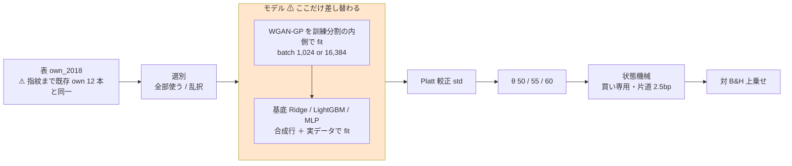
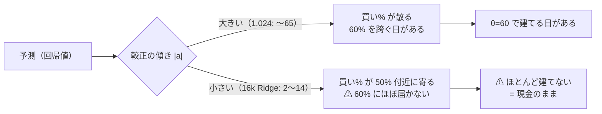
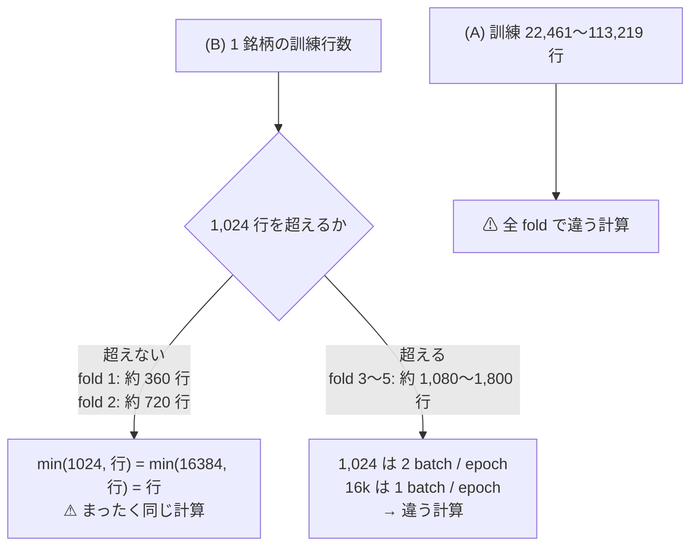

# GAN 増強 3 種 × 閾値売買（own・2018・batch 1,024 / 16,384）— モデルの軸の最後の空白を埋めた

⚠ **結論: 36 行（3 モデル × 2 形式 × 3 θ × batch 2 水準）とも「落とす」。** 上乗せは **−36.70 〜 −1,638.70bp/fold** で、⚠ **B&H を超えた行は 1 つも無い**。
⚠ **これで「GAN 増強は閾値売買で未実施」を「GAN 増強は閾値売買（own）でも効かない」と区別できるようになった。**

| batch | 実施日 | 節 | 判定 |
| --- | --- | --- | --- |
| **1,024**（2026-09-09 に事前固定した既定） | 2026-09-13〜14 | §1 | ⚠ **18 行とも落とす**（上乗せ −68.96 〜 −1,050.96bp） |
| **16,384**（速さのために足した水準・別の鍵） | 2026-09-14 | §1 | ⚠ **18 行とも落とす**（上乗せ −36.70 〜 −1,638.70bp） |

プラン: [gan-threshold-trading.md](../../plans/archive/gan-threshold-trading.md) ／ 規約: [rules.md 13 章](feature-discovery/rules.md)（閾値つき売買）・[14-10](feature-discovery/rules.md)（空白は積極的に埋める）／ 台帳: [ledger.md](feature-discovery/ledger.md) ／ 毎日往復の GAN 増強: [gpu-models.md §4](gpu-models.md)

> ⚠ **これは投資助言ではなく調査資料である。** ⚠ **数字はすべて【実測】**（2026-09-13〜14）。【推測】と書いたものだけが例外。
> ⚠ **毎日往復の GAN 増強の数字（gpu-models.md §4）と直接比べない**（[13-8](feature-discovery/rules.md)。物差しが違う）。

---

## 0. 何をやったか

閾値売買の台帳で ⚠ **`+GAN増強` は 0 行だった**（Ridge+ と LightGBM+ は毎日往復に 3 行ずつ、⚠ **MLP+ は 1 度も回っていなかった**）。
⚠ **その空白だけを埋めた。** 回した理由は「効くはず」ではなく、⚠ **回さない理由が無いから**である（[14-10 規約 1](feature-discovery/rules.md)）。

| | batch 1,024 | batch 16,384 |
| --- | ---: | ---: |
| 本番 | 6（3 モデル × (A)(B)） | 6 |
| leak 対照 | 6 | 6 |
| 数えた試行 | 18（3 モデル × 2 形式 × 3 θ） | 18 |

⚠ **`n_trials` 439 → 475（＋36）**。⚠ **事前の見積もり（プラン §0-4）と一致**。

⚠ **回すと決めたのは結果を見る前**（[14-10 規約 3](feature-discovery/rules.md)。固定した内容はプラン §0-1〜§0-4）。
⚠ **batch 16,384 は費用の実測（プラン §5-5）を見て利用者が「両方回す」と決めた水準**で、⚠ **別のモデル名 `…+GAN増強(batch16k)` で台帳の鍵を割った**（[13-9 の 5](feature-discovery/rules.md)）。

足したのは config 12 本と、`ail/models/gan.py` の batch を `ctx["gan_batch"]` で受ける変更だけである。
⚠ **config は既存の `trade_own_{ridge,lgbm,mlp}_{a,b}.toml` と `model`・`name` 以外で 1 key も違わない**【実測。`tomllib` で全 key を突き合わせた】。
⚠ **だから差はモデルの差（と batch の差）として読める**（[13-8](feature-discovery/rules.md) の橋渡しの形）。

> この図の主張: ⚠ **既存の own 経路のうち差し替わったのは「モデル」の箱 1 つだけで、その中に GAN が 1 段増えた。**

| 固定したもの | 値 |
| --- | --- |
| GAN の形 | WGAN-GP・300 epoch・幅 128・潜在 32・α = 100%・合成行は前（2026-09-09 に事前固定） |
| 選別 / k / embargo / 種 | 全部使う ＋ 乱択 / 16 / 0 本 / 0（GAN は seed ＋ 1） |
| 門 | ⚠ **記録するだけ。`--ignore-gate` を全 24 本に付けた**（[14-10 規約 2](feature-discovery/rules.md)）。⚠ **本番 12 本はすべて門前**（下表）。leak 12 本は AUC 0.997〜1.000・幅 100 点で通過 |
| デバイス | ⚠ **`AIL_TORCH_DEVICE=cuda` を明示した**（⚠ **`env.json` に残らないので、ここに書き残す**） |
| 並列 | 4 本同時（プラン §5-2。⚠ **実行の回し方であって手法ではない**） |

門の値（`checks.json` の `gate`。⚠ **門は (A) プール形式で 1 回だけ測るので、同じモデル・同じ batch の (A) と (B) で同じ値になる**）。

| モデル | batch 1,024: holdout AUC | 買い% 幅 | batch 16k: holdout AUC | 買い% 幅 |
| --- | ---: | ---: | ---: | ---: |
| Ridge+ | 0.4988 | 7.08 点 | 0.5043 | 2.59 点 |
| LightGBM+ | 0.5047 | 0.71 点 | 0.5194 | 1.66 点 |
| MLP+ | 0.5059 | 4.54 点 | 0.5062 | 3.41 点 |

⚠ **6 つとも門の要求（AUC 0.52・幅 20 点）に届かない。** ⚠ **それは回さない理由にならない**（14-10 規約 1）。

---

## 1. 結果 — ⚠ **36 行とも「落とす」**

⚠ **判定は対 B&H の上乗せ**（[13-7](feature-discovery/rules.md)）。B&H は **＋1,652.02bp/fold**。
⚠ **純利はどれも正だが、それは B&H が正だからである。** DSR は ⚠ **各実行が終わった時点の `n_trials`（442〜475）で出ている**（§6 の検算 4）。⚠ **判定式に DSR は入らないので採否は変わらない。**

### 1-1. batch 1,024

| モデル | 形式 | θ | 純利 bp/fold | ⚠ **上乗せ bp/fold** | t | fold の符号 | 取引/fold | 保有日率 | DSR | 判定 |
| --- | --- | ---: | ---: | ---: | ---: | :---: | ---: | ---: | ---: | --- |
| Ridge+ | (A) 共通 | 50 | ＋1,252.18 | **−399.83** | −1.28 | 2/5 −＋−−＋ | 1,271 | 0.681 | 0.081 | **落とす** |
| Ridge+ | (A) 共通 | 55 | ＋1,004.69 | **−647.33** | −2.63 | 0/5 −−−−− | 141 | 0.527 | 0.053 | **落とす** |
| Ridge+ | (A) 共通 | 60 | ＋661.76 | **−990.26** | −2.75 | 0/5 −−−−− | 44 | 0.343 | 0.022 | **落とす** |
| LightGBM+ | (A) 共通 | 50 | ＋1,583.05 | **−68.96** | −0.88 | 1/5 0＋−−− | 161 | 0.795 | 0.106 | **落とす** |
| LightGBM+ | (A) 共通 | 55 | ＋915.53 | **−736.49** | −1.67 | 0/5 0−−−− | 80 | 0.484 | 0.031 | **落とす** |
| LightGBM+ | (A) 共通 | 60 | ＋601.06 | **−1,050.96** | −1.78 | 1/5 −−−−＋ | 44 | 0.200 | 0.116 | **落とす** |
| MLP+ | (A) 共通 | 50 | ＋1,101.12 | **−550.90** | −1.58 | 1/5 −＋−−− | 1,263 | 0.708 | 0.051 | **落とす** |
| MLP+ | (A) 共通 | 55 | ＋1,272.37 | **−379.65** | −1.17 | 1/5 −−−−＋ | 154 | 0.665 | 0.076 | **落とす** |
| MLP+ | (A) 共通 | 60 | ＋833.88 | **−818.13** | −2.18 | 1/5 −−−−＋ | 52 | 0.363 | 0.037 | **落とす** |
| Ridge+ | (B) 銘柄別 | 50 | ＋723.68 | **−928.33** | −5.76 | 0/5 −−−−− | 1,669 | 0.536 | 0.034 | **落とす** |
| Ridge+ | (B) 銘柄別 | 55 | ＋909.35 | **−742.66** | −2.81 | 0/5 −−−−− | 439 | 0.480 | 0.078 | **落とす** |
| Ridge+ | (B) 銘柄別 | 60 | ＋746.81 | **−905.21** | −3.48 | 0/5 −−−−− | 199 | 0.397 | 0.056 | **落とす** |
| LightGBM+ | (B) 銘柄別 | 50 | ＋853.77 | **−798.25** | −3.18 | 0/5 −−−−− | 1,337 | 0.561 | 0.047 | **落とす** |
| LightGBM+ | (B) 銘柄別 | 55 | ＋874.26 | **−777.75** | −2.62 | 1/5 −−＋−− | 590 | 0.495 | 0.058 | **落とす** |
| LightGBM+ | (B) 銘柄別 | 60 | ＋641.34 | **−1,010.67** | −3.00 | 0/5 −−−−− | 361 | 0.369 | 0.044 | **落とす** |
| MLP+ | (B) 銘柄別 | 50 | ＋981.09 | **−670.93** | −2.87 | 0/5 −−−−− | 1,577 | 0.575 | 0.099 | **落とす** |
| MLP+ | (B) 銘柄別 | 55 | ＋916.06 | **−735.96** | −2.61 | 0/5 −−−−− | 392 | 0.499 | 0.118 | **落とす** |
| MLP+ | (B) 銘柄別 | 60 | ＋738.26 | **−913.75** | −3.13 | 0/5 −−−−− | 172 | 0.361 | 0.167 | **落とす** |

### 1-2. batch 16,384

| モデル | 形式 | θ | 純利 bp/fold | ⚠ **上乗せ bp/fold** | t | fold の符号 | 取引/fold | 保有日率 | DSR | 判定 |
| --- | --- | ---: | ---: | ---: | ---: | :---: | ---: | ---: | ---: | --- |
| Ridge+(16k) | (A) 共通 | 50 | ＋1,507.05 | **−144.97** | −1.68 | 0/5 00−−− | 299 | 0.797 | 0.088 | **落とす** |
| Ridge+(16k) | (A) 共通 | 55 | ＋973.23 | **−678.78** | −1.51 | 1/5 0−−−＋ | 28 | 0.365 | 0.046 | **落とす** |
| Ridge+(16k) | (A) 共通 | 60 | ＋13.31 | ⚠ **−1,638.70** | −3.75 | 0/5 −−−−− | ⚠ **1** | ⚠ **0.007** | 0.004 | **落とす** |
| LightGBM+(16k) | (A) 共通 | 50 | ＋1,615.31 | **−36.70** | −0.60 | 2/5 0＋−0＋ | 140 | 0.799 | 0.108 | **落とす** |
| LightGBM+(16k) | (A) 共通 | 55 | ＋946.24 | **−705.78** | −1.56 | 1/5 0−−−＋ | 46 | 0.394 | 0.038 | **落とす** |
| LightGBM+(16k) | (A) 共通 | 60 | ＋790.90 | **−861.11** | −1.84 | 1/5 ＋−−−− | 25 | 0.262 | 0.030 | **落とす** |
| MLP+(16k) | (A) 共通 | 50 | ＋1,029.58 | **−622.44** | −1.37 | 2/5 −＋−−＋ | 892 | 0.764 | 0.042 | **落とす** |
| MLP+(16k) | (A) 共通 | 55 | ＋1,081.16 | **−570.86** | −1.32 | 1/5 −−−−＋ | 34 | 0.386 | 0.063 | **落とす** |
| MLP+(16k) | (A) 共通 | 60 | ＋377.53 | ⚠ **−1,274.49** | −3.01 | 0/5 −−−−− | ⚠ **11** | ⚠ **0.093** | 0.032 | **落とす** |
| Ridge+(16k) | (B) 銘柄別 | 50 | ＋837.11 | **−814.91** | −4.17 | 0/5 −−−−− | 1,569 | 0.546 | 0.047 | **落とす** |
| Ridge+(16k) | (B) 銘柄別 | 55 | ＋970.12 | **−681.90** | −2.63 | 0/5 −−−−− | 404 | 0.484 | 0.089 | **落とす** |
| Ridge+(16k) | (B) 銘柄別 | 60 | ＋713.40 | **−938.62** | −3.27 | 0/5 −−−−− | 189 | 0.389 | 0.048 | **落とす** |
| LightGBM+(16k) | (B) 銘柄別 | 50 | ＋873.44 | **−778.57** | −2.88 | 0/5 −−−−− | 1,354 | 0.571 | 0.048 | **落とす** |
| LightGBM+(16k) | (B) 銘柄別 | 55 | ＋725.51 | **−926.50** | −2.86 | 0/5 −−−−− | 620 | 0.481 | 0.035 | **落とす** |
| LightGBM+(16k) | (B) 銘柄別 | 60 | ＋628.66 | **−1,023.35** | −3.50 | 0/5 −−−−− | 354 | 0.362 | 0.041 | **落とす** |
| MLP+(16k) | (B) 銘柄別 | 50 | ＋1,065.95 | **−586.07** | −2.55 | 0/5 −−−−− | 1,618 | 0.577 | 0.129 | **落とす** |
| MLP+(16k) | (B) 銘柄別 | 55 | ＋905.89 | **−746.12** | −3.01 | 0/5 −−−−− | 391 | 0.503 | 0.117 | **落とす** |
| MLP+(16k) | (B) 銘柄別 | 60 | ＋730.95 | **−921.06** | −3.48 | 0/5 −−−−− | 159 | 0.349 | 0.168 | **落とす** |

### 1-3. ⚠ (A) は fold 単位で「全部持つ / 全部休む」に潰れる — MLP の記録と同じ形

⚠ **fold の符号に `0` があるのは偶然ではない。** ⚠ **63 銘柄すべてが全日保有になり、B&H と 1 ビットも違わなかった fold である**
（[mlp-threshold-trading.md §2-1](mlp-threshold-trading.md) と同じ）。LightGBM+ (A) θ=50・55、Ridge+(16k) (A) θ=50・55、LightGBM+(16k) (A) θ=50・55 に出た。
⚠ **「上乗せ 0」は「B&H と同じことをした」という意味であって、「引き分けた」ではない。**

### 1-4. ⚠ 16k の (A) θ=60 は「ほとんど建てない」に潰れた — ⚠ **較正の傾きが寝ている**

⚠ **Ridge+(16k) (A) θ=60 は 1 fold に 1 回しか売買せず、保有日率 0.007。** ⚠ **上乗せ −1,638.70bp は B&H（＋1,652.02）をまるごと取り逃した額**である。
MLP+(16k) (A) θ=60 も保有日率 0.093。⚠ **同じ θ の 1,024 は保有日率 0.343・0.363 だった。**

`per_symbol.csv`（全部使う・θ=60）と `fitted/calibration_f*.json` の実測。

| 実行 | fold 別の保有日率（平均） | 較正の傾き `a`（fold 1〜5） |
| --- | --- | --- |
| Ridge+ (A) 1,024 | 0.98 / 0.20 / 0.00 / 0.54 / 0.00 | −53.2 / 22.6 / 3.1 / −65.5 / 10.6 |
| ⚠ **Ridge+(16k) (A)** | ⚠ **0.01 / 0.00 / 0.00 / 0.03 / 0.00** | ⚠ **−3.7 / 2.0 / 12.7 / −11.8 / 14.2** |
| MLP+ (A) 1,024 | 0.95 / 0.08 / 0.00 / 0.34 / 0.45 | −30.7 / 24.5 / 14.3 / −76.8 / 30.9 |
| ⚠ **MLP+(16k) (A)** | ⚠ **0.42 / 0.00 / 0.00 / 0.04 / 0.00** | −53.0 / 6.7 / 46.6 / −29.2 / 27.6 |

> この図の主張: ⚠ **傾きが寝ると買い% が中央（≈ 50%）に寄り、θ=60 の帯にほとんど届かなくなる。**

⚠ **これは batch 16k の欠陥とは言えない。** ⚠ **AUC ≈ 0.5 の予測を Platt 較正した結果として正しい振る舞い**で、
⚠ **傾きが寝た理由（合成行の質が変わった等）は測っていない**【推測の域】。⚠ **(A) の θ=60 の数字を「batch の効き」として読まない**（§3）。

---

## 2. ⚠ 素のモデルと並べる — ⚠ **(B) では向きが揃ったが、検出限界の内側で、B&H 未満は変わらない**

⚠ **同じ表・同じ fold・同じ θ・同じ選別・同じ種で、GAN 増強の有無だけが違う組**（13-8 の橋渡しの形）。
⚠ **B&H が同じなので、上乗せの差 ＝ 純利の差**。fold ごとの差を 5 本取って t を出した。

| 形式 | モデル | batch | θ=50 差 (t, 正の fold) | θ=55 | θ=60 |
| --- | --- | --- | --- | --- | --- |
| (A) | Ridge | 1,024 | −128.9 (−1.60, 1/5) | −107.2 (−0.67, 1/5) | −46.5 (−0.47, 1/5) |
| (A) | Ridge | 16k | ＋125.9 (＋0.57, 2/5) | −138.6 (−0.21, 3/5) | −695.0 (−1.41, 1/5) |
| (A) | LightGBM | 1,024 | ＋73.2 (＋2.06, 3/5) | −319.2 (−1.41, 1/5) | ＋203.6 (＋0.68, 3/5) |
| (A) | LightGBM | 16k | ＋105.4 (＋1.31, 2/5) | −288.5 (−1.35, 0/5) | ＋393.4 (＋0.64, 2/5) |
| (A) | MLP | 1,024 | −482.8 (−1.91, 0/5) | ＋149.9 (＋0.22, 2/5) | −14.1 (−0.02, 2/5) |
| (A) | MLP | 16k | −554.4 (−1.22, 1/5) | −41.3 (−0.06, 2/5) | −470.4 (−2.15, 0/5) |
| (B) | Ridge | 1,024 | −34.2 (−0.49, 2/5) | ＋141.8 (＋1.00, 4/5) | ＋199.6 (＋1.22, 3/5) |
| (B) | Ridge | 16k | ＋79.2 (＋1.57, 4/5) | ＋202.6 (＋3.34, 4/5) | ＋166.2 (＋1.66, 3/5) |
| (B) | LightGBM | 1,024 | ＋117.0 (＋0.53, 2/5) | ＋184.0 (＋0.91, 4/5) | ＋102.5 (＋0.42, 4/5) |
| (B) | LightGBM | 16k | ＋136.6 (＋0.55, 3/5) | ＋35.3 (＋0.15, 3/5) | ＋89.8 (＋0.30, 3/5) |
| (B) | MLP | 1,024 | ＋177.1 (＋0.76, 2/5) | ＋148.0 (＋0.80, 4/5) | ＋102.7 (＋0.78, 3/5) |
| (B) | MLP | 16k | ＋261.9 (＋1.20, 3/5) | ＋137.8 (＋0.73, 3/5) | ＋95.4 (＋0.53, 3/5) |

- ⚠ **(A) は向きが揃わない**（18 セルで正 8・負 10）。⚠ **毎日往復で見た「GAN 増強は両方の予測器を悪化させる」とも、ここでは言えない**
- ⚠ **(B) は 18 セル中 17 セルで GAN 増強が「負けを小さくした」**（＋35〜＋262bp）。⚠ **だがそう読んではいけない理由が 4 つある**
  1. ⚠ **t が 2 を超えたのは 1 セル（Ridge 16k θ=55 の ＋3.34）だけ。** ⚠ **36 通り比べて 1 つ出るのは偶然の範囲**（多重比較）
  2. ⚠ **18 セルは独立でない。** 3 θ は同じ実行、⚠ **1,024 と 16k は (B) の fold 1・2 がまったく同じ計算**（§3-1）
  3. ⚠ **負けが小さくなっても B&H を下回ることは変わらない**（(B) の上乗せは最良でも −586bp）
  4. ⚠ **手法同士の差は判定の式に無い**（13-7）。⚠ **採否は対 B&H の上乗せだけで決まる**
- ⚠ **向きの理由は測っていない。** (B) は訓練が 1 銘柄 360〜1,800 行に痩せる形式で、⚠ **合成行で行数を倍にすると正則化のように効く可能性はある**【推測】。⚠ **確かめるなら別の試行として事前に固定する**

---

## 3. ⚠ batch の効き — ⚠ **(B) は 5 fold のうち 2 fold が「同じ計算」だった**

### 3-1. ⚠ (B) の fold 1・2 は 1,024 と 16k で 1 ビットも違わない【実測】

`result.csv` の fold ごとの 純利・粗利・取引回数・保有日率・乱択ゲート純利 を、全部使う・乱択 × 3 θ で突き合わせた。

| モデル | (B) fold 1 | fold 2 | fold 3 | fold 4 | fold 5 | (A) |
| --- | :---: | :---: | :---: | :---: | :---: | --- |
| Ridge | ✅ 同一 | ✅ 同一 | 差 最大 255.5bp | 317.0bp | 736.6bp | ⚠ 5 fold とも違う |
| LightGBM | ✅ 同一 | ✅ 同一 | 267.0bp | 397.9bp | 472.8bp | ⚠ 5 fold とも違う |
| MLP | ✅ 同一 | ✅ 同一 | 255.7bp | 330.7bp | 257.0bp | ⚠ 5 fold とも違う |

> この図の主張: ⚠ **1 銘柄の訓練が 1,024 行に届かない fold では、どちらの batch も「行数」に頭打ちされ、同じ計算になる。**

⚠ **これで 3 つのことが言えた。**

| # | 言えたこと | ⚠ 限界 |
| ---: | --- | --- |
| 1 | ⚠ **GAN は GPU 上でも同じ入力に同じ結果を返した**（別プロセス・別日時で bit 一致）。⚠ **プラン §6 の 7「非決定性」は実在しなかった** | (B) の小さな batch についての確認であり、(A) の大きな batch では確かめていない |
| 2 | ⚠ **`e2c90ea` の `gan.py` で回った 4 本（§6 の検算 12）は、既定経路が `75d341d` と同じ計算をした** | fold 1・2 の (B) についての直接の証拠。(A) はプラン §4 の 10 の指紋に頼る |
| 3 | ⚠ **(B) の「batch の効き」は fold 3〜5 の 3 本からしか出ていない** | ⚠ **(B) 16k の 18 行は 1,024 の 18 行と 2/5 を共有する。** ⚠ **独立な試行としては割り引いて読む**（`n_trials` は規約どおり数えたまま） |

### 3-2. 上乗せの差（16k − 1,024）— ⚠ **向きが揃わない**

| モデル | 形式 | θ=50 | θ=55 | θ=60 |
| --- | --- | ---: | ---: | ---: |
| Ridge | (A) | ＋254.86 | −31.45 | ⚠ −648.45 |
| LightGBM | (A) | ＋32.26 | ＋30.71 | ＋189.84 |
| MLP | (A) | −71.54 | −191.21 | ⚠ −456.36 |
| Ridge | (B) | ＋113.43 | ＋60.76 | −33.41 |
| LightGBM | (B) | ＋19.68 | −148.75 | −12.68 |
| MLP | (B) | ＋84.86 | −10.17 | −7.31 |

⚠ **18 セルで正 9・負 9。** ⚠ **大きく負の 2 セル（Ridge・MLP の (A) θ=60）は §1-4 の「ほとんど建てない」で説明がつく。**
⚠ **batch 16k は「速さのための水準」として入れたが、成績を良くも悪くも一貫して動かさなかった。** ⚠ **だから速さを理由に 16k へ移ることは、成績の面では妨げられない**【推測】。⚠ **ただしそれは別の試行であり、1,024 の結論の代わりにはならない**

---

## 4. leak 対照 — ⚠ **跳ねた（配線は健全）**

| モデル | batch | 形式 | θ=50 の上乗せ | t | fold の符号 | θ=55 | θ=60 |
| --- | --- | --- | ---: | ---: | :---: | ---: | ---: |
| Ridge+ | 1,024 | (A) | ⚠ **＋22,176.48** | 17.15 | 5/5 | ＋22,177.13 | ＋22,178.16 |
| LightGBM+ | 1,024 | (A) | ⚠ **＋22,189.33** | 17.15 | 5/5 | ＋22,190.43 | ＋22,191.44 |
| MLP+ | 1,024 | (A) | ⚠ **＋22,145.97** | 17.11 | 5/5 | ＋22,148.61 | ＋22,149.92 |
| Ridge+ | 1,024 | (B) | ⚠ **＋21,998.55** | 17.00 | 5/5 | ＋21,999.63 | ＋21,996.95 |
| LightGBM+ | 1,024 | (B) | ⚠ **＋22,056.52** | 16.98 | 5/5 | ＋22,059.62 | ＋22,058.38 |
| MLP+ | 1,024 | (B) | ⚠ **＋20,704.23** | 21.13 | 5/5 | ＋20,678.38 | ＋20,637.28 |
| Ridge+(16k) | 16k | (A) | ⚠ **＋22,113.80** | 17.30 | 5/5 | ＋22,116.33 | ＋22,117.09 |
| LightGBM+(16k) | 16k | (A) | ⚠ **＋22,184.08** | 17.13 | 5/5 | ＋22,185.56 | ＋22,186.34 |
| MLP+(16k) | 16k | (A) | ⚠ **＋22,114.84** | 17.11 | 5/5 | ＋22,117.45 | ＋22,116.54 |
| Ridge+(16k) | 16k | (B) | ⚠ **＋22,085.03** | 17.21 | 5/5 | ＋22,086.82 | ＋22,087.48 |
| LightGBM+(16k) | 16k | (B) | ⚠ **＋22,064.63** | 17.01 | 5/5 | ＋22,069.46 | ＋22,070.18 |
| MLP+(16k) | 16k | (B) | ⚠ **＋21,317.90** | 21.76 | 5/5 | ＋21,301.42 | ＋21,274.98 |

⚠ **本番で負けているのは配線の不具合ではない**（[13-10](feature-discovery/rules.md)）。既存の対の実測（＋16,108〜25,131bp・t 7.9〜27.0）と同じ範囲にある。

---

## 5. ⚠ 回す前に書いた失敗モード（プラン §6）のうち、実在したもの

| # | 失敗モード | 実在したか |
| ---: | --- | --- |
| 1 | 費用が見積りを大きく超える | ⚠ **1,024 は見込みどおり、16k は超えた**（§5-1）。⚠ **範囲は落としていない**（ownex はもともと §0-2 の規則で外していた） |
| 2 | ⚠ (B) fold 1 の較正が `train` に落ちる | ⚠ **実在した。** (B) の 12 実行すべてで ⚠ **fold 1 は `train` 63/63**・fold 2 は `holdout` 62 ／ `train` 1・fold 3〜5 は `holdout` 63（Ridge・LightGBM・MLP の既存 12 本と同じ形）。⚠ **消せない限界として記録する**（[13-6 の 5](feature-discovery/rules.md)） |
| 3 | (B) の GAN が 1 銘柄 360 行で fit される | ⚠ **実在した**（#2 と同じ fold）。⚠ **合成の質は測っていない** |
| 4 | 上乗せが正で fold 5/5 が揃う | 実在しなかった |
| 5 | leak 対照が跳ねない | 実在しなかった（§4） |
| 6 | `--ignore-gate` の付け忘れ | 実在しなかった。⚠ **24 本すべてに `result.csv` がある** |
| 7 | GPU の非決定性で厳密再現しない | ⚠ **実在しなかった**（§3-1。(B) fold 1・2 が別プロセスで bit 一致） |
| 8 | GPU を取り合って CPU に落ちる | 実在しなかった（`cuda` を明示し、24 本とも完走） |

### 5-1. 費用 — ⚠ **(B) の倍率は当たり、(A) の倍率は外した**

| | プランの見込み【推測】 | ⚠ 実測（4 本並列の壁時計） |
| --- | ---: | ---: |
| batch 1,024 の 12 本 | 17.2 時間 | ✅ **16 時間 34 分**（2026-09-13 13:46:30 → 09-14 06:20:14） |
| batch 16,384 の 12 本 | 6.5 時間 | ⚠ **7 時間 5 分**（2026-09-14 06:20:47 → 13:25:59。⚠ **見込みを 9% 超えた**） |
| (B) 1 本（1,024 → 16k） | 1.6 倍速くなる | ✅ **6.27 → 3.80 時間 ＝ 1.65 倍** |
| (A) 1 本（1,024 → 16k） | 反復数は 14.6 分の 1 | ⚠ **4.68 → 0.53 時間 ＝ 8.8 倍**（⚠ **反復数ほどは速くならない**） |

| 実行 | 秒 | 実行 | 秒 |
| --- | ---: | --- | ---: |
| Ridge+ (B) | 22,568 | Ridge+(16k) (B) | 13,661 |
| LightGBM+ (B) | 22,588 | LightGBM+(16k) (B) | 13,668 |
| MLP+ (B) | 22,660 | MLP+(16k) (B) | 13,984 |
| Ridge+ (B) leak | 22,581 | Ridge+(16k) (B) leak | 13,675 |
| LightGBM+ (B) leak | 22,429 | LightGBM+(16k) (B) leak | 11,758 |
| MLP+ (B) leak | 22,918 | MLP+(16k) (B) leak | 11,844 |
| Ridge+ (A) | 16,814 | Ridge+(16k) (A) | 1,981 |
| LightGBM+ (A) | 16,829 | LightGBM+(16k) (A) | 1,916 |
| MLP+ (A) | 16,924 | MLP+(16k) (A) | 1,880 |
| Ridge+ (A) leak | 16,872 | Ridge+(16k) (A) leak | 1,842 |
| LightGBM+ (A) leak | 14,342 | LightGBM+(16k) (A) leak | 1,857 |
| MLP+ (A) leak | 14,125 | MLP+(16k) (A) leak | 1,813 |

- ⚠ **最後に走った 2 本（1,024 の (A) leak）が 15% 速いのは、同時に走る本数が 4 → 2〜3 に減ったから**である
- ⚠ **16k の (B) leak 2 本は、前半は 16k の (A) と GPU を取り合って遅れ**（門 ＋ fold 1 が 98 分。(B) どうしで回したときは 51 分）、⚠ **(A) が 11:50 に終わって 2 本だけになってから速まり、3.27〜3.29 時間で終わった**（(B) どうしの 4 本並列では 3.80 時間）。⚠ **並列の本数が壁時計を 15〜20% 動かす**ので、⚠ **1 本ずつの秒数を手法の重さとして比べない**
- ⚠ **(B) の本体には基底モデルの fit が 1,260 回乗る**ので、⚠ **batch を上げても (B) は 1.65 倍にしかならない**（プラン §5-6 の読みどおり）

---

## 6. 台帳への反映と検算

| # | 検算 | 結果 |
| ---: | --- | --- |
| 1 | `pytest -q tests` | ✅ **291 件 pass**（着手時点と同じ。24 本の完了後に流した） |
| 2 | ⚠ **回す前の台帳の行が 1 行も消えず 1 バイトも変わらない** | ✅ **コミット済みの台帳（`HEAD`）の全行を節ごとに突き合わせ、`再現`・代表実行 ID の 2 列を除いて消えた行 0・数字が変わった行 0**。⚠ **足されたのは 168 行**（台帳 72 ＝ 試行 36 ＋ 乱択の基準線 36 ／ 実行の一覧 24 ／ 配線の検査 72）。⚠ **既存行で動いたのは次だけ**: 基準線（B&H・直前符号）12 行の `再現` が ⚠ **4 → 10 実行・3 → 9 実行でどれも「一致」のまま** ／ leak 表 12 行の代表実行 ID ／ 冒頭の件数（439 → 475）と §6 の生成文（落とした 362 → 398 行）。⚠ **基準線の数字が GAN の 12 実行とも一致した ＝ fold の切れ目・シミュレータ・コストの数え方が既存の own 実行と同一である証拠** |
| 3 | ⚠ **leak 対照が跳ねる** | ✅ **12 本とも**（θ=50 で ＋20,704〜22,189bp・t 16.98〜21.76・5/5。§4） |
| 4 | **n_trials 439 → 475**（＋36） | ✅ **一致**（台帳の冒頭と、最後の本番 `mlpgan16k_a` の `checks.json` がともに 475）。⚠ **プラン §4 の 4 は「439 → 457」のまま**（16k を足す前の数字） |
| 5 | `checks.json` の `calibration` が `std` | ✅ **24 本とも** |
| 6 | ⚠ **表の指紋が既存 own と一致** | ✅ **24 本とも。** 本番は `trade_own_ridge_a` と、leak は `trade_own_ridge_a_leak` と ⚠ **`inputs.json` が全 key 一致**（`own_2018/d.parquet` 135,962 行 × 35 列 × 63 銘柄・`raw 81ade06ba58c8e42` / `adjusted 1a9c6d15374af248`） |
| 7 | ⚠ **3 θ とも台帳に載る** | ✅ 36 行すべて |
| 8 | ⚠ **config が既存と `model`・`name` 以外で違わない** | ✅ 12 本とも（`tomllib` で全 key 照合） |
| 9 | ⚠ **`result.csv` が書かれている** | ✅ **24 本とも** |
| 10 | ⚠ **`gan.py` を触っても既定経路が変わらない** | ✅ 指紋 `467508e45cae76e6…` が編集の前後で一致（プラン §4）。⚠ **加えて (B) fold 1・2 が 1,024 と 16k で bit 一致した**（§3-1） |
| 11 | ⚠ **`batch16k` が本当に別の結果になる** | ✅ (A) は 5 fold とも、(B) は fold 3〜5 で違う（§3-1） |
| 12 | ⚠ **`env.json` の `git_commit` が実際に走ったコードを指している** | ⚠ **4 本がずれた。** 下記 |

### 6-1. ⚠ 検算 12: 2026-09-13 13:46 に起動した 4 本の `git_commit` は `e2c90ea` を指す

| 実行 | `git_commit` |
| --- | --- |
| `2026-09-13T13-46-30_trade_own_ridgegan_b` ／ `…13-46-31_trade_own_lgbmgan_b` ／ `…_mlpgan_b` ／ `…_ridgegan_b_leak` | ⚠ **`e2c90ea`** |
| 残る 20 本 | `75d341d` |

⚠ **config 12 本と `gan.py` の変更は 14:15 の `75d341d` でコミットされた**ので、⚠ **4 本は「コミットされていない config」で起動した。** それでも ⚠ **再現はできる**。

| 確かめたこと | 結果 |
| --- | --- |
| 4 本の実行ディレクトリの `config.json` と `75d341d` の toml | ✅ **全 key 一致** |
| `e2c90ea` → `75d341d` の `gan.py` の差分 | `min(1024, len(data))` → `min(int(ctx.get("gan_batch", 1024)), len(data))` と ⚠ **`(batch16k)` の登録だけ**。⚠ **既定経路の計算は変わらない**。`MLP+GAN増強` の登録は `e2c90ea` の時点で既にあった |
| 実際に同じ計算をしたか | ✅ **(B) fold 1・2 が 16k（`75d341d`）と bit 一致**（§3-1） |

⚠ **`runs.Run` は `rev-parse HEAD` しか書かず、作業ツリーの汚れを記録しない**（プラン §4 の 12）。⚠ **これは記録の側の限界として残る。**

### 6-2. 代償

⚠ **SR0 は `n_trials` 442 → 475 で 0.071051 → 0.071565（＋0.72%）**（2018 表・n_obs 1,801 日。`checks.json` の実測）。
⚠ **439 時点の own 表の SR0 は記録が無い**（439 を書いた実行は断面の表で n_obs 1,716 なので比べない）。⚠ **[14-10](feature-discovery/rules.md) の表と同じ向きで、36 試行足しても動きは 1% 未満。**
⚠ **台帳の総数は 落とす 362 → 398 行・保留 77 行（変わらず）・採る 0 件**（試行 475 行 ＋ 基準線 296 行）。

---

## 7. ⚠ 残ったもの・広げていないもの

| | 状態 |
| --- | --- |
| ⚠ **モデルの軸（own）** | ✅ **閉じた。** Ridge・LightGBM・MLP とその `+GAN増強` 3 種（batch 1,024・16k）が own a/b で揃った |
| **GAN 増強 3 種 × 閾値売買 × ownex**（＋36 試行） | ✅ **2026-09-15 に埋めた**（batch 1,024 / 16k の両方。⚠ **36 行とも落とす**。[gan-threshold-ownex.md](gan-threshold-ownex.md)）。⚠ **本節の「(B) で GAN 増強が負けを小さくする向き」は ownex では再現しなかった** |
| **(B) で GAN 増強が「負けを小さくする」向き**（§2） | ⚠ **確かめていない。** 確かめるなら別の試行として事前に固定する |
| **16k の (A) で較正の傾きが寝た理由**（§1-4） | ⚠ **測っていない**（合成の質は測らない。gpu-models.md §4-2 の 3） |
| **予測のスケール（`calibdiag`）** | ⚠ **別立てでは回していない**（プラン Phase 2 の決定。⚠ **GAN では診断が本番と同じ費用になる**）。⚠ **本番の `fitted/calibration_f*.json` で代用した**（§1-4） |

⚠ **本タスクは検出限界を改善しない。** fold 360 日 × 5 では上乗せ t は 1 前後までしか出ない
（[validation-power.md](feature-discovery/validation-power.md)）。⚠ **(A) の t −0.60（LightGBM+(16k) θ=50）は「勝っていない」であって「引き分けを検出した」ではない。**
