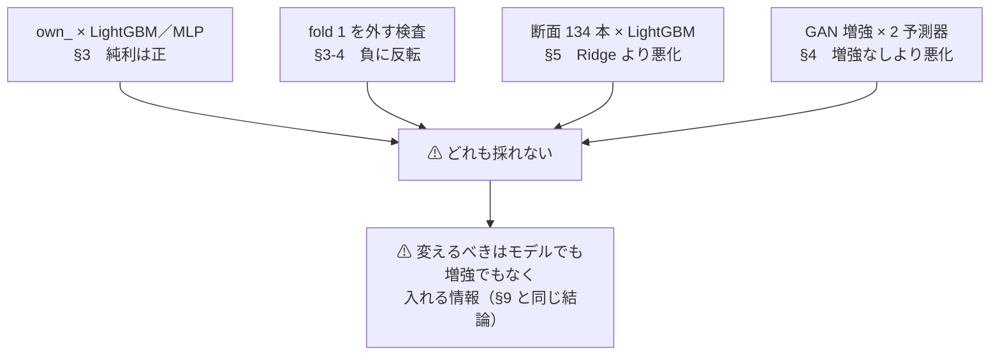

# 3090 Ti を使った機械学習での予測モデルの検証

調査日: 2026-09-09（**完了**）。派生元: [特徴量を見つけ出す手法の検証 §9-2](feature-discovery.md)（「やらずに閉じたもの」の**非線形モデル**）。
プラン: [gpu-models.md](../../plans/archive/gpu-models.md) ／ コード: `experiments/feature-discovery/`（モデルを足しただけ。配線は同じ）。
⚠ **規約は [rules.md](feature-discovery/rules.md) が正本。** 台帳は [ledger.md](feature-discovery/ledger.md)。

> ⚠ **これは投資助言ではなく調査資料である。** 特定の銘柄・売買を推奨しない。
> ⚠ **資金は動かしていない**（2026-08-27 の方針）。データは取得済みのものだけを使った。
> ⚠ **良い結果は根拠「中」が上限**で、デフレーテッド SR とパージ CV を通していない良い数字は報告しない。

## 0. ここまでで分かったこと

⚠ **モデルを Ridge から非線形（LightGBM・MLP）に替えると、own_ 入力で初めてコスト後の純利が正になった。だがその正は fold 1（コロナ期）に全面依存で、外すとドリフト並みかそれ以下に落ちる。**

> この図の主張: ⚠ **§8（断面 × Ridge）とまったく同じ形である。** 変えたのが選別（§8）でもモデル（本節）でも、正の数字は同じ 1 期間からしか出てこない。

| 問い | 答え |
| --- | --- |
| 非線形にすると数字は良くなったか | ⚠ **own_ では粗利が良くなった**（LightGBM 全部使う ＋6.52bp 対 Ridge ＋0.65bp【実測】）。⚠ **断面では逆に悪化した**（§5） |
| 売買に使えるか | ⚠ **使えない（保留）。** fold の符号 3/5・上乗せ t 0.92・DSR 0.41。⚠ **fold 1 を外すと純利が負に反転する**（§3-4） |
| GAN 増強は効いたか | ⚠ **効かない（落とす）。** Ridge・LightGBM の両方を悪化させた（−1.67 ／ −2.60bp。§4）。⚠ **fold 1 の信号まで薄めた** |
| 配線は信用できるか | ✅ leak 対照 6 実行すべてで的中率 91〜99% 台に跳ねた。「測れていない」ではない |
| §9 の結論は変わったか | ⚠ **変わらない。** 「価格だけからは方向が出ない」は、モデルを非線形にしても・GAN で増強しても同じだった |

## 1. 何を検証したか

⚠ **これまでモデルは Ridge 1 本だった**（比べていたのは選別の手法。[§3-1 の決めごと 4](feature-discovery.md)）。
本タスクはモデルの軸だけを動かす。⚠ **他は全部 `own_impact_2018` と同じ**（期間 2018-05-21〜・日足・1 日先・コスト 5bp・walk-forward 5 fold・パージ・種 0）。

| 決めごと | 中身 | どこで決めたか |
| --- | --- | --- |
| モデル | LightGBM（勾配ブースティング）／ MLP（深層）／ GAN は**増強** ／ 系列モデルは**見送り**（入力の表現ごと変わり、モデルの軸と混ざる） | [プラン §1](../../plans/archive/gpu-models.md) |
| GAN の役割 | ⚠ **予測器ではなく学習データの増強**（WGAN-GP を fold ごとに訓練分割の内側で fit。合成は訓練にだけ・検証は実データのみ） | [プラン §2](../../plans/archive/gpu-models.md) |
| 入力 | `own_` 日足 2018（Phase 2・3）＋ 断面 134 本（Phase 4）。⚠ **`ex_`・`im_` は足さない** | [プラン §3-1](../../plans/archive/gpu-models.md) |
| 選別 | 4 本に絞る（全部使う・乱択・F3-3・F3-1）。⚠ **主役は「全部使う × モデル」の行** | [プラン §3-2](../../plans/archive/gpu-models.md) |
| ハイパーパラメータ | ⚠ **事前に固定・チューニングしない**（振った水準の数だけ n_trials が増える） | [プラン §1](../../plans/archive/gpu-models.md) |

## 2. 配線（Phase 1）【実測 2026-09-09】

| # | 作ったもの | 中身 |
| ---: | --- | --- |
| 1 | `ail/models/trees.py`・`deep.py`・`gan.py` | `@register("model", ...)` で LightGBM・MLP・{Ridge, LightGBM, MLP}+GAN増強 を登録。⚠ **配線（cli/run.py の評価ループ）は触っていない** |
| 2 | `ail/models/holdout.py` | 早期打ち切り用の検証を**訓練分割の内側の末尾**から切る（境目に隙間 = 行数でのパージ）。⚠ **検証 fold には触れない** |
| 3 | ⚠ **台帳の鍵にモデル列** | `catalog.KEY` に「モデル」を追加。⚠ **無いと同じ選別 × 別モデルが 1 行に潰れて偽警告になる。** 旧実行は Ridge として読み、⚠ **既存の台帳は 63 行・n_trials 45 のまま変わらないことを確認した** |
| 4 | n_trials の数え方 | ⚠ **「全部使う × Ridge 以外のモデル」はモデルが処置なので 1 試行として数える**（`catalog.is_trial` が正本）。乱択・「基準 」の行は従来どおり数えない |
| 5 | `requirements.txt` | `torch==2.14.0`（+cu130）・`lightgbm==4.7.0` を固定 |
| 6 | tests | 決定性（同じ種で 1 ビットも違わない）・非線形の信号を拾えること・GAN 増強の構造（合成は訓練にだけ・実データの前に足す）・台帳の後方互換。**130 件すべて通過** |

⚠ **実行時の checks.json の n_trials は保守的な過大値になる**（実行自身の行が台帳に載った後に「この実行ぶん」を足すため。
旧実行も同じ挙動: own_impact_2018 は台帳 45 に対し 54 と記録している）。⚠ **正本は台帳の数**。過大 → DSR が小さく出る向きなので安全側。

**環境【実測 2026-09-09】**

| 時点 | 状態 |
| --- | --- |
| 着手時 | llama-server が VRAM 22.2 / 24.5 GB を掴んでいたため、⚠ **Phase 2（LightGBM・MLP）は CPU（32 コア）で回した**（`AIL_TORCH_DEVICE=auto` が空き 4GB 未満で CPU に落ちる設計） |
| 途中から | 利用者の指示「**GPU を使う処理はしていない＝ 全メモリを使ってよい**」を受け、利用者が `systemctl --user stop llama-server.service` を実行。⚠ **Phase 3（GAN 4 実行）は GPU（cuda 固定）で回した** |

| # | GPU まわりで分かったこと |
| ---: | --- |
| 1 | ⚠ **`torch.cuda.mem_get_info()` は問い合わせだけで約 350MiB の CUDA コンテキストを GPU に置く**（CPU に落ちる判定のためだけに空きを削っていた）。空きの確認は `nvidia-smi --query-gpu=memory.free` に修正済み（`ail/models/deep.py`） |
| 2 | WGAN-GP 1 fit は GPU ≒ 3 分【実測から換算】・CPU ≒ 6 分【実測から外挿】。⚠ **2 倍しか縮まない**（幅 128 の小さい網は起動律速。GPU 使用率 40%・VRAM 3GB） |
| 3 | ⚠ **「3090 Ti を使う」は手段であって目的ではない** — この規模（13 万行 × 35〜134 列）に 24GB は要らず、⚠ **結論は装置に依存しない**（Phase 2 は CPU、Phase 3 は GPU で取ったが、規約・種は同一） |

## 3. Phase 2 — own_ 日足 2018 でモデル比較【実測 2026-09-09】

実行: `runs/2026-09-09T17-27-16_gpu_lgbm_2018` ／ `runs/2026-09-09T17-27-42_gpu_mlp_2018`。
Ridge の対照は `runs/2026-09-09T12-22-33_own_impact_2018`（同じ表・同じ fold・同じ種）。

### 3-1. 結果 — 「全部使う × モデル」の行を 3 モデルで並べる

**日足 131,250 行（間引き後 65,625）・1 日先・コスト 5bp・選別なし（全部使う）**

| モデル | 的中率 | IC | 粗利 bp | 純利 bp |
| --- | ---: | ---: | ---: | ---: |
| **LightGBM** | 0.5208 | 0.0295 | **＋6.52** | ⚠ **＋1.52** |
| **MLP** | 0.5118 | 0.0326 | ＋5.99 | ⚠ **＋0.99** |
| Ridge（対照） | 0.4964 | 0.0166 | ＋0.65 | −4.35 |
| ⚠ 基準 常に上（ドリフト） | **0.5211** | — | ＋5.02 | ＋0.02 |

選別つきの行（同じ実行から）:

| 行 | 的中率 | 粗利 bp | 純利 bp |
| --- | ---: | ---: | ---: |
| F3-3 × LightGBM | 0.5200 | ＋6.35 | ＋1.35 |
| F3-1 × LightGBM | 0.5207 | ＋4.92 | −0.08 |
| F3-3 × MLP | 0.4983 | −0.96 | −5.96 |
| F3-1 × MLP | 0.5083 | ＋2.61 | −2.39 |

⚠ **own_ 入力でコスト後の純利が正になったのは本タスクが初めてである**（Ridge では §7 の最良でも −1.42bp）。
⚠ **だから初めて多重検定と 1 期間依存の検査を通す義務が生じる**（[rules.md 11 章](feature-discovery/rules.md) 規約 3。§8 と同じ流れ）。

⚠ **先に効く読み方も §8 と同じ**: LightGBM の的中率 0.5208 は「常に上」の 0.5211 を**下回る**。
⚠ **方向を当てる率では勝っていない。勝っているのは当たったときの値幅**＝ 少数の大きな日に依存する形。

### 3-2. 検査 1 — fold ごとの符号と上乗せ t

| 行 | fold 1 | 2 | 3 | 4 | 5 | 平均 | 符号 |
| --- | ---: | ---: | ---: | ---: | ---: | ---: | ---: |
| 全部使う × LightGBM（純利） | ⚠ **＋13.08** | −5.34 | ＋0.66 | −3.73 | ＋2.91 | ＋1.52 | 3/5 |
| 全部使う × MLP（純利） | ⚠ **＋12.64** | −4.54 | −2.39 | −1.71 | ＋0.97 | ＋0.99 | 2/5 |
| 基準 常に上（純利） | ＋5.40 | −5.81 | ＋1.12 | −5.16 | ＋4.52 | ＋0.02 | 3/5 |

「常に上」への上乗せ（粗利）: LightGBM **＋1.50bp・t = 0.92・3/5**、MLP ＋0.98bp・t = 0.47・3/5。
⚠ **Harvey-Liu-Zhu (2016) の目安 t > 3.0 に遠く届かない。** checks.json の最良行（F3-3 × LightGBM）も t = 0.69・DSR 0.4110。

| fold | 検証の期間 |
| ---: | --- |
| ⚠ **1** | ⚠ **2019-10-08 〜 2021-02-24**（コロナ暴落と回復） |
| 2〜5 | 2021-02 〜 2026-09 |

### 3-3. 検査 2 — 配線（leak 対照）

実行: `runs/2026-09-09T17-28-23_gpu_lgbm_2018_leak` ／ `runs/2026-09-09T17-28-40_gpu_mlp_2018_leak`。

| | 的中率 | IC | 純利 bp |
| --- | ---: | ---: | ---: |
| LightGBM（先読みの列あり・全部使う） | **0.9949** | 0.979 | ＋126.27 |
| MLP（同） | **0.9820** | 0.999 | ＋126.14 |

⚠ **両モデルとも跳ね上がった。** 配線は壊れていない ＝ §3-1 の数字は「測れている」。
（乱択は今回も先読みの列を引かなかった。16/36 列の無作為抽出なので想定どおり。）

### 3-4. 検査 3 — ⚠ fold 1 を外すと正の行は残らない

⚠ **§8-6 と同じ検査**（追加の実行なし。既存の記録から計算）。

| 行 | 全 5 fold の純利 | ⚠ **fold 1 を除く純利** | 対ドリフト上乗せ（fold 1 除く・粗利） |
| --- | ---: | ---: | ---: |
| 全部使う × LightGBM | ＋1.52 | ⚠ **−1.38** | ⚠ **−0.04** |
| F3-3 × LightGBM | ＋1.35 | ⚠ **−1.90** | −0.57 |
| 全部使う × MLP | ＋0.99 | ⚠ **−1.92** | −0.59 |
| 基準 常に上 | ＋0.02 | −1.33 | — |

⚠ **fold 1（コロナ）を外すと、LightGBM のドリフトへの上乗せは −0.04bp ＝ ほぼ厳密にゼロになる。**
⚠ **非線形モデルが拾っていたのはコロナ期の値幅だけで、それ以外の 4 期間では「買って持つ」と区別がつかない。**

### 3-5. 判定

| 問い | 答え |
| --- | --- |
| 純利が正の行は出たか | ⚠ **出た**（LightGBM ＋1.52 ／ MLP ＋0.99 ／ F3-3 × LightGBM ＋1.35bp） |
| ⚠ **採ってよいか** | ⚠ **採らない。判定は「保留」。** fold 符号 3/5・上乗せ t 0.92・DSR 0.41、⚠ **fold 1 を外すと全行が負に反転** |
| モデルの優劣は言えるか | LightGBM ＞ MLP ＞ Ridge の順は 5 fold 中 4 fold で保たれたが、⚠ **差を作っているのは主に fold 1**。「LightGBM が良い」ではなく⚠ **「非線形はコロナ期の値幅を拾えた」** |
| E8 のどの型か | **X2（コストで消える）＋ X9（標本不足）**。§9 から変わらない。⚠ **X5（過剰適合）とも言い切れない — 標本内の優位性自体が 1 期間に集中している** |
| 根拠の強さ | 「保留」の中身（1 期間依存）は §8 と独立に同じ形で再現した。⚠ **「価格だけからは方向が出ない」の根拠はむしろ強くなった** |

## 4. Phase 3 — GAN 増強【実測 2026-09-09】

実行: `runs/2026-09-09T17-58-19_gpu_ridge_gan_2018` ／ `runs/2026-09-09T19-30-37_gpu_lgbm_gan_2018`（＋ leak 各 1）。
⚠ **GPU（cuda 固定）で回した。** 1 実行 約 45 分・WGAN-GP 1 fit ≒ 3 分【実測から換算】（CPU の見積り 6 分の約 2 倍速。⚠ **小さい網は起動律速で、GPU でも劇的には縮まない**）。

### 4-1. 結果 — 増強あり／なし（同じ予測器・同じ規約。違うのは増強だけ）

| 予測器（全部使うの行） | 増強なし 純利 bp | ⚠ **増強あり 純利 bp** | 差 | 的中率の変化 |
| --- | ---: | ---: | ---: | --- |
| Ridge | −4.35 | ⚠ **−6.02** | ⚠ **−1.67 悪化** | 0.4964 → 0.4913 |
| LightGBM | ＋1.52 | ⚠ **−1.08** | ⚠ **−2.60 悪化** | 0.5208 → 0.5153 |

| # | 読み方 |
| ---: | --- |
| 1 | ⚠ **増強は両方の予測器を悪化させた。** 「合成データで学習が安定して良くなる」は、この設定では出なかった |
| 2 | LightGBM+GAN の fold 別純利は ＋2.54 ／ −7.25 ／ ＋0.59 ／ −4.81 ／ ＋3.54。⚠ **増強なしで＋13.08 あった fold 1（コロナ）が＋2.54 に落ちている**＝ 合成行が唯一の「効いていた期間」の信号まで薄めた |
| 3 | leak 対照は両方とも跳ねた（Ridge+GAN 0.9822 ／ LightGBM+GAN 0.9903・＋126bp）。⚠ **合成行が訓練の半分を占めても先読みの列は拾える ＝ 配線は健全で、「増強が悪い」は測れている** |
| 4 | 検査の行: 最良 F3-1 でも純利 −7.35（Ridge+GAN）／ −4.74bp（LightGBM+GAN）、上乗せ t は負、DSR 0.001〜0.012 |

### 4-2. この結果の限界（誇張しないための注記）

| # | 限界 |
| ---: | --- |
| 1 | WGAN-GP の形は事前固定（300 epoch・幅 128・α = 100%）。⚠ **振れば変わる可能性はあるが、振った水準の数だけ n_trials が増える**ので振らないと決めていた（[プラン §1](../../plans/archive/gpu-models.md)） |
| 2 | ⚠ **「GAN 増強が金融で効かない」の証明ではない。** 「この入力（own_ 35 本・実効観測数 4,087）とこの規約では悪化した」である |
| 3 | 合成の質そのもの（分布の一致度）は測っていない。⚠ **測っても売買の判定は変わらない**（悪化という結果が既に出ている）ので追わない |

判定: ⚠ **落とす**（増強なしを両方の予測器で下回る。増強なし側の判定は §3-5 のとおり「保留」）。

## 5. Phase 4 — 断面 134 本 × LightGBM【実測 2026-09-09】

実行: `runs/2026-09-09T17-33-20_gpu_lgbm_cs`（96,769 行・特徴量 134・対象は会社株 48・k=32・エンバーゴ 1 本）。
Ridge の対照は [§8](feature-discovery.md)（`runs/2026-09-08T19-42-54_cross_section_h1`）。

| 行 | 的中率 | IC | 粗利 bp | 純利 bp |
| --- | ---: | ---: | ---: | ---: |
| F3-1 × LightGBM | 0.5150 | −0.001 | ＋5.30 | **＋0.30** |
| ⚠ 基準 常に上（ドリフト） | **0.5166** | — | ＋4.75 | −0.25 |
| 乱択 × LightGBM | 0.5142 | −0.005 | ＋4.01 | −0.99 |
| F3-3 × LightGBM | 0.5095 | −0.016 | ＋2.30 | −2.70 |
| ⚠ **全部使う × LightGBM** | 0.5075 | ⚠ **−0.017** | ＋0.49 | ⚠ **−4.51** |
| （参考）全部使う × Ridge（§8） | 0.4994 | ＋0.030 | ＋2.20 | −2.80 |
| （参考）F1-2 × Ridge（§8 の最良） | 0.5076 | ＋0.052 | ＋7.30 | ＋2.30 |

| # | 読み方 |
| ---: | --- |
| 1 | ⚠ **断面では非線形が own_ のときと逆に働いた。** 全部使う × LightGBM は −4.51bp で、⚠ **Ridge の −2.80bp より悪い**（IC は負）。134 本を木に食わせると悪化する |
| 2 | 唯一正の F3-1（＋0.30bp）は選んだ本数 1.0 で、当てる率も「常に上」を下回る。fold 別の純利は ＋3.75 ／ −7.94 ／ −1.29 ／ ＋4.32 ／ ＋2.64 で、上乗せ t = 0.34・DSR 0.61 |
| 3 | leak 対照（`runs/2026-09-09T17-35-25_gpu_lgbm_cs_leak`）: F3-1 が的中率 0.9973・＋136.7bp、全部使う 0.9886。✅ **跳ねた ＝ 配線は健全** |
| 4 | ⚠ **§8 で正を出した Ridge × F1-2（＋2.30bp）を LightGBM は再現しない。** 「非線形にすれば断面が効く」は成立しなかった |

判定: ⚠ **落とす〜保留**（F3-1 の＋0.30bp は t = 0.34・DSR 0.61 で根拠にならない。全部使うは X2 ＋ X9）。

## 6. 判定【実測 2026-09-09】

⚠ **2026-09-09 に完了。** ⚠ **「効かないことの証明」ではなく「この設定では効かなかった」である。**

> この図の主張: ⚠ **モデルの軸を 4 方向に動かしても、§9 の結論（価格だけからは方向が出ない）と同じ場所に戻る。**

| 問い | 答え |
| --- | --- |
| モデルを替えて情報は増えたか | ⚠ **増えない。** own_ の正（＋1.52bp）はコロナ期 1 区間の値幅で、外すとドリフトと区別がつかない（−0.04bp）。TODO の警告「GPU で大きいモデルを回せる」と「情報が増える」は別物、がそのまま出た |
| 4 系統の行き先 | 勾配ブースティング・深層 = **保留**（1 期間依存）／ 断面 × 非線形 = **落とす〜保留** ／ GAN 増強 = **落とす** ／ 系列モデル = **見送り**（入力の表現ごと変える別タスク） |
| E8 のどの型か | **X2（コストで消える）＋ X9（標本不足）**。§9 から変わらない |
| n_trials | ⚠ **45 → 58**（台帳が数える。モデルが処置の行を含む）。DSR の最良は LightGBM の 0.41 で、慣例の 0.95 に遠い |
| 根拠の強さ | ⚠ **悪い数字なのでそのまま結論にしてよい。** 選別（§9）・断面（§8）・モデル（本書）と 3 つの軸で同じ形（1 期間依存 or 基準線以下）が独立に出た |
| 次に動かすなら | ⚠ **モデルの軸は閉じる。** 残る入力の軸は `im_`（災害の割り当て。impact-data の Phase 4 判定待ち）だけ |
