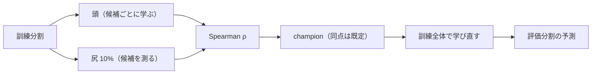
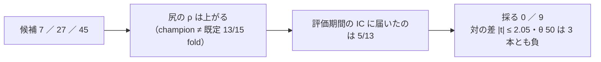
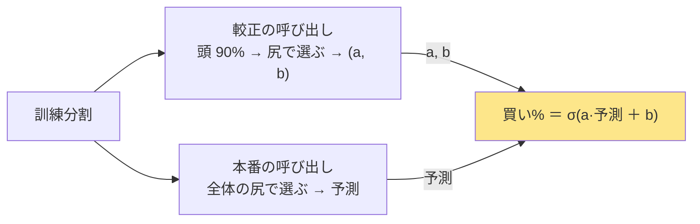

# ハイパーパラメータを訓練分割の内側で選ぶ段を入れたら何が起きるか（机上）

2026-10-09。判断 2「モデルの構造・ハイパラを進化させるか」への答え（利用者決定 **B 内側の選抜**。比べた案 ＝ A 入れない ／ B 事前固定した候補から訓練分割の尻で選ぶ ／ C GA で構造まで）。規約は [rules.md 14-12](feature-discovery/rules.md)（13-6 規約 3 の書き換え）、プランは [hyperparam-inner-selection.md](../../plans/hyperparam-inner-selection.md)。
⚠ **これは投資助言ではなく調査資料である。** ⚠ 数字は【実測】（自前の机上の検証）。⚠ **この結果で本番の人のモデル・水準を替えない**（替えるかは利用者。替えるなら新しい検証）。

## 0. 回す前に決めたこと（⚠ この節は結果を見る前に書いた。2026-10-09）

> この図の主張: 選抜は訓練分割の尻だけで行い、評価分割は決まった champion を当てるときにしか触らない。

| 項目 | 中身 |
| --- | --- |
| 口 | モデル `Ridge（内側選抜）`・`LightGBM（内側選抜）`・`MLP（内側選抜）`（`ail/models/tuned.py`）。候補を訓練分割の尻（`tail_holdout` 10%。門・較正・GA と同じ）で Spearman ρ で測り、champion を訓練全体で学び直す。⚠ モデルが呼ばれるたびに選ぶ（門・較正・本番で champion が違ってよい） |
| 候補（事前固定。既定が先頭） | Ridge: alpha {**1**・10・100・1,000・10,000・100,000・1,000,000} ＝ 7 ／ LightGBM: 葉 {7・**31**・127} × 学習率 {0.02・**0.05**・0.1} × 最小標本 {20・**100**・500} ＝ 27 ／ MLP: 層と幅 {(64)・(32,16)・**(64,32)**・(128,64)・(128,64,32)} × Dropout {0.0・**0.2**・0.5} × 学習率 {3e-4・**1e-3**・3e-3} ＝ 45（正本は rules.md 14-12-1。写しを `tests/test_tuned.py` が固定） |
| そろえるもの | 表 `own_2018`（作り直さない）・(A) 共通 1 本・選別「全部使う（基準）」1 本（乱択は入れない）・種 0・θ 50 ／ 55 ／ 60・コスト 5bp ＝ 既定の対と同じ |
| 数 | ⚠ **＋9（n_trials 816 → 825）**・leak 対照 3 本（数えない）。候補 × fold は数えない（14-11 規約 2） |
| config | `trade_own_ridge_tuned_a`・`trade_own_lgbm_tuned_a`・`trade_own_mlp_tuned_a`（queue `hp_inner`） |
| 対の相手（既定のまま） | 既存の実行（回し直さない）: `2026-09-13T08-57-34_trade_own_ridge_a`・`2026-09-13T08-57-48_trade_own_lgbm_a`・`2026-09-13T09-59-21_trade_own_mlp_a` |
| 機械で検査したこと（Phase 1） | (a) 評価分割を差し替えても champion と ρ が同じ ／ (b) 候補が既定だけなら基底のモデルと予測が bit で同じ（Ridge・LightGBM・MLP）／ (c) 新しいモデル名の無い config は既定経路の指紋が動かない（`tests/test_trading_run.py`・`tests/test_predict.py`）＝ `tests/test_tuned.py` 15 本 ✅ 2026-10-09 |

物差し（回す前に書いた）: 採否は 13-7（対 B&H）。診断として ① fold ごとの champion（既定からどれだけ離れたか）／ ② 対の差（内側選抜 − 既定。同じ表・同じ fold・日次の純利 bp）と t ／ ③ 尻での ρ の改善（champion − 既定）が評価期間の IC の変化に届いたか（fold の割合）。

⚠ **示せないもの**: 「内側で選んだから良くなった」（示せるのは champion がどこに着地したかだけ）。

| # | 予想【推測。回す前】 | 読み方 |
| ---: | --- | --- |
| 1 | **採る 0 ／ 9** | 同じ表でモデルを替えた差（±30〜390bp）が B&H との差（−111〜−1,199bp）より小さく、ハイパーパラメータの差はふつうそれより小さい |
| 2 | champion ≠ 既定 が fold の大半 | 候補が多いほど尻の最大は既定を上回る。⚠ **「既定が外れていた」とは読まない**（尻の雑音を拾っただけでも起きる） |
| 3 | 対の差は θ 50 で \|t\| < 1 | 差は診断。採否に使わない |
| 4 | 尻での ρ の改善は評価期間の IC の変化より大きい | 過適合の向き。改善が評価期間に届いた fold の割合を残す |
| 5 | LightGBM θ 60 の既定（取引 0・上乗せ 0.00）は内側選抜で取引が出る | 出ても採るにはならない見込み。保有日率を添える |

費用【推測】: Ridge 1 分以内 ／ LightGBM 25〜40 分 ／ MLP 30〜35 分（GPU）＝ 約 1 時間（queue の `time_budget_s` は 7,200）。

⚠ **次に何をしないか**: 結果を見てから候補を足さない・MLP の層を増やさない・C（GA）に進まない。

## 1. 結果【実測 2026-10-09・titan】

**答え: 訓練分割の内側で選んでも、採る 0 ／ 9（予想 1 どおり）。** 対の差（内側選抜 − 既定）は 9 組とも \|t\| ≤ 2.05 で、θ 50 では 3 モデルとも負（内側選抜のほうが悪い。\|t\| 0.80〜1.57）。champion ≠ 既定 が本番の fold **13 ／ 15**（予想 2 どおり）。尻での ρ の改善が評価期間の IC の変化に届いたのは **5 ／ 13 fold**（予想 4 の向き ＝ 尻の改善は評価期間にほとんど届かない）。leak 3 本とも跳ねた（純利 23,846〜23,847bp・IC 0.66 ＝ 配線は生きている）。**n_trials 816 → 825**。

> この図の主張: 尻での順位は候補の数だけ上がるが、評価分割には届かず、採否は変わらない。

材料: 内側選抜 ＝ `2026-10-09T14-03-09_trade_own_ridge_tuned_a`・`14-03-27_trade_own_lgbm_tuned_a`・`14-08-35_trade_own_mlp_tuned_a`（leak は `14-03-18`・`14-04-34`・`14-12-02` の `_leak`）／ 既定 ＝ §0 の既存の 3 実行。対の差は同じ表・同じ fold の日次の純利 bp（ポートフォリオ）の差の平均と t（日数 1,801）。

| モデル | θ | 判定 既定 → 内側選抜（上乗せ bp/fold・fold の符号） | 対の差 bp/日 | t | 取引回数 ／ fold | 保有日率 |
| --- | ---: | --- | ---: | ---: | --- | --- |
| Ridge | 50 | 落とす −271（2/5） → 落とす −462（0/5） | −0.531 | −1.12 | 1,089 → 1,355 | 0.72 → 0.71 |
| 〃 | 55 | 落とす −540（1/5） → 落とす −555（1/5） | −0.042 | −0.05 | 102 → 116 | 0.56 → 0.61 |
| 〃 | 60 | 落とす −944（1/5） → 落とす −642（1/5） | ＋0.838 | ＋0.81 | 35 → 46 | 0.31 → 0.44 |
| LightGBM | 50 | 落とす −142（1/5） → 落とす −218（1/5） | −0.212 | −0.80 | 353 → 607 | 0.78 → 0.76 |
| 〃 | 55 | 落とす −417（2/5） → 落とす −481（1/5） | −0.177 | −0.49 | 110 → 219 | 0.53 → 0.55 |
| 〃 | 60 | 落とす −1,255（0/5） → 落とす −976（1/5） | ＋0.775 | ＋2.05 | 48 → 117 | 0.22 → 0.27 |
| MLP | 50 | 落とす −68（2/5） → 落とす −566（0/5） | −1.384 | −1.57 | 1,074 → 987 | 0.73 → 0.75 |
| 〃 | 55 | 落とす −530（1/5） → 落とす −709（2/5） | −0.498 | −0.41 | 152 → 192 | 0.56 → 0.53 |
| 〃 | 60 | 落とす −804（1/5） → 落とす −1,193（0/5） | −1.079 | −1.16 | 56 → 74 | 0.35 → 0.32 |

⚠ LightGBM θ 60 の ＋2.05 は 9 組で唯一 \|t\| > 2 だが、落とす → 落とす（上乗せ −976bp/fold）のままで、9 組の最大値（多重検定）として読む。⚠ 予想 5 の前提（既定の LightGBM θ 60 は取引 0）は対の相手の実行では成り立っていなかった（取引 48 回 ／ fold・上乗せ −1,255bp）ので、予想 5 は書いたとおりには読めない。

### 1-1. fold ごとの champion（本番の呼び出し）と、尻の改善が評価期間に届いたか

ρ ＝ 訓練分割の尻での Spearman ρ（既定 ／ champion）。IC ＝ 評価期間の買い% と y の相関（θ 50 の行。⚠ 較正を通した後の値なので、較正の係数の符号で反転する ＝ §2）。「届いた」＝ champion ≠ 既定 かつ ΔIC > 0。

Ridge（champion ≠ 既定 3/5・届いた 1/3）:

| fold | champion（本番） | champion（較正） | ρ 既定 | ρ champion | Δρ（尻） | IC 既定 | IC 内側選抜 | ΔIC | 届いた |
| ---: | --- | --- | ---: | ---: | ---: | ---: | ---: | ---: | --- |
| 1 | alpha 1（既定） | alpha 100 | ＋0.0129 | ＋0.0129 | 0 | −0.0313 | −0.0313 | 0 | — |
| 2 | alpha 1,000,000 | alpha 1,000,000 | ＋0.0637 | ＋0.0965 | ＋0.0329 | ＋0.0303 | ＋0.0264 | −0.0040 | ✗ |
| 3 | alpha 1（既定） | alpha 1,000,000 | ＋0.0223 | ＋0.0223 | 0 | −0.0210 | ＋0.0211 | ＋0.0421 | —（⚠ §2） |
| 4 | alpha 1,000,000 | alpha 100,000 | −0.0886 | −0.0597 | ＋0.0289 | −0.0108 | ＋0.0018 | ＋0.0126 | ✅ |
| 5 | alpha 10,000 | alpha 1,000,000 | ＋0.0102 | ＋0.0107 | ＋0.0004 | ＋0.0223 | −0.0231 | −0.0455 | ✗ |

LightGBM（champion ≠ 既定 5/5・届いた 3/5。候補は 葉 ／ 学習率 ／ 最小標本）:

| fold | champion（本番） | champion（較正） | ρ 既定 | ρ champion | Δρ（尻） | IC 既定 | IC 内側選抜 | ΔIC | 届いた |
| ---: | --- | --- | ---: | ---: | ---: | ---: | ---: | ---: | --- |
| 1 | 7 ／ 0.05 ／ 100 | 127 ／ 0.02 ／ 20 | −0.0130 | ＋0.0142 | ＋0.0272 | −0.0299 | −0.0984 | −0.0685 | ✗ |
| 2 | 31 ／ 0.02 ／ 100 | 127 ／ 0.02 ／ 500 | ＋0.0484 | ＋0.0501 | ＋0.0017 | ＋0.0573 | ＋0.0452 | −0.0122 | ✗ |
| 3 | 7 ／ 0.02 ／ 500 | 127 ／ 0.1 ／ 100 | ＋0.0010 | ＋0.0419 | ＋0.0409 | −0.0012 | ＋0.0150 | ＋0.0162 | ✅ |
| 4 | 7 ／ 0.1 ／ 20 | 31 ／ 0.05 ／ 20 | −0.0211 | ＋0.0192 | ＋0.0402 | −0.0247 | ＋0.0218 | ＋0.0465 | ✅ |
| 5 | 127 ／ 0.02 ／ 20 | 7 ／ 0.05 ／ 20 | ＋0.0267 | ＋0.0323 | ＋0.0056 | −0.0155 | −0.0024 | ＋0.0131 | ✅ |

MLP（champion ≠ 既定 5/5・届いた 1/5。候補は 層と幅 ／ Dropout ／ 学習率）:

| fold | champion（本番） | champion（較正） | ρ 既定 | ρ champion | Δρ（尻） | IC 既定 | IC 内側選抜 | ΔIC | 届いた |
| ---: | --- | --- | ---: | ---: | ---: | ---: | ---: | ---: | --- |
| 1 | (128,64) ／ 0.5 ／ 1e-3 | (128,64,32) ／ 0.0 ／ 3e-4 | ＋0.0321 | ＋0.0510 | ＋0.0189 | ＋0.1137 | −0.1229 | −0.2365 | ✗ |
| 2 | (64) ／ 0.5 ／ 1e-3 | (64) ／ 0.5 ／ 1e-3 | ＋0.0602 | ＋0.1093 | ＋0.0491 | ＋0.0539 | ＋0.0209 | −0.0330 | ✗ |
| 3 | (128,64) ／ 0.5 ／ 3e-3 | (128,64) ／ 0.2 ／ 3e-4 | ＋0.0070 | ＋0.0675 | ＋0.0605 | −0.0025 | −0.0054 | −0.0029 | ✗ |
| 4 | (32,16) ／ 0.0 ／ 3e-4 | (128,64) ／ 0.5 ／ 3e-4 | −0.0370 | ＋0.0172 | ＋0.0542 | −0.0132 | −0.0059 | ＋0.0073 | ✅ |
| 5 | (64) ／ 0.0 ／ 3e-4 | (64) ／ 0.0 ／ 3e-3 | ＋0.0193 | ＋0.0526 | ＋0.0333 | ＋0.0373 | ＋0.0120 | −0.0253 | ✗ |

読み: Δρ（尻）は 13 fold 全部で正（＋0.002〜＋0.061）だが、ΔIC（評価期間）は 5 ／ 13 しか正でない ＝ 尻の改善の大半は尻の雑音を拾ったもの（予想 4 の向き）。⚠ **Ridge の尻がいちばん好んだのは alpha 1,000,000（本番 2/5・較正 4/5 の fold）** ＝ 標準化した 35 列 × 約 11 万行では予測をほぼ定数まで縮めた形で、「どの水準も当たらないので縮めるほど尻の順位が良い」と読む（⚠ 「既定が外れていた」とは読まない）。

費用【実測】: Ridge 8.7 秒 ／ LightGBM 66.9 秒 ／ MLP 207 秒（leak は 9.5 ／ 241 ／ 1,040 秒）＝ 合計 26 分。§0 の見積り（約 1 時間）より速かった ＝ 候補の学習は頭 90% × 早期打ち切りで、1 学習が見積りより軽い。

## 2. 見つかったこと — 較正と本番で champion が違う（規約 5 の帰結）

⚠ **較正の呼び出しと本番の呼び出しで champion が違う fold が 13 ／ 15**（Ridge 4・LightGBM 5・MLP 4）。rules.md 14-12 規約 5「モデルが呼ばれるたびにその訓練の尻で選ぶ」の帰結で、較正は較正の呼び出しの champion（頭 90% の、さらに尻で選んだもの）で係数 (a, b) を学び、本番は本番の呼び出しの champion（訓練全体の尻で選んだもの）で予測する。**2 つの champion の予測のスケールが違うと、較正の係数が本番の予測に合わない。**

> この図の主張: 較正と本番が別々に選ぶので、較正の係数は本番の予測の形を知らない。

| 例 | 中身 |
| --- | --- |
| Ridge fold 3 | 較正 alpha 1,000,000（予測はほぼ定数）で a ＝ −6.1 ／ 本番 alpha 1（既定 ＝ 既定の実行と**同じ予測**）。既定の実行の a ＝ ＋7.9 と符号が逆で、買い% の順位が反転 ＝ 評価期間の IC が −0.021 → ＋0.021 に「変わった」が、予測は 1 ビットも変わっていない |
| Ridge fold 2 | 較正・本番とも alpha 1,000,000 で a ＝ ＋778（既定 ＋22）。予測が小さいぶん a が大きく、買い% の幅は保たれる（こちらは噛み合っている） |
| 3 モデルの θ 50 | 対の差が 3 本とも負（−0.53 ／ −0.21 ／ −1.38bp/日）。⚠ この噛み合わなさが主因かどうかは、この実行からは切り分けられない【推測】 |

⚠ **これは結果を見てから直さない**（14-12 規約 1 ＝ 直すなら「1 度選んで較正にも同じ champion を配る」＝ 規約 5 の書き換え ＝ 新しい処置として先に登録し、利用者が決める）。Ridge のように候補の間で予測のスケールが桁で違うモデルに効き、LightGBM・MLP は予測のスケールが候補でそろう分だけ軽い【推測】。

## 3. 判定と、次に何をしないか

- **採る 0 ／ 9**（検証結果一覧 `Ridge（内側選抜）`・`LightGBM（内側選抜）`・`MLP（内側選抜）` × θ 3）。既定の対と並べて、ハイパーパラメータが「足を引っ張っていた」とは言えない ＝ **モデルの軸の結論（既定のまま）はそのまま**
- 示せたのは champion の着地（13/15 fold で既定から離れ、尻の改善は 5/13 でしか評価期間に届かない）だけ。「内側で選んだから良くなった ／ 悪くなった」は示せない（§0）
- ⚠ **しないこと**: 結果を見てから候補を足さない・MLP の層を増やさない・C（GA で構造まで）に進まない・本番の人のモデルや水準を替えない
- 開いた問い（利用者の判断）: §2 の「1 度選んで較正にも配る」を新しい処置として登録して回すか。回すなら水準・数（＋9）・予想を先に書く
