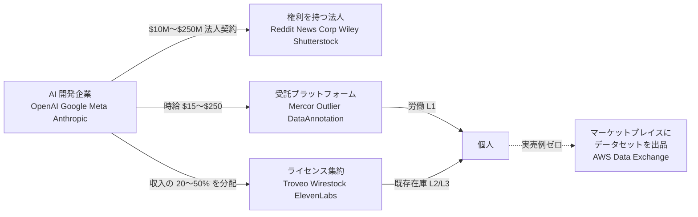
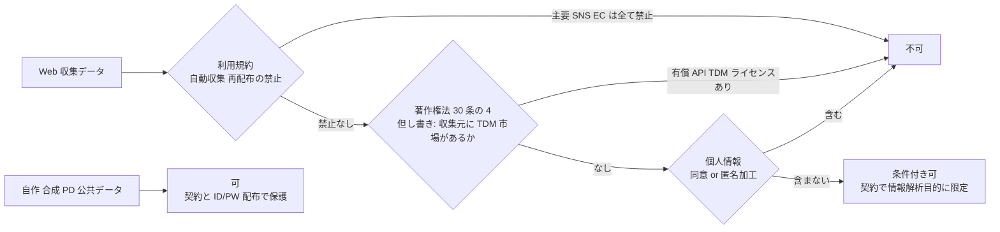
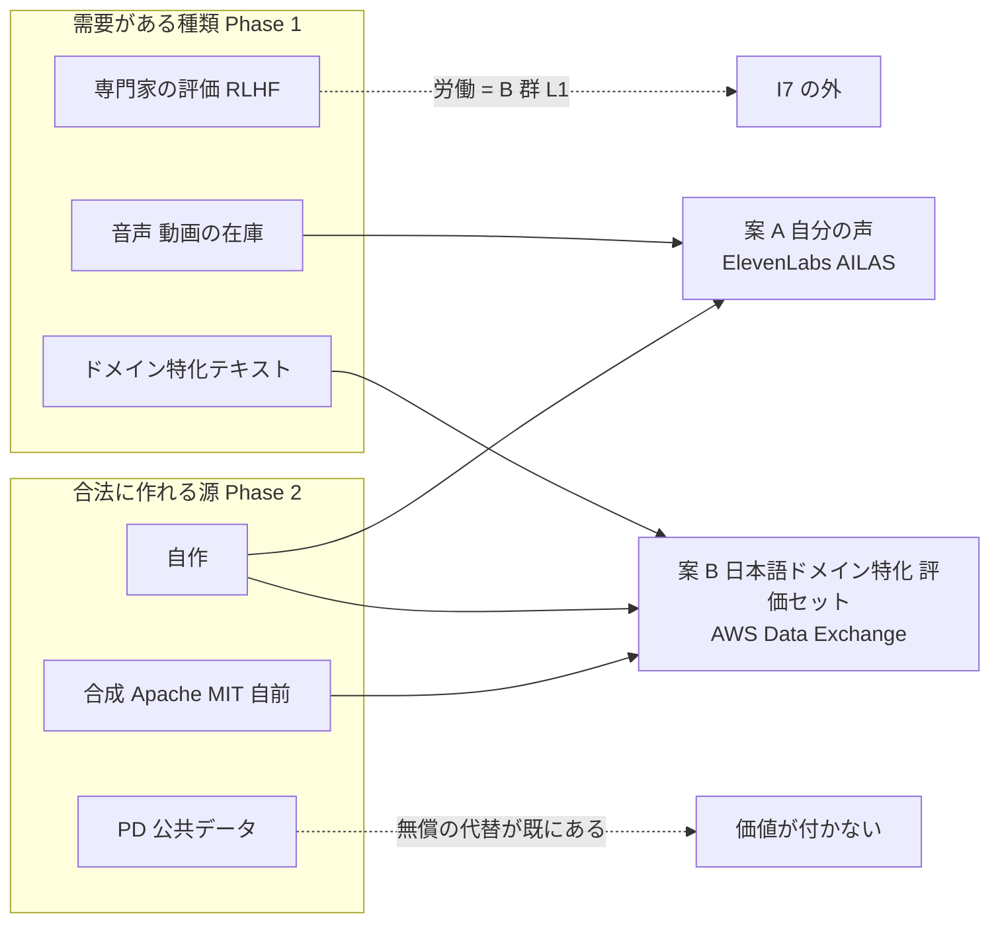

# 実験 I7: 独自データセットの提供・販売

[catalog.md](../income-taxonomy/catalog.md) の I7、[ai-delta.md](../income-taxonomy/ai-delta.md) で「新規」判定。
[shortlist.md](../income-taxonomy/shortlist.md) の全セグメント推奨 1 位。
プラン: `docs/plans/i7-dataset-validation.md`

セグメント: 資金 大 × 週 5〜15 時間 × 回収 6 ヶ月〜1 年（2026-08-26 確定）

| 凡例 | 意味 |
| --- | --- |
| 【Web 確認済】 | 一次ページまたは報道記事を Web で確認した |
| 【Web 確認済（二次）】 | 集計サイト・第三者レビュー・検索スニペットのみで確認（一次ページは取得できず） |
| 【推測】 | 根拠のない数値・見込み |
| 【実測】 | 本プロジェクトで実際に投下・受領した値 |

## 関門と判定

| Phase | 関門 | 判定 | 判定日 |
| --- | --- | --- | --- |
| 1 需要側の実在 | 金銭が動いた事例が 3 件以上 ／ 個人が供給側に入れる経路が 1 つ以上 | **通過（条件付き）** — 事例は多数。ただし「個人がデータセットを作って売った」実例はゼロ | 2026-08-26 |
| 2 権利処理の可否 | 個人が今すぐ合法に作れるデータ源が 1 つ以上 | **通過（条件付き）** — 自作・合成（Apache 2.0 / MIT 自前）・PD・公共データは可。ただし価値の高い Web 収集はほぼ不可 | 2026-08-26 |
| 3 小さく 1 件作る | 投下時間・費用・収入を【実測】 | **中止** — ユーザー判断で案 A・B の検証（録音・出品）は行わない。B のパイロット 10 件のみ実測 | 2026-08-26 |

---

## Phase 1: 需要側の実在（2026-08-26 調査）

この図の主張: 金銭は法人間で大きく動くが、個人に届く経路は「労働」と「既存在庫のライセンス」の 2 本で、「データセットを作って売る」経路は実例が無い。

### 1-A. 大規模ライセンス契約（市場の存在証明）

すべて法人 ↔ 法人。個人が当事者になった例は無い。

| 買い手 | 売り手 | 公表額 | 年 | 出典 | 確認 |
| --- | --- | --- | --- | --- | --- |
| Google | Reddit | 約 $60M/年（報道値）。2026-07 に更新交渉中 | 2024-02 | [CNBC](https://www.cnbc.com/2026/07/22/reddit-stock-google-ai-content-deal.html) | 【Web 確認済】 |
| OpenAI | Reddit | 約 $70M/年（報道値） | 2024-05 | [CJR](https://www.cjr.org/analysis/reddit-winning-ai-licensing-deals-openai-google-gemini-answers-rsl.php) | 【Web 確認済】 |
| OpenAI | News Corp | $250M 超 / 5 年 | 2024-05 | [Variety](https://variety.com/2024/digital/news/news-corp-openai-licensing-deal-1236013734/) | 【Web 確認済】 |
| Meta | News Corp | 最大 $50M/年、3 年以上 | 2026-03 | [E&P](https://www.editorandpublisher.com/stories/news-corp-meta-in-ai-content-licensing-deal-worth-up-to-50-million-a-year,260471) | 【Web 確認済】 |
| Amazon | New York Times | $20〜25M/年 | 2025-05 | [Engadget](https://www.engadget.com/ai/the-new-york-times-and-amazons-ai-licensing-deal-is-reportedly-worth-up-to-25-million-per-year-135523853.html) | 【Web 確認済】 |
| Microsoft | HarperCollins（著者 opt-in） | **$5,000/タイトル、著者取り分 $2,500**、3 年 | 2024-11 | [Authors Guild](https://authorsguild.org/news/harpercollins-ai-licensing-deal/) | 【Web 確認済】 |
| Microsoft | Taylor & Francis | 初年度約 $10M | 2024-05 | [Inside Higher Ed](https://www.insidehighered.com/news/faculty-issues/research/2024/07/29/taylor-francis-ai-deal-sets-worrying-precedent) | 【Web 確認済】 |
| IQVIA, OpenEvidence, Anthropic 他 | Wiley | FY2026 AI ライセンス収入 $49M、累計 $110M 超 | 2026-06 | [Publishers Weekly](https://www.publishersweekly.com/pw/by-topic/industry-news/financial-reporting/article/100650-ai-research-drive-gains-at-wiley-in-fiscal-2026.html) | 【Web 確認済】 |
| OpenAI, Meta, Google 他 | Shutterstock | 2023 年 AI ライセンス収入 $104M | 2023〜 | [PetaPixel](https://petapixel.com/2024/06/04/shutterstock-made-104-million-licensing-assets-to-ai-devs-last-year/) | 【Web 確認済】 |
| Google | Spirit Airlines（破産管財） | $10M（社内メール 1 億通・コード 3,000 万行、匿名化済。Mercor が $7.5M で対抗入札） | 2026-08 | [Axios](https://www.axios.com/2026/08/17/google-spirit-airlines-bankruptcy) | 【Web 確認済】 |
| Anthropic | 著者（集団訴訟和解） | ライセンスではなく和解金 $1.5B（約 $3,000/作品） | 2026-07 最終承認 | [Bloomberg Law](https://news.bloomberglaw.com/legal-exchange-insights-and-commentary/anthropic-settlement-resets-balance-of-power-for-content-creators) | 【Web 確認済】 |

補足: Anthropic は媒体幹部に「オランダ語の医学論文 50 万本でもあれば別だが、それ以外は興味がない」と告げたと報道（[Adweek](https://www.adweek.com/media/anthropic-content-licensing-lawsuits-publishers/) 【Web 確認済】）。
需要は **公開 Web で埋まらない希少・専門データ**に偏る。仲介インフラも動いている: Cloudflare が Human Native を買収（2026-01）、Protege $30M 調達（2026-01）、Wirestock $23M 調達（2026-05）。

### 1-B. 個人が供給側に入れる経路

| 形態 | 定義 | 本体系での位置 |
| --- | --- | --- |
| 受託作業 | 時給・タスク単価で労働を売る。データの所有権は残らない | 源泉 2 技能・L1（I7 ではなく B 群） |
| ライセンス収益分配 | 既に持つコンテンツを AI 学習用に許諾し、売れた分の分配を受ける | 源泉 4 権利・L2〜L3（D5 に近い） |
| データセット販売 | 自作したデータセットを出品して売る | I7 本来の形・L2 |

| サービス | 形態 | 報酬水準 | 日本から | 日本語 | 出典 | 確認 |
| --- | --- | --- | --- | --- | --- | --- |
| Mercor | 受託（専門家の執筆・評価） | **日本在住ネイティブ専門家 $55〜65/時**、週 20 時間以上（法律・医療・金融・文学。掲載は約 1 年前、現在は募集終了） | 可 | あり | [求人](https://work.mercor.com/jobs/list_AAABmI0LJeed0vVo1iZCf7rn/japanese-bilingual-industry-expert) / [対応国](https://www.mercor.com/supported-countries/) | 【Web 確認済】 |
| Outlier（Scale AI） | 受託（RLHF 評価、日本語作文） | 日本語 **最大 $31/時**。日本人の受領報告あり（3 か月で $4,600）。⚠ 2025-06 の Meta 出資後にタスク枯渇の報告多数 | 可 | あり | [Outlier](https://outlier.ai/languages/ja-jp) / [Fortune](https://www.fortune.com/2025/06/19/openai-is-phasing-out-scale-ai-work-following-startups-meta-deal) | 【Web 確認済】 |
| DataAnnotation.tech | 受託 | Japanese Specialist $25〜40/時 | 未確認 | あり | [公式](https://www.dataannotation.tech/japanese-bilingual-en) | 【Web 確認済】（日本可否は未確認） |
| Appen CrowdGen | 受託（英日 MT 評価） | $15/時 | 可 | あり | [Lever](https://jobs.lever.co/appen/2d0bb58b-a3f0-4f91-843c-136d03ca9105) | 【Web 確認済（二次）】 |
| Prolific | 調査参加 | 最低 $8/時、推奨 $12/時以上 | 可 | 一部 | [対応国](https://participant-help.prolific.com/en/articles/445007-who-can-participate-in-studies-on-prolific) | 【Web 確認済】 |
| harBest Expert（APTO） | 受託 | 非公開（2025-03 時点で登録受付のみ） | 可 | あり | [APTO](https://apto.co.jp/download/1513/) | 【Web 確認済】 |
| Troveo | ライセンス集約（動画・音声） | 累計 $20M+、7,000 ライセンサー。**個人例: 1,400 時間の動画で $33,000/年**。第三者情報で $1〜4/分 | 明記なし | 言語非依存 | [Semafor](https://www.semafor.com/article/10/30/2025/the-ai-boom-is-turning-old-content-into-cash-cows-for-creators) / [Troveo](https://www.troveo.ai/resources/ai-data-licensing) | 【Web 確認済】 |
| Wirestock | ライセンス分配 + 買取（写真・動画） | バルクは「1 枚セント未満」、特定ニーズで $15〜20/作品。累計支払 $15M、70 万人。手数料 15〜30% | 明記なし | 言語非依存 | [VentureBeat](https://venturebeat.com/ai/wirestock-lets-photographers-and-artists-get-paid-when-ai-companies-train-on-their-work) | 【Web 確認済】 |
| ElevenLabs Voice Library | ライセンス分配（音声） | 累計 $22M+、10,400 人超（2026-08）。約 $0.03/1,000 文字 | 未確認 | あり（32 言語） | [ElevenLabs](https://elevenlabs.io/blog/22-million-earned-by-voice-creators-on-elevenlabs) | 【Web 確認済】 |
| Shutterstock Contributor Fund | ライセンス分配（画像） | データ収入の 20% を分配。**中央値 $0.0069/枚** | 可 | 言語非依存 | [PetaPixel](https://petapixel.com/2023/07/12/shutterstock-may-have-paid-out-over-4-million-from-its-ai-contributor-fund/) | 【Web 確認済】 |
| Adobe Stock Firefly bonus | ライセンス分配（画像） | 額は Adobe 裁量。受領報告は「$4.88」 | 可 | 言語非依存 | [Adobe Community](https://community.adobe.com/t5/stock-contributors-discussions/announcing-the-2025-firefly-bonus-for-contributors/td-p/15509635) | 【Web 確認済】 |
| GoPro AI Training program | ライセンス分配（動画） | ライセンス収入の 50% を分配（2025-08 開始） | 未確認 | 言語非依存 | [Barchart](https://www.barchart.com/story/news/36572897/gopro-subscribers-contribute-over-300-000-hours-of-video-content-for-ai-data-licensing) | 【Web 確認済（二次）】 |
| AILAS（日本音声 AI 学習データ認証サービス機構） | 音声の許諾・収益還元 | 額非公開 | 可 | あり | [AILAS](https://ailas.or.jp/) / [日経](https://www.nikkei.com/article/DGXZQOUC257ZS0V20C24A6000000/) | 【Web 確認済】 |
| Humanity's Last Exam（CAIS × Scale） | 評価問題の報奨金 | 上位 50 問 $5,000、次の 500 問 $500（2024-11 締切） | 可 | — | [CAIS](https://safe.ai/blog/humanitys-last-exam) | 【Web 確認済】 |
| FrontierMath（Epoch AI） | 評価問題の作成報酬 | $300〜1,000/問（招待制） | — | — | [LessWrong](https://www.lesswrong.com/posts/8ZgLYwBmB3vLavjKE/some-lessons-from-the-openai-frontiermath-debacle) | 【Web 確認済（二次）】 |
| YouTube 第三者 AI 学習 opt-in | 許諾のみ | **報酬なし** | 可 | — | [YouTube](https://support.google.com/youtube/answer/15509945?hl=en) | 【Web 確認済】 |

日本からの参加不可を確認: Handshake AI（米国内作業必須）。

### 1-C. データマーケットプレイス（データセット販売型）

| 名称 | 個人出品 | 手数料 | 個人の実売例 | 出典 | 確認 |
| --- | --- | --- | --- | --- | --- |
| AWS Data Exchange | **可**。Japan は適格国。ただしサポート体制・定期更新が要件、資格審査あり。有料化には W-8・JCT 番号・米国口座（Hyperwallet 可） | 3% | **見つからず** | [AWS](https://docs.aws.amazon.com/data-exchange/latest/userguide/provider-getting-started.html) | 【Web 確認済】 |
| Snowflake Marketplace | 個人可否は明記なし。承認制 | 非公開 | 見つからず | [Snowflake](https://docs.snowflake.com/en/collaboration/provider-transactions-invoicing-collections) | 【Web 確認済】 |
| Databricks Marketplace | Premium 以上 + 審査。個人可否は明記なし | 0 | 見つからず | [Databricks](https://docs.databricks.com/aws/en/marketplace/become-provider) | 【Web 確認済】 |
| Datarade | **不可**（登録法人のみ） | 15〜30% | — | [Datarade](https://providers.datarade.ai/apply) | 【Web 確認済】 |
| Defined.ai / Protege | 法人向け | 非公開 | — | [Defined.ai](https://defined.ai/partnership-programs) / [Protege](https://withprotege.ai/data-providers) | 【Web 確認済】 |
| Hugging Face / Kaggle | 有料販売機能なし | — | — | — | 【Web 確認済（機能不在）】 |
| JDEX（日本データ取引所） | 「組織単位で入会」。個人可否は未確認 | 一般 15%、有料会員 5% | 見つからず | [JDEX](https://www.service.jdex.jp/helpguide.html/plan/plan) | 【Web 確認済】 |

**どのマーケットプレイスでも「個人が出品したデータセットがいくらで売れたか」の実例は見つからなかった。**

### 1-D. 日本語データの需要

| 事実 | 出典 | 確認 |
| --- | --- | --- |
| 「深刻な日本語データ不足」が国産 AI（GENIAC）の課題として報道 | [日経クロステック 2025-03](https://xtech.nikkei.com/atcl/nxt/column/18/03121/030700007/) | 【Web 確認済（リードのみ）】 |
| Common Crawl の言語比: 英語 45%、日本語約 5% | [CC statistics](https://commoncrawl.github.io/cc-crawl-statistics/plots/languages) | 【Web 確認済】 |
| LLM-jp は「日本語コーパスの入手・整備」を課題と明記。論文・書籍・雑誌・マルチモーダルを今後の取得対象に。ただし**全成果オープン化の方針で、有償でデータを買う主体ではない** | [NII 2024-09](https://llmc.nii.ac.jp/wp-content/uploads/2024/10/20240925_t1_kawahara.pdf) / [LLM-jp-4](https://www.nii.ac.jp/news/release/2026/0403.html) | 【Web 確認済】 |
| SB Intuitions（Sarashina3）は不足を**合成データ**で補うと説明 | [ITmedia 2026-06](https://www.itmedia.co.jp/aiplus/article/2606/30/2000000143/) | 【Web 確認済】 |
| 海外ラボが日本語専門家データを有償で集めている（Mercor $55〜65/時、Outlier $31/時 など） | 1-B 参照 | 【Web 確認済】 |
| オルツが「グローバル AI 企業向け日本語 LLM インストラクションデータサービス」を開始（2025-03、価格非公開） | [CodeZine](https://codezine.jp/article/detail/21182) | 【Web 確認済】 |
| 国内出版社・新聞社と LLM 開発企業の有償ライセンス契約の公表例は**無し**。読売・日経・朝日は Perplexity を提訴する側 | [Press Gazette](https://pressgazette.co.uk/platforms/news-publisher-ai-deals-lawsuits-openai-google/) | 【Web 確認済】 |
| 国内 LLM 企業（Sakana AI、PFN、ELYZA、rinna、ABEJA、KDDI、NTT）による一般からの謝礼付きデータ募集・データ購入の公表は**確認できず** | — | — |

評価: 日本語データ不足は事実だが、**「不足」を金銭に変える窓口は海外ラボ系の受託（Mercor / Outlier）に集中**し、国内勢は合成・オープン化・自社保有データで対処している。

### 1-E. 需要のあるデータ種類

| 種類 | 買い手 | 金銭の根拠 | 個人が作れるか |
| --- | --- | --- | --- |
| 専門家による RLHF・対話評価・推論データ | フロンティアラボ（Surge / Mercor 経由） | Surge ARR $1.2B（2024）、Mercor ARR $2B（2026-06）。専門家 $85〜200+/時 | **労働としては可**。データセットとして所有・販売はできない |
| 評価ベンチマーク問題（モデルが解けない難問） | CAIS × Scale、Epoch AI | HLE $5,000/$500 per 問、FrontierMath $300〜1,000/問 | 可（PhD 級・技術職 5 年以上推奨）。**常設窓口ではない** |
| RL 環境（エージェント学習用） | フロンティアラボ | $20,000〜300,000/プロジェクト（[Pebblous](https://blog.pebblous.ai/report/expert-data-labor-market-2026/en/) 二次） | 個人単独は困難。エンジニアなら受託可能【推測】 |
| ドメイン特化テキスト（医療・法務・金融） | Anthropic、IQVIA、Protege | Wiley FY2026 $49M。資格保有者 $90〜250/時 | 評価者として可。データ自体は機関が保有 |
| 動画（実写・UGC） | OpenAI、Google、Adobe、Runway | Troveo 累計 $20M、個人例 $33K/年（1,400 時間） | **既存の動画を持っていれば可**。新規撮影は割に合うか不明 |
| 画像（ストック） | Adobe、Shutterstock 経由 | 中央値 $0.0069/枚 | 可。単価が極端に低い |
| 音声（声） | ElevenLabs、音声 AI 各社 | ElevenLabs 累計 $22M | 可（自分の声）。日本語は 32 言語の一つとして需要あり |
| コード | OpenAI、Google | Spirit $10M（メール等込み）。受託でコーディング評価 $50〜100+/時 | 評価者として可。コードベース販売は個人には困難 |
| 書籍・長文 | Microsoft、Anthropic | 著者 $2,500/タイトル、和解 約 $3,000/作品 | 既刊を持つ著者のみ。出版社経由・opt-in |

### Phase 1 の判定

| 関門 | 結果 |
| --- | --- |
| 金銭が動いた事例 3 件以上 | **合格**。法人間 11 件、個人に届いたもの 7 件（HarperCollins 著者 $2,500、ElevenLabs 累計 $22M、Wirestock 累計 $15M、Troveo 個人例 $33K/年、HLE $5,000/問、Outlier 日本語 $31/時、Mercor 日本在住 $55〜65/時） |
| 個人が供給側に入れる経路 1 つ以上 | **合格（条件付き）**。ただし経路は (a) 労働として時給で売る、(b) 既存コンテンツをライセンス集約に載せる、の 2 系統。**(c) データセットを作って売る、は制度上 AWS Data Exchange で可能だが実売例ゼロ** |

このセグメント（週 5〜15 時間・元手あり・回収 1 年以内）での現実性:

| 経路 | 現実性 | 理由 |
| --- | --- | --- |
| (a) 専門領域での日本語評価・RLHF 受託（Mercor / Outlier / DataAnnotation） | 回収は確実 | 時給制。ただし業務委託で供給が不安定（Outlier は 2025 年に枯渇）、データ資産は残らない。**本体系では I7 ではなく B 群（技能・L1）** |
| (b) 既存の動画・写真・音声のライセンス集約（Troveo / Wirestock / ElevenLabs） | 在庫次第 | 追加労働ほぼゼロ。日本語音声・日本の実写映像は言語的希少性がある。数十時間の在庫では数千〜数万円規模【推測】。**本体系では D5（IP の二次利用許諾）に近い** |
| (c) 日本語ドメイン特化の評価セットを自作して売る | 需要の示唆のみ | HLE / FrontierMath 型は募集時のみ。国内 LLM 企業が個人から買った公表例なし。常設の買い取り窓口が無い |
| 汎用日本語テキスト・対話ログの収集・自作 | 非現実的 | 公開データ・合成データで代替され、著作権・個人情報のリスクが高い |

### Phase 1 から体系へのフィードバック（暫定、Phase 3 の実測前）

- I7 の「新規」判定は需要側では裏付けられた。AI 以前に存在しなかった買い手が実在し、金額も大きい
- しかし **個人の入口は L2「データセットを作って売る」ではない**。実在する経路は L1（受託 = 源泉 2 技能）か、既存コンテンツの許諾（源泉 4 権利、D5 に近い）に分かれる。I7 を L2 のまま個人向け候補 1 位に置くのは実態と合わない可能性がある
- Phase 3 の実測で確認し、食い違えば [ai-delta.md](../income-taxonomy/ai-delta.md) と [catalog.md](../income-taxonomy/catalog.md) を書き換える（I7 を「AI 開発者への労働提供」と「既存コンテンツの AI 学習許諾」に分割する案）

### Phase 1 で確認できなかったこと

JDEX の個人会員可否、Snowflake の手数料率、DataAnnotation の対応国、Surge AI の日本語案件、ElevenLabs の日本対応（Stripe Connect）、Troveo の個人受け入れ条件・最小量、Created by Humans の実支払額、日経クロステック記事の本文（日本語データ不足の具体的数字）。
また受託系は米国で労働者誤分類の訴訟が 2025〜2026 年に提起されている（Surge・Mercor・Scale）。

---

## Phase 2: 権利処理の可否（2026-08-26 調査）

⚠ 法的助言ではない。着手前の論点整理であり、販売前に専門家確認を入れる。
一次資料（条文・文化庁資料・個人情報保護委員会資料・法務省報告書・各社規約）を Web で確認したものを【Web 確認済】、確認できず記憶に依拠したものを【記憶・未確認】とする。

この図の主張: Web 収集データは 3 つの関門を全部通る必要があり、主要サイトは最初の関門で落ちる。自作・合成・PD は関門を素通りする。

### 2-A. 著作権法 30 条の 4・47 条の 5 と第三者提供

| 論点 | 整理 | 出典 |
| --- | --- | --- |
| 30 条の 4 の射程 | 非享受目的（2 号: 情報解析）なら「いずれの方法によるかを問わず」利用可。脚注 40: 「譲渡や公衆送信を含め、いかなる方法でも」→ **データセットの譲渡・送信も条文上は射程内** | [文化庁「AI と著作権に関する考え方」2024-03 p.22, 30-31](https://www.bunka.go.jp/seisaku/bunkashingikai/chosakuken/pdf/94037901_01.pdf) 【Web 確認済】 |
| 第三者提供・販売 | 平成 30 年改正 基本的な考え方 問 11: 「収集した学習用データを第三者に提供する行為についても、**当該学習用データの利用が人工知能の開発という目的に限定されている限りは**」30 条の 4 の対象。**有償・無償の区別はない** | [文化庁 平成 30 年改正 p.10-11](https://www.bunka.go.jp/seisaku/chosakuken/hokaisei/h30_hokaisei/pdf/r1406693_17.pdf) 【Web 確認済】、[STORIA 法律事務所 2025-06](https://storialaw.jp/blog/12050) 【Web 確認済】 |
| 倒れ方 | 提供先の利用が「AI 開発目的に限定」と言えなければ非享受目的を欠き、**元著作物の著作権侵害**になる。→ 販売契約の「情報解析目的以外の利用禁止」は商習慣ではなく**法的要件に直結** | 同上 |
| 享受目的の併存 | 一つでも享受目的が含まれれば要件を欠く。特定作家の作品集・特定漫画の全ページなど**出力再現に使われることが想定されるセット**は乗らない | 「考え方」p.19-20 【Web 確認済】 |
| 但し書き（不当に害する） | 「著作物の利用市場と衝突するか、潜在的販路を阻害するか」で判断。**情報解析用 DB が販売されている場合**（ダウンロード・API 提供を含む）、**有償 API があるサイトの閲覧ページからの複製**、**robots.txt や ID/PW を回避した収集**（将来販売が推認される場合）は該当し得る。単なる「AI 学習お断り」の意思表示だけでは該当しない（ただし規約違反は別建て） | 「考え方」p.22-27、[チェックリスト 2024-07](https://www.bunka.go.jp/seisaku/chosakuken/aiandcopyright.html) 1-1-2〜1-1-5 【Web 確認済】 |
| 「自作データセットの販売」が但し書きに当たるか | 文化庁資料に**直接の記述なし**。分岐は「収集元が TDM ライセンス・有償 API・データセット販売の市場を持つか（持つ予定が推認されるか）」。持つ場合は侵害側に倒れやすく、個人が反証するのは困難 | — |
| 47 条の 5 | 解析結果の提供に付随する軽微利用の規定。**データセットそのものを渡す根拠にはならない** | [文化庁整理資料](https://www.bunka.go.jp/seisaku/bunkashingikai/chosakuken/hoseido/r05_07/pdf/94011401_07.pdf) 【Web 確認済】 |
| 2025〜2026 の動向 | 30 条の 4 の改正は 2026-08 時点で確認できず。文化審議会 法制度 WT（2025-09〜）で**データセット有償提供モデル**・対価還元を論点化（取りまとめ未確認）。生成 AI 学習を直接争う国内著作権訴訟は未提起（二次情報）。東京地裁 2025-10-09 は X 投稿の著作物性を認め約 40 万円の賠償 | [文化庁 WT](https://www.bunka.go.jp/seisaku/bunkashingikai/chosakuken/workingteam/r07_01/)、[ITmedia](https://www.itmedia.co.jp/news/articles/2510/10/news097.html) 【Web 確認済】 |

### 2-B. 取得元の利用規約

| 取得元 | スクレイピング | 再配布 | 規約 | 確認 |
| --- | --- | --- | --- | --- |
| X / Twitter | 書面同意なしの crawling / scraping を全面禁止。24 時間 100 万投稿超で **$15,000 / 100 万投稿の損害賠償予定額** | Post ID / User ID のみ | [ToS](https://x.com/en/tos) | 【Web 確認済】（第三者 AI 学習禁止条項の原文は報道のみ） |
| Reddit | 書面同意なしのスクレイピング禁止。無断学習は提訴中（v. Anthropic 2025-06、v. Perplexity 2025-10。**契約違反・不正競争ベース**） | 商用利用は書面合意なしに禁止 | [User Agreement](https://redditinc.com/policies/user-agreement) | 【Web 確認済】 |
| YouTube | 自動手段でのアクセス禁止。第三者 AI 学習はクリエイターが選んだ企業のみ（デフォルト OFF）、スクレイピングは ON でも不可 | 機能で許された範囲のみ | [ToS](https://www.youtube.com/t/terms) | 【Web 確認済】 |
| Instagram / Meta | 明示許可なしの自動収集禁止 | 第三者への再配布権限なし | [Instagram](https://help.instagram.com/581066165581870) | 【Web 確認済】 |
| Amazon.co.jp | データマイニング・ロボットの使用は「一切含まれません」。製品リスト・価格の収集も不許可 | 商業目的の複製・販売は不可 | [規約](https://www.amazon.co.jp/gp/help/customer/display.html?nodeId=GLSBYFE9MGKKQXXM) | 【Web 確認済】 |
| 楽天市場 | 自動化された手段での情報取得を禁止（2026-04-01 改定 7 条 1 項 7 号） | — | [規約](https://www.rakuten.co.jp/doc/info/rule/ichiba_shopping.html) | 【Web 確認済】 |
| Yahoo! JAPAN | BOT 操作・機械的収集を禁止 | 予定された利用態様を超える複製・転載禁止 | [LINE ヤフー共通規約](https://www.lycorp.co.jp/ja/company/terms/) | 【Web 確認済】 |
| 5ch | 使用許諾制（Loki Technology） | 許諾なしは侵害と主張 | [5ch](https://5ch.io/matome.html) | 【Web 確認済】 |
| Wikipedia | 悪質な自動アクセスのみ禁止。ダンプ推奨。財団は AI 企業に有償 Enterprise 利用を要請（2025-11） | **CC BY-SA 4.0**: 帰属表示 + ShareAlike（派生データセットも SA → 独占販売不可） | [ToU](https://foundation.wikimedia.org/wiki/Policy:Terms_of_Use) / [CC の見解](https://creativecommons.org/using-cc-licensed-works-for-ai-training-2/) | 【Web 確認済】 |
| 青空文庫 | 制限なし | PD 作品は「有償・無償を問わず、自由に複製・再配布」可。CC 付き作品は範囲内 | [取り扱い規準](https://www.aozora.gr.jp/guide/kijyunn.html) | 【Web 確認済】 |
| 国立国会図書館デジタル | 次世代 DL の API は営利継続利用のみ申請 | 保護期間満了資料は申請不要。次世代 DL は PDM、加工の明記 | [転載](https://www.ndl.go.jp/jp/use/reproduction/index.html) / [次世代 DL](https://lab.ndl.go.jp/service/tsugidigi/) | 【Web 確認済】 |
| e-Stat / 公共データ利用規約 | 制限なし | CC BY 4.0 互換。出典・加工の明記。商用可 | [e-Stat](https://www.e-stat.go.jp/terms-of-use) / [デジタル庁 解説](https://www.digital.go.jp/assets/contents/node/basic_page/field_ref_resources/f7fde41d-ffca-4b2a-9b25-94b8a701a037/b44a7e0c/20240705_resources_data_outline_07.pdf) | 【Web 確認済】 |

規約違反の扱い: 規約同意があれば**債務不履行**、態様次第で**不法行為**。著作権が及ばない情報でも不法行為が成立し得る（YOL 事件、知財高判 2005-10-06）。**30 条の 4 は著作権の権利制限であって契約責任を免除しない**。規約違反スクレイピングに賠償を認容した国内公表判例は見つからず（[ys-law](https://www.ys-law.jp/IT/column/column-11384/) 【Web 確認済】）。

### 2-C. 個人情報・肖像・声

| 論点 | 整理 | 出典 |
| --- | --- | --- |
| 個人が事業者になるか | 個人情報 DB を事業に使う者は個人事業主でも「個人情報取扱事業者」（5,000 件要件は撤廃済み） | [PPC FAQ](https://www.ppc.go.jp/all_faq_index/faq1-q1-50/) 【Web 確認済】 |
| 第三者提供 | 原則**本人同意**。要配慮個人情報は取得にも同意（公開情報のスクレイピング取得も同意要） | [PPC 改正法概要](https://www.ppc.go.jp/files/pdf/260717_kaiseihounitsuite.pdf) 【Web 確認済】 |
| 匿名加工 / 仮名加工 | 匿名加工情報は公表義務付きで第三者提供可。**仮名加工情報は第三者提供不可**。→ AI 学習用に渡すなら「匿名加工（公表）」か「同意付き個人データ」の二択 | [PPC 匿名加工](https://www.ppc.go.jp/personalinfo/tokumeikakouInfo/) / [FAQ](https://www.ppc.go.jp/all_faq_index/faq1-q14-17/) 【Web 確認済】 |
| 顔・声 | 顔特徴データは個人識別符号。生の顔写真・録音も識別できれば個人情報。**顔・声を匿名加工するのは実務上困難**（識別性を落とすとデータ価値も落ちる） | 【記憶・未確認】 |
| 令和 8 年改正（2026-07-10 成立、07-17 公布、施行は 2 年以内） | **統計作成等特例**: 「統計作成等と整理できる AI 開発等」に限り、公表・書面合意・再提供禁止を条件に同意なき第三者提供と公開要配慮情報の取得を可能に。**対象範囲は委員会規則待ち**。生成 AI 学習（顔・声を再現し得る）が「統計作成等」に入るかは未確定。顔特徴データは規律強化、課徴金新設 | [PPC 令和 8 年改正](https://www.ppc.go.jp/personalinfo/legal/r8kaiseihogohou/)、[TMI](https://www.tmi.gr.jp/eyes/blog/2026/17876.html) 【Web 確認済】 |
| 肖像権・声 | 法務省検討会報告書（2026-08-07）: 声はパブリシティ権の保護対象、**一般人の肖像・声も保護**される | [法務省](https://www.moj.go.jp/MINJI/minji05_00778.html) 【Web 確認済】 |
| 同意書に入れる内容（協力者の顔・声を売る場合） | 利用目的（AI 学習・音声合成等を具体的に）／第三者提供・再許諾の範囲／利用期間・撤回（学習済みモデルからの除去は困難と明示）／生成物の用途制限（性的・差別的・なりすまし禁止）／対価／個人情報としての取扱い／未成年は法定代理人同意 | 一般的実務からの整理。雛形は【記憶・未確認】 |

### 2-D. 合成データとモデル規約

| モデル提供者 | 出力で他モデルを学習 | 出力の販売 | 表示義務 | 規約 | 確認 |
| --- | --- | --- | --- | --- | --- |
| Qwen3（Apache 2.0） | 可 | 可 | なし | [HF](https://huggingface.co/Qwen/Qwen3-235B-A22B) | 【Web 確認済】 |
| DeepSeek（重み MIT、API ToS 2026-04-29） | 可（蒸留を明示許可） | 可 | なし。中国法準拠・越境の懸念 | [ToS](https://cdn.deepseek.com/policies/en-US/deepseek-open-platform-terms-of-service.html) | 【Web 確認済】 |
| Mistral（Commercial Terms 2026-08-05） | テキストは制限なし（画像のみ競合禁止）。Research License モデルは商用不可 | 可 | なし | [Terms](https://legal.mistral.ai/terms/commercial-terms-of-service) | 【Web 確認済】（どのモデルが Apache 2.0 かは未確認） |
| Meta Llama 4 | 可（合成・蒸留を明示許容） | 可 | 「Built with Llama」、モデル名に「Llama」接頭。買い手のモデルに及ぶか不明確 | [License](https://developer.meta.com/ai/llama4/license/) | 【Web 確認済】 |
| Meta Llama 3 | **不可**（他 LLM の改善に出力を使えない） | 実質不可 | — | [License](https://developer.meta.com/ai/llama3/license/) | 【Web 確認済】 |
| OpenAI | 競合モデル開発への使用禁止 | 販売禁止の明文なし。買い手が競合モデルを作る目的なら売り手の違反・幇助の論点 | なし | [ToU](https://openai.com/policies/row-terms-of-use/) | 【Web 確認済】 |
| Google Gemini API（2026-04-28） | 競合モデル開発への使用禁止 | 禁止の明文なし | なし | [Terms](https://ai.google.dev/gemini-api/terms) | 【Web 確認済】 |
| Anthropic | 競合学習禁止。**第三者による競合学習の支援も禁止** | **不可** | — | [Help](https://support.claude.com/en/articles/12326764-can-i-use-my-outputs-to-train-an-ai-model) | 【Web 確認済】 |

結論: **Apache 2.0 / MIT の重みを自前ホストして生成する**のが最も安全（Qwen3、Mistral Apache 系、DeepSeek 重み）。次点は DeepSeek API・Mistral API。Llama 4 は表示義務が買い手に波及し得る。OpenAI / Gemini は買い手の用途を限定できないなら避ける。Anthropic は不可。
合成データ固有の論点: AI 生成物は「人の創作」でない部分に著作権が生じない可能性が高く、**保護は契約と限定提供データに依存**する。プロンプトに第三者著作物を入れると享受目的併存で 30 条の 4 が外れる。

### 2-E. 販売契約と限定提供データ

販売契約に入れるべき条項（30 条の 4 の要件充足と限定提供データ保護の両面から）:

| # | 条項 | 目的 |
| --- | --- | --- |
| 1 | 利用目的を「情報解析（機械学習の学習・評価）」に限定。閲覧・公開・出力再現を禁止 | 30 条の 4 の「AI 開発目的に限定」を契約で担保 |
| 2 | 再配布・再販・公開・サブライセンスの禁止 | 限定提供データの「契約範囲超過の開示」を不正競争に乗せる |
| 3 | 学習済みモデルの配布可否、生成物の商用利用可否、学習委託の可否 | — |
| 4 | 表現をそのまま出力させる用途（過学習・記憶再現）の禁止 | 享受目的の排除 |
| 5 | ID/PW・署名付き URL での配布、利用者・端末の限定 | 電磁的管理性 |
| 6 | 期間・終了時の削除と削除証明 | — |
| 7 | CC 素材を含む場合の帰属・SA 条件の継承 | — |
| 8 | 個人情報を含む場合の目的外利用・再提供禁止、（改正法施行後）統計作成等特例の書面合意 | — |
| 9 | 表明保証は「知る限り」に限定、賠償上限、買い手の用途起因は買い手負担 | — |
| 10 | 監査・違約金、準拠法（日本法）・管轄、派生データ（加工版・埋め込み）の扱い | — |

不正競争防止法「限定提供データ」（[経産省 指針 2024-02](https://www.meti.go.jp/policy/economy/chizai/chiteki/guideline/h31pd.pdf) 【Web 確認済】）:

| 要件 | 個人販売への含意 |
| --- | --- |
| 限定提供性（業として） | 個人でも反復継続なら該当し得る。単発販売は弱い。販売ページで反復継続の意思を示す |
| 相当蓄積性 | 少量でも価値があれば足りる |
| 電磁的管理性 | **公開 URL でのばらまきは保護外**。ID/PW 等の認証付き配布が必須 |
| 適用除外 | **無償で公衆に利用可能な情報と同一のものは保護されない**。青空文庫・Wikipedia・e-Stat をそのまま束ねたセットは保護外。独自の注釈・ラベル・選別の付加価値部分のみ保護 |

### 2-F. 可否表

| データ源 | 著作権 | 個人情報 | 利用規約 | モデル規約 | 総合判定 | 条件・注意 |
| --- | --- | --- | --- | --- | --- | --- |
| 自作（自分の文章・写真・声・測定値） | 自分に帰属 | 自分のものは同意不要 | — | — | **可** | 写り込み・人物・商標の排除。AI 下書き部分は著作権なし。契約 + ID/PW 配布で保護 |
| 合成（Apache 2.0 / MIT 重みを自前ホスト） | 生成物は著作権なしの可能性 → 契約で保護 | プロンプトに個人情報を入れない | — | 制約なし | **可** | 第三者著作物をプロンプトに入れない。既存著作物との類似・記憶再現チェック。生成モデルとライセンスを明記 |
| PD 整備（青空文庫 PD、NDL 次世代 DL） | PDM / 自由 | なし | 加工の明記 | — | **可** | CC 付き作品を除外。**保護されない**ので価値は整形・注釈・構造化に置く |
| 公共データ（e-Stat 等） | CC BY 互換 | 統計は匿名 | 出典・加工の明記 | — | **可** | 保護されない。付加価値部分のみ限定提供データで守れる |
| Wikipedia 派生 | CC BY-SA | 存命人物記事に注意 | ダンプ推奨 | — | **条件付き可** | SA 継承 = 独占販売不可。帰属表示 |
| 本人同意付き顔・声（協力者） | 自分の撮影・録音なら自分が権利者 | 同意取得・記録・安全管理。改正法で規律強化 | — | — | **条件付き可** | 同意書 7 項目。買い手に再提供禁止・用途制限。未成年は法定代理人 |
| 合成（DeepSeek API / Mistral API / Llama 4） | 同上 | 入力が海外へ | — | 明示許可 / 制限なし / 表示義務 | **条件付き可** | Llama 4 の表示・命名義務を買い手に伝達。DeepSeek は管轄を開示 |
| 合成（OpenAI / Gemini） | 同上 | 同上 | — | 競合モデル開発への使用禁止 | **条件付き可（不可寄り）** | 買い手が LLM を作る用途なら避ける。分類器・評価用に限定して売る場合のみ |
| 合成（Anthropic） | — | — | — | 第三者の競合学習支援も禁止 | **不可** | — |
| Web 収集: 規約で禁止されていない一般サイト | 収集元に TDM 市場があれば但し書き。特定作家全集等は享受目的併存 | 含めば同意 or 匿名加工 | サイトごとに確認 | — | **条件付き可（狭い）** | 収集元ごとに robots.txt・規約・TDM 市場の有無を記録。個人が数十サイト分を管理するのは非現実的 |
| Web 収集: X / Reddit / YouTube / Instagram / Amazon / 楽天 / Yahoo! / 5ch | — | — | **全て自動収集・商用再配布を禁止** | — | **不可** | 規約違反が回避不能。公式 API・ライセンスのみ別途検討 |
| 他人の個人情報を含む収集データ | — | 同意 or 匿名加工。統計作成等特例は未施行・規則待ち | — | — | **不可（現時点）** | 改正法施行後も生成 AI 学習が「統計作成等」に入るか未確定 |

### Phase 2 の判定

| 関門 | 結果 |
| --- | --- |
| 個人が今すぐ合法に作れるデータ源 1 つ以上 | **合格**。自作・合成（Apache 2.0 / MIT 自前）・PD 整備・公共データの 4 つが「可」。ただし **価値が高い Web 収集データはほぼ不可**で、合法な源のうち PD・公共データは誰でも作れるため保護されず低単価。実質的に使えるのは**自作と合成の 2 つ** |

専門家確認が必須の論点:

1. 収集元が TDM ライセンス・有償 API を持つ（または robots.txt でブロックしている）場合に、そこから作ったデータセットの販売が但し書きに当たるか。文化庁資料は「販売する側」の視点で書かれておらず、判例もない
2. 「提供先の利用が AI 開発目的に限定」を契約条項でどこまで担保すれば足りるか（買い手の転用時の売り手責任）
3. 顔・声データの同意書と、改正個人情報保護法（特定生体個人情報、統計作成等特例、課徴金）への適合
4. OpenAI / Gemini 出力を「競合モデル開発」に使う買い手へ販売する行為が、売り手の規約違反・幇助になるか
5. 個人の販売が限定提供データの「業として」に当たるか、差止・賠償の請求権者になれるか
6. AI 生成物を含むデータセットの著作権の有無と、それを前提とした契約設計

Phase 2 で確認できなかったこと: OpenAI ToU の発効日、X Developer Agreement の AI 学習禁止条項の原文、Llama 3.1〜3.3 の出力条項、Mistral のモデル別ライセンス一覧、DeepSeek API の入力学習の有無、改正個人情報保護法の委員会規則、文化審議会 WT の取りまとめ、規約違反スクレイピングに賠償を認めた国内判例。

---

## Phase 1 × Phase 2 の交点

この図の主張: 需要側と権利側を重ねると、個人が I7 の形で通せるのは「自分の声・映像」と「自作・合成の専門データ」の 2 本に絞られる。

| 交点 | 需要側（Phase 1） | 権利側（Phase 2） | I7 として成立するか |
| --- | --- | --- | --- |
| 専門家の評価・RLHF | 最も金銭が動いている（Mercor 日本在住 $55〜65/時 など） | 労働なので権利処理は不要 | **成立しない**。時給労働で、データ資産が残らない。本体系では B 群（技能・L1）。catalog に該当エントリが無い（B5 受託開発・B6 制作受託に近いが別物）→ 追加候補 |
| 自分の声 | ElevenLabs 累計 $22M、日本語は 32 言語の一つ。AILAS が国内の許諾枠組み | 自作 → 可 | **成立**。録音は一度、以降は利用に応じた分配（L2〜L3）。日本からの受取可否は未確認 |
| 自分の動画・写真の在庫 | Troveo 個人例 $33K/年（1,400 時間）。画像はセント未満/枚 | 自作 → 可（写り込み・人物に注意） | 在庫があれば成立。在庫が無ければ新規撮影は割に合うか不明 |
| 日本語ドメイン特化の評価セット | 需要の示唆はあるが常設の買い取り窓口が無い。国内 LLM 企業が個人から買った公表例なし | 自作 + 合成（Apache 2.0 自前）→ 可 | **成立し得るが売れる保証がない**。AWS Data Exchange は個人可（手数料 3%）だが個人の実売例ゼロ |
| PD・公共データの整備 | LLM-jp 等が無償で整備・公開済み | 可だが保護されない | **成立しない**。価値が付かない |
| 汎用日本語テキスト・SNS の収集 | 合成・公開データで代替 | 不可 | **成立しない** |

---

## Phase 3: 小さく 1 件作る（2026-08-26 着手 → 同日 中止）

Phase 1・2 の交点から 2 案。数値はすべて【推測】で、実測は着手後に上書きする。

| | 案 A: 自分の声を AI 音声ライブラリに登録 | 案 B: 日本語ドメイン特化の評価セットを出品 |
| --- | --- | --- |
| I7 としての形 | 自分のデータを AI に許諾（既存在庫型、L2〜L3） | データセットを作って売る（I7 本来の形、L2） |
| 販売先 | ElevenLabs Voice Library（Starter 以上の有料プラン + Stripe Connect。**日本対応は未確認**）／AILAS | AWS Data Exchange（個人可、Japan 適格、手数料 3%。W-8・JCT 番号・米国口座 or Hyperwallet が必要）／直接営業 |
| データ源 | 自分の声（可） | 自作テキスト + Qwen3 等 Apache 2.0 モデルでの合成（可）。テーマは自分の専門領域（ソフトウェア開発）に置く |
| 想定投下時間 | 3〜5 時間【推測】（録音・登録・設定） | 30〜50 時間【推測】（設計・生成・検収 200〜500 問 + 出品・税務書類） |
| 想定費用 | 有料プランの月額（要確認）【推測】 | GPU 時間 or API 利用料 + 出品準備【推測】。元手があるので生成は自前ホストで可 |
| 想定収入 | 利用量次第。ゼロもあり得る | **ゼロが最も可能性の高い結果**（個人の実売例なし）。売れなくても「I7 本来の形は個人には閉じている」という実測になる |
| 打ち切り基準 | 登録後 3 ヶ月で入金ゼロ | 出品後 6 ヶ月で売上ゼロ（回収期間の下限） |
| 法務の前提 | 自分の声なので同意問題なし。規約の日本対応を確認 | 契約条項（2-E）を出品条件に反映。JCT 登録は税務上の判断が要る ⚠ |
| 記録項目 | 投下時間・月額・入金額【実測】 | 投下時間・生成費用・売上・問い合わせ数【実測】 |

推奨: **A と B を並行**する。A は数時間で終わり、B の結果を待つ間に入金の有無が分かる。B は「売れない」という結果でも体系へのフィードバック（I7 の分割）に直結する。
B のテーマは Phase 1 の需要（専門家系・評価用）と自分の専門領域の交点で「ソフトウェア開発の日本語評価セット（コードレビュー・設計判断・障害対応の設問と模範解答）」を第一候補にする。

### 実施状況（2026-08-26 〜）

| 案 | Step | 状態 |
| --- | --- | --- |
| A | 前提確認（日本からの受取可否・月額・PVC 要件・AILAS 個人登録） | **完了** → 下記 3-A |
| A | 録音・登録 | **中止**（ユーザー判断。手順は下記 3-A に残す） |
| B | 設計とパイプライン `experiments/i7-dataset/` | **完了** |
| B | 生成経路 | パイロット: Ollama + qwen3:8b（CPU、費用ゼロ）。本生成: 借りた GPU か DeepSeek / Mistral API |
| B | パイロット 10 件 → validate | **完了**（10/10、295 秒/件、validate 問題 0）。**人による品質検収は行わない**（2026-08-26 決定）。出品時に未検収と開示する |
| B | 本生成 200 件 → validate | **中止**（23:17 開始 → 23:25 停止、1 件生成） |
| B | ライセンス条項ドラフト `experiments/i7-dataset/LICENSE-DATASET.md` | ドラフト済み、⚠ 専門家確認前 |
| B | AWS Data Exchange 登録・出品 | **中止** |

### 実測ログ

人の投下時間・費用・収入はここに追記する。Claude Code の稼働は「Claude」列に分けて書く（人の時間ではないが、費用の一部）。

| 日付 | 作業 | 人の時間【実測】 | Claude【実測】 | 費用【実測】 | 収入【実測】 |
| --- | --- | --- | --- | --- | --- |
| 2026-08-26 | Phase 1 需要側の調査 | 0（質問への回答のみ） | 調査エージェント 14.7 分、Web 取得 146 回 | 0（Claude Code 定額内） | 0 |
| 2026-08-26 | Phase 2 権利側の調査 | 0 | 調査エージェント 18.5 分、Web 取得 128 回 | 0 | 0 |
| 2026-08-26 | 案 A の前提条件調査 | 0 | 調査エージェント 9.3 分、Web 取得 86 回 | 0 | 0 |
| 2026-08-26 | 前提条件の確定、B のパイプライン作成、Ollama 導入 | 約 5 分（3 択 × 3 と A/B の選択） | セッション時間は未計測 | 0 | 0 |
| 2026-08-26 | B: Ollama 導入（zstd 不足・ツールの 10 分制限・systemd サービスとの競合で 3 回やり直し） | 0 | 約 1 時間（ほぼダウンロード待ち） | 0 | 0 |
| 2026-08-26 | B: パイロット生成 qwen3:8b（CPU 12 コア、10.9 tok/s）。**10/10 成功・失敗 0・合計 2,945 秒（49 分）・平均 295 秒/件**、生成トークン 5,826。validate.py: 問題 0・近似重複 0 | 0 | 機械時間 49 分 | 0（電力のみ） | 0 |
| 2026-08-26 | B: 本生成 200 件を 23:17 に自動開始 → ユーザー判断により 23:25 に停止（1 件生成）。Ollama サーバも停止 | 0 | 機械時間 8 分 | 0 | 0 |

### Phase 3 の判定（2026-08-26）

| 項目 | 内容 |
| --- | --- |
| 継続 / 打ち切り | **打ち切り**。ユーザー判断で案 A・B の検証（録音・登録、本生成・出品）は行わない |
| 理由 | ユーザーの判断（理由の明示なし）。参考として、Phase 1 で「個人がデータセットを作って売った実例ゼロ」、Phase 2 で「使える源が自作・合成に限られる」と分かっており、案 B は売上ゼロが最も可能性の高い結果、案 A は I7 本来の形ではなかった |
| 得られた収入 | 0【実測】 |
| 投下費用 | 0【実測】（Ollama・Qwen3 は無料、CPU 生成のみ） |
| 人の投下時間 | 約 5 分【実測】（選択への回答のみ） |
| 残したもの | パイプライン `experiments/i7-dataset/`（他の合成データ実験に再利用可）、パイロット 10 件 + 1 件（`out/`、git 管理外）、ライセンス条項ドラフト、案 A の手順 |

### 3-A 自分の声: 前提条件の確認結果（2026-08-26）

判定: **日本在住の個人でも ElevenLabs Voice Library で登録 → 受取まで可能。ブロッカーなし。**

| 項目 | 内容 | 出典 | 確認 |
| --- | --- | --- | --- |
| 日本からの受取 | Payouts の Stripe Connect 対応国に **Japan を明記**。Stripe 側でも日本居住の個人（individual）を Express 接続アカウントにでき、transfers が使える。VLA の地域制限はイリノイ州のみ | [Payouts](https://elevenlabs.io/docs/eleven-creative/voices/payouts) / [Stripe Express](https://docs.stripe.com/connect/express-accounts) / [VLA 2026-03-06](https://elevenlabs.io/vla) | 【Web 確認済】 |
| 必要プラン | **PVC（Professional Voice Clone）の作成は Creator 以上（$22/月、初月 50% オフ $11）**。**報酬受取の継続は Starter 以上（$6/月、年払い換算 $5/月）**。公開後に Creator → Starter へ落としても報酬は受け取れる（自分では PVC を使えなくなる） | [Pricing](https://elevenlabs.io/pricing) / [PVC](https://elevenlabs.io/docs/product-guides/voices/voice-cloning/professional-voice-cloning) | 【Web 確認済】 |
| 共有できる声 | **Voice Library で共有・収益化できるのは PVC のみ**。Instant Voice Clone は不可 | [Voice Library](https://elevenlabs.io/docs/product-guides/voices/voice-library) | 【Web 確認済】 |
| PVC の録音要件 | 最低 30 分、推奨 2〜3 時間。単一話者・無ノイズ、MP3 192kbps 以上、-23〜-18 dB RMS。指定文を読み上げる音声認証あり。fine-tuning に 3〜6 時間 | 同上 | 【Web 確認済】 |
| 報酬レート | ベース **$0.03 / 1,000 文字**、HQ 扱いの声は最大 $0.20 / 1,000 文字。**無料ユーザーの利用は対象外**。最低支払額 $10（国により高い場合あり）、6〜8 日ごとに USD で支払。レートを直接決める仕組みは無く、実質のレバーは **Notice Period（30 日〜2 年。長いほど高レート、公開後は短縮不可）** | [公式ブログ](https://elevenlabs.io/blog/monetize-your-voice-with-elevenlabs-voice-library-and-create-passive-income) / [Notice Period](https://elevenlabs.io/docs/help-center/product/voice-customization/voice-library/what-is-a-notice-period) | 【Web 確認済】 |
| 税務 | W-8BEN の提出必須。日米租税条約で使用料の源泉は 0%（二次情報） | [Payouts](https://elevenlabs.io/docs/eleven-creative/voices/payouts) / [IRS](https://www.irs.gov/individuals/international-taxpayers/tax-treaty-tables) | 【Web 確認済】（0% は二次） |
| 権利・撤回 | 声のモデルの所有権は本人。ElevenLabs はいつでも削除できる。共有停止はいつでも可だが、**生成済み Output は残り、保存済みユーザーは Notice Period 満了まで使い続けられる** | [VLA](https://elevenlabs.io/vla) | 【Web 確認済】 |
| 日本語対応 | Eleven v3 / Multilingual v2 / Flash v2.5 すべて日本語対応。Voice Library での日本語音声の需要は**定量データなし**（「日本語の声は少ない」という個人ブログの主張のみ） | [Models](https://elevenlabs.io/docs/models) | 【Web 確認済】（需要は未検証） |
| 収益の実例 | 1 声で月 $200（Substack 2025-01、自己申告）、2 声 5 か月で約 $1,000（Medium）。公式は累計 $22M / 10,400 人超。**日本人の実額報告は見つからず** | [Substack](https://nervousargument.substack.com/p/how-i-cloned-my-voice-with-elevenlabs) | 【Web 確認済（自己申告）】 |
| 損益分岐 | 月 $10 に届くには有料ユーザーに **月約 33 万文字**使われる必要がある（ベースレートからの単純計算【推測】）。固定費は Starter で年 $60〜72 | — | 【推測】 |

**他の販売先**

| サービス | 判定 | 理由 | 出典 | 確認 |
| --- | --- | --- | --- | --- |
| AILAS | **外す** | 規約上「パーソナル会員（入会金 1 万円・年会費 3 千円）」はあるが、申込導線は企業向けのみ。**規約に報酬・分配の条項が無い**（認証・トレーサビリティの仕組み）。2025-11 に事業者 4 社へ初の認証ラベル発行、個人への還元実績は未公表。実態は声優団体（3,700 人以上）向け | [AILAS](https://ailas.or.jp/) / [ElevenLabs × AILAS](https://elevenlabs.io/ja/blog/ailas) | 【Web 確認済】 |
| CoeFont（日本） | **ヘッジとして並行可、⚠ 規約注意** | 無料・約 5 分の収録・日本語ネイティブ。累計 3,300 名以上に収益還元、100 万円超の提供者もいると公式 PR（2025-09）。分配率 70% は二次情報。**⚠ AI 音声の削除はアカウント削除のみ、合成音声データの知財は CoeFont 社帰属** | [PR TIMES](https://prtimes.jp/main/html/rd/p/000000105.000078329.html) / [規約](https://coefont.cloud/maker/terms) | 【Web 確認済】（70% は二次） |
| Fish Audio | 保留 | 報酬の公式仕様なし（クレジット還元との二次情報）。2026 年に無断アップロードの苦情あり | [TechCrunch 2026-07](https://techcrunch.com/2026/07/28/fish-audio-raises-50m-seed-to-build-ai-voice-models-for-creators-and-enterprises/) | 【Web 確認済（報酬未確認）】 |
| Resemble AI / VOICEVOX 系 | 外す | 個人が声を登録して分配を受ける制度が無い | — | 【Web 確認済】 |

**ユーザー作業の手順**（所要時間は【推測】。費用は公式値ベース）

| # | 作業 | 所要時間 | 費用 |
| --- | --- | --- | --- |
| 1 | Free で日本語 TTS を試し、Voice Library を Japanese で絞って競合を目視確認 | 30 分 | $0 |
| 2 | 静かな環境で日本語朗読を 30 分以上（推奨 2〜3 時間）録音。単一話者・無 BGM・-23〜-18 dB RMS、MP3 192kbps 以上。読む原稿は**自作か PD（青空文庫）**にする（Phase 2） | 録音 1〜4 時間 + 整音 1〜2 時間 | $0（手持ちマイク） |
| 3 | Creator を初月 $11 で契約 → PVC 作成 → 音声認証 | 30 分 + fine-tuning 3〜6 時間待ち | $11 |
| 4 | Share voice → Notice Period を選ぶ（長いほど高レート、短縮不可）→ VLA 同意 → 審査 | 15 分 + 審査 1〜2 日（二次情報） | $0 |
| 5 | Payouts から Stripe Connect を日本居住個人で設定、W-8BEN で日米租税条約を申告 | 30〜60 分 | $0 |
| 6 | 翌月以降 Starter に落として固定費を最小化 | 5 分 | $6/月 |
| 7 | 3 ヶ月観測。ダッシュボードの累積収益が固定費（初月 $11 + Starter 2 ヶ月 $12 = 約 $23）を下回れば打ち切り | — | 約 $23 / 3 ヶ月 |

打ち切り基準の修正: 「入金ゼロ」だと最低支払額 $10 未満で判定できないため、**ダッシュボードの累積収益 < 固定費**で判定する。

並行して検討する別タスク（I7 の外）: 専門家系の受託（Mercor / Outlier / DataAnnotation）は回収が最も確実だが、本体系では B 群（技能・L1）に当たる。着手するなら [TODO.md](../../../TODO.md) に別項目として起票する。

## 体系へのフィードバック（暫定、Phase 3 の実測前）

| 対象 | 内容 | 反映のタイミング |
| --- | --- | --- |
| [ai-delta.md](../income-taxonomy/ai-delta.md) I7 | 「新規」判定は需要側で裏付けられた。ただし個人の入口は L2「データセットを作って売る」ではなく、L1 受託（B 群）か既存コンテンツの許諾（D5 に近い）に分かれる | Phase 3 は実施しないため、Phase 1・2 の調査結果を根拠に体系の保守で判断する。分割案: 「AI 開発者への労働提供（B 群）」と「既存コンテンツの AI 学習許諾（D 群）」 |
| [catalog.md](../income-taxonomy/catalog.md) B 群 | 「AI 開発者向けの評価・RLHF 受託」に該当するエントリが無い。金銭の動きが最も大きい経路なのに体系に載っていない | Phase 3 と独立に追加できる。体系の保守タスクで扱う |
| [shortlist.md](../income-taxonomy/shortlist.md) I7 の位置 | 「元手ゼロで唯一の新規枠」は需要側では正しいが、権利処理の結果、使える源が自作・合成に限られる。「⚠ 権利処理が本体」は「⚠ 権利処理を通すと Web 収集が使えず、自作・合成しか残らない」に具体化できる | 体系の保守で反映する |
