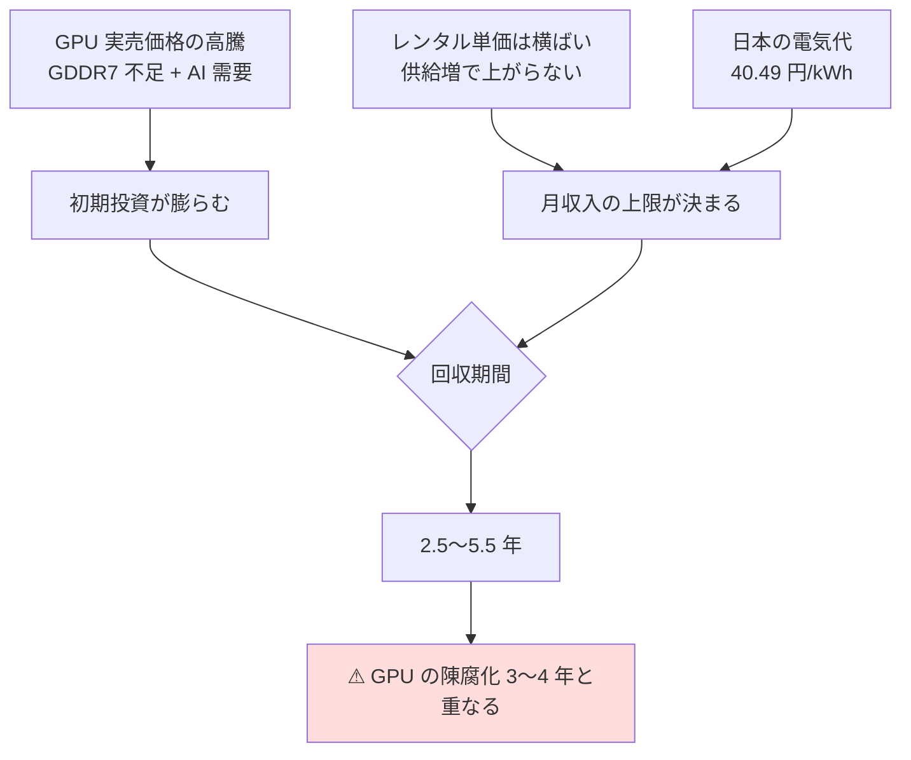
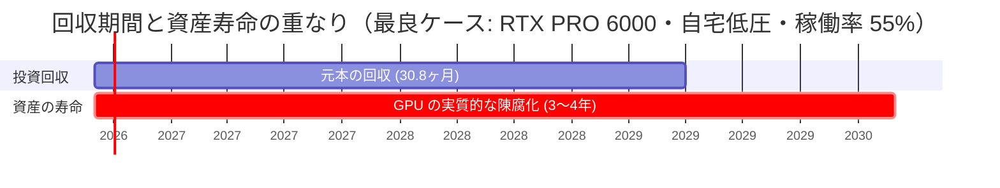

# I8 計算資源の貸出（GPU）— 調査と試算

調査日: 2026-08-27 / プラン: [docs/plans/archive/i8-gpu-rental.md](../../plans/archive/i8-gpu-rental.md)
方針: 机上調査のみ。機材購入・契約・出品は行っていない。
読み方: [../overview.md](../overview.md) ／ 体系: [../income-taxonomy.md](../income-taxonomy.md)

## 結論: **打ち切り**

確定セグメント（資金 大 × 週 5〜15 時間 × **回収 6 ヶ月〜1 年**）の回収期間条件を、**構成を問わず満たせない**。
最良ケースでも 30.8 ヶ月（2.6 年）、現実的な稼働率では 43〜67 ヶ月。

決定的なのは**上限テスト**で、稼働率 100%・電気代ゼロという物理的に不可能な理想条件でも、
RTX 4090 中古以外は 12 ヶ月回収に届かない。**稼働率や電気代の改善では届かない距離**にある。

| 構成 | 初期投資【推測】 | 月収入の上限（稼働率 100%） | 12 ヶ月回収に必要な月額 | 判定 |
| --- | ---: | ---: | ---: | :--: |
| RTX 4090 中古 1 台 | 40 万円 | 36,300 円 | 33,333 円 | △ 上限のみ辛勝 |
| RTX 5090 新品 1 台 | 90 万円 | 51,193 円 | 75,000 円 | × |
| RTX PRO 6000 1 台 | 240 万円 | 167,540 円 | 200,000 円 | × |
| RTX 5090 × 4 ラック | 340 万円 | 204,771 円 | 283,333 円 | × |

### 判定条件との照合

| # | 条件 | 結果 |
| --- | --- | --- |
| 1 | 初期投資が資金枠（1,000 万円〜）に収まる | ○ 収まる。ただし台数を増やしても回収期間は変わらない（線形）ため**資金 大の優位が働かない** |
| 2 | 回収期間 6 ヶ月〜1 年 | **× 最良 30.8 ヶ月。上限テストでも不可** |
| 3 | 自分の作業が週 5 時間未満（L3 維持） | 未検証（条件 2 で落ちたため打ち切り） |
| 4 | 個人で参入可能 | ○ Vast.ai は個人ホストを受付。電気通信事業法の届出も不要の見込み（後述） |

## なぜ成立しないか（構造的理由）

**レンタル単価がハード価格の 2〜3 年回収を前提に設計されている**ため、1 年で回収する余地が最初から無い。
そこに日本固有の電気代と、GPU の陳腐化が重なる。

最大の問題は**回収期間が陳腐化期間を追い越せない**こと。元本を返し終わる前に資産価値が消えるため、
回収期間を延ばして再検討しても（見送り枠の「回収 1〜3 年」に緩めても）**利益が残らない**。

## Phase 1: 需要側（貸出先の実在と単価）

入口そのものは**ある**。I7 のような「実例ゼロ」ではない。

| 項目 | 内容 | 区分 |
| --- | --- | --- |
| Vast.ai ホスト受付 | 個人ホストを受付中。Ubuntu + NVIDIA ドライバ + ルータのポート開放で開始できる | 【公表値】 |
| Vast.ai 手数料 | **2024 年 6 月にホスト手数料を撤廃**。ホストが設定した価格がそのまま受取額。借り手表示価格は受取額の**約 25% 上** | 【公表値】 |
| 支払い | Wise / PayPal / Stripe。**最低 $20 から**、毎週金曜に請求書生成、初回は最大 2 週間 | 【公表値】 |
| 日本からの受取 | **明示なし**。「自国で B2B 支払いを受け取れるかはホストの責任で確認」とあるのみ。本人確認・税務・事業者確認の完了が前提 | 【公表値】 |
| RunPod | **Community Cloud の新規ホスト受付を停止**。既存ホストのみ継続 | 【公表値】 |
| Salad | 個人ホスト受付中（最低 8GB VRAM / 16GB RAM / 10Mbps）。ただし単価は $0.02/h 帯と低い | 【公表値】 |
| ホスト受取単価 | RTX 4090/5090 で **$0.30〜0.60/GPU 時間**、H100/H200 で $2.15〜4.00/GPU 時間 | 【公表値】 |
| 稼働率 | **事業者は公表していない**。第三者情報では初月 30〜40%、定常でコンシューマ 50〜55%・エンタープライズ 60〜70% | 【推測】 |

⚠ **RunPod の新規ホスト受付停止**は、市場が供給過剰側に動いている兆候として重い。貸出先の選択肢は増えておらず減っている。

### 日本からの実例（【実測】は 1 件のみ確認）

- Salad / RTX 5070 / 約 6 時間で **$0.00516（約 0.82 円）**。「電気代の方が高く赤字」と報告 —【実測】（第三者・個人ブログ）
- 日本での運用不利の要因として、**電気代の高さ**と北米ピーク時間との時差が挙げられている —【推測】

## Phase 2: コスト側と規制

### ⚠ 電気通信事業法 → 届出は不要の見込み

総務省「電気通信事業参入マニュアル［追補版］」および同ガイドブックの判断枠組みでは、
**他人の通信を媒介せず、電気通信回線設備を設置しない**サービスは登録・届出の対象外。
計算資源（サーバ・GPU）の貸出は通信の媒介ではないため、**届出不要と読める**。—【推測】（一次資料の枠組みに基づく解釈）

- 一次資料: [ガイドブック PDF](https://www.soumu.go.jp/main_content/000799137.pdf) / [参入マニュアル［追補版］PDF](https://www.soumu.go.jp/main_content/000477428.pdf)
- ⚠ 断定はできない。実際に進める場合は本店所在地の総合通信局へ確認が要る（総務省が個別相談を受け付けている）
- なお条件 2 で打ち切ったため、**この論点は結論に影響しない**

### 電力（これが日本での最大の不利要因）

| 区分 | 単価 | 出典区分 |
| --- | ---: | --- |
| 東京電力 従量電灯 B 第 3 段階 | 40.49 円/kWh | 【公表値】2026-05 時点 |
| 同 第 2 段階 | 36.40 円/kWh | 【公表値】 |
| 高圧 全国平均 | 18.92 円/kWh | 【公表値】2026-03 時点 |
| 米国 家庭用平均 | 18.44 ¢/kWh ≒ 29.4 円 | 【公表値】2026-08 時点 |
| 米国 商業用平均 | 13.54 ¢/kWh ≒ 21.6 円 | 【公表値】2026-04〜08 時点 |

第三者情報に「**$0.08/kWh なら RTX 4090 で月 $60+ の純利益、$0.30/kWh 以上ではほぼ収支トントン**」という記述がある。
日本の従量電灯 B 第 3 段階 40.49 円は **$0.254/kWh**（1$=159.38 円）で、この「トントン」ゾーンの直前に位置する。

### 機材価格（高騰が直撃している）

| 機材 | 価格 | 区分 |
| --- | ---: | --- |
| RTX 5090 | MSRP 39.38 万円 → **実売 69〜80 万円** | 【公表値】2026-07 時点 |
| RTX 4090 中古 | 約 40 万円（新品時 29.8 万円を中古が上回る） | 【公表値】2026-07〜08 時点 |
| RTX PRO 6000 Blackwell | MSRP $8,565 → **実売 $13,998〜15,499（約 223〜247 万円）** | 【公表値】2026-08 時点 |

GDDR7 メモリ不足と AI 需要で、**MSRP の 1.6〜1.9 倍**で推移している。初期投資側が構造的に不利。

### その他

- ハウジング: 1 ラック（6kVA）初期 24 万円 + 月額 3.5 万〜19 万円（東京）—【公表値】
- 電源容量: RTX 5090 は TGP 575W・1000W 電源推奨。**4 台 3kW の連続稼働は一般家庭の契約（40〜60A）を食い尽くす**ため、自宅案は電源・熱・騒音で実質不可 —【推測】

## Phase 3: 試算

前提（すべて【推測】、根拠は上記【公表値】）: 1$ = 159.38 円（2026-08-27）、月 730 時間、ホスト受取 = 借り手表示価格 × 0.8、ハウジング固定費 5 万円/月。

| 構成 | 設置 | 稼働率 30% | 40% | 55% |
| --- | --- | ---: | ---: | ---: |
| RTX 4090 中古 1 台 | 自宅・低圧 | 102.2 ヶ月 | 66.6 ヶ月 | 43.7 ヶ月 |
| RTX 5090 新品 1 台 | 自宅・低圧 | 131.5 ヶ月 | 89.9 ヶ月 | 60.9 ヶ月 |
| RTX PRO 6000 1 台 | 自宅・低圧 | 58.4 ヶ月 | 43.0 ヶ月 | **30.8 ヶ月** |
| RTX 5090 × 4 | 自宅・低圧 | 124.2 ヶ月 | 84.9 ヶ月 | 57.6 ヶ月 |
| RTX 4090 中古 1 台 | 高圧・ハウジング | 回収不能 | 回収不能 | 回収不能 |
| RTX 5090 新品 1 台 | 高圧・ハウジング | 回収不能 | 回収不能 | 回収不能 |
| RTX PRO 6000 1 台 | 高圧・ハウジング | 回収不能 | 203.9 ヶ月 | 67.7 ヶ月 |
| RTX 5090 × 4 | 高圧・ハウジング | 回収不能 | 275.3 ヶ月 | 90.4 ヶ月 |

- 電気単価の安い高圧・ハウジングが**軒並み悪化する**のは、月 5 万円の固定費を 1 台あたりの粗利が回収できないため。台数を増やして固定費を薄めても、条件 2 には届かない
- 自宅・低圧が数字上は良く出るが、上記のとおり複数台構成は電源容量の制約で実質不可。**数字が良い案ほど物理的に置けない**
- 再計算スクリプト: `experiments/i8-gpu-rental/calc.py`

## 体系へのフィードバック

- I8 の AI 差分判定「新規」は**維持**でよい。市場そのものは実在し、金銭は動いている
- ただしカタログの I8 に**注記が要る**: 個人が短期回収を狙う入口としては成立しない。理由は関与度でも規制でもなく、
  **単価がハード価格の 2〜3 年回収前提で設計されており、それが GPU の陳腐化期間と重なる**という価格構造
- 「L3（人が関与しない）＝ 良い」ではない反例として使える。**関与度が低くても、資産の寿命が回収期間を下回れば利益は残らない**

## 出典（すべて 2026-08-27 取得）

- [Vast.ai — How Much Money Can You Earn Renting Out Your GPU](https://vast.ai/article/how-much-money-can-you-earn-renting-out-your-gpu-on-vast-ai)
- [Vast.ai — Host Payouts（docs）](https://docs.vast.ai/host/payment)
- [Vast.ai — Hosting Overview（docs）](https://docs.vast.ai/documentation/host/hosting-overview)
- [Vast.ai — GPU Hosting Earnings Calculator](https://vast.ai/hosting/calculator)
- [Vast.ai — June 2024 Product Update（ホスト手数料の撤廃）](https://vast.ai/article/june-2024-product-update)
- [Runpod Documentation — Choose a Pod（Community Cloud の新規ホスト停止）](https://docs.runpod.io/pods/choose-a-pod)
- [SaladCloud — Container Engine FAQs](https://docs.salad.com/container-engine/explanation/core-concepts/faqs)
- [総務省 — 電気通信事業参入マニュアル［追補版］ガイドブックの公表](https://www.soumu.go.jp/menu_kyotsuu/important/kinkyu02_000474.html)
- [総務省 — 電気通信事業参入マニュアル［追補版］（PDF）](https://www.soumu.go.jp/main_content/000477428.pdf)
- [新電力ネット — 法人・家庭の電気料金の平均単価の推移](https://pps-net.org/unit)
- [東京電力 従量電灯B 単価表 2026年](https://enegent.jp/articles/tepco-juryou-b-tanka)
- [EIA / Electricity Rates by State（米国平均単価）](https://www.chooseenergy.com/electricity-rates-by-state/)
- [RTX 5090 のスペックと実勢価格【2026年7月】](https://www.issoh.co.jp/tech/details/9876/)
- [Thunder Compute — NVIDIA RTX PRO 6000 Blackwell Pricing (August 2026)](https://www.thundercompute.com/blog/nvidia-rtx-pro-6000-pricing)
- [ゲーミングスタイル — 中古GPU相場【2026年7月】](https://gaming-st.com/gpu/used-gpu-buying-guide-2026/)
- [Zenn — ゲーミングPCで稼ぐ時代へ。GPUを貸し出して収益化するリアル（日本からの実測 1 件）](https://zenn.dev/shine0425/articles/888800e370a2d9)
- [EarnifyHub — How to Make Money Renting Out Your GPU in 2026](https://earnifyhub.com/learning-guides/make-money-renting-out-gpu-2026)
- [at+link コロケーションサービス 料金一覧](https://co-location.at-link.ad.jp/service/pricing.html)
