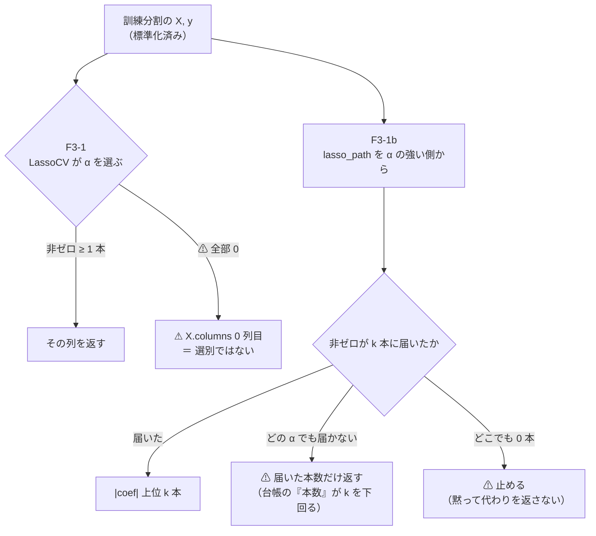

# F3-1 Lasso の裁定の反映 ＋ LightGBM × 断面 × 閾値売買（2026-09-13）

プラン: [lasso-fix-cs-threshold.md](../../plans/archive/lasso-fix-cs-threshold.md) ／ 台帳: [ledger.md](feature-discovery/ledger.md) ／ 規約: [rules.md](feature-discovery/rules.md)

## 0. 一言

⚠ **12 行とも「落とす」。保留が 1 行だけ出たが、それは選別ではなく「全部使う」である。**
⚠ **F3-1 の直し（F3-1b）は機械としては効いたが、成績は良くならなかった。**

| | 結果 |
| --- | --- |
| ①（d）既存 20 行 | ✅ **表示名と注記だけ直した。** ⚠ **台帳 679 行で消えた鍵 0・数字と判定が変わった鍵 0**【実測】 |
| ①（b）F3-1b | ✅ **実装して初回を回した。** ⚠ **本数 1.4 → 32.0 に直った**が、⚠ **上乗せは 3 θ で 2 勝 1 敗**。どちらも B&H に届かない |
| ② 断面 × 閾値売買 | ⚠ **12 行のうち 11 行が「落とす」・1 行が「保留」。** ⚠ **保留は「全部使う（基準）」θ=50 の ＋64.54bp（t 0.30）** |
| `n_trials` | **427 → 439**（＋12） |

## 1. ①（d）既存 20 行の表示名と注記

`docs/specs/experiments/feature-discovery.md` §2 の F3-1 の 1 行だけを直した。

- 手法: `Lasso・Elastic Net` → **`Lasso・Elastic Net（実装は 0 本→先頭列）`**
- 見どころ: 不具合の中身と、⚠ **本数 1.0 の行が何を測っているか**を書いた

⚠ **台帳（`ledger.md`）は生成物なので直接は触っていない。** `cli/report.py --catalog` を通すと F3-1 の 20 行の表示名だけが変わる。

✅ **(d) の約束は機械で確かめた**【実測 2026-09-13】: 台帳 **679 行**を `(ID, モデル, 層, 期間, 粒度, 地平, 特徴量の層, 検証方式, 形式, 較正, 閾値, 実行)` を鍵に突き合わせ、
⚠ **消えた鍵 0・足された鍵 0・（本数・的中率・IC・粗利・純利・fold 符号・再現・判定・理由）が変わった鍵 0**。

## 2. ①（b）F3-1b の実装

この図の主張: ⚠ **F3-1 は 0 本になると列の並び順に落ちる。F3-1b は α を弱めて k 本に届かせる。**

**事前に固定したこと**（結果を見る前。[rules.md 13-3 規約 4](feature-discovery/rules.md)）

| | 値 |
| --- | --- |
| α の刻み | `n_alphas = 100` |
| 止めどころ | 非ゼロが **k 本以上**になった最初の α |
| 返す本数 | `\|coef\|` の大きい順に **ちょうど k 本** |
| 届かないとき | ⚠ **届いた本数だけ返す**（詰めない） |
| 0 本のとき | ⚠ **`SystemExit`**（黙って代わりの列を返さない） |
| 乱数 | 使わない（`lasso_path` は座標降下。`ctx["seed"]` を読まない） |

⚠ **`ctx` に「届かなかった」を書く案は捨てた**。⚠ **読む側がいない記録は無いのと同じ**で、⚠ **返す本数そのものが信号になる**（F3-1 の穴も「本数 1.0」で見つかった）。

**カタログへの登録**

- 新 ID は **`F3-1b`**。⚠ **台帳の鍵はカタログ ID なので、同じ ID にすると既存 20 行と同じ行にまとまる**（`ail/catalog.py` の `canonical`）
- ⚠ **`_ID` を `^(F\d-\d+[a-z]?)\b` に直した**。⚠ **`\d+` のあとが `\b` だけだと `F3-1b` は 1 文字も一致しない**（`1` と `b` の間に語の境目が無い）
- カタログは **25 → 26 件**、F3 系統は **6 → 7 件**。⚠ **件数を見張る検査を意図して直した**（`tests/test_catalog.py`）

**テスト**: 276 → **291 件 pass**（新規 15）。⚠ **F3-1 側にも「壊れたままであること」の検査を置いた** — うっかり直すと落ちる。

⚠ **テストの種を選び直した**: ⚠ **雑音の引き方しだいで `LassoCV` が 0 本にならない**（種 5 では 1 本残って穴が再現しなかった）。種 0 で再現する。

## 3. ② 断面 × 閾値売買の config

`config/experiment/trade_cs_lgbm_a.toml` を 1 本だけ足した。⚠ **コードは触っていない。**

✅ **`gpu_lgbm_cs` と `tomllib` で全 key を突き合わせた**【実測】。差は **7 つだけ**:

| key | 差 | なぜ |
| --- | --- | --- |
| `features_from` | ＋`gpu_lgbm_cs` | ⚠ **表を作り直さない**（[13-8](feature-discovery/rules.md)） |
| `name` | — | — |
| `selectors` | ＋`F3-1b` の 1 本 | ⚠ **既存 4 本は 1 文字も変えていない**ので橋渡しは成立する |
| `[trading]` 3 key | ＋`threshold` / `[50,55,60]` / `shared` | 処置そのもの |
| `validation.split` | `walk_forward` → `walk_forward_dates` | [13-6 の 1](feature-discovery/rules.md) |

⚠ **`embargo_bars`・`k`・`model`・`feature_layers` は一致している。** ⚠ **embargo を 1 のままにしたのは、それが断面の層の性質（`cs`/`rel` は同じ時刻の他銘柄を見る）であって検証方式ではないから。**

⚠ **`evaluate_trading` は `validation.split` を読まない**（必ず `folds_by_dates`）。⚠ **効くのは `embargo_bars` のほう**【実測。`cli/run.py:120,128`】。

✅ **表の指紋は一致**: 同じ `data/features/gpu_lgbm_cs/d.parquet`・同じ `built_at`（2026-09-09T17-32-34）・**96,769 行 × 134 列 × 48 銘柄**。
⚠ **`data_manifest` は違う**（`81ade06…` 対 `3d14e78…`）が、これは ⚠ **生データの倉庫が 9/12 に増えたから**で、⚠ **借りている表そのものは同じファイルである。**

## 4. ⚠ 踏んだ落とし穴: `--ignore-gate` の付け忘れ

⚠ **1 度目は 1 行も回らずに終わった。**

- [rules.md 14-10 規約 2](feature-discovery/rules.md) は ⚠ **門を診断に降格した**（値は記録するが、回すかどうかを門で決めない）
- ⚠ **だが `cli/run.py` の `apply_gate` はいまも門で止める。** 規約と実装が食い違っている
- ⚠ **付け忘れると黙って終わる**（エラーにならない）。⚠ **既存 103 実行はどれも `result.csv` を持っており、門前で止まった記録を残した先例は無い**【実測】ので、中断した 2 ディレクトリは消して回し直した

⚠ **この層は 4 手法とも門前だった**【実測】。⚠ **それは回さない理由にならない**（14-10 規約 1）:

| 手法 | holdout AUC（門 0.52） | 買い% 幅（門 20 点） |
| --- | ---: | ---: |
| 全部使う（基準） | 0.496 | 0.70 |
| F3-3 並べ替え(MDA) | 0.508 | 3.23 |
| F3-1 Lasso | 0.486 | 2.50 |
| **F3-1b Lasso（本数を固定）** | 0.472 | ⚠ **14.70** |

✅ **門の値の時点で (b) の効きが見えていた**: ⚠ **F3-1b の買い% 幅は F3-1 の 5.9 倍**（14.70 対 2.50）＝ ⚠ **先頭列 1 本では予測がほとんど動いていなかった。**
⚠ **ただし AUC は逆に下がっている**（0.486 → 0.472）。⚠ **「幅が出た ＝ 当たる」ではない。**

## 5. 結果

⚠ **B&H（常に上・期初買い期末売り）は ＋1,545.68bp/fold。** ⚠ **採否はこれとの上乗せで測る**（[13-7](feature-discovery/rules.md)）。

| 手法 | θ | 純利bp | ⚠ 上乗せbp | fold 符号 | 乱択ゲート差bp | 判定 |
| --- | ---: | ---: | ---: | :-: | ---: | :-: |
| **全部使う（基準）** | 50 | ＋1610.23 | **＋64.54** | 3/5 ＋＋＋−0 | ＋371.7 | **保留** |
| F3-3 並べ替え(MDA) | 50 | ＋1415.05 | −130.63 | 2/5 ＋−−＋− | ＋134.9 | 落とす |
| F3-1 Lasso | 50 | ＋1199.49 | −346.19 | 1/5 0−−−＋ | −30.2 | 落とす |
| F3-1b Lasso | 50 | ＋1107.64 | −438.04 | 2/5 −＋−−＋ | ＋208.8 | 落とす |
| 全部使う（基準） | 55 | ＋643.34 | −902.34 | 1/5 −＋−−− | −16.7 | 落とす |
| F3-1b Lasso | 55 | ＋368.10 | −1177.58 | 1/5 −＋−−− | −69.2 | 落とす |
| F3-3 並べ替え(MDA) | 55 | ＋160.27 | −1385.41 | 0/5 −−−−− | ＋54.1 | 落とす |
| F3-1 Lasso | 55 | ＋21.80 | −1523.88 | 0/5 −−−−− | −86.8 | 落とす |
| 全部使う（基準） | 60 | ＋414.50 | −1131.19 | 0/5 −−−−− | −6.0 | 落とす |
| F3-1b Lasso | 60 | ＋304.85 | −1240.84 | 1/5 −＋−−− | −53.1 | 落とす |
| F3-1 Lasso | 60 | ＋191.04 | −1354.65 | 1/5 −＋−−− | ＋49.3 | 落とす |
| F3-3 並べ替え(MDA) | 60 | ＋12.94 | −1532.74 | 0/5 −−−−− | −129.1 | 落とす |

### 5-1. ⚠ 唯一の保留は選別ではない

⚠ **正の上乗せが出たのは「全部使う（基準）」θ=50 の 1 行だけ**（＋64.54bp・**t 0.30**・3/5・DSR 0.116）。

⚠ **選別 3 本はどの θ でも「全部使う」に負けた。** ⚠ **134 列を全部使うのが最良** ＝ ⚠ **断面の層でも「選別の軸」は効かない**（own・ownex で出ていた結論がそのまま再現した）。

⚠ **t 0.30 は検出限界の 1 桁下**である。⚠ **「＋64.54bp 勝った」と読まない。**

### 5-2. ⚠ F3-1 と F3-1b の直接対決（同じ実行・同じ fold・同じ表）

⚠ **これが本タスクで新しく測れたものである。**

| θ | F3-1（本数 1.4） | F3-1b（本数 32.0） | 差 |
| ---: | ---: | ---: | ---: |
| 50 | ＋1199.49 | ＋1107.64 | ⚠ **F3-1 の勝ち ＋91.85** |
| 55 | ＋21.80 | ＋368.10 | F3-1b の勝ち ＋346.30 |
| 60 | ＋191.04 | ＋304.85 | F3-1b の勝ち ＋113.81 |

- ✅ **機械としては直った**: ⚠ **本数 1.4 → 32.0。** ⚠ **買い% 幅 2.50 → 14.70 点。**
- ⚠ **成績は良くならなかった**: **2 勝 1 敗**で、⚠ **4 行とも B&H に届かない。** ⚠ **AUC はむしろ下がった**（0.486 → 0.472）
- ⚠ **だから「F3-1 の不具合が結果を歪めていた」とは言えない。** ⚠ **直しても落とす行が落とす行のままである**
- ⚠ **これは 1 つの層・1 つのモデル・1 実行の話である。** ⚠ **本数 1.0 の 11 行に遡って当てはめない**（それらは再計算しない — 14-10 規約 5）

### 5-3. ⚠ leak 対照で F3-1b の本数が 1.0 になったのは正しい挙動

⚠ **先読みの列を入れた対照では、F3-1b も本数 1.0 を返した**【実測】。⚠ **これはフォールバックではない。**

`LEAK_future_ret` が完全な予測子なので、⚠ **その 1 本で残差がほぼ 0 になり、どの α でも 2 本目が非ゼロにならない。**
⚠ **「どの α でも k 本に届かない → 届いた本数だけ返す」がそのまま働いた** ＝ ⚠ **設計どおりで、しかも本数の列にそう見えている。**

### 5-4. 診断（採否に使わない）

| | 値 |
| --- | --- |
| 実効系列数 | **6.47**（48 銘柄）。⚠ **own の us63 は 4.19** なので断面のほうが広い |
| t 値の割引 | 0.3671 |
| 検証日数 | 1,716 日（fold あたり 343 日） |
| 下げ局面 3 回の上乗せ合計 | ＋3,124.7bp（3 回中 2 回が正）。⚠ **2022 年の下げで ＋2,914.2bp・保有日率 0.42** |
| 銘柄別 | 48 銘柄中 44 が正（中央値 ＋7,551bp）。⚠ **これは 0 との比較であって B&H との比較ではない** |

## 6. 検算

| # | 検算 | 結果 |
| ---: | --- | :-: |
| 1 | テスト | ✅ **291 件 pass**（前 276 ＋ 新規 15） |
| 2 | (d) で既存の台帳の行が動いていないか | ✅ **679 行・消えた鍵 0・数字と判定が変わった鍵 0** |
| 3 | ②で既存の台帳の行が動いていないか | ✅ **消えた鍵 0・数字と判定が変わった鍵 0**（足されたのは 21 行 ＝ 手法 12 ＋ 基準線 9） |
| 4 | leak 対照が跳ねたか | ✅ **上乗せ ＋22,950.40bp・t 20.31・DSR 1.000・AUC 1.000**（4 手法とも門を通過） |
| 5 | 表の指紋 | ✅ `gpu_lgbm_cs` と同じファイル・同じ `built_at`・96,769 行 × 134 列 × 48 銘柄 |
| 6 | config の差 | ✅ `tomllib` 全 key 照合で **7 key だけ**（`embargo_bars`・`k`・`model`・`feature_layers` は一致） |
| 7 | 台帳の数 | 試行 **427 → 439**（＋12）／ 落とす 351 → 362 ／ 保留 76 → 77 |

⚠ **基準線の突き合わせはできなかった**: ⚠ **この表（断面 48 銘柄）で閾値売買を回したのは今回が初めて**なので、⚠ **B&H・乱択・直前符号はどれも「1 実行」で、他の実行と照合する相手がいない**。⚠ **own / ownex のときにあった「基準線 12 行が一致」の検算がここには無い。**

## 7. 費用の実測

| | 見込み【推測】 | ⚠ 実測 |
| --- | --- | --- |
| 本番 ＋ leak | 10〜25 分 | ⚠ **4 分 9 秒**（本番 1:53・leak 2:15） |

⚠ **見積りを 4 回続けて過大に外した**（MLP は 1 桁・`sel_lgbm_two`・今回）。⚠ **CPU 時間は本番 22 分 32 秒・leak 25 分 29 秒**なので、⚠ **計算量が小さいのではなく並列が効いている。**

⚠ **MDA が 134 列で 4 倍重くなる」という見立ては外れた。** ⚠ **次に断面で見積もるときは「35 列 1 分 44 秒 × 列数比」を使わない。**

## 8. 限界

- ⚠ **1 層・1 モデル・1 形式・1 実行。** ⚠ **(B) 銘柄別は回していない**（比較相手が (A) にしかいないため。[13-6](feature-discovery/rules.md)）
- ⚠ **F3-1 と F3-1b の比較は 3 θ しかない。** ⚠ **2 勝 1 敗を「F3-1b のほうが良い」と読むには標本が足りない**
- ⚠ **既存の Lasso 行（本数 1.0 の 11 行ほか）は再計算していない**（14-10 規約 5）。⚠ **それらが何を測っていたかは名前と注記で示すだけである**
- ⚠ **基準線の突き合わせができていない**（§6）
- ⚠ **`cli/run.py` の門と rules 14-10 の食い違いは直していない**（別タスクに起こした）
