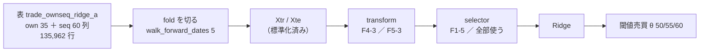

# 台帳の空白「大」2 件 — F4-3 tsfresh の総当たり ／ F5-3 行列プロファイル（記録）

実施日: 2026-09-16。プラン: [ledger-blanks-large-two.md](../../plans/archive/ledger-blanks-large-two.md)。派生元: [TODO](../../../TODO.md) の「台帳の空白を埋める」。
利用者の選択（2026-09-16）: 候補 4 つのうち **A1（台帳の空白 2 件）**。

> ⚠ **これでカタログの「実施可能な未実施」は 0 件になった。** 残るのは見送り 3 件（F4-2・F5-2・F2-4）だけ。
> ⚠ **回した理由は「効くはず」ではない。** 「未実施」を「効かなかった」と読ませないために埋めた（[rules.md 14-10 規約 4](feature-discovery/rules.md)）。

## 0. 位置づけ

> この図の主張: ⚠ **2 件とも「窓 60 列 → 新しい列」の変換**であり、既存の `transform` の口にそのまま乗る。表も `cli/run.py` も作り直していない。

| ID | 手法 | 系統 | 選別 | ⚠ 出す列 |
| --- | --- | --- | --- | --- |
| F4-3 | tsfresh の総当たり | F4 生成型 | **F1-5 検定+FDR**（カタログが「F1-5 と対」と書く組） | 783 列 → 訓練分割で全 NaN・定数を落として **450 列**（事前測定は 446）＋ `own` 35 |
| F5-3 | 行列プロファイル（モチーフ） | F5 表現学習型 | 全部使う（基準） | 部分列 m=10 の自己結合から **5 列**（最近傍距離の 最小・中央値・最大・最後の点、時間差の中央値）＋ `own` 35 |

## 1. 作ったもの

| 場所 | 中身 | ⚠ 要点 |
| --- | --- | --- |
| `requirements.txt` | `tsfresh` 0.21.2（`stumpy` 1.14.1 は依存で入る） | ⚠ **既存の固定版は 1 つも動かなかった**（`pip install --dry-run` → install → 352 件 pass で確認） |
| `ail/features/tsfresh.py` | **新規**。`@register("transform", "F4-3 tsfresh の総当たり（783 列）")` | ⚠ **層ではなく変換**（§1-1）。⚠ **tsfresh は ±inf も返す**（テストで踏んだ）ので NaN に寄せる |
| `ail/selectors/representation.py` | `tf_matrixprofile`（F5-3） | ⚠ **`stumpy.stump` を窓の内側にだけ当てる**。⚠ **系列全体に当てない**（§1-2） |
| `ail/bootstrap.py` | import 1 行 | |
| `config/experiment/` | `trade_ownseq_tsf_a` ／ `trade_ownseq_mp_a` | `features_from = "trade_ownseq_ridge_a"`（表は作り直さない） |
| `config/queue/blank_large2.toml` | 本番 2 ＋ leak 2 | `cli/queue.py` の 3 度目の再利用 |
| `tests/test_blanks_large2.py` | 14 件 | 行をまたぐ漏れ・時間の向き・決定性・列の始末・⚠ **落とす列を訓練分割だけで決めているか** |
| `tests/test_catalog.py` | 実装 ID の固定一覧に 2 件 | |

### 1-1. ⚠ 台帳の「次の一手」から変えたこと

`catalog_notes.toml` は 2 件とも **feature 層**と書いていた。**`transform` に変えた。** ⚠ **`catalog.implemented()` が見るのは `selector` と `transform` の registry 名だけ**なので、層にすると回しても台帳 §3 で「未実施」のままになる。F5-4 ウェーブレットが同じ口で先に通っている。

### 1-2. ⚠ F5-3 の先読みは構造的に消した

カタログは F5-3 に「先読みが入りやすい」と付けている。⚠ **それは系列全体に `stumpy.stump` を当てる素朴な使い方への警告**で、足 i の値が未来の部分列との距離を含む。
⚠ **窓（`seq` 層）は `shift(k≥0)` だけで作られている**ので、その 60 列の中に閉じれば未来に触れる経路が無い。`tests/test_blanks_large2.py` の「行を並べ替えても各行の出力は変わらない」がこれを機械で確かめる。⚠ **それでも `--leak` 対照は切っていない**。

### 1-3. ⚠ 選別を 1 本にした理由

⚠ **台帳の鍵は名前の先頭の ID で寄る**（`ail/catalog.py` の `canonical`）。「F4-3 … ＋ 全部使う」と「F4-3 … ＋ F1-5」は同じ鍵 `F4-3` に潰れ、1 行の中で数字が食い違う。`trade_own_poly_a` と `trade_own_gp_a` が踏んだ穴と同じ。

## 2. 事前登録（⚠ 回す前に決めた。結果を見て動かしていない）

| 項目 | 値 |
| --- | --- |
| 実行 | 本番 2 ＋ `--leak` 対照 2 ＝ 4 |
| **n_trials** | **598 → 604**（＋6 ＝ 2 手法 × θ 3 水準） |
| 判定 | 対 B&H 上乗せの符号（[13-7](feature-discovery/rules.md)）。B&H ＝ ＋1,652.02bp/fold |
| モデル・形式・分割・種 | Ridge ／ (A) 銘柄共通 ／ `walk_forward_dates` 5 fold・purge ／ 種 0 |
| F4-3 の水準 | `ComprehensiveFCParameters`・窓 60・全 NaN と定数は訓練分割で落とす・訓練分割の平均で埋め訓練分割で標準化・生の窓は落とし `own` は残す |
| F5-3 の水準 | 部分列 m = 10・自己結合・出す列 5 本・訓練分割で標準化 |
| 打ち切り | キュー 7,200 秒 ／ 連続失敗 3 本 ／ Phase 0 の実測が 1 実行 4 時間を超えたら回さず設計へ戻る |

## 3. Phase 0 — 計算時間と列の実態【実測 2026-09-16】

⚠ **1 実行で変換を通る行は 452,615 行**（表の 3.33 倍。ウォークフォワードで訓練が伸びるため）。

| 変換 | 1 行あたり | 1 実行（見積り） | 決めたこと |
| --- | ---: | ---: | --- |
| tsfresh（`n_jobs=16`） | 3.03 ms | 22.9 分 | そのまま |
| stumpy 逐次 | 10.44 ms | ⚠ 78.8 分 | ⚠ **予算超過** → joblib 16 分割 |
| stumpy 並列 | 1.06 ms | 8.0 分 | 採用 |

| tsfresh の出力（3,000 窓） | 列数 |
| --- | ---: |
| `ComprehensiveFCParameters` | **783**（⚠ カタログの「794」は出ない。tsfresh 自身の `matrix_profile` 計算子は依存 `matrixprofile` が無く無効 ＝ F5-3 と重ならない） |
| 全部 NaN（窓 60 では出ない計算子） | 277 |
| 一部だけ NaN | ✅ **0**（補完の設計を落とせた） |
| 定数 | 60 |
| 残る | **446**（NaN 率 0） |

## 4. 結果【実測 2026-09-16】

⚠ **先に対照を見た。** F4-3 の `--leak` 対照は **＋22,193.70bp・t 17.14・5 fold とも ＋・門の AUC 1.0** で跳ねた ＝ 配線は生きている。その上で本番を読む。

### 4-1. F4-3 tsfresh の総当たり ＋ F1-5 検定+FDR（Ridge・own ＋ seq・2018 表）— ⚠ **3 行とも「落とす」**

| θ | 純利bp | 取引回数/fold | 保有日率 | 対 B&H 上乗せ bp | t | fold の符号 | 乱択ゲート差 bp | DSR |
| ---: | ---: | ---: | ---: | ---: | ---: | :-: | ---: | ---: |
| 50 | ＋1,263.85 | 1,432.4 | 0.744 | **−388.17** | −1.21 | −＋−−−（1/5） | −117.78 | 0.061 |
| 55 | ＋1,013.93 | 80.6 | 0.531 | **−638.08** | −1.67 | −＋−−−（1/5） | −90.52 | 0.040 |
| 60 | ＋427.36 | 32.4 | 0.250 | **−1,224.66** | −2.55 | −−−−−（0/5） | ＋18.97 | 0.007 |

B&H ＝ ＋1,652.02bp/fold（15 実行と一致）。fold ごとの上乗せ: θ=50 **−1,451.50 / ＋543.75 / −205.69 / −513.31 / −314.10** ／ θ=55 −652.34 / ＋408.06 / −89.95 / −1,811.11 / −1,045.07 ／ θ=60 −426.49 / −686.06 / −250.65 / −2,554.50 / −2,205.60。

- ⚠ **B&H を超えた行は 0。** 勝ったのは 3 θ とも fold 2 だけで、θ=60 は 5 fold とも負け（この表でいちばん強い「負けている」証拠）
- ⚠ **純利は 3 行とも正だが、それは「買って持っただけ」で出る分**（13-7 が純利の符号を採否に使わない理由）
- ⚠ **θ=50・55 は同じ保有日率の乱択ゲートにも負けている**（−117.78 / −90.52bp）。θ=60 は ＋18.97 で乱択並み
- ⚠ **F1-5 は 485 列のうち平均 326.2 列を残した**（67%）。11 万行では小さな相関も FDR 10% を通るので、⚠ **「選別」はほとんど絞っていない**。的中率 0.5188・IC **−0.0040**（負）
- 門（診断）: holdout AUC 0.5226（fold 別 0.523 / 0.552 / 0.523 / 0.479 / 0.486 — 後半 2 fold は 0.5 未満）・買い% 幅 **5.27 点**（2.5〜12.0）→ 門前の水準だが 14-10 規約 2 で回した。⚠ **幅 5 点は較正後の確率がほとんど動いていない**ことを意味し、θ=60 で取引が 32 回/fold に落ちるのはそのため
- 列の始末【実測】: 783 → 全 NaN 277・定数 **56** を落として **450 列**（3,000 窓の事前測定は 60・446 だった。定数かどうかは標本で変わる）。⚠ **検証分割に NaN・inf が 1,280〜2,020 セル/fold 出た**（450 列 × 22.7k 行の 0.01〜0.02%。訓練分割の平均で埋めた。⚠ **事前測定の 0 件を信じて保険を外していたら止まっていた**）
- 比較: 同じ表・同じ Ridge の F4-1 記号回帰は −219 / −384 / −699bp（[evolutionary-search.md](evolutionary-search.md)）。⚠ **783 列の総当たりは 16 本の式より悪い**

### 4-2. F5-3 行列プロファイル（モチーフ）＋ 全部使う（Ridge・own ＋ seq・2018 表）— ⚠ **3 行とも「落とす」**

F5-3 の `--leak` 対照も **＋22,193.74bp・t 17.14・5 fold とも ＋・門の AUC 1.0** で跳ねた（⚠ **leak 列は変換を生き残る** — 対照の `残した元の列` が 36 ＝ own 35 ＋ `LEAK_future_ret`）。

| θ | 純利bp | 取引回数/fold | 保有日率 | 対 B&H 上乗せ bp | t | fold の符号 | 乱択ゲート差 bp | DSR |
| ---: | ---: | ---: | ---: | ---: | ---: | :-: | ---: | ---: |
| 50 | ＋1,376.44 | 1,091.4 | 0.724 | **−275.58** | −1.16 | −＋−−＋（2/5） | −79.16 | 0.081 |
| 55 | ＋1,168.89 | 103.8 | 0.571 | **−483.13** | −1.84 | −＋−−−（1/5） | −34.28 | 0.057 |
| 60 | ＋694.88 | 35.2 | 0.315 | **−957.14** | −2.30 | ＋−−−−（1/5） | −93.71 | 0.019 |

fold ごとの上乗せ: θ=50 −577.48 / ＋362.20 / −242.28 / −992.85 / ＋72.54 ／ θ=55 −246.29 / ＋57.38 / −273.92 / −479.83 / −1,472.98 ／ θ=60 ＋127.84 / −962.00 / −273.92 / −1,471.99 / −2,205.60。

- ⚠ **B&H を超えた行は 0。** ⚠ **3 θ とも同じ保有日率の乱択ゲートに負けている**（−34〜−94bp）
- 列は own 35 ＋ mp 5 ＝ **40 本**。的中率 0.5179・IC **−0.0023**（負）。⚠ **定数の窓は 0 件**（NaN の埋めは訓練・検証とも 0）
- 門（診断）: holdout AUC **0.4981**（fold 別 0.480 / 0.535 / 0.505 / 0.454 / 0.498）・買い% 幅 6.04 点 → 門前の水準だが 14-10 規約 2 で回した。⚠ **AUC が 0.5 を下回る ＝ 訓練内でも当たっていない**
- ⚠ **F4-3 より上乗せの絶対値は小さいが、向きは同じ。** ⚠ **5 列（要約）でも 450 列（総当たり）でも、`own` 35 列に足して良くなる方向には動かない**

### 4-3. 2 件を並べて読む

| | F4-1 記号回帰（16 本の式） | **F4-3 tsfresh（450 列 → F1-5 で 326）** | **F5-3 行列プロファイル（5 列）** |
| --- | ---: | ---: | ---: |
| 上乗せ θ=50 / 55 / 60（bp） | −219 / −384 / −699 | **−388 / −638 / −1,225** | **−276 / −483 / −957** |
| 乱択ゲート差 θ=50（bp） | — | −118 | −79 |
| IC | — | −0.0040 | −0.0023 |

⚠ **同じ表・同じ Ridge・同じ fold で、列を機械で増やす（F4-3）も窓を要約し直す（F5-3）も、探索で作った 16 本の式に届かない。** ⚠ **これは「効かない」の実測が F4 系統・F5 系統に 1 つずつ増えた**ということであり、⚠ **「未実施」を「効かなかった」と読ませないために埋めた**という目的は果たした。

## 5. 検算

| 検査 | 結果 |
| --- | --- |
| leak 対照が跳ねたか | ✅ 2 本とも: F4-3 ＋22,193.70bp ／ F5-3 ＋22,193.74bp（t 17.14・5/5・門 AUC 1.0・幅 100） |
| n_trials | ✅ **598 → 601（F4-3 の後）→ 604（F5-3 の後）**。事前登録どおり ＋6 |
| 判定の内訳 | ✅ 落とす **520 → 526**（＋6）／ 保留 78 のまま ／ 採る 0 のまま |
| 判定が変わった既存行 | ✅ **0**。`git diff` で動いたのは基準線 6 行の「3 実行・一致 → 5 実行・一致」（代表の実行が変わっただけで数字は同じ） |
| B&H | ✅ 2 実行とも **＋1,652.02bp/fold**（同じ表の 15 → 17 実行で一致） |
| 台帳 §3 | ✅ 実装 21 → **23**・回した 21 → **23**・未実施 5 → **3**（F4-2・F5-2・F2-4 ＝ 全部「見送り」）。系統別: F4 3/4・F5 3/4 に |
| テスト | ✅ 新規 14 ＋ 既存（`test_catalog.py` の実装 ID 一覧に 2 件・「見送りと未実施の区別」の期待値を 0 ＋ 3 に）＝ **366 件 pass** |
| 1 実行 1 ディレクトリ | ✅ `runs/` に 4 つ（本番 2・leak 2）。予算で止まった後の再開は状態ファイルから続いたので重複なし |

## 6. 費用【実測 2026-09-16】

| 実行 | 秒 | Phase 0 の見積り | 差 |
| --- | ---: | ---: | --- |
| `trade_ownseq_tsf_a` | **3,633.5** | 1,374（22.9 分） | ⚠ **2.6 倍** |
| `trade_ownseq_tsf_a_leak` | **3,617.0** | 同上 | 同上 |
| `trade_ownseq_mp_a` | **112.0** | 480（8.0 分） | ✅ **1/4** |
| `trade_ownseq_mp_a_leak` | **111.0** | 同上 | 同上 |
| 合計 | **7,473.5（124.6 分）** | 3,708（62 分） | 2.0 倍 |

- ⚠ **tsfresh が遅かったのはメモリ**: 16 ワーカー × RES 2.3GB で **23.7 / 31GB・swap 1.8GB**【実測】。事前測定（4,000 窓）ではこの段に届かなかった。→ WSL2 のメモリ割当を増やす件を `TODO.md` に足した
- ✅ **stumpy が速かったのは事前測定の固定費**: 20,000 窓で 21 秒のうち、プール起動と numba の JIT が大半だった。本番は 452,615 行で 100 秒未満
- ⚠ **予算 7,200 秒は 2 本目で尽き、キューは残り 2 本を pending にして止まった**（時計は起動ごと）。⚠ **設定は緩めず、同じコマンドで再開した**（設計どおり）。⚠ **再開の判定で `pgrep -f` が監視スクリプト自身に当たり「まだ動いている」と 2 度誤読した** — CLAUDE.md が警告している罠そのもの。行頭を `python` に固定した正規表現（`^[^ ]*python -m cli\.queue …`）で解決
- 人手: Phase 0 約 40 分 ／ 実装とテスト 約 1.5 時間 ／ 記録 約 1 時間

## 7. 限界

- 1 表・1 モデル・1 形式・1 窓長でしか回していない（⚠ **「tsfresh は効かない」ではなく「この条件では効かない」**）
- F4-3 の 446 列は F1-5（FDR 10%）で絞ったが、⚠ **絞り方を替えれば別の列が残る**（替えた数だけ n_trials が増える）
- F5-3 の部分列 m は 10 の 1 通り。⚠ **m を振れば別の要約になる**（同上）
- ⚠ **3.33 倍の再計算は残した**（行ごとのキャッシュを作らなかった。予算内に収まったため）
