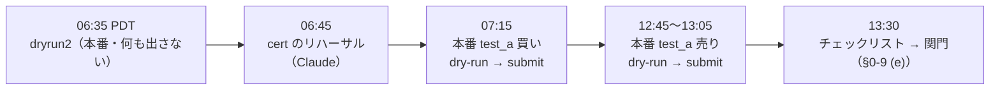
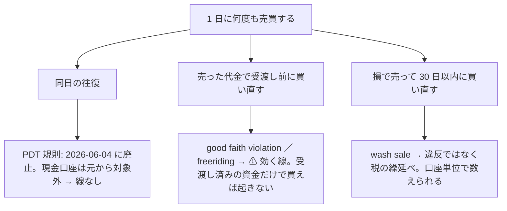
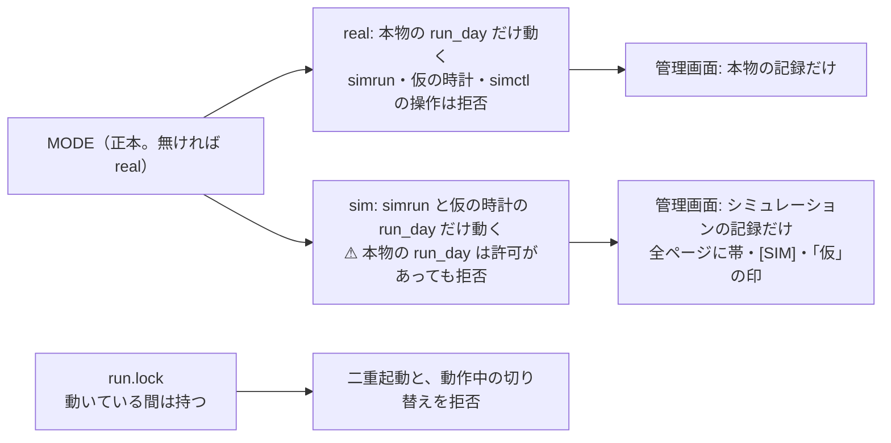
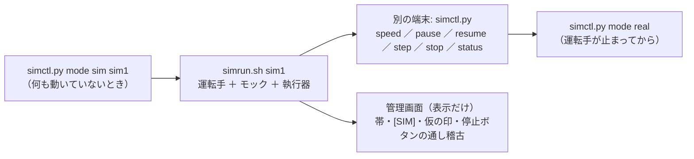
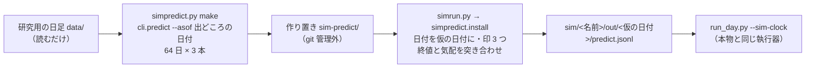
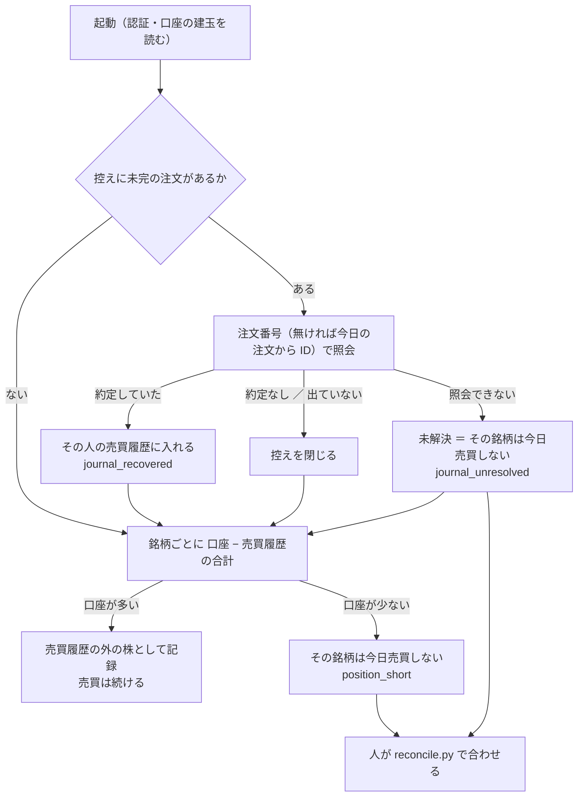
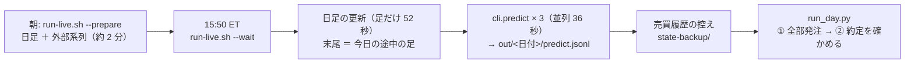
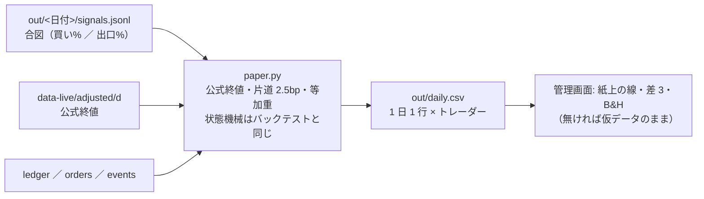
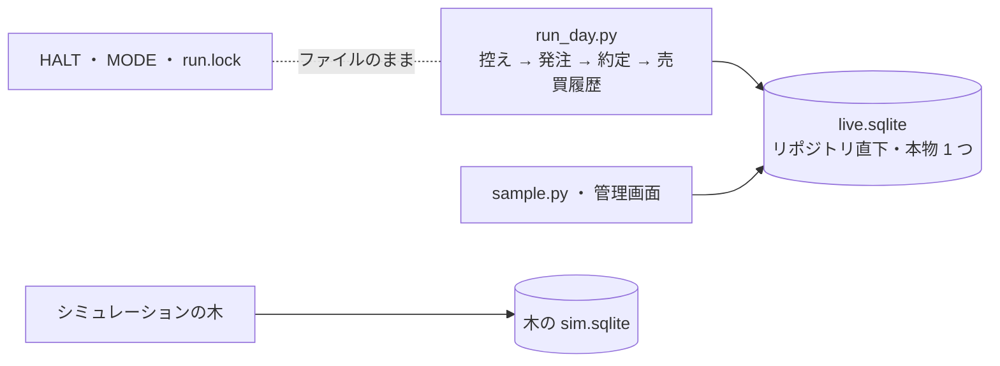

# 実売買 — トレーダー 3 人に予算を割り振り、tastytrade の本口座で売買して執行の差を記録する

プラン: [docs/plans/live-trading-three-models.md](../../plans/live-trading-three-models.md)。コード: `experiments/live-trading/`。
⚠ **2026-08-27 の方針の 2 つ目の例外**（CLAUDE.md）。判定するのは**執行の差と無人運転**であって「儲かったか」ではない。

## 0. 決めごと（事前固定）

⚠ **2026-09-17 の利用者決定: 実際に動かすトレーダーの属性はまだ設定しない。実売買のテストは先に行う**（プラン §0-1）。
✅ **2026-09-19 の利用者決定: 3 人のモデル・θ・予算・合成規則・種は候補のまま確定**（[B6 のプラン](../../plans/live-trading-trader-attributes.md)）。⚠ **残る未設定は銘柄集合と株数の決め方だけ**（§0-3 の `dryrun2` で決まる）。

### 0-1. トレーダーの定義と、実際に動かす 3 人（✅ 2026-09-19 確定。銘柄集合と `sizing` は 2026-09-21 に確定 ＝ 整数株・5 本）

| 属性 | 型 | 置き場 |
| --- | --- | --- |
| 名前 | 文字列（記録と画面の識別名。変えない） | `config/traders/<名前>.toml` の `name` |
| 予算 | $（執行器が超える買いを拒む） | `budget_usd` |
| 銘柄集合 | 銘柄の配列、または feature-discovery の `universe` 名 | `symbols` ／ `universe` |
| 予測モデル | 1 本以上。`kind = fixed`（固定の合図）／ `file`（CSV の合図）／ `experiment`（実験名。`predict.jsonl` を読む） | `[[models]]` |
| 合成規則 | `asis`（1 本のとき）／ `mean` ／ `majority`（奇数本）／ `unanimous` | `combine` |
| 閾値 θ | 50 以上（rules.md 13-3） | `threshold` |
| 株数の決め方 | `shares`（整数株）／ `notional`（金額指定 `Notional Market`。§0-3 で通ったときだけ） | `sizing` |
| 試験用 | `fixed` ／ `file` を持つトレーダーは `test = true` が要る。記録に `test: true` が付き判定に混ぜない | `test` |

| トレーダー | モデル | θ | 予算 | 銘柄集合 | 状態 |
| --- | --- | --- | --- | --- | --- |
| `T1` | `trade_own_ridge_a`（全部使う（基準）・Ridge）。`asis`・種 0 | 50 | A $300 ／ B $3,000 | ✅ `shares`・T・PFE・NKE・VZ・BAC（2026-09-21。§0-3） | ✅ 2026-09-19 確定 |
| `T2` | `trade_ownex_lgbm_a`（全部使う（基準）・LightGBM）。`asis`・種 0 | 55 | A $300 ／ B $3,000 | 同上 | ✅ 2026-09-19 確定 |
| `T3` | `trade_ownseq_ridge_a` の検知器「T3 QUANT（60日窓）」。`asis`・種 0 | 50 | A $300 ／ B $3,000 | 同上 | ✅ 2026-09-19 確定 |
| 予備 | — | — | A $100 ／ B $1,000 | — | 規制費・約定の端数・受渡しの遅れ |
| `test_a`（試験用） | `file`（`config/signals/test_a.csv`。日付ごとに 買い ／ 出口 を手で書く） | 50 | $30 | `T`（us63 で株価が最も低い。$25.4【実測 2026-09-18 00:00 ET の気配】） | ✅ 固定。本番の最小額 1 発注に使う |

⚠ **銘柄集合と `sizing` の規則（結果を見る前に固定。2026-09-19）**: §0-3 の `notional_market_5usd` が通れば **`sizing = "notional"`・`universe = "us63"`（63 本・1 銘柄は規模 A $4.76 ／ 規模 B $47.62）**。通らなければ **`sizing = "shares"` で銘柄を事前固定で絞る** ＝ ✅ **2026-09-20 利用者決定 D3: 会社株 48 本のうち 2026-09-18 の終値の低い順に 5 本・3 人共通（T $25.40 ／ PFE $27.66 ／ NKE $35.51 ／ VZ $48.09 ／ BAC $57.73【実測】。1 銘柄の枠 $60）**。T2 は会社株しか予測しないので ETF を入れない。⚠ `dryrun2` の結果を見る前に決めた。候補の設定は `config/traders/candidates/{notional,shares}/`（1 人の予算 ÷ N が 1 株の値段を超える銘柄しか買えない。本数は下の表）。
✅ **2026-09-21 の結果と利用者決定**: 金額指定は通ったが最低 $5（$4.76 は断られる）・端株は 1 本 $0.10 の手数料 → 規則の前提（$4.76 で買える）が崩れたので利用者が裁定 ＝ **3 人とも `shares`・上の 5 本**。`config/traders/T1〜T3.toml` は `candidates/shares/` の写し（テスト `test_confirmed_traders_are_the_shares_candidates`）。
#### 予算の規模 — A $1,000 と B $10,000 を並べて比べる（2026-09-19。利用者の決定）

利用者の指示: **「$1000 と $10000 の両方を比較できるようにして。$10000 は実際の取引で使えない可能性があるのでそれを明記する」**（$1,000 が購入の制限になっているため）。

| | 規模 A: $1,000 | 規模 B: $10,000 |
| --- | --- | --- |
| 実際の取引で使えるか | ✅ **使える**（口座の残高 $1,000【実測 2026-09-16】） | ⚠ **実際の取引では使えない可能性がある**（口座に $10,000 は入っていない。$9,000 の追加入金は利用者の判断で、Claude は実行しない） |
| 1 人の予算 ／ 予備 | $300 × 3 ／ $100 | $3,000 × 3 ／ $1,000 |
| 執行器の上限 | `--max-total-budget 1000 --max-day-usd 1000`（⚠ **既定**） | `--max-total-budget 10000 --max-day-usd 10000` を明示したときだけ |
| 63 本の等加重の 1 銘柄の枠 | $4.76 | $47.62 |
| 含み損 20% の停止（1 人 ／ 3 人同時） | $60 ／ $180（予備 $100 を超える）【推測】 | $600 ／ $1,800（予備 $1,000 を超える）【推測】 |
| 使いどころ | 実売買（Phase 5）・紙上の対照・机上の検証 | ⚠ **紙上の対照と机上の検証だけ**（追加入金が着いて受渡しが済むまで、実売買には使わない。口座全体の歯止めは置いていないので、先に動かすと買いが口座に断られてエラーが並ぶ） |

整数株で買える銘柄の数（us63 の 63 本中。終値は 最小 $25.6・中央値 $209.8・最大 $1,123.9【実測 2026-09-19・手元の日足の最終日】。K ＝ 同時に保有できる銘柄数で、1 銘柄の枠 ＝ 1 人の予算 ÷ K）:

| K | A の枠 | A で買える | B の枠 | B で買える（⚠ 実取引では使えない可能性） |
| ---: | ---: | ---: | ---: | ---: |
| 1 | $300 | 42 本 | $3,000 | 63 本 |
| 3 | $100 | 13 本 | $1,000 | 61 本 |
| 5 | $60 | 8 本 | $600 | 55 本 |
| 10 | $30 | 2 本 | $300 | 42 本 |
| 20 | $15 | 0 本 | $150 | 23 本 |
| 63（いまの閾値売買） | $4.76 | 0 本 | $47.62 | 5 本 |

⚠ **どちらの規模でも、63 本の等加重を整数株では再現できない**（端株 `Notional Market` が §0-3 で通るかが分かれ目のまま）。⚠ **記録・画面・文書で規模 B の数字を出すときは、必ず「実際の取引では使えない可能性がある」と添える。**
⚠ **選んだ基準は族の違い（線形 ／ 木 ／ 時系列分類器）で、成績ではない**。検証結果一覧【実測・生成日 2026-09-19】では 対 B&H 上乗せ ＋12.79 ／ ＋48.72 ／ ＋61.92 bp/fold・fold の符号 1/5 ／ 2/5 ／ 2/5 の「保留」。⚠ **T1 の「保留 ＋12.79」は較正「旧」（2026-09-12 より前の、数値解が止まっていた Platt 較正）の行の数字**。いまのコード（較正 std）で同じ構成を回すと θ=50 は **純利 1,381.12・対 B&H −270.89bp/fold・fold 2/5 ＝「落とす」**（検証結果一覧の std の行。4 実行・一致【実測 2026-09-19】）。⚠ **実売買の「今日の買い%」はいまのコード ＝ std で出るので、T1 は検証結果一覧では「落とす」の構成である**。選んだ基準は族の違いで成績ではないので確定は動かさないが、替えるなら新しい検証として利用者が決める。⚠ **ここから先にモデル・θ・合成規則を替えるのは新しい検証**（n_trials に足す）。
⚠ **種 0 で合図は再現する**【実測 2026-09-19】: T2 の同じ種・同じ入力の 2 実行は純利が小数 4 桁まで一致。検証結果一覧の「3 実行・幅 123bp」は種ではなく `ex_` / `im_` の修正前後の入力の差（B6 のプラン §5）。
⚠ **T2 は銘柄を選んでいない**【実測 2026-09-19・[topk-holdings.md §3-2](topk-holdings.md)】: `trade_ownex_lgbm_a` の買い% は同じ日の全銘柄でほぼ同じ値（96% の日で最高値が同点・中央値 48 本）。⚠ **T2 は「いつ買うか」だけを決め、48 銘柄をほぼ同時に買い、ほぼ同時に売る**。⚠ **T2 の銘柄は us63 ではなく会社株 48 本**（config の `targets = "company"`。ETF 15 本を含まない）。
⚠ **上位 K（保有できる銘柄数に上限を置く）は 2026-09-19 に机上で回した**（[topk-holdings.md](topk-holdings.md)。採る 0 ／ 45）。⚠ **その結果で実売買の K を選ばない**（rules.md 17-6 の 4）。執行器には入れていない。
`config/traders/T1.toml`〜`T3.toml` は `sizing` と銘柄が決まってから書く（半端な設定を置かない）。

#### トレーダーのお金と持ち株（2026-09-18。利用者の決定）

⚠ **目的は「予算を上手く増やす」シミュレーション**。口座は 1 つだが、お金と持ち株はトレーダーごとに分けて扱う（口座は合算しか見せないので、執行器が按分して持つ）。

| 決めごと | 中身 | 実装 |
| --- | --- | --- |
| 持ち株 | トレーダーごと（1 人 1 ファイル。銘柄・株数・取得単価・建てた日） | `state/<env>/<名前>.json`（`state.py`） |
| 売り | ⚠ **自分の持ち株だけ売れる。他のトレーダーが買った株は売れない**。⚠ **内部移転はしない**（2026-09-19 の利用者決定「内部移転はダメです。トレーダーの実際の実績が検証できない」）＝ 同じ回で A の売りと B の買いが同じ銘柄でも付け替えず、**両方をその人の注文として口座に出す（売りが先・買いが後）**。2026-09-18 から 09-19 までは、口座に出さず気配の中値・手数料 0 で A の株を B に渡していた ＝ その人 1 人では出せない値段が成績に入り、差 1 の標本も欠けた。代償: 重なった日はスプレッドを 2 回払う・同じ日に同じ銘柄の売却と購入が口座の記録に残る（損で売ると wash sale の報告になりうる【推測・一次情報未確認】） | `plan.py` の `decide`・`size_intents`・`to_orders` |
| 口座への注文 | ⚠ **トレーダーごとに別々に出す**（2026-09-19 の利用者決定「トレーダーごとの成績を正確に知りたいので別々に出す。また手数料など金額の内訳も保存するように」）。同じ銘柄を 2 人が同じ日に買えば注文は 2 本。⚠ **合算しない・按分しない** ＝ 約定価格も手数料もその人のものがそのまま残り、整数株の人に端数の持ち分ができない（§0-7 (j) の 1）。内部移転もしない（上の行）。代償: 注文の本数が増える（us63 × 3 人で最大 189 本・レート制限に近づく）。⚠ **2026-09-20 から発注は 2 段**（先に全部出す → 約定を 1 本ずつ確かめる ＝ §0-9 (c)。1 本ずつ約定を待つ直列の形では初日の約 120 本が窓に収まらない） | `plan.to_orders`（1 意図 1 注文。`NetOrder.parts` は常に 1 人） |
| 金額の内訳 | 注文ごとに `orders.jsonl` の `amounts` ＝ 約定代金 `gross_usd` ／ 手数料 `fee_usd` と内訳 `fee_breakdown`（dry-run の `fee-calculation` を丸ごと）／ `buying_power_effect` ／ 差し引き `net_usd`（買いは負）。手数料は約定した注文のぶんだけ、その人の売買履歴（`state` の `fees_usd`・`history[].fee`・`ledger.jsonl` の `fees_usd`）に入る。⚠ **出どころは dry-run の見積り**（`fee_source: "dry_run_estimate"`）。約定後の実額を読む経路（`/accounts/{n}/transactions`【記憶・未確認】）はまだ無い。⚠ 実現損益には手数料を含めない（今までどおり別建て） | `execute.ExecResult.amounts`・`allocate_fills`・`run_day.py` |
| 持ち金 | ⚠ **固定の予算枠**。空き ＝ 予算 − 建玉の取得原価 − 受渡し待ちの売却代金。⚠ **実現損益と手数料は空きに入れない**（得をしても損をしても、次の空きは予算まで戻る。増えた分は使わずに残る） | `plan.py` の `size_intents` |
| 自分の予算枠が足りない | 注文を出す前に見送る。事象 `over_budget` ／ `too_small` として記録する（⚠ エラーではなく「見送り」） | 同上 |
| 口座全体の歯止め | ⚠ **置かない**（発注の前に口座の使える現金と比べない）。⚠ 全員が損をすると空きの合計が口座の現金を超えうる（規模 A: 予算 $300 × 3 ・停止条件 20% なら最悪 $180 で予備 $100 を超える ／ 規模 B: 最悪 $1,800 で予備 $1,000 を超える【推測】） | — |
| 口座に断られた買い | ⚠ **エラーとして記録する**。`orders.jsonl` の状態が `error`（dry-run ／ 発注で拒否）か `Rejected`（受付後に拒否）で、ブローカーのエラーの種類・コード・文面を残す。資金不足のような 4xx は再送しない（再送は `Session offline` と 5xx だけ）。約定が無いので持ち株と損益は変わらない。管理画面の「問題」に数える | `execute.py` の `run_one`・`is_transient` |
| 断られたときの巻き込み | ⚠ 同じ銘柄の買いは全員ぶんを 1 注文にまとめるので、断られると乗っていた全員が一緒に失敗する（誰の何株ぶんかは `parts` に残る） | `plan.py` の `aggregate` |
| 1 日の売買回数 | トレーダーの判断（CLAUDE.md の 2 つ目の例外。2026-09-18）。⚠ **いまの執行器は 1 日 1 回の窓（§0-2）のまま** | — |

- ⚠ 資金不足のときに tastytrade が返すエラーコードはまだ見ていない【未確認】。「資金不足」の分類を別に作るのは、実際に 1 度起きてコードを確かめてから
- ⚠ 「予算を増やせたか」はトレーダーの目標であって、判定には使わない（CLAUDE.md の例外: 損益で手法を採らない）

### 0-2. 予算の上限・執行の窓・停止条件・判定の閾値

| 項目 | 値 | 執行器での実装 |
| --- | --- | --- |
| 全トレーダーの予算の合計の上限 | **規模 A $1,000**（口座の残高【実測 2026-09-16】。⚠ 既定）／ **規模 B $10,000**（⚠ **実際の取引では使えない可能性がある**。§0-1 の表） | `run_day.py --max-total-budget`（既定 1000。超えると起動しない。規模 B は 10000 を明示する） |
| 1 日の買いの合計の上限 | **規模 A $1,000**（既定）／ **規模 B $10,000**（同上） | `--max-day-usd`（既定 1000） |
| 1 人の予算 | `budget_usd`。空き ＝ 予算 − 建玉の取得原価 − 受渡し待ちの売却代金（暦日 T+1・保守側） | `plan.size_intents`（超える買いは `over_budget` ／ `too_small` の事象として記録し見送る） |
| 執行の窓 | **15:45〜16:05 ET**（⚠ **NYSE の営業日**。2026-09-18 から休場日を暦で見る）。合図は 15:50 の気配、注文は成行 | `run_day.window_refusal`（`in_window`）。外では発注せず、理由を `events.jsonl` の `out_of_window.reason` に残す（`--ignore-window` はテスト用）。暦は `tastytrade-api-sample/market_calendar.py`（管理画面と同じもの。【公表値】NYSE・取得 2026-09-18） |
| 半日立会の日 | ⚠ **発注しない（未決のあいだの既定）**。13:00 ET 引けなので、窓 15:45〜16:05 は引けの後になる。20 営業日の実験にかかるのは **2026-11-27（金）と 2026-12-24（木）** | `window_refusal` が「半日立会」で拒否する。⚠ **窓を 12:45〜13:05 に動かすかは利用者の裁定**（TODO の D13） |
| 未約定の取消 | 窓の終わり（発注から 600 秒） | `--cancel-after` |
| 再送 | `Session offline` と 5xx は 60 秒おき 3 回まで。再送の前に `external-identifier` で重複を探す。4xx と認証の 401 は再送しない | `execute.is_transient` |
| 停止 | `HALT`（管理画面の停止ボタンと同じファイル）／ 含み損が予算の 20%（`ledger.jsonl` の `drawdown_pct_of_budget`）＝ ⚠ **執行器は警告だけ・止めるのは人**（2026-09-19 の利用者決定。それまでの文面「発注をやめて持ち越す」は実装されていなかった ＝ §0-7 (j) の 2）。自動で投げ売りしない・自動で発注も止めない。利用者が警告を見て停止ボタンを押す ／ 説明できない差が 3 日続く（利用者が止める） | `HALT` は執行器が毎回見る。含み損は `run_day.DRAWDOWN_WARN_PCT`（20.0）以上のトレーダーごとに `events.jsonl` へ `drawdown_warning`（rc は変えない）。管理画面は「問題」に数える |
| 判定の閾値（20 営業日） | プラン §2-4 の表（執行価格の差 中央値 ≤ 5bp ／ 紙上 − 実物 ≤ 5bp/日 ／ 人手 0 回 ／ 執行できた日 95% 以上） | Phase 6 |

### 0-3. 本番の dry-run — 端株・小数株・成行・MOC 相当（✅ 2026-09-21 12:10 PDT【実測】）

`experiments/tastytrade-api-sample/sample.py --step dryrun2 --allow-prod-dry-run` が 9 通り（2026-09-19 に 3 行足した）を dry-run だけで通し、記録（`out/tastytrade-prod-*.jsonl` の step 10）に残す。⚠ **何もルーティングしない。**

| 許可 | 注文 | 知りたいこと | 結果 |
| --- | --- | --- | --- |
| `notional_market_5usd` | `Notional Market` $5.00 | 金額指定の端株が API から出せるか（【記憶・未確認】） | ✅ 通る（SPY $5.00・買付余力の変化 $5.10・**手数料 $0.10**） |
| `limit_fractional_0.01` | 指値 0.01 株 | 小数の `quantity` が通るか | ❌ 422 `fractional_market_orders_only`（端株は成行か金額指定だけ） |
| `market_fractional_0.01` | 成行 0.01 株 | 同上（成行） | ✅ 通る（**手数料 $0.10**） |
| `market_1` | 成行 1 株 | 基準 | ✅ 通る（手数料 $0.001） |
| `market_on_close_1` | `Market On Close` 1 株 | MOC 相当の種別があるか（無ければエラー文に使える種別の一覧が出る見込み） | ❌ 400 `validation_error`（`order-type` に `Market On Close` は無い） |
| `limit_1_low` | 指値 1 株（気配の 8 割） | 対照（2026-09-05 に通っている） | ✅ 通る（手数料 $0.001） |
| `notional_market_4.76usd` | `Notional Market` $4.76（2026-09-19 に足した） | ⚠ **実際の 1 銘柄の枠**（規模 A $300 ÷ 63 本 ＝ T1・T3）。$5.00 は通るがこれが落ちる ＝ 最小額が $5 | ❌ 422 `below_notional_value_minimum`（**金額指定は最低 $5**） |
| `notional_market_6.25usd` | `Notional Market` $6.25（同上） | T2 の枠（$300 ÷ 会社株 48 本） | ✅ 通る（手数料 $0.10） |
| `market_sell_fractional_4dp_no_position` | 成行 売り 0.0123 株（`Sell to Close`。同上） | 執行器は金額指定の人の端株を小数 4 桁の数量で売る（§0-7 (j) の 1 の未確認）。⚠ **建玉が無いので断られる見込み** ＝ 知りたいのは「数量の形で断られるのか、持ち高で断られるのか」（エラー文から読む） | ❌ 422 `closing_with_no_position`（⚠ 数量の形ではなく持ち高で断られた ＝ 小数 4 桁の数量そのものは弾かれていない） |

結果で決まるもの: `test_a` と実際の 3 人の `sizing`（端株が通れば `notional` で $5 刻み、通らなければ `shares` で銘柄を絞る。プラン §2-3）。

✅ **結果（2026-09-21・記録 `out/tastytrade-prod-20260921T191032Z.jsonl`・市場 `Open`）**: 端株は通るが、⚠ **金額指定は最低 $5**（T1・T3 の 1 銘柄の枠 $4.76 ＝ $300 ÷ 63 本では 1 本も買えない）・⚠ **端株の注文は 1 本 $0.10 の手数料**（$5 の注文で 2%。整数株の成行は $0.001）【dry-run の見積り】。
→ ✅ **利用者決定（2026-09-21）: 3 人とも `shares`・D3 の 5 本（T・PFE・NKE・VZ・BAC）**。`config/traders/T1〜T3.toml` は `candidates/shares/` の写し。
⚠ 決めてあった規則（「通れば notional」）は最低額を想定していなかった ＝ 一意に決まらなかったので利用者が裁定した。⚠ 紙上の対照の片道 2.5bp は整数株の成行の手数料（$0.001）に対しては控えめ・端株（$0.10）なら 1 桁以上小さい。

### 0-4. cert の dry-run【実測 2026-09-18 00:00 ET】— 配線は最後まで通った

`run_day.py --traders test_a --date 2026-09-18 --mode dry-run --ignore-window` を市場時間外に流した。

| 段 | 結果 |
| --- | --- |
| 認証（cert）| 1 回目・2 回目は nginx の **502**（深夜の cert）。3 回目で通った → 5xx は 30 秒待って 1 回取り直す規則を足した（401 は再検証しない） |
| 口座・残高・建玉 | cert の $100,000 を読めた |
| 気配 | ⚠ cert は配信しないので**本番の資格情報で読む**。T bid 25.40 / ask 25.45 / last 25.44（`updated-at` 00:00:01 ET） |
| 合図 → 計画 | `test_a.csv` の 9/18 の行（買い 100）→ 未保有 → 買い → $30 ÷ 1 銘柄 ÷ $25.42 → **1 株** |
| dry-run（cert） | 1 回目 **504** `timeout_error`・2 回目 **502** → 3 回目で API に届き、**422 `tif_no_after_hours_opening_market_orders`（市場が閉まっていると建玉を作る成行は出せない）** |

⚠ 市場時間外の拒否は想定どおり（2026-09-08 の sample と同じ）。**市場時間の sandbox リハーサル（Phase 2 の 6）が残る。** 記録は `experiments/live-trading/out/2026-09-18/`（口座番号・トークンは出ていないことを grep で確認）。

### 0-5. 実売買のテストの手順書（Phase 5-1。⚠ 利用者が行う。2026-09-20 に D1 ＝ 案 B へ書き換えた）

⚠ **Claude はここまで。許可を出して起動するのは利用者。** 時刻は PDT（titan の時計）と ET。執行の窓 15:45〜16:05 ET ＝ **12:45〜13:05 PDT**。
✅ **2026-09-20 の利用者決定 D1 ＝ 案 B**: `test_a` の往復を **9/21（月）の 1 日で済ませる** ＝ 朝に買い（窓の外なので `--ignore-window`）・窓の中で売り。売りの経路を月曜のうちに本番で確かめ、火曜の窓を 3 人の投入だけに使う。同日の往復は規制上は可（受渡し済みの資金で買った株。§0-6）。⚠ 買いが決めごとの窓の外になるが、試験用（`test: true`）なので判定に混ぜない。同じ日に 2 回起動して 買い → 売り が通ることはモックで確かめた【実測 2026-09-20】。全体の段取りは [プラン](../../plans/live-trading-go-live-0922.md) §3-2。

> この図の主張: 月曜は「何も出さない確認 → sandbox で出す → 本番で 1 株買う → 窓の中で売る」の順で、どの段も 1 つ前が通ってから進む。



**前日まで（✅ 2026-09-20 に Claude が済ませた）**: `config/signals/test_a.csv` は 2026-09-21 の買い ／ 執行器の pytest・`mockrun.sh`・`selftest.sh` が通る ／ 管理画面の停止ボタン（`HALT` は `experiments/tastytrade-api-sample/out/HALT`）。

**9/21（月）06:35 PDT — `dryrun2`（本番。何もルーティングしない。5 秒強）**

```bash
cd experiments/tastytrade-api-sample && .venv/bin/python sample.py --step dryrun2 --allow-prod-dry-run
```

結果は Claude が記録（`out/tastytrade-prod-*.jsonl` の step 10。⚠ `mock: true` の無い最新のもの）から §0-3 に写し、`config/traders/candidates/` の `notional` ／ `shares` のどちらかを `config/traders/T1〜T3.toml` に写す。

**07:15 PDT 頃 — 本番 `test_a` の買い**（cert のリハーサルが `Filled` まで行ってから）

```bash
cd experiments/live-trading
PY=../tastytrade-api-sample/.venv/bin/python
$PY test_signal.py buy                      # 今日（ET）の行を「買い 100」に（✅ 9/21 ぶんは書いてある。念のため）
# (a) 本番の dry-run（何もルーティングしない）。注文 1 件が通り、buying-power-effect が $25 前後であること
$PY run_day.py --traders test_a --env prod --mode dry-run --allow-prod-dry-run --ignore-window
# (b) 本番の発注（実弾）。許可 2 つを両方付ける。記録は out/<日付>/orders.jsonl
TT_ALLOW_PROD_ORDERS=1 $PY run_day.py --traders test_a --env prod --mode submit --i-know-this-is-real-money --ignore-window
```

**12:45〜13:05 PDT — 本番 `test_a` の売り**（窓の中なので `--ignore-window` は付けない）

```bash
$PY test_signal.py exit                     # 今日の行を「出口 100」に書き換える
$PY run_day.py --traders test_a --env prod --mode dry-run --allow-prod-dry-run
TT_ALLOW_PROD_ORDERS=1 $PY run_day.py --traders test_a --env prod --mode submit --i-know-this-is-real-money
```

**チェックリスト（買い・売りそれぞれ）**

- [ ] `orders.jsonl` の `final_status` が `Filled`・`fills[].price` と `quote_at_signal.mid` の差（bp）
- [ ] `positions.jsonl` の `after` に T 1 株（買いの後）／ 無し（売りの後）
- [ ] `state/prod/test_a.json` の `holdings`・`realized_usd` が口座と一致（`$PY reconcile.py --env prod show` で差 0）
- [ ] `events.jsonl` に `retry` ／ `halted` ／ `over_budget` が無いか（あれば理由を §1 に書く）
- [ ] `grep -r "<口座番号の下 4 桁>" out/` が空（秘密が出ていない）
- [ ] 何かおかしければ管理画面の停止ボタン（`HALT` ＋ 全取消）。執行器は次の起動で `HALT` を見て発注しない

**⚠ 先に指摘するもの**: 現金口座なので、売った代金（約 $25）は翌営業日まで買いに使わない（執行器も受渡し待ちとして差し引く）。火曜の 3 人の予算 $900 は受渡し済みの現金の内 ／ 同じ日・同じ銘柄の売買が口座の記録に残る（損で売れば wash sale の報告になりうる【推測】。金額は数セント）／ ⚠ **認証に失敗したら連打しない**（IP が約 8 時間ブロックされ、火曜まで潰れる）。

### 0-6. 規制の線 — 1 日に何度も売買するとき（E17・E18。2026-09-18 調査）

2026-09-18 に「1 日に何回売買するかはトレーダーの判断」と決まり、「1 日 1 回なら同日の往復は起きない」という前提が外れた。⚠ **机上の調査**（口座にも執行器にも触れていない）。⚠ **法令・税の最終判断は利用者（と CPA）**。

**主張: 口座は 1 つの現金口座なので、線は口座単位で引かれる。効くのは「受渡し前の代金で買わない」の 1 本で、執行器はすでにそれを守っている。**



| # | 線 | 一次情報【公表値】（取得 2026-09-18） | この実験への含意 |
| --- | --- | --- | --- |
| E17-a | **Pattern Day Trader（日計りの回数制限・$25,000）** | **2026-06-04 に廃止**。FINRA Regulatory Notice 26-10「FINRA Adopts New Intraday Margin Standards to Replace the Day Trading Margin Requirements」（https://www.finra.org/rules-guidance/notices/26-10 ）: PDT の指定・$25,000 の最低資産・day-trading buying power を削除し、**信用口座の**日中証拠金の基準に置き換える（SEC 承認 2026-04-14。Federal Register 2026-07485。業者の移行期間は 2027-10-20 まで）。tastytrade は「day-1 で実装済み」「**Cash accounts … were never subject to pattern day trading rules and remain subject to T+1 settlement and good faith violation rules**」（https://tastytrade.com/learn/markets/industry/pattern-day-trading/ ） | ✅ **同日の往復の回数に規制の上限は無い**（現金口座。記録でも `is-pattern-day-trader: false`・`day-trading-buying-power: 0.0`）。⚠ プラン §4 の「PDT: 同日往復を作らない」は、規制の理由としては古くなった |
| E17-b | **現金口座の支払い（Reg T）** | 12 CFR 220.8(a): 現金口座で買えるのは「sufficient funds in the account」があるか、顧客が速やかに全額を払うと業者が good faith で受け入れたとき ／ (c): 全額を払う前に売ると「the privilege of delaying payment beyond the trade date shall be withdrawn for **90 calendar days**」（https://www.law.cornell.edu/cfr/text/12/220.8 ）。FINRA の解説: 「Buying and selling the same security in a cash account before paying for it is known as 'free-riding'」「'good faith violation' if you purchase a security with cash from a transaction that hasn't settled yet and then sell the security before the proceeds used to fund the purchase have settled」（https://www.finra.org/investors/investing/investment-products/stocks/day-trading 。2026-06-04 更新） | ⚠ **効く線はこれ**。違反になるのは「受渡し前の代金で買う → それを、元の代金が受渡される前に売る」の組。⚠ **受渡し済みの資金だけで買えば、同日に何度往復しても違反は起きない** |
| E17-c | **受渡し（T+1）と tastytrade の扱い** | 株・ETF・オプションは T+1。「when you get **5 good faith violations in a rolling 12-month period**, your account will be set to **closing-only**」（https://tastytrade.com/learn/accounts/account-resources/margin-vs-cash-accounts/ ）。ヘルプ（Day Trading Rules in a Cash Account。https://support.tastytrade.com/support/s/solutions/articles/43000435231 ）の検索結果の要旨: 現金口座は日計りの回数に制限なし・ただし settled funds だけ ／ 5 回目で 90 日の closing-only ⚠ **ヘルプ本文は取得できなかった**（JS 描画。要旨は検索結果から ＝ 【推測】扱い） | 売った代金は**翌営業日**から使える（休場日は数えない ＝ §0-2 の暦）。⚠ **closing-only になると買えなくなり、実験が 90 日止まる** |
| E18 | **wash sale** | IRS Pub 550・IRC §1091: 損で売った日の前後 30 日（計 61 日）に実質同一の証券を買うと損失は否認され、新しい株の取得価額に足される。⚠ **1099-B（Box 1g）でブローカーが報告するのは same account・same CUSIP の分**（[trading-tax.md §2-2・§2-7](../trading-tax.md)。出典はそちら） | **違反ではなく税の繰延べ**。⚠ **口座は 1 つなので、トレーダー A の損切りとトレーダー B の買いでも成立する**（ブローカーは誰の判断かを知らない）。回数と銘柄の重なりが増えるほど起きやすい。金額は月 $1 未満【推測】だが、年末をまたぐ繰延べは翌年に回る。税の扱いは CPA に確認 |

**執行器はすでに E17-b の線の内側にいる**（コードは変えていない）:

- 予算の空き ＝ 予算 − 建玉の取得原価 − **受渡し待ちの売却代金**（`plan.py`・`state.unsettled`）。同日に売った代金は `today + 1 日 > today` で受渡し待ちに数えられ、その日の買いには使われない
- ⚠ `unsettled` は営業日ではなく暦日で 1 日を数える。執行が営業日にしか起きないので結果は T+1（営業日）と一致する【推測。金曜に売る → 月曜は受渡し済み・休場日を挟んでも次の営業日が T+1】。docstring の「保守側」は正確ではない（同じ結果になるだけ）
- ⚠ **前提が 1 つある**: 全トレーダーの予算の合計 ≤ 口座の受渡し済みの現金（§0-2 の上限 ＝ 入金額。規模 A の $1,000 は満たす。⚠ 規模 B の $10,000 は、追加入金が着くまで満たさない ＝ 実際の取引では使えない）。トレーダーは自分の予算の受渡し済みの分しか使わないので、他のトレーダーの受渡し待ちの代金に手を付けない。⚠ **ブローカーが買いにどの現金を充てるか（受渡し済みを先に使うか）は未確認**【推測: 受渡し済みが足りていれば違反にならない】

**C9・D13・D14 への含意**（⚠ **決めるのは利用者**。ここは候補と理由まで）:

| 決めごと | 規制から言えること | 候補 |
| --- | --- | --- |
| C9 今日買った株を今日売ってよいか | ✅ **規制上は可**（受渡し済みの資金で買った株なら、同日に売っても GFV にならない） | 可とする ／ 1 日 1 方向に絞る（執行の差を見る実験としては単純） |
| C9 売った日に買い戻してよいか | ⚠ **売った代金では買えない**（翌営業日から）。予算に受渡し済みの空きが別にあれば可。⚠ 損切りの買い戻しは wash sale（税の繰延べ） | 売った銘柄は翌営業日まで買わない（単純で、GFV も wash sale の当日分も避ける）／ 空きがあれば可 |
| D14 1 日の上限の数え方 | 回数に規制の上限は無い。上限は予算（受渡し済み）が自然に掛ける | 買いの合計額で数える（いまの `--max-day-usd`）を複数回の合計に |
| 歯止め | GFV は 12 か月で 5 回目に 90 日の closing-only | ⚠ 口座の GFV の回数は API で読めるか未確認。執行器が受渡し待ちを使わない限り 0 回のはず → **記録に GFV の通知が出たら停止**を停止条件（§0-2）に足す候補 |

### 0-7. シミュレーション — 仮データと仮の時計で執行器を通しで動かす（決めごと 2026-09-19 ／ ✅ 実装も同日。使い方は (h)）

利用者の指示（2026-09-19）: **「仮データを用意し実際の売買のコードを動かしテストを行う。時間経過は実際の何倍かで進めたり止めたりして管理画面でも確認できる」**。プランは [live-trading-sim-clock.md](../../plans/archive/live-trading-sim-clock.md)。
✅ **2026-09-19 に実装した**（利用者の指示「仮データを使ったシミュレーションを進められる？」。(a)〜(g) が決めごと、(h) が使い方、(i) が筋書きの日、(j) が回して見つかったこと）。⚠ **資金は動かさない**（接続先はモックだけ）。⚠ **tastytrade の挙動の【実測】にはならない**。⚠ **仮データの損益・差は判定（§2）に混ぜない**。

#### (a) ⚠ 実売買とシミュレーションは排他 — 必ず分かるようにする（利用者決定。この節でいちばん上の決まり）

> この図の主張: 機械全体のモードは 1 つだけで、片方のモードではもう片方の部品が起動を拒む。切り替えは、何も動いていないときに人が CLI で行う。



| 決めごと | 中身 |
| --- | --- |
| モードの正本 | `experiments/live-trading/MODE`（git 管理外。`mode` ＝ `real` ／ `sim`・`name`・`since`・`by`）。⚠ **無ければ `real`** ＝ いまの動きを 1 行も変えない |
| 起動の排他 | `run.lock`（`flock`）。執行器も運転手も起動時に取り、終わるまで持つ。取れなければ起動しない |
| 実売買モードで拒否するもの | `simrun.py` ／ `run_day.py` への仮の時計 ／ `simctl.py` の速さ・停止の操作 |
| シミュレーションモードで拒否するもの | ⚠ **本物の `run_day.py`（cert ／ prod・本物の時計）**。`TT_ALLOW_PROD_ORDERS=1` と確認の引数があっても拒否し、**本物の** `out/<日付>/events.jsonl` に `refused_mode_sim` を残す（「起動しなかった日」の理由が後から分かる） |
| 仮の時計を受け付ける条件 | MODE が `sim` ＆ 接続先がループバックのモック ＆ `--env prod` でない ＆ 本番の許可（`TT_ALLOW_PROD_*`）が付いていない。1 つでも外れたら起動を拒否 |
| 切り替え | `simctl.py mode sim <名前>` ／ `simctl.py mode real`。⚠ **CLI だけ**。`run.lock` が取れないときは拒否。`mode.log` に残す。⚠ 本物の状態（`state/prod/*.json`）に建玉が残っているときに `sim` へ入るなら、「シミュレーション中は実売買の執行器が動かない ＝ 手仕舞いも出ない」と表示して追加の確認（`--real-trading-will-stop`）を要求する |
| 置き場 | 本物 ＝ `out/`・`state/<env>/`・`out/HALT`（いまのまま）／ シミュレーション ＝ `sim/<名前>/` の下だけ（git 管理外）。⚠ **互いの木に 1 バイトも書かない**。停止ボタンも、いまのモードの側の `HALT` だけを書く |
| トレーダーの名前 | ⚠ シミュレーションのトレーダーは名前が **`sim_` で始まる**こと（運転手が検査）。本物の設定（`T1`〜`T3`・`test_a`）はシミュレーションの木に置けない |
| 記録の印 | シミュレーションの全行に `sim: true`・`mock: true`・`test: true` |
| 見分け | 管理画面: シミュレーションモードの間、全ページの最上部に実売買では使わない色の帯（「シミュレーション — 仮データ・仮の時計（×N）。実売買ではない」＋ 仮の時刻）・`<title>` の頭に `[SIM]`・数字と図に「仮」の印・`/api/*` に `mode`。⚠ **1 つの画面・1 つの応答に本物とシミュレーションを混ぜない**。モードと記録の木が食い違えば数字を出さない ／ CLI: 1 行目にモード ／ ログ・履歴: 1 行ごとにモードの欄 |
| デモ | `AIL_DEMO=1` はいまのまま別の帯（読むだけ・何も動かさないので排他の対象にしない） |
| 公開面（g3plus） | 常に実売買の側だけ（`sim/`・`MODE` は載せない） |

#### (b) 操作は CLI だけ・管理画面は表示だけ（利用者決定）

| 決めごと | 中身 |
| --- | --- |
| 操作 | `simctl.py`: `speed <倍>`（×1 ／ ×10 ／ ×60 ／ ×300 ／ ×1440 ／ `max`）／ `pause` ／ `resume` ／ `step`（1 営業日進めて止まる）／ `status` ／ `stop` ／ `mode …`。`control.json` と `MODE` を書くだけで、運転手が読み直す |
| 管理画面 | ⚠ **表示だけ**。POST の経路は 1 本も増やさない（`/ops/halt`・`/ops/resume`・`/ops/retry-auth` のまま）。`dashboard.md` §3 の権限の表は変えない。既存の停止ボタンはシミュレーションでも効く（通し稽古） |
| 見送ったもの | 管理画面の操作パネル（いったん決めて同日に戻した）。足すときの線はプラン §4-1 に控えた |
| 運転手の起動 | `./simrun.sh <名前>`（CLI）。web からプロセスを起こす口は作らない |

#### (c) 仮データ — 取得済みの実データの日足を再生する（推奨どおり）

| 決めごと | 値 | ⚠ 理由・注意 |
| --- | --- | --- |
| 値段の出どころ | `feature-discovery/data/adjusted/d/<銘柄>.csv` の終値（調整済み・取得済み。新しい取得はしない） | 値段が本物なので、整数株・予算・枠の検査が現実と同じ形で出る |
| 仮の期間 | **2026-10-01 〜 2026-12-31 の NYSE の営業日 64 日**（暦は執行器と管理画面が共有する `nyse_calendar.py`） | ⚠ **実売買の 20 営業日の実験が実際に踏む暦**: 休場 11-26・12-25 ／ **半日立会 11-27・12-24**（§0-2 で「発注しない」が既定）。暦に載っている年は 2026 だけなので 2026 年内に置く |
| 値段の当て方 | 出どころの **2026-06-01 から営業日の順に 1 日ずつ**、仮の期間の営業日へ当てる（k 番目の仮の営業日 ＝ 出どころの k 番目の足。69 本あるので足りる【実測】） | ⚠ **日付は仮・値段は過去の実物**。だから損益に意味は無い。暦を書き換えずに半日立会を踏める |
| 気配 | その日の終値を中心にスプレッド 2bp。銘柄ごとにモックへ流す | ⚠ いまのモックは気配が全銘柄で 1 本 → 銘柄ごとに持てるよう広げる（Phase 2） |
| 約定 | モックの `--fill-noise 0.003`・種 0（`mockrun.sh` と同じ） | 差 1 が 0 にならない |
| 限界 | 日中の値動きが無い（15:50 の気配 ＝ 終値 ± 雑音）／ モックは tastytrade ではない（拒否の文面・資金不足のコードは想像） | 本物の挙動は sandbox のリハーサルと本番の 1 発注でしか分からない |

#### (d) 動かすトレーダー — まず試験用の 3 人（推奨どおり）

| 名前 | 予算 | 銘柄 | `sizing` | モデル（`kind = "file"`） | 合成 ／ θ | 確かめるもの |
| --- | ---: | --- | --- | --- | --- | --- |
| `sim_a` | $300 | T・VZ・BAC（1 銘柄 $100） | `shares` | m20 | `asis` ／ 50 | 整数株の基本形 |
| `sim_b` | $300 | T・PFE・VZ・BAC・KO・XLF・XLE・XLU・NVDA・SPY（1 銘柄 $30） | `notional` | m20 | `asis` ／ 55 | 金額指定。$30 の枠で NVDA・SPY を買う |
| `sim_c` | $300 | T・BAC・INTC（1 銘柄 $100） | `shares` | m20 と m10 | `mean` ／ 50 | 複数モデルの合成 ／ `sim_a` と同じ銘柄を同じ日に売買する（⚠ 2026-09-19 から合算も内部移転もしない ＝ 注文は 1 人 1 本ずつ）／ ⚠ INTC は $82〜$141【実測】なので `too_small`（見送り）が出る |

- 予算の合計 $900 ＝ 規模 A の上限 $1,000 の内（§0-2 の既定のまま）。⚠ 規模 B（$10,000）で流すときは別の設定にして上限を明示する
- 合図の規則（⚠ 成績のためのものではない。売買が適度に起きればよい）: `mN` の買い% ＝ 50 ＋ 10 ×（終値 − N 日移動平均）÷ N 日標準偏差 を 0〜100 に切ったもの。出口% ＝ 100 − 買い%。その日の終値（＝ 15:50 の気配の代役）まで使う。仮データから事前に `config/signals/sim_*.csv` を作る（決定的）
- 3 人とも `test = true`。⚠ **`T1`〜`T3` は Phase 1（`predict.py --asof`）ができてから `sim_T1`〜`sim_T3`（`kind = "experiment"`）として足す**（T2 は LightGBM が要る。無い機械では titan で作った `predict.jsonl` を写す）→ ✅ 2026-09-20 に足した ＝ (k)

#### (e) 窓と速さ（推奨どおり）

| 決めごと | 値 |
| --- | --- |
| 窓 | いまの執行器どおり **1 日 1 回・15:45〜16:05 ET**。⚠ 窓は「時刻の一覧」で持ち、1 日に何度も売買する形（TODO の C9・D13）が決まったら足せるようにする |
| 窓の外 | 既定は次の窓まで飛ぶ（何も起きないので）。飛ばさない設定も持つ |
| 速さの初期値 | ×60（窓の 20 分 ＝ 20 秒・再送 60 秒 ＝ 1 秒）。「窓の中で片付くか」を読むのは ×1〜×60 だけ |
| 執行器の待ち | 再送 60 秒 × 3・取消 600 秒は**縮めず**、仮の時計の上でそのままの秒数を待つ（`mockrun.sh` のように 0.1 秒にしない） |
| 筋書き（故障の注入） | `session_offline` ／ `http_5xx`・`429` ／ `auth_5xx`・`auth_401` ／ `reject_funds` ／ `no_fill` ／ `skip_day` ／ `crash_mid` ／ `drawdown` ／ `halt` の 9 つ（プラン §3）。⚠ 何日目に置くかは Phase 3 で決め、ここに書き足す |

#### (f) 動かす機械 — Sx360 をシミュレーション専用にする（利用者決定 2026-09-19・案 A）

| | titan | Sx360 |
| --- | --- | --- |
| 役割 | 実売買（執行器・予測。GPU）と、日足の取得 | **シミュレーション**と開発 |
| tastytrade の `.env`（資格情報） | ある | ⚠ **置かない**（cert のものも本番のものも） |
| `MODE` | ふだん `real` | ふだん `sim` |
| 管理画面 | 本物の記録 | シミュレーションの記録（帯つき） |

- ⚠ **資格情報が無い機械からは tastytrade に認証できない** ＝ 設定や不具合をどう間違えても Sx360 から実売買（sandbox の注文も）は起きない。(a) のソフトウェアの守り（`MODE`・`run.lock`）の外側にもう 1 枚ある守りである
- ⚠ **titan ではふだんシミュレーションを回さない** ＝「シミュレーションモードに入れたまま忘れて、実売買の日を飛ばす」事故を起こさない。回す日があっても (a) が守る（仕組みはどちらの機械にも入る。これは運用の約束）
- 代償: Sx360 では tastytrade の API を使う作業（日足の取得・口座や気配の読み取り・sandbox）ができなくなる。⚠ **日足（`feature-discovery/data/adjusted/d/`。46MB・git 管理外）は titan で取り、Sx360 へ写す**
- ✅ **利用者が Sx360 の `.env` の資格情報を消した**（2026-09-19。Claude は Sx360 に触れていない）。⚠ 以後 Sx360 には置かない。運転手は起動時に「`sim` モードなのに資格情報の `.env` が見つかった」ら警告を出す（拒否はしない ＝ titan で回す日のため）
- `sim_T1`〜`sim_T3` を流す段では、T2 に LightGBM が要る → titan で作った `predict.jsonl` を写すか、Sx360 に LightGBM（CPU）を入れる

#### (g) まだ決めていないもの

| 項目 | 状態 |
| --- | --- |
| 筋書きを何日目に置くか | ✅ 2026-09-19 に決めた ＝ (i) |
| `sim_T1`〜`sim_T3` | ✅ 2026-09-20 に足して流した ＝ (k)（`sim3`。整数株の形は `sim4`） |
| (j) の 3 つの穴をどう塞ぐか | ⚠ **利用者の裁定**（TODO に上げた） |

#### (h) 使い方（手順書。✅ 2026-09-19 実装）

> この図の主張: 人がするのは「モードを切り替える → 運転手を起こす → 別の端末から速さを変える ／ 管理画面で眺める → 実売買モードへ戻す」の順で、切り替えと操作は全部 CLI である。



**ふだんはプロジェクト直下の `run-sim.sh` 1 本**（2026-09-20。利用者の指示「手順が複雑なので run-xxxxx.sh 作って」）: 依存の用意 → 日足の確認（`--fetch titan` で scp）→ モードの切り替え → 管理画面 → 運転手 → 記録の検査、をまとめて行う。

```bash
./run-sim.sh                         # sim1 を続きから（無ければ最初から・×60）＋ 管理画面。終わっても管理画面は Ctrl+C まで残る
./run-sim.sh --fresh --speed max     # 最初から最速で ／ ./run-sim.sh sim2 --fresh（筋書きつき）／ --paused ／ --days N ／ --no-dashboard ／ --fetch titan
./run-sim.sh ctl speed 60            # 別の端末から。ctl の後ろは simctl.py へ（status ／ pause ／ resume ／ step ／ stop）。./run-sim.sh reconcile show も同じ
```

| 機械 | `run-sim.sh` の動き |
| --- | --- |
| 資格情報が無い（Sx360） | 機械のモード（`experiments/live-trading/MODE`）を sim に切り替えて回す。管理画面は 3012（既に動いていれば止めずにそのまま使う ＝ モードはリクエストごとに読む） |
| 資格情報がある（titan） | ⚠ **本物の `MODE` には触らない**: `MODE`・`run.lock`・記録を作業用の置き場（既定 `~/.cache/ai-income-lab-sim`。`AIL_SIM_SCRATCH`）に向ける（`LT_MODE_DIR`）＝ 本物の執行器を止めない。管理画面は `AIL_DEMO=1`（tastytrade に繋がない）で 3014 に起こす。⚠ 3012 の管理画面は触らない |

中身を 1 つずつ叩くとき:

```bash
cd experiments/live-trading
PY=../tastytrade-api-sample/.venv/bin/python
$PY simctl.py mode sim sim1          # 機械をシミュレーションモードへ。⚠ 以後この機械では本物の run_day.py が起動を拒否する（rc=5・本物の events.jsonl に refused_mode_sim）
./simrun.sh sim1                     # 続きから（無ければ最初から・×60）。終わると記録の検査（全行 sim ／ mock ／ test・秘密の不在）
./simrun.sh sim1 --fresh --speed max # 最初から最速で（64 営業日が約 8 秒【実測 2026-09-19・titan】）
./simrun.sh sim2 --fresh             # 筋書き（故障の注入）つき ＝ (i)。⚠ 先に simctl.py mode sim sim2
$PY simctl.py speed 60               # 別の端末から: 1 ／ 10 ／ 60 ／ 300 ／ 1440 ／ max だけ
$PY simctl.py pause                  # 仮の時計を止める（執行器の待ちも止まる）／ resume ／ step（1 営業日進めて止まる）／ stop（運転手を終わらせる）
$PY simctl.py status                 # モード・仮の時刻・速さ・何日目・動いているもの
$PY simctl.py mode real              # 実売買モードへ戻す（⚠ 運転手が動いている間は拒否される）
cd ../../dashboard && ./run.sh       # 管理画面はモードを見て sim/<名前>/ を読む（全ページに帯・[SIM]・「仮」の印。dashboard.md §13-6）
```

| 部品 | 置き場 | 中身 |
| --- | --- | --- |
| モードと排他 | `mode.py`（`MODE`・`run.lock`・`mode.log`。git 管理外） | `MODE` が無ければ real。執行器も運転手も起動時に `run.lock`（flock）を取る。運転手がロックを持ったまま起こした執行器だけは通す（親の pid とモードを見る） |
| 仮の時計 | `simclock.py`（正本は `sim/<名前>/sim/control.json` の 1 ファイル） | 仮のいま ＝ 錨 ＋ 実時間の経過 × 速さ。運転手・執行器・モック・管理画面が同じファイルを同じ式で読む ＝ 別プロセスでも同じ「いま」。速さ・停止を変える側が錨を打ち直すので時刻が飛ばない。最速は待たずに錨を進める（決定的）。⚠ **運転手が終わるときは必ず時計を止める**（いない間に進むと窓を通り過ぎる） |
| 執行器 | `run_day.py --sim-clock`（⚠ パスは受け取らない。時計と置き場は `MODE` の名前から決まる） | 受け付ける条件は (a)。通ると「いま」・`sleep`・約定待ちの 600 秒が仮の時計になり、置き場が `sim/<名前>/{out,state/cert,config/traders,HALT}` に固定される（外を指すと拒否）。全行に `sim`・`mock`・`test` |
| 仮データ | `simdata.py` ＋ `config/sim/<名前>.toml` ＋ `config/traders/sim_*.toml` | 日足の再生・合図の CSV（`sim/<名前>/config/signals/`）・日ごとの気配（`sim/data.json`）を運転手の初回起動で作る（決定的） |
| 運転手 | `simrun.py`（`simrun.sh` は検査つき） | モックを起こす（空きポート・`--sim-control` で時刻と遅延も仮の時計）→ 窓まで飛ぶ ／ 待つ → その日の気配を流す → 執行器を起こす → `sim/status.json`。⚠ 子へ `TT_*`・`LT_*` を渡さない（`.env` は空のファイル）。`.env` に資格情報があれば警告 |
| 操作の口 | `simctl.py`（⚠ CLI だけ） | `control.json` と `MODE` を書くだけ。プロセスを起こさない・殺さない。実売買モードでは速さ・停止の操作を拒否 |
| モック | `../tastytrade-api-sample/mock_server.py` | 銘柄ごとの気配（`/_mock/quote` の `quotes`）・故障の注入（`/_mock/fault`）・`--sim-control`。⚠ どれも指定しなければ今までどおり（selftest・`mockrun.sh`・管理画面のデモは変わらない） |
| テスト用の差し替え | `LT_MODE_DIR`（`MODE`・`run.lock`・`sim/` の置き場）／ `LT_SIM_DATA_DIR`（日足）／ `LT_SIM_CONFIG_DIR` | ⚠ `LT_MODE_DIR` は、モック以外への submit と、本物の `out/`・`state/` を指したままの実行では使えない（拒否） |

**Sx360 での立ち上げ**（⚠ 利用者が行う。Claude は Sx360 に触れない）: (1) リポジトリを pull (2) `experiments/tastytrade-api-sample` に venv を作る（`requirements.txt`。モックが `websockets` を使う）。⚠ **`.env` は置かない** (3) titan から日足を写す ＝ `rsync -a titan:ai-income-lab/experiments/feature-discovery/data/adjusted/d/ experiments/feature-discovery/data/adjusted/d/`（使うのは 3 人の 11 銘柄だけ: T・VZ・BAC・PFE・KO・XLF・XLE・XLU・NVDA・SPY・INTC）(4) 上の `mode sim sim1` → `simrun.sh` (5) 管理画面は資格情報が無いのでデモの帯も出るが、トレーダーの画面はシミュレーションの記録を読む。

#### (i) 筋書きを置く日（`config/sim/sim2.toml`。2026-09-19 決定）

`sim1` は故障なし（回帰の基準）。`sim2` ＝ 同じ仮データ ＋ 下の筋書き。⚠ モックの故障は「次の該当の要求」で起きる（注文の無い日をまたぐ）。⚠ **拒否の文面・コードは想像**（`Session offline` と HTML の 502 だけ実物の写し）。

| 何日目 | 筋書き | 確かめること | テスト（`tests/test_sim_scenarios.py`。毎日 1 注文の合図で日を固定） |
| ---: | --- | --- | --- |
| 3 | `session_offline` × 2 | 再送 60 秒 × 3 の内で通る（3 回目で Filled） | ✅ |
| 8 | `session_offline` × 5 | 3 回とも拒否 ＝ 諦めて `error`。残りは次の注文が受ける | ✅ |
| 12 | `http_5xx` × 1 | 5xx は再送する | ✅ |
| 15 | `http_429` × 3 | ⚠ 2026-09-21 から 429 は待って再送する（再送の前に重複を探す）。3 回とも 429 ＝ 最後に external-identifier で探し、無ければ `error`・状態は進まない（以前は × 1 で「再送しない」） | ✅ |
| 18 | `auth_5xx` × 1 | 30 秒待って 1 回だけ取り直す（`auth_5xx_retry`） | ✅ |
| 21 | `auth_401` | 再検証しない（`auth_failed`・その日は注文なし） | ✅ |
| 24 | `reject_funds` | エラーとして記録・再送しない・誰の分かが `parts` に残る | ✅ |
| 28 | `no_fill` | 取消までの 600 秒を**仮の時計の上でそのまま**待って取り消す・窓（〜16:05）の中で片付く・状態は進まない | ✅ |
| 32 | `skip_day` | 記録のディレクトリができない ＝ 管理画面の「起動しなかった日」 | ✅ |
| 36 | `crash_mid` | 発注の後・記録と売買履歴の保存の前に落ちる（rc=137）→ その日は `start` だけ残る。**次の日の起動で控えから照会し、約定をその人の売買履歴に入れる ＝ 二重に売買しない**（§0-8 の段 1） | ✅ |
| 57 | `position_loss`（BAC を 100 株ぶん口座から消す） | `position_short` ＝ BAC だけ、その日から売買が止まる（ほかの銘柄は動く）。直すのは人（`reconcile.py`。§0-8 の段 2・3） | ✅ |
| 45〜54 | `drawdown`（−3%/日 × 10 日 ＝ 累計 −26%。以後も戻さない） | `ledger.jsonl` の `drawdown_pct_of_budget` が 20% を超える。⚠ (j) の 2 | ✅（気配の係数） |
| 41・60 | （暦）半日立会 11-27・12-24 | 執行器が `out_of_window`（半日立会）で拒否し、記録と画面に出る | ✅ |
| — | `halt` | 人が管理画面の停止ボタンを押す ＝ `sim/<名前>/HALT` だけが書かれ、次の日から `halted`（rc=3）。解除で再開。本物の `HALT` は動かない | ✅（管理画面のテスト ＋ 手で確認） |

#### (j) 回して見つかったこと（2026-09-19【実測】。⚠ 損益の話ではない ＝ 自分のコードの穴）

| # | 見つかったこと | 対処 |
| ---: | --- | --- |
| 1 | **整数株の人と金額指定の人が同じ日に同じ銘柄を買うと、合算した `Notional Market` の約定を按分するので、整数株の人に端数の持ち分ができる**（例: 3 株のつもりが 2.992573 株）。それを全部売ると注文の数量は小数 4 桁（2.9926）で、(1) 持ち分を超えて `apply_sell` が例外 ＝ **約定したのに状態が 1 人ぶんも保存されない** (2) 逆に少なく約定すると 0.000028 株の建玉が残り、次の日に数量 0.0000 の売りを出す・買い直せない | ✅ **2026-09-19 に直した**（利用者決定「トレーダーごとに別々に出す」＝ §0-1 の表）: 口座への注文は 1 注文 1 トレーダーで、合算も按分もしない。`sim1` ／ `sim2` を回し直して、整数株の人（`sim_a`・`sim_c`）の端数の売買は 0 件【実測】。応急処置（丸めの差 `state.QTY_TOL` ＝ 1e-4 株は持ち分に合わせる・残りは建玉にしない ／ 売買履歴の 1 件の食い違いで落ちず `ledger_error` を残す）は、金額指定の人の端株の売りのために残す。⚠ tastytrade が小数 4 桁の売りを受けるかは未確認（`dryrun2`） |
| 2 | **含み損 20% の停止（§0-2）は執行器に無い**。`drawdown_pct_of_budget` を書くだけで、20% を超えても買い続ける（`sim2` で `sim_b` が 21.99% まで行き、そのまま売買した） | ✅ **2026-09-19 に決めて入れた**（利用者決定「警告だけ・止めるのは人」＝ §0-2 の停止の行）: `drawdown_warning` を記録するだけで売買は続ける。`sim2` で 10 件出る【実測】 |
| 3 | **発注の後に落ちた日の次の日、口座と売買履歴の食い違いを検知しない**。`external-identifier` の重複検査は同じ実行の中の再送にしか効かない（日をまたぐと別の id）。売買履歴は「売れていない」のままなので、次の日にもう一度売る（モックは通すが、本物は持ち高不足で拒否するはず【推測】。買いなら二重に買う） | ✅ **2026-09-19 に直した**（利用者決定「提案の 3 段」＝ §0-8）: 控えから戻す（自動）／ 突き合わせ（多い ＝ 売買履歴の外・少ない銘柄だけ止める）／ 人が合わせる `reconcile.py`。`sim2` で、落ちた次の日に `journal_recovered`（その人の売買履歴に入り、二重に売買しない）・運転手を途中で入れ直しても 64 日後の口座と売買履歴の差は全銘柄 0【実測】 |
| 4 | モックの応答が 1 回 40ms 待たされていた（ヘッダと本文が別の send ＝ Nagle ＋ 遅延 ACK）。約定待ち 1,200 回で 54 秒 | ✅ `disable_nagle_algorithm`。執行器のテスト全体が約 80 秒 → 約 12 秒 |
| 5 | `sim_a`（m20）と `sim_c`（m20 と m10 の平均）では、64 日で内部移転が 0 件だった | ✅ **2026-09-19 に内部移転そのものをやめた**（利用者決定「トレーダーの実際の実績が検証できない」＝ §0-1 の「売り」の行）。`mockrun.sh` は「同じ日・同じ銘柄に売りと買いが別々の注文で出て、売りが先」を確かめる（20 日で 6 件【実測】） |
| 6 | 差 1 の中央値が 14〜22bp で ❌ になる | そのまま（モックの `--fill-noise 0.003` ＝ 0〜30bp の一様な不利。決めごとの値。⚠ 本物の差 1 ではない） |

#### (k) `sim_T1`〜`sim_T3` ＝ 本番と同じ形（`kind = "experiment"`）を流す（✅ 2026-09-20。[プラン](../../plans/archive/live-trading-sim-experiment-traders.md)）

本番に入れる `T1`〜`T3` の候補（`config/traders/candidates/`）の写しを、仮データと仮の時計で 64 営業日流した。⚠ **見るのは執行器の振る舞いだけ。日付は仮・値段は過去の実物なので、損益に意味は無い**（判定に混ぜない）。⚠ **検証ではない**（`runs/` を作らない ＝ 検証結果一覧の n_trials は動かない）。⚠ モックの約定・手数料・速さは tastytrade の【実測】ではない。

> この図の主張: 予測は「出どころの日付」で先に作り置きし、運転手が木を作るときに仮の日付へ書き換えて置くだけ ＝ 執行器（`run_day.py`）は 1 行も変えていない。



| 決めごと | 値 |
| --- | --- |
| 設定 | `sim3` ＝ `sim_T1`〜`sim_T3`（`candidates/notional/` の写し。金額指定・us63 の 63 本 ／ T2 は会社株 48 本・1 銘柄の枠 $4.76 ／ $6.25）／ `sim4` ＝ `sim_S1`〜`sim_S3`（`candidates/shares/` の写し。整数株・T・PFE・NKE・VZ・BAC・枠 $60）。どちらも `test = true`・予算 $300 × 3・筋書きなし・期間と出どころは `sim1` と同じ。⚠ モデル・θ・合成規則は候補のまま（替えない） |
| 予測の日付 | `cli.predict --asof <出どころの日付>` で作り、置くときに行の `date` を仮の日付に書き換える（元は `source_date` に残す）。シミュレーションは「k 番目の仮の営業日 ＝ 出どころの k 番目の足」なので |
| 予測の入力 | **研究用の `data/`**（`AIL_DATA_DIR` を外して回す。⚠ 読むだけ）＝ シミュレーションの値段の出どころと同じ足。予測の `proxy_close` とその日の気配を置くときに突き合わせ、食い違いを数える（日付の当て方のずれの検知）。`data-live/` は外部系列が別物（`exog_live`）で、実売買の日の更新と取り合うので使わない |
| 作り置き | `experiments/live-trading/sim-predict/<出どころの日付>/<実験>@<手法の指紋>.jsonl`（git 管理外。`LT_SIM_PREDICT_DIR`）。`--fresh` で消える木の外。出来ている（日付, 実験）は飛ばす ＝ 途中から再開できる。`sim3` と `sim4` は同じ作り置きを使う。⚠ **Sx360 へは titan で作ったこのディレクトリを写す**（LightGBM が無くても回せる） |
| 欠けている日 | ⚠ **1 本でも欠けていたら運転手は起動しない**（rc=2。欠けた日と作るコマンドを出す）。予測の無い日は「合図なし」で静かに何もしない ＝ 通ったように見えてしまうので |
| 行の印 | 置く行に `sim`・`mock`・`test`（`simctl.py check` が `out/*/*.jsonl` の全行に求める） |

```bash
cd experiments/live-trading; PY=../tastytrade-api-sample/.venv/bin/python
setsid nohup $PY simpredict.py make sim3 --jobs 8 > ~/simpredict.log 2>&1 < /dev/null &   # titan で。192 本・約 16 分【実測】。$PY simpredict.py status sim3
cd ../..; ./run-sim.sh sim3 --fresh --speed max        # 64 営業日。sim4 も同じ（作り置きは共通）
```

**結果【実測 2026-09-20・titan・作業用の置き場（`LT_MODE_DIR`）。本物の `MODE`・`run.lock`・`out/`・`state/` には触っていない】**

| | `sim3`（金額指定・63 ／ 48 本） | `sim4`（整数株・5 本） |
| --- | ---: | ---: |
| 予測の作り置き | 192 本（64 日 × 3）・失敗 0・8 並列で 946 秒（1 本 35〜50 秒） | 同じものを使う |
| 置いた予測 | 64 日・11,136 行・終値と気配の食い違い **0 行** | 同左 |
| 64 営業日の所要時間（最速） | 32 秒 | 9 秒 |
| 注文 | **897 本・全部 `Filled`**（買い 532 ／ 売り 365）。`bad` 0・`ledger_error` 0 | 59 本・全部 `Filled`（買い 36 ／ 売り 23） |
| 人ごと（買い ／ 売り） | `sim_T1` 399 ／ 343・`sim_T2` 48 ／ 0・`sim_T3` 85 ／ 22 | `sim_S1` 26 ／ 22・`sim_S2` 4 ／ 0・`sim_S3` 6 ／ 1 |
| 1 日の注文の本数 | 初日 **123 本**（T1 60 ＋ T3 63 ＋ T2 0）が最大・中央値 11 本・0 本の日 2（半日立会） | 初日 10 本が最大・0 本の日 39 |
| 初日の窓（×60 で 1 日だけ流した） | 123 本で仮の時計 143 秒（15:45:34 → 15:47:57）・実時間は約 2.4 秒。⚠ モックの速さ ＝ 本物の見積りにはならない（本物は §0-9 (c) の ① に約 5.6 分【推測】） | — |
| 口座 − 売買履歴 | `position_short` 0 件・`positions_outside_ledger` 0 件（62 日とも一致）・控え 2,691 行で未完 0 | 同じく 0 件 |
| 事象 | `hold` 6,806 ／ `skip` 3,085（うち `sim_T2` 2,928）／ `out_of_window` 2（11-27・12-24 の半日立会）／ `too_small`・`over_budget`・`drawdown_warning` 0 | `hold` 565 ／ `skip` 305 ／ `out_of_window` 2 ／ **`too_small` 1**（下の 3） |
| 1 注文の金額 | $2.67〜$6.26（中央値 $4.76）。売りは小数 4 桁の株数（例 ORCL 0.0191 株 ＝ $2.67）。売り切った後の端数の建玉は 0 件 | $38.59〜$56.94（中央値 $43.79） |
| 最終日の持ち高（時価。⚠ 損益に意味は無い） | 56 本 $275 ／ 48 本 $299 ／ 63 本 $313 | 4 本 $221 ／ 4 本 $197 ／ 5 本 $259 |
| 検査（`simctl.py check`） | 33,334 行・印の無い行 0・秘密 0 | 13,618 行・同 0 |

**見つかったこと**（⚠ 執行器の凍結の範囲は 1 行も変えていない）

| # | 見つかったこと | 対処 |
| ---: | --- | --- |
| 1 | **シミュレーションの仮データが `BRK/B` を読めなかった**（`simdata.load_closes` と `run-sim.sh` の日足の確認がファイル名を `BRK/B.csv` として探す。実物は `BRK-B.csv`）。us63 を使う設定で初めて踏む ＝ `sim1`・`sim2` では出ない | ✅ 直した（`paper.py` と同じ `/` → `-`）。⚠ 執行器（`run_day.py`）とモックは `BRK/B` のまま気配・dry-run・発注・約定まで通った（64 日で 買い 3 本・全部 `Filled`【実測】）。⚠ **本物の tastytrade が `BRK/B` をこの綴りで受けるかはモックでは分からない** ＝ 月曜の `T1`〜`T3` の本番 dry-run（関門 5）で BRK/B の行を見る |
| 2 | **`sim_T2` は 64 日のうち最終日にだけ 48 本を一度に買い、それまでは 1 本も買わなかった**（買い% が全銘柄ほぼ同じで θ=55 に届かない日が 61 日）。§0-1 の「48 銘柄を同時に買うか、1 本も買わない」のとおり ＝ 仕様 | そのまま。⚠ 本番でも「T2 が何日も 0 本」は故障ではない（§0-9 (e) の確認で驚かない） |
| 3 | **整数株の形（`sim4`）は枠を使い切れない**: 枠 $60 に対して 1 注文の中央値 $43.79・3 人の最終日の持ち高は $197〜$259 ／ 予算 $300。BAC は出どころの期間の終わりに $61.94 で枠 $60 を超え、`too_small`（1 株も買えない）が出た。⚠ 2026-09-18 の終値 $57.73 は枠まで 4% しかない | そのまま（D3 は利用者決定）。端株が通らず `shares` で入るときは、BAC が $60 を超えた日から買えなくなることを知っておく |
| 4 | `sim_T1` は売りが 343 本（1 本 $3〜$6）。モックの見積りでは売り 1 本に手数料 $0.01 ＝ $4.76 に対して約 21bp（64 日で $3.43）。⚠ モックの作り物の数字 | 本物の額は「約定後の実際の手数料を読む」（TODO）で確かめる。小口の売りが多い形では、最低額のある手数料が効くかを月曜の cert ／ 本番の dry-run の `fee` で見る |
| 5 | 金額指定の売りは小数 4 桁の株数で出る（0.0103〜0.0242 株など）。モックは通す | ⚠ tastytrade が受けるかは `dryrun2` の `market_sell_fractional_4dp_no_position` の行で読む（§0-3。月曜） |

テスト: `tests/test_simpredict.py` 6 本（日付の書き換えと印 ／ 欠けた日で止まる・再開は無いものだけ ／ 終値と気配の食い違いを数える ／ `experiment` の無い設定では何も置かない ／ 手法ごとの置き場 ／ 運転手を通しで）。回帰: 執行器 135 本・`sim1`（`--fresh --speed max`。注文 60 本・検査 OK）・管理画面 167 本。`experiments/feature-discovery/runs/`・`data/` に増えた ／ 変わったものは無い。

### 0-8. 口座の建玉と売買履歴の帳尻を合わせる — 3 段（2026-09-19 利用者決定「提案の 3 段にします」）

| 用語 | 中身 | 読む所 |
| --- | --- | --- |
| **口座の建玉** | 口座が実際に持っている株（銘柄ごとの株数）。tastytrade が持っている事実で、口座は 1 つなので**合計しか見えない**（誰のぶんかは分からない）。現金は入らない（そちらは残高） | `client.list_positions` → `positions.jsonl` |
| **売買履歴** | 執行器が付けている「誰が何株・いくらで持っているか」 | `state/<env>/<名前>.json` |
| **控え** | 発注の直前に書く注文の覚え書き（ID・日付・誰の・銘柄・向き・数量・手数料の見積り）→ 発注の後に注文番号 → 売買履歴を保存した後に済みの印 | `state/<env>/journal.jsonl`（足すだけ。`--mode submit` のときだけ） |
| **食い違い** | ある銘柄で 口座の株数 ≠ 全トレーダー（その回に動かさない人も含む）の売買履歴の合計。許す差は 0.001 株（端株の丸め） | `recovery.check_positions` |

起こる場面: 発注の後・売買履歴の保存の前に執行器が落ちる（電源・WSL の再起動・kill）／ 取消と約定が行き違う・発注は通ったが応答が返らない ／ 人が口座を直接触る（アプリで売買・API サンプルの 1 株・株式分割・sandbox のリセット）／ 売買履歴のファイルを消す・古いものに戻す・別の機械で動かす。

> この図の主張: 起動のたびに「控えの未完を戻す → 口座と売買履歴を突き合わせる」を売買の前に済ませる。自動で直すのは、誰の注文かが控えで確実に分かるものだけで、⚠ **差を推測で誰かに割り振らない**（トレーダーごとの成績が混ざる）。



| 段 | 中身 | 実装 |
| --- | --- | --- |
| 1 記録から戻す（自動） | 起動時に控えの未完（済みの印が無い注文）を 1 件ずつ照会する。約定していれば、約定価格・数量・控えに書いた手数料の見積りを**その人の売買履歴**に入れ（`history` の `note: "recovered"`・日付は発注した日）、控えを閉じる。働いたまま残っていた注文は取り消してから読む。⚠ **売買履歴の保存は 1 注文ごと**（それまでは全注文の後に 1 回 ＝ 途中で落ちると全部失っていた）＝ 失うのは高々 1 注文で、それも次の起動で戻る。⚠ `plan` ／ `dry-run` では照会して記録するだけ（書かない） | `journal.py`・`recovery.recover_unfinished`・`execute.Executor`（`journal`）・`run_day.py` の `settle` |
| 2 突き合わせ（検知） | 控えを戻した後、トレーダーの銘柄集合と売買履歴にある銘柄について 口座 − 売買履歴の合計 を見る。**口座が多い** ＝ 売買履歴の外の株（利用者の手持ちなど）→ `positions_outside_ledger` に記録するだけ・売買は続ける（トレーダーは自分の売買履歴の株しか売らないので、誰も手を付けない）。**口座が少ない** ＝ 売買履歴に「ある」のに口座に無い → `position_short`、その銘柄は**その日、全員ぶん発注しない**（`blocked_symbol`）。ほかの銘柄は通常どおり。rc=1・`end` に `blocked_symbols`・管理画面の「問題」 | `recovery.check_positions`・`run_day.py` |
| 3 人が合わせる（CLI） | `reconcile.py`（⚠ **ネットワークを使わない**・`run.lock` を取る・機械のモードに従う木だけ）: `show`（売買履歴の合計・最後に記録した口座の建玉・差・控えの未完）／ `add <人> <銘柄> <株数> --price`／ `remove <人> <銘柄> <株数>`（原価で消す ＝ 損益 0。`--price` を付ければその値段の売りとして入れる）／ `resolve <ID> --filled <株数> --price ／ --not-filled`。直した内容は `history` の `note: "reconcile"` と `state/<env>/reconcile.log` | `reconcile.py` |

```bash
cd experiments/live-trading; PY=../tastytrade-api-sample/.venv/bin/python
$PY reconcile.py --env prod show                               # ⚠ 口座の側は「最後に記録した建玉」。いまの口座は口座の画面で確かめる
$PY reconcile.py --env prod remove T2 KO 3 --reason "アプリで手で売った"
$PY reconcile.py --env prod resolve lt-0123abcd --filled 4 --price 25.61
```

| ⚠ 限界 | 読み方 |
| --- | --- |
| 前の営業日の注文を注文番号で照会できるかは未確認（当日ぶんの一覧に約定済みが混ざることは 2026-09-08 に実測） | 照会できなければ `journal_unresolved` ＝ その銘柄を止めて、人が `resolve` で閉じる。sandbox のリハーサルで確かめる |
| 発注が相手に届いた後・注文番号を控える前に落ち、次の起動が別の日 | 注文番号が無く今日の一覧にも出ない ＝ 未解決（人が閉じる）。同じ日に起こし直せば ID で見つかる |
| 売買履歴の動きは全部、口座の注文と 1 対 1 | 2026-09-19 に内部移転をやめたので、口座に出ない売買は無い ＝ 控えに載らない売買履歴の動きは、人の手（`reconcile.py`）だけ |
| 口座が多いぶんは止めない | 二重の買いは段 1 で先に消えるので、残る「多いぶん」は売買履歴の外の株。⚠ 売買履歴のファイルを失ったときは全部「多い」になり、トレーダーは何も持っていないつもりで買い直す ＝ `state/` のバックアップは別の話（未着手） |
| モック | 口座の建玉は `/_mock/positions` で置ける ／ ずらせる（運転手は起こすたびに売買履歴の合計を置く）。筋書き `position_loss` |

### 0-9. 今日の買い% ・1 日の流し方・2 段の発注・本番投入の手順（2026-09-20。[プラン](../../plans/live-trading-go-live-0922.md)）

> この図の主張: 1 日の流れは `run-live.sh` の 1 本で、15:50 ET に起こすと約 1 分半で予測が出て、その場で執行器が動く。本番の許可を出すのは利用者だけ。



#### (a) 今日の買い%（`experiments/feature-discovery/cli/predict.py`。Phase 1）

| 決めごと | 中身 |
| --- | --- |
| コード | ⚠ **モデル・較正・変換のコードは足していない**。表 ＝ `cli.build.assemble`（`build` の前半の切り出し）／ 買い% ＝ `cli.run.fold_buy_pct`（バックテストの fold の中身の切り出し）。切り出しの前後で own_2018 の表は 1 ビットも同じ・既定経路の指紋テストが通る【実測 2026-09-19】 |
| 塊の切り方 | 訓練 ＝ **ラベルの終わりの足が `asof` より前の行**（＝ 前々営業日まで。前の営業日の行はラベルが今日の終値を含むので入れない）／ 予測する行 ＝ `asof` の行。`asof` より後の足は読んだ直後に捨てる |
| 毎日 fit し直す（B7） | 訓練と推論を分けない。3 本とも 表 31〜34 秒 ＋ fit 0.1（T1）／ 1.4（T2）／ 2.7 秒（T3）、並列で 36 秒【実測・titan】 |
| 今日の足（終値の代役） | 置き場の末尾の「今日の途中の足」（市場時間中に `live_update.sh` を流すと入る）。`--proxy` は足を上書き ／ 追加する口（検算と予備）。⚠ **15:50 の出来高は 1 日ぶんより小さい**（引けの出来高が入らない）ので、出来高の列（`own_vratio_*`）は今日の行だけ低く出る ＝ 消せない差として差 1 の側で読む |
| 出力（B8） | `out/<日付>/predict.jsonl` ＝ 日付・`model`（実験名）・`method`（手法）・銘柄・買い%・出口%・代役の終値・入力の指紋・commit。記録（訓練の範囲・較正の係数・所要時間）は `predict.meta.jsonl` |
| 執行器の読み方 | `ModelSpec` の `name` ＝ 実験名・`method` ＝ 手法。⚠ 行の日付が今日と違えば読まない（古い予測で売買しない）・手法が設定と違えば止まる |
| 検証結果一覧 | ⚠ `runs/` を作らない ＝ 検証ではない（n_trials は動かない） |
| テスト | `tests/test_predict.py` 9 本: 決定性 ／ `asof` より後の足をどう壊しても出力も指紋も不変 ／ 逆に今日の足は効く ／ 代役の足 ／ 3 モデル ／ 手法の指定 |

2026-09-18 の合図【実測】: T1 買い 58 ／ 63・T2 買い 0 ／ 48（全銘柄 44〜46% ＝ θ 55 に届かない）・T3 買い 62 ／ 63 ＝ **初日の注文は 120 本前後**。

#### (b) 日足の置き場 `data-live/`（`experiments/feature-discovery/live_update.sh`）

| 決めごと | 中身 |
| --- | --- |
| 置き場 | `experiments/feature-discovery/data-live/`（git 管理外。`AIL_DATA_DIR` で `store.DATA` が差し替わる。未指定なら今までどおり `data/`）。⚠ **研究用の `data/` は 1 バイトも変えない**（足を伸ばすと検証結果一覧の識別項目「期間」と入力の指紋が動く） |
| ⚠ 配信側の足は過去にさかのぼって変わる【実測 2026-09-19】 | 取り直した足は小数 2 桁・分割の権利落ち前日の終値だけ未調整（例 AAPL 2020-08-28 が 499.23）＝ 63 銘柄中 41 銘柄に 2% 超の食い違い。→ **歴史は研究用の写し（種。最終日 2026-09-08）のまま凍らせ、その後ろだけ継ぎ足す**（継ぎ目は終値の比で検算）。⚠ **研究用の `data/` に `cli.fetch --dataset daily` を流すと表が壊れる** |
| 外部系列 | `config/dataset/exog_live.toml`（`exog_daily` の気象・地震は `end` が 2026-09-01 で止めてあるので別に置いた）。⚠ NOAA は公表が 3〜4 日遅れ、8 日より古くなると T2 の今日の行が落ちる ＝ `cli/live_status.py` が rc=2 で知らせる。⚠ 年が変わったら金利の `years` に次の年を足す |
| 所要時間 | 初回 118 秒 ／ 足だけ（`--no-exog`）52 秒【実測】。⚠ `cli.fetch` は差分取得ができず毎回全部取る |

#### (c) 発注は 2 段（2026-09-20 利用者決定 D6）

| | 直列（〜2026-09-19・`--serial`） | 2 段（既定） |
| --- | --- | --- |
| 形 | 1 本ずつ 控え → dry-run → 発注 → 約定待ち → 売買履歴 | ① 全部の注文を順に 控え → dry-run → 発注 ／ ② 1 本ずつ約定を確かめて売買履歴へ |
| 120 本のモックの 1 日【実測】 | 124 秒 | 2.4 秒 |
| 本物の見込み【推測。sandbox の実測 dry-run 0.9・発注 1.9・約定 6.8 秒から】 | 約 19 分 ＝ 窓に収まらない | ① 約 5.6 分 ＋ ② 照会 ＝ 15:51 台に出し始めれば 16:00 までに収まる見込み（⚠ 余裕は小さい ＝ 月曜に本番の dry-run の往復時間を測る） |
| 同じもの | 出す順（売りが先・買いが後）・発注の前の控え・1 注文ごとの売買履歴の保存・取消の期限（その注文を出してから 600 秒）・HALT（①の途中で見つけたら残りは出さない。出したぶんは確かめる） | |
| 落ちたとき | 失うのは高々 1 注文 | ①の途中なら出したぶんが控えに注文番号つきで残る ＝ 次の起動が照会して売買履歴に戻す（§0-8 の段 1。`sim2` の `crash_mid` で確かめた） |

⚠ **合図から発注までの時刻**: プラン §2-5 は「15:50 の気配で合図・15:55 に成行」だったが、`run-live.sh` は予測が出しだい執行器を起こす（15:51 台）。本数が多い日に 16:00 までに出し切るため。合図の時刻（15:50）は変えていない。

#### (d) 起動の 1 本 `run-live.sh`（プロジェクト直下）

```bash
./run-live.sh --prepare                                         # 朝に 1 度: 日足 ＋ 外部系列（約 2 分。発注しない）
./run-live.sh --traders T1,T2,T3 --date 2026-09-18 --mode plan -- --ignore-window   # 過去の日で通す（発注しない）
# 本番の dry-run（何もルーティングしない）。窓の外なら --ignore-window を足す
./run-live.sh --traders T1,T2,T3 -- --env prod --allow-prod-dry-run
# ⚠ 本番の発注（実弾）。利用者だけ。15:50 ET まで待ってから流れる
TT_ALLOW_PROD_ORDERS=1 ./run-live.sh --traders T1,T2,T3 --mode submit --wait -- --env prod --i-know-this-is-real-money
```

- 「--」の後ろはそのまま `run_day.py` へ渡る。⚠ **本番の許可はスクリプトに書いていない**
- 予測が 1 本でも失敗したら執行器を起こさない（rc=12）。日足の更新が失敗しても起こさない（rc=10）
- `--mode submit` の回だけ、執行器の前に `state/` を `state-backup/<UTC の時刻>/` へ写す（直近 60 回ぶん。git 管理外）。売買履歴を失ったら、ここから戻して `reconcile.py show` で口座と突き合わせる
- 毎日の自動起動（timer）は `experiments/live-trading/systemd/`（✅ D4 ＝ 水曜から。入れるのも許可を置くのも利用者）

#### (e) 関門（9/21 月 13:30 PDT）と本番投入（9/22 火。Phase 5-2。⚠ 利用者が行う）

| # | 条件（1 つでも外れたら火曜は投入せず、通し稽古をもう 1 回 ＝ 投入は水曜） |
| ---: | --- |
| 1 | `dryrun2` から `sizing` と銘柄集合が一意に決まり、`config/traders/T1〜T3.toml` がテストを通っている |
| 2 | cert のリハーサルが `Filled` まで行き、売買履歴と cert の口座が一致 |
| 3 | 本番 `test_a` の買いと売りが `Filled`・`reconcile.py --env prod show` の差 0・秘密の grep が空 |
| 4 | `run-live.sh` の 更新 → 予測 が本番の市場時間で 2 分以内 |
| 5 | `T1`〜`T3` の本番 dry-run で断られる注文が無い（あれば理由が分かっている）・dry-run 1 本の往復時間 × 本数 × 2 が 8 分に収まる |

**9/22（火）12:45 PDT 頃に起こす**（15:50 ET まで待ってから流れる）:

```bash
cd ~/ai-income-lab
./run-live.sh --prepare                                         # 朝のうちに
TT_ALLOW_PROD_ORDERS=1 ./run-live.sh --traders T1,T2,T3 --mode submit --wait -- --env prod --i-know-this-is-real-money
```

確認（13:05 PDT〜）: `out/<日付>/orders.jsonl` の `final_status`（`Filled` 以外の本数と理由）／ `cd experiments/live-trading && $PY reconcile.py --env prod show` で口座 − 売買履歴 ＝ 0 ／ `events.jsonl`（`over_budget`・`too_small`・`position_short`・`journal_unresolved`）／ 管理画面（`./run-server.sh`）／ 秘密の grep。⚠ 初日は 3 人とも持ち高 0 から買うので注文が最も多い。⚠ T2 は 48 銘柄を同時に買うか、1 本も買わない（仕様どおり。§0-1）。

### 0-10. 紙上の対照 — `paper.py` と `out/daily.csv`（Phase 3。2026-09-20。利用者決定 D5「できるものはすぐにやる」で前倒し）

> この図の主張: 紙上の対照は執行器の記録と公式終値を読むだけの後処理で、朝の準備のたびに全部作り直す。管理画面はその表を写すだけ。



| 決めごと | 中身 |
| --- | --- |
| いつ作るか | `run-live.sh --prepare`（朝）が日足の更新の後に流す。⚠ **毎回ぜんぶ作り直す**（何度流しても同じ）。その日の行は、翌朝に公式終値が入ってから確定する |
| 紙上の執行 | 未保有で 買い% > θ なら建てる ／ 保有中で 出口% > θ なら手仕舞う ／ その日の公式終値で執行 ／ 建てた日と手仕舞った日にだけ片道 2.5bp ／ 銘柄は等加重（予算 ÷ 銘柄数）。`ail/validation/simulate.py` と同じ規則で、テストが同じ数字になることを確かめる。⚠ fold 末尾の強制清算だけは無い |
| 日付 d の行 | 前の営業日の終値 → d の終値に、d の売買の**前**から持っていた分が稼いだもの − d の売買のコスト。紙上も実物も同じ数え方。bp はその人の予算に対して |
| 実物 | 売買履歴（`ledger.jsonl` の d の最後の行）を d の公式終値で値洗い ＝ 実現損益 ＋ Σ 株数 ×（終値 − 取得単価）− 手数料、の前日差 |
| 差 3 | 累計 ＝ 紙上の累計 − 実物の累計（常に成り立つ）。日次はその前日差。売買履歴の無い日（起動しなかった日）は空で、次に売買履歴が出た日にまとめて入る |
| B&H | その人の銘柄を最初の日に全部買って持ち続ける（片道 2.5bp を 1 回）。⚠ 紙上だけ |
| 差 1・差 2・差 4 | 差 1 ＝ 気配の中値 → 約定・約定 → 公式終値（bp。正 ＝ 不利。その日の中央値）／ 差 2 ＝ 合図時のスプレッドの半分（bp）と手数料（$。⚠ dry-run の見積り）／ 差 4 ＝ 再送・認証・HALT・窓の外・未解決の控え・口座が少ない銘柄・売買履歴の食い違いの件数 |
| 説明できる差 | `unexecuted` ＝ 紙上は売買したのに実物は見送った ／ 約定しなかった数（`over_budget`・`too_small`・`no_quote`・`blocked_symbol`・未約定）。`close_missing` ＝ 終値が無かった銘柄 |
| モック ／ シミュレーション | 公式終値が無いので `--close-from quotes`（合図時の気配の中値を終値の代役に）。⚠ 「約定 → 終値」は意味を持たない。画面に「終値は気配の代役」の印 |
| ⚠ 限界 | 紙上は予算・整数株・受渡し待ち・拒否を知らない（整数株の人は枠を使い切れないぶんだけ実物の動きが小さい）／ 配当落ちの日は終値の尺度（調整済み）と実物がずれる ／ 1 日に何度も売買する形（TODO の G24）では数え方を決め直す |

```bash
cd experiments/live-trading; PY=../tastytrade-api-sample/.venv/bin/python
$PY paper.py                                          # out/ の全日付 → out/daily.csv
$PY paper.py --out-dir <sim の out> --close-from quotes   # モック ／ シミュレーション
```

### 0-11. 記録の置き場 — DB（2026-09-21。利用者の指示「本番投入前に進めて、明日テストする」）

⚠ **道（`out/<日付>/*.jsonl`・`state/<env>/<名前>.json`・`journal.jsonl`・`reconcile.log`・`daily.csv`）はそのままで、中身は DB**。部品は `experiments/tastytrade-api-sample/livefs.py`（プラン [db-model-facts.md §11](../../plans/db-model-facts.md)）。

> この図の主張: 執行器の段取り（控え → 発注 → 約定 → 売買履歴）は変えず、書く先だけが DB になった。止める・切り替える仕組みはファイルのまま。



| 決めたこと | 形 |
| --- | --- |
| 本物 | リポジトリ直下の `live.sqlite` 1 つ（執行器 ＋ API 検証 ＋ 管理画面。利用者の裁定）。入れてよい置き場は決まっている（ほかの道は止まる） |
| 行の記録（`*.jsonl`・`*.log`） | 1 行 1 行・元の文字のまま・⚠ 足すだけ（書き換え・削除はトリガーが拒む）。控え（`journal.jsonl`）は 1 行ずつ DB のトランザクションで書き終えてから発注する（いままでの fsync と同じ役） |
| 丸ごと（売買履歴・`daily.csv`） | 1 つのトランザクションで書き換える（前の中身は `docs_history` に残る） |
| 予測 | `run-live.sh` が回ごとに `out/<日付>/predict-<時刻>.jsonl` に入れて執行器に渡す（⚠ 行は足すだけなので、同じ道に 2 回入れると前の回の行が残る ＝ 回ごとに別の道） |
| 控え（`state-backup/`） | submit の回の前に `livefs.py export state` で、いままでと同じファイルの形に書き出す（戻し方は変わらない） |
| 読み | ⚠ 執行器は、どの DB にも当たらない道を読むと止まる（「何も持っていない」と読んで買い直さない）。管理画面は無くても落とさない |
| シミュレーション ／ テスト | 木の `sim.sqlite` ／ 一時置き場の DB。⚠ 本物の `live.sqlite` に落ちない（どの DB にも当たらない道は止まる） |
| 見る | `livefs.py ls|cat <道>`・`dump <DB のあるディレクトリ>`（秘密の grep）・`stats`・`export <道> --to <置き場>` |

【実測 2026-09-21 夜】: いままでのファイル 93（実売買の記録 17・売買履歴と控え 5・API 検証 65・管理画面の監視 6）を取り込み、**一致 93 ／ 93**。`reconcile.py show`（prod ／ cert）は `test_a` だけ・建玉なし・控えの未完 0。`run-live.sh --date 2026-09-18 --mode plan`（作業用の置き場）で予測 → 執行器 → 記録が DB の上で通った（T1 4 ・ T3 5 の買いの計画・T2 は 0・40 秒）。`mockrun.sh` 通過・`sim2` 64 日 18 秒（いままで 約 8 秒 ＝ 1 行ごとに書き終えるため）・`selftest.sh` 通過・執行器の pytest 142 本・管理画面 222 本。
⚠ **いままでのファイルはまだ消していない**（2026-09-22 の本番投入が新しい作りで済むまで、`acc5f9f` に戻すときの足場）。

## 1. 記録（日次）

Phase 5-1・Phase 6 で埋める。1 日 1 行 × トレーダー。数字は全部【実測】。

| 日付 | トレーダー | 注文 | 約定 | 差 1（気配 → 約定 bp） | 事象 | 備考 |
| --- | --- | --- | --- | --- | --- | --- |
| 2026-09-21 | `test_a`（試験用・判定に混ぜない） | 2（買い 12:15 PDT・窓の外 `--ignore-window` ／ 売り 12:46 PDT・窓の中） | 2 ／ 2（買い 508163899 @ $25.5567 ／ 売り 508187559 @ $25.475。発注 → 約定 0.14 ／ 0.11 秒） | 買い +0.67 ／ 売り 0.00（中値から不利な向きを正） | なし（`retry`・`halted`・`over_budget` 無し。本番で 429 は出ず） | 往復 −$0.0817・手数料 $0.001 ＋ $0.0112（売りの規制費）・口座 − 売買履歴 ＝ 0・控えの未完 0・秘密の grep は空。売りの代金 $25.475 は受渡し待ち（9/22） |
| 2026-09-21 | `T1`・`T2`・`T3`（本番 dry-run・何も出していない） | 10（T1 5 ・ T3 5 ・ T2 0） | —（dry-run） | — | T2 は 5 銘柄とも買い% 49.8 < θ 55 で `skip` | 窓の外 12:23 PDT ／ 窓の中 12:46 PDT の 2 回。更新 54〜55 秒 ＋ 予測 37〜38 秒 ・ dry-run 1 本 0.22 秒（最大 0.26）・問題 0 |

⚠ **2026-09-21 に直した執行器の穴 2 つ**（どちらも本番で起きる前に見つかった）:
(1) cert のリハーサルで、約定した注文の約定確認の照会が **429** → 「error・0 株」と確定し控えも閉じた（売買履歴から漏れる）→ 429 は待って取り直す・照会しきれない注文は `unknown`（控えを開けたまま次の起動へ）。直した後の cert の売りで 429 が再び出て、5 秒待って約定を読めた【実測】。プラン [live-trading-429-fix.md](../../plans/archive/live-trading-429-fix.md)
(2) 市場時間中の日足の取得が終わらない（今日の足の更新が届き続け、「8 秒の無音」が来ない ＝ 1 束が上限 300 秒まで待つ。63 銘柄で約 20 分【推測】＝ 窓を越える）→ 「新しい時刻の足が 8 秒来なければ終わり」に直した。市場時間中に 46 秒【実測】

## 2. 判定

20 営業日の後に §0-2 の閾値で書く（Phase 6）。⚠ **損益で手法を採らない。**
