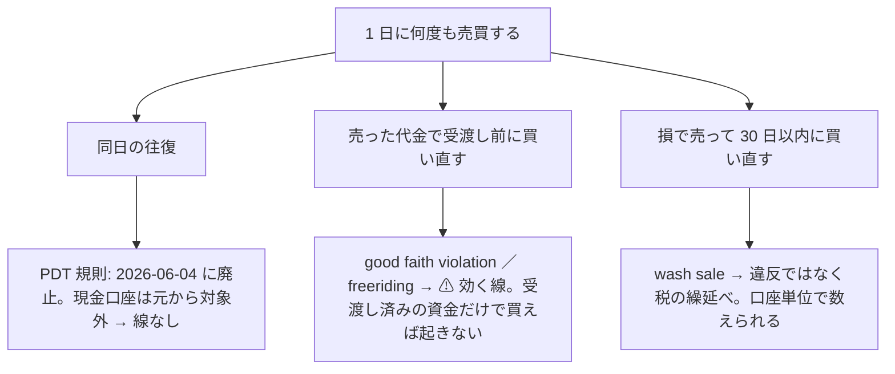

# 実売買 — トレーダー 3 人に予算を割り振り、tastytrade の本口座で売買して執行の差を記録する

プラン: [docs/plans/live-trading-three-models.md](../../plans/live-trading-three-models.md)。コード: `experiments/live-trading/`。
⚠ **2026-08-27 の方針の 2 つ目の例外**（CLAUDE.md）。判定するのは**執行の差と無人運転**であって「儲かったか」ではない。

## 0. 決めごと（事前固定）

⚠ **2026-09-17 の利用者決定: 実際に動かすトレーダーの属性はまだ設定しない。実売買のテストは先に行う**（プラン §0-1）。
✅ **2026-09-19 の利用者決定: 3 人のモデル・θ・予算・合成規則・種は候補のまま確定**（[B6 のプラン](../../plans/live-trading-trader-attributes.md)）。⚠ **残る未設定は銘柄集合と株数の決め方だけ**（§0-3 の `dryrun2` で決まる）。

### 0-1. トレーダーの定義と、実際に動かす 3 人（✅ 2026-09-19 確定。⚠ 銘柄集合と `sizing` は `dryrun2` 待ち）

| 属性 | 型 | 置き場 |
| --- | --- | --- |
| 名前 | 文字列（記録と画面の鍵。変えない） | `config/traders/<名前>.toml` の `name` |
| 予算 | $（執行器が超える買いを拒む） | `budget_usd` |
| 銘柄集合 | 銘柄の配列、または feature-discovery の `universe` 名 | `symbols` ／ `universe` |
| 予測モデル | 1 本以上。`kind = fixed`（固定の合図）／ `file`（CSV の合図）／ `experiment`（実験名。`predict.jsonl` を読む） | `[[models]]` |
| 合成規則 | `asis`（1 本のとき）／ `mean` ／ `majority`（奇数本）／ `unanimous` | `combine` |
| 閾値 θ | 50 以上（rules.md 13-3） | `threshold` |
| 株数の決め方 | `shares`（整数株）／ `notional`（金額指定 `Notional Market`。§0-3 で通ったときだけ） | `sizing` |
| 試験用 | `fixed` ／ `file` を持つトレーダーは `test = true` が要る。記録に `test: true` が付き判定に混ぜない | `test` |

| トレーダー | モデル | θ | 予算 | 銘柄集合 | 状態 |
| --- | --- | --- | --- | --- | --- |
| `T1` | `trade_own_ridge_a`（全部使う（基準）・Ridge）。`asis`・種 0 | 50 | A $300 ／ B $3,000 | ⚠ `dryrun2` 待ち（下の規則） | ✅ 2026-09-19 確定 |
| `T2` | `trade_ownex_lgbm_a`（全部使う（基準）・LightGBM）。`asis`・種 0 | 55 | A $300 ／ B $3,000 | 同上 | ✅ 2026-09-19 確定 |
| `T3` | `trade_ownseq_ridge_a` の検知器「T3 QUANT（60日窓）」。`asis`・種 0 | 50 | A $300 ／ B $3,000 | 同上 | ✅ 2026-09-19 確定 |
| 予備 | — | — | A $100 ／ B $1,000 | — | 規制費・約定の端数・受渡しの遅れ |
| `test_a`（試験用） | `file`（`config/signals/test_a.csv`。日付ごとに 買い ／ 出口 を手で書く） | 50 | $30 | `T`（us63 で株価が最も低い。$25.4【実測 2026-09-18 00:00 ET の気配】） | ✅ 固定。本番の最小額 1 発注に使う |

⚠ **銘柄集合と `sizing` の規則（結果を見る前に固定。2026-09-19）**: §0-3 の `notional_market_5usd` が通れば **`sizing = "notional"`・`universe = "us63"`（63 本・1 銘柄は規模 A $4.76 ／ 規模 B $47.62）**。通らなければ **`sizing = "shares"` で銘柄を事前固定で絞る**（⚠ 絞り方と本数は利用者の裁定・未決。1 人の予算 ÷ N が 1 株の値段を超える銘柄しか買えない。本数は下の表）。
#### 予算の規模 — A $1,000 と B $10,000 を並べて比べる（2026-09-19。利用者の決定）

利用者の指示: **「$1000 と $10000 の両方を比較できるようにして。$10000 は実際の取引で使えない可能性があるのでそれを明記する」**（$1,000 が購入の制限になっているため）。

| | 規模 A: $1,000 | 規模 B: $10,000 |
| --- | --- | --- |
| 実際の取引で使えるか | ✅ **使える**（口座の残高 $1,000【実測 2026-09-16】） | ⚠ **実際の取引では使えない可能性がある**（口座に $10,000 は入っていない。$9,000 の追加入金は利用者の判断で、Claude は実行しない） |
| 1 人の予算 ／ 予備 | $300 × 3 ／ $100 | $3,000 × 3 ／ $1,000 |
| 執行器の上限 | `--max-total-budget 1000 --max-day-usd 1000`（⚠ **既定**） | `--max-total-budget 10000 --max-day-usd 10000` を明示したときだけ |
| 63 本の等加重の 1 銘柄の枠 | $4.76 | $47.62 |
| 含み損 20% の停止（1 人 ／ 3 人同時） | $60 ／ $180（予備 $100 を超える）【推測】 | $600 ／ $1,800（予備 $1,000 を超える）【推測】 |
| 使いどころ | 実売買（Phase 5）・紙上の対照・机上の検証 | ⚠ **紙上の対照と机上の検証だけ**（追加入金が着いて受渡しが済むまで、実売買には使わない。口座全体の歯止めは置いていないので、先に動かすと買いが口座に断られてエラーが並ぶ） |

整数株で買える銘柄の数（us63 の 63 本中。終値は 最小 $25.6・中央値 $209.8・最大 $1,123.9【実測 2026-09-19・手元の日足の最終日】。K ＝ 同時に保有できる銘柄数で、1 銘柄の枠 ＝ 1 人の予算 ÷ K）:

| K | A の枠 | A で買える | B の枠 | B で買える（⚠ 実取引では使えない可能性） |
| ---: | ---: | ---: | ---: | ---: |
| 1 | $300 | 42 本 | $3,000 | 63 本 |
| 3 | $100 | 13 本 | $1,000 | 61 本 |
| 5 | $60 | 8 本 | $600 | 55 本 |
| 10 | $30 | 2 本 | $300 | 42 本 |
| 20 | $15 | 0 本 | $150 | 23 本 |
| 63（いまの閾値売買） | $4.76 | 0 本 | $47.62 | 5 本 |

⚠ **どちらの規模でも、63 本の等加重を整数株では再現できない**（端株 `Notional Market` が §0-3 で通るかが分かれ目のまま）。⚠ **記録・画面・文書で規模 B の数字を出すときは、必ず「実際の取引では使えない可能性がある」と添える。**
⚠ **選んだ基準は族の違い（線形 ／ 木 ／ 時系列分類器）で、成績ではない**。台帳【実測・生成日 2026-09-19】では 対 B&H 上乗せ ＋12.79 ／ ＋48.72 ／ ＋61.92 bp/fold・fold の符号 1/5 ／ 2/5 ／ 2/5 の「保留」。⚠ **T1 の「保留 ＋12.79」は較正「旧」（2026-09-12 より前の、数値解が止まっていた Platt 較正）の行の数字**。いまのコード（較正 std）で同じ構成を回すと θ=50 は **純利 1,381.12・対 B&H −270.89bp/fold・fold 2/5 ＝「落とす」**（台帳の std の行。4 実行・一致【実測 2026-09-19】）。⚠ **実売買の「今日の買い%」はいまのコード ＝ std で出るので、T1 は台帳では「落とす」の構成である**。選んだ基準は族の違いで成績ではないので確定は動かさないが、替えるなら新しい試行として利用者が決める。⚠ **ここから先にモデル・θ・合成規則を替えるのは新しい試行**（n_trials に足す）。
⚠ **種 0 で合図は再現する**【実測 2026-09-19】: T2 の同じ種・同じ入力の 2 実行は純利が小数 4 桁まで一致。台帳の「3 実行・幅 123bp」は種ではなく `ex_` / `im_` の修正前後の入力の差（B6 のプラン §5）。
⚠ **T2 は銘柄を選んでいない**【実測 2026-09-19・[topk-holdings.md §3-2](topk-holdings.md)】: `trade_ownex_lgbm_a` の買い% は同じ日の全銘柄でほぼ同じ値（96% の日で最高値が同点・中央値 48 本）。⚠ **T2 は「いつ買うか」だけを決め、48 銘柄をほぼ同時に買い、ほぼ同時に売る**。⚠ **T2 の銘柄は us63 ではなく会社株 48 本**（config の `targets = "company"`。ETF 15 本を含まない）。
⚠ **上位 K（保有できる銘柄数に上限を置く）は 2026-09-19 に机上で回した**（[topk-holdings.md](topk-holdings.md)。採る 0 ／ 45）。⚠ **その結果で実売買の K を選ばない**（rules.md 17-6 の 4）。執行器には入れていない。
`config/traders/T1.toml`〜`T3.toml` は `sizing` と銘柄が決まってから書く（半端な設定を置かない）。

#### トレーダーのお金と持ち株（2026-09-18。利用者の決定）

⚠ **目的は「予算を上手く増やす」シミュレーション**。口座は 1 つだが、お金と持ち株はトレーダーごとに分けて扱う（口座は合算しか見せないので、執行器が按分して持つ）。

| 決めごと | 中身 | 実装 |
| --- | --- | --- |
| 持ち株 | トレーダーごと（1 人 1 ファイル。銘柄・株数・取得単価・建てた日） | `state/<env>/<名前>.json`（`state.py`） |
| 売り | ⚠ **自分の持ち株だけ売れる。他のトレーダーが買った株は売れない**。同じ回で A の売りと B の買いが同じ銘柄なら、口座に出さず内部で移す（A が自分の株を B に渡す） | `plan.py` の `decide`・`size_intents`・`aggregate` |
| 持ち金 | ⚠ **固定の予算枠**。空き ＝ 予算 − 建玉の取得原価 − 受渡し待ちの売却代金。⚠ **実現損益と手数料は空きに入れない**（得をしても損をしても、次の空きは予算まで戻る。増えた分は使わずに残る） | `plan.py` の `size_intents` |
| 自分の予算枠が足りない | 注文を出す前に見送る。事象 `over_budget` ／ `too_small` として記録する（⚠ エラーではなく「見送り」） | 同上 |
| 口座全体の歯止め | ⚠ **置かない**（発注の前に口座の使える現金と比べない）。⚠ 全員が損をすると空きの合計が口座の現金を超えうる（規模 A: 予算 $300 × 3 ・停止条件 20% なら最悪 $180 で予備 $100 を超える ／ 規模 B: 最悪 $1,800 で予備 $1,000 を超える【推測】） | — |
| 口座に断られた買い | ⚠ **エラーとして記録する**。`orders.jsonl` の状態が `error`（dry-run ／ 発注で拒否）か `Rejected`（受付後に拒否）で、ブローカーのエラーの種類・コード・文面を残す。資金不足のような 4xx は再送しない（再送は `Session offline` と 5xx だけ）。約定が無いので持ち株と損益は変わらない。管理画面の「問題」に数える | `execute.py` の `run_one`・`is_transient` |
| 断られたときの巻き込み | ⚠ 同じ銘柄の買いは全員ぶんを 1 注文にまとめるので、断られると乗っていた全員が一緒に失敗する（誰の何株ぶんかは `parts` に残る） | `plan.py` の `aggregate` |
| 1 日の売買回数 | トレーダーの判断（CLAUDE.md の 2 つ目の例外。2026-09-18）。⚠ **いまの執行器は 1 日 1 回の窓（§0-2）のまま** | — |

- ⚠ 資金不足のときに tastytrade が返すエラーコードはまだ見ていない【未確認】。「資金不足」の分類を別に作るのは、実際に 1 度起きてコードを確かめてから
- ⚠ 「予算を増やせたか」はトレーダーの目標であって、判定には使わない（CLAUDE.md の例外: 損益で手法を採らない）

### 0-2. 予算の上限・執行の窓・停止条件・判定の閾値

| 項目 | 値 | 執行器での実装 |
| --- | --- | --- |
| 全トレーダーの予算の合計の上限 | **規模 A $1,000**（口座の残高【実測 2026-09-16】。⚠ 既定）／ **規模 B $10,000**（⚠ **実際の取引では使えない可能性がある**。§0-1 の表） | `run_day.py --max-total-budget`（既定 1000。超えると起動しない。規模 B は 10000 を明示する） |
| 1 日の買いの合計の上限 | **規模 A $1,000**（既定）／ **規模 B $10,000**（同上） | `--max-day-usd`（既定 1000） |
| 1 人の予算 | `budget_usd`。空き ＝ 予算 − 建玉の取得原価 − 受渡し待ちの売却代金（暦日 T+1・保守側） | `plan.size_intents`（超える買いは `over_budget` ／ `too_small` の事象として記録し見送る） |
| 執行の窓 | **15:45〜16:05 ET**（⚠ **NYSE の営業日**。2026-09-18 から休場日を暦で見る）。合図は 15:50 の気配、注文は成行 | `run_day.window_refusal`（`in_window`）。外では発注せず、理由を `events.jsonl` の `out_of_window.reason` に残す（`--ignore-window` はテスト用）。暦は `tastytrade-api-sample/market_calendar.py`（管理画面と同じもの。【公表値】NYSE・取得 2026-09-18） |
| 半日立会の日 | ⚠ **発注しない（未決のあいだの既定）**。13:00 ET 引けなので、窓 15:45〜16:05 は引けの後になる。20 営業日の実験にかかるのは **2026-11-27（金）と 2026-12-24（木）** | `window_refusal` が「半日立会」で拒否する。⚠ **窓を 12:45〜13:05 に動かすかは利用者の裁定**（TODO の D13） |
| 未約定の取消 | 窓の終わり（発注から 600 秒） | `--cancel-after` |
| 再送 | `Session offline` と 5xx は 60 秒おき 3 回まで。再送の前に `external-identifier` で重複を探す。4xx と認証の 401 は再送しない | `execute.is_transient` |
| 停止 | `HALT`（管理画面の停止ボタンと同じファイル）／ 含み損が予算の 20%（`ledger.jsonl` の `drawdown_pct_of_budget`。⚠ 自動で投げ売りしない。発注をやめて持ち越す）／ 説明できない差が 3 日続く（利用者が止める） | `HALT` は執行器が毎回見る |
| 判定の閾値（20 営業日） | プラン §2-4 の表（執行価格の差 中央値 ≤ 5bp ／ 紙上 − 実物 ≤ 5bp/日 ／ 人手 0 回 ／ 執行できた日 95% 以上） | Phase 6 |

### 0-3. 本番の dry-run — 端株・小数株・成行・MOC 相当（⚠ 利用者が流す。未実施）

`experiments/tastytrade-api-sample/sample.py --step dryrun2 --allow-prod-dry-run` が 6 通りを dry-run だけで通し、記録（`out/tastytrade-prod-*.jsonl` の step 10）に残す。⚠ **何もルーティングしない。**

| 鍵 | 注文 | 知りたいこと | 結果 |
| --- | --- | --- | --- |
| `notional_market_5usd` | `Notional Market` $5.00 | 金額指定の端株が API から出せるか（【記憶・未確認】） | ⏳ |
| `limit_fractional_0.01` | 指値 0.01 株 | 小数の `quantity` が通るか | ⏳ |
| `market_fractional_0.01` | 成行 0.01 株 | 同上（成行） | ⏳ |
| `market_1` | 成行 1 株 | 基準 | ⏳ |
| `market_on_close_1` | `Market On Close` 1 株 | MOC 相当の種別があるか（無ければエラー文に使える種別の一覧が出る見込み） | ⏳ |
| `limit_1_low` | 指値 1 株（気配の 8 割） | 対照（2026-09-05 に通っている） | ⏳ |

結果で決まるもの: `test_a` と実際の 3 人の `sizing`（端株が通れば `notional` で $5 刻み、通らなければ `shares` で銘柄を絞る。プラン §2-3）。

### 0-4. cert の dry-run【実測 2026-09-18 00:00 ET】— 配線は最後まで通った

`run_day.py --traders test_a --date 2026-09-18 --mode dry-run --ignore-window` を市場時間外に流した。

| 段 | 結果 |
| --- | --- |
| 認証（cert）| 1 回目・2 回目は nginx の **502**（深夜の cert）。3 回目で通った → 5xx は 30 秒待って 1 回取り直す規則を足した（401 は再試行しない） |
| 口座・残高・建玉 | cert の $100,000 を読めた |
| 気配 | ⚠ cert は配信しないので**本番の資格情報で読む**。T bid 25.40 / ask 25.45 / last 25.44（`updated-at` 00:00:01 ET） |
| 合図 → 計画 | `test_a.csv` の 9/18 の行（買い 100）→ 未保有 → 買い → $30 ÷ 1 銘柄 ÷ $25.42 → **1 株** |
| dry-run（cert） | 1 回目 **504** `timeout_error`・2 回目 **502** → 3 回目で API に届き、**422 `tif_no_after_hours_opening_market_orders`（市場が閉まっていると建玉を作る成行は出せない）** |

⚠ 市場時間外の拒否は想定どおり（2026-09-08 の sample と同じ）。**市場時間の sandbox リハーサル（Phase 2 の 6）が残る。** 記録は `experiments/live-trading/out/2026-09-18/`（口座番号・トークンは出ていないことを grep で確認）。

### 0-5. 実売買のテストの手順書（Phase 5-1。⚠ 利用者が行う）

⚠ **Claude はここまで。鍵を入れて起動するのは利用者。** 時刻は ET（EDT のいまは JST −13 時間。15:55 ET ＝ 翌 04:55 JST）。

**前日まで**

1. `sample.py --step dryrun2 --allow-prod-dry-run` を流し、§0-3 の表を埋める（Claude が記録から写す）
2. `experiments/live-trading/config/signals/test_a.csv` の日付を、**買う日**（1 行目 `buy=100`）と**手仕舞う日**（翌営業日 `exit=100`）に書き換える
3. `cd experiments/live-trading && ../feature-discovery/.venv/bin/python -m pytest -q tests && ./mockrun.sh` が通ることを見る
4. 管理画面（`dashboard/`）で停止ボタンが押せる状態にしておく（`HALT` は `experiments/tastytrade-api-sample/out/HALT`）

**買う日（15:45〜16:04 ET）**

```bash
cd experiments/live-trading
PY=../tastytrade-api-sample/.venv/bin/python
# (a) 本番の dry-run（何もルーティングしない）。注文 1 件が dry-run で通り、buying-power-effect が $25 前後であること
$PY run_day.py --traders test_a --env prod --mode dry-run --allow-prod-dry-run
# (b) 本番の発注（実弾）。鍵 2 つを両方付ける。記録は out/<日付>/orders.jsonl
TT_ALLOW_PROD_ORDERS=1 $PY run_day.py --traders test_a --env prod --mode submit --i-know-this-is-real-money
```

**手仕舞う日（15:45〜16:04 ET）**: 同じ 2 行。`test_a.csv` のその日の行が `exit=100` なので売りが出る。

**チェックリスト（買う日・手仕舞う日それぞれ）**

- [ ] `orders.jsonl` の `final_status` が `Filled`・`fills[].price` と `quote_at_signal.mid` の差（bp）
- [ ] `positions.jsonl` の `after` に T 1 株（買う日）／ 無し（手仕舞う日）
- [ ] `state/prod/test_a.json` の `holdings`・`realized_usd` が口座と一致
- [ ] `events.jsonl` に `retry` ／ `halted` ／ `over_budget` が無いか（あれば理由を §1 に書く）
- [ ] `grep -r "<口座番号の下 4 桁>" out/` が空（秘密が出ていない）
- [ ] 何かおかしければ管理画面の停止ボタン（`HALT` ＋ 全取消）。執行器は次の起動で `HALT` を見て発注しない

**⚠ 先に指摘するもの**: 現金口座なので、手仕舞った代金は T+1 まで再投資に使わない（執行器も `unsettled` として差し引く）／ 同日の往復は作らない（PDT）／ wash sale は 1 銘柄 1 往復なら起きない。

### 0-6. 規制の線 — 1 日に何度も売買するとき（E17・E18。2026-09-18 調査）

2026-09-18 に「1 日に何回売買するかはトレーダーの判断」と決まり、「1 日 1 回なら同日の往復は起きない」という前提が外れた。⚠ **机上の調査**（口座にも執行器にも触れていない）。⚠ **法令・税の最終判断は利用者（と CPA）**。

**主張: 口座は 1 つの現金口座なので、線は口座単位で引かれる。効くのは「受渡し前の代金で買わない」の 1 本で、執行器はすでにそれを守っている。**



| # | 線 | 一次情報【公表値】（取得 2026-09-18） | この実験への含意 |
| --- | --- | --- | --- |
| E17-a | **Pattern Day Trader（日計りの回数制限・$25,000）** | **2026-06-04 に廃止**。FINRA Regulatory Notice 26-10「FINRA Adopts New Intraday Margin Standards to Replace the Day Trading Margin Requirements」（https://www.finra.org/rules-guidance/notices/26-10 ）: PDT の指定・$25,000 の最低資産・day-trading buying power を削除し、**信用口座の**日中証拠金の基準に置き換える（SEC 承認 2026-04-14。Federal Register 2026-07485。業者の移行期間は 2027-10-20 まで）。tastytrade は「day-1 で実装済み」「**Cash accounts … were never subject to pattern day trading rules and remain subject to T+1 settlement and good faith violation rules**」（https://tastytrade.com/learn/markets/industry/pattern-day-trading/ ） | ✅ **同日の往復の回数に規制の上限は無い**（現金口座。記録でも `is-pattern-day-trader: false`・`day-trading-buying-power: 0.0`）。⚠ プラン §4 の「PDT: 同日往復を作らない」は、規制の理由としては古くなった |
| E17-b | **現金口座の支払い（Reg T）** | 12 CFR 220.8(a): 現金口座で買えるのは「sufficient funds in the account」があるか、顧客が速やかに全額を払うと業者が good faith で受け入れたとき ／ (c): 全額を払う前に売ると「the privilege of delaying payment beyond the trade date shall be withdrawn for **90 calendar days**」（https://www.law.cornell.edu/cfr/text/12/220.8 ）。FINRA の解説: 「Buying and selling the same security in a cash account before paying for it is known as 'free-riding'」「'good faith violation' if you purchase a security with cash from a transaction that hasn't settled yet and then sell the security before the proceeds used to fund the purchase have settled」（https://www.finra.org/investors/investing/investment-products/stocks/day-trading 。2026-06-04 更新） | ⚠ **効く線はこれ**。違反になるのは「受渡し前の代金で買う → それを、元の代金が受渡される前に売る」の組。⚠ **受渡し済みの資金だけで買えば、同日に何度往復しても違反は起きない** |
| E17-c | **受渡し（T+1）と tastytrade の扱い** | 株・ETF・オプションは T+1。「when you get **5 good faith violations in a rolling 12-month period**, your account will be set to **closing-only**」（https://tastytrade.com/learn/accounts/account-resources/margin-vs-cash-accounts/ ）。ヘルプ（Day Trading Rules in a Cash Account。https://support.tastytrade.com/support/s/solutions/articles/43000435231 ）の検索結果の要旨: 現金口座は日計りの回数に制限なし・ただし settled funds だけ ／ 5 回目で 90 日の closing-only ⚠ **ヘルプ本文は取得できなかった**（JS 描画。要旨は検索結果から ＝ 【推測】扱い） | 売った代金は**翌営業日**から使える（休場日は数えない ＝ §0-2 の暦）。⚠ **closing-only になると買えなくなり、実験が 90 日止まる** |
| E18 | **wash sale** | IRS Pub 550・IRC §1091: 損で売った日の前後 30 日（計 61 日）に実質同一の証券を買うと損失は否認され、新しい株の取得価額に足される。⚠ **1099-B（Box 1g）でブローカーが報告するのは same account・same CUSIP の分**（[trading-tax.md §2-2・§2-7](../trading-tax.md)。出典はそちら） | **違反ではなく税の繰延べ**。⚠ **口座は 1 つなので、トレーダー A の損切りとトレーダー B の買いでも成立する**（ブローカーは誰の判断かを知らない）。回数と銘柄の重なりが増えるほど起きやすい。金額は月 $1 未満【推測】だが、年末をまたぐ繰延べは翌年に回る。税の扱いは CPA に確認 |

**執行器はすでに E17-b の線の内側にいる**（コードは変えていない）:

- 予算の空き ＝ 予算 − 建玉の取得原価 − **受渡し待ちの売却代金**（`plan.py`・`state.unsettled`）。同日に売った代金は `today + 1 日 > today` で受渡し待ちに数えられ、その日の買いには使われない
- ⚠ `unsettled` は営業日ではなく暦日で 1 日を数える。執行が営業日にしか起きないので結果は T+1（営業日）と一致する【推測。金曜に売る → 月曜は受渡し済み・休場日を挟んでも次の営業日が T+1】。docstring の「保守側」は正確ではない（同じ結果になるだけ）
- ⚠ **前提が 1 つある**: 全トレーダーの予算の合計 ≤ 口座の受渡し済みの現金（§0-2 の上限 ＝ 入金額。規模 A の $1,000 は満たす。⚠ 規模 B の $10,000 は、追加入金が着くまで満たさない ＝ 実際の取引では使えない）。トレーダーは自分の予算の受渡し済みの分しか使わないので、他のトレーダーの受渡し待ちの代金に手を付けない。⚠ **ブローカーが買いにどの現金を充てるか（受渡し済みを先に使うか）は未確認**【推測: 受渡し済みが足りていれば違反にならない】

**C9・D13・D14 への含意**（⚠ **決めるのは利用者**。ここは候補と理由まで）:

| 決めごと | 規制から言えること | 候補 |
| --- | --- | --- |
| C9 今日買った株を今日売ってよいか | ✅ **規制上は可**（受渡し済みの資金で買った株なら、同日に売っても GFV にならない） | 可とする ／ 1 日 1 方向に絞る（執行の差を見る実験としては単純） |
| C9 売った日に買い戻してよいか | ⚠ **売った代金では買えない**（翌営業日から）。予算に受渡し済みの空きが別にあれば可。⚠ 損切りの買い戻しは wash sale（税の繰延べ） | 売った銘柄は翌営業日まで買わない（単純で、GFV も wash sale の当日分も避ける）／ 空きがあれば可 |
| D14 1 日の上限の数え方 | 回数に規制の上限は無い。上限は予算（受渡し済み）が自然に掛ける | 買いの合計額で数える（いまの `--max-day-usd`）を複数回の合計に |
| 歯止め | GFV は 12 か月で 5 回目に 90 日の closing-only | ⚠ 口座の GFV の回数は API で読めるか未確認。執行器が受渡し待ちを使わない限り 0 回のはず → **記録に GFV の通知が出たら停止**を停止条件（§0-2）に足す候補 |

### 0-7. シミュレーション — 仮データと仮の時計で執行器を通しで動かす（決めごと。2026-09-19。⚠ **実装はまだ**）

利用者の指示（2026-09-19）: **「仮データを用意し実際の売買のコードを動かしテストを行う。時間経過は実際の何倍かで進めたり止めたりして管理画面でも確認できる」**。プランは [live-trading-sim-clock.md](../../plans/live-trading-sim-clock.md)。
⚠ **この節は決めごとだけ**（Phase 0）。コードはまだ 1 行も書いていない。⚠ **資金は動かさない**（接続先はモックだけ）。⚠ **tastytrade の挙動の【実測】にはならない**。⚠ **仮データの損益・差は判定（§2）に混ぜない**。

#### (a) ⚠ 実売買とシミュレーションは排他 — 必ず分かるようにする（利用者決定。この節でいちばん上の決まり）

> この図の主張: 機械全体のモードは 1 つだけで、片方のモードではもう片方の部品が起動を拒む。切り替えは、何も動いていないときに人が CLI で行う。


| 決めごと | 中身 |
| --- | --- |
| モードの正本 | `experiments/live-trading/MODE`（git 管理外。`mode` ＝ `real` ／ `sim`・`name`・`since`・`by`）。⚠ **無ければ `real`** ＝ いまの動きを 1 行も変えない |
| 起動の排他 | `run.lock`（`flock`）。執行器も運転手も起動時に取り、終わるまで持つ。取れなければ起動しない |
| 実売買モードで拒否するもの | `simrun.py` ／ `run_day.py` への仮の時計 ／ `simctl.py` の速さ・停止の操作 |
| シミュレーションモードで拒否するもの | ⚠ **本物の `run_day.py`（cert ／ prod・本物の時計）**。`TT_ALLOW_PROD_ORDERS=1` と確認の引数があっても拒否し、**本物の** `out/<日付>/events.jsonl` に `refused_mode_sim` を残す（「起動しなかった日」の理由が後から分かる） |
| 仮の時計を受け付ける条件 | MODE が `sim` ＆ 接続先がループバックのモック ＆ `--env prod` でない ＆ 本番の鍵（`TT_ALLOW_PROD_*`）が付いていない。1 つでも外れたら起動を拒否 |
| 切り替え | `simctl.py mode sim <名前>` ／ `simctl.py mode real`。⚠ **CLI だけ**。`run.lock` が取れないときは拒否。`mode.log` に残す。⚠ 本物の状態（`state/prod/*.json`）に建玉が残っているときに `sim` へ入るなら、「シミュレーション中は実売買の執行器が動かない ＝ 手仕舞いも出ない」と表示して追加の確認（`--real-trading-will-stop`）を要求する |
| 置き場 | 本物 ＝ `out/`・`state/<env>/`・`out/HALT`（いまのまま）／ シミュレーション ＝ `sim/<名前>/` の下だけ（git 管理外）。⚠ **互いの木に 1 バイトも書かない**。停止ボタンも、いまのモードの側の `HALT` だけを書く |
| トレーダーの名前 | ⚠ シミュレーションのトレーダーは名前が **`sim_` で始まる**こと（運転手が検査）。本物の設定（`T1`〜`T3`・`test_a`）はシミュレーションの木に置けない |
| 記録の印 | シミュレーションの全行に `sim: true`・`mock: true`・`test: true` |
| 見分け | 管理画面: シミュレーションモードの間、全ページの最上部に実売買では使わない色の帯（「シミュレーション — 仮データ・仮の時計（×N）。実売買ではない」＋ 仮の時刻）・`<title>` の頭に `[SIM]`・数字と図に「仮」の印・`/api/*` に `mode`。⚠ **1 つの画面・1 つの応答に本物とシミュレーションを混ぜない**。モードと記録の木が食い違えば数字を出さない ／ CLI: 1 行目にモード ／ ログ・履歴: 1 行ごとにモードの欄 |
| デモ | `AIL_DEMO=1` はいまのまま別の帯（読むだけ・何も動かさないので排他の対象にしない） |
| 公開面（g3plus） | 常に実売買の側だけ（`sim/`・`MODE` は載せない） |

#### (b) 操作は CLI だけ・管理画面は表示だけ（利用者決定）

| 決めごと | 中身 |
| --- | --- |
| 操作 | `simctl.py`: `speed <倍>`（×1 ／ ×10 ／ ×60 ／ ×300 ／ ×1440 ／ `max`）／ `pause` ／ `resume` ／ `step`（1 営業日進めて止まる）／ `status` ／ `stop` ／ `mode …`。`control.json` と `MODE` を書くだけで、運転手が読み直す |
| 管理画面 | ⚠ **表示だけ**。POST の経路は 1 本も増やさない（`/ops/halt`・`/ops/resume`・`/ops/retry-auth` のまま）。`dashboard.md` §3 の権限の表は変えない。既存の停止ボタンはシミュレーションでも効く（通し稽古） |
| 見送ったもの | 管理画面の操作パネル（いったん決めて同日に戻した）。足すときの線はプラン §4-1 に控えた |
| 運転手の起動 | `./simrun.sh <名前>`（CLI）。web からプロセスを起こす口は作らない |

#### (c) 仮データ — 取得済みの実データの日足を再生する（推奨どおり）

| 決めごと | 値 | ⚠ 理由・注意 |
| --- | --- | --- |
| 値段の出どころ | `feature-discovery/data/adjusted/d/<銘柄>.csv` の終値（調整済み・取得済み。新しい取得はしない） | 値段が本物なので、整数株・予算・枠の検査が現実と同じ形で出る |
| 仮の期間 | **2026-10-01 〜 2026-12-31 の NYSE の営業日 64 日**（暦は執行器と管理画面が共有する `nyse_calendar.py`） | ⚠ **実売買の 20 営業日の実験が実際に踏む暦**: 休場 11-26・12-25 ／ **半日立会 11-27・12-24**（§0-2 で「発注しない」が既定）。暦に載っている年は 2026 だけなので 2026 年内に置く |
| 値段の当て方 | 出どころの **2026-06-01 から営業日の順に 1 日ずつ**、仮の期間の営業日へ当てる（k 番目の仮の営業日 ＝ 出どころの k 番目の足。69 本あるので足りる【実測】） | ⚠ **日付は仮・値段は過去の実物**。だから損益に意味は無い。暦を書き換えずに半日立会を踏める |
| 気配 | その日の終値を中心にスプレッド 2bp。銘柄ごとにモックへ流す | ⚠ いまのモックは気配が全銘柄で 1 本 → 銘柄ごとに持てるよう広げる（Phase 2） |
| 約定 | モックの `--fill-noise 0.003`・種 0（`mockrun.sh` と同じ） | 差 1 が 0 にならない |
| 限界 | 日中の値動きが無い（15:50 の気配 ＝ 終値 ± 雑音）／ モックは tastytrade ではない（拒否の文面・資金不足のコードは想像） | 本物の挙動は sandbox のリハーサルと本番の 1 発注でしか分からない |

#### (d) 動かすトレーダー — まず試験用の 3 人（推奨どおり）

| 名前 | 予算 | 銘柄 | `sizing` | モデル（`kind = "file"`） | 合成 ／ θ | 確かめるもの |
| --- | ---: | --- | --- | --- | --- | --- |
| `sim_a` | $300 | T・VZ・BAC（1 銘柄 $100） | `shares` | m20 | `asis` ／ 50 | 整数株の基本形 |
| `sim_b` | $300 | T・PFE・VZ・BAC・KO・XLF・XLE・XLU・NVDA・SPY（1 銘柄 $30） | `notional` | m20 | `asis` ／ 55 | 金額指定。$30 の枠で NVDA・SPY を買う |
| `sim_c` | $300 | T・BAC・INTC（1 銘柄 $100） | `shares` | m20 と m10 | `mean` ／ 50 | 複数モデルの合成 ／ `sim_a` と同じ銘柄の合算と内部移転 ／ ⚠ INTC は $82〜$141【実測】なので `too_small`（見送り）が出る |

- 予算の合計 $900 ＝ 規模 A の上限 $1,000 の内（§0-2 の既定のまま）。⚠ 規模 B（$10,000）で流すときは別の設定にして上限を明示する
- 合図の規則（⚠ 成績のためのものではない。売買が適度に起きればよい）: `mN` の買い% ＝ 50 ＋ 10 ×（終値 − N 日移動平均）÷ N 日標準偏差 を 0〜100 に切ったもの。出口% ＝ 100 − 買い%。その日の終値（＝ 15:50 の気配の代役）まで使う。仮データから事前に `config/signals/sim_*.csv` を作る（決定的）
- 3 人とも `test = true`。⚠ **`T1`〜`T3` は Phase 1（`predict.py --asof`）ができてから `sim_T1`〜`sim_T3`（`kind = "experiment"`）として足す**（T2 は LightGBM が要る。無い機械では titan で作った `predict.jsonl` を写す）

#### (e) 窓と速さ（推奨どおり）

| 決めごと | 値 |
| --- | --- |
| 窓 | いまの執行器どおり **1 日 1 回・15:45〜16:05 ET**。⚠ 窓は「時刻の一覧」で持ち、1 日に何度も売買する形（TODO の C9・D13）が決まったら足せるようにする |
| 窓の外 | 既定は次の窓まで飛ぶ（何も起きないので）。飛ばさない設定も持つ |
| 速さの初期値 | ×60（窓の 20 分 ＝ 20 秒・再送 60 秒 ＝ 1 秒）。「窓の中で片付くか」を読むのは ×1〜×60 だけ |
| 執行器の待ち | 再送 60 秒 × 3・取消 600 秒は**縮めず**、仮の時計の上でそのままの秒数を待つ（`mockrun.sh` のように 0.1 秒にしない） |
| 筋書き（故障の注入） | `session_offline` ／ `http_5xx`・`429` ／ `auth_5xx`・`auth_401` ／ `reject_funds` ／ `no_fill` ／ `skip_day` ／ `crash_mid` ／ `drawdown` ／ `halt` の 9 つ（プラン §3）。⚠ 何日目に置くかは Phase 3 で決め、ここに書き足す |

#### (f) 動かす機械 — Sx360 をシミュレーション専用にする（利用者決定 2026-09-19・案 A）

| | titan | Sx360 |
| --- | --- | --- |
| 役割 | 実売買（執行器・予測。GPU）と、日足の取得 | **シミュレーション**と開発 |
| tastytrade の `.env`（資格情報） | ある | ⚠ **置かない**（cert のものも本番のものも） |
| `MODE` | ふだん `real` | ふだん `sim` |
| 管理画面 | 本物の記録 | シミュレーションの記録（帯つき） |

- ⚠ **資格情報が無い機械からは tastytrade に認証できない** ＝ 設定や不具合をどう間違えても Sx360 から実売買（sandbox の注文も）は起きない。(a) のソフトウェアの守り（`MODE`・`run.lock`）の外側にもう 1 枚ある守りである
- ⚠ **titan ではふだんシミュレーションを回さない** ＝「シミュレーションモードに入れたまま忘れて、実売買の日を飛ばす」事故を起こさない。回す日があっても (a) が守る（仕組みはどちらの機械にも入る。これは運用の約束）
- 代償: Sx360 では tastytrade の API を使う作業（日足の取得・口座や気配の読み取り・sandbox）ができなくなる。⚠ **日足（`feature-discovery/data/adjusted/d/`。46MB・git 管理外）は titan で取り、Sx360 へ写す**
- ✅ **利用者が Sx360 の `.env` の資格情報を消した**（2026-09-19。Claude は Sx360 に触れていない）。⚠ 以後 Sx360 には置かない。運転手は起動時に「`sim` モードなのに資格情報の `.env` が見つかった」ら警告を出す（拒否はしない ＝ titan で回す日のため）
- `sim_T1`〜`sim_T3` を流す段では、T2 に LightGBM が要る → titan で作った `predict.jsonl` を写すか、Sx360 に LightGBM（CPU）を入れる

#### (g) まだ決めていないもの

| 項目 | 状態 |
| --- | --- |
| 筋書きを何日目に置くか | Phase 3 |
| `sim_T1`〜`sim_T3` | 実売買の Phase 1 の後 |

## 1. 記録（日次）

Phase 5-1・Phase 6 で埋める。1 日 1 行 × トレーダー。数字は全部【実測】。

| 日付 | トレーダー | 注文 | 約定 | 差 1（気配 → 約定 bp） | 事象 | 備考 |
| --- | --- | --- | --- | --- | --- | --- |
| （まだ無い） | | | | | | |

## 2. 判定

20 営業日の後に §0-2 の閾値で書く（Phase 6）。⚠ **損益で手法を採らない。**
