# 実売買 — トレーダー 3 人に予算を割り振り、tastytrade の本口座で売買して執行の差を記録する

プラン: [docs/plans/live-trading-three-models.md](../../plans/live-trading-three-models.md)。コード: `experiments/live-trading/`。
⚠ **2026-08-27 の方針の 2 つ目の例外**（CLAUDE.md）。判定するのは**執行の差と無人運転**であって「儲かったか」ではない。

## 0. 決めごと（事前固定）

⚠ **2026-09-17 の利用者決定: 実際に動かすトレーダーの属性はまだ設定しない。実売買のテストは先に行う**（プラン §0-1）。
✅ **2026-09-19 の利用者決定: 3 人のモデル・θ・予算・合成規則・種は候補のまま確定**（[B6 のプラン](../../plans/live-trading-trader-attributes.md)）。

### 0-1. トレーダーの定義と、実際に動かす 3 人（✅ 2026-09-19 確定。銘柄集合と `sizing` は 2026-09-21 に確定 ＝ 整数株・5 本）

設定項目の意味・型・検査の規則は vibeboard のシステム説明「トレーダーのしくみ」の段「設定項目の一覧」（`dashboard/system.toml`）が正本。この節に残すのは決めた日・利用者の言葉・【実測】の数字・実装の場所だけ（2026-09-26 の利用者決定。[削った提案](../../plans/archive/explain-settings-spec-dedupe.md)）。

| トレーダー | モデル | θ | 予算 | 銘柄集合 | 状態 |
| --- | --- | --- | --- | --- | --- |
| `T1` | `trade_own_ridge_a`（全部使う（基準）・Ridge）。`asis`・種 0 | 50 | A $300 ／ B $3,000 → **$600（2026-10-04 利用者決定。効くのは `live.env` を直した日から）** | ✅ `shares`・T・PFE・NKE・VZ・BAC（2026-09-21。§0-3） | ✅ 2026-09-19 確定・✅ 2026-10-04 残す |
| `T2` | `trade_ownex_lgbm_a`（全部使う（基準）・LightGBM）。`asis`・種 0 | 55 | A $300 ／ B $3,000 | 同上 | ✅ 2026-09-19 確定・⚠ **2026-10-04 外す**（持ち株 0 ＝ `AIL_LIVE_TRADERS` から外すだけ。設定と売買履歴は残す） |
| `T3` | `trade_ownseq_ridge_a` の検知器「T3 QUANT（60日窓）」。`asis`・種 0 | 50 | A $300 ／ B $3,000 | 同上 | ✅ 2026-09-19 確定・⚠ **2026-10-04 外す**（5 銘柄を利用者が口座で売り、`reconcile.py remove` で売買履歴に写してから外す） |
| `T4`（ハル） | `T1`・`T2`・`T3` のモデル 3 本を `mean`・種 0（`config/traders/T4.toml`。原本は `candidates/multi/`） | 50 | **$600** | 同上 | ✅ **2026-10-04 利用者決定で本番の人**（効くのは `live.env` から） |
| `T6`（ソラ） | `sel_small4_1995` の F2-2 RFE。`asis`・種 0（`config/traders/T6.toml`。原本は `candidates/best/`。⚠ 本番の日足は 2018 年から ＝ 学ぶ期間が机上と違う） | 50 | **$600** | 同上 | ✅ **2026-10-04 利用者決定で本番の人**（同上） |
| 予備 | — | — | A $100 ／ B $1,000（2026-10-04 から 3 人 × $600 ＋ 予備 $100 ＝ 上限 $1,900） | — | 規制費・約定の端数・受渡しの遅れ |
| `test_a`（試験用） | `file`（`config/signals/test_a.csv`。日付ごとに 買い ／ 出口 を手で書く） | 50 | $30 | `T`（us63 で株価が最も低い。$25.4【実測 2026-09-18 00:00 ET の気配】） | ✅ 固定。本番の最小額 1 発注に使う |

**候補の人（複数モデル。2026-09-28 に事前固定。⚠ 本番の人ではない）** — 手順書 [howto-model-trader.md §2](../howto-model-trader.md) を 1 度通した実例（[プラン new-model-trader.md](../../plans/archive/new-model-trader.md) §3 Phase 4）。設定は `config/traders/candidates/multi/`・sim 用の写しは `config/traders/sim_T4`・`sim_T5`（sim5 ＝ §0-7 (k)）。⚠ **配線の確認が目的で、成績は測らない・成績で採らない**。本番に入れるかは 10/20 の判定の後に利用者が決める（§0-15 C11・プラン §2 K7）。

| 候補 | 呼び名 | モデル | 合成規則 | θ | 予算 | 銘柄集合 | 決め手 |
| --- | --- | --- | --- | --- | --- | --- | --- |
| `T4` | ハル | `T1`・`T2`・`T3` の 3 本（`trade_own_ridge_a`・`trade_ownex_lgbm_a`・`trade_ownseq_ridge_a` の T3 QUANT） | `mean`（買い% ／ 出口% の平均） | 50 | A $300 | 3 人と同じ 5 本・`shares` | K1: 予測を 1 本も増やさず執行器も変えない ＝ 配線の確認に最も安い |
| `T5` | ミオ | 主モデル `trade_own_ridge_a` ＋ 出口だけの損切りモデル `trade_own_stopexit_a`（`X1 出口だけ 高値20日から−10%で降りる`。買い% は常に 100） | `unanimous`（買い ＝ min ＝ 主モデル・出口 ＝ max ＝ どちらかが言ったら降りる） | 50 | A $300 | 同上 | K1・K2: 「損切りをモデルとして扱う」の答えそのもの。⚠ 机上（[stoploss-as-model.md](stoploss-as-model.md)。33 検証とも落とす）で損切りを本番に入れる理由は出ていない。水準 X1 −10% は L1〜L3 のまん中で Phase 3 の `cli.predict` で実測できた本（記録 §7）＝ 水準の良し悪しで選んでいない |

⚠ **予算**: 候補 2 人で $600（sim5 は 2 人だけ ＝ 執行器の既定の上限 $1,000 の内）。本番に足すなら 3 人 $900 ＋ 1 人 $300 ＝ $1,200 が上限 $1,000 に当たる ＝ 上限か予算を利用者が決める（K7）。⚠ **銘柄集合を 3 人と同じにした理由**: 株を変えると、モデルを合わせた違いと株の違いが混ざる。⚠ **同じ実験名の違う手法を 1 人の中で 2 本持てない**（`signals.py` は (実験名, 銘柄) で行を引く。損切りモデルは主モデルとは別の実験名）。テストは `tests/test_trader.py`（候補が読める・sim の写しが一致・`asis` は 2 本で拒む・`unanimous` の買いは主モデルの値）。vibeboard のトレーダーのタブは `candidates/*/` の人を「（候補）」で出す（2026-09-28 に `notional/` だけから広げた。`dashboard.md` §16-1）。

✅ **2026-10-04 利用者決定「投入の時期は早める」「検証は３人だけにします。誰を含めるかはまだ決めていません。３人とも600ドルとする」**（候補の人を本番に入れるのを 10/20 の判定の後まで待たない。実売買は 3 人 × $600 ＝ 上限 $1,900・必要な入金 $880【計算】。誰を入れるかは利用者がこれから決める。プランは [trader-loop.md](../../plans/trader-loop.md)）。

**候補の人（検証結果一覧の上位。2026-10-01。⚠ 本番の人ではない）** — [プラン best-model-trader.md](../../plans/archive/best-model-trader.md) Step 3（利用者決定「(b) で進めて」）。設定は `config/traders/candidates/best/T6.toml`・sim 用の写しは `config/traders/sim_T6`（sim6 ＝ §0-7 (k)）。⚠ **配線の確認が目的で、成績で採らない**（物差しでは採る 0 ＝ [trader-shaped-validation.md](trader-shaped-validation.md)）。

| 候補 | 呼び名 | モデル | 合成規則 | θ | 予算 | 銘柄集合 | 決め手 |
| --- | --- | --- | --- | --- | --- | --- | --- |
| `T6` | ソラ（2026-10-01 利用者決定） | `sel_small4_1995` の `F2-2 RFE`（35 列から 16 列を選んで Ridge・1995 年から学ぶ） | `asis` | 50 | A $300 | 3 人と同じ 5 本・`shares` | トレーダーと同じ形の机上（rules.md 20 章）で、今の条件（5 本・$300）の上乗せがいちばん大きかった行（＋718bp/fold・3/5 ＝ 保留）。⚠ 本番の `data-live/` は 2018 年からの写しが種 ＝ 本番に入れると学ぶ期間が変わる（K7 と一緒に利用者が決める） |

⚠ **今の時期の F2-2 は毎日「全部買う」**（sim-predict の 64 日・63 銘柄とも買い% 50.87〜54.80 ＝ 50 を下回った日は 0）。T6 は買って持ち続けるだけの人になる（sim6 で確かめた）。

⚠ **銘柄集合と `sizing` の規則（結果を見る前に固定。2026-09-19）**: §0-3 の `notional_market_5usd` が通れば **`sizing = "notional"`・`universe = "us63"`（63 本・1 銘柄は規模 A $4.76 ／ 規模 B $47.62）**。通らなければ **`sizing = "shares"` で銘柄を事前固定で絞る** ＝ ✅ **2026-09-20 利用者決定 D3: 会社株 48 本のうち 2026-09-18 の終値の低い順に 5 本・3 人共通（T $25.40 ／ PFE $27.66 ／ NKE $35.51 ／ VZ $48.09 ／ BAC $57.73【実測】。1 銘柄の枠 $60）**。T2 は会社株しか予測しないので ETF を入れない。⚠ `dryrun2` の結果を見る前に決めた。候補の設定は `config/traders/candidates/{notional,shares}/`（1 人の予算 ÷ N が 1 株の値段を超える銘柄しか買えない。本数は下の表）。
✅ **2026-09-21 の結果と利用者決定**: 金額指定は通ったが最低 $5（$4.76 は断られる）・端株は 1 本 $0.10 の手数料 → 規則の前提（$4.76 で買える）が崩れたので利用者が裁定 ＝ **3 人とも `shares`・上の 5 本**。`config/traders/T1〜T3.toml` は `candidates/shares/` の写し（テスト `test_confirmed_traders_are_the_shares_candidates`）。
#### 予算の規模 — A $1,000 と B $10,000 を並べて比べる（2026-09-19。利用者の決定）

利用者の指示: **「$1000 と $10000 の両方を比較できるようにして。$10000 は実際の取引で使えない可能性があるのでそれを明記する」**（$1,000 が購入の制限になっているため）。

| | 規模 A: $1,000 | 規模 B: $10,000 |
| --- | --- | --- |
| 実際の取引で使えるか | ✅ **使える**（口座の残高 $1,000【実測 2026-09-16】） | ⚠ **実際の取引では使えない可能性がある**（口座に $10,000 は入っていない。$9,000 の追加入金は利用者の判断で、Claude は実行しない） |
| 1 人の予算 ／ 予備 | $300 × 3 ／ $100 | $3,000 × 3 ／ $1,000 |
| 執行器の上限 | `--max-total-budget 1000 --max-day-usd 1000`（⚠ **既定**） | `--max-total-budget 10000 --max-day-usd 10000` を明示したときだけ |
| 63 本の等加重の 1 銘柄の枠 | $4.76 | $47.62 |
| 含み損 20% の停止（1 人 ／ 3 人同時） | $60 ／ $180（予備 $100 を超える）【推測】 | $600 ／ $1,800（予備 $1,000 を超える）【推測】 |
| 使いどころ | 実売買（Phase 5）・紙上の対照・机上の検証 | ⚠ **紙上の対照と机上の検証だけ**（追加入金が着いて受渡しが済むまで、実売買には使わない。口座全体の歯止めは置いていないので、先に動かすと買いが口座に断られてエラーが並ぶ） |

整数株で買える銘柄の数（us63 の 63 本中。終値は 最小 $25.6・中央値 $209.8・最大 $1,123.9【実測 2026-09-19・手元の日足の最終日】。K ＝ 同時に保有できる銘柄数で、1 銘柄の枠 ＝ 1 人の予算 ÷ K）:

| K | A の枠 | A で買える | B の枠 | B で買える（⚠ 実取引では使えない可能性） |
| ---: | ---: | ---: | ---: | ---: |
| 1 | $300 | 42 本 | $3,000 | 63 本 |
| 3 | $100 | 13 本 | $1,000 | 61 本 |
| 5 | $60 | 8 本 | $600 | 55 本 |
| 10 | $30 | 2 本 | $300 | 42 本 |
| 20 | $15 | 0 本 | $150 | 23 本 |
| 63（いまの閾値売買） | $4.76 | 0 本 | $47.62 | 5 本 |

⚠ **どちらの規模でも、63 本の等加重を整数株では再現できない**（端株 `Notional Market` が §0-3 で通るかが分かれ目のまま）。⚠ **記録・画面・文書で規模 B の数字を出すときは、必ず「実際の取引では使えない可能性がある」と添える。**
⚠ **選んだ基準は族の違い（線形 ／ 木 ／ 時系列分類器）で、成績ではない**。検証結果一覧【実測・生成日 2026-09-19】では 対 B&H 上乗せ ＋12.79 ／ ＋48.72 ／ ＋61.92 bp/fold・fold の符号 1/5 ／ 2/5 ／ 2/5 の「保留」。⚠ **T1 の「保留 ＋12.79」は較正「旧」（2026-09-12 より前の、数値解が止まっていた Platt 較正）の行の数字**。いまのコード（較正 std）で同じ構成を回すと θ=50 は **純利 1,381.12・対 B&H −270.89bp/fold・fold 2/5 ＝「落とす」**（検証結果一覧の std の行。4 実行・一致【実測 2026-09-19】）。⚠ **実売買の「今日の買い%」はいまのコード ＝ std で出るので、T1 は検証結果一覧では「落とす」の構成である**。選んだ基準は族の違いで成績ではないので確定は動かさないが、替えるなら新しい検証として利用者が決める。⚠ **ここから先にモデル・θ・合成規則を替えるのは新しい検証**（n_trials に足す）。
⚠ **種 0 で合図は再現する**【実測 2026-09-19】: T2 の同じ種・同じ入力の 2 実行は純利が小数 4 桁まで一致。検証結果一覧の「3 実行・幅 123bp」は種ではなく `ex_` / `im_` の修正前後の入力の差（B6 のプラン §5）。
⚠ **T2 は銘柄を選んでいない**【実測 2026-09-19・[topk-holdings.md §3-2](topk-holdings.md)】: `trade_ownex_lgbm_a` の買い% は同じ日の全銘柄でほぼ同じ値（96% の日で最高値が同点・中央値 48 本）。⚠ **T2 は「いつ買うか」だけを決め、48 銘柄をほぼ同時に買い、ほぼ同時に売る**（2026-09-19 の観察。63 本の候補の頃の文で、いま売買するのは上の表の 5 本）。⚠ **T2 の銘柄は us63 ではなく会社株 48 本**（config の `targets = "company"`。ETF 15 本を含まない）。
⚠ **上位 K（保有できる銘柄数に上限を置く）は 2026-09-19 に机上で回した**（[topk-holdings.md](topk-holdings.md)。採る 0 ／ 45）。⚠ **その結果で実売買の K を選ばない**（rules.md 17-6 の 4）。執行器には入れていない。

#### トレーダーのお金と持ち株（2026-09-18。利用者の決定）

⚠ **目的は「予算を上手く増やす」シミュレーション**。口座は 1 つだが、お金と持ち株はトレーダーごとに分けて扱う（口座は合算しか見せないので、執行器が按分して持つ）。
しくみ（空きの式・売れる株・見送りの意味・上限）はシステム説明「トレーダーのしくみ」の「予算と買い方」「上限・含み損・停止」が正本。下の表は決めた日・利用者の言葉・代償・実装だけ（値と式は §0-2）。

| 決めごと | 中身 | 実装 |
| --- | --- | --- |
| 持ち株 | トレーダーごとに分けて持つ（2026-09-18） | `state/<env>/<名前>.json`（`state.py`） |
| 売り | ⚠ **内部移転はしない**（2026-09-19 の利用者決定「内部移転はダメです。トレーダーの実際の実績が検証できない」＝ A の売りと B の買いが同じ銘柄で重なる日も付け替えず、**両方をその人の注文として口座に出す。売りが先**）。2026-09-18 から 09-19 までは、口座に出さず気配の中値・手数料 0 で A の株を B に渡していた ＝ その人 1 人では出せない値段が成績に入り、差 1 の標本も欠けた。代償: 重なった日はスプレッドを 2 回払う・同じ日に同じ銘柄の売却と購入が口座の記録に残る（損で売ると wash sale の報告になりうる【推測・一次情報未確認】） | `plan.py` の `decide`・`size_intents`・`to_orders` |
| 口座への注文 | ⚠ **トレーダーごとに別々に出す・合算しない・按分しない**（2026-09-19 の利用者決定「トレーダーごとの成績を正確に知りたいので別々に出す。また手数料など金額の内訳も保存するように」。きっかけは按分で整数株の人に端数の持ち分ができたこと ＝ §0-7 (j) の 1）。代償: 注文の本数が増える（us63 × 3 人で最大 189 本・レート制限に近づく）。⚠ **2026-09-20 から発注は 2 段**（§0-9 (c)。1 本ずつ約定を待つ直列の形では初日の約 120 本が窓に収まらない） | `plan.to_orders`（1 意図 1 注文。`NetOrder.parts` は常に 1 人） |
| 金額の内訳 | 注文ごとに `orders.jsonl` の `amounts` ＝ 約定代金 `gross_usd` ／ 手数料 `fee_usd` と内訳 `fee_breakdown`（dry-run の `fee-calculation` を丸ごと）／ `buying_power_effect` ／ 差し引き `net_usd`（買いは負）。手数料は約定した注文のぶんだけ、その人の売買履歴（`state` の `fees_usd`・`history[].fee`・`ledger.jsonl` の `fees_usd`）に入る。⚠ **出どころは dry-run の見積り**（`fee_source: "dry_run_estimate"`）。約定後の実額を読む経路（`/accounts/{n}/transactions`【記憶・未確認】）はまだ無い。⚠ 実現損益には手数料を含めない（今までどおり別建て） | `execute.ExecResult.amounts`・`allocate_fills`・`run_day.py` |
| 持ち金 | ⚠ **固定の予算枠**（2026-09-18）。⚠ **実現損益と手数料は空きに入れない**（増えた分は使わずに残る） | `plan.py` の `size_intents` |
| 自分の予算枠が足りない | ⚠ **エラーではなく「見送り」として記録する**（事象 `over_budget` ／ `too_small`） | 同上 |
| 口座全体の歯止め | ⚠ **置かない**（発注の前に口座の使える現金と比べない）。⚠ 全員が損をすると空きの合計が口座の現金を超えうる（規模 A: 予算 $300 × 3 ・停止条件 20% なら最悪 $180 で予備 $100 を超える ／ 規模 B: 最悪 $1,800 で予備 $1,000 を超える【推測】） | — |
| 口座に断られた買い | ⚠ **エラーとして記録する**（見送りとは別）。`orders.jsonl` の状態 `error`（dry-run ／ 発注で拒否）か `Rejected`（受付後に拒否）に、ブローカーのエラーの種類・コード・文面を残す。再送の線は §0-2。管理画面の「問題」に数える | `execute.py` の `run_one`・`is_transient` |
| 1 日の売買回数 | トレーダーの判断（CLAUDE.md の 2 つ目の例外。2026-09-18）。⚠ **いまの執行器は 1 日 1 回の発注できる時間帯（§0-2）のまま** | — |

- ⚠ 資金不足のときに tastytrade が返すエラーコードはまだ見ていない【未確認】。「資金不足」の分類を別に作るのは、実際に 1 度起きてコードを確かめてから
- ⚠ 「予算を増やせたか」はトレーダーの目標であって、判定には使わない（CLAUDE.md の例外: 損益で手法を採らない）

### 0-2. 予算の上限・発注できる時間帯・停止条件・判定の閾値

| 項目 | 値 | 執行器での実装 |
| --- | --- | --- |
| 全トレーダーの予算の合計の上限 | **規模 A $1,000**（口座の残高【実測 2026-09-16】。⚠ 既定）／ **規模 B $10,000**（⚠ **実際の取引では使えない可能性がある**。§0-1 の表） | `run_day.py --max-total-budget`（既定 1000。超えると起動しない。規模 B は 10000 を明示する） |
| 1 日の買いの合計の上限 | **規模 A $1,000**（既定）／ **規模 B $10,000**（同上）。⚠ **全トレーダー・全起動の合計**（2026-09-20 に直した） | `--max-day-usd`（既定 1000）。起動時に**その日の `orders.jsonl` から使った額を数え直し**（`plan.spent_today`）、`plan.DayCap` を全員で分け合う。数えるのは口座へ出した買い（約定は約定額・未確定は注文額 ＝ 保守側。取消 ／ 拒否 ／ エラー ／ dry-run は数えない）。超えた買いは `over_day_cap` で見送り、その日の合計は `end` の `day_spent_usd` に残る |
| 1 人の予算 | `budget_usd`。空き ＝ 予算 − 建玉の取得原価 − 受渡し待ちの売却代金（暦日 T+1・保守側） | `plan.size_intents`（超える買いは `over_budget` ／ `too_small` の事象として記録し見送る） |
| 発注できる時間帯 | **15:45〜16:05 ET**（⚠ **NYSE の営業日**。2026-09-18 から休場日を暦で見る）。合図は 15:50 の気配、注文は成行 | `run_day.window_refusal`（`in_window`）。外では発注せず、理由を `events.jsonl` の `out_of_window.reason` に残す（`--ignore-window` はテスト用）。暦は `tastytrade-api-sample/market_calendar.py`（管理画面と同じもの。【公表値】NYSE・取得 2026-09-18） |
| 半日立会の日 | ⚠ **発注しない（未決のあいだの既定）**。13:00 ET 引けなので、発注できる時間帯 15:45〜16:05 は引けの後になる。20 営業日の実験にかかるのは **2026-11-27（金）と 2026-12-24（木）** | `window_refusal` が「半日立会」で拒否する。⚠ **発注できる時間帯を 12:45〜13:05 に動かすかは利用者の裁定**（TODO の D13） |
| 未約定の取消 | 発注できる時間帯の終わり（発注から 600 秒） | `--cancel-after` |
| 再送 | `Session offline` と 5xx は 60 秒おき 3 回まで。再送の前に `external-identifier` で重複を探す。4xx と認証の 401 は再送しない | `execute.is_transient` |
| 停止 | `HALT`（管理画面の停止ボタンと同じファイル）／ 含み損が予算の 20%（`ledger.jsonl` の `drawdown_pct_of_budget`）＝ ⚠ **執行器は警告だけ・止めるのは人**（2026-09-19 の利用者決定。それまでの文面「発注をやめて持ち越す」は実装されていなかった ＝ §0-7 (j) の 2）。✅ **人ごとの一時停止 ／ 手じまい（2026-10-05 利用者決定「手じまいはフラグを立てるだけで翌日以降に行う事にする。手じまいを行うのは執行機のみ」。[プラン](../../plans/archive/trader-control-flags.md)。2026-10-09 に言葉を「印」からトレーダーの状態 ＋ 指示へ ＝ `dashboard.md` §13-9）**: `control/<人>.json`（`HALT` の隣）に **一時停止**（`paused`。その人を飛ばす。持ち株はそのまま）か **手じまい**（`liquidate`。合図を読まず持ち株を全部売り、済んだら「済み」を書いて以後は買わない ＝ 状態は手じまい中 → 停止）を書く。書くのは管理画面の指示か `control.py`。`HALT` が優先。予算の合計の上限は買う人だけで見る。自動で投げ売りしない・自動で発注も止めない。利用者が警告を見て停止ボタンを押す ／ 説明できない差が 3 日続く（利用者が止める） | `HALT` は執行器が毎回見る。含み損は `run_day.DRAWDOWN_WARN_PCT`（20.0）以上のトレーダーごとに `events.jsonl` へ `drawdown_warning`（rc は変えない）。管理画面は「問題」に数える |
| 誰を動かすか（名簿） | ✅ **2026-10-07 利用者決定（「推す案でok」。[プラン](../../plans/archive/trader-roster-dashboard.md)）**: 管理画面の名簿（`roster.json`・`HALT` の隣）。開始 ／ 一時停止 ／ 手じまいは画面の指示（`dashboard.md` §13-9・§13-10。2026-10-09 に「外す」は無くした）。13500t の `live.env` は `AIL_LIVE_TRADERS=@roster`（移行の後）。⚠ 上限・許可・モードは `live.env` のまま（画面から上げられない）。予算の合計が上限を超えたら、**後から名簿に入った人からその日は休ませ、残りで回す**（K2。`--traders` を明示した回は今までどおり回ごと拒否） | `run_day.py --traders @roster`（`roster.py`）。無い ／ 壊れた名簿は起動を拒む（rc=2）・空の名簿は何もしない（rc=0）・休ませた人は `over_total_budget` の事象・`start` に `max_total_budget`・`max_day_usd`・`roster` |
| 判定の閾値（20 営業日） | プラン §2-4 の表（執行価格の差 中央値 ≤ 5bp ／ 紙上 − 実物 ≤ 5bp/日 ／ 人手 0 回 ／ 執行できた日 95% 以上） | Phase 6 |

### 0-3. 本番の dry-run — 端株・小数株・成行・MOC 相当（✅ 2026-09-21 12:10 PDT【実測】）

`experiments/tastytrade-api-sample/sample.py --step dryrun2 --allow-prod-dry-run` が 9 通り（2026-09-19 に 3 行足した）を dry-run だけで通し、記録（`out/tastytrade-prod-*.jsonl` の step 10）に残す。⚠ **何もルーティングしない。**

| 許可 | 注文 | 知りたいこと | 結果 |
| --- | --- | --- | --- |
| `notional_market_5usd` | `Notional Market` $5.00 | 金額指定の端株が API から出せるか（【記憶・未確認】） | ✅ 通る（SPY $5.00・買付余力の変化 $5.10・**手数料 $0.10**） |
| `limit_fractional_0.01` | 指値 0.01 株 | 小数の `quantity` が通るか | ❌ 422 `fractional_market_orders_only`（端株は成行か金額指定だけ） |
| `market_fractional_0.01` | 成行 0.01 株 | 同上（成行） | ✅ 通る（**手数料 $0.10**） |
| `market_1` | 成行 1 株 | 基準 | ✅ 通る（手数料 $0.001） |
| `market_on_close_1` | `Market On Close` 1 株 | MOC 相当の種別があるか（無ければエラー文に使える種別の一覧が出る見込み） | ❌ 400 `validation_error`（`order-type` に `Market On Close` は無い） |
| `limit_1_low` | 指値 1 株（気配の 8 割） | 対照（2026-09-05 に通っている） | ✅ 通る（手数料 $0.001） |
| `notional_market_4.76usd` | `Notional Market` $4.76（2026-09-19 に足した） | ⚠ **実際の 1 銘柄の枠**（規模 A $300 ÷ 63 本 ＝ T1・T3）。$5.00 は通るがこれが落ちる ＝ 最小額が $5 | ❌ 422 `below_notional_value_minimum`（**金額指定は最低 $5**） |
| `notional_market_6.25usd` | `Notional Market` $6.25（同上） | T2 の枠（$300 ÷ 会社株 48 本） | ✅ 通る（手数料 $0.10） |
| `market_sell_fractional_4dp_no_position` | 成行 売り 0.0123 株（`Sell to Close`。同上） | 執行器は金額指定の人の端株を小数 4 桁の数量で売る（§0-7 (j) の 1 の未確認）。⚠ **建玉が無いので断られる見込み** ＝ 知りたいのは「数量の形で断られるのか、持ち高で断られるのか」（エラー文から読む） | ❌ 422 `closing_with_no_position`（⚠ 数量の形ではなく持ち高で断られた ＝ 小数 4 桁の数量そのものは弾かれていない） |

結果で決まるもの: `test_a` と実際の 3 人の `sizing`（端株が通れば `notional` で $5 刻み、通らなければ `shares` で銘柄を絞る。プラン §2-3）。

✅ **結果（2026-09-21・記録 `out/tastytrade-prod-20260921T191032Z.jsonl`・市場 `Open`）**: 端株は通るが、⚠ **金額指定は最低 $5**（T1・T3 の 1 銘柄の枠 $4.76 ＝ $300 ÷ 63 本では 1 本も買えない）・⚠ **端株の注文は 1 本 $0.10 の手数料**（$5 の注文で 2%。整数株の成行は $0.001）【dry-run の見積り】。
→ ✅ **利用者決定（2026-09-21）: 3 人とも `shares`・D3 の 5 本（T・PFE・NKE・VZ・BAC）**。`config/traders/T1〜T3.toml` は `candidates/shares/` の写し。
⚠ 決めてあった規則（「通れば notional」）は最低額を想定していなかった ＝ 一意に決まらなかったので利用者が裁定した。⚠ 紙上の対照の片道 2.5bp は整数株の成行の手数料（$0.001）に対しては控えめ・端株（$0.10）なら 1 桁以上小さい。

### 0-4. cert の dry-run【実測 2026-09-18 00:00 ET】— 配線は最後まで通った

`run_day.py --traders test_a --date 2026-09-18 --mode dry-run --ignore-window` を市場時間外に流した。

| 段 | 結果 |
| --- | --- |
| 認証（cert）| 1 回目・2 回目は nginx の **502**（深夜の cert）。3 回目で通った → 5xx は 30 秒待って 1 回取り直す規則を足した（401 は再検証しない） |
| 口座・残高・建玉 | cert の $100,000 を読めた |
| 気配 | ⚠ cert は配信しないので**本番の資格情報で読む**。T bid 25.40 / ask 25.45 / last 25.44（`updated-at` 00:00:01 ET） |
| 合図 → 計画 | `test_a.csv` の 9/18 の行（買い 100）→ 未保有 → 買い → $30 ÷ 1 銘柄 ÷ $25.42 → **1 株** |
| dry-run（cert） | 1 回目 **504** `timeout_error`・2 回目 **502** → 3 回目で API に届き、**422 `tif_no_after_hours_opening_market_orders`（市場が閉まっていると建玉を作る成行は出せない）** |

⚠ 市場時間外の拒否は想定どおり（2026-09-08 の sample と同じ）。**市場時間の sandbox リハーサル（Phase 2 の 6）が残る。** 記録は `experiments/live-trading/out/2026-09-18/`（口座番号・トークンは出ていないことを grep で確認）。

### 0-5. 実売買のテストの手順書（Phase 5-1。⚠ 利用者が行う。2026-09-20 に D1 ＝ 案 B へ書き換えた）

⚠ **Claude はここまで。許可を出して起動するのは利用者。** 時刻は PDT（titan の時計）と ET。執行の窓 15:45〜16:05 ET ＝ **12:45〜13:05 PDT**。
✅ **2026-09-20 の利用者決定 D1 ＝ 案 B**: `test_a` の往復を **9/21（月）の 1 日で済ませる** ＝ 朝に買い（窓の外なので `--ignore-window`）・窓の中で売り。売りの経路を月曜のうちに本番で確かめ、火曜の窓を 3 人の投入だけに使う。同日の往復は規制上は可（受渡し済みの資金で買った株。§0-6）。⚠ 買いが決めごとの窓の外になるが、試験用（`test: true`）なので判定に混ぜない。同じ日に 2 回起動して 買い → 売り が通ることはモックで確かめた【実測 2026-09-20】。全体の段取りは [プラン](../../plans/archive/live-trading-go-live-0922.md) §3-2。

> この図の主張: 月曜は「何も出さない確認 → sandbox で出す → 本番で 1 株買う → 窓の中で売る」の順で、どの段も 1 つ前が通ってから進む。

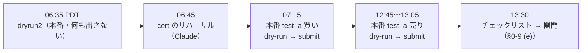
```mermaid
flowchart LR
  A["06:35 PDT<br/>dryrun2（本番・何も出さない）"] --> B["06:45<br/>cert のリハーサル<br/>（Claude）"]
  B --> C["07:15<br/>本番 test_a 買い<br/>dry-run → submit"]
  C --> D["12:45〜13:05<br/>本番 test_a 売り<br/>dry-run → submit"]
  D --> E["13:30<br/>チェックリスト → 関門（§0-9 (e)）"]
```

**前日まで（✅ 2026-09-20 に Claude が済ませた）**: `config/signals/test_a.csv` は 2026-09-21 の買い ／ 執行器の pytest・`mockrun.sh`・`selftest.sh` が通る ／ 管理画面の停止ボタン（`HALT` は `experiments/tastytrade-api-sample/out/HALT`）。

**9/21（月）06:35 PDT — `dryrun2`（本番。何もルーティングしない。5 秒強）**

```bash
cd experiments/tastytrade-api-sample && .venv/bin/python sample.py --step dryrun2 --allow-prod-dry-run
```

結果は Claude が記録（`out/tastytrade-prod-*.jsonl` の step 10。⚠ `mock: true` の無い最新のもの）から §0-3 に写し、`config/traders/candidates/` の `notional` ／ `shares` のどちらかを `config/traders/T1〜T3.toml` に写す。

**07:15 PDT 頃 — 本番 `test_a` の買い**（cert のリハーサルが `Filled` まで行ってから）

```bash
cd experiments/live-trading
PY=../tastytrade-api-sample/.venv/bin/python
$PY test_signal.py buy                      # 今日（ET）の行を「買い 100」に（✅ 9/21 ぶんは書いてある。念のため）
# (a) 本番の dry-run（何もルーティングしない）。注文 1 件が通り、buying-power-effect が $25 前後であること
$PY run_day.py --traders test_a --env prod --mode dry-run --allow-prod-dry-run --ignore-window
# (b) 本番の発注（実弾）。許可 2 つを両方付ける。記録は out/<日付>/orders.jsonl
TT_ALLOW_PROD_ORDERS=1 $PY run_day.py --traders test_a --env prod --mode submit --i-know-this-is-real-money --ignore-window
```

**12:45〜13:05 PDT — 本番 `test_a` の売り**（窓の中なので `--ignore-window` は付けない）

```bash
$PY test_signal.py exit                     # 今日の行を「出口 100」に書き換える
$PY run_day.py --traders test_a --env prod --mode dry-run --allow-prod-dry-run
TT_ALLOW_PROD_ORDERS=1 $PY run_day.py --traders test_a --env prod --mode submit --i-know-this-is-real-money
```

**チェックリスト（買い・売りそれぞれ）**

- [ ] `orders.jsonl` の `final_status` が `Filled`・`fills[].price` と `quote_at_signal.mid` の差（bp）
- [ ] `positions.jsonl` の `after` に T 1 株（買いの後）／ 無し（売りの後）
- [ ] `state/prod/test_a.json` の `holdings`・`realized_usd` が口座と一致（`$PY reconcile.py --env prod show` で差 0）
- [ ] `events.jsonl` に `retry` ／ `halted` ／ `over_budget` が無いか（あれば理由を §1 に書く）
- [ ] `grep -r "<口座番号の下 4 桁>" out/` が空（秘密が出ていない）
- [ ] 何かおかしければ管理画面の停止ボタン（`HALT` ＋ 全取消）。執行器は次の起動で `HALT` を見て発注しない

**⚠ 先に指摘するもの**: 現金口座なので、売った代金（約 $25）は翌営業日まで買いに使わない（執行器も受渡し待ちとして差し引く）。火曜の 3 人の予算 $900 は受渡し済みの現金の内 ／ 同じ日・同じ銘柄の売買が口座の記録に残る（損で売れば wash sale の報告になりうる【推測】。金額は数セント）／ ⚠ **認証に失敗したら連打しない**（IP が約 8 時間ブロックされ、火曜まで潰れる）。

### 0-6. 規制の線 — 1 日に何度も売買するとき（E17・E18。2026-09-18 調査）

2026-09-18 に「1 日に何回売買するかはトレーダーの判断」と決まり、「1 日 1 回なら同日の往復は起きない」という前提が外れた。⚠ **机上の調査**（口座にも執行器にも触れていない）。⚠ **法令・税の最終判断は利用者（と CPA）**。

**主張: 口座は 1 つの現金口座なので、線は口座単位で引かれる。効くのは「受渡し前の代金で買わない」の 1 本で、執行器はすでにそれを守っている。**

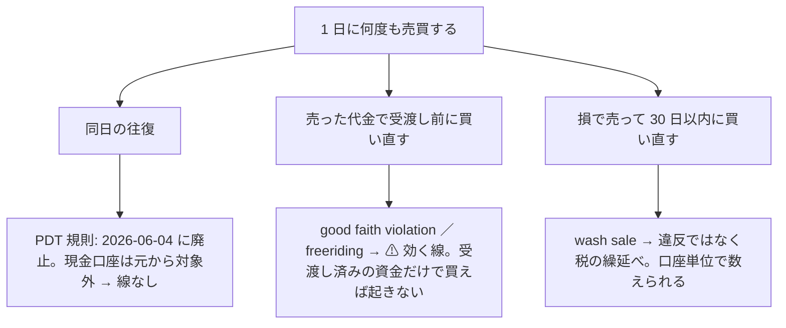
```mermaid
flowchart TD
  A["1 日に何度も売買する"] --> B["同日の往復"]
  A --> C["売った代金で受渡し前に買い直す"]
  A --> D["損で売って 30 日以内に買い直す"]
  B --> E["PDT 規則: 2026-06-04 に廃止。現金口座は元から対象外 → 線なし"]
  C --> F["good faith violation ／ freeriding → ⚠ 効く線。受渡し済みの資金だけで買えば起きない"]
  D --> G["wash sale → 違反ではなく税の繰延べ。口座単位で数えられる"]
```

| # | 線 | 一次情報【公表値】（取得 2026-09-18） | この実験への含意 |
| --- | --- | --- | --- |
| E17-a | **Pattern Day Trader（日計りの回数制限・$25,000）** | **2026-06-04 に廃止**。FINRA Regulatory Notice 26-10「FINRA Adopts New Intraday Margin Standards to Replace the Day Trading Margin Requirements」（https://www.finra.org/rules-guidance/notices/26-10 ）: PDT の指定・$25,000 の最低資産・day-trading buying power を削除し、**信用口座の**日中証拠金の基準に置き換える（SEC 承認 2026-04-14。Federal Register 2026-07485。業者の移行期間は 2027-10-20 まで）。tastytrade は「day-1 で実装済み」「**Cash accounts … were never subject to pattern day trading rules and remain subject to T+1 settlement and good faith violation rules**」（https://tastytrade.com/learn/markets/industry/pattern-day-trading/ ） | ✅ **同日の往復の回数に規制の上限は無い**（現金口座。記録でも `is-pattern-day-trader: false`・`day-trading-buying-power: 0.0`）。⚠ プラン §4 の「PDT: 同日往復を作らない」は、規制の理由としては古くなった |
| E17-b | **現金口座の支払い（Reg T）** | 12 CFR 220.8(a): 現金口座で買えるのは「sufficient funds in the account」があるか、顧客が速やかに全額を払うと業者が good faith で受け入れたとき ／ (c): 全額を払う前に売ると「the privilege of delaying payment beyond the trade date shall be withdrawn for **90 calendar days**」（https://www.law.cornell.edu/cfr/text/12/220.8 ）。FINRA の解説: 「Buying and selling the same security in a cash account before paying for it is known as 'free-riding'」「'good faith violation' if you purchase a security with cash from a transaction that hasn't settled yet and then sell the security before the proceeds used to fund the purchase have settled」（https://www.finra.org/investors/investing/investment-products/stocks/day-trading 。2026-06-04 更新） | ⚠ **効く線はこれ**。違反になるのは「受渡し前の代金で買う → それを、元の代金が受渡される前に売る」の組。⚠ **受渡し済みの資金だけで買えば、同日に何度往復しても違反は起きない** |
| E17-c | **受渡し（T+1）と tastytrade の扱い** | 株・ETF・オプションは T+1。「when you get **5 good faith violations in a rolling 12-month period**, your account will be set to **closing-only**」（https://tastytrade.com/learn/accounts/account-resources/margin-vs-cash-accounts/ ）。ヘルプ（Day Trading Rules in a Cash Account。https://support.tastytrade.com/support/s/solutions/articles/43000435231 ）の検索結果の要旨: 現金口座は日計りの回数に制限なし・ただし settled funds だけ ／ 5 回目で 90 日の closing-only ⚠ **ヘルプ本文は取得できなかった**（JS 描画。要旨は検索結果から ＝ 【推測】扱い） | 売った代金は**翌営業日**から使える（休場日は数えない ＝ §0-2 の暦）。⚠ **closing-only になると買えなくなり、実験が 90 日止まる** |
| E18 | **wash sale** | IRS Pub 550・IRC §1091: 損で売った日の前後 30 日（計 61 日）に実質同一の証券を買うと損失は否認され、新しい株の取得価額に足される。⚠ **1099-B（Box 1g）でブローカーが報告するのは same account・same CUSIP の分**（[trading-tax.md §2-2・§2-7](../trading-tax.md)。出典はそちら） | **違反ではなく税の繰延べ**。⚠ **口座は 1 つなので、トレーダー A の損切りとトレーダー B の買いでも成立する**（ブローカーは誰の判断かを知らない）。回数と銘柄の重なりが増えるほど起きやすい。金額は月 $1 未満【推測】だが、年末をまたぐ繰延べは翌年に回る。税の扱いは CPA に確認 |

**執行器はすでに E17-b の線の内側にいる**（コードは変えていない）:

- 予算の空き ＝ 予算 − 建玉の取得原価 − **受渡し待ちの売却代金**（`plan.py`・`state.unsettled`）。同日に売った代金は `today + 1 日 > today` で受渡し待ちに数えられ、その日の買いには使われない
- ⚠ `unsettled` は営業日ではなく暦日で 1 日を数える。執行が営業日にしか起きないので結果は T+1（営業日）と一致する【推測。金曜に売る → 月曜は受渡し済み・休場日を挟んでも次の営業日が T+1】。docstring の「保守側」は正確ではない（同じ結果になるだけ）
- ⚠ **前提が 1 つある**: 全トレーダーの予算の合計 ≤ 口座の受渡し済みの現金（§0-2 の上限 ＝ 入金額。規模 A の $1,000 は満たす。⚠ 規模 B の $10,000 は、追加入金が着くまで満たさない ＝ 実際の取引では使えない）。トレーダーは自分の予算の受渡し済みの分しか使わないので、他のトレーダーの受渡し待ちの代金に手を付けない。⚠ **ブローカーが買いにどの現金を充てるか（受渡し済みを先に使うか）は未確認**【推測: 受渡し済みが足りていれば違反にならない】

**C9・D13・D14 への含意**（⚠ **決めるのは利用者**。ここは候補と理由まで）:

| 決めごと | 規制から言えること | 候補 |
| --- | --- | --- |
| C9 今日買った株を今日売ってよいか | ✅ **規制上は可**（受渡し済みの資金で買った株なら、同日に売っても GFV にならない） | 可とする ／ 1 日 1 方向に絞る（執行の差を見る実験としては単純） |
| C9 売った日に買い戻してよいか | ⚠ **売った代金では買えない**（翌営業日から）。予算に受渡し済みの空きが別にあれば可。⚠ 損切りの買い戻しは wash sale（税の繰延べ） | 売った銘柄は翌営業日まで買わない（単純で、GFV も wash sale の当日分も避ける）／ 空きがあれば可 |
| D14 1 日の上限の数え方 | 回数に規制の上限は無い。上限は予算（受渡し済み）が自然に掛ける | 買いの合計額で数える（いまの `--max-day-usd`）を複数回の合計に |
| 歯止め | GFV は 12 か月で 5 回目に 90 日の closing-only | ⚠ 口座の GFV の回数は API で読めるか未確認。執行器が受渡し待ちを使わない限り 0 回のはず → **記録に GFV の通知が出たら停止**を停止条件（§0-2）に足す候補 |

### 0-7. シミュレーション — 仮データと仮の時計で執行器を通しで動かす（決めごと 2026-09-19 ／ ✅ 実装も同日。使い方は (h)）

利用者の指示（2026-09-19）: **「仮データを用意し実際の売買のコードを動かしテストを行う。時間経過は実際の何倍かで進めたり止めたりして管理画面でも確認できる」**。プランは [live-trading-sim-clock.md](../../plans/archive/live-trading-sim-clock.md)。
✅ **2026-09-19 に実装した**（利用者の指示「仮データを使ったシミュレーションを進められる？」。(a)〜(g) が決めごと、(h) が使い方、(i) が筋書きの日、(j) が回して見つかったこと）。⚠ **資金は動かさない**（接続先はモックだけ）。⚠ **tastytrade の挙動の【実測】にはならない**。⚠ **仮データの損益・差は判定（§2）に混ぜない**。

#### (a) ⚠ 実売買とシミュレーションは排他 — 必ず分かるようにする（利用者決定。この節でいちばん上の決まり）

> この図の主張: 機械全体のモードは 1 つだけで、片方のモードではもう片方の部品が起動を拒む。切り替えは、何も動いていないときに人が CLI で行う。

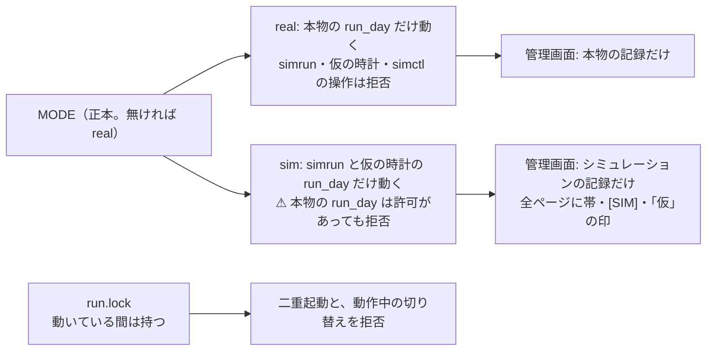
```mermaid
flowchart LR
  M["MODE（正本。無ければ real）"] --> R["real: 本物の run_day だけ動く<br/>simrun・仮の時計・simctl の操作は拒否"]
  M --> S["sim: simrun と仮の時計の run_day だけ動く<br/>⚠ 本物の run_day は許可があっても拒否"]
  L["run.lock<br/>動いている間は持つ"] --> X["二重起動と、動作中の切り替えを拒否"]
  R --> V["管理画面: 本物の記録だけ"]
  S --> W["管理画面: シミュレーションの記録だけ<br/>全ページに帯・[SIM]・「仮」の印"]
```

| 決めごと | 中身 |
| --- | --- |
| モードの正本 | `experiments/live-trading/MODE`（git 管理外。`mode` ＝ `real` ／ `sim`・`name`・`since`・`by`）。⚠ **無ければ `real`** ＝ いまの動きを 1 行も変えない |
| 起動の排他 | `run.lock`（`flock`）。執行器も運転手も起動時に取り、終わるまで持つ。取れなければ起動しない |
| 実売買モードで拒否するもの | `simrun.py` ／ `run_day.py` への仮の時計 ／ `simctl.py` の速さ・停止の操作 |
| シミュレーションモードで拒否するもの | ⚠ **本物の `run_day.py`（cert ／ prod・本物の時計）**。`TT_ALLOW_PROD_ORDERS=1` と確認の引数があっても拒否し、**本物の** `out/<日付>/events.jsonl` に `refused_mode_sim` を残す（「起動しなかった日」の理由が後から分かる） |
| 仮の時計を受け付ける条件 | MODE が `sim` ＆ 接続先がループバックのモック ＆ `--env prod` でない ＆ 本番の許可（`TT_ALLOW_PROD_*`）が付いていない。1 つでも外れたら起動を拒否 |
| 切り替え | `simctl.py mode sim <名前>` ／ `simctl.py mode real`。⚠ **CLI だけ**。`run.lock` が取れないときは拒否。`mode.log` に残す。⚠ 本物の状態（`state/prod/*.json`）に建玉が残っているときに `sim` へ入るなら、「シミュレーション中は実売買の執行器が動かない ＝ 手仕舞いも出ない」と表示して追加の確認（`--real-trading-will-stop`）を要求する |
| 置き場 | 本物 ＝ `out/`・`state/<env>/`・`out/HALT`（いまのまま）／ シミュレーション ＝ `sim/<名前>/` の下だけ（git 管理外）。⚠ **互いの木に 1 バイトも書かない**。停止ボタンも、いまのモードの側の `HALT` だけを書く |
| トレーダーの名前 | ⚠ シミュレーションのトレーダーは名前が **`sim_` で始まる**こと（運転手が検査）。本物の設定（`T1`〜`T3`・`test_a`）はシミュレーションの木に置けない |
| 記録の印 | シミュレーションの全行に `sim: true`・`mock: true`・`test: true` |
| 見分け | 管理画面: シミュレーションモードの間、全ページの最上部に実売買では使わない色の帯（「シミュレーション — 仮データ・仮の時計（×N）。実売買ではない」＋ 仮の時刻）・`<title>` の頭に `[SIM]`・数字と図に「仮」の印・`/api/*` に `mode`。⚠ **1 つの画面・1 つの応答に本物とシミュレーションを混ぜない**。モードと記録の木が食い違えば数字を出さない ／ CLI: 1 行目にモード ／ ログ・履歴: 1 行ごとにモードの欄 |
| デモ | `AIL_DEMO=1` はいまのまま別の帯（読むだけ・何も動かさないので排他の対象にしない） |
| 公開面（g3plus） | 常に実売買の側だけ（`sim/`・`MODE` は載せない） |

#### (b) 操作は CLI だけ・管理画面は表示だけ（利用者決定）

| 決めごと | 中身 |
| --- | --- |
| 操作 | `simctl.py`: `speed <倍>`（×1 ／ ×10 ／ ×60 ／ ×300 ／ ×1440 ／ `max`）／ `pause` ／ `resume` ／ `step`（1 営業日進めて止まる）／ `status` ／ `stop` ／ `mode …`。`control.json` と `MODE` を書くだけで、運転手が読み直す |
| 管理画面 | ⚠ **表示だけ**。POST の経路は 1 本も増やさない（`/ops/halt`・`/ops/resume`・`/ops/retry-auth` のまま）。`dashboard.md` §3 の権限の表は変えない。既存の停止ボタンはシミュレーションでも効く（通し稽古） |
| 見送ったもの | 管理画面の操作パネル（いったん決めて同日に戻した）。足すときの線はプラン §4-1 に控えた |
| 運転手の起動 | `./simrun.sh <名前>`（CLI）。web からプロセスを起こす口は作らない |

#### (c) 仮データ — 取得済みの実データの日足を再生する（推奨どおり）

| 決めごと | 値 | ⚠ 理由・注意 |
| --- | --- | --- |
| 値段の出どころ | `feature-discovery/data/adjusted/d/<銘柄>.csv` の終値（調整済み・取得済み。新しい取得はしない） | 値段が本物なので、整数株・予算・枠の検査が現実と同じ形で出る |
| 仮の期間 | **2026-10-01 〜 2026-12-31 の NYSE の営業日 64 日**（暦は執行器と管理画面が共有する `nyse_calendar.py`） | ⚠ **実売買の 20 営業日の実験が実際に踏む暦**: 休場 11-26・12-25 ／ **半日立会 11-27・12-24**（§0-2 で「発注しない」が既定）。暦に載っている年は 2026 だけなので 2026 年内に置く |
| 値段の当て方 | 出どころの **2026-06-01 から営業日の順に 1 日ずつ**、仮の期間の営業日へ当てる（k 番目の仮の営業日 ＝ 出どころの k 番目の足。69 本あるので足りる【実測】） | ⚠ **日付は仮・値段は過去の実物**。だから損益に意味は無い。暦を書き換えずに半日立会を踏める |
| 気配 | その日の終値を中心にスプレッド 2bp。銘柄ごとにモックへ流す | ⚠ いまのモックは気配が全銘柄で 1 本 → 銘柄ごとに持てるよう広げる（Phase 2） |
| 約定 | モックの `--fill-noise 0.003`・種 0（`mockrun.sh` と同じ） | 差 1 が 0 にならない |
| 限界 | 日中の値動きが無い（15:50 の気配 ＝ 終値 ± 雑音）／ モックは tastytrade ではない（拒否の文面・資金不足のコードは想像） | 本物の挙動は sandbox のリハーサルと本番の 1 発注でしか分からない |

#### (d) 動かすトレーダー — まず試験用の 3 人（推奨どおり）

| 名前 | 予算 | 銘柄 | `sizing` | モデル（`kind = "file"`） | 合成 ／ θ | 確かめるもの |
| --- | ---: | --- | --- | --- | --- | --- |
| `sim_a` | $300 | T・VZ・BAC（1 銘柄 $100） | `shares` | m20 | `asis` ／ 50 | 整数株の基本形 |
| `sim_b` | $300 | T・PFE・VZ・BAC・KO・XLF・XLE・XLU・NVDA・SPY（1 銘柄 $30） | `notional` | m20 | `asis` ／ 55 | 金額指定。$30 の枠で NVDA・SPY を買う |
| `sim_c` | $300 | T・BAC・INTC（1 銘柄 $100） | `shares` | m20 と m10 | `mean` ／ 50 | 複数モデルの合成 ／ `sim_a` と同じ銘柄を同じ日に売買する（⚠ 2026-09-19 から合算も内部移転もしない ＝ 注文は 1 人 1 本ずつ）／ ⚠ INTC は $82〜$141【実測】なので `too_small`（見送り）が出る |

- 予算の合計 $900 ＝ 規模 A の上限 $1,000 の内（§0-2 の既定のまま）。⚠ 規模 B（$10,000）で流すときは別の設定にして上限を明示する
- 合図の規則（⚠ 成績のためのものではない。売買が適度に起きればよい）: `mN` の買い% ＝ 50 ＋ 10 ×（終値 − N 日移動平均）÷ N 日標準偏差 を 0〜100 に切ったもの。出口% ＝ 100 − 買い%。その日の終値（＝ 15:50 の気配の代役）まで使う。仮データから事前に `config/signals/sim_*.csv` を作る（決定的）
- 3 人とも `test = true`。⚠ **`T1`〜`T3` は Phase 1（`predict.py --asof`）ができてから `sim_T1`〜`sim_T3`（`kind = "experiment"`）として足す**（T2 は LightGBM が要る。無い機械では titan で作った `predict.jsonl` を写す）→ ✅ 2026-09-20 に足した ＝ (k)

#### (e) 発注できる時間帯と速さ（推奨どおり）

| 決めごと | 値 |
| --- | --- |
| 発注できる時間帯 | いまの執行器どおり **1 日 1 回・15:45〜16:05 ET**。⚠ 運転手は「時刻の一覧」で持てる（⚠ 執行器を広げるかは 2026-09-20 に「広げない」と決めた ＝ §0-2） |
| その時間帯の外 | 既定は次の時間帯まで飛ぶ（何も起きないので）。飛ばさない設定も持つ |
| 速さの初期値 | ×60（20 分 ＝ 20 秒・再送 60 秒 ＝ 1 秒）。「その時間帯の中で片付くか」を読むのは ×1〜×60 だけ |
| 執行器の待ち | 再送 60 秒 × 3・取消 600 秒は**縮めず**、仮の時計の上でそのままの秒数を待つ（`mockrun.sh` のように 0.1 秒にしない） |
| 筋書き（故障の注入） | `session_offline` ／ `http_5xx`・`429` ／ `auth_5xx`・`auth_401` ／ `reject_funds` ／ `no_fill` ／ `skip_day` ／ `crash_mid` ／ `drawdown` ／ `halt` の 9 つ（プラン §3）。⚠ 何日目に置くかは Phase 3 で決め、ここに書き足す |

#### (f) 動かす機械 — Sx360 をシミュレーション専用にする（利用者決定 2026-09-19・案 A）

| | titan | Sx360 |
| --- | --- | --- |
| 役割 | 実売買（執行器・予測。GPU）と、日足の取得 | **シミュレーション**と開発 |
| tastytrade の `.env`（資格情報） | ある | ⚠ **置かない**（cert のものも本番のものも） |
| `MODE` | ふだん `real` | ふだん `sim` |
| 管理画面 | 本物の記録 | シミュレーションの記録（帯つき） |

- ⚠ **資格情報が無い機械からは tastytrade に認証できない** ＝ 設定や不具合をどう間違えても Sx360 から実売買（sandbox の注文も）は起きない。(a) のソフトウェアの守り（`MODE`・`run.lock`）の外側にもう 1 枚ある守りである
- ⚠ **titan ではふだんシミュレーションを回さない** ＝「シミュレーションモードに入れたまま忘れて、実売買の日を飛ばす」事故を起こさない。回す日があっても (a) が守る（仕組みはどちらの機械にも入る。これは運用の約束）
- 代償: Sx360 では tastytrade の API を使う作業（日足の取得・口座や気配の読み取り・sandbox）ができなくなる。⚠ **日足（`feature-discovery/data/adjusted/d/`。46MB・git 管理外）は titan で取り、Sx360 へ写す**
- ✅ **利用者が Sx360 の `.env` の資格情報を消した**（2026-09-19。Claude は Sx360 に触れていない）。⚠ 以後 Sx360 には置かない。運転手は起動時に「`sim` モードなのに資格情報の `.env` が見つかった」ら警告を出す（拒否はしない ＝ titan で回す日のため）
- `sim_T1`〜`sim_T3` を流す段では、T2 に LightGBM が要る → titan で作った `predict.jsonl` を写すか、Sx360 に LightGBM（CPU）を入れる

#### (g) まだ決めていないもの

| 項目 | 状態 |
| --- | --- |
| 筋書きを何日目に置くか | ✅ 2026-09-19 に決めた ＝ (i) |
| `sim_T1`〜`sim_T3` | ✅ 2026-09-20 に足して流した ＝ (k)（`sim3`。整数株の形は `sim4`） |
| (j) の 3 つの穴をどう塞ぐか | ⚠ **利用者の裁定**（TODO に上げた） |

#### (h) 使い方（手順書。✅ 2026-09-19 実装）

> この図の主張: 人がするのは「モードを切り替える → 運転手を起こす → 別の端末から速さを変える ／ 管理画面で眺める → 実売買モードへ戻す」の順で、切り替えと操作は全部 CLI である。

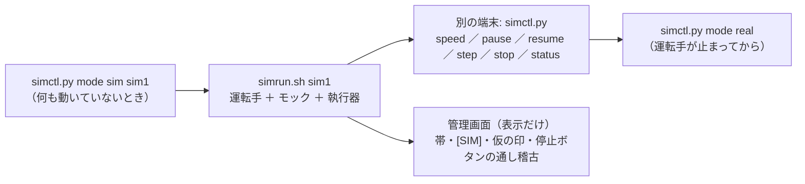
```mermaid
flowchart LR
  A["simctl.py mode sim sim1<br/>（何も動いていないとき）"] --> B["simrun.sh sim1<br/>運転手 ＋ モック ＋ 執行器"]
  B --> C["別の端末: simctl.py<br/>speed ／ pause ／ resume ／ step ／ stop ／ status"]
  B --> D["管理画面（表示だけ）<br/>帯・[SIM]・仮の印・停止ボタンの通し稽古"]
  C --> E["simctl.py mode real<br/>（運転手が止まってから）"]
```

**ふだんはプロジェクト直下の `run-sim.sh` 1 本**（2026-09-20。利用者の指示「手順が複雑なので run-xxxxx.sh 作って」）: 依存の用意 → 日足の確認（`--fetch titan` で scp）→ モードの切り替え → 管理画面 → 運転手 → 記録の検査、をまとめて行う。

```bash
./run-sim.sh                         # sim1 を続きから（無ければ最初から・×60）＋ 管理画面。終わっても管理画面は Ctrl+C まで残る
./run-sim.sh --fresh --speed max     # 最初から最速で ／ ./run-sim.sh sim2 --fresh（筋書きつき）／ --paused ／ --days N ／ --no-dashboard ／ --fetch titan
./run-sim.sh ctl speed 60            # 別の端末から。ctl の後ろは simctl.py へ（status ／ pause ／ resume ／ step ／ stop）。./run-sim.sh reconcile show も同じ
```

| 機械 | `run-sim.sh` の動き |
| --- | --- |
| 資格情報が無い（Sx360） | 機械のモード（`experiments/live-trading/MODE`）を sim に切り替えて回す。管理画面は 3012（既に動いていれば止めずにそのまま使う ＝ モードはリクエストごとに読む） |
| 資格情報がある（titan） | ⚠ **本物の `MODE` には触らない**: `MODE`・`run.lock`・記録を作業用の置き場（既定 `~/.cache/ai-income-lab-sim`。`AIL_SIM_SCRATCH`）に向ける（`LT_MODE_DIR`）＝ 本物の執行器を止めない。管理画面は `AIL_DEMO=1`（tastytrade に繋がない）で 3014 に起こす。⚠ 3012 の管理画面は触らない |

中身を 1 つずつ叩くとき:

```bash
cd experiments/live-trading
PY=../tastytrade-api-sample/.venv/bin/python
$PY simctl.py mode sim sim1          # 機械をシミュレーションモードへ。⚠ 以後この機械では本物の run_day.py が起動を拒否する（rc=5・本物の events.jsonl に refused_mode_sim）
./simrun.sh sim1                     # 続きから（無ければ最初から・×60）。終わると記録の検査（全行 sim ／ mock ／ test・秘密の不在）
./simrun.sh sim1 --fresh --speed max # 最初から最速で（64 営業日が約 8 秒【実測 2026-09-19・titan】）
./simrun.sh sim2 --fresh             # 筋書き（故障の注入）つき ＝ (i)。⚠ 先に simctl.py mode sim sim2
$PY simctl.py speed 60               # 別の端末から: 1 ／ 10 ／ 60 ／ 300 ／ 1440 ／ max だけ
$PY simctl.py pause                  # 仮の時計を止める（執行器の待ちも止まる）／ resume ／ step（1 営業日進めて止まる）／ stop（運転手を終わらせる）
$PY simctl.py status                 # モード・仮の時刻・速さ・何日目・動いているもの
$PY simctl.py mode real              # 実売買モードへ戻す（⚠ 運転手が動いている間は拒否される）
cd ../../dashboard && ./run.sh       # 管理画面はモードを見て sim/<名前>/ を読む（全ページに帯・[SIM]・「仮」の印。dashboard.md §13-6）
```

| 部品 | 置き場 | 中身 |
| --- | --- | --- |
| モードと排他 | `mode.py`（`MODE`・`run.lock`・`mode.log`。git 管理外） | `MODE` が無ければ real。執行器も運転手も起動時に `run.lock`（flock）を取る。運転手がロックを持ったまま起こした執行器だけは通す（親の pid とモードを見る） |
| 仮の時計 | `simclock.py`（正本は `sim/<名前>/sim/control.json` の 1 ファイル） | 仮のいま ＝ 錨 ＋ 実時間の経過 × 速さ。運転手・執行器・モック・管理画面が同じファイルを同じ式で読む ＝ 別プロセスでも同じ「いま」。速さ・停止を変える側が錨を打ち直すので時刻が飛ばない。最速は待たずに錨を進める（決定的）。⚠ **運転手が終わるときは必ず時計を止める**（いない間に進むと発注できる時間帯を通り過ぎる） |
| 執行器 | `run_day.py --sim-clock`（⚠ パスは受け取らない。時計と置き場は `MODE` の名前から決まる） | 受け付ける条件は (a)。通ると「いま」・`sleep`・約定待ちの 600 秒が仮の時計になり、置き場が `sim/<名前>/{out,state/cert,config/traders,HALT}` に固定される（外を指すと拒否）。全行に `sim`・`mock`・`test` |
| 仮データ | `simdata.py` ＋ `config/sim/<名前>.toml` ＋ `config/traders/sim_*.toml` | 日足の再生・合図の CSV（`sim/<名前>/config/signals/`）・日ごとの気配（`sim/data.json`）を運転手の初回起動で作る（決定的） |
| 運転手 | `simrun.py`（`simrun.sh` は検査つき） | モックを起こす（空きポート・`--sim-control` で時刻と遅延も仮の時計）→ 発注できる時間帯まで飛ぶ ／ 待つ → その日の気配を流す → 執行器を起こす → `sim/status.json`。⚠ 子へ `TT_*`・`LT_*` を渡さない（`.env` は空のファイル）。`.env` に資格情報があれば警告 |
| 操作の口 | `simctl.py`（⚠ CLI だけ） | `control.json` と `MODE` を書くだけ。プロセスを起こさない・殺さない。実売買モードでは速さ・停止の操作を拒否 |
| モック | `../tastytrade-api-sample/mock_server.py` | 銘柄ごとの気配（`/_mock/quote` の `quotes`）・故障の注入（`/_mock/fault`）・`--sim-control`。⚠ どれも指定しなければ今までどおり（selftest・`mockrun.sh`・管理画面のデモは変わらない） |
| テスト用の差し替え | `LT_MODE_DIR`（`MODE`・`run.lock`・`sim/` の置き場）／ `LT_SIM_DATA_DIR`（日足）／ `LT_SIM_CONFIG_DIR` | ⚠ `LT_MODE_DIR` は、モック以外への submit と、本物の `out/`・`state/` を指したままの実行では使えない（拒否） |

**Sx360 での立ち上げ**（⚠ 利用者が行う。Claude は Sx360 に触れない）: (1) リポジトリを pull (2) `experiments/tastytrade-api-sample` に venv を作る（`requirements.txt`。モックが `websockets` を使う）。⚠ **`.env` は置かない** (3) titan から日足を写す ＝ `rsync -a titan:ai-income-lab/experiments/feature-discovery/data/adjusted/d/ experiments/feature-discovery/data/adjusted/d/`（使うのは 3 人の 11 銘柄だけ: T・VZ・BAC・PFE・KO・XLF・XLE・XLU・NVDA・SPY・INTC）(4) 上の `mode sim sim1` → `simrun.sh` (5) 管理画面は資格情報が無いのでデモの帯も出るが、トレーダーの画面はシミュレーションの記録を読む。

#### (i) 筋書きを置く日（`config/sim/sim2.toml`。2026-09-19 決定）

`sim1` は故障なし（回帰の基準）。`sim2` ＝ 同じ仮データ ＋ 下の筋書き。⚠ モックの故障は「次の該当の要求」で起きる（注文の無い日をまたぐ）。⚠ **拒否の文面・コードは想像**（`Session offline` と HTML の 502 だけ実物の写し）。

| 何日目 | 筋書き | 確かめること | テスト（`tests/test_sim_scenarios.py`。毎日 1 注文の合図で日を固定） |
| ---: | --- | --- | --- |
| 3 | `session_offline` × 2 | 再送 60 秒 × 3 の内で通る（3 回目で Filled） | ✅ |
| 8 | `session_offline` × 5 | 3 回とも拒否 ＝ 諦めて `error`。残りは次の注文が受ける | ✅ |
| 12 | `http_5xx` × 1 | 5xx は再送する | ✅ |
| 15 | `http_429` × 3 | ⚠ 2026-09-21 から 429 は待って再送する（再送の前に重複を探す）。3 回とも 429 ＝ 最後に external-identifier で探し、無ければ `error`・状態は進まない（以前は × 1 で「再送しない」） | ✅ |
| 18 | `auth_5xx` × 1 | 30 秒待って 1 回だけ取り直す（`auth_5xx_retry`） | ✅ |
| 21 | `auth_401` | 再検証しない（`auth_failed`・その日は注文なし） | ✅ |
| 24 | `reject_funds` | エラーとして記録・再送しない・誰の分かが `parts` に残る | ✅ |
| 28 | `no_fill` | 取消までの 600 秒を**仮の時計の上でそのまま**待って取り消す・発注できる時間帯（〜16:05）の中で片付く・状態は進まない | ✅ |
| 32 | `skip_day` | 記録のディレクトリができない ＝ 管理画面の「起動しなかった日」 | ✅ |
| 36 | `crash_mid` | 発注の後・記録と売買履歴の保存の前に落ちる（rc=137）→ その日は `start` だけ残る。**次の日の起動で控えから照会し、約定をその人の売買履歴に入れる ＝ 二重に売買しない**（§0-8 の段 1） | ✅ |
| 57 | `position_loss`（BAC を 100 株ぶん口座から消す） | `position_short` ＝ BAC だけ、その日から売買が止まる（ほかの銘柄は動く）。直すのは人（`reconcile.py`。§0-8 の段 2・3） | ✅ |
| 45〜54 | `drawdown`（−3%/日 × 10 日 ＝ 累計 −26%。以後も戻さない） | `ledger.jsonl` の `drawdown_pct_of_budget` が 20% を超える。⚠ (j) の 2 | ✅（気配の係数） |
| 41・60 | （暦）半日立会 11-27・12-24 | 執行器が `out_of_window`（半日立会）で拒否し、記録と画面に出る | ✅ |
| — | `halt` | 人が管理画面の停止ボタンを押す ＝ `sim/<名前>/HALT` だけが書かれ、次の日から `halted`（rc=3）。解除で再開。本物の `HALT` は動かない | ✅（管理画面のテスト ＋ 手で確認） |

#### (j) 回して見つかったこと（2026-09-19【実測】。⚠ 損益の話ではない ＝ 自分のコードの穴）

| # | 見つかったこと | 対処 |
| ---: | --- | --- |
| 1 | **整数株の人と金額指定の人が同じ日に同じ銘柄を買うと、合算した `Notional Market` の約定を按分するので、整数株の人に端数の持ち分ができる**（例: 3 株のつもりが 2.992573 株）。それを全部売ると注文の数量は小数 4 桁（2.9926）で、(1) 持ち分を超えて `apply_sell` が例外 ＝ **約定したのに状態が 1 人ぶんも保存されない** (2) 逆に少なく約定すると 0.000028 株の建玉が残り、次の日に数量 0.0000 の売りを出す・買い直せない | ✅ **2026-09-19 に直した**（利用者決定「トレーダーごとに別々に出す」＝ §0-1 の表）: 口座への注文は 1 注文 1 トレーダーで、合算も按分もしない。`sim1` ／ `sim2` を回し直して、整数株の人（`sim_a`・`sim_c`）の端数の売買は 0 件【実測】。応急処置（丸めの差 `state.QTY_TOL` ＝ 1e-4 株は持ち分に合わせる・残りは建玉にしない ／ 売買履歴の 1 件の食い違いで落ちず `ledger_error` を残す）は、金額指定の人の端株の売りのために残す。⚠ tastytrade が小数 4 桁の売りを受けるかは未確認（`dryrun2`） |
| 2 | **含み損 20% の停止（§0-2）は執行器に無い**。`drawdown_pct_of_budget` を書くだけで、20% を超えても買い続ける（`sim2` で `sim_b` が 21.99% まで行き、そのまま売買した） | ✅ **2026-09-19 に決めて入れた**（利用者決定「警告だけ・止めるのは人」＝ §0-2 の停止の行）: `drawdown_warning` を記録するだけで売買は続ける。`sim2` で 10 件出る【実測】 |
| 3 | **発注の後に落ちた日の次の日、口座と売買履歴の食い違いを検知しない**。`external-identifier` の重複検査は同じ実行の中の再送にしか効かない（日をまたぐと別の id）。売買履歴は「売れていない」のままなので、次の日にもう一度売る（モックは通すが、本物は持ち高不足で拒否するはず【推測】。買いなら二重に買う） | ✅ **2026-09-19 に直した**（利用者決定「提案の 3 段」＝ §0-8）: 控えから戻す（自動）／ 突き合わせ（多い ＝ 売買履歴の外・少ない銘柄だけ止める）／ 人が合わせる `reconcile.py`。`sim2` で、落ちた次の日に `journal_recovered`（その人の売買履歴に入り、二重に売買しない）・運転手を途中で入れ直しても 64 日後の口座と売買履歴の差は全銘柄 0【実測】 |
| 4 | モックの応答が 1 回 40ms 待たされていた（ヘッダと本文が別の send ＝ Nagle ＋ 遅延 ACK）。約定待ち 1,200 回で 54 秒 | ✅ `disable_nagle_algorithm`。執行器のテスト全体が約 80 秒 → 約 12 秒 |
| 5 | `sim_a`（m20）と `sim_c`（m20 と m10 の平均）では、64 日で内部移転が 0 件だった | ✅ **2026-09-19 に内部移転そのものをやめた**（利用者決定「トレーダーの実際の実績が検証できない」＝ §0-1 の「売り」の行）。`mockrun.sh` は「同じ日・同じ銘柄に売りと買いが別々の注文で出て、売りが先」を確かめる（20 日で 6 件【実測】） |
| 6 | 差 1 の中央値が 14〜22bp で ❌ になる | そのまま（モックの `--fill-noise 0.003` ＝ 0〜30bp の一様な不利。決めごとの値。⚠ 本物の差 1 ではない） |

#### (k) `sim_T1`〜`sim_T3` ＝ 本番と同じ形（`kind = "experiment"`）を流す（✅ 2026-09-20。[プラン](../../plans/archive/live-trading-sim-experiment-traders.md)）

本番に入れる `T1`〜`T3` の候補（`config/traders/candidates/`）の写しを、仮データと仮の時計で 64 営業日流した。⚠ **見るのは執行器の振る舞いだけ。日付は仮・値段は過去の実物なので、損益に意味は無い**（判定に混ぜない）。⚠ **検証ではない**（`runs/` を作らない ＝ 検証結果一覧の n_trials は動かない）。⚠ モックの約定・手数料・速さは tastytrade の【実測】ではない。

> この図の主張: 予測は「出どころの日付」で先に作り置きし、運転手が木を作るときに仮の日付へ書き換えて置くだけ ＝ 執行器（`run_day.py`）は 1 行も変えていない。

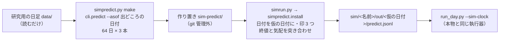
```mermaid
flowchart LR
  D["研究用の日足 data/<br/>（読むだけ）"] --> P["simpredict.py make<br/>cli.predict --asof 出どころの日付<br/>64 日 × 3 本"]
  P --> C["作り置き sim-predict/<br/>（git 管理外）"]
  C --> I["simrun.py → simpredict.install<br/>日付を仮の日付に・印 3 つ<br/>終値と気配を突き合わせ"]
  I --> O["sim/<名前>/out/<仮の日付>/predict.jsonl"]
  O --> R["run_day.py --sim-clock<br/>（本物と同じ執行器）"]
```

| 決めごと | 値 |
| --- | --- |
| 設定 | `sim3` ＝ `sim_T1`〜`sim_T3`（`candidates/notional/` の写し。金額指定・us63 の 63 本 ／ T2 は会社株 48 本・1 銘柄の枠 $4.76 ／ $6.25）／ `sim4` ＝ `sim_S1`〜`sim_S3`（`candidates/shares/` の写し。整数株・T・PFE・NKE・VZ・BAC・枠 $60）。どちらも `test = true`・予算 $300 × 3・筋書きなし・期間と出どころは `sim1` と同じ。⚠ モデル・θ・合成規則は候補のまま（替えない） |
| 予測の日付 | `cli.predict --asof <出どころの日付>` で作り、置くときに行の `date` を仮の日付に書き換える（元は `source_date` に残す）。シミュレーションは「k 番目の仮の営業日 ＝ 出どころの k 番目の足」なので |
| 予測の入力 | **研究用の `data/`**（`AIL_DATA_DIR` を外して回す。⚠ 読むだけ）＝ シミュレーションの値段の出どころと同じ足。予測の `proxy_close` とその日の気配を置くときに突き合わせ、食い違いを数える（日付の当て方のずれの検知）。`data-live/` は外部系列が別物（`exog_live`）で、実売買の日の更新と取り合うので使わない |
| 作り置き | `experiments/live-trading/sim-predict/<出どころの日付>/<実験>@<手法の指紋>.jsonl`（git 管理外。`LT_SIM_PREDICT_DIR`）。`--fresh` で消える木の外。出来ている（日付, 実験）は飛ばす ＝ 途中から再開できる。`sim3` と `sim4` は同じ作り置きを使う。⚠ **Sx360 へは titan で作ったこのディレクトリを写す**（LightGBM が無くても回せる） |
| 欠けている日 | ⚠ **1 本でも欠けていたら運転手は起動しない**（rc=2。欠けた日と作るコマンドを出す）。予測の無い日は「合図なし」で静かに何もしない ＝ 通ったように見えてしまうので |
| 行の印 | 置く行に `sim`・`mock`・`test`（`simctl.py check` が `out/*/*.jsonl` の全行に求める） |

```bash
cd experiments/live-trading; PY=../tastytrade-api-sample/.venv/bin/python
setsid nohup $PY simpredict.py make sim3 --jobs 8 > ~/simpredict.log 2>&1 < /dev/null &   # titan で。192 本・約 16 分【実測】。$PY simpredict.py status sim3
cd ../..; ./run-sim.sh sim3 --fresh --speed max        # 64 営業日。sim4 も同じ（作り置きは共通）
```

**結果【実測 2026-09-20・titan・作業用の置き場（`LT_MODE_DIR`）。本物の `MODE`・`run.lock`・`out/`・`state/` には触っていない】**

| | `sim3`（金額指定・63 ／ 48 本） | `sim4`（整数株・5 本） |
| --- | ---: | ---: |
| 予測の作り置き | 192 本（64 日 × 3）・失敗 0・8 並列で 946 秒（1 本 35〜50 秒） | 同じものを使う |
| 置いた予測 | 64 日・11,136 行・終値と気配の食い違い **0 行** | 同左 |
| 64 営業日の所要時間（最速） | 32 秒 | 9 秒 |
| 注文 | **897 本・全部 `Filled`**（買い 532 ／ 売り 365）。`bad` 0・`ledger_error` 0 | 59 本・全部 `Filled`（買い 36 ／ 売り 23） |
| 人ごと（買い ／ 売り） | `sim_T1` 399 ／ 343・`sim_T2` 48 ／ 0・`sim_T3` 85 ／ 22 | `sim_S1` 26 ／ 22・`sim_S2` 4 ／ 0・`sim_S3` 6 ／ 1 |
| 1 日の注文の本数 | 初日 **123 本**（T1 60 ＋ T3 63 ＋ T2 0）が最大・中央値 11 本・0 本の日 2（半日立会） | 初日 10 本が最大・0 本の日 39 |
| 初日の窓（×60 で 1 日だけ流した） | 123 本で仮の時計 143 秒（15:45:34 → 15:47:57）・実時間は約 2.4 秒。⚠ モックの速さ ＝ 本物の見積りにはならない（本物は §0-9 (c) の ① に約 5.6 分【推測】） | — |
| 口座 − 売買履歴 | `position_short` 0 件・`positions_outside_ledger` 0 件（62 日とも一致）・控え 2,691 行で未完 0 | 同じく 0 件 |
| 事象 | `hold` 6,806 ／ `skip` 3,085（うち `sim_T2` 2,928）／ `out_of_window` 2（11-27・12-24 の半日立会）／ `too_small`・`over_budget`・`drawdown_warning` 0 | `hold` 565 ／ `skip` 305 ／ `out_of_window` 2 ／ **`too_small` 1**（下の 3） |
| 1 注文の金額 | $2.67〜$6.26（中央値 $4.76）。売りは小数 4 桁の株数（例 ORCL 0.0191 株 ＝ $2.67）。売り切った後の端数の建玉は 0 件 | $38.59〜$56.94（中央値 $43.79） |
| 最終日の持ち高（時価。⚠ 損益に意味は無い） | 56 本 $275 ／ 48 本 $299 ／ 63 本 $313 | 4 本 $221 ／ 4 本 $197 ／ 5 本 $259 |
| 検査（`simctl.py check`） | 33,334 行・印の無い行 0・秘密 0 | 13,618 行・同 0 |

**見つかったこと**（⚠ 執行器の凍結の範囲は 1 行も変えていない）

| # | 見つかったこと | 対処 |
| ---: | --- | --- |
| 1 | **シミュレーションの仮データが `BRK/B` を読めなかった**（`simdata.load_closes` と `run-sim.sh` の日足の確認がファイル名を `BRK/B.csv` として探す。実物は `BRK-B.csv`）。us63 を使う設定で初めて踏む ＝ `sim1`・`sim2` では出ない | ✅ 直した（`paper.py` と同じ `/` → `-`）。⚠ 執行器（`run_day.py`）とモックは `BRK/B` のまま気配・dry-run・発注・約定まで通った（64 日で 買い 3 本・全部 `Filled`【実測】）。⚠ **本物の tastytrade が `BRK/B` をこの綴りで受けるかはモックでは分からない** ＝ 月曜の `T1`〜`T3` の本番 dry-run（関門 5）で BRK/B の行を見る |
| 2 | **`sim_T2` は 64 日のうち最終日にだけ 48 本を一度に買い、それまでは 1 本も買わなかった**（買い% が全銘柄ほぼ同じで θ=55 に届かない日が 61 日）。§0-1 の「48 銘柄を同時に買うか、1 本も買わない」のとおり ＝ 仕様 | そのまま。⚠ 本番でも「T2 が何日も 0 本」は故障ではない（§0-9 (e) の確認で驚かない） |
| 3 | **整数株の形（`sim4`）は枠を使い切れない**: 枠 $60 に対して 1 注文の中央値 $43.79・3 人の最終日の持ち高は $197〜$259 ／ 予算 $300。BAC は出どころの期間の終わりに $61.94 で枠 $60 を超え、`too_small`（1 株も買えない）が出た。⚠ 2026-09-18 の終値 $57.73 は枠まで 4% しかない | そのまま（D3 は利用者決定）。端株が通らず `shares` で入るときは、BAC が $60 を超えた日から買えなくなることを知っておく |
| 4 | `sim_T1` は売りが 343 本（1 本 $3〜$6）。モックの見積りでは売り 1 本に手数料 $0.01 ＝ $4.76 に対して約 21bp（64 日で $3.43）。⚠ モックの作り物の数字 | 本物の額は「約定後の実際の手数料を読む」（TODO）で確かめる。小口の売りが多い形では、最低額のある手数料が効くかを月曜の cert ／ 本番の dry-run の `fee` で見る |
| 5 | 金額指定の売りは小数 4 桁の株数で出る（0.0103〜0.0242 株など）。モックは通す | ⚠ tastytrade が受けるかは `dryrun2` の `market_sell_fractional_4dp_no_position` の行で読む（§0-3。月曜） |

テスト: `tests/test_simpredict.py` 6 本（日付の書き換えと印 ／ 欠けた日で止まる・再開は無いものだけ ／ 終値と気配の食い違いを数える ／ `experiment` の無い設定では何も置かない ／ 手法ごとの置き場 ／ 運転手を通しで）。回帰: 執行器 135 本・`sim1`（`--fresh --speed max`。注文 60 本・検査 OK）・管理画面 167 本。`experiments/feature-discovery/runs/`・`data/` に増えた ／ 変わったものは無い。

##### `sim5` ＝ 複数モデルの候補の人（`sim_T4`・`sim_T5`）を通す（✅ 2026-09-29・titan。[プラン new-model-trader.md](../../plans/archive/new-model-trader.md) Phase 5）

⚠ **配線の確認が目的で、成績は測らない・成績で採らない**（§0-1 の「候補の人」）。⚠ 黄金の集計値には足さない（`--full` を重くしない）。

| 決めごと | 値 |
| --- | --- |
| 設定 | `config/sim/sim5.toml` ＝ `sim_T4`（いまの 3 本を `mean`・θ 50）・`sim_T5`（主モデル `trade_own_ridge_a` ＋ 出口だけの損切りモデル `trade_own_stopexit_a` を `unanimous`・θ 50）。2 人とも `test = true`・予算 $300・整数株・T・PFE・NKE・VZ・BAC・筋書きなし・期間と出どころは `sim1` と同じ。予算の合計 $600（執行器の既定の上限 $1,000 の内） |
| 作り置き | `sim3` ／ `sim4` の 192 本はそのまま使い、増えるのは損切りモデルの 64 本だけ（`simpredict.py make sim5` が無いものだけ作る）。出口だけの行は `buy` 100・`exit` 0 ／ 100 |
| 機械 | titan の作業用の置き場（`run-sim.sh` が資格情報のある機械では `~/.cache/ai-income-lab-sim` に向ける ＝ 本物の `MODE`・`run.lock`・記録に触らない。管理画面はデモの 3014）。✅ **2026-09-30 に Sx360 へ写した**（プラン 5-3。Sx360 の Claude が `rsync titan:…/sim-predict/`・6.7 MB・65 日ぶん ＝ sim3 ／ sim4 ／ sim5 の全部）→ 下の「Sx360 で回し直した」 |

```bash
cd experiments/live-trading; PY=../tastytrade-api-sample/.venv/bin/python
setsid nohup $PY simpredict.py make sim5 --jobs 8 > ~/.cache/ai-income-lab-sim/simpredict-sim5.log 2>&1 < /dev/null &   # titan。64 本・282 秒【実測】
cd ../..; ./run-sim.sh sim5 --fresh --speed max --no-dashboard    # 64 営業日 約 14 秒【実測】
```

**結果【実測 2026-09-29・titan・作業用の置き場】**

| | `sim5`（`sim_T4` ＋ `sim_T5`） |
| --- | ---: |
| 予測の作り置き | 損切りモデル 64 本・失敗 0・8 並列で 282 秒（1 本 32〜39 秒。学習なし ＝ 規則の計算と表の組み立てだけ）。合計 256 ／ 256 |
| 置いた予測 | 64 日・15,168 行（4 実験 × 63 銘柄）・終値と気配の食い違い **0 行** |
| 64 営業日の所要時間（最速） | 約 14 秒 |
| 注文 | **81 本・全部 `Filled`**（買い 45 ／ 売り 36）。`error` 0・取消 0 |
| 人ごと（買い ／ 売り） | `sim_T4` 9 ／ 4・`sim_T5` 36 ／ 32 |
| 1 日の注文の本数 | 初日 10 本（2 人 × 5 本）が最大・中央値 1 本・0 本の日 31 |
| 1 注文の金額 | $38.65〜$51.51（中央値 $43.34） |
| 口座 − 売買履歴 | 62 日とも 0 件・控えの未完 0 |
| 事象 | `hold` 538 ／ `skip` 1（`sim_T5`）／ `out_of_window` 2（11-27・12-24 の半日立会）／ `too_small`・`over_budget`・`drawdown_warning` 0 |
| 最終日の持ち高（時価。⚠ 損益に意味は無い） | `sim_T4` 5 本 $259 ／ `sim_T5` 4 本 $221。手数料（モックの見積り）$0.04 ／ $0.32 |
| 検査（`simctl.py check`） | 16,968 行・印の無い行 0・秘密 0 |
| 画面 | 管理画面（デモ 3014）: `[SIM] 概要`・帯「シミュレーション sim5」・`/api/live` の `traders` ＝ `sim_T4`・`sim_T5`・`/traders/sim_T5` が開く ／ vibeboard のトレーダーのタブ: ハル（T4）・ミオ（T5）が「未確定」の印で並ぶ・予測モデルのタブに `stop-exit` |
| Sx360 で回し直した（2026-09-30） | `./run-sim.sh sim5 --fresh --speed max`（機械のモードを sim5 へ・管理画面 3012）＝ **titan と 1 本も違わない**: 注文 81 本・全部 `Filled`（買い 45 ／ 売り 36・`sim_T4` 9 ／ 4・`sim_T5` 36 ／ 32）・`error` 0・取消 0 ／ 事象 `hold` 538 ／ `skip` 1 ／ `out_of_window` 2（11-27・12-24 ＝ rc=4）／ 検査 16,968 行・印の無い行 0・秘密 0 ／ 管理画面 3012: `[SIM] 概要`・帯「シミュレーション sim5」・`/api/live` の `mode` sim・`traders` ＝ `sim_T4`・`sim_T5`・`/traders/sim_T5` 200 |

**見つかったこと**（⚠ 執行器は 1 行も変えていない。10/20 の判定まで凍結）

| # | 見つかったこと | 対処 |
| ---: | --- | --- |
| 1 | **`sim_T5` は売った翌日に買い戻す**: 売り 32 本のうち 30 本は翌日に同じ銘柄を買い直した。出口だけのモデルは「今日降りる」しか言わず（`buy` は常に 100 ＝ K2 の約束）、`unanimous` の買いは min ＝ 主モデルの値のままなので、損切りモデルが降りろと言い続けるあいだ（T は 6 月に 4〜7 日続いた）**売る → 翌日買う → 売る** を繰り返す。32 本の内訳: 損切りモデルが言った 17・主モデルだけ 15（後者は T1 と同じ振る舞い）。手数料は `sim_T4` の 8 倍（$0.32 ／ $0.04。モックの見積り） | そのまま（配線の確認としては「出口だけのモデルが出口 ＝ 売りになる」ことが通った）。⚠ **本番に `T5` の形を入れるなら先に決める**: (a) 出口だけの検知器 `X1` が出口を言う日は `buy` を 0 にする（研究側のコード。⚠ K2「常に 100」の変更 ＝ 利用者の決定・新しい検証）／ (b) 執行器に「売った翌日は買わない」休みを足す（⚠ 執行器の変更 ＝ プラン §7 へ）。⚠ 机上の損切りの検証（[stoploss-as-model.md](stoploss-as-model.md)）は 33 検証とも落としており、本番に入れる理由はもともと出ていない |
| 2 | **`sim_T4`（3 本の平均）は初日に 5 本買ってほぼ持ち続けた**（売り 4・買い戻し 4・`hold` 297 ＝ 5 本 × 約 60 日）。T2 の買い% は全銘柄ほぼ同じ 51 前後なので平均が θ 50 を割りにくい | そのまま。⚠ 「平均」は 1 本の跳ねを薄める ＝ 売買が減る形だと知っておく（成績の話ではない） |
| 3 | **vibeboard の sidecar（3015）は起動時のコードのまま** ＝ `traderview.py` を直した後に入れ直さないと、トレーダーのタブに候補の人が出ない（`models.toml` は 5 秒ごとに読み直すので `stop-exit` は出ていた） | 入れ直した（`kill` → `python3 dashboard/vibetab.py`）。手順書 §2 2-5 に注意を足した |
| 4 | `setsid nohup … &` の `$!` は setsid の親の pid で、すぐ死ぬ（子は生きている） | 終了待ちは `pgrep -f "simpredict.py make"` で見る（記憶にも同じ注意がある） |

##### `sim6` ＝ 検証結果一覧の上位をもとにした候補の人（`sim_T6`）を通す（✅ 2026-10-01・titan。[プラン best-model-trader.md](../../plans/archive/best-model-trader.md) Step 3）

⚠ **配線の確認が目的で、成績は測らない・成績で採らない**（§0-1 の「候補の人（検証結果一覧の上位）」）。⚠ 黄金の集計値には足さない。

| 決めごと | 値 |
| --- | --- |
| 設定 | `config/sim/sim6.toml` ＝ `sim_T6`（`sel_small4_1995` の `F2-2 RFE`・`asis`・θ 50・`test = true`・$300・整数株・T・PFE・NKE・VZ・BAC）。筋書きなし・期間と出どころは `sim1` ／ `sim5` と同じ |
| 作り置き | `simpredict.py make sim6 --jobs 8` ＝ 64 本・失敗 0・**349 秒**【実測】（1 本 約 43 秒 ＝ 1995 年からの表の組み立て 31 秒 ＋ 選別と fit） |
| 機械 | titan の作業用の置き場（`./run-sim.sh sim6 --fresh --speed max --no-dashboard`）。⚠ Sx360 で回すなら `sim-predict/` を写し直す（増えたのは F2-2 の 64 本）。✅ **2026-10-01 に Sx360 へ写した**（Sx360 の Claude が `rsync titan:…/sim-predict/`・6.7 MB → 8.2 MB・変わったのは `sim.sqlite` 1 つ）→ 下の「Sx360 で回し直した」 |

**結果【実測 2026-10-01・titan・作業用の置き場】**

| | `sim6`（`sim_T6`） |
| --- | ---: |
| 64 営業日の所要時間（最速） | 約 12 秒 |
| 置いた予測 | 64 日 × 63 銘柄。買い% 50.87〜54.80（中央値 52.75）・1 日の中の標準偏差の平均 0.21・50 を超えた銘柄 64 日とも 63 ／ 63 |
| 注文 | **5 本・全部 `Filled`**（初日 2026-10-01 の買いだけ ＝ T 2・PFE 2・NKE 1・VZ 1・BAC 1 株・$245.53）。売り 0・`error` 0・取消 0 |
| 事象 | `hold` 305 ／ `out_of_window` 2（11-27・12-24 の半日立会）／ `too_small`・`over_budget`・`drawdown_warning` 0 |
| 最終日の持ち高（時価。⚠ 損益に意味は無い） | 5 本 $259.31・手数料 $0 |
| 検査（`simctl.py check`） | 5,150 行・印の無い行 0・秘密 0 |
| 画面 | vibeboard のトレーダーのタブに `T6`「（候補）」・予測モデルのタブに `rfe-own1995`（sidecar 3015 は入れ直し不要 ＝ TOML だけの変更） |
| Sx360 で回し直した（2026-10-01） | `./run-sim.sh sim6 --fresh --speed max`（機械のモードを sim6 へ・管理画面 3012）＝ **titan と同じ**: 置いた予測 64 日・4,032 行（終値と気配の食い違い 0）／ 注文 5 本・全部 `Filled`（初日の買いだけ ＝ T 2・PFE 2・NKE 1・VZ 1・BAC 1 株・$245.53）・売り 0・`error` 0・取消 0 ／ 事象 `hold` 305 ／ `out_of_window` 2（11-27・12-24 ＝ rc=4）／ 検査 5,150 行・印の無い行 0・秘密 0 ／ 管理画面 3012: `[SIM] 概要`・帯「シミュレーション sim6」・`/api/live` の `mode` sim・`traders` ＝ `sim_T6`・`/traders/sim_T6` 200。⚠ 最終日の時価は突き合わせていない |

**見つかったこと**: 1. **T6 は「買って持ち続ける」と同じ**（上の §0-1 の注）。机上で持ち続けるより良かった分は大きな下げの時期に降りたことから来ていて、いまの時期の出力スコアは 50 を下回らない。⚠ 本番に入れても、下げが来るまでは「持ち続ける」と見分けがつかない（成績の話ではなく、執行の差を測る相手としての性質）。

#### (l) 自動で回せるもの（2026-09-20。利用者の指示「自動でテストを回せるものはある？」）

⚠ **通し運転は「落ちないこと」しか見ていなかった** ＝ 執行器を触って振る舞いが変わっても気づけなかった。2026-09-20 に 3 つ足した。

> この図の主張: 層ごとに守るものを分ける。通し運転には「集計値が変わったら気づく」という役目を与えた（ここが空白だった）。

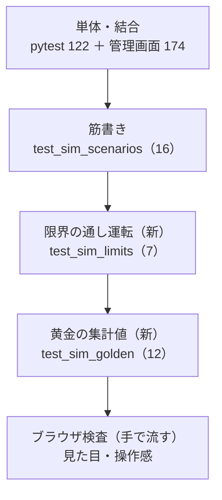
```mermaid
flowchart TD
  U["単体・結合<br/>pytest 122 ＋ 管理画面 174"] --> S["筋書き<br/>test_sim_scenarios（16）"]
  S --> L["限界の通し運転（新）<br/>test_sim_limits（7）"]
  L --> G["黄金の集計値（新）<br/>test_sim_golden（12）"]
  G --> B["ブラウザ検査（手で流す）<br/>見た目・操作感"]
```

```bash
./run-tests.sh            # ⚠ ふだんはこれ 1 本（プロジェクト直下）。執行器 → 管理画面 → selftest → mockrun（約 1 分 34 秒【実測】）
./run-tests.sh --fast     # pytest 2 つだけ（約 38 秒【実測】）
./run-tests.sh --full     # ＋ 黄金の集計値（通し運転 64 営業日 × 2 本。合計 2 分 3 秒【実測 2026-09-20・Sx360】）
```

| 何を守るか | どこ | 中身 |
| --- | --- | --- |
| **黄金の集計値** | `tests/test_sim_golden.py` ＋ `tests/golden/sim{1,2}.json` | `sim1`／`sim2` を最速で通し、**出来事の種類ごとの件数・注文の数**を覚えた値と突き合わせる。⚠ **値が変わったら、直す前に理由を確かめる**（更新は `AIL_UPDATE_GOLDEN=1` のときだけ）。⚠ **重い**ので `AIL_GOLDEN=1`（＝ `--full`）のときだけ。日足が無い機械では skip |
| 決めごとの不変条件 | 同上 | 1 注文 1 トレーダー（`parts` は必ず 1 件）／ 整数株の人に端数が無い ／ 口座 − 台帳 ＝ 0（⚠ `sim2` は筋書きで抜いた BAC の −100 だけ）／ 全行に印・秘密なし |
| 筋書きが効いた証拠 | 同上 | `out_of_window` 2（半日立会）・`journal_recovered` 2（⚠ 2026-09-22 に 1 → 2。発注が 2 段になり、落ちた日の買い 2 本が両方とも口座に届いてから落ちるため）・`auth_failed` 1・`drawdown_warning` は `sim_b` だけ・止まる銘柄は BAC だけ・起動しなかった日がある |
| **予算の上限** | `tests/test_sim_limits.py` | 何日流しても取得原価が予算を超えない。⚠ **予算は「枠に丸める」（`target = min(per_symbol, available)`）ことで守られていて、`over_budget` は現在の経路では出ない** — 枠で 1 株も買えないときは `too_small` になる（⚠ 下の「気づいたこと」） |
| **1 日に 2 回の発注** | 同上 | 同じ日に 2 回起きて、⚠ **二重に買わない**（1 回目で持ったら 2 回目は `hold`）。⚠ 発注できる時間帯は 15:45〜16:05 ET に固定なので、2 回ともその中に置く |
| ⚠ その時間帯の外は拒む | 同上 | 10:00 に起こしても `out_of_window` で拒まれる。⚠ **2026-09-20 に「広げない」と決めた**（予測モデルが日足なので 1 日に複数回動かす意味が無い ＝ §0-9）ので、この検査は**決定の番人**になる |
| **停止と解除** | 同上 | 途中で `HALT` を置くとその日から `halted`（rc=3・発注なし）、消すと翌日から起動して売買が戻る。⚠ `halt` は筋書き（設定）に入れない（(i) の決めごと「人が押す」）＝ テスト自身が置く |

⚠ **気づいたこと（2026-09-20）**: 執行器が出しうる出来事 25 種類のうち、通し運転で出ていたのは 12 種類だけだった【実測】。
上の追加で `halted`・`too_small`（枠）・`out_of_window`（発注できる時間帯の外）が加わった。⚠ **`over_budget` は到達できない**（丸めが先に効く）ので、
**消すか・別の守りに使うかは利用者の裁定** → ✅ **2026-09-27 利用者決定「残す」**（プラン new-model-trader.md K8・[stoploss-as-model.md §0-7](stoploss-as-model.md)。テストが「出ない」ことを固定したまま ＝ 番人）。残る空白は `no_quote`・`no_signal`・`signal_error`・`ledger_error`・`quote_failed`・`quote_client_failed`・`after_read_failed`。

⚠ **テストの隔離漏れを 2 つ直した（2026-09-20）**: どちらも**シミュレーション専用機（Sx360 ＝ ふだん `MODE` が sim）では必ず落ちる**作りだった。
`dashboard/tests/test_demo.py` が `AIL_MODE_DIR` を tmp に向けておらず、デモではなく `sim/<名前>/` を読んでいた ／
`tests/test_sim_run_day.py` が「本物の `MODE` が存在しない」ことを前提にしていた（→ 前後で変わらないことを見る形に直した）。
⚠ **テストは `LT_MODE_DIR`／`AIL_MODE_DIR` を必ず tmp に向ける**（(a) の決まりの延長）。

### 0-8. 口座の建玉と売買履歴の帳尻を合わせる — 3 段（2026-09-19 利用者決定「提案の 3 段にします」）

| 用語 | 中身 | 読む所 |
| --- | --- | --- |
| **口座の建玉** | 口座が実際に持っている株（銘柄ごとの株数）。tastytrade が持っている事実で、口座は 1 つなので**合計しか見えない**（誰のぶんかは分からない）。現金は入らない（そちらは残高） | `client.list_positions` → `positions.jsonl` |
| **売買履歴** | 執行器が付けている「誰が何株・いくらで持っているか」 | `state/<env>/<名前>.json` |
| **控え** | 発注の直前に書く注文の覚え書き（ID・日付・誰の・銘柄・向き・数量・手数料の見積り）→ 発注の後に注文番号 → 売買履歴を保存した後に済みの印 | `state/<env>/journal.jsonl`（足すだけ。`--mode submit` のときだけ） |
| **食い違い** | ある銘柄で 口座の株数 ≠ 全トレーダー（その回に動かさない人も含む）の売買履歴の合計。許す差は 0.001 株（端株の丸め） | `recovery.check_positions` |

起こる場面: 発注の後・売買履歴の保存の前に執行器が落ちる（電源・WSL の再起動・kill）／ 取消と約定が行き違う・発注は通ったが応答が返らない ／ 人が口座を直接触る（アプリで売買・API サンプルの 1 株・株式分割・sandbox のリセット）／ 売買履歴のファイルを消す・古いものに戻す・別の機械で動かす。

> この図の主張: 起動のたびに「控えの未完を戻す → 口座と売買履歴を突き合わせる」を売買の前に済ませる。自動で直すのは、誰の注文かが控えで確実に分かるものだけで、⚠ **差を推測で誰かに割り振らない**（トレーダーごとの成績が混ざる）。

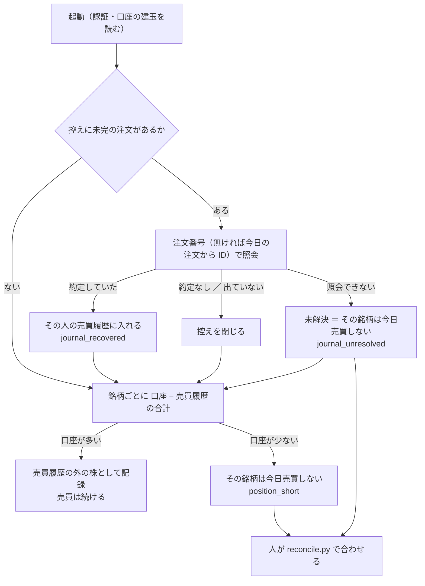
```mermaid
flowchart TD
  S["起動（認証・口座の建玉を読む）"] --> J{"控えに未完の注文があるか"}
  J -->|ある| Q["注文番号（無ければ今日の注文から ID）で照会"]
  Q -->|約定していた| A["その人の売買履歴に入れる<br/>journal_recovered"]
  Q -->|約定なし ／ 出ていない| N["控えを閉じる"]
  Q -->|照会できない| U["未解決 ＝ その銘柄は今日売買しない<br/>journal_unresolved"]
  J -->|ない| C
  A --> C["銘柄ごとに 口座 − 売買履歴の合計"]
  N --> C
  U --> C
  C -->|口座が多い| O["売買履歴の外の株として記録<br/>売買は続ける"]
  C -->|口座が少ない| B["その銘柄は今日売買しない<br/>position_short"]
  B --> H["人が reconcile.py で合わせる"]
  U --> H
```

| 段 | 中身 | 実装 |
| --- | --- | --- |
| 1 記録から戻す（自動） | 起動時に控えの未完（済みの印が無い注文）を 1 件ずつ照会する。約定していれば、約定価格・数量・控えに書いた手数料の見積りを**その人の売買履歴**に入れ（`history` の `note: "recovered"`・日付は発注した日）、控えを閉じる。働いたまま残っていた注文は取り消してから読む。⚠ **売買履歴の保存は 1 注文ごと**（それまでは全注文の後に 1 回 ＝ 途中で落ちると全部失っていた）＝ 失うのは高々 1 注文で、それも次の起動で戻る。⚠ `plan` ／ `dry-run` では照会して記録するだけ（書かない） | `journal.py`・`recovery.recover_unfinished`・`execute.Executor`（`journal`）・`run_day.py` の `settle` |
| 2 突き合わせ（検知） | 控えを戻した後、トレーダーの銘柄集合と売買履歴にある銘柄について 口座 − 売買履歴の合計 を見る。**口座が多い** ＝ 売買履歴の外の株（利用者の手持ちなど）→ `positions_outside_ledger` に記録するだけ・売買は続ける（トレーダーは自分の売買履歴の株しか売らないので、誰も手を付けない）。**口座が少ない** ＝ 売買履歴に「ある」のに口座に無い → `position_short`、その銘柄は**その日、全員ぶん発注しない**（`blocked_symbol`）。ほかの銘柄は通常どおり。rc=1・`end` に `blocked_symbols`・管理画面の「問題」 | `recovery.check_positions`・`run_day.py` |
| 3 人が合わせる（CLI） | `reconcile.py`（⚠ **ネットワークを使わない**・`run.lock` を取る・機械のモードに従う木だけ）: `show`（売買履歴の合計・最後に記録した口座の建玉・差・控えの未完）／ `add <人> <銘柄> <株数> --price`／ `remove <人> <銘柄> <株数>`（原価で消す ＝ 損益 0。`--price` を付ければその値段の売りとして入れる）／ `resolve <ID> --filled <株数> --price ／ --not-filled`。直した内容は `history` の `note: "reconcile"` と `state/<env>/reconcile.log` | `reconcile.py` |

```bash
cd experiments/live-trading; PY=../tastytrade-api-sample/.venv/bin/python
$PY reconcile.py --env prod show                               # ⚠ 口座の側は「最後に記録した建玉」。いまの口座は口座の画面で確かめる
$PY reconcile.py --env prod remove T2 KO 3 --reason "アプリで手で売った"
$PY reconcile.py --env prod resolve lt-0123abcd --filled 4 --price 25.61
```

| ⚠ 限界 | 読み方 |
| --- | --- |
| 前の営業日の注文を注文番号で照会できるかは未確認（当日ぶんの一覧に約定済みが混ざることは 2026-09-08 に実測） | 照会できなければ `journal_unresolved` ＝ その銘柄を止めて、人が `resolve` で閉じる。sandbox のリハーサルで確かめる |
| 発注が相手に届いた後・注文番号を控える前に落ち、次の起動が別の日 | 注文番号が無く今日の一覧にも出ない ＝ 未解決（人が閉じる）。同じ日に起こし直せば ID で見つかる |
| 売買履歴の動きは全部、口座の注文と 1 対 1 | 2026-09-19 に内部移転をやめたので、口座に出ない売買は無い ＝ 控えに載らない売買履歴の動きは、人の手（`reconcile.py`）だけ |
| 口座が多いぶんは止めない | 二重の買いは段 1 で先に消えるので、残る「多いぶん」は売買履歴の外の株。⚠ 売買履歴のファイルを失ったときは全部「多い」になり、トレーダーは何も持っていないつもりで買い直す ＝ `state/` のバックアップは別の話（未着手） |
| モック | 口座の建玉は `/_mock/positions` で置ける ／ ずらせる（運転手は起こすたびに売買履歴の合計を置く）。筋書き `position_loss` |

**手じまい `liquidate.py`（2026-10-05。利用者の指示「手じまいを自動で行う機能が欲しい」「実装して明日にはプログラムを使った手じまいで既存の株を売却します」。[プラン liquidate.md](../../plans/archive/liquidate.md)）**: 指定した人の売買履歴の持ち株を成行で売り、約定を売買履歴に写す。毎日の執行器とは別の 1 本で、部品（`Executor`・控え・`apply_sell`・記録・許可の 3 段・印・`run.lock`）はそのまま使う（毎日の経路は変えない ＝ 凍結の趣旨に触れない）。売るのは売買履歴の持ち株だけ（口座にあって売買履歴に無い株は売らない）。`HALT` 中は `--while-halted` を付けたときだけ。市場が開いている間（9:30〜引け ET）なら動く。終わりに口座 − 売買履歴 を突き合わせ、差があれば rc=1。記録は `out/<日付>/orders.jsonl`（`liquidate: true`）。テストは `tests/test_liquidate.py`（モックで 9 本）。13500t での使い方はプラン §2。

### 0-9. 今日の買い% ・1 日の流し方・2 段の発注・本番投入の手順（2026-09-20。[プラン](../../plans/archive/live-trading-go-live-0922.md)）

> この図の主張: 1 日の流れは `run-live.sh` の 1 本で、15:50 ET に起こすと約 1 分半で予測が出て、その場で執行器が動く。本番の許可を出すのは利用者だけ。

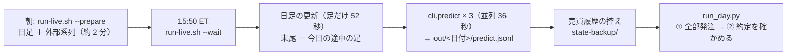
```mermaid
flowchart LR
  P["朝: run-live.sh --prepare<br/>日足 ＋ 外部系列（約 2 分）"] --> W["15:50 ET<br/>run-live.sh --wait"]
  W --> U["日足の更新（足だけ 52 秒）<br/>末尾 ＝ 今日の途中の足"]
  U --> Q["cli.predict × 3（並列 36 秒）<br/>→ out/<日付>/predict.jsonl"]
  Q --> K["売買履歴の控え<br/>state-backup/"]
  K --> X["run_day.py<br/>① 全部発注 → ② 約定を確かめる"]
```

#### (a) 今日の買い%（`experiments/feature-discovery/cli/predict.py`。Phase 1）

| 決めごと | 中身 |
| --- | --- |
| コード | ⚠ **モデル・較正・変換のコードは足していない**。表 ＝ `cli.build.assemble`（`build` の前半の切り出し）／ 買い% ＝ `cli.run.fold_buy_pct`（バックテストの fold の中身の切り出し）。切り出しの前後で own_2018 の表は 1 ビットも同じ・既定経路の指紋テストが通る【実測 2026-09-19】 |
| 塊の切り方 | 訓練 ＝ **ラベルの終わりの足が `asof` より前の行**（＝ 前々営業日まで。前の営業日の行はラベルが今日の終値を含むので入れない）／ 予測する行 ＝ `asof` の行。`asof` より後の足は読んだ直後に捨てる |
| 毎日 fit し直す（B7） | 訓練と推論を分けない。3 本とも 表 31〜34 秒 ＋ fit 0.1（T1）／ 1.4（T2）／ 2.7 秒（T3）、並列で 36 秒【実測・titan】 |
| 今日の足（終値の代役） | 置き場の末尾の「今日の途中の足」（市場時間中に `live_update.sh` を流すと入る）。`--proxy` は足を上書き ／ 追加する口（検算と予備）。⚠ **15:50 の出来高は 1 日ぶんより小さい**（引けの出来高が入らない）ので、出来高の列（`own_vratio_*`）は今日の行だけ低く出る ＝ 消せない差として差 1 の側で読む |
| 出力（B8） | `out/<日付>/predict.jsonl` ＝ 日付・`model`（実験名）・`method`（手法）・銘柄・買い%・出口%・代役の終値・入力の指紋・commit。記録（訓練の範囲・較正の係数・所要時間）は `predict.meta.jsonl` |
| 執行器の読み方 | `ModelSpec` の `name` ＝ 実験名・`method` ＝ 手法。⚠ 行の日付が今日と違えば読まない（古い予測で売買しない）・手法が設定と違えば止まる |
| 検証結果一覧 | ⚠ `runs/` を作らない ＝ 検証ではない（n_trials は動かない） |
| テスト | `tests/test_predict.py` 9 本: 決定性 ／ `asof` より後の足をどう壊しても出力も指紋も不変 ／ 逆に今日の足は効く ／ 代役の足 ／ 3 モデル ／ 手法の指定 |

2026-09-18 の合図【実測】: T1 買い 58 ／ 63・T2 買い 0 ／ 48（全銘柄 44〜46% ＝ θ 55 に届かない）・T3 買い 62 ／ 63 ＝ **初日の注文は 120 本前後**。

#### (b) 日足の置き場 `data-live/`（`experiments/feature-discovery/live_update.sh`）

| 決めごと | 中身 |
| --- | --- |
| 置き場 | `experiments/feature-discovery/data-live/`（git 管理外。`AIL_DATA_DIR` で `store.DATA` が差し替わる。未指定なら今までどおり `data/`）。⚠ **研究用の `data/` は 1 バイトも変えない**（足を伸ばすと検証結果一覧の識別項目「期間」と入力の指紋が動く） |
| ⚠ 配信側の足は過去にさかのぼって変わる【実測 2026-09-19】 | 取り直した足は小数 2 桁・分割の権利落ち前日の終値だけ未調整（例 AAPL 2020-08-28 が 499.23）＝ 63 銘柄中 41 銘柄に 2% 超の食い違い。→ **歴史は研究用の写し（種。最終日 2026-09-08）のまま凍らせ、その後ろだけ継ぎ足す**（継ぎ目は終値の比で検算）。⚠ **研究用の `data/` に `cli.fetch --dataset daily` を流すと表が壊れる** |
| 外部系列 | `config/dataset/exog_live.toml`（`exog_daily` の気象・地震は `end` が 2026-09-01 で止めてあるので別に置いた）。⚠ NOAA は公表が 3〜4 日遅れ、8 日より古くなると T2 の今日の行が落ちる ＝ `cli/live_status.py` が rc=2 で知らせる。⚠ 年が変わったら金利の `years` に次の年を足す |
| 所要時間 | 初回 118 秒 ／ 足だけ（`--no-exog`）52 秒【実測】。⚠ `cli.fetch` は差分取得ができず毎回全部取る |

#### (c) 発注は 2 段（2026-09-20 利用者決定 D6）

| | 直列（〜2026-09-19・`--serial`） | 2 段（既定） |
| --- | --- | --- |
| 形 | 1 本ずつ 控え → dry-run → 発注 → 約定待ち → 売買履歴 | ① 全部の注文を順に 控え → dry-run → 発注 ／ ② 1 本ずつ約定を確かめて売買履歴へ |
| 120 本のモックの 1 日【実測】 | 124 秒 | 2.4 秒 |
| 本物の見込み【推測。sandbox の実測 dry-run 0.9・発注 1.9・約定 6.8 秒から】 | 約 19 分 ＝ 窓に収まらない | ① 約 5.6 分 ＋ ② 照会 ＝ 15:51 台に出し始めれば 16:00 までに収まる見込み（⚠ 余裕は小さい ＝ 月曜に本番の dry-run の往復時間を測る） |
| 同じもの | 出す順（売りが先・買いが後）・発注の前の控え・1 注文ごとの売買履歴の保存・取消の期限（その注文を出してから 600 秒）・HALT（①の途中で見つけたら残りは出さない。出したぶんは確かめる） | |
| 落ちたとき | 失うのは高々 1 注文 | ①の途中なら出したぶんが控えに注文番号つきで残る ＝ 次の起動が照会して売買履歴に戻す（§0-8 の段 1。`sim2` の `crash_mid` で確かめた） |

⚠ **合図から発注までの時刻**: プラン §2-5 は「15:50 の気配で合図・15:55 に成行」だったが、`run-live.sh` は予測が出しだい執行器を起こす（15:51 台）。本数が多い日に 16:00 までに出し切るため。合図の時刻（15:50）は変えていない。

#### (d) 起動の 1 本 `run-live.sh`（プロジェクト直下）

```bash
./run-live.sh --prepare                                         # 朝に 1 度: 日足 ＋ 外部系列（約 2 分。発注しない）
./run-live.sh --traders T1,T2,T3 --date 2026-09-18 --mode plan -- --ignore-window   # 過去の日で通す（発注しない）
# 本番の dry-run（何もルーティングしない）。窓の外なら --ignore-window を足す
./run-live.sh --traders T1,T2,T3 -- --env prod --allow-prod-dry-run
# ⚠ 本番の発注（実弾）。利用者だけ。15:50 ET まで待ってから流れる
TT_ALLOW_PROD_ORDERS=1 ./run-live.sh --traders T1,T2,T3 --mode submit --wait -- --env prod --i-know-this-is-real-money
```

- 「--」の後ろはそのまま `run_day.py` へ渡る。⚠ **本番の許可はスクリプトに書いていない**
- 予測が 1 本でも失敗したら執行器を起こさない（rc=12）。日足の更新が失敗しても起こさない（rc=10）
- `--mode submit` の回だけ、執行器の前に `state/` を `state-backup/<UTC の時刻>/` へ写す（直近 60 回ぶん。git 管理外）。売買履歴を失ったら、ここから戻して `reconcile.py show` で口座と突き合わせる
- 毎日の自動起動（timer）は `experiments/live-trading/systemd/`（✅ D4 ＝ 水曜から。入れるのも許可を置くのも利用者）
  - ⚠ **timer の画面の写し（`out/timer-run.log`・`out/timer-prepare.log`。systemd の `StandardOutput=append:`）はファイルのまま**（記録の DB には入れない ＝ CLAUDE.md「ファイルのまま: プロセスの画面の写し」）。`livefs.py` は `timer-*.log` を記録として扱わない（取り込まない・`verify` で突き合わせない・`remove` で消さない）。`remove` は `out/` 自体も消さない（空の日付ディレクトリだけ畳む）ので、いままでのファイルを消したあとも timer は書ける【確認 2026-09-24。テスト `test_record.py::test_livefs_leaves_timer_screen_copies_alone`】

#### (e) 関門（9/21 月 13:30 PDT）と本番投入（9/22 火。Phase 5-2。⚠ 利用者が行う）

| # | 条件（1 つでも外れたら火曜は投入せず、通し稽古をもう 1 回 ＝ 投入は水曜） |
| ---: | --- |
| 1 | `dryrun2` から `sizing` と銘柄集合が一意に決まり、`config/traders/T1〜T3.toml` がテストを通っている |
| 2 | cert のリハーサルが `Filled` まで行き、売買履歴と cert の口座が一致 |
| 3 | 本番 `test_a` の買いと売りが `Filled`・`reconcile.py --env prod show` の差 0・秘密の grep が空 |
| 4 | `run-live.sh` の 更新 → 予測 が本番の市場時間で 2 分以内 |
| 5 | `T1`〜`T3` の本番 dry-run で断られる注文が無い（あれば理由が分かっている）・dry-run 1 本の往復時間 × 本数 × 2 が 8 分に収まる |

**9/22（火）12:45 PDT 頃に起こす**（15:50 ET まで待ってから流れる）:

```bash
cd ~/ai-income-lab
./run-live.sh --prepare                                         # 朝のうちに
TT_ALLOW_PROD_ORDERS=1 ./run-live.sh --traders T1,T2,T3 --mode submit --wait -- --env prod --i-know-this-is-real-money
```

確認（13:05 PDT〜）: `out/<日付>/orders.jsonl` の `final_status`（`Filled` 以外の本数と理由）／ `cd experiments/live-trading && $PY reconcile.py --env prod show` で口座 − 売買履歴 ＝ 0 ／ `events.jsonl`（`over_budget`・`too_small`・`position_short`・`journal_unresolved`）／ 管理画面（`./run-server.sh`）／ 秘密の grep。⚠ 初日は 3 人とも持ち高 0 から買うので注文が最も多い。⚠ T2 は 48 銘柄を同時に買うか、1 本も買わない（仕様どおり。§0-1）。

✅ **2026-09-23（水）に投入した**（9/22 は起動が遅れて見送り ＝ §1 の落とし穴）。結果は §1 の 3 行。初日は T1・T3 が 5 本ずつ・T2 は 0 本（5 銘柄とも同じ買い% で θ 未満 ＝ 上の「1 本も買わない」側）。

#### (f) 予測モデルの入力と出力の形式 — いつ学習し、何が入り、何が出て、トレーダーがどう使うか（2026-09-23。利用者の指示「予測モデルタブの「詳しく」と §0-9 の両方に書いて」。やさしい言葉の写しは vibeboard の予測モデルタブ「実際の売買で使う」の段「モデルに入るものと出てくるもの」）

> この図の主張: 「完成したモデル」は保存した重みではなく作り方で、毎営業日 15:50 ET 過ぎに学習し直してから今日の買い% を出し、執行器がその場でそれを注文に変える。

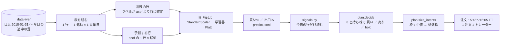
```mermaid
flowchart LR
  D[("data-live/<br/>日足 2018-01-31 〜 今日の途中の足")] --> T["表を組む<br/>1 行 ＝ 1 銘柄 × 1 営業日"]
  T --> TR["訓練の行<br/>ラベルが asof より前に確定"]
  T --> TE["予測する行<br/>asof の 1 行 × 銘柄"]
  TR --> F["fit（毎日）<br/>StandardScaler → 学習器 → Platt"]
  TE --> F
  F --> P["買い% ／ 出口%<br/>predict.jsonl"]
  P --> S["signals.py<br/>今日の行だけ読む"]
  S --> DC["plan.decide<br/>θ と持ち株で 買い ／ 売り ／ hold"]
  DC --> SZ["plan.size_intents<br/>枠 ÷ 中値 → 整数株"]
  SZ --> O["注文 15:45〜16:05 ET<br/>1 注文 1 トレーダー"]
```

**いつ**（平日。時刻は ET。【実測 2026-09-23 titan ＝ §1】）

| 時刻 | 何が起きる | 学習・入力・出力 |
| --- | --- | --- |
| 09:00 | `run-live.sh --prepare`（日足 ＋ 外部系列 約 2 分 → 紙上の対照） | データを揃えるだけ。学習も予測もしない |
| 15:50:00 | `--wait` が明ける → 日足の更新 55 秒 | 末尾に**今日の途中の足**（終値の代役）が入る |
| 15:50:55 〜 15:51:38 | `cli.predict` × 3（並列 43 秒。13500t は 48 秒） | ⚠ **ここで学習 ＋ 予測**。重みは保存せず、毎回 2018-01-31 から fit し直す（訓練と推論を分けない ＝ (a) の B7） |
| 15:51:39 〜 15:51:49 | `run_day.py`（10 秒） | 買い% → 意図 → 注文 → 約定の確認 → 売買履歴 |
| 翌朝 | `--prepare` の `paper.py` | 公式終値で紙上の対照（差 3）。予測には使わない |

**入力の形式**（1 行 ＝ 1 銘柄 × 1 営業日。元は `data-live/adjusted/d/<銘柄>.csv` ＝ `time_ms`・`open`・`high`・`low`・`close`・`volume`・分割だけ調整）

| | T1 `trade_own_ridge_a` | T2 `trade_ownex_lgbm_a` | T3 `trade_ownseq_ridge_a`（T3 QUANT〔60日窓〕） |
| --- | --- | --- | --- |
| 列 | `own_` 35（`ail/features/own.py`） | 124 ＝ own 35 ＋ cs 26 ＋ rel 13 ＋ ex 50（`cross.py`・`relative.py`・`exog_live`） | 表は 95（own 35 ＋ `own_seq60_r0..r59`）。⚠ 使うのは 60 日の道筋だけ → QUANT の変換で 653 列 |
| 観測期間（過去何日を見るか） | 最長 60 日 | own 60・rel 60・ex は前日差と 20 日 z | 60 日 |
| 株の外の系列 | 無し | ECB 為替 7・米国債 7・NOAA 9・USGS 2 を 1 日ずらし（前の値の引き継ぎは 7 日まで） | 無し |
| 予測する銘柄 | us63 の 63 | 会社株 48（ETF は材料にだけ使う） | 63 |
| 前処理 | StandardScaler（訓練で fit）・inf → NaN → 落とす | 同左。⚠ ex_ が古いと 48 本とも落ちて `predict` が失敗 → その回の執行器は起きない（T1・T3 も） | QUANT の変換（訓練で fit）→ StandardScaler |
| ラベル y（訓練だけ） | 1 日先（horizon 1）の終値との対数リターン | 同左 | 同左 |
| 訓練の範囲 | 2018-01-31 〜 asof の 2 営業日前（`label_end < asof`。前の営業日の行はラベルが今日の終値を含むので入れない） | 同左 | 同左 |
| asof 2026-09-22 の実測【13500t 2026-09-23】 | 訓練 136,529 行・予測 63 行・表 38.4 秒 ＋ fit 0.2 秒 | 101,589 行・48 行・40.5 ＋ 2.0 秒 | 136,529 行・63 行・38.9 ＋ 6.2 秒 |

**出力の形式**（`out/<日付>/predict-<時刻>.jsonl`。2026-09-21 から中身は `live.sqlite`。1 行 1 銘柄 × モデル ＝ 63 ＋ 48 ＋ 63 ＝ 174 行）

| 項目 | 型 | 意味 |
| --- | --- | --- |
| `date` | `YYYY-MM-DD` | asof（予測した日 ＝ 今日）。⚠ 執行器は今日と違う行を読まない（古い予測で売買しない） |
| `model` ／ `method` | 文字列 | 実験名 ／ 数字の選び方・作り方の登録名。⚠ トレーダー設定の `[[models]]` の `name` ／ `method` と突き合わせ、違えば止まる |
| `symbol` | 文字列 | 銘柄 |
| `buy` ／ `exit` | 0〜100 の実数（小数 6 桁） | 買い%（Platt 較正を通した「1 日先に上がる」の見込み）／ 出口% ＝ 100 − 買い% |
| `proxy_close` ／ `proxy` | 実数 ／ 真偽 | その日の終値の代役に使った値（15:50 の途中の足）／ `--proxy` で上書き・追加した足か |
| `input_fingerprint` ／ `commit` | 16 進 16 桁 ／ 7 桁 | 訓練と予測の入力の指紋（⚠ CPU で変わる ＝ §0-12。比べるのは判定）／ コードの commit |

```json
{"date": "2026-09-22", "model": "trade_own_ridge_a", "method": "全部使う（基準）", "symbol": "NKE", "buy": 50.326527, "exit": 49.673473, "proxy_close": 36.0816, "proxy": false, "input_fingerprint": "67a353b73999ac5e", "commit": "789b3dd"}
```

予測の記録 `predict.meta.jsonl`（1 モデル 1 行）: `experiment`・`method`・`asof`・`table`・`layer`・`form`・`seed`・`calibration`（較正の版）・`features`（列数 35 ／ 124 ／ 95）・`input_fingerprint`・`commit`・`data_dir`・`train_rows`・`train_start`・`train_end`・`test_rows`・`dropped_symbols_nan_features`・`horizon`・`proxy_symbols`・`fitted`（較正の係数など、学んだ中身の控え）・`seconds`（`table` ／ `fit_predict`）・`log`。

**トレーダーの使い方**（`run_day.py` → `signals.py` → `plan.py`。数字は 2026-09-23 の本番【実測 ＝ §1】）

| 段 | 規則 | 記録 | 9/23 の例 |
| --- | --- | --- | --- |
| 合図 | `signals.py` が今日の日付の行だけ読み、トレーダーの `[[models]]` ごとに (買い%, 出口%) を集める。⚠ 無い銘柄は「合図なし」 | `signals.jsonl` ＝ `date`・`env`・`run_id`・`trader`・`symbol`・`buy`・`exit`・`inputs`〔[モデル名, 買い%, 出口%] の一覧〕・`position_before`・`test` | T1 T 50.93 ／ T2 5 銘柄とも 49.67 ／ T3 BAC 50.97 |
| 合成 | `combine`（`asis` ／ `mean` ／ `majority` ／ `unanimous`）。3 人とも `asis` ＝ 1 本のモデルの値がそのまま合図 | 同上 | — |
| 決める（`plan.decide`） | 持ち株 0 ＆ 買い% > θ → **買い** ／ 持ち株 1 ＆ 出口% > θ（⇔ 買い% < 100 − θ）→ **売り** ／ それ以外 → 持っていれば `hold`・いなければ `skip`。不等号は厳密 | `events.jsonl` の `hold` ／ `skip`（買い% ・ 出口% つき） | T1・T3（θ 50）は 5 銘柄とも買い ／ T2（θ 55）は 5 銘柄とも `skip` |
| 大きさ（`plan.size_intents`） | 1 銘柄の枠 ＝ min(予算 ÷ 銘柄数, 空き)。`shares` なら 枠 ÷ 気配の中値 を整数に切り捨て（1 株に満たなければ `too_small`）。空き ＝ 予算 − 建玉の取得原価 − 受渡し待ち。1 日の上限（全トレーダーで 1 つ）も見る。⚠ 買い% の高さで金額を変えない | `orders.jsonl` の `parts`〔トレーダー・株数・金額〕 | 枠 $60 ÷ 中値 25.335（T）→ 2 株 ／ 35.765（NKE）→ 1 株 |
| 注文（`execute.py`） | 1 注文 1 トレーダー（合算しない）。売りが先。成行。窓 15:45〜16:05 ET。① 全部 控え → dry-run → 発注 ／ ② 1 本ずつ約定を確かめて売買履歴へ | `orders.jsonl`（`quote_at_signal`・`fills`・`amounts`）・`state/<env>/<名前>.json` | 10 本 Filled・発注 → 約定 0.11〜0.16 秒 |
| 持ち株の出口 | 次の日以降、出口% > θ になった日に売る（1 日 1 回なので同日の往復は起きない ＝ §0-9 の前段） | 同上 | — |

⚠ **読み違えやすい所**: (1) 「完成したモデル」＝ 作り方（実験名 ＋ 数字の選び方）。重みは毎日変わる（`predict.meta` の `fitted` が控え）。(2) 入力の最後の行は**終値ではなく 15:50 の途中の足**なので、翌朝の公式終値で出し直すと買い% は少し動く（9/22: 15:14 ET の足と 16:01 ET の足で T1 PFE が 0.175 ずれた ＝ §0-13 の合否 ②）。(3) 出力は「上がる確率」の較正値で、大きさの予測ではない。売買の金額も買い% に比例しない。

### 0-10. 紙上の対照 — `paper.py` と `out/daily.csv`（Phase 3。2026-09-20。利用者決定 D5「できるものはすぐにやる」で前倒し）

> この図の主張: 紙上の対照は執行器の記録と公式終値を読むだけの後処理で、朝の準備のたびに全部作り直す。管理画面はその表を写すだけ。

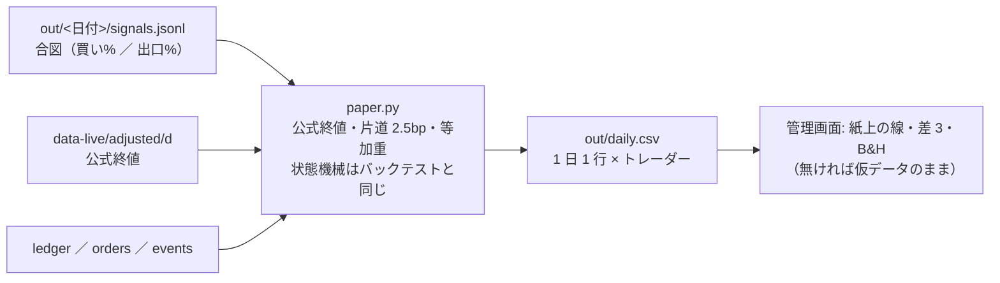
```mermaid
flowchart LR
  S["out/<日付>/signals.jsonl<br/>合図（買い% ／ 出口%）"] --> P["paper.py<br/>公式終値・片道 2.5bp・等加重<br/>状態機械はバックテストと同じ"]
  C["data-live/adjusted/d<br/>公式終値"] --> P
  L["ledger ／ orders ／ events"] --> P
  P --> D["out/daily.csv<br/>1 日 1 行 × トレーダー"]
  D --> V["管理画面: 紙上の線・差 3・B&H<br/>（無ければ仮データのまま）"]
```

| 決めごと | 中身 |
| --- | --- |
| いつ作るか | `run-live.sh --prepare`（朝）が日足の更新の後に流す。⚠ **毎回ぜんぶ作り直す**（何度流しても同じ）。その日の行は、翌朝に公式終値が入ってから確定する |
| 紙上の執行 | 未保有で 買い% > θ なら建てる ／ 保有中で 出口% > θ なら手仕舞う ／ その日の公式終値で執行 ／ 建てた日と手仕舞った日にだけ片道 2.5bp ／ 銘柄は等加重（予算 ÷ 銘柄数）。`ail/validation/simulate.py` と同じ規則で、テストが同じ数字になることを確かめる。⚠ fold 末尾の強制清算だけは無い |
| 日付 d の行 | 前の営業日の終値 → d の終値に、d の売買の**前**から持っていた分が稼いだもの − d の売買のコスト。紙上も実物も同じ数え方。bp はその人の予算に対して |
| 実物 | 売買履歴（`ledger.jsonl` の d の最後の行）を d の公式終値で値洗い ＝ 実現損益 ＋ Σ 株数 ×（終値 − 取得単価）− 手数料、の前日差 |
| 差 3 | 累計 ＝ 紙上の累計 − 実物の累計（常に成り立つ）。日次はその前日差。売買履歴の無い日（起動しなかった日）は空で、次に売買履歴が出た日にまとめて入る |
| B&H | その人の銘柄を最初の日に全部買って持ち続ける（片道 2.5bp を 1 回）。⚠ 紙上だけ |
| 差 1・差 2・差 4 | 差 1 ＝ 気配の中値 → 約定・約定 → 公式終値（bp。正 ＝ 不利。その日の中央値）／ 差 2 ＝ 合図時のスプレッドの半分（bp）と手数料（$。⚠ dry-run の見積り）／ 差 4 ＝ 再送・認証・HALT・窓の外・未解決の控え・口座が少ない銘柄・売買履歴の食い違いの件数 |
| 説明できる差 | `unexecuted` ＝ 紙上は売買したのに実物は見送った ／ 約定しなかった数（`over_budget`・`too_small`・`no_quote`・`blocked_symbol`・未約定）。`close_missing` ＝ 終値が無かった銘柄 |
| モック ／ シミュレーション | 公式終値が無いので `--close-from quotes`（合図時の気配の中値を終値の代役に）。⚠ 「約定 → 終値」は意味を持たない。画面に「終値は気配の代役」の印 |
| そろえた紙上（2026-10-08） | 今までの列はそのまま残し、横に `aligned_since` ／ `aligned_held` ／ `aligned_trades` ／ `aligned_bp` ／ `aligned_cum_bp` ／ `diff3a_bp` ／ `diff3a_cum_bp`。① 期間 ＝ 発注の回（`start` が submit・拒否の事象なし）でその人の合図を読んだ最初の日に開き、`liquidate_complete` の日に閉じる（次は現金から）② 量 ＝ その日の公式終値で floor(min(予算 ÷ 銘柄数, 空き) ÷ 終値) 株（`sizing = "notional"` はセント切り捨ての金額）③ 発注の回が無い日・`paused`・`over_total_budget` は売買しない・`liquidate_flag` は終値で全部売る。bp は USD の損益 ÷ 予算・累計は期間ごと。⚠ 実物は 15:50 の気配で株数を数える（まれに 1 株ずれる）・受渡し待ちは見ない。管理画面の差 3 は、この列があればこちら（無ければ今までどおり）。プランは `docs/plans/paper-align.md` |
| ⚠ 限界 | 紙上は予算・整数株・受渡し待ち・拒否を知らない（整数株の人は枠を使い切れないぶんだけ実物の動きが小さい）／ 配当落ちの日は終値の尺度（調整済み）と実物がずれる ／ 1 日に何度も売買する形（TODO の G24）では数え方を決め直す |

```bash
cd experiments/live-trading; PY=../tastytrade-api-sample/.venv/bin/python
$PY paper.py                                          # out/ の全日付 → out/daily.csv
$PY paper.py --out-dir <sim の out> --close-from quotes   # モック ／ シミュレーション
```

### 0-11. 記録の置き場 — DB（2026-09-21。利用者の指示「本番投入前に進めて、明日テストする」）

⚠ **道（`out/<日付>/*.jsonl`・`state/<env>/<名前>.json`・`journal.jsonl`・`reconcile.log`・`daily.csv`）はそのままで、中身は DB**。部品は `experiments/tastytrade-api-sample/livefs.py`（プラン [db-model-facts.md §11](../../plans/archive/db-model-facts.md)）。

> この図の主張: 執行器の段取り（控え → 発注 → 約定 → 売買履歴）は変えず、書く先だけが DB になった。止める・切り替える仕組みはファイルのまま。

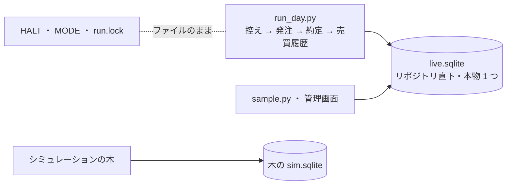
```mermaid
flowchart LR
  E["run_day.py<br/>控え → 発注 → 約定 → 売買履歴"] --> L[("live.sqlite<br/>リポジトリ直下・本物 1 つ")]
  S["sample.py ・ 管理画面"] --> L
  X["シミュレーションの木"] --> SS[("木の sim.sqlite")]
  H["HALT ・ MODE ・ run.lock"] -. "ファイルのまま" .- E
```

| 決めたこと | 形 |
| --- | --- |
| 本物 | リポジトリ直下の `live.sqlite` 1 つ（執行器 ＋ API 検証 ＋ 管理画面。利用者の裁定）。入れてよい置き場は決まっている（ほかの道は止まる） |
| 行の記録（`*.jsonl`・`*.log`） | 1 行 1 行・元の文字のまま・⚠ 足すだけ（書き換え・削除はトリガーが拒む）。控え（`journal.jsonl`）は 1 行ずつ DB のトランザクションで書き終えてから発注する（いままでの fsync と同じ役） |
| 丸ごと（売買履歴・`daily.csv`） | 1 つのトランザクションで書き換える（前の中身は `docs_history` に残る） |
| 予測 | `run-live.sh` が回ごとに `out/<日付>/predict-<時刻>.jsonl` に入れて執行器に渡す（⚠ 行は足すだけなので、同じ道に 2 回入れると前の回の行が残る ＝ 回ごとに別の道） |
| 控え（`state-backup/`） | submit の回の前に `livefs.py export state` で、いままでと同じファイルの形に書き出す（戻し方は変わらない） |
| 読み | ⚠ 執行器は、どの DB にも当たらない道を読むと止まる（「何も持っていない」と読んで買い直さない）。管理画面は無くても落とさない |
| シミュレーション ／ テスト | 木の `sim.sqlite` ／ 一時置き場の DB。⚠ 本物の `live.sqlite` に落ちない（どの DB にも当たらない道は止まる） |
| 見る | `livefs.py ls|cat <道>`・`dump <DB のあるディレクトリ>`（秘密の grep）・`stats`・`export <道> --to <置き場>` |

【実測 2026-09-21 夜】: いままでのファイル 93（実売買の記録 17・売買履歴と控え 5・API 検証 65・管理画面の監視 6）を取り込み、**一致 93 ／ 93**。`reconcile.py show`（prod ／ cert）は `test_a` だけ・建玉なし・控えの未完 0。`run-live.sh --date 2026-09-18 --mode plan`（作業用の置き場）で予測 → 執行器 → 記録が DB の上で通った（T1 4 ・ T3 5 の買いの計画・T2 は 0・40 秒）。`mockrun.sh` 通過・`sim2` 64 日 18 秒（いままで 約 8 秒 ＝ 1 行ごとに書き終えるため）・`selftest.sh` 通過・執行器の pytest 142 本・管理画面 222 本。
⚠ **いままでのファイルはまだ消していない**（2026-09-22 の本番投入が新しい作りで済むまで、`acc5f9f` に戻すときの足場）。

**✅ 2026-09-22 の通しテスト（本番投入の前・⚠ 戻す必要なし）**【実測 11:33〜11:58 PDT】: cert の `test_a` を往復（買い 1665665 @ $25.08 ／ 売り 1665671 @ $25.07・どちらも `Filled`）→ 控え（`intent` → `submitted` → `done` が 2 組とも閉じた）・売買履歴（持ち株 0・履歴 4 行）・記録（`orders.jsonl` 2 行）が DB の上で通った ／ `reconcile.py --env cert show` ＝ 差 0・控えの未完 0 ／ `paper.py` → `daily.csv` 5 行 ／ 管理画面（3012）の 7 ページ ＋ `/api/live` が 200・`mode: real`・今日の起動が出る ／ 秘密の grep ＝ `.env` の 7 項目のどれも `livefs.py dump` に現れない・`Bearer` 0 件・口座番号 50 か所ともマスク済み（⚠ `refresh_token_rotated` 88 件はイベント名で値ではない）。
⚠ **429 は本番前にもう 1 度出た**: 買いの約定確認の照会が 429 → 待って取り直して `Filled` を読めた（`transitions` の `poll retry:429`）＝ 9/21 に直した穴（§1 の (1)）が効いている。
✅ **前営業日の注文は注文番号で読める**【実測】: cert の 1663195（`Filled` 1 株 $25.59）・1663301（`Filled` 1 株 $25.55）＝ 控えからの復元（§0-8 の段 1）が成立する。日をまたいだ未完を人が閉じる形に落とさなくてよい。

### 0-12. 13500T で予測にかかる時間（2026-09-22 夜。[プラン](../../plans/archive/predict-timing-13500t.md)）

**判定: 間に合う**（プラン §2-3 の線 ＝ 温まった状態の中央値が 60 秒以下）。13500T は予測を 3 本並列で **約 48 秒**で済ませた（titan は約 37 秒。約 1.3 倍かかる）。売買の判定は 2 台で 1 銘柄も変わらなかった。⚠ 判定したのは**予測の時間だけ**。13500T に売買を移すかどうかは TODO「13500T に管理画面と毎日の売買を動かす環境を作る」の「決めること」で、まだ決まっていない。

> この図の主張: 準備の見積り 120 秒のうち、予測に使えるのは 65 秒。13500T の予測はその中に 15 秒ほどの余裕を残して収まる。

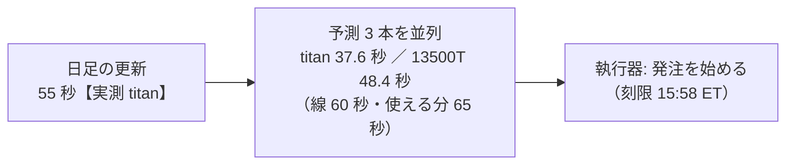
```mermaid
flowchart LR
  A["日足の更新<br/>55 秒【実測 titan】"] --> B["予測 3 本を並列<br/>titan 37.6 秒 ／ 13500T 48.4 秒<br/>（線 60 秒・使える分 65 秒）"]
  B --> C["執行器: 発注を始める<br/>（刻限 15:58 ET）"]
```

同じ入力（titan の `data-live/` のスナップショット。63 銘柄・足は 2026-09-22 の途中まで・sha256 `863f95b7…`）で、同じスクリプト（`bench_predict.py --asof 2026-09-18,2026-09-22 --repeat 6`）を流した。1 回目は numba のキャッシュを空にした冷えた状態。

| 機械 | asof | 冷えた状態（1 回目） | 温まった状態（2〜6 回目の中央値） | 最小〜最大 |
| --- | --- | --- | --- | --- |
| titan | 2026-09-18 | 39.46 秒 | **37.41 秒** | 36.67〜37.92 |
| titan | 2026-09-22 | 37.62 秒 | **37.60 秒** | 37.31〜38.66 |
| 13500T | 2026-09-18 | 45.38 秒 | **47.93 秒** | 47.70〜49.78 |
| 13500T | 2026-09-22 | 49.50 秒 | **48.41 秒** | 47.68〜49.91 |

【実測】titan は 2026-09-22 20:01〜20:09 PDT、13500T は同日 20:37〜20:47 PDT。12 回とも `ok`。

✅ **2026-10-04 追記 — 入れ替え後の 3 人（`T1`・`T4`・`T6` ＝ 予測 4 本: `trade_own_ridge_a`・`trade_ownex_lgbm_a`・`trade_ownseq_ridge_a`・`sel_small4_1995`）を 13500t で測った**（同じ器 `trade-predict-bench`・同じ日足の写し・`--repeat 4`。20:46〜20:54 PDT・`HALT` 中・売買の cron なし）【実測】:

| asof | 冷えた状態（1 回目） | 温まった状態（2〜4 回目の中央値） | 最小〜最大 |
| --- | --- | --- | --- |
| 2026-09-18 | 49.09 秒 | **52.59 秒** | 52.50〜53.28 |
| 2026-09-22 | 52.55 秒 | **52.42 秒** | 52.19〜52.74 |

**判定: 間に合う**（線 60 秒。余裕は約 7 秒 ＝ 3 本のときの 12 秒から縮んだ）。4 本のうち `trade_own_ridge_a` だけ 47 秒で終わり、ほかの 3 本（LightGBM・QUANT・F2-2 RFE）が 52 秒台で並ぶ ＝ 差は表づくりと CPU の取り合い【推測】。⚠ 5 本目を足すときは測り直す（線を割る可能性）。

| 機械 | CPU | メモリ | 動かし方 | 同時に動いていたもの |
| --- | --- | --- | --- | --- |
| titan | AMD Ryzen 9 7950X（32 論理・AVX-512 あり） | 47 GiB | WSL2・コンテナ無し・Python 3.12.3 | — |
| 13500T | Intel Core i5-13500T（20 論理・AVX-512 なし） | 30.6 GiB | Docker の使い捨てコンテナ（`python:3.12-slim`・Python 3.12.14・ネットワーク無し） | cloudflared だけ（計測の前は負荷 0.00） |

主要パッケージの版は 2 台とも同じ（numpy 2.4.2 ／ pandas 2.3.3 ／ sklearn 1.7.2 ／ lightgbm 4.7.0 ／ numba 0.67.0 ／ aeon 1.5.0）。⚠ **コンテナの有無と OS が違う ＝ 同じ土俵ではない**（差のうちどれだけがコンテナの分かは分けていない）。

内訳（温まった状態の中央値【実測】）: 差はほとんど**表づくり**に出る。

| 予測モデル | 表づくり titan ／ 13500T | 学習と予測 titan ／ 13500T |
| --- | --- | --- |
| `trade_own_ridge_a`（T1） | 32.5 ／ 41.8 秒 | 0.12 ／ 0.14 秒 |
| `trade_ownex_lgbm_a`（T2） | 34.7 ／ 44.0 秒 | 1.34 ／ 2.33 秒 |
| `trade_ownseq_ridge_a`（T3 QUANT（60日窓）） | 32.9 ／ 41.9 秒 | 2.69 ／ 4.04 秒 |

- **冷えた状態の上乗せは無い**（13500T の 1 回目は温まった状態より速いか 1 秒以内）＝ §2-3 の「30 秒以上遅ければ 1 回目で線を引き直す」に当たらない
- **売買の判定は 2 台で一致**（`--compare` の rc=0）。T1・T2 の買い% ／ 出口% は小数 6 桁まで同じ。T3 だけ最大 0.003 ずれたが、売買基準値をまたいだ銘柄は無い（⚠ asof 2026-09-22 の CAT は θ=50 と 0.0006 差だったが、動いたのは T1 で、T1 は差 0）
- ⚠ **入力の指紋（`input_fingerprint`）は 2 台で違う**（例 T1 `ac70e2df…` ／ `3da4bdb1…`。各機械の中では 12 回とも同じ）。Sx360（Intel i7-1355U・AVX-512 なし・コンテナ無し・PDT）で T1 を流すと、時刻帯を PDT にしても UTC にしても **13500T と同じ `3da4bdb1…`** になった【実測】＝ 時刻帯・コンテナ・Python の版のせいではない。⚠ 原因は **CPU の命令（titan だけ AVX-512 を持つ）で、表の浮動小数の最後の桁が変わること**【推測】（表そのものの差分はまだ取っていない）。⚠ **機械を替えると指紋は変わるものとして扱う**（指紋で「同じ入力か」を機械をまたいで確かめない）
- ⚠ **余裕は 15 秒ほど**。表づくりは銘柄数と日数に比例して延びる【推測】ので、銘柄を増やす・観測期間を延ばすときは測り直す
- 13500T には tastytrade の `.env` も `live.sqlite` も無いことを最後に確かめた。結果の JSONL は git 管理外（titan ／ 13500T ／ Sx360 の `~/ail-bench/`）

### 0-13. 本番の機械（13500t）の器 — デプロイ契約（正本。2026-09-22 夜。[プラン](../../plans/archive/three-machines.md) Phase 2）

g3plus-ops 側の `trade-runner/`（旧 `ail-live/`。2026-09-24 に改名 ＝ g3plus-ops `a048b16`）（毎日の売買）・`auto-update.sh`・13500t の host cron はここに従う。契約が変わったらあちらを追従させる（管理画面は [dashboard.md §7](../dashboard.md) の「13500t のローカル面」）。⚠ **デプロイ設定・ホスト名・Tunnel は g3plus-ops 側にだけ書く**。⚠ **Phase 2 では発注しない**（発注の許可は切り替え ＝ Phase 4 で利用者が置く）。

> この図の主張: コンテナは使い捨てで、記録・日足・許可・排他のファイルは全部ホストの clone の中にある ＝ コンテナを作り直しても何も失わない。

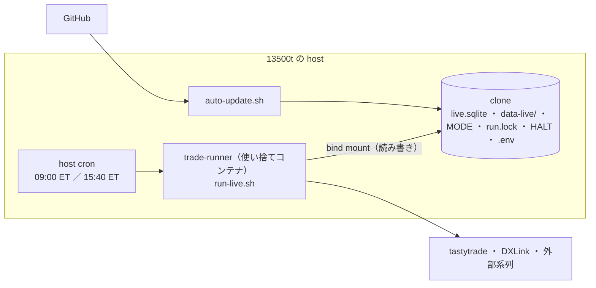
```mermaid
flowchart LR
  subgraph H["13500t の host"]
    CRON["host cron<br/>09:00 ET ／ 15:40 ET"] --> RUN["trade-runner（使い捨てコンテナ）<br/>run-live.sh"]
    AU["auto-update.sh"] --> CL
    CL[("clone<br/>live.sqlite ・ data-live/ ・ MODE ・ run.lock ・ HALT ・ .env")]
    RUN -- "bind mount（読み書き）" --> CL
  end
  G[GitHub] --> AU
  RUN --> TT["tastytrade ・ DXLink ・ 外部系列"]
```

| 項目 | 値 |
| --- | --- |
| 置き場 | 13500t の host に**このリポジトリの clone を 1 つ**（public なので `git clone`）。⚠ **コンテナには COPY せず bind mount（読み書き）** ＝ 本物の記録 `live.sqlite`（リポジトリ直下）・`experiments/feature-discovery/data-live/`・`experiments/live-trading/{MODE,run.lock,mode.log,state-backup/}`・`experiments/tastytrade-api-sample/out/HALT`・資格情報 `.env` が全部 clone の中の決まった道にある（§0-11。道を変えると `livefs` の「本物に入れてよい置き場」から外れて止まる） |
| ベース | `python:3.12-slim`（`ail-predict-bench` と同じ。13500t の予測 48 秒は この形の【実測】＝ §0-12） |
| 依存 | `experiments/feature-discovery/requirements.txt` ＋ `requirements-nodeps.txt`（`--no-deps`）＋ `experiments/tastytrade-api-sample/requirements.txt`。⚠ `torch` は今日の買い% の経路（T1〜T3）では import されない【実測 titan 2026-09-22 ＝ `-X importtime` に出ない】＝ 入れるなら CPU 版で足りる。版は requirements の固定のまま（2 台で売買の判定が一致した組 ＝ §0-12） |
| python の道 | ⚠ **`run-live.sh`・`live_update.sh` は `experiments/feature-discovery/.venv/bin/python` と `experiments/tastytrade-api-sample/.venv/bin/python` を決め打ち**で読む ＝ コンテナの中でこの 2 つの道が動くこと。推す形: image の venv を `/opt/venv` に作り、clone の 2 つの `.venv` を `/opt/venv` への symlink にする（どちらも git 管理外。host では宙に浮くが host では使わない）。⚠ **`.gitignore` の `.venv/` はディレクトリにしか当たらず symlink は未追跡に見える** ＝ 13500t の clone の `.git/info/exclude` に `.venv` を足す（無いと auto-update の ④「汚れている」で止まり続ける。2026-09-22 夜 Step 2-2 で踏んだ）。`dashboard/.venv` も同じ symlink |
| uid | ⚠ **コンテナはホストの clone の持ち主と同じ uid:gid で動かす**（root で書くと `live.sqlite`・`data-live/` が root の持ち物になり、auto-update の `git pull` と次の起動が壊れる） |
| TZ | コンテナ・host cron とも時刻は **ET で決める**（`run-live.sh` は中で `TZ=America/New_York` を使う。host cron の TZ が PDT なら 06:00 ／ 12:40 に読み替える。⚠ 夏時間の切り替えで両方が同じだけずれることを確かめる） |
| 起動 | 朝 ＝ `./run-live.sh --prepare`（平日 09:00 ET）／ 売買 ＝ `./run-live.sh --traders T1,T2,T3 --mode <MODE> --wait -- --env prod <追加>`（平日 15:40 ET）。`experiments/live-trading/systemd/` の雛形と同じ時刻・同じ引数（中身は `live.env` の `AIL_LIVE_*`） |
| Phase 2 の `MODE` | ⚠ **`plan` か `dry-run` だけ**（本番の dry-run には `--allow-prod-dry-run` と `TT_ALLOW_PROD_DRY_RUN=1`）。⚠ **`TT_ALLOW_PROD_ORDERS` と `--i-know-this-is-real-money` は置かない**（Phase 4 で利用者が置く。§0-2 の許可の 3 段は変えない） |
| 機械のモード | ⚠ **13500t は常に `real`**（シミュレーションは Sx360 ＝ K9）。`experiments/live-trading/MODE` を置かない ＝ 既定の `real` |
| 資格情報 | `experiments/tastytrade-api-sample/.env`（⚠ **置くのは利用者**・git 管理外・image に焼かない） |
| 外向き通信 | ⚠ **ネットワーク無しでは動かない**（`ail-predict-bench` と違う）。`api.tastyworks.com`・`streamer.tastyworks.com`・`*.dxfeed.com`（日足 ＝ DXLink）・外部系列の取得先（`exog_live` ＝ 為替・金利・気象・地震の公開 API） |
| 排他 | `run.lock`（flock）はホストの clone の中のファイル ＝ ⚠ **同じ clone を mount するコンテナどうしでしか効かない**。13500t の中で執行器を 2 つの置き場から起こさない。⚠ **titan との二重発注は防げない**（K4 ＝ Phase 3 の「本番の機械ではない」印） |
| auto-update | 13500t が GitHub の **`prod`** を pull（K2。⚠ 2026-09-25 から `main` ではない ＝ [プラン](../../plans/archive/prod-branch.md)。`prod` を進めるのは `run-deploy.sh` だけ・fast-forward だけ。clone の HEAD が `origin/prod` の祖先でなければ何もせず ERROR）。⚠ **pull しないとき**: ① 売買の時間帯（15:30〜16:15 ET）② `run.lock` が取れない（`flock -n` で確かめてすぐ放す）③ `HALT` がある ④ 作業ツリーが汚れている（`git status --porcelain` が空でない）。pull は `--ff-only`。⚠ **`prod` を進める ＝ 次の pull から本番に反映**（`main` への push では動かない） |
| healthcheck | 常駐しない（使い捨て）ので無し。代わりに `run-live.sh` の rc を host の log に残す（rc の意味は `run-live.sh` の頭の注記: 5 ＝ sim ／ 6 ＝ 二重起動 ／ 11 ＝ 引けに間に合わない） |

**Phase 2 の合否**（プラン §6）: ① コンテナで `./run-tests.sh --fast` が通る ② titan と同じ `data-live/` の写しで `--date <過去の日> --mode plan -- --ignore-window` が**同じ売買の判定**を出す（⚠ 入力の指紋は CPU で変わる ＝ §0-12。比べるのは判定）③ 本番の dry-run が通り、何もルーティングされない ④ 市場時間中の `live_update.sh` の所要時間（titan 54〜55 秒【実測】）＋ 予測 48 秒【実測】が準備の見積り 120 秒に収まる ⑤ 13500t の `live.sqlite` の `livefs.py dump` に `.env` の値が 0 件。
⚠ **Phase 2 の間に 13500t の `live.sqlite` に入る記録は dry-run ／ plan のものだけ**。切り替え（Phase 3・K6）で titan の `live.sqlite` を持ってくるときは、上書きせず `live.sqlite.phase2-<日付>` に名前を変えて脇へ退ける（1 つの口座の記録は 1 か所）。

**合否の結果**（✅ **①〜⑤ 全部 ✅ ＝ Phase 2 済み（2026-09-24 12:55 PDT・Sx360 の Claude）**。[プラン](../../plans/archive/three-machines.md) の「2-3 の手順」の順 0〜8。→ Phase 3 は titan の Claude が 9/24 に済ませ、次は Phase 4 の切り替え〔利用者・週末〕）

前提の確認【実測 2026-09-23 夜 PDT】: 順 0 ＝ 3 台とも `dbde869`（13500t の auto-update が 19:45:02 に pull・管理画面を起こし直して `done`）／ 順 1 ＝ 利用者が titan の `.env` を 13500t へ（600・1,478 バイト ＝ titan と同じ・`git status --porcelain` は空のまま）／ 順 2 ＝ clone の `data-live/` は bench の写しと `diff -rq` で一致・tar の sha256 `863f95b7…` OK・`seed.json` あり・63 銘柄。

| 合否 | 結果 | 実測 |
| --- | --- | --- |
| ① tests | ✅（2026-09-22 夜） | コンテナで `run-tests.sh --fast` 通過（執行器 ✅・管理画面 231 passed ／ 2 skipped。イメージを 2 か所直した ＝ [TODO](../../../TODO.md) の Step 2-3 の記録） |
| ② 同じ判定 | ✅ 2026-09-23 22:58 ET | 13500t のコンテナで `./run-live.sh --traders T1,T2,T3 --date 2026-09-22 --mode plan -- --env prod --ignore-window`（plan は許可なしで認証して口座を読む）＝ **49 秒**（予測 3 本並列 48 秒 ＋ 執行器 1 秒）・rc=0。合図 15 → 意図 10（T1 5 ・ T3 5 ・ T2 は 5 銘柄とも 50.4155 < θ 55 で `skip`）→ planned 10（T 2 ・ PFE 2 ・ NKE 1 ・ VZ 1 ・ BAC 1 × 2 人・`day_spent` $491.66）。⚠ **買い% の突き合わせ相手は bench の 9/22**（同じ写し `data-live-20260922-2000` から出し、titan と最大の差 0 で一致済み ＝ §0-12）: **15 行とも差 0.000000**（`buy + exit = 100` も 15 行とも）。titan の `out/2026-09-22/signals.jsonl` に T1〜T3 の行は無い（15:14 ET の本番 dry-run が `out_of_window`）ので、残っている 15:14 ET の予測と比べると最大 0.175（T1 PFE）ずれるが、これは titan が **15:14 ET の途中の足**（T 25.03 ・ PFE 27.85 ・ BAC 56.4686）で計算し、写しには **16:01 ET の足**（T 25.12 ・ PFE 27.925 ・ BAC 56.21）が入っているため。**判定（買い ／ skip）は 15 行とも同じ**。T2 は足に依らず 50.415522 で 3 者とも一致。口座の 9/23 の持ち株（T 4 ・ PFE 4 ・ NKE 2 ・ VZ 2 ・ BAC 2）は `positions_outside_ledger`（口座のほうが多い ＝ 売買履歴の外）として記録され売買は続いた ＝ 期待どおり。`state/` は作られていない（plan は状態を書かない）。13500t の `live.sqlite` はこの plan で初めてでき（19:59 PDT・151,552 バイト）、中身は plan の記録だけ |
| ③ 本番 dry-run | ✅ 2026-09-24 11:04 ET | 13500t のコンテナで `TT_ALLOW_PROD_DRY_RUN=1 … ./run-live.sh --traders T1,T2,T3 --mode dry-run -- --env prod --allow-prod-dry-run --ignore-window`（Sx360 の Claude が手で 1 回）。rc=0・106 秒。合図 15 → 意図 10 → 注文 10 が **全行 `mode: dry-run`・`submitted` 無し・`final_status: dry-run`・error 0**。買付余力の効果 **$35.65〜$57.44**（T 2 株 $51.38 ／ PFE 2 株 $57.44 ／ NKE 1 株 $35.65 ／ VZ 1 株 $47.43 ／ BAC 1 株 $55.95 × T1・T3）・dry-run 1 本 197〜304 ms・T2 は 5 銘柄とも `skip`・口座の持ち株は `positions_outside_ledger`・`state/` は作られていない。⚠ この日の 13500t の日足は 11:04 ET の途中の足なので、買い% は titan の 15:50 ET の値とは別物（比べない） |
| ④ 市場時間中の所要 | ✅ 2026-09-24（手動の回 ＋ cron の回） | **cron の回（無人）**: 15:40:01 ET に host cron が起こし `--wait` が 15:50:00 まで待つ → **日足の更新 56 秒**（15:50:56）→ **予測 3 本並列 44 秒**（15:51:40。表 38.0〜40.8 秒 ＋ fit 0.13 ／ 2.0 ／ 3.67 秒）→ 執行器 4 秒 → 15:51:44 `end rc=0` ＝ **15:50 から 100 秒 ≤ 120 秒**。手動の回（11:03〜11:05 ET）も 56 ＋ 45 ＝ 101 秒。titan の 9/23 は 55 ＋ 43 秒・9/24 の timer は 55 ＋ 44 秒。⚠ 9/24 15:50 ET は titan の timer（dry-run）と 13500t の cron（dry-run）が**同じ資格情報で同時に**ログイン・更新・予測・dry-run を通したが、**429 も認証の失敗も無し**（両方 rc=0）|
| ⑤ 秘密の grep | ✅ 2026-09-23 夜 ／ ✅ 2026-09-24 ③ の後にもう一度 | 9/23: `livefs.py dump .`（216 行・75,791 字）に `.env` の **7 項目とも 0 件**（本番 ・ sandbox の client secret 40 字・refresh token 557 ／ 586 字・client id 36 字・口座番号 8 桁・`TT_ENV`）・`eyJ` 0 件・`Bearer` 0 件。9/24（695 行。dry-run と管理画面の監視の記録が増えた後）: **秘密の 6 項目とも 0 件・`eyJ` 0・`Bearer` 0**。`TT_ENV`（＝ `cert`。環境名で秘密ではない）は 388 件当たるが、中身は管理画面の監視の記録の `"env": "cert"`・記録の道 `monitor/tastytrade-cert-<日付>.jsonl`・エラー文の `api.cert.tastyworks.com` ＝ 期待どおり |
| 管理画面（順 7） | ✅ 2026-09-23 20:05 PDT | Sx360 から `./run-dashboard-tunnel.sh --host 13500t.lan --port 3017`。`.env` を置く前は**デモ**（帯「デモ」・`/traders/T1〜T3` は 404 ＝ トレーダーが mock_a〜c）。利用者が `up -d --force-recreate`（⚠ Claude の実行は分類器が「Production Deploy」で止めた）→ healthy・`demo=False` → **9 ページとも 200**（`/` ・ `/overall` ・ `/traders/T1〜T3` ・ `/records` ・ `/judge` ・ `/ops` ・ `/api/live`）・`mode: real`・帯なし・9/22 の plan の起動（合図 15 ・ planned 10 ・ 口座の持ち株 5 銘柄）が出る。dry-run の起動が出ることは 9/24 の ③ の後に見る |

⚠ 順 3 で分かったこと: **plan の突き合わせ相手を「同じ日の titan の合図」にできるのは、titan がその日の合図を写しと同じ足で出しているときだけ**。titan の当日の合図は 15:50 ET の途中の足、写しは引け後の足なので、ふつうは bench（同じ写し）と比べる。

⚠ ③ で気づいたこと（問題ではない）: `.env` を置くと 13500t の管理画面も **API の監視**（cert と prod の認証・口座・DXLink。`dashboard/data/monitor/`）を回し始める ＝ titan と 2 台で同じ資格情報の監視が並ぶ。9/24 08:00 PDT 時点で prod・cert とも認証 OK・`refresh_token_rotated` は 0 行（回っていない）・cert の `refresh_fail` 5 件と `api_error` 67 件は sandbox 側の 502 ／ 400 ／ 500（前からある挙動）。⚠ 切り替え（Phase 4）で titan の管理画面を止めるかは別に決める。


### 0-9. 1 日に複数回の発注に広げるか — ⚠ **広げない**（2026-09-20 利用者決定）

利用者の指示（2026-09-20）: **「1 日に複数回広げても意味がないので広げない。ただし 1 日に別銘柄を購入したり、買いと売りを同時に出すのは問題ない」**。
いったん「広げる」と決めた後、⚠ **利用者の指摘「そもそも分足などのデータを取っているのか。予測モデルが分足で学習しているのか」で調べ直して取り消した。**

| 調べたこと | 実測 2026-09-20 | 効いてくること |
| --- | --- | --- |
| 1 分足はあるか | **ある。63 銘柄 × 8,000 本**（`data/adjusted/m/`）。⚠ **8,000 本が提供元の上限 ≈ 30 日**で、手元は **8 営業日（2026-08-27〜09-08）だけ**。⚠ 過去に遡って取れない | 日中のモデルを学習・検証する材料が無い |
| 3 人のモデルは何で学習しているか | ⚠ **全部 日足**（`dataset = "daily"`・`bar_minutes = 1440`・`horizon = 1`） | **1 日に何回起こしても買い% は 1 日 1 回しか変わらない** ＝ 2 回目は同じ合図を見て `hold` になるだけ |
| 短い足は成立するか | ⚠ **成立しないと結論済み**（[feature-discovery.md](feature-discovery.md)。2026-09-08）: 「1 分足で 1〜5 分先を当てにいく設計は、特徴量を何にしても成立しない。符号を 100% 当てても 5 分先では往復 10bp のコストに届かない（8.88bp）」＝ **精度ではなく値動きの幅の問題**。土俵は 1 日先以降 | 日中の判断そのものに土俵が無い |

**決まったこと**

| 項目 | 決定 |
| --- | --- |
| 発注できる時間帯 | ⚠ **1 日 1 回・15:45〜16:05 ET のまま**（`run_day.WINDOW_START/END` を触らない） |
| 1 日に複数の銘柄を売買する | ✅ **可**（いまのとおり。1 回の起動で、銘柄ごとに買い・売りを決める） |
| 同じ日に買いと売りを同時に出す | ✅ **可**（いまのとおり。⚠ **売りが先**・1 注文 1 トレーダー ＝ §0-1）。⚠ 1 日 1 回なので、**同じ銘柄の同日往復は起きない**（C9 は当面もめない） |
| 再検討する条件 | **日中のホライズン（30 分〜数時間先）で成立するモデルができたとき**。⚠ その前に分足の入手（30 日の壁）を解く必要がある |

⚠ **番人**: 「10:00 に起こしても `out_of_window` で拒む」テスト（`tests/test_sim_limits.py`）が、この決定を守る印になる。
✅ **残っていた宿題は同日に直した**（利用者の指示「その方法で直して」）: **1 日の買いの上限は、起動時にその日の `orders.jsonl` から数え直して全トレーダー・全起動で 1 つの上限を分け合う**（§0-2 の表。⚠ **DB は足さない ＝ 記録が正本**）。直す前は**トレーダーごと・1 起動ごとにリセット**されていた【実測 2026-09-20】＝ 3 人なら実質 3 倍。テストは `tests/test_day_cap.py`（6 件）。

### 0-14. 本番を titan → 13500t へ切り替える手順と「本番の機械ではない」印（正本。2026-09-24。[プラン](../../plans/archive/production-switch-mark.md)・親は [three-machines.md](../../plans/archive/three-machines.md) Phase 3〜5）

決定の前提: K4 ＝ 発注するのは常に 1 台（切り替えまで titan の timer・切り替え後は 13500t の cron）／ K6 ＝ 記録は切り替えの日に移し、titan は読むだけの写し ／ 2026-09-24 の決定 ＝ Phase 4 は週末・利用者（早ければ 9/26〜27・「数日」なら 10/3〜4）。⚠ **切り替えを実行するのは利用者（＋ 13500t 側は Sx360 の Claude）**。titan の Claude は写しと手順まで。

#### (a) 印 ＝ `experiments/live-trading/NOT_PRODUCTION`（git 管理外。`MODE` と同じ型の JSON）

> この図の主張: 印は**本番の発注（`--env prod --mode submit`）だけ**を、許可の 3 段より前で拒む。plan・dry-run・cert は通る ＝ 印のある titan は読むだけの写し・手順の稽古・cert の試験に使える。

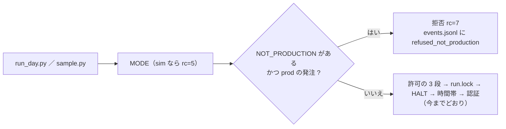
```mermaid
flowchart LR
  S["run_day.py ／ sample.py"] --> M["MODE（sim なら rc=5）"]
  M --> N{"NOT_PRODUCTION がある<br/>かつ prod の発注 ?"}
  N -- "はい" --> R["拒否 rc=7<br/>events.jsonl に refused_not_production"]
  N -- "いいえ" --> P["許可の 3 段 → run.lock → HALT → 時間帯 → 認証（今までどおり）"]
```

| 項目 | 決め |
| --- | --- |
| 中身 | `{"machine": <置いた機械の hostname>, "since", "by", "reason"}`。読むときに今の hostname と突き合わせる |
| 拒むもの | **`--env prod` かつ `--mode submit`**（執行器 `run_day.py`）／ **本番の発注系の手順 4・5・5limit・6**（`sample.py`）。`TT_ALLOW_PROD_ORDERS=1` ＋ `--i-know-this-is-real-money` があっても拒む（**許可より印が先**）。rc=7・本物の `events.jsonl` に `refused_not_production`（`machine`・`host`・`matches_host`・`since`・`by`） |
| 拒まないもの | `--mode plan`・`dry-run`・`--env cert`・`reconcile.py`・管理画面（読むだけ） |
| 取り違え | 印の `machine` が今の hostname と違う（印を写した・ホスト名を変えた）→ **それでも拒む**が、メッセージ・記録・帯に「この機械の印ではない」と出る ＝ 13500t に titan の印が紛れ込んだら、起動しなかった理由がすぐ分かる（消すのは `notprod.py clear`）。壊れた印（JSON でない・`machine` が無い）も拒む ＝ 読めない印を「無い」と読まない |
| 操作 | `notprod.py status ／ set [--reason …] ／ clear`（⚠ CLI だけ・**置くのも外すのも利用者**）。`set` は自分の hostname を書く（他の機械の名前は書けない）。置く・外すは `mode.log` に 1 行（`not_production_set` ／ `not_production_cleared`） |
| 早見 | `run-live.sh` は submit ＋ `--env prod` ＋ 印 で 95 秒むだにせず rc=7（関門の本体は `run_day.py`） |
| 管理画面 | 全ページの最上部に灰の帯「本番の機械ではない」・`/api/*` に `not_production`（[dashboard.md §13-6](../dashboard.md)）。⚠ 表示だけ・公開面は読まない |
| 守り 2 枚 | 印（仕組み）＋ timer を止め `live.env` から許可を外す（運用）。⚠ 印は timer を止める代わりではない（timer が起きるたびに rc=7 の記録が増えるだけ） |

#### (b) 切り替えの手順（Phase 4。市場の外の日。⚠ 発注しない日に）

> この図の主張: 順は「titan を止める → 印 → 写す → 13500t で差 0 → 13500t を開ける」。逆にしない（13500t を先に開けると 2 台が同時に発注する日ができる）。

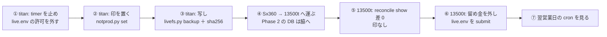
```mermaid
flowchart LR
  A["① titan: timer を止め<br/>live.env の許可を外す"] --> B["② titan: 印を置く<br/>notprod.py set"]
  B --> C["③ titan: 写し<br/>livefs.py backup ＋ sha256"]
  C --> D["④ Sx360 → 13500t へ運ぶ<br/>Phase 2 の DB は脇へ"]
  D --> E["⑤ 13500t: reconcile show 差 0<br/>印なし"]
  E --> F["⑥ 13500t: 留め金を外し<br/>live.env を submit"]
  F --> G["⑦ 翌営業日の cron を見る"]
```

| 順 | 機械・だれ | 何を | 出口 |
| ---: | --- | --- | --- |
| ① | titan・**利用者** | `systemctl --user disable --now ail-live-run.timer ail-live-prepare.timer` → `~/.config/ai-income-lab/live.env` を雛形の dry-run に戻す（`AIL_LIVE_MODE=submit`・`--i-know-this-is-real-money`・`TT_ALLOW_PROD_ORDERS=1` を消す）→ `simctl.py status`（動いているもの なし）→ `reconcile.py --env prod show` | `list-timers` に ail-live が無い・差 0・控えの未完 0 |
| ② | titan・**利用者** | `cd experiments/live-trading && ../tastytrade-api-sample/.venv/bin/python notprod.py set --reason "本番は 13500t（Phase 4）"` | `notprod.py status` が「印あり」・管理画面（3012）に灰の帯 |
| ③ | titan・titan の Claude か利用者 | `python3 experiments/tastytrade-api-sample/livefs.py backup --to ~/ai-income-lab-switch/live-<日付>.sqlite && sha256sum ~/ai-income-lab-switch/live-<日付>.sqlite > …sha256`。⚠ **`cp` しない**（WAL の途中を写すと壊れる。`backup` は書いている最中でも壊れない写し）。⚠ **写すのは DB 1 つ**（`state/<env>/*.json`・`out/`・`mode.log` は全部この中。`state-backup/` はファイルの控えで、13500t の submit の回が自分で作る。`data-live/` は 13500t が自分で取っている ＝ K7） | `livefs.py stats --db <写し>` の行数が titan の `livefs.py stats` と一致 |
| ④ | Sx360 の Claude ＋ 利用者 | titan → Sx360 → 13500t へ運ぶ（titan から 13500t へは届かない ＝ K3）。13500t で `sha256sum -c`。13500t の clone の `live.sqlite`（Phase 2 の plan ／ dry-run の記録）を `live.sqlite.phase2-<日付>` に **`mv`** し、⚠ **clone の外（`~/ai-income-lab-switch/`）へ移す**（clone に残すと未追跡のファイルになり、auto-update が「汚れている」で pull を止め続ける。2026-09-25 に踏んだ）（⚠ `live.sqlite-wal` ／ `-shm` が残っていればコンテナが動いていないことを確かめてから一緒に退ける）→ 写しを `live.sqlite` に置く（持ち主は clone と同じ uid・`chmod 644`）。⚠ DB の中の道はリポジトリ直下からの相対（`livefs.locate`）＝ clone の絶対パスが違っても**そのまま読める** | `livefs.py stats` が ③ と一致・`git status --porcelain` は空のまま |
| ⑤ | 13500t・Sx360 の Claude | コンテナで `reconcile.py --env prod show`（ネットワークなし）→ **差 0・控えの未完 0** ／ `notprod.py status` → **印なし**（紛れていたら `clear`）／ 管理画面（トンネル）にトレーダーの詳細が titan と同じ数字で出る | 差 0・印なし |
| ⑥ | 13500t・**利用者** | g3plus-ops の `run.sh` の留め金（Phase 2 ＝ submit と発注の許可を拒む）を外し（⚠ Phase 2 の `run.sh` は `TT_ALLOW_PROD_ORDERS` をコンテナに渡していなかった ＝ 留め金を外すだけでは許可の段で止まる。2026-09-25 に渡す 1 行を足した）、`live.env` を submit（`AIL_LIVE_MODE=submit`・`AIL_LIVE_EXTRA=--i-know-this-is-real-money`・`TT_ALLOW_PROD_ORDERS=1`）。⚠ **①② が済んでいることを確かめてから**（2 台で同時に発注しない） | — |
| ⑦ | 13500t | 翌営業日 15:40 ET の cron の log に `end rc=0`・`orders.jsonl` に `mode: submit`・約定・口座 − 売買履歴 ＝ 0。titan の管理画面は帯のまま・数字は ③ の日で止まる（読むだけの写し） | 13500t で 1 日通る |

- ⚠ **titan の記録は ③ の日以降増えない**。titan で見たいときは 13500t の DB を `backup` で写して `AIL_LIVE_DIR` … ではなく、リポジトリ直下の `live.sqlite` を写しで置き換える（読むだけ。⚠ 印がある限り titan は発注しないので、置き換えても二重発注にはならない）
- ⚠ **13500t 側（g3plus-ops の `run.sh`・`live.env`・cron）はこのリポジトリに無い**。留め金の外し方は g3plus-ops の `docs/workflows/ail-live.md`
- 戻し方（Phase 5。13500t が落ちた日に titan へ）は下の (d)（⚠ 2026-09-25 に廃止）

#### (c) 稽古【実測 2026-09-24 07:41 PDT・titan・作業用の置き場 `~/.cache/ai-income-lab-switch/`。本物の `MODE`・`run.lock`・`live.sqlite`・`NOT_PRODUCTION` には触っていない】

| 順 | 何を | 結果 |
| ---: | --- | --- |
| ③ | `livefs.py backup` → 13500t 役の `live.sqlite` | 0.045 秒・整合性 ok・写しの sha256 `d426d113…` が転送後も `OK`・`stats` は元と同じ **115 本・1,602 行 ／ 丸ごと 6（前の中身 14）** |
| ⑤ | 13500t 役で `reconcile.py --env prod show`（`LT_MODE_DIR`・`LT_STATE_DIR`・`LT_OUT_DIR` を作業用の置き場へ） | 4 人・口座（9/23 の記録）− 売買履歴 ＝ **5 銘柄とも差 0**（T 4 ・ PFE 4 ・ NKE 2 ・ VZ 2 ・ BAC 2 ＝ T1 と T3 が半分ずつ）・控えの未完 0・rc=0 |
| ② | titan 役に `notprod.py set --reason 稽古` → `run_day.py --traders T1,T2,T3 --env prod --mode submit --ignore-window`（⚠ 許可も資格情報も付けない） | **rc=7**「この機械は本番の機械ではない」・`events.jsonl` に `refused_not_production`（`machine: titan`・`matches_host: true`）。同じ印のまま `--mode plan` は印で止まらず「資格情報が無い」まで進む（rc=1） |
| 戻し | `notprod.py clear` → `status` | 印なし。`mode.log` に `not_production_set` → `not_production_cleared` の 2 行 |

⚠ 稽古で分かったこと: `reconcile.py --env cert show` は「口座の建玉」を `out/` の最後の記録から読むので、**cert の売買履歴に prod の口座の建玉が並ぶ**（差 2〜4 と出る）。切り替えで見るのは `--env prod` だけ ＝ 実害なし。cert の欄は読まない。
テストは `experiments/live-trading/tests/test_not_production.py`（6 件。⚠ 印で止まらない経路も、接続先をループバックの閉じたポートに向けて外へ出ない）・`dashboard/tests/test_mode_banner.py`（帯）。

#### (d) 戻し方（Phase 5。13500t が落ちた日に titan へ。⚠ 市場の外の時間に。[プラン](../../plans/archive/three-machines-phase5.md)）

⚠ **2026-09-25 に廃止**（利用者決定「13500t だけで動かすことにするので titan は使わない」）。この手順は使わない。記録として残す。

> この図の主張: 戻し方は (b) の逆順。**先に 13500t を止め、DB を titan へ運び、差を見てから titan の印を外す**。13500t の DB が取れない日でも titan は発注できる（差は「売買履歴の外」として執行器が守り、推測で割り振らない）。

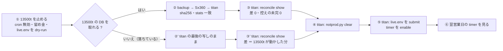
```mermaid
flowchart LR
  A["① 13500t を止める<br/>cron 無効・留め金・live.env を dry-run"] --> B{"13500t の DB を<br/>取れる ?"}
  B -- "はい" --> C["② backup → Sx360 → titan<br/>sha256・stats 一致"]
  B -- "いいえ（落ちている）" --> C2["②' titan の最後の写しのまま"]
  C --> D["③ titan: reconcile show<br/>差 0・控えの未完 0"]
  C2 --> D2["③' titan: reconcile show<br/>差 ＝ 13500t が動かした分"]
  D --> E["④ titan: notprod.py clear"]
  D2 --> E
  E --> F["⑤ titan: live.env を submit<br/>timer を enable"]
  F --> G["⑥ 翌営業日の timer を見る"]
```

| 順 | 機械・だれ | 何を | 出口 |
| ---: | --- | --- | --- |
| ① | 13500t・Sx360 の Claude ＋ **利用者** | 13500t に入れるなら: host cron の `trade` の行を無効に（`prepare`・`auto-update` は残してよい）→ g3plus-ops の `run.sh` の留め金を Phase 2 の形（submit と発注の許可を拒む）に戻す → `live.env` を dry-run に（`AIL_LIVE_MODE=submit`・`--i-know-this-is-real-money`・`TT_ALLOW_PROD_ORDERS=1` を消す）→ `notprod.py set --reason "本番は titan（Phase 5）"`。**入れないなら**（落ちている）: 「入れない ＝ 発注できない」を確かめたことにするが、⚠ **戻ってきた瞬間に cron が発注する**ので、戻ったら**最初に**この ① をやる（それまで titan の印を外さない、が守れないときは下の「⚠ 2 台が生きる日」） | 13500t の `run.sh` が submit を拒む・印あり |
| ② | Sx360 の Claude ＋ 利用者 | 取れるなら 13500t で `livefs.py backup --to <写し>` ＋ `sha256sum` → Sx360 → titan（(b) ④ の逆）。titan では動いている執行器が無いことを確かめ（`simctl.py status`・`list-timers` に ail-live が無い）、リポジトリ直下の `live.sqlite`（(b) ③ の日で止まった写し）を `live.sqlite.titan-<日付>` に **`mv`**（`-wal` ／ `-shm` が残っていれば一緒に）→ 写しを `live.sqlite` に。⚠ **`cp` しない**・⚠ **写すのは DB 1 つ**（`state/`・`out/`・`mode.log` は中） | `livefs.py stats` が 13500t と一致 |
| ②' | titan | 取れないなら何もしない（(b) ③ の日の写しのまま）。⚠ 13500t が発注した日の記録は titan に無い ＝ 口座と売買履歴が食い違う。それは ③' で執行器の 3 段（§0-8）が守る | — |
| ③ | titan・titan の Claude か利用者 | `cd experiments/live-trading && ../tastytrade-api-sample/.venv/bin/python reconcile.py --env prod show`（ネットワークなし）。⚠ 「口座の建玉」は `out/` の最後の記録から読むので、②' のときは**13500t が動かした分は見えない** ＝ 差 0 に見えても信じない。②' では `run_day.py --traders T1,T2,T3 --env prod --mode plan --ignore-window`（認証して口座を読む・発注しない）で **口座 − 売買履歴** を出し、多いぶんは「売買履歴の外」・少ない銘柄はその日は売買しない、と執行器が自分で扱うことを確かめる。⚠ **差を推測で誰かに割り振らない**（13500t が戻ったら 2 つの DB を突き合わせ、人が `reconcile.py add ／ remove` で合わせる） | ②: 差 0・控えの未完 0 ／ ②': 差が「売買履歴の外」として記録される |
| ④ | titan・**利用者** | `notprod.py clear` → `status`（印なし）→ 管理画面（3012）の灰の帯が消える。⚠ ① が済んでから（2 台とも印なしの時間を作らない） | 印なし |
| ⑤ | titan・**利用者** | `~/.config/ai-income-lab/live.env` を submit（`AIL_LIVE_MODE=submit`・`AIL_LIVE_EXTRA=--i-know-this-is-real-money`・`TT_ALLOW_PROD_ORDERS=1`）→ `systemctl --user enable --now ail-live-prepare.timer ail-live-run.timer` → `list-timers`。⚠ **戻す日の 15:40 ET を過ぎていたらその日は発注しない**（`--wait` は素通り ＝ §1 の落とし穴。手で起こさない） | `list-timers` に 2 本 |
| ⑥ | titan | 翌営業日 `out/timer-run.log` に `終了 rc=0`・`orders.jsonl` に `mode: submit`・口座 − 売買履歴 ＝ 0 | titan で 1 日通る |

- ⚠ **2 台が生きる日**（13500t が勝手に戻り、titan も印を外している）: 守りは **`HALT`**（管理画面の停止ボタン。timer ／ cron が起こしても発注しない）。どちらか 1 台に印を置くまで両方の `HALT` を置く。⚠ 口座の側に重複を弾く仕掛けは無い（K4 の候補 (b) は作っていない）
- 13500t が直ったら (b) を①から**やり直す**（titan → 13500t）。⚠ (b) ④ の「Phase 2 の DB を退ける」は、今度は titan で増えた分を含む DB を運ぶ、という意味になる
- 手順の中で titan の Claude ができるのは ③ の読みと写しの確認まで。①⑤ は利用者、13500t の操作は Sx360 の Claude

#### (e) 戻し方の稽古【実測 2026-09-24 15:14 PDT・titan・作業用の置き場 `~/.cache/ai-income-lab-switch/`（Phase 3 の 13500t 役 ／ titan 役をそのまま使った）。本物の `MODE`・`run.lock`・`live.sqlite`・`NOT_PRODUCTION` には触っていない】

| 順 | 何を | 結果 |
| ---: | --- | --- |
| ② | 13500t 役の `live.sqlite` を `livefs.py backup --to transfer-back.sqlite` → `sha256sum -c` → titan 役の古い DB を `live.sqlite.titan-2026-09-24` に `mv` → 写しを `live.sqlite` に | 0.042 秒・整合性 ok・sha256 `d426d113…` OK・`stats` は 13500t 役と写しで同じ **115 本・1,602 行 ／ 丸ごと 6** |
| ③ | titan 役で `reconcile.py --env prod show`（`LT_MODE_DIR`・`LT_STATE_DIR`・`LT_OUT_DIR` を作業用の置き場へ） | 4 人・5 銘柄とも 口座 − 売買履歴 ＝ **差 0**（T 4 ・ PFE 4 ・ NKE 2 ・ VZ 2 ・ BAC 2）・控えの未完 0・rc=0。⚠ 「口座の建玉」は `out/` の最後の記録（9/23）＝ ②' のときは 13500t が動かした分が見えない（手順書のとおり `--mode plan` で口座を読む） |
| ④ | titan 役に印（13500t が本番の間の状態）→ `run_day.py --env prod --mode submit`（許可も資格情報も付けない）→ `notprod.py clear` → もう一度 submit | 印あり **rc=7** → 印なし **rc=2（許可の 3 段で止まる）** ＝ 印を外しても許可が無ければ発注に進まない。`mode.log` に `not_production_set` → `not_production_cleared` |
| 確認 | 本物 | `notprod.py status` 印なし（今日はまだ置いていない）・`MODE` なし（real）・`run.lock` は空の flock 用（持ち主なし）・`git status` に作業用の置き場は出ない |

⚠ ⑤（`live.env` を submit に戻し timer を入れる）と ①（13500t を止める）は稽古できない（利用者と Sx360 の Claude の操作）。手順書の文だけ。

#### (f) 切り替えの実施【実測 2026-09-25（金）引け後 15:40〜16:10 PDT・利用者 ＋ Sx360 の Claude。利用者の決定「13500t 切り替えはすぐにやってしまう。問題があれば 13500t の方で直す。titan から日常の作業を切り離すのが目的」】

> この図の主張: (b) の順のとおりに進め、13500t の最初の本番の回は **9/28（月）15:40 ET の cron**（⑦ はまだ）。

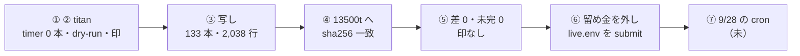
```mermaid
flowchart LR
  A["① ② titan<br/>timer 0 本・dry-run・印"] --> B["③ 写し<br/>133 本・2,038 行"]
  B --> C["④ 13500t へ<br/>sha256 一致"]
  C --> D["⑤ 差 0・未完 0<br/>印なし"]
  D --> E["⑥ 留め金を外し<br/>live.env を submit"]
  E --> F["⑦ 9/28 の cron<br/>（未）"]
```

| 順 | 結果 |
| ---: | --- |
| 前 | titan の timer は 9/25 に submit で無人で通っていた（15:51 ET・rc=0・NKE 1 株の売り 1 件 Filled）。13500t の cron は 9/24・9/25 とも dry-run で prepare ／ trade rc=0 |
| ① | 利用者: `systemctl --user disable --now` で timer 2 本を外した（`list-timers` に ail-live 0 本）・`live.env` を dry-run（`--allow-prod-dry-run`・`TT_ALLOW_PROD_ORDERS` の行を消した） |
| ② | 利用者: `notprod.py set --reason "本番は 13500t（Phase 4・2026-09-25）"` → 印あり（22:43:02 UTC） |
| ③ | titan で `simctl.py status` 動いているもの なし・`reconcile.py --env prod show` 5 銘柄とも差 0（T 4 ・ PFE 4 ・ NKE 1 ・ VZ 2 ・ BAC 2）・未完 0 → `livefs.py backup --to ~/ai-income-lab-switch/live-2026-09-25.sqlite`（1.66 MB・整合性 ok）・sha256 `cebb28e9…`・`stats` は元と写しで同じ **133 本・2,038 行 ／ 丸ごと 6（前の中身 19）** |
| ④ | titan → Sx360 → 13500t の `~/ai-income-lab-switch/`（sha256 OK 2 回）→ 利用者が管理画面のコンテナ `trade-dashboard` を止め、Phase 2 の DB を退け、写しを `live.sqlite` に置き、起こし直した（healthy）。13500t の `stats` も 133 本・2,038 行。⚠ 退けた `live.sqlite.phase2-2026-09-25` が `git status` に `??` で出た → clone の外（`~/ai-income-lab-switch/`）へ移して作業ツリーは空（上の ④ の注） |
| ⑤ | 13500t（ホストの python3）で `reconcile.py --env prod show` 5 銘柄とも差 0・未完 0 ／ `notprod.py status` 印なし ／ `MODE`・`HALT`（2 か所）なし ／ 資格情報あり |
| ⑥ | g3plus-ops の `trade-runner/run.sh`（旧 `ail-live/`）の留め金を外した: `AIL_LIVE_MODE` は plan ／ dry-run ／ submit、submit は `TT_ALLOW_PROD_ORDERS=1` と `--i-know-this-is-real-money` が揃わなければ rc=3・⚠ `TT_ALLOW_PROD_ORDERS` をコンテナに渡す 1 行を足した（無いと許可の段で止まる）→ 13500t へ送り構文 OK・一致。`live.env` は控え `live.env.dry-run-2026-09-25` を取ってから submit（利用者）。cron は平日 06:00 PDT prepare ／ 12:40 PDT trade のまま |
| ⑦ | ✅ **2026-09-28（月）済み【実測。Sx360 の Claude が 19:50〜20:10 ET に 13500t のログと DB を後から読んだ】**: `trade.log` ＝ cron 12:40:01 PDT 起動 → 15:50 ET まで待つ → 更新 56 秒 → 予測 3 本 45 秒（表 38〜41 秒 ＋ fit 0.2〜3.6 秒）→ 執行器 9 秒 → `end rc=0`（15:51:50 ET・起きてから 709 秒）／ `orders.jsonl` 1 件 `mode: submit`（T1 の BAC 1 株 売り・510067159・Routed → Filled 958 ms・約定 $55.5119・気配 bid 55.52 ／ ask 55.53）・`submitted` あり・`error` なし・`attempts` 1 ／ `reconcile.py --env prod show` 5 銘柄とも差 0（BAC 1 ・ NKE 1 ・ PFE 4 ・ T 4 ・ VZ 2）・控えの未完 0 ／ `notprod.py status` 印なし・`MODE`・`HALT`（2 か所）なし ／ HEAD `9cbb3ae`（＝ `prod`）／ 見張り `check.sh` 16:20 ET の初回 ＝ `market=open trade rc=0 prepare rc=0 → 0`（`AIL_HC_URL` 無し ＝ not-sent・`logs/checks.log` に 1 行）。日次の行は §1 の 9/28。⚠ **Phase 4 はこれで閉じた**（プランは `archive/`） |

- titan は ③ の日（9/25）で止まった読むだけの写し。titan の管理画面（3012）は灰の帯
- 13500t を止めたいときは管理画面の停止ボタン（`HALT`）か、`live.env` を控え `live.env.dry-run-2026-09-25` に戻す。titan へは戻さない（(d) は 2026-09-25 に廃止）

#### (g) ⑦ の前の事前確認【実測 2026-09-26（土）20:20〜20:35 PDT・Sx360 の Claude。利用者の指示「月曜のその時間はできないので、事前にやりたい。問題が起きてもさほど問題ではない」】

月曜の回そのものは NYSE の暦と発注できる時間帯（15:45〜16:05 ET）に縛られるので前倒しできない。代わりに、月曜の cron が通る道のうち **13500t でまだ一度も動いていない部分**（`run.sh` の submit の分岐・許可の受け渡し）を発注せずに確かめた。全部通った ＝ 月曜より前にやることは無い。⑦ は「その時刻に見張る」のではなく後から記録を読む（`trade.log`・`orders.jsonl`・`reconcile.py show` は残る ＝ いつ読んでも同じ）。

| 確かめたこと | やり方 | 結果 |
| --- | --- | --- |
| `run.sh` の submit の分岐 | compose の行だけ `echo` に替えた写しを 13500t で `trade` として通した（記録は `/tmp`・本物の `trade.log` は触っていない） | rc=0。組み立てた命令 ＝ `docker compose … run --rm -T -e TT_ALLOW_PROD_ORDERS=1 trade-runner ./run-live.sh --traders T1,T2,T3 --mode submit --wait -- --env prod --i-know-this-is-real-money`（titan の timer が 9/25 に発注を通した引数と同じ） |
| `live.env` | dry-run の控え `live.env.dry-run-2026-09-25` と diff | 違いは 3 行だけ（`AIL_LIVE_MODE=submit`・`AIL_LIVE_EXTRA=--i-know-this-is-real-money`・`TT_ALLOW_PROD_ORDERS=1`） |
| 許可がコンテナに届くか | 使い捨てのコンテナで環境変数を印字（何も書かない） | `TT_ALLOW_PROD_ORDERS=1`・uid 1000・cwd はリポジトリ・`live.sqlite` が見える・`/opt/venv` の Python 3.12 |
| 執行器がその許可を読むか | `ttclient.load_env` を読んだ | `os.environ` を先に読み `.env` は足りない項目だけ ＝ `-e` で足りる（titan は systemd の `EnvironmentFile` で同じ経路を通っていた） |
| submit の回が作るファイル | `.gitignore`・`auto-update.sh` | `state-backup/`・`run.lock`・`out/`・`live.sqlite*` は ignore ＝ auto-update は「汚れている」で止まらない。15:30〜16:15 ET と trade-runner のコンテナ稼働中は pull しない |
| 直近の 13500t の回（9/25 dry-run・dafab8a）から `prod`（feaeb43）までのコード差分 | `git diff --name-only` | 10 ファイル全部が文書・`run-deploy.sh`・`run-dashboard-tunnel.sh` ＝ 執行の経路は 0 |
| 状態（読むだけ） | ssh | 13500t: cron 3 行（06:00 ／ 12:40 PDT・auto-update 15 分おき）・印 ／ `MODE` ／ `HALT` なし・`reconcile.py --env prod show` 5 銘柄とも差 0・未完 0・`trade-dashboard` healthy ／ titan: 印あり（machine=titan・9/25 22:43 UTC）・timer 2 本 disabled・DB は 9/25 15:43 で止まっている |

- ⚠ 月曜に失敗しても外へ知らせる仕組みはまだ無い（`check.sh` は 13500t に未設置 ＝ §0-15 の段 2。healthchecks.io の URL は利用者）。管理画面の帯は 16:15 ET 以降。起こり得るのは「その日は発注しない」か「注文が error で止まる」までで、規模 A の $1,000 の中（利用者「さほど問題ではない」）

### 0-15. 失敗の知らせ方と、残っていた決めごと（2026-09-25。利用者の指示「全部おススメで直して」。[プラン](../../plans/live-trading-open-decisions.md)）

⚠ **20 営業日（Phase 6）のあいだは執行器（`run_day.py` ほか）を変えない**。コードを変える案は 10/20 の判定の後に回す。

**失敗の知らせ方**

> この図の主張: 売買の回（`run.sh trade`）には触らず、後ろに別の見張りを置く。機械が落ちた日は見張りも動かないので、外の側が「来ない」で知らせる。

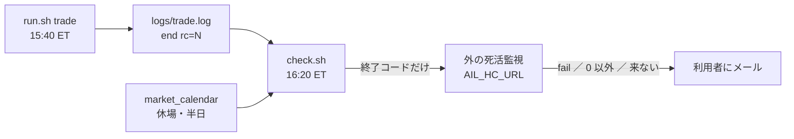
```mermaid
flowchart LR
  T["run.sh trade<br/>15:40 ET"] --> L["logs/trade.log<br/>end rc=N"]
  L --> C["check.sh<br/>16:20 ET"]
  K["market_calendar<br/>休場・半日"] --> C
  C -- "終了コードだけ" --> H["外の死活監視<br/>AIL_HC_URL"]
  H -- "fail ／ 0 以外 ／ 来ない" --> M["利用者にメール"]
```

| | 決めたこと |
| --- | --- |
| 失敗 | ① その営業日の `end rc=` が `trade.log` に無い（起動しなかった）／ ② `rc≠0`（執行器は 注文の error ／ `unknown` ／ 口座と売買履歴の食い違いで止めた銘柄 のどれかで 1 を返す。`run-live.sh` の 10 ／ 11 ／ 12・`HALT` の 3 も含む） |
| 段 1（済み） | 管理画面の帯「今日の起動が無い」（[dashboard.md §13-8](../dashboard.md)） |
| 段 2 | 13500t の host cron に `check.sh`（g3plus-ops `trade-runner/`。平日 16:20 ET）。今日の `end rc=` を読み、`AIL_HC_URL`（`live.env`）へ `/<rc>`・行が無ければ `/fail`・休場日と半日立会は `/0` を送る。⚠ **送るのは日付・市場の区分・終了コードだけ**（口座番号・金額・銘柄・トークンは送らない）。⚠ **`run.sh` は変えない**（見張りが壊れても売買は止まらない）。✅ **2026-09-27 に 13500t へ置いた**（Sx360 の Claude・利用者の了承。scp ＋ crontab 6 行目 `20 13 * * 1-5`。写した `logs/` で 4 日ぶん試験 ＝ 営業日 9/24・9/25 は rc 0 → `0`・土日 9/26・9/27 は closed → `0`【実測】。9/28（月）16:20 ET から動く。URL は未登録 ＝ `checks.log` に書くだけ） |
| 外の側 | healthchecks.io の無料枠を推す（Cron 式 `20 13 * * 1-5`・America/Los_Angeles・猶予 1 時間）。⚠ **登録と URL を書くのは利用者**。URL が無い間は `logs/checks.log` に書くだけ。✅ **2026-10-08 に登録した**（利用者。無料の Hobbyist【公表値 https://healthchecks.io/pricing/ 2026-10-08 取得: $0・20 本】・通知はメール。17:10 PDT に手で 1 度送り `sent … → 0`【実測】）＝ 10/9（金）13:20 PDT（16:20 ET）から毎営業日に届く |

**残っていた決めごと**（TODO の実売買の親の下。4 役の分け直しは保留）

| 項目 | 決めたこと |
| --- | --- |
| 起動しなかった日 | §1 の表に 1 行「起動なし」（トレーダーは「全員」・注文 0・事象に理由）。⚠ **20 営業日は起動した営業日で数える**（起動しなかった日は数えず、判定のときに件数を別に書く ＝ 無人運転の柱） |
| 約定後の実際の手数料 | 10/20 の判定の後に `/accounts/{n}/transactions` を sandbox で確かめてから入れる。それまでは dry-run の見積り |
| 4 役への分け直し（A1〜A5・F23） | いまは分け直さない。再開は 1 日に何回も売買するモデルができたとき（D13 の再検討の条件と同じ）。そのときの見立て: 呼び名は 予測 ／ 判断 ／ 発注 ／ ビュワー（ディレクトリ名は変えない）・機械は全部 13500t |
| C10 更新の時刻がずれるモデル | 判断は取引時間帯に 1 回・その日の日付の予測だけを使う（いまの作り） |
| ✅ 2026-10-05 利用者決定「凍結を解く」 | 20 営業日の判定（10/20）まで執行器を変えない、という決めごとはここで終わり（いまの 3 人の記録は 10/2 の 8 営業日で閉じたため）。最初の変更は人ごとの印（停止 ／ 手じまい）＝ [プラン trader-control-flags.md](../../plans/archive/trader-control-flags.md) |
| C11 入れ替え・編集 | 編集はしない。変えるときは新しい識別名の新しい人を作り、古い人は窓の中で持ち株を売り切ってから外す（売買履歴は残す）。✅ **2026-10-04 利用者決定で 1 つ緩めた: 予算（`budget_usd`）だけは編集してよい**（「検証は３人だけにします。…３人とも600ドルとする」＝ いまの人の $300 → $600）。モデル・θ・合成規則・銘柄・`sizing` はこれまでどおり新しい人。予算を変えた日は §1 の表に書く（[プラン trader-loop.md](../../plans/trader-loop.md)） |
| C12 停止の単位 | 止めるのは全員（`HALT`）だけ。含み損 20% は警告だけ（§0-2）。1 人だけ止めるなら 13500t の `live.env` の `AIL_LIVE_TRADERS` から外す（利用者） ／ ✅ 2026-10-05〜07 から 1 人ずつ止められる: 管理画面の指示（開始 ／ 一時停止 ／ 手じまい。§0-2・`dashboard.md` §13-9。2026-10-09 に「印」「候補」「外す」をやめた）（利用者） |
| D13 注文の種類・気配 | 成行（`Market`・DAY）のまま・気配は 15:50 ET に取るまま（差 1 を素直に測れる。指値は約定しない日ができる） |
| G24 1 日に何度も売買するときの差 | いまは決めない（1 日 1 回に固定したため起きない） |

## 1. 記録（日次）

Phase 5-1・Phase 6 で埋める。1 日 1 行 × トレーダー。数字は全部【実測】。

⚠ **起動しなかった営業日も 1 行書く**（トレーダーは「全員」・注文 0・事象に「起動なし」と理由）。⚠ **20 営業日は起動した営業日で数える**（§0-15）。

| 日付 | トレーダー | 注文 | 約定 | 差 1（気配 → 約定 bp） | 事象 | 備考 |
| --- | --- | --- | --- | --- | --- | --- |
| 2026-09-21 | `test_a`（試験用・判定に混ぜない） | 2（買い 12:15 PDT・窓の外 `--ignore-window` ／ 売り 12:46 PDT・窓の中） | 2 ／ 2（買い 508163899 @ $25.5567 ／ 売り 508187559 @ $25.475。発注 → 約定 0.14 ／ 0.11 秒） | 買い +0.67 ／ 売り 0.00（中値から不利な向きを正） | なし（`retry`・`halted`・`over_budget` 無し。本番で 429 は出ず） | 往復 −$0.0817・手数料 $0.001 ＋ $0.0112（売りの規制費）・口座 − 売買履歴 ＝ 0・控えの未完 0・秘密の grep は空。売りの代金 $25.475 は受渡し待ち（9/22） |
| 2026-09-21 | `T1`・`T2`・`T3`（本番 dry-run・何も出していない） | 10（T1 5 ・ T3 5 ・ T2 0） | —（dry-run） | — | T2 は 5 銘柄とも買い% 49.8 < θ 55 で `skip` | 窓の外 12:23 PDT ／ 窓の中 12:46 PDT の 2 回。更新 54〜55 秒 ＋ 予測 37〜38 秒 ・ dry-run 1 本 0.22 秒（最大 0.26）・問題 0 |
| 2026-09-22 | `test_a`（cert・DB の作りの通しテスト。判定に混ぜない） | 2（買い 11:33 PDT ／ 売り 11:33 PDT。どちらも `--ignore-window`） | 2 ／ 2（買い 1665665 @ $25.08 ／ 売り 1665671 @ $25.07。起動から 10.4 ／ 4.0 秒） | 気配は 2 回とも bid 25.07 / ask 25.08 | ⚠ **買いの約定確認で 429** → 待って取り直し `Filled`（`transitions` の `poll retry:429`）。ほかの問題 0 | 往復 −$0.01・手数料 $0.001 ＋ $0.0012・口座 − 売買履歴 ＝ 0・控えの未完 0・秘密の grep は空。§0-11 の作り（DB）で通した |
| 2026-09-23 | `T1`（本番・規模 A・1 日目） | 5（買い T 2 ・ PFE 2 ・ NKE 1 ・ VZ 1 ・ BAC 1。発注 15:51:40〜43 ET・窓の中） | 5 ／ 5（508891490 ／ 508891504 ／ 508891511 ／ 508891521 ／ 508891531。発注 → 約定 0.11〜0.16 秒） | 5 本とも 0.00（約定 ＝ 中値: T 25.335 ／ PFE 28.095 ／ NKE 35.765 ／ VZ 46.575 ／ BAC 55.945） | なし（`skip`・`retry`・`over_budget`・`journal_unresolved` 無し。429 も無し） | 代金 $245.145・手数料 $0.007（dry-run の見積り）・予算 $300 の 81.7% を使用 |
| 2026-09-23 | `T2`（本番・規模 A・1 日目） | 0 | — | — | 5 銘柄とも買い% 49.67 < θ 55 で `skip`（`events.jsonl` に 5 行） | 5 銘柄の買い% が同点（仕様どおり ＝ 銘柄を選ばないモデル。§0-1） |
| 2026-09-23 | `T3`（本番・規模 A・1 日目） | 5（同上。発注 15:51:43〜46 ET） | 5 ／ 5（508891536 ／ 508891544 ／ 508891547 ／ 508891554 ／ 508891570。発注 → 約定 0.12〜0.15 秒） | T +0.83 ／ PFE 0.00 ／ NKE +0.67 ／ VZ +0.60 ／ BAC +1.79（中央値 +0.67。同じ気配で T1 の 1〜3 秒後に出た分が不利） | なし | 代金 $245.164・手数料 $0.007（見積り） |
| 2026-09-24 | `T1`（2 日目・titan の timer の初日 ＝ dry-run） | 0（合図 5 → 意図 0） | — | — | 5 銘柄とも `hold`（買い% 50.05〜50.99 ≥ θ 50・持ち株あり） | 含み +$1.93（時価 $247.08）。⚠ dry-run の日だが意図 0 なので submit でも同じ。timer は 12:40 PDT に起きて 15:50 ET まで待ち、更新 55 秒 → 予測 44 秒 → 執行器 2 秒（15:51:40〜42 ET）・rc=0。13500t の cron も同時刻に dry-run（空の売買履歴から 10 本。Phase 2 の DB ＝ 9/25 に退けた） |
| 2026-09-24 | `T2`（2 日目） | 0 | — | — | 5 銘柄とも買い% 51.22 < θ 55 で `skip` | 買い% は 5 銘柄で同点（§0-1） |
| 2026-09-24 | `T3`（2 日目） | 0 | — | — | 5 銘柄とも `hold`（買い% 50.15〜50.74） | 含み +$1.91 |
| 2026-09-25 | `T1`（3 日目・titan の timer が submit で無人で通った日） | 1（売り NKE 1 株。発注 15:51:35 ET・窓の中） | 1 ／ 1（509657229。Routed → Filled 97 ms・約定 $35.805） | 0.00（約定 ＝ 中値。bid 35.80 ／ ask 35.81） | NKE の買い% 49.83 < 100 − θ ＝ 50 で売り。ほか 4 銘柄は `hold`（50.49〜50.87）。`retry`・429 なし | 実現 +$0.04（35.805 − 35.765）・手数料 $0.0112（見積り: SEC $0.01 ＋ TAF ＋ clearing $0.001）・代金 $35.805 は受渡し待ち（次の営業日 9/28）。注文 1 本の所要 821 ms。⚠ 記録は titan の DB（15:51:33〜36 ET・rc=0）＝ 引け後に 13500t へ写した（§0-14 (f) ③④） |
| 2026-09-25 | `T2`（3 日目） | 0 | — | — | 5 銘柄とも買い% 50.38 < θ 55 で `skip` | — |
| 2026-09-25 | `T3`（3 日目） | 0 | — | — | 5 銘柄とも `hold`（NKE は 51.47 で持ち続け。50.44〜51.47） | 含み +$2.44。同じ NKE を T1 は売り T3 は持つ ＝ 人ごとの判断が分かれた最初の日。13500t の cron は同時刻に dry-run（9 本・最後の dry-run の日） |
| 2026-09-28 | `T1`（4 日目・13500t の cron の初回 ＝ submit。§0-14 (f) ⑦） | 1（売り BAC 1 株。発注 15:51:43 ET・窓の中） | 1 ／ 1（510067159。Routed → Filled 958 ms・約定 $55.5119） | +2.36（約定 55.5119 < 中値 55.525 ＝ bid 55.52 の 0.8 セント下。T1 の売買で初めて 0 でない差 1） | BAC の買い% 49.77 < 100 − θ ＝ 50 で売り。NKE は 49.55 だが 9/25 に売って持っていないので `skip`。ほか 3 銘柄は `hold`（50.03〜50.73）。`retry`・429 なし | 実現 −$0.43（55.5119 − 55.945）・手数料 $0.0112（見積り）・代金 $55.51 は受渡し待ち（9/29）。累計 実現 −$0.39・含み +$0.64（時価 $154.07・T 2 ・ PFE 2 ・ VZ 1）。注文 1 本の所要 3.9 秒（dry-run → 発注 → 約定確認）。⚠ 13500t の最初の本番の回: cron 12:40:01 PDT → 更新 56 秒 → 予測 45 秒 → 執行器 9 秒・rc=0（15:51:50 ET） |
| 2026-09-28 | `T2`（4 日目） | 0 | — | — | 5 銘柄とも買い% 50.16 < θ 55 で `skip` | 買い% は 5 銘柄で同点（§0-1） |
| 2026-09-28 | `T3`（4 日目） | 0 | — | — | 5 銘柄とも `hold`（50.13〜50.54。BAC は 50.19 で持ち続け） | 含み +$0.94（時価 $246.11・5 銘柄）。同じ BAC を T1 は売り T3 は持つ（9/25 の NKE と同じ形） |
| 2026-09-29 | `T1`（5 日目・13500t の cron・submit） | 1（買い BAC 1 株。発注 15:51:43 ET・窓の中） | 1 ／ 1（510401646。Routed → Filled 109 ms・約定 $54.965） | 0.00（約定 ＝ 中値。bid 54.96 ／ ask 54.97） | BAC の買い% 50.85 ≥ θ 50・持ち株なしで買い（9/28 に $55.5119 で売った BAC を翌日 $54.965 で買い戻した）。NKE は 49.68 で持っていないので `skip`。ほか 3 銘柄は `hold`（50.62〜50.71）。`retry`・429 なし | 手数料 $0.001（見積り）。累計 実現 −$0.39・含み −$1.07（時価 $207.33・T 2 ・ PFE 2 ・ VZ 1 ・ BAC 1）。注文 1 本の所要 689 ms。cron 12:40:01 PDT → `end rc=0` 12:51:44 PDT（703 秒）・執行器 3 秒（15:51:41〜44 ET）。⚠ 朝の `--prepare` は **rc=1**（外部系列の NOAA〔気象 ＝ 偽薬の枠〕が HTTP 503）＝ 夕方の回は通った。`check.sh` は `prepare rc=1 → 0`（判定に使うのは trade の rc だけ ＝ `check.sh` の作り） |
| 2026-09-29 | `T2`（5 日目） | 0 | — | — | 5 銘柄とも買い% 50.29 < θ 55 で `skip` | 買い% は 5 銘柄で同点（§0-1） |
| 2026-09-29 | `T3`（5 日目） | 0 | — | — | 5 銘柄とも `hold`（50.26〜50.75） | 含み −$2.00（時価 $243.17）。口座 − 売買履歴 ＝ 0（BAC 2 ＝ T1 1 ＋ T3 1） |
| 2026-09-30 | `T1`（6 日目） | 1（買い NKE 1 株。発注 15:51:45 ET・窓の中） | 1 ／ 1（510760790。Routed → Filled 146 ms・約定 $35.345） | 0.00（約定 ＝ 中値。bid 35.34 ／ ask 35.35） | NKE の買い% 50.11 ≥ θ 50・持ち株なしで買い（9/25 に $35.805 で売った NKE を $35.345 で買い戻した）。ほか 4 銘柄は `hold`（50.57〜51.20） | 手数料 $0.001（見積り）。累計 実現 −$0.39・含み −$1.82（時価 $241.92・5 銘柄）。注文 1 本の所要 1.1 秒。cron `end rc=0` 12:51:47 PDT（706 秒）・執行器 4 秒（15:51:43〜47 ET）。朝の `--prepare` は rc=0（120 秒） |
| 2026-09-30 | `T2`（6 日目） | 0 | — | — | 5 銘柄とも買い% 50.003 < θ 55 で `skip` | 買い% は 5 銘柄で同点（§0-1） |
| 2026-09-30 | `T3`（6 日目） | 1（売り PFE 2 株。発注 15:51:44 ET・窓の中） | 1 ／ 1（510760777。Routed → Filled 134 ms・約定 $28.53） | −1.75（約定 28.53 ＝ ask で売れた ＝ 中値 28.525 より有利。差 1 が負になった最初の注文） | PFE の買い% 49.98 < 100 − θ ＝ 50 で売り（T3 の最初の売り）。ほか 4 銘柄は `hold`（50.15〜50.54） | 実現 +$0.87（(28.53 − 28.095) × 2）・手数料 $0.0124（見積り: SEC $0.01 ＋ TAF ＋ clearing $0.002）・代金 $57.06 は受渡し待ち（10/1）。含み −$4.10（時価 $184.87・4 銘柄）。同じ PFE を T3 は売り T1 は持つ（9/25・9/28 と逆の向き）。口座 − 売買履歴 ＝ 0（NKE 2 ＝ T1 1 ＋ T3 1・PFE 2 ＝ T1 2）・控えの未完 0 |
| 2026-10-01 | `T1`（7 日目） | 0 | — | — | 5 銘柄とも `hold`（買い% 50.22〜50.76） | 累計 実現 −$0.39・含み −$3.68（時価 $240.06・5 銘柄）。cron `end rc=0` 12:51:51 PDT（710 秒）・執行器 3 秒（15:51:47〜50 ET）。朝の `--prepare` は rc=0（118 秒） |
| 2026-10-01 | `T2`（7 日目） | 0 | — | — | 5 銘柄とも買い% 49.55 < θ 55 で `skip` | 買い% は 5 銘柄で同点（§0-1） |
| 2026-10-01 | `T3`（7 日目） | 1（買い PFE 2 株。発注 15:51:49 ET・窓の中） | 1 ／ 1（511134906。Routed → Filled 152 ms・約定 $28.175） | 0.00（約定 ＝ 中値。bid 28.17 ／ ask 28.18） | PFE の買い% 50.35 ≥ θ 50・持ち株なしで買い（9/30 に $28.53 で売った PFE を翌日 $28.175 で買い戻した）。ほか 4 銘柄は `hold`（50.34〜50.74）。`retry`・429 なし | 手数料 $0.002（見積り）・代金 $56.35。累計 実現 +$0.87・含み −$5.26（時価 $240.06・5 銘柄）。注文 1 本の所要 0.8 秒。口座 − 売買履歴 ＝ 0（5 銘柄とも T1 ＋ T3）・控えの未完 0 |
| 2026-10-02 | `T1`（8 日目） | 1（売り NKE 1 株。発注 15:51:47 ET・窓の中） | 1 ／ 1（511533826。Routed → Filled 194 ms・約定 $33.865） | −1.48（約定 33.865 ＞ 中値 33.86 ＝ 売りで有利。bid ＝ ask ＝ 33.86） | NKE の買い% 49.37 < 100 − θ ＝ 50 で売り（9/30 に $35.345 で買い戻した NKE を $33.865 で売った ＝ 実現 −$1.48）。ほか 4 銘柄は `hold`（50.41〜51.15） | 手数料 $0.011（見積り）。累計 実現 −$1.87・含み −$4.40（時価 $204.00・4 銘柄）。注文 1 本の所要 0.8 秒。cron `end rc=0` 12:51:48 PDT（707 秒）・執行器 3 秒（15:51:45〜48 ET）。朝の `--prepare` は rc=0（123 秒） |
| 2026-10-02 | `T2`（8 日目） | 0 | — | — | 5 銘柄とも買い% 51.24 < θ 55 で `skip` | 買い% は 5 銘柄で同点（§0-1） |
| 2026-10-02 | `T3`（8 日目） | 0 | — | — | 5 銘柄とも `hold`（50.33〜51.06。NKE は 51.06 で持ち続け） | 含み −$7.46（時価 $237.86・5 銘柄）。同じ NKE を T1 は売り T3 は持つ（9/25 と同じ形）。口座 − 売買履歴 ＝ 0（NKE 1 ＝ T3）・控えの未完 0。口座: 現金 $545.10 ＋ 株 $475.06 |
| 2026-10-04（日） | 全員 | 0 | — | — | ⚠ **停止**: 利用者の指示「今の13500の売買は止めて。次の売買は今回のタスクを完了したところから始める」＝ 13500t の `experiments/tastytrade-api-sample/out/HALT` を Sx360 の Claude が書いた（20:16 PDT。停止ボタンと同じ形）。cron は起きるが執行器は `halted` で発注しない。同日「デプロイ」＝ `prod` を 22a13c2 へ（設定だけ。執行器のコードは変わらない）。⚠ **13500t の auto-update は `HALT` があると SKIP する**ので、売買の cron が無い日曜夜に `HALT` を 6 分だけ外して pull させ、同じ `HALT` を戻した（20:38〜20:45 PDT。`done 22a13c2`） | 入れ替え（T1 $600・T4・T6 を入れ T2・T3 を外す。[プラン trader-loop.md](../../plans/trader-loop.md)）が済んだら利用者が解除（管理画面の解除ボタンか `HALT` を消す）。⚠ 止まっている営業日は 20 営業日に数えない（起動なしの行として書く） |
| 2026-10-05（月） | `T1`・`T3` | 0（手じまいは 10/6 へ） | — | — | ✅ **2026-10-04 利用者決定「明日は全ての銘柄を手じまいするのに当てる」→ 2026-10-05「手じまいを自動で行う機能が欲しい」「実装して明日にはプログラムを使った手じまいで既存の株を売却します」** ＝ 手売りはやめ、`liquidate.py`（§0-8）を作って `prod` f09a15c に載せた。13500t の本番の dry-run ＝ 9 件とも通過・問題 0【実測 11:17 ET】。入金は 10:37 ET 時点で未反映（Transfers に Pending）。朝の `--prepare` は外部系列の 504 で rc=1（夕方の回が更新し直す。9/29 と同じ型） |
| 2026-10-05（月） | 全員 | 0（起動なし） | — | — | 15:51 ET の回は `live.env` を直す前（`T1` $600 ＋ `T2`・`T3` $300 ＝ $1,200 ＞ 上限 $1,000）で「予算の合計が上限を超える」rc=2 ＝ 発注なし（意図どおり。`HALT` も 19:0x ET まであった） | 20 営業日には数えない（いまの 3 人の記録は 10/2 で閉じた） |
| 2026-10-06（火） | 全員 | 0（**起動せず**） | — | — | 手じまい 9 本の予定だったが、`run.sh` が 15:40 ET に `REFUSE: submit には TT_ALLOW_PROD_ORDERS=1 と --i-know-this-is-real-money の両方が要る`。⚠ **原因 ＝ `live.env` の `AIL_LIVE_EXTRA` の値（空白を含む）を引用符で囲まなかった** ＝ シェルが `--max-total-budget …` をコマンドとして実行し、変数が空になった（10/5 に Claude が示した sed の誤り）。`check.sh` は `trade=missing → fail`（`AIL_HC_URL` 無しで外へは送らず）。入金は 10/6 朝に載った（現金 $1,445.08・買付余力 $1,445.08） | ✅ 10/6 19:5x ET 利用者が直した（`AIL_LIVE_EXTRA="--i-know-this-is-real-money --max-total-budget 1900 --max-day-usd 1900"`。`. live.env` で読んで値が入ることを確かめた）。印（`T1`・`T3` 手じまい ／ `T4`・`T6` 停止）と `HALT なし` はそのまま ＝ 10/7（水）15:50 ET の回で売る。⚠ 教訓: `live.env` は `. ` で読むシェルの変数 ＝ 空白を含む値は必ず引用符 |
| 2026-10-07（水） | `T1`（手じまい） | 4（売り BAC 1 ・ PFE 2 ・ T 2 ・ VZ 1。発注 15:51:49〜52 ET・窓の中） | 4 ／ 4（512680284 ／ 512680290 ／ 512680303 ／ 512680316。Routed → Filled 97〜188 ms） | 4 本とも 0.00（約定 ＝ 中値: BAC 53.535 ／ PFE 28.025 ／ T 24.585 ／ VZ 45.985） | 手じまいの印（`liquidate_flag`）で合図を読まず持ち株を全部売った → `liquidate_complete`・印に「済み」（4 約定）。`retry`・429 なし | 代金 $204.74・手数料 $0.046（見積り）。累計 実現 −$5.53（売買履歴。予算 $600 に対し 0.92%）・持ち株 0。代金は受渡し待ち（10/8） |
| 2026-10-07（水） | `T3`（手じまい・外す人） | 5（売り BAC 1 ・ NKE 1 ・ PFE 2 ・ T 2 ・ VZ 1。発注 15:51:52〜55 ET） | 5 ／ 5（512680321 ／ 512680332 ／ 512680339 ／ 512680350 ／ 512680364。97〜281 ms） | BAC ・ NKE ・ PFE ・ T 0.00 ／ VZ +1.09（45.98 ＝ bid。T1 の VZ の 3 秒後） | 同上（5 約定） | 代金 $239.03・手数料 $0.057（見積り）。累計 実現 −$5.42（予算 $300 に対し 1.81%）・持ち株 0 |
| 2026-10-07（水） | `T4`・`T6` | 0 | — | — | 停止の印（`paused`。「入金が載るまで」）で売買しない | 回の全体: cron 12:40:01 PDT → 更新 → 予測 4 本（15:50:58 → 15:51:47 ET）→ 執行器 11 秒（15:51:47〜58 ET）・`end rc=0`。合図 0 → 意図 9 → 注文 9・約定 9・問題 0。口座の現金 $1,445.08 → $1,888.747（＋$443.667 ＝ 代金 $443.77 − 手数料の見積り $0.103）・持ち株 0（入金は 10/6 に載っていた）。⚠ 朝の `--prepare` は **rc=1**（外部系列の ECB が HTTP 500。9/29・10/5 と同じ型 ＝ 夕方の回が更新し直した）。`check.sh` は `trade rc=0 prepare rc=1 → 0`。✅ 23:3x ET `reconcile.py --env prod show` ＝ 銘柄の行なし（口座・売買履歴とも 0）・控えの未完 0 → `control.py clear T1`・`T4`・`T6`（`T3` の「済み」は残す）＝ 10/8 から新しい 3 人の 1 日目 |
| 2026-10-08（木） | `T1`（新しい 3 人の 1 日目・$600） | 5（買い T 4 ・ PFE 4 ・ NKE 3 ・ VZ 2 ・ BAC 2。発注 15:51:47 ET 〜・窓の中） | 5 ／ 5（Filled。1 本 665〜932 ms） | T +1.97 ／ BAC +2.38 ／ PFE ・ NKE ・ VZ 0.00 | 合図の買い% 50.7〜51.6 ＞ θ 50 で 5 本とも買い。`retry`・429 なし | 代金 $515.02（予算の 85.8%）・手数料 $0.015（見積り）。⚠ 9/23〜10/7 の T1（$300）とは別の期間（そろえた紙上も 10/8 から数え直す） |
| 2026-10-08（木） | `T6`（ソラ・1 日目・$600） | 5（買い T 4 ・ PFE 4 ・ NKE 3 ・ VZ 2 ・ BAC 2。T1 の直後） | 5 ／ 5（681〜846 ms） | T +2.01 ／ BAC +1.87 ／ PFE ・ NKE ・ VZ 0.00 | 買い% 52.1（5 本とも同じ ＝ 今の時期は「全部買う」。§0-1 の候補の注記どおり） | 代金 $515.01・手数料 $0.015（見積り） |
| 2026-10-08（木） | `T4`（ハル・1 日目・$600） | 0 | — | — | 3 本の平均の買い% 47.7〜48.2 ＜ θ 50 ＝ 5 本とも `skip`（現金のまま） | 回の全体: ✅ **名簿で動いた最初の回**（`start` に `roster: true`・`traders` ＝ T1 ・ T4 ・ T6・上限 $1,900 ／ $1,900）。cron 12:40:01 PDT → 15:50 まで待つ → 日足の更新 58 秒 → 予測 4 本 49 秒（15:50:58 → 15:51:47 ET。表 42〜45 秒 ＋ fit 0.2〜4.9 秒）→ 執行器 10 秒（15:51:47〜57 ET）・`end rc=0`。合図 15 → 意図 10 → 注文 10・約定 10・問題 0。差 1 は 10 本の中央値 0.00bp（0 でない 4 本 ＝ +1.87〜+2.38）。口座の現金 $1,888.747 → $858.682（−$1,030.065 ＝ 代金 $1,030.03 ＋ 手数料の見積り $0.03）。朝の `--prepare` rc=0・`check.sh` ＝ `trade rc=0 prepare rc=0 → 0`。✅ 13:4x PDT `reconcile.py --env prod show` ＝ 5 銘柄とも差 0（T1 ・ T6 が 2 ／ 3 ／ 4 ／ 4 ／ 2 株ずつ）・控えの未完 0 |

**新しい 3 人の物差し（A〜E。2026-10-08 利用者決定「1のおススメで」・定義は [trader-loop.md Phase 2](../../plans/trader-loop.md)）**。⚠ 損益で人を採らない（B は見るだけ）。日数は 10/8 を 1 日目に数える（前の 3 人の 20 営業日とは別）

| 人 | 日数 | A 差 1（中央値 ／ 最大・本数） | B 持ち続けるとの差 | C 机上との一致（合わない日） | D 無人運転（rc=0 ／ 営業日・人手・口座 − 売買履歴） | E 差 3 そろえた（\|日次\| 平均） |
| --- | ---: | --- | --- | --- | --- | --- |
| `T1` | 1（〜10/8） | 0.00 ／ +2.38bp・5 本 | 0（初日 ＝ 基準を置いた日） | 0 日（買い% 50.7〜51.6 ＞ θ 50 → 5 本買い） | 1 ／ 1・0 回・0 | ⏳ 10/9 朝の `--prepare` の後 |
| `T4` | 1（〜10/8） | —（注文 0） | 0（初日） | 0 日（3 本の平均 47.7〜48.2 ＜ θ 50 → 5 本 `skip`） | 1 ／ 1・0 回・0 | ⏳ 同上 |
| `T6` | 1（〜10/8） | 0.00 ／ +2.01bp・5 本 | 0（初日） | 0 日（52.1 ＞ θ 50 → 5 本買い） | 1 ／ 1・0 回・0 | ⏳ 同上 |

- B の基準 ＝ 1 日目に予算 $600 で 5 本を整数株で買って持ち続けた場合（T1 ・ T6 の 1 日目と同じ株数 T 4 ・ PFE 4 ・ NKE 3 ・ VZ 2 ・ BAC 2。何も買っていない T4 も同じ基準）。D の「人手」は毎日の回に人が触った回数（10/8 の名簿での開始は投入の手順なので数えない）

✅ **2026-09-23（水）に本番投入した（Phase 5-2 ＝「実運用」に入った）**【実測】: 利用者が 10:04:51 ET に起動 → `--wait` が 15:50:00 ET まで待つ → 日足の更新 55 秒（市場時間中）→ 予測 3 本 43 秒（15:50:55 → 15:51:38）→ 執行器 10 秒（15:51:39 → 15:51:49）＝ 起きてから終わるまで 109 秒・rc=0。合図 15 → 意図 10 → 注文 10・約定 10・問題 0。1 日の上限 $490.29 ／ $1,000。口座の現金 $999.906 → $509.583（差 $490.323 ＝ 代金 $490.309 ＋ 手数料の見積り $0.014 と一致）。`reconcile.py --env prod show` ＝ 5 銘柄とも 口座 − 売買履歴 ＝ 0・控えの未完 0（`journal.jsonl` の intent → submitted → done が 10 組とも閉じた）。管理画面（3012）は `/`・`/overall`・`/traders/T1〜T3`・`/records`・`/judge`・`/ops`・`/api/live` が 200。秘密の grep ＝ `.env` の 7 項目とも `livefs.py dump` に 0 件・`eyJ` 0 件（`Bearer` 88 件は `authenticated` の `token_type` の値で、トークンではない）。⚠ 手数料は dry-run の見積りのまま（約定の行の `fee_usd` は 0.0 ＝ TODO「約定後の実際の手数料を読む」）。⚠ 紙上の対照（`daily.csv`）の今日の行は翌朝の `--prepare` が公式終値で作る。⚠ 9/22 は起動が遅れて見送った（下の落とし穴）。

⚠ **2026-09-21 に直した執行器の穴 2 つ**（どちらも本番で起きる前に見つかった）:
(1) cert のリハーサルで、約定した注文の約定確認の照会が **429** → 「error・0 株」と確定し控えも閉じた（売買履歴から漏れる）→ 429 は待って取り直す・照会しきれない注文は `unknown`（控えを開けたまま次の起動へ）。直した後の cert の売りで 429 が再び出て、5 秒待って約定を読めた【実測】。プラン [live-trading-429-fix.md](../../plans/archive/live-trading-429-fix.md)
(2) 市場時間中の日足の取得が終わらない（今日の足の更新が届き続け、「8 秒の無音」が来ない ＝ 1 束が上限 300 秒まで待つ。63 銘柄で約 20 分【推測】＝ 窓を越える）→ 「新しい時刻の足が 8 秒来なければ終わり」に直した。市場時間中に 46 秒【実測】

⚠ **2026-09-22 に踏んだ落とし穴 1 つ（直した）— 本番投入が 9/23 へ 1 日ずれた理由**:

**`--wait` はブレーキではない。** `run-live.sh --wait` は「15:50 ET まで待つ」だけで、⚠ **既に過ぎていたら素通りする**。13:01 PDT（16:01 ET）に起こしたところ、待たずに準備（日足の更新 53 秒 ＋ 予測）に入った ＝ そのまま進めば **引け（16:00 ET）後の成行**を 10 本投げるところだった（利用者が準備の途中で中止したので、⚠ **本番の注文は 0 件・口座は動いていない**）。
→ `run-live.sh` に**引けに間に合うかのブレーキ**を足した。

| | |
| --- | --- |
| 掛かる条件 | `--mode submit` ＋ 今日の日付。⚠ `plan` ／ `dry-run` ／ 過去の日付 ／ 「--」の後ろに `--ignore-window` を書いた回は素通り |
| 止める線 | 「いま ＋ 準備の見積り」が**刻限**を過ぎるなら起動しない（rc=11） |
| 既定 | 準備 120 秒（`--skip-update` なら 60 秒。【実測】更新 53〜55 秒 ＋ 予測 37〜38 秒）／ 刻限 15:58 ET |
| 動かす | `AIL_PREP_SECONDS` ／ `AIL_SUBMIT_DEADLINE` |

⚠ **起動は 12:45 PDT（15:45 ET）**。12:50 起動では引けまで 8 分しかない。⚠ **12:56 PDT を過ぎるとブレーキが止める**（それが正しい）。

**`run-live.sh` が起動してすぐ見る 3 つ**（⚠ **排他と発注できる時間帯の本体は `run_day.py` の側**。ここは 95 秒むだにしないための早見）:

| # | 見るもの | 止まり方 |
| ---: | --- | --- |
| 1 | 機械がシミュレーションモードか（`MODE`） | rc=5。⚠ 0.03 秒で止まる【実測】。戻すのは `simctl.py mode real` |
| 2 | 別の執行器 ／ 運転手が動いているか（`run.lock`） | rc=6。⚠ **取れるかだけ見てすぐ放す**（持ち続けると後で起こす `run_day.py` が取れなくなる） |
| 3 | 引けに間に合うか | rc=11（上の表） |

⚠ **早見が壊れても実売買は止めない**（`run-live.sh` は確かめられなければ「進む」。本物の関門は `run_day.py` の rc=5 ／ `refused_lock_busy` の側にある）。

## 2. 判定

20 営業日の後に §0-2 の閾値で書く（Phase 6）。⚠ **損益で手法を採らない。**

⚠ **2026-10-04 利用者決定で形が変わった**（[プラン trader-loop.md](../../plans/trader-loop.md)）: いまの 3 人（2026-09-19 の形・$300）の記録は 2026-10-02 の 8 営業日で閉じ（10/5 に手じまい）、新しい 3 人（`T1` $600・`T4` ハル・`T6` ソラ）は投入日を 1 日目として数え直す。8 営業日ぶんの判定（執行の差・無人運転。§0-2 の線）は下の表（2026-10-07 に書いた。手じまいは 10/5 の予定が 10/7 にずれた ＝ §1）。

#### 2-1. いまの 3 人（`T1`・`T2`・`T3`・$300）の 8 営業日（2026-09-23〜10-02）— 2026-10-07 に書いた

この図の主張: 4 つの線のうち、差 3 だけが線を越えた。中身は執行ではなく、紙上と実物で「いつから・どれだけ持つか」が違うこと。

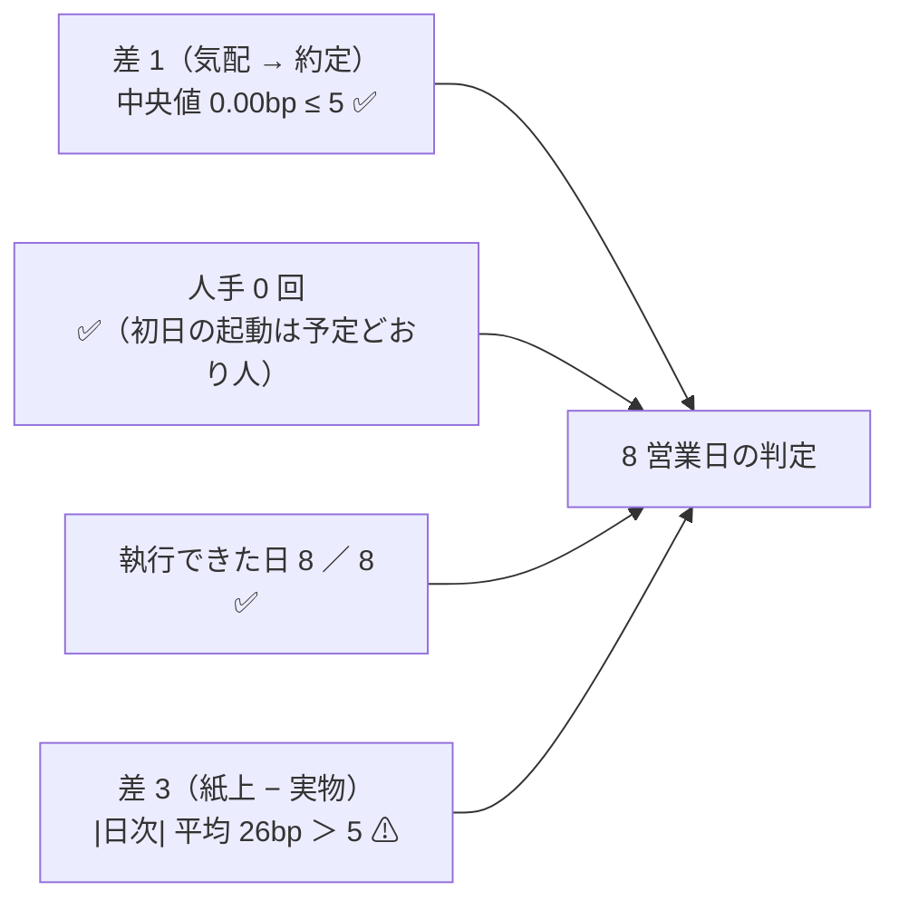
```mermaid
flowchart LR
  A["差 1（気配 → 約定）<br/>中央値 0.00bp ≤ 5 ✅"] --> J["8 営業日の判定"]
  B["人手 0 回<br/>✅（初日の起動は予定どおり人）"] --> J
  C["執行できた日 8 ／ 8<br/>✅"] --> J
  D["差 3（紙上 − 実物）<br/>|日次| 平均 26bp ＞ 5 ⚠"] --> J
```

| 線（§0-2・プラン §2-4） | 結果【実測】 | 判定 | 読み方 |
| --- | --- | --- | --- |
| 差 1 の中央値 ≤ 5bp | 17 本（T1 10 ・ T3 7）の中央値 **0.00bp**。0 でない 7 本 ＝ +0.60 ／ +0.67 ／ +0.83 ／ +1.79 ／ +2.36 ／ −1.48 ／ −1.75（§1） | ✅ | 1〜5 株の成行は、ほぼ中値で約定する。同じ銘柄を 2 人が数秒差で出すと後の人が不利になることがある（9/23 の T3） |
| 紙上 − 実物（差 3）≤ 5bp/日 | `daily.csv`（13500t・`paper.py`）の 8 日: T1 の日次の絶対値の平均 26.2bp（最大 −113.8bp ＝ 9/23）・累計 −193.8bp ／ T3 26.4bp（最大 −113.1bp）・累計 −192.5bp ／ T2 0.0（8 日とも `skip` で紙上も実物も現金） | ⚠ 線を越えた | ⚠ **執行の差ではない**。9/23 の −113bp は、紙上が 9/21 から持っていた（`daily.csv` の T1 の 9/21 に `paper_trades` 5）のに実物は 9/23 から ＝ 9/22〜9/23 の値動きを紙上だけが受けた。2 日目からも、紙上は予算を 5 等分して全部買う形・実物は整数株で予算の約 82% だけを買う形（§1 の 9/23）＝ 下げの期間は実物の損が小さく、差 3 が負に出る【推測。日ごとの分解はしていない】。符号は負 ＝ 実物のほうが損が小さい |
| ↳ そろえた紙上でかけ直し（2026-10-08。[paper-align](../../plans/paper-align.md) の P3 ＝ ⚠ **判定は変えない**） | 同じ記録（13500t の `live.sqlite` の 10/8 08:22 PDT の写し）を新しい `paper.py` で: 差 3（そろえた。`diff3a_bp`）の日次の絶対値の平均 **T1 2.58bp ／ T3 2.25bp**・累計 T1 −20.1bp ／ T3 −11.5bp。0 でない日は売買した日だけ（T1 6 日・T3 3 日）で、最大は 9/23（T1 −14.65 ／ T3 −14.0）＝ 15:50 の気配で買ってから終値までに上がったぶん。売買しない日は 15 ／ 15 が 0.00 ＝ 整数株の株数まで実物と一致 | （参考） | 上の「⚠ 線を越えた」の中身は、始めた日と買う量のずれでほぼ全部説明できた（26bp → 2〜3bp）。残りは執行の差（差 1 ＋ 約定 → 終値）。⚠ 書いた後の数字で線を動かさない ＝ 上の判定は ⚠ のまま。今までの列（`diff3_bp`）は 1 文字も変わらないことを同じ写しで確かめた（53 行） |
| 人手 0 回 | 発注を人が直した日 0。初日（9/23）は利用者が起動（予定どおり）・9/24 は titan の timer（dry-run・意図 0）・9/25 は titan の timer（submit）・9/28〜10/2 は 13500t の cron（submit） | ✅ | 9/25 の titan → 13500t の切り替えは予定した移行（§0-14）で、回の途中の手直しではない |
| 執行できた日 ≥ 95% | 8 ／ 8（`unexecuted` 0・差 4 の事象 0） | ✅ | ⚠ 8 日は 20 日の線の半分以下 ＝ 95% の線は 1 日落とせば越える |

- ⚠ **損益で手法を採らない**（参考に写すだけ）: 累計 紙上 T1 −408.6bp ／ T3 −417.0bp・実物 T1 −214.8bp ／ T3 −224.5bp・持ち続ける（B&H）−444.2bp（予算に対する bp。`daily.csv`）。手じまいの 10/7 までの実現 T1 −$5.53 ／ T3 −$5.42（売買履歴）
- ⚠ 差 3 の線は、紙上と実物の買い方（等分・端数 ／ 整数株）と始めた日がそろっていないと、執行の差を測れない ＝ ✅ 2026-10-08 利用者決定「全部はい」で `paper.py` にそろえた紙上（`aligned_*`・`diff3a_*`）を足した（§0-10 の表の「そろえた紙上」）。新しい 3 人の差 3 はこちらで見る
- 10/7 の手じまい 9 本の差 1 は 8 本 0.00・1 本 +1.09（§1）＝ この表には入れていない

