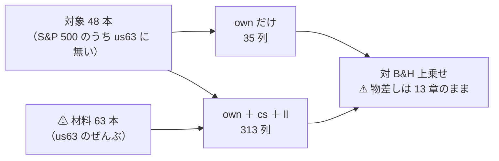

# 段 3: 中位の銘柄を「当てられる側」に置いた【実測 2026-09-12】

- プラン: [midcap-targets.md](../../plans/archive/midcap-targets.md) ／ 検討: [universe-widening.md §9](universe-widening.md)
- 利用者の指示（2026-09-12）: **売買の確実性を担保したいので流動性がある程度あるものとし、大型株や経済指標などのデータに入力値を入れて、その銘柄の予測ができるのかを検証したい**
- 実行: `midcap_own` / `midcap_cs`（各 ＋ `_leak`）＝ 4 本

## 1. 結論

⚠ **大型株を材料に入れると確かに良くなった。だが「良くなった」だけで、どこにも届いていない。**

| 問い | 答え |
| --- | --- |
| 中位の銘柄は自分の履歴だけで当てられるか | ⚠ **当てられない。** θ=55・60 で **5/5 fold が負**・t −3.79／−3.85 |
| 大型株の断面とリードラグを足すと良くなるか | ✅ **良くなる。** θ=50 で −553.6 → **＋119.9bp/fold**（＋673bp の改善） |
| それは意味のある水準か | ⚠ **いいえ。** t 0.46・符号 2/5・DSR 0.086。⚠ **検証期間が 1,718 日しかない** |
| 思わぬ収穫 | ✅ **実効系列数が 9.56**（us63 は 4.19）。⚠ **中位 48 本のほうが互いに相関が低い** |

⚠ **一次情報が予言した向き（大型株が中位を先導する）と符号は合った。** ⚠ **大きさが足りない。**

## 2. 規則 — ⚠ 取得の前に固定した

| # | 規則 | 結果 |
| ---: | --- | --- |
| 1 | S&P 500 の構成銘柄のうち `us63` に無いもの | 出典: [Wikipedia・2026-09-12 取得](https://en.wikipedia.org/wiki/List_of_S%26P_500_companies) |
| 2 | ⚠ **ティッカーのアルファベット順**で先頭 50 本 | ⚠ **成績でも規模でも出来高でも選んでいない** |
| 3 | 2018-06 より前から日足が取れるものだけ | ⚠ **ABNB（2020-12）と AMCR（2019-06）が落ちて 48 本** |
| 4 | 材料は `us63` の 63 本を明示的に渡す | `ll_leaders` に universe の群を指定 |

⚠ **アルファベット順の限界**: 48 本は A と B で尽きており、⚠ **業種の偏りは確かめていない**。
⚠ **偏っていても銘柄を入れ替えない**（入れ替えたら選別になる）。⚠ **限界としてそのまま残す。**

## 3. 何を比べたか — ⚠ 動かした軸は入力だけ

> この図の主張: ⚠ **対象も期間も物差しも同じ。** ⚠ **違うのは「大型株を材料に入れたか」だけ。**

| | `midcap_own` | `midcap_cs` |
| --- | --- | --- |
| 特徴量 | own 35 | own 35 ＋ cs 26 ＋ ll 248 ＝ **313** |
| 期間 | 2018-06-27 〜 2026-09 | ⚠ **`start_date` で揃えた** |
| 行 | 98,253 | 96,912 |
| 検証日数 | 1,718 | 1,711 |

⚠ **期間は `start_date` で揃えた**（揃えないと「層の差」か「期間の差」か分からない）。
⚠ **行数が 1.4% 違うのは `cs`・`ll` の助走ぶん**で、これは消せない。

⚠ **`rel` 層は使っていない**: 48 本の業種の割り当てが ⚠ **48 個の新しい【推測】になる**ため外した。
⚠ **`ex`（経済指標）も入れていない**: 2 つ動かすとどちらが効いたか分からない（13-2 規約 5 の向き）。⚠ **別の実行にする。**

## 4. 結果【実測 2026-09-12】

| θ | `own` だけ | `own+cs+ll` | ⚠ 差 |
| ---: | ---: | ---: | ---: |
| 50 | −553.6（符号 −0000・t −1.00） | ✅ **＋119.9**（＋＋−0−・t ＋0.46） | ⚠ **＋673** |
| 55 | −955.7（⚠ **−−−−−**・t −3.79） | −340.6（＋＋−−−・t −1.46） | ＋615 |
| 60 | −863.8（⚠ **−−−−−**・t −3.85） | −1,044.6（−−−−−・t −2.82） | −181 |

（数字は対 B&H 上乗せ bp/fold。B&H は own 側 ＋1,120.2 ／ cs 側 ＋1,188.8bp/fold）

**乱択ゲートとの差**（[14-6 b](feature-discovery/rules.md)。⚠ **「正しい日を休んだか、ただ休んだだけか」**）:

| θ | `own` だけ | `own+cs+ll` |
| ---: | ---: | ---: |
| 50 | −504.4 | ✅ **＋387.5** |
| 55 | −252.1 | ✅ **＋197.0** |
| 60 | −224.6 | −195.7 |

⚠ **符号が反転している。** ⚠ **own だけでは「ただ休んだだけ」より悪かったが、大型株を足すと上回った**（θ=50・55）。

| # | 読み方 |
| ---: | --- |
| 1 | ⚠ **中位の銘柄は、自分の履歴だけでは大型株より当てにくい。** θ=55・60 で 5/5 fold が負というのは、⚠ **偶然では出にくい形の「はっきりした負け」である**（11 章 規約 2） |
| 2 | ✅ **大型株の断面とリードラグは効いた**。3 閾値のうち 2 つで ＋600bp/fold 以上改善し、⚠ **乱択ゲートとの差も符号が反転した** |
| 3 | ⚠ **それでも t は 0.46。** 検証日数 1,718 日・fold あたり 343 日では、⚠ **この大きさは検出限界の内側に入らない** |
| 4 | ⚠ **θ=60 だけ逆に悪化した**（−181）。⚠ **3 閾値の符号が揃っていない**ので、改善そのものも偶然の範囲を出ない |
| 5 | ✅ **実効系列数 9.56**（us63 の 4.19 に対して）。⚠ **中位 48 本は互いの相関が低い** — 段 1 で低相関 ETF を混ぜて得られなかったものが、⚠ **対象を替えるだけで手に入った** |

## 5. 限界

| # | 限界 | ⚠ 効き方 |
| ---: | --- | --- |
| 1 | ⚠ **検証期間が 1,718 日**（1995 表は 6,336 日） | ⚠ **検出限界が上がる。** 段 3 で何かを言い切るには期間が足りない |
| 2 | ⚠ **生存バイアスが `us63` より深い** | ⚠ **いまの構成銘柄を過去に当てはめた。** 当時 500 に入っていて消えた会社は 1 本も入っていない |
| 3 | ⚠ **効く仕組みが要求と衝突している**（[§9-4](universe-widening.md)） | リードラグの原因は出来高の少なさ・非同期取引。⚠ **S&P 500 の中では、その仕組みが最も薄い** |
| 4 | ⚠ **アルファベット順の業種の偏りを確かめていない** | ⚠ **偏りがあれば「中位の銘柄」ではなく「A と B で始まる会社」の性質を測ったことになる** |
| 5 | ⚠ **分割調整の「要確認」が 12 → 33 件に増えた** | ⚠ **一次情報で確かめるまで直していない。** 偽の段差が検証期間に入りうる |
| 6 | ~~⚠ **`ex`（経済指標）を試していない**~~ | ✅ **2026-09-15 に実施した（[§8](#8-続き-経済指標ex-層を足した実測-2026-09-15)）。** ⚠ **6 行とも落とす。** ⚠ **代わりに「偽薬の対照が無い」が新しい限界として残った**（§8-5） |

## 6. 台帳

| 量 | 前 | 後 |
| --- | ---: | ---: |
| n_trials | 211 | **217**（＋6） |
| 基準線の行 | 128 | 146 |

⚠ **検算**: ✅ **前の 450 行のうち、数字が変わった行 0・消えた行 0** ／ ✅ **leak 対照が跳ねた**（＋25,130・t 17.31 ／ ＋24,916・t 16.97）
／ ✅ **既存 86 銘柄の調整結果が 1 バイトも変わっていない**（指紋 `8a1596a8…` が取得の前後で一致）。

## 7. 次にやるなら

| 候補 | ⚠ 注意 |
| --- | --- |
| ~~⚠ **経済指標（`ex` 層）を足した 3 本目**~~ | ✅ **2026-09-15 に実施（[§8](#8-続き-経済指標ex-層を足した実測-2026-09-15)）。** ⚠ **予想どおり断面には効かず、6 行とも落とす** |
| 対象を増やす（ティッカー順で次の 50 本） | ⚠ **規則はそのまま使える。** 実効系列数が既に 9.56 なので、⚠ **ここは伸びしろがある** |
| 期間を延ばす | ⚠ **断面は全銘柄が揃う期間でしか作れない。** ⚠ **対象を古い銘柄に限ると別の選別になる** |

---

## 8. 続き: 経済指標（`ex` 層）を足した【実測 2026-09-15】

⚠ **利用者の指示のうち未実施だった「経済指標」の部分を回した**（プラン: [midcap-exog.md](../../plans/archive/midcap-exog.md)）。⚠ **6 行（2 実験 × 3 θ）とも「落とす」。**

| | 実行 |
| --- | --- |
| 本番（own ＋ ex・91 列） | `2026-09-15T19-49-55_midcap_ex` |
| ⚠ **期間を揃えた対照**（own だけ・35 列） | `2026-09-15T19-50-01_midcap_own_s1809` |
| leak 対照 | `2026-09-15T19-50-06_midcap_ex_leak` ／ `2026-09-15T19-50-11_midcap_own_s1809_leak` |

⚠ **`ex` は本命の 4 取得元だけ**（ECB 為替 7・米財務省イールド 7・NCEI Storm Events 13・EPU 1 ＝ **28 系列 × 2 変換 ＝ 56 列**）。
⚠ **災害と EPU は 2026-09-09 に取ったのに、これまで 1 度も検証に入っていなかった**（`ex_sources` を指定した既存 config は本命 2 ＋ 偽薬 2 の組み合わせだけ）。

### 8-1. ⚠ 表の頭が 50 営業日落ちた — だから対照を 1 本足した

⚠ **`midcap_ex` の表は 95,856 行・2018-09-10 〜 2026-09-10 になった**（`midcap_own` は 98,253 行・2018-06-27 から）。
⚠ **原因は NCEI Storm Events の `SE_CNT_熱`（熱波の件数）が 2018-04-23 始まり**で、`z20` に 20 本必要なうえ ⚠ **公表の遅れ 120 日をずらす**ため、最初に使える足が 2018-09-09 になること【実測】。

⚠ **このままでは「層の差」か「期間の差」か分からない**ので、⚠ **`start_date = "2018-09-10"` の `own` だけの実行を対照として足した**（⚠ **結果を見る前に決めた**。[daily-data-sources §9-1](daily-data-sources.md) で同じことをしている）。
✅ **2 本の表は 95,856 行で並びまで一致し、own 35 列と `y` はビット差 0。** ⚠ **だから差は層の差として読める。**

### 8-2. 結果 — ⚠ **6 行とも落とす**

⚠ **判定は対 B&H の上乗せ**（13-7）。B&H は **＋990.49bp/fold**（2 本で同じ。同じ行なので当然）。

| θ | own だけ（対照） | own ＋ ex | ⚠ 差（ex − own） | 判定 |
| ---: | ---: | ---: | ---: | --- |
| 50 | −370.17（t −1.24・−0−−＋） | **−129.66**（t −0.93・−0−＋0） | ✅ ＋240.51 | 両方とも落とす |
| 55 | **−81.35**（t −0.13・＋−−−−） | −383.01（t −1.32・−＋−−−） | ⚠ **−301.66** | 両方とも落とす |
| 60 | −909.86（t −1.87・−＋−−−） | **−586.71**（t −1.94・−＋−−−） | ✅ ＋323.15 | 両方とも落とす |

⚠ **事前条件「対照を 3 θ すべてで上回る」は満たさない**（2 勝 1 敗）。⚠ **符号が θ で入れ替わる量に意味を持たせない。**
⚠ **対照の θ=55（−81.35）は、fold 1 の ＋2,240.0bp の 1 本で平均が持ち上がっただけ**（残る 4 fold は −7.2 ・ −965.8 ・ −192.6 ・ −1,481.2）。

### 8-3. ⚠ 予想は当たった — 「断面には効かない」

⚠ **回す前に書いた予想**（プラン §0-1）と、⚠ **実際に見た場所**:

| 予想 | ⚠ 実測 |
| --- | --- |
| 断面の順位は動かない（全銘柄同値） | ⚠ **取引が 578 → 955 回/fold に増え、保有日率も 0.835 → 0.897 に上がった** ＝ 動いたのは「いつ持つか」だけ |
| 効くとすれば「市場全体が下げる日に休む」 | ⚠ **乱択ゲートとの差は ＋4.18 ／ −53.22 ／ ＋188.43bp**（θ 50/55/60）で ⚠ **符号が割れる。** 対照は −88.98 ／ ＋406.25 ／ −33.31 で ⚠ **こちらも割れる** ＝ ⚠ **どちらも「休む日を当てた」証拠にならない** |
| 効きは検出限界の内側 | ⚠ **t は −0.93 〜 −1.94。** DSR は 0.007〜0.158（`n_trials` 571） |
| 良い数字が出たら偽薬を疑う | ⚠ **良い数字は出なかった**ので出番は無かった。⚠ **ただし偽薬の対照を回していないことは限界のまま**（§8-5） |

⚠ **入力を増やした効果として唯一「良くなった」と言えるのは、門と IC の小ささである**: 門の AUC **0.4915 → 0.5143**、IC **−0.0032 → ＋0.0061**、的中率 0.5116 → 0.5137。
⚠ **どれも 0.5 の近傍で、売買の成績（上乗せ）には変わっていない。** ⚠ **門は 2 本とも門前**（AUC 0.52 未満・買い% 幅 1.3／4.2 点）。

### 8-4. leak 対照 — ⚠ **跳ねた（配線は健全）**

| 実験 | 上乗せ（3 θ） | t | fold の符号 | 門 |
| --- | ---: | ---: | :---: | --- |
| `midcap_ex` | ＋24,841.62 〜 ＋24,842.43bp | 15.53 | ＋＋＋＋＋ | AUC 1.000・幅 100 点 |
| `midcap_own_s1809` | 同上（⚠ **1 バイトも違わない**） | 15.53 | ＋＋＋＋＋ | 同上 |

⚠ **2 本の leak が完全に一致したのは、`LEAK_future_ret` が他の 35／91 列を圧倒するから**【推測】。⚠ **配線の検査としては期待どおり**（段 3 の ＋25,130／＋24,916bp と同じ範囲）。

### 8-5. 検算と限界

| # | 検算 | 結果 |
| ---: | --- | --- |
| 1 | `pytest -q tests` | ✅ **313 件 pass**（⚠ **コードは 1 行も変えていない。足したのは config 2 本だけ**） |
| 2 | 本番と対照の表が 1 行も違わない | ✅ 95,856 行・並びまで一致・own 35 列と `y` はビット差 0 |
| 3 | `ex_` の列 | ✅ **56 列・28 系列・定数の列 0・欠損 0** |
| 4 | 基準線（B&H・直前符号）が 2 本で一致 | ✅ **15 行 × 2 本で数値列の差 0**（⚠ **乱択（基準）は列の集合が違うので一致しない** — 91 列から 16 本引くか 35 列から引くかの差） |
| 5 | leak が跳ねる | ✅ §8-4 |
| 6 | **n_trials 565 → 571**（＋6） | ✅ 一致（落とす **487 → 493 行**・保留 78 行は変わらず） |
| 7 | 台帳の既存行 | ✅ **前の 1,984 行のうち、変わったのは件数を書いた 4 行だけ**（足されたのは 56 行） |
| 8 | 較正 | ✅ 4 実行とも `std` |

⚠ **各実行の `checks.json` に載る `n_trials` は 568（本番）と 571（対照）で違う。** ⚠ **台帳を読む時点が違うため**で、⚠ **正本は台帳の 571**（13-9 の注記どおり、その実行の行はもう台帳に入っている）。

| # | ⚠ 限界（消せないもの） |
| ---: | --- |
| 1 | ⚠ **偽薬（気象・地震）の対照を回していない。** ⚠ **系列が 2026-09-01 で止まっており、引き継ぎ上限 7 日で表の尻が 1 週間短くなる**ので、同じ期間で並べられなかった。⚠ **だから「本命が効いた／効かなかった」は、この実験だけでは偽薬と区別できない**（今回は効いていないので結論は変わらない） |
| 2 | ⚠ **災害は 120 日ずらして使っている** ＝ 実質「4 か月前の災害」。⚠ **ずらし幅を変えた対照は回していない**（別の試行） |
| 3 | ⚠ **検証期間が 1,718 → 約 1,670 日にさらに短くなった**（頭が 50 営業日落ちた）。⚠ **検出限界はむしろ上がった** |
| 4 | 生存バイアス・業種の偏り・分割調整の「要確認」33 件は §5 のまま |

### 8-6. 費用【実測 2026-09-15】

| 項目 | 見積り【推測】 | ⚠ 実測 |
| --- | ---: | ---: |
| 表 4 本（本番・対照 × 本番/leak） | 10〜30 分 | ⚠ **1 本あたり約 1 分** |
| 実行 4 本 | 5〜20 分 | ⚠ **合計 22 秒**（19:49:54 → 19:50:16） |
| コード | — | ⚠ **0 行**（config 2 本だけ） |

⚠ **見積りはまた過大に外した**（8 回目）。⚠ **Ridge × 96k 行 × 91 列は、GPU の学習と違って「測るまでもなく安い」。**
