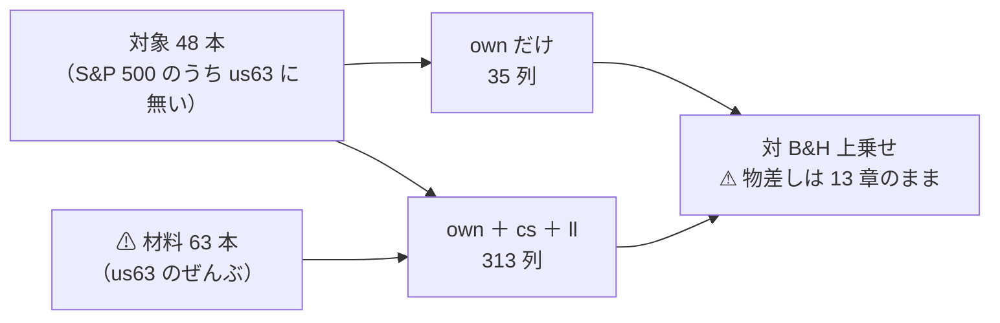

# 段 3: 中位の銘柄を「当てられる側」に置いた【実測 2026-09-12】

- プラン: [midcap-targets.md](../../plans/archive/midcap-targets.md) ／ 検討: [universe-widening.md §9](universe-widening.md)
- 利用者の指示（2026-09-12）: **売買の確実性を担保したいので流動性がある程度あるものとし、大型株や経済指標などのデータに入力値を入れて、その銘柄の予測ができるのかを検証したい**
- 実行: `midcap_own` / `midcap_cs`（各 ＋ `_leak`）＝ 4 本

## 1. 結論

⚠ **大型株を材料に入れると確かに良くなった。だが「良くなった」だけで、どこにも届いていない。**

| 問い | 答え |
| --- | --- |
| 中位の銘柄は自分の履歴だけで当てられるか | ⚠ **当てられない。** θ=55・60 で **5/5 fold が負**・t −3.79／−3.85 |
| 大型株の断面とリードラグを足すと良くなるか | ✅ **良くなる。** θ=50 で −553.6 → **＋119.9bp/fold**（＋673bp の改善） |
| それは意味のある水準か | ⚠ **いいえ。** t 0.46・符号 2/5・DSR 0.086。⚠ **検証期間が 1,718 日しかない** |
| 思わぬ収穫 | ✅ **実効系列数が 9.56**（us63 は 4.19）。⚠ **中位 48 本のほうが互いに相関が低い** |

⚠ **一次情報が予言した向き（大型株が中位を先導する）と符号は合った。** ⚠ **大きさが足りない。**

## 2. 規則 — ⚠ 取得の前に固定した

| # | 規則 | 結果 |
| ---: | --- | --- |
| 1 | S&P 500 の構成銘柄のうち `us63` に無いもの | 出典: [Wikipedia・2026-09-12 取得](https://en.wikipedia.org/wiki/List_of_S%26P_500_companies) |
| 2 | ⚠ **ティッカーのアルファベット順**で先頭 50 本 | ⚠ **成績でも規模でも出来高でも選んでいない** |
| 3 | 2018-06 より前から日足が取れるものだけ | ⚠ **ABNB（2020-12）と AMCR（2019-06）が落ちて 48 本** |
| 4 | 材料は `us63` の 63 本を明示的に渡す | `ll_leaders` に universe の群を指定 |

⚠ **アルファベット順の限界**: 48 本は A と B で尽きており、⚠ **業種の偏りは確かめていない**。
⚠ **偏っていても銘柄を入れ替えない**（入れ替えたら選別になる）。⚠ **限界としてそのまま残す。**

## 3. 何を比べたか — ⚠ 動かした軸は入力だけ

> この図の主張: ⚠ **対象も期間も物差しも同じ。** ⚠ **違うのは「大型株を材料に入れたか」だけ。**

| | `midcap_own` | `midcap_cs` |
| --- | --- | --- |
| 特徴量 | own 35 | own 35 ＋ cs 26 ＋ ll 248 ＝ **313** |
| 期間 | 2018-06-27 〜 2026-09 | ⚠ **`start_date` で揃えた** |
| 行 | 98,253 | 96,912 |
| 検証日数 | 1,718 | 1,711 |

⚠ **期間は `start_date` で揃えた**（揃えないと「層の差」か「期間の差」か分からない）。
⚠ **行数が 1.4% 違うのは `cs`・`ll` の助走ぶん**で、これは消せない。

⚠ **`rel` 層は使っていない**: 48 本の業種の割り当てが ⚠ **48 個の新しい【推測】になる**ため外した。
⚠ **`ex`（経済指標）も入れていない**: 2 つ動かすとどちらが効いたか分からない（13-2 規約 5 の向き）。⚠ **別の実行にする。**

## 4. 結果【実測 2026-09-12】

| θ | `own` だけ | `own+cs+ll` | ⚠ 差 |
| ---: | ---: | ---: | ---: |
| 50 | −553.6（符号 −0000・t −1.00） | ✅ **＋119.9**（＋＋−0−・t ＋0.46） | ⚠ **＋673** |
| 55 | −955.7（⚠ **−−−−−**・t −3.79） | −340.6（＋＋−−−・t −1.46） | ＋615 |
| 60 | −863.8（⚠ **−−−−−**・t −3.85） | −1,044.6（−−−−−・t −2.82） | −181 |

（数字は対 B&H 上乗せ bp/fold。B&H は own 側 ＋1,120.2 ／ cs 側 ＋1,188.8bp/fold）

**乱択ゲートとの差**（[14-6 b](feature-discovery/rules.md)。⚠ **「正しい日を休んだか、ただ休んだだけか」**）:

| θ | `own` だけ | `own+cs+ll` |
| ---: | ---: | ---: |
| 50 | −504.4 | ✅ **＋387.5** |
| 55 | −252.1 | ✅ **＋197.0** |
| 60 | −224.6 | −195.7 |

⚠ **符号が反転している。** ⚠ **own だけでは「ただ休んだだけ」より悪かったが、大型株を足すと上回った**（θ=50・55）。

| # | 読み方 |
| ---: | --- |
| 1 | ⚠ **中位の銘柄は、自分の履歴だけでは大型株より当てにくい。** θ=55・60 で 5/5 fold が負というのは、⚠ **偶然では出にくい形の「はっきりした負け」である**（11 章 規約 2） |
| 2 | ✅ **大型株の断面とリードラグは効いた**。3 閾値のうち 2 つで ＋600bp/fold 以上改善し、⚠ **乱択ゲートとの差も符号が反転した** |
| 3 | ⚠ **それでも t は 0.46。** 検証日数 1,718 日・fold あたり 343 日では、⚠ **この大きさは検出限界の内側に入らない** |
| 4 | ⚠ **θ=60 だけ逆に悪化した**（−181）。⚠ **3 閾値の符号が揃っていない**ので、改善そのものも偶然の範囲を出ない |
| 5 | ✅ **実効系列数 9.56**（us63 の 4.19 に対して）。⚠ **中位 48 本は互いの相関が低い** — 段 1 で低相関 ETF を混ぜて得られなかったものが、⚠ **対象を替えるだけで手に入った** |

## 5. 限界

| # | 限界 | ⚠ 効き方 |
| ---: | --- | --- |
| 1 | ⚠ **検証期間が 1,718 日**（1995 表は 6,336 日） | ⚠ **検出限界が上がる。** 段 3 で何かを言い切るには期間が足りない |
| 2 | ⚠ **生存バイアスが `us63` より深い** | ⚠ **いまの構成銘柄を過去に当てはめた。** 当時 500 に入っていて消えた会社は 1 本も入っていない |
| 3 | ⚠ **効く仕組みが要求と衝突している**（[§9-4](universe-widening.md)） | リードラグの原因は出来高の少なさ・非同期取引。⚠ **S&P 500 の中では、その仕組みが最も薄い** |
| 4 | ⚠ **アルファベット順の業種の偏りを確かめていない** | ⚠ **偏りがあれば「中位の銘柄」ではなく「A と B で始まる会社」の性質を測ったことになる** |
| 5 | ⚠ **分割調整の「要確認」が 12 → 33 件に増えた** | ⚠ **一次情報で確かめるまで直していない。** 偽の段差が検証期間に入りうる |
| 6 | ⚠ **`ex`（経済指標）を試していない** | 利用者の指示のうち「経済指標」の部分は ⚠ **未実施のまま** |

## 6. 台帳

| 量 | 前 | 後 |
| --- | ---: | ---: |
| n_trials | 211 | **217**（＋6） |
| 基準線の行 | 128 | 146 |

⚠ **検算**: ✅ **前の 450 行のうち、数字が変わった行 0・消えた行 0** ／ ✅ **leak 対照が跳ねた**（＋25,130・t 17.31 ／ ＋24,916・t 16.97）
／ ✅ **既存 86 銘柄の調整結果が 1 バイトも変わっていない**（指紋 `8a1596a8…` が取得の前後で一致）。

## 7. 次にやるなら

| 候補 | ⚠ 注意 |
| --- | --- |
| ⚠ **経済指標（`ex` 層）を足した 3 本目** | 利用者の指示の未実施部分。⚠ **`ex` は全銘柄で同じ値**なので断面の順位には効かない（効くなら市場全体の方向） |
| 対象を増やす（ティッカー順で次の 50 本） | ⚠ **規則はそのまま使える。** 実効系列数が既に 9.56 なので、⚠ **ここは伸びしろがある** |
| 期間を延ばす | ⚠ **断面は全銘柄が揃う期間でしか作れない。** ⚠ **対象を古い銘柄に限ると別の選別になる** |
