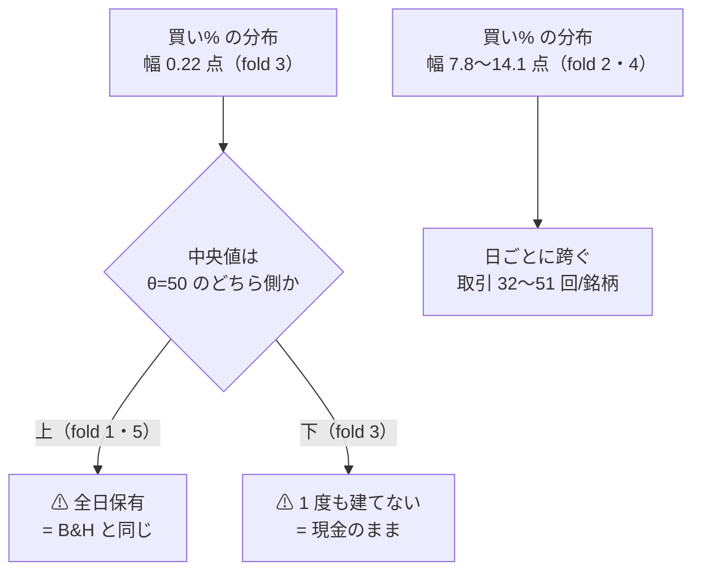
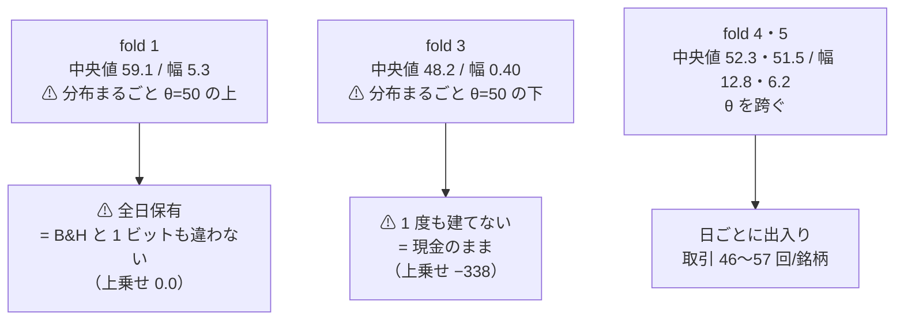

# MLP × 閾値売買（own / ownex・2018）— モデルの軸の空白を埋めた

⚠ **結論: 12 行（2 表 × 2 形式 × 3 θ）とも「落とす」。** ⚠ **だが空白は埋まり、⚠ 「MLP は未実施」と「MLP は効かない」を区別できるようになった。**

| 表 | 実施日 | 節 | 判定 |
| --- | --- | --- | --- |
| **own**（自分の履歴だけ・63 銘柄 × 35 列） | 2026-09-13 | §0〜§7 | ⚠ **6 行とも落とす**（上乗せ −68 〜 −1,017bp） |
| **ownex**（own cs rel ex・48 社 × 124 列） | 2026-09-13 | **§8** | ⚠ **6 行とも落とす**（上乗せ −312 〜 −703bp） |

プラン: [own 分](../../plans/archive/mlp-threshold-trading.md) ／ [ownex 分](../../plans/archive/mlp-threshold-ownex.md) ／ 規約: [rules.md 13 章](feature-discovery/rules.md)（閾値つき売買）・[14-10](feature-discovery/rules.md)（空白は積極的に埋める）／ 台帳: [ledger.md](feature-discovery/ledger.md)

> ⚠ **これは投資助言ではなく調査資料である。** ⚠ **数字はすべて【実測】**（2026-09-13）。
> ⚠ **own と ownex の数字を直接比べない**（[13-8](feature-discovery/rules.md)。表・対象・列数・k がすべて違う）。

---

## 0. 何をやったか

閾値売買（対 B&H 上乗せで測る新しい物差し）で回したモデルは **Ridge と LightGBM の 2 つだけ**で、
⚠ **MLP は毎日往復に 4 行あるきりだった**。⚠ **その空白 1 つだけを埋めた。**

| | 回した本数 | 実行 |
| --- | ---: | --- |
| 本番 | 2 | `2026-09-13T09-59-21_trade_own_mlp_a`（形式 A 共通）／ `2026-09-13T09-59-47_trade_own_mlp_b`（形式 B 銘柄別） |
| leak 対照 | 2 | `2026-09-13T10-02-22_trade_own_mlp_a_leak` ／ `2026-09-13T10-02-47_trade_own_mlp_b_leak` |

⚠ **回すと決めたのは結果を見る前**（[14-10 規約 3](feature-discovery/rules.md)。固定した内容はプラン §0-1）。
⚠ **数えた試行は 2 形式 × 3 θ ＝ 6。** `n_trials` **409 → 415**（⚠ **事前の見積もりと一致**）。

⚠ **コードは 1 行も書いていない。** 足したのは config 2 本だけ（`trade_own_mlp_a.toml` / `trade_own_mlp_b.toml`）で、
⚠ **既存の `trade_own_lgbm_*.toml` と `model` 以外は 1 文字も違わない**（表・fold・θ・選別・k・種・コスト）。
⚠ **だから差はモデルの差として読める**（[13-8](feature-discovery/rules.md) の橋渡しの形）。

> この図の主張: ⚠ **既存の経路のうち差し替わったのは「モデル」の箱 1 つだけである。**

---

## 1. ⚠ 予測のスケールは正常だった — 潰れていたのは較正のほうだった

⚠ **MLP の予測のスケールは 1 度も測っていなかった**ので、本番の前に `cli/calibdiag.py` で測った
（⚠ **診断であって、回すかどうかの判断には使っていない** — 14-10 規約 1）。出力は `out/diag/2026-09-13T09-58-57_mlp`。

| 列 | 実測（形式 A・5 fold × 2 選別） | 読み |
| --- | --- | --- |
| `pred_std` | **0.00087 〜 0.0030** | ⚠ **Ridge と同じ尺度**。`deep.py` が y を標準化して学習し `× ysd` で戻すので、日次リターンの尺度（σ ≈ 0.0017）に戻っている |
| `反復_旧` | ⚠ **10 行すべて 2** | ⚠ **旧の解き方なら MLP でも 1 反復で止まっていた**。⚠ **2026-09-12 の処置がここにも効いている**（[buy-pct-width-collapse.md](buy-pct-width-collapse.md)） |
| `a_std` | 1.83 〜 120.8（符号は fold で割れる） | 直した較正では傾きが立つ |
| `width_te_std` | **0.22 〜 14.05 点**（中央 3.4） | ⚠ **門の要求 20 点には届かない**（13-2 の注記どおり） |
| `auc_fit` | 0.470 〜 0.528 | ⚠ **門の要求 0.52 に届かない fold のほうが多い** |

⚠ **つまり MLP は「予測が定数に潰れていて測れない」のではない。** ⚠ **予測は散っており、較正も解けている。**
⚠ **それでも AUC が 0.5 の近傍から動かない**というだけである。⚠ **これは「測れない」（14-2）ではないので、回す対象になる。**

---

## 2. 結果 — ⚠ **6 行とも「落とす」**

⚠ **判定は対 B&H の上乗せ**（[13-7](feature-discovery/rules.md)）。⚠ **純利の符号では「買って持っただけ」と区別できない。**
B&H は **＋1,652.02bp/fold**。

| 形式 | θ | 純利 bp/fold | ⚠ **上乗せ bp/fold** | t | fold の符号 | 取引/fold | 保有日率 | DSR | 判定 |
| --- | ---: | ---: | ---: | ---: | :---: | ---: | ---: | ---: | --- |
| (A) 共通 | 50 | ＋1,583.93 | **−68.09** | −0.47 | 0＋−−＋ | 1,074 | 0.730 | 0.126 | **落とす** |
| (A) 共通 | 55 | ＋1,122.51 | **−529.51** | −1.18 | 0＋−−− | 152 | 0.558 | 0.057 | **落とす** |
| (A) 共通 | 60 | ＋847.96 | **−804.05** | −1.53 | ＋−−−− | 56 | 0.353 | 0.041 | **落とす** |
| (B) 銘柄別 | 50 | ＋804.01 | **−848.01** | −3.86 | −−−−− | 1,842 | 0.556 | 0.041 | **落とす** |
| (B) 銘柄別 | 55 | ＋768.11 | **−883.91** | −3.81 | −−−−− | 781 | 0.491 | 0.043 | **落とす** |
| (B) 銘柄別 | 60 | ＋635.52 | **−1,016.50** | −3.26 | −−−−− | 571 | 0.369 | 0.035 | **落とす** |

⚠ **純利はどれも正だが、それは B&H が正だからである**（[13-7](feature-discovery/rules.md) が「純利の符号で判定しない」と定めた理由がそのまま出ている）。

### 2-1. ⚠ (A) は fold 単位で「全部持つ / 全部休む」に潰れている

⚠ **fold 1 の上乗せがちょうど `0.0` なのは偶然ではない。** ⚠ **63 銘柄すべてが全日保有になり、B&H と 1 ビットも違わなかった。**
⚠ **「上乗せ 0」は「B&H と同じことをした」という意味であって、「引き分けた」ではない。**

`per_symbol.csv`（(A) θ=50・全部使う）の実測。

| fold | 取引回数（銘柄あたり） | 保有日率 | 診断の買い% 中央値（§1） | 診断の幅 |
| ---: | ---: | ---: | ---: | ---: |
| 1 | **1.0**（建てて fold 末尾まで） | **1.000** | 56.8 | 3.57 |
| 2 | 51.1（34〜81） | 0.800 | 52.5 | 14.05 |
| 3 | **0.0** | ⚠ **0.000**（1 度も建てない） | 48.0 | ⚠ **0.22** |
| 4 | 32.0（1〜85） | 0.851 | 52.4 | 7.82 |
| 5 | 1.1 | **1.000** | 52.2 | ⚠ **0.35** |

> この図の主張: ⚠ **買い% の幅が θ の帯より狭いと、fold 全体が片側に乗って売買が「全部持つ / 全部休む」の 2 択になる。**

⚠ **幅が 1 点を切る fold（3・5）では、買い% の分布まるごとが θ=50 の片側に乗る。**
⚠ **その fold の売買は「日々の信号」ではなく「分布の中央値が 50 のどちら側か」だけで決まっている。**
⚠ **これは MLP の欠陥ではなく、AUC ≈ 0.5 の予測を Platt 較正した結果として正しい振る舞いである**
（[13-2 の注記](feature-discovery/rules.md): 直しても幅は 20 点に届かない）。⚠ **(A) の θ 別の数字を「閾値の効き」として読まない。**

### 2-2. ⚠ (B) 銘柄別のほうが 1 桁悪い — これは MLP に限らない

| モデル | (A) 共通 θ=50 の上乗せ | (B) 銘柄別 θ=50 の上乗せ |
| --- | ---: | ---: |
| Ridge | −270.9（t −1.13） | −894.1（t −4.44） |
| LightGBM | −142.1（t −1.77） | −915.2（t −3.70） |
| **MLP** | **−68.1（t −0.47）** | **−848.0（t −3.86）** |

⚠ **3 モデルとも同じ向きに壊れる。** ⚠ **モデルの性質ではなく形式 (B) の性質である**（訓練が 1 銘柄ぶんに痩せる。[13-6 の 5](feature-discovery/rules.md)）。

---

## 3. ⚠ 3 モデルを横に並べる — ⚠ **MLP がいちばん「負けが小さい」が、勝ってはいない**

⚠ **同じ表・同じ fold・同じ θ・同じ選別・同じ種で、モデルだけが違う 3 組**（13-8 の橋渡しの形が成立している唯一の並べ方）。

| モデル | θ=50 | θ=55 | θ=60 |
| --- | ---: | ---: | ---: |
| Ridge (A) | −270.9 | −540.2 | −943.7 |
| LightGBM (A) | −142.1 | −417.3 | −1,254.6 |
| **MLP (A)** | **−68.1** | **−529.5** | **−804.1** |

⚠ **「MLP がいちばんまし」と読んではいけない。**

- ⚠ **3 モデルとも全 θ で負けている。** 順位が入れ替わっても、⚠ **上に B&H があることは変わらない**
- ⚠ **θ で順位が入れ替わる**（θ=55 では MLP が LightGBM に負ける）。⚠ **順位が安定していない量に意味を持たせない**
- ⚠ **MLP (A) θ=50 の −68bp は t −0.47 ＝ 検出限界の内側**。⚠ **「B&H と区別がつかない」であって「B&H に近い実力がある」ではない**
- ⚠ **保有日率 0.730 で B&H（1.000）に近い**。⚠ **ほとんど持ちっぱなしなら B&H に近い数字が出るのは当たり前である**（[edge-drift-bias.md](edge-drift-bias.md) で測った穴と同じ形）

### 3-1. ⚠ 乱択ゲートにも勝っていない

[14-6 (b)](feature-discovery/rules.md) の基準線（⚠ **同じ保有日数だけでたらめに休む**）と比べる。

| 形式 | θ=50 の手法 純利 | 乱択ゲート 純利 | 差 |
| --- | ---: | ---: | ---: |
| (A) 共通 | ＋1,583.93 | ＋1,457.81 | ⚠ **＋126.11**（t 0.77・符号 2/5） |
| (B) 銘柄別 | ＋804.01 | ＋741.65 | ⚠ **＋62.36**（t 0.50・符号 3/5） |

⚠ **どちらも t は 1 に届かない。** ⚠ **「正しい日を休んだ」と「ただ休んだ」を分離できていない。**

---

## 4. leak 対照 — ⚠ **跳ねた（配線は健全）**

| 実行 | θ=50 の上乗せ | t | fold の符号 | θ=55 | θ=60 |
| --- | ---: | ---: | :---: | ---: | ---: |
| (A) leak | ⚠ **＋22,176.83bp** | 17.12 | ＋＋＋＋＋ | ＋22,178.48 | ＋22,179.40 |
| (B) leak | ⚠ **＋21,709.72bp** | 17.56 | ＋＋＋＋＋ | ＋21,703.74 | ＋21,694.20 |

⚠ **本番で負けているのは配線の不具合ではない**（[13-10](feature-discovery/rules.md)）。⚠ **未来を混ぜれば同じ経路がちゃんと跳ねる。**
既存 12 対の実測（＋16,108〜25,131bp・t 7.9〜27.0）と同じ範囲にある。

### 4-1. ⚠ 副次の検査: 基準線が既存の実行と 1 ビットも違わなかった

台帳を吐き直したとき、⚠ **B&H と「直前リターンの符号」の 12 行が「2 実行・一致」→「3 実行・一致」に変わっただけ**で、
⚠ **数字は 1 つも動かなかった**（変わったのは `再現` 列と代表実行 ID の 2 列のみ）。

⚠ **これは fold の切れ目（日付）・シミュレータ・コストの数え方が Ridge / LightGBM の実行とまったく同じだったことの証拠である。**
⚠ **モデルだけを差し替えたという主張（13-8 の橋渡し）が、台帳の側からも裏づけられた。**

---

## 5. ⚠ 回す前に書いた失敗モードのうち、実在したもの

⚠ **プラン §6 に「結果を見る前」に書いたもの。**

### 5-1. ⚠ **実在した**: (B) fold 1 は 63 銘柄すべてが訓練予測で較正された

`fitted/calibration_f1.json` の実測。

| fold | 較正元 | ⚠ 傾き `|a|` の中央値 |
| ---: | --- | ---: |
| 1 | ⚠ **`train` 63 銘柄（holdout 0）** | ⚠ **353.07** |
| 2 | `holdout` 62 ／ `train` 1 | 20.77 |
| 3〜5 | `holdout` 63 | 77.6 〜 111.8 |

⚠ **fold 1 は約 360 行/銘柄しかなく `MIN_TRAIN` 500 を割るので `tail_holdout` が切れない**（`ail/models/holdout.py`）。
⚠ **その結果 (a) 較正が in-sample になり、(b) MLP の早期打ち切りも効かない**（200 epoch 回り切る）。
⚠ **傾きが fold 1 だけ 3〜17 倍大きいのは、in-sample の過信がそのまま出た形である。**
⚠ **消せない限界としてそのまま記録する**（[13-6 の 5](feature-discovery/rules.md)）。⚠ **(B) の数字を (A) と直接比べない。**

### 5-2. ⚠ **実在しなかった**: 「予測が定数に潰れる」

§1 のとおり `pred_std` は Ridge と同じ尺度だった。⚠ **MLP 特有の潰れ方は無い。**

### 5-3. ⚠ **見積もりを外した**: (B) は 20〜40 分ではなく **2 分 36 秒**だった

| 本 | 見積り【推測】 | ⚠ 実測 |
| --- | ---: | ---: |
| (A) 本番 | 数分 | **12.5 秒** |
| (B) 本番 | 20〜40 分 | ⚠ **2 分 36 秒** |
| (A) leak | 数分 | 24.9 秒 |
| (B) leak | 20〜40 分 | ⚠ **4 分 00 秒** |
| 合計 | 1〜1.5 時間 | ⚠ **7 分 13 秒** |

⚠ **外した理由: 1 fit あたりのオーバーヘッドを数百 ms と見たが、実際は 3090 Ti で 1 桁小さかった**（(B) は 1,260 fit で 156 秒 ＝ **1 fit 124ms**）。
⚠ **1,260 fit という数え方は正しかったので、次に (B) 形式の GPU 系を見積もるときはこの実測を使う。**
⚠ **leak のほうが 1.5 倍遅いのは、未来の列で損失が下がり続けて早期打ち切りが効かないから**【推測】。

---

## 6. 台帳への反映と検算

| # | 検算 | 結果 |
| ---: | --- | --- |
| 1 | `pytest -q tests` | ✅ **276 件 pass**（回す前・回した後とも） |
| 2 | ⚠ **回す前の台帳の行が 1 行も消えず 1 バイトも変わらない** | ✅ **既存 648 行のうち消えた鍵 0・数字が変わった鍵 0**。⚠ **足されたのは 12 行**（試行 6 ＋ 乱択の基準線 6）。⚠ **既存行で動いたのは基準線 12 行の `再現` 列と代表実行 ID だけ**（§4-1） |
| 3 | ⚠ **leak 対照が跳ねる** | ✅ (A) ＋22,177bp t 17.12 ／ (B) ＋21,710bp t 17.56（どちらも 5/5） |
| 4 | **n_trials 409 → 415**（＋6） | ✅ 一致（`checks.json` の `dsr.n_trials` が 415） |
| 5 | `checks.json` の `calibration` が `std` | ✅ 4 実行とも `std` |
| 6 | ⚠ **表の指紋が既存 4 本と一致** | ✅ `own_2018/d.parquet` 135,962 行 × 35 列 × 63 銘柄・`raw 81ade06ba58c8e42` / `adjusted 1a9c6d15374af248` が Ridge・LightGBM の実行と同一 |
| 7 | ⚠ **3 θ とも台帳に載る** | ✅ 6 行すべて（良かった閾値だけ報告していない） |

⚠ **代償の実測**: `n_trials` 409 → 415 で **SR0 は 0.070493 → 0.070598（＋0.15%）**（2018 表・n_obs 1,801 日）。
⚠ **[14-10](feature-discovery/rules.md) の表と同じ向きで、動きは小さい。** ⚠ **台帳の総数は 落とす 333 → 339 行・保留 76 行（変わらず）・採る 0 件。**

---

## 7. ⚠ 残ったもの・広げていないもの

| | 状態 |
| --- | --- |
| MLP × 閾値売買 × **ownex**（own ＋ cs ＋ rel ＋ ex） | ✅ **2026-09-13 に埋めた（§8）。** ⚠ **6 行とも落とす** |
| **GAN 増強 3 種 × 閾値売買** | ⚠ **未実施**（親タスクの手間「大」。見積り 1 本 1.5〜2 時間 × leak）。⚠ **その見積りは §5-3 と同じ作り方なので過大な可能性がある。回すときに測り直す**（⚠ **§8-5 で 1 fit 124ms が別の表でも再現したので、fit 数から引く方法自体は使える**） |
| **LightGBM × 選別 2 本**（F3-3 MDA・F3-1 Lasso）／ **LightGBM × 断面**（own cs rel ll） | ⚠ **未実施**（親タスクの手間「小」） |

⚠ **本タスクは検出限界を改善しない。** fold 360 日 × 5 では上乗せ t は 1 前後までしか出ない
（[validation-power.md](feature-discovery/validation-power.md)）。⚠ **(A) の t −0.47 は「勝っていない」であって「引き分けを検出した」ではない。**

---

# 8. ownex（own cs rel ex・48 社）— ⚠ **6 行とも「落とす」**

プラン: [mlp-threshold-ownex.md](../../plans/archive/mlp-threshold-ownex.md)。⚠ **回すと決めたのは結果を見る前**（プラン §0-1）。
⚠ **数えた試行は 2 形式 × 3 θ ＝ 6。** `n_trials` **415 → 421**（⚠ **事前の見積もりと一致**）。

⚠ **ここでもコードは 1 行も書いていない。** 足したのは config 2 本だけで、
⚠ **既存の `trade_ownex_lgbm_*.toml` と `model`（と `name`）以外は 1 key も違わない**【実測。`tomllib` で全 key を突き合わせた】。

| | 回した本数 | 実行 |
| --- | ---: | --- |
| 本番 | 2 | `2026-09-13T10-20-10_trade_ownex_mlp_a`（形式 A 共通）／ `2026-09-13T10-20-26_trade_ownex_mlp_b`（形式 B 銘柄別） |
| leak 対照 | 2 | `2026-09-13T10-22-32_trade_ownex_mlp_a_leak` ／ `2026-09-13T10-22-58_trade_ownex_mlp_b_leak` |

## 8-1. 診断 — ⚠ **ここでも予測は潰れていない**

`out/diag/2026-09-13T10-19-51_mlp_ownex`（⚠ **診断であって、回すかどうかの判断には使っていない** — 14-10 規約 1）。

| 列 | 実測（形式 A・5 fold × 2 選別） | own（§1）との比較 |
| --- | --- | --- |
| `pred_std` | **0.0010 〜 0.0041** | ⚠ **own（0.00087〜0.0030）とほぼ同じ尺度。** 列が 35 → 124 に増えても潰れない |
| `反復_旧` | ⚠ **10 行中 9 行が 2** | own と同じ（⚠ **旧の解き方なら止まっていた**） |
| `auc_fit` | 0.455 〜 0.535 | ⚠ **own（0.470〜0.528）と同じ帯。** ⚠ **列を 3.5 倍にしても AUC は 0.5 の近傍から動かない** |
| `width_te_std` | **0.08 〜 15.8 点**（中央 5.6） | ⚠ **門の要求 20 点には届かない**（13-2 の注記） |
| 較正元 | ⚠ **10 行すべて `holdout`** | (A) は行をプールするので `MIN_TRAIN` を割らない |

## 8-2. 結果

B&H は **＋1,650.62bp/fold**（own の ＋1,652.02 とは別の数字。⚠ **対象が 63 銘柄 → 48 社だから**）。

| 形式 | θ | 純利 bp/fold | ⚠ **上乗せ bp/fold** | t | fold の符号 | 取引/fold | 保有日率 | DSR | 判定 |
| --- | ---: | ---: | ---: | ---: | :---: | ---: | ---: | ---: | --- |
| (A) 共通 | 50 | ＋1,175.02 | **−475.59** | −1.95 | 0−−−− | 1,183 | 0.698 | 0.049 | **落とす** |
| (A) 共通 | 55 | ＋1,338.73 | **−311.88** | −0.94 | 0−−−＋ | 115 | 0.730 | 0.071 | **落とす** |
| (A) 共通 | 60 | ＋948.10 | **−702.52** | −2.19 | −−−−− | 36 | 0.494 | 0.043 | **落とす** |
| (B) 銘柄別 | 50 | ＋1,058.09 | **−592.52** | −2.00 | ＋−−−− | 1,512 | 0.542 | 0.106 | **落とす** |
| (B) 銘柄別 | 55 | ＋1,141.21 | **−509.40** | −1.83 | ＋−＋−− | 792 | 0.503 | 0.162 | **落とす** |
| (B) 銘柄別 | 60 | ＋1,048.89 | **−601.73** | −2.00 | ＋−−−− | 647 | 0.368 | 0.185 | **落とす** |

⚠ **純利はどれも正だが、それは B&H が正だからである**（[13-7](feature-discovery/rules.md)）。

### 8-2-1. ⚠ (A) は own とまったく同じ壊れ方をした

⚠ **fold 1 の上乗せがちょうど `0.0`・fold 3 が「1 度も建てない」。** ⚠ **own の §2-1 と同じ形が別の表で再現した。**

`per_symbol.csv`（(A) θ=50・全部使う）の実測。

| fold | 取引回数（銘柄あたり中央値） | 保有日率（平均） | 何をしたか |
| ---: | ---: | ---: | --- |
| 1 | **1.0** | **1.000** | ⚠ **48 社すべて全日保有 ＝ B&H と 1 ビットも違わない** |
| 2 | 20.5 | 0.940 | ほぼ持ちっぱなし |
| 3 | **0.0** | ⚠ **0.000** | ⚠ **1 度も建てない ＝ 現金のまま**（上乗せ −337.95 は B&H を取り逃した分） |
| 4 | 57.0 | 0.725 | 日ごとに跨ぐ |
| 5 | 46.0 | 0.822 | 同上 |

> この図の主張: ⚠ **買い% の分布まるごとが θ の片側に乗ると、fold 全体が「全部持つ / 全部休む」の 2 択になる。** ⚠ **表を替えても同じことが起きた。**

⚠ **効くのは幅そのものではなく「中央値が θ からどれだけ離れているか」÷「幅」である**（診断 §8-1 の `buy_te_std_中央` と `width_te_std`）。

⚠ **これは MLP の欠陥ではなく、AUC ≈ 0.5 の予測を Platt 較正した結果として正しい振る舞いである。**
⚠ **(A) の θ 別の数字を「閾値の効き」として読まない。**

### 8-2-2. ⚠ own と違ったこと: (B) が (A) より悪くない

| 表 | (A) θ=50 の上乗せ | (B) θ=50 の上乗せ | (B) − (A) |
| --- | ---: | ---: | ---: |
| own（§2-2） | −68.1 | −848.0 | ⚠ **−779.9**（(B) が 1 桁悪い） |
| **ownex** | −475.6 | −592.5 | ⚠ **−116.9**（差が 1/7 に縮んだ） |

⚠ **「ownex では (B) がまし」と読んではいけない。** ⚠ **(A) が悪化して差が縮んだだけである**（−68 → −476）。
⚠ **どちらも B&H に負けていることは変わらない。**

## 8-3. ⚠ **唯一の意外**: (B) は乱択ゲートに 3 θ とも勝った — ⚠ **だが勝ち分の 71% が fold 1 に集中している**

[14-6 (b)](feature-discovery/rules.md) の基準線（⚠ **同じ保有日数だけでたらめに休む**）との差。

| 形式 | θ=50 | θ=55 | θ=60 |
| --- | ---: | ---: | ---: |
| (A) 共通 | −104.6（t −1.13） | −89.4（t −0.35） | −115.6（t −0.61） |
| **(B) 銘柄別** | ⚠ **＋390.1（t ＋1.10・4/5）** | ⚠ **＋487.9（t ＋1.46・4/5）** | ⚠ **＋500.8（t ＋1.55・4/5）** |

⚠ **これは採否の材料ではない**（乱択ゲートは基準線であって B&H ではない）。⚠ **それでも 3 θ で符号が揃ったので、中身を割った。**

| fold | (B) θ=55 の 乱択ゲート差 bp | ⚠ 較正元（§8-4） |
| ---: | ---: | --- |
| 1 | ⚠ **＋1,723.4** | ⚠ **`train` 48/48 ＝ in-sample** |
| 2 | ＋220.5 | `holdout` 42 ／ `train` 6 |
| 3 | ＋409.0 | `holdout` 48 |
| 4 | −301.9 | `holdout` 48 |
| 5 | ＋388.4 | `holdout` 48 |

⚠ **平均 ＋487.9 のうち fold 1 が ＋344.7 ＝ 71% を占める。** ⚠ **その fold 1 は較正が訓練予測で代用された唯一の fold である**（§8-4）。
⚠ **したがって「乱択ゲートに勝った」の主因は、既知の欠陥がいちばん強く出る fold である。** ⚠ **手法の実力として読まない。**

## 8-4. ⚠ (B) fold 1 の in-sample 較正は own より深刻だった

`fitted/calibration_f1..f5.json`（全部使う）の実測。⚠ **own の §5-1 と同じ表を ownex で取った。**

| fold | 較正元 | ⚠ 傾き `\|a\|` の中央値（ownex） | 参考: own |
| ---: | --- | ---: | ---: |
| 1 | ⚠ **`train` 48/48（holdout 0）** | ⚠ **1,190.27** | 353.07 |
| 2 | `holdout` 42 ／ `train` 6 | 20.41 | 20.77 |
| 3 | `holdout` 48 | 79.14 | 83.32 |
| 4 | `holdout` 48 | 111.04 | 111.77 |
| 5 | `holdout` 48 | 87.36 | 77.60 |

⚠ **fold 2〜5 は own と 1 割以内で一致するのに、fold 1 だけ own の 3.4 倍になった。**
⚠ **列が 35 → 124 に増えたぶん、in-sample の過信が深くなったという読みと整合する**【推測】。
⚠ **消せない限界としてそのまま記録する**（[13-6 の 5](feature-discovery/rules.md)）。⚠ **(B) の数字を (A) と直接比べない。**

## 8-5. 費用 — ⚠ **見積りは今度は当たった**

⚠ **own の §5-3 で 1 桁外したので、その実測（1 fit 124ms）から引き直した。** ⚠ **今度は 2 倍以内に収まった。**

| 本 | 見積り【推測】 | ⚠ 実測 | fit 数 |
| --- | ---: | ---: | ---: |
| (A) 本番 | 15〜40 秒 | **11.3 秒** | 20 |
| (B) 本番 | 2〜3 分 | ✅ **1 分 58.8 秒** | **960** |
| (A) leak | 同程度 | 22.0 秒 | 20 |
| (B) leak | 同程度 | 2 分 54.1 秒 | 960 |
| 合計 | ⚠ **10 分前後** | ✅ **5 分 26 秒** | — |
| （診断 `calibdiag`） | — | 8.9 秒 | 20 |

⚠ **1 fit あたり 123.8ms**（118.8 秒 ÷ 960）。⚠ **own の 124ms と 0.2% しか違わない。**
⚠ **列が 35 → 124 に 3.5 倍になっても 1 fit の時間が変わらない** ＝ ⚠ **オーバーヘッド支配という own の読みが別の表で再現した。**
⚠ **次に (B) 形式の GPU 系を見積もるときは「fit 数 × 124ms」で引ける**（⚠ **GAN 増強は fit の中身が違うので、この係数を流用しない**）。

## 8-6. leak 対照 — ⚠ **跳ねた（配線は健全）**

| 実行 | θ=50 の上乗せ | t | fold の符号 | θ=55 | θ=60 |
| --- | ---: | ---: | :---: | ---: | ---: |
| (A) leak | ⚠ **＋23,812.04bp** | 19.41 | ＋＋＋＋＋ | ＋23,813.38 | ＋23,813.29 |
| (B) leak | ⚠ **＋19,250.01bp** | 13.71 | ＋＋＋＋＋ | ＋19,156.86 | ＋18,959.47 |

既存 14 対の実測（＋16,108〜25,131bp・t 7.9〜27.0）と同じ範囲にある（[13-10](feature-discovery/rules.md)）。

## 8-7. 3 モデルを横に並べる — ⚠ **MLP は ownex では「いちばんまし」でもない**

⚠ **同じ表・同じ fold・同じ θ・同じ選別・同じ k・同じ種で、モデルだけが違う 3 組**（13-8 の橋渡しの形）。

| モデル | (A) θ=50 | (A) θ=55 | (A) θ=60 |
| --- | ---: | ---: | ---: |
| Ridge | −461.3 | −555.4 | −837.9 |
| **LightGBM** | ⚠ **＋68.7（保留）** | −74.7 | −1,141.8 |
| MLP | −475.6 | **−311.9** | **−702.5** |

⚠ **own では MLP が θ=50 でいちばんましだった（−68.1）が、ownex では最下位になった（−475.6）。**
⚠ **モデルの順位は表を替えると入れ替わる。** ⚠ **順位が安定していない量に意味を持たせない**（own §3 と同じ注意）。

⚠ **ownex 6 本のうち B&H を超えたのは LightGBM (A) θ=50 の ＋68.7bp だけで、それも fold 2/5 の「保留」である。**
⚠ **12 本（own 6 ＋ ownex 6）を通して「採る」は 0 件。**

## 8-8. 台帳への反映と検算

| # | 検算 | 結果 |
| ---: | --- | --- |
| 1 | `pytest -q tests` | ✅ **276 件 pass** |
| 2 | ⚠ **回す前の台帳の行が 1 行も消えず 1 バイトも変わらない** | ✅ **既存 1,112 鍵のうち消えた台帳の行 0・数字が変わった行 0**。⚠ **足されたのは 26 行**（台帳 12 ＝ 試行 6 ＋ 乱択 6 ／ 実行の一覧 2 ／ 配線の検査 12）。⚠ **既存行で動いたのは基準線 12 行と leak 表 2 行の `再現` 列・代表実行 ID だけ**（own §4-1 と同じ形。⚠ **B&H と直前符号の数字が LightGBM の実行と一致した ＝ fold の切れ目・シミュレータ・コストの数え方が同一である証拠**）。⚠ **唯一の文言差は §3 の生成文「落とした 339 行 → 345 行」で、これは集計の写しである**（⚠ **台帳の行ではない**） |
| 3 | ⚠ **leak 対照が跳ねる** | ✅ (A) ＋23,812bp t 19.41 ／ (B) ＋19,250bp t 13.71（どちらも 5/5） |
| 4 | **n_trials 415 → 421**（＋6） | ✅ 一致（`checks.json` の `dsr.n_trials` が 421） |
| 5 | `checks.json` の `calibration` が `std` | ✅ 4 実行とも `std` |
| 6 | ⚠ **表の指紋が既存 ownex 4 本と一致** | ✅ `data/features/trade_ownex_ridge_a/d.parquet` 101,157 行 × 124 列 × 48 社・`built_at 2026-09-10T20-04-05`・`raw 81ade06ba58c8e42` / `adjusted 1a9c6d15374af248` が Ridge・LightGBM の 4 実行と同一 |
| 7 | ⚠ **3 θ とも台帳に載る** | ✅ 6 行すべて（良かった閾値だけ報告していない） |
| 8 | ⚠ **config が既存と `model` 以外で違わない** | ✅ `tomllib` で全 key を突き合わせ、差は `model`（LightGBM → MLP）と `name` の 2 つだけ |

⚠ **代償の実測**: `n_trials` 415 → 421 で **SR0 は 0.070598 → 0.070702（＋0.15%）**（2018 表・n_obs 1,801 日）。
⚠ **[14-10](feature-discovery/rules.md) の表と同じ向きで、動きは小さい。** ⚠ **台帳の総数は 落とす 339 → 345 行・保留 76 行（変わらず）・採る 0 件。**

## 8-9. ⚠ ownex で残ったもの

| | 状態 |
| --- | --- |
| ⚠ **モデルの軸（素のモデル）** | ✅ **閉じた。** Ridge・LightGBM・MLP が own a/b ＋ ownex a/b の **4 本ずつ**揃った |
| **GAN 増強 3 種 × 閾値売買** | ⚠ **未実施**（手間「大」）。⚠ **MLP+GAN増強 は毎日往復ですら 1 度も回っていない** |
| **LightGBM × 選別 2 本 ／ 断面** | ⚠ **未実施**（手間「小」） |
| ⚠ **`ex` 層そのものの効き** | ⚠ **本タスクでは分離していない。** own と ownex は表・対象・列数・k がすべて違うので、⚠ **差を「`ex` の効き」と読んではいけない**（13-8） |
