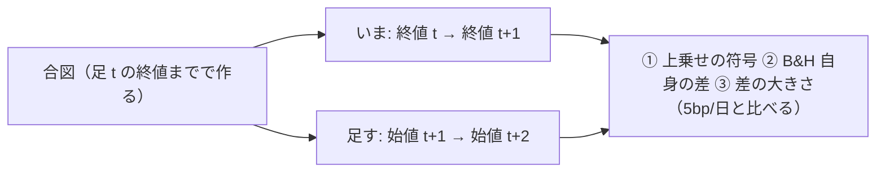
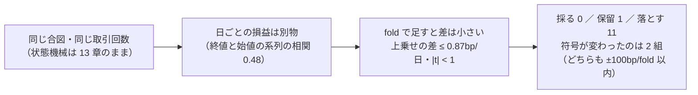

# 翌日の始値で執行したら何が起きるか（机上）

2026-10-08。利用者の問い（2026-09-26）「予測モデルの検証とトレーダーの売買を、終値ではなく市場が開いた最初（翌日の始値）で執行したら何が起きるか」に、机上で回して答える（2026-10-08 利用者決定「1」）。規約は [rules.md 22 章](feature-discovery/rules.md)、プランは [next-open-execution.md](../../plans/archive/next-open-execution.md)。
⚠ **これは投資助言ではなく調査資料である。** ⚠ 数字は【実測】（自前の机上の検証）。⚠ **この結果で本番の起動時刻を変えない**（変えるかは利用者）。

## 0. 回す前に決めたこと（⚠ この節は結果を見る前に書いた）

> この図の主張: 合図は同じで、損益を測る値段だけが 1 本ずれる。

| 項目 | 中身 |
| --- | --- |
| 口 | `[trading] execution = "next_open"`。損益 y_exec[t] ＝ log(始値 t+2 ／ 始値 t+1)（調整済み日足の `open`）。学習・較正・θ・状態機械・費用・fold・基準線はそのまま |
| モデル（4 本） | `trade_own_ridge_a` の全部使う（`T1`・`T4`）／ `trade_ownex_lgbm_a` の全部使う（`T4`）／ `trade_ownseq_ridge_a` の T3 QUANT（`T4`）／ `sel_small4_1995` の F2-2 RFE（`T6`） |
| θ | 50 ／ 55 ／ 60 |
| 数 | ⚠ **＋12（n_trials 777 → 789）**・leak 対照 4 本 |
| config | `nextopen_trade_own_ridge_a`・`nextopen_trade_ownex_lgbm_a`・`nextopen_trade_ownseq_ridge_a`・`nextopen_sel_small4_1995`（queue `next_open`） |
| 対の相手（終値で執行） | 既存の実行（回し直さない）: `2026-09-13T08-57-34_trade_own_ridge_a`・`2026-09-17T16-58-20_trade_ownex_lgbm_a`・`2026-09-17T17-22-08_trade_ownseq_ridge_a`・`2026-09-12T20-39-38_sel_small4_1995` |

物差し（回す前に書いた）: ① 上乗せ（対 B&H）の符号が変わるか（採否は 13-7 のまま）／ ② B&H 自身の差（始値 → 始値 − 終値 → 終値）／ ③ 手法の差の大きさ（翌日始値 − 終値の上乗せの差・bp/日）を 5bp/日と比べる。

予想【推測】（2026-09-26 の見立て）: B&H はほぼ変わらない ／ 手法の上乗せは縮む方向・`T1` の形で差が最大 ／ 採る 0 は変わらない ／ ⚠ 縮んだら「終値執行の数字は楽観的だった」と読む。leak は跳ねるが終値執行より小さく跳ねる。

## 1. 結果【実測 2026-10-08・titan】

**答え: 翌日の始値で執行しても、ほとんど何も変わらない。** 上乗せの差は 12 組とも \|t\| < 1・最大でも 0.87bp/日（往復の費用 5bp/日の 1/6）。B&H 自身の差は ±0.02bp/日。⚠ 上乗せは 12 組のうち 9 組で少し縮んだ（向きは見立てどおり）が、どれも誤差の中。採る 0 は変わらない。

> この図の主張: 合図・回数は同じで、損益の系列は日ごとには半分しか似ていない（相関 0.48）のに、足し合わせると差がほとんど残らない。

材料: 終値 ＝ §0 の既存の 4 実行 ／ 翌日始値 ＝ `2026-10-08T22-19-38_nextopen_trade_own_ridge_a`・`22-19-56_nextopen_sel_small4_1995`・`22-20-34_nextopen_trade_ownex_lgbm_a`・`22-21-13_nextopen_trade_ownseq_ridge_a`。継げなかった行（始値 t+2 が無い最後の 1 日）は銘柄ごとに 1 行 ＝ 63 ／ 48 行（0 として扱った）。値は 1 日 1 銘柄あたりの純利 bp（片道 2.5bp 込み）と、fold あたりの対 B&H 上乗せ。

| モデル（人） | θ | 判定 終値 → 翌日始値（上乗せ bp/fold・fold の符号） | ③ 上乗せの差（始値 − 終値） | t | ② B&H の差 |
| --- | ---: | --- | ---: | ---: | ---: |
| own × Ridge 全部使う（`T1`・`T4`） | 50 | 落とす −271 → 落とす −162（3/5） | ＋0.303bp/日 | ＋0.23 | −0.015bp/日 |
| 〃 | 55 | 落とす −540 → 落とす −563 | −0.063 | −0.05 | 〃 |
| 〃 | 60 | 落とす −944 → 落とす −979 | −0.098 | −0.06 | 〃 |
| ownex × LightGBM 全部使う（`T4`） | 50 | 落とす −65 → 落とす −378 | **−0.870** | −0.80 | ＋0.011 |
| 〃 | 55 | **保留 ＋49 → 落とす −82**（2/5） | −0.362 | −0.30 | 〃 |
| 〃 | 60 | 落とす −1,006 → 落とす −1,128 | −0.341 | −0.12 | 〃 |
| own＋seq × T3 QUANT（`T4`） | 50 | **保留 ＋62 → 落とす −70**（1/5） | −0.365 | −0.35 | −0.015 |
| 〃 | 55 | 落とす −922 → 落とす −983 | −0.170 | −0.12 | 〃 |
| 〃 | 60 | 落とす −865 → 落とす −907 | −0.117 | −0.05 | 〃 |
| F2-2 RFE・1995 表（`T6`） | 50 | 保留 ＋578 → 保留 ＋574（3/5） | −0.003 | −0.01 | −0.008 |
| 〃 | 55 | 落とす −1,696 → 落とす −1,840 | −0.108 | −0.13 | 〃 |
| 〃 | 60 | 落とす −2,927 → 落とす −2,928 | −0.001 | −0.00 | 〃 |

| # | 読み方 |
| ---: | --- |
| 1 | ⚠ **採る 0 ／ 保留 1 ／ 落とす 11**（`n_trials` 777 → **789**）。① 上乗せの符号が変わったのは 2 組（LightGBM θ 55・T3 QUANT θ 50）で、どちらも「+50〜60bp/fold の保留 → −70〜−80bp/fold の落とす」＝ 0 の近くでまたいだだけ |
| 2 | ② **B&H 自身の差は ±0.02bp/日（t ≈ 0）**: 始値 → 始値の和は fold の端の値段しか変わらない（見立てどおり） |
| 3 | ③ **上乗せの差は最大 0.87bp/日・12 組とも \|t\| < 1** ＝ 5bp/日（往復の費用）の 1/6 以下。⚠ 9 組で縮む向き（見立てどおり）だが、誤差の中 |
| 4 | ⚠ **見立て「回転の多い `T1` の形で差が最大」は外れ**: `T1` の形の θ 50 は逆に少し良くなった（＋0.30bp/日）。差が最も大きいのは LightGBM の θ 50（−0.87bp/日）。⚠ LightGBM は同じ設定でも実行ごとに fold の上乗せが最大 123bp ずれる（検証結果一覧の「6 実行・幅 123.40bp」）ので、この行の差の一部は実行ごとの揺れ |
| 5 | 合図・的中率・IC・取引回数は終値の行と 1 ビットも同じ（22-1 の 1・4 の作りどおり）。日ごとの損益は終値の系列と相関 0.48 しかないが、保有が続く日は始値 → 始値の和が終値 → 終値の和とほぼ同じになるので、fold で足すと差が消える |
| 6 | ✅ leak 対照は 4 本とも跳ねた。⚠ 終値の leak より小さく跳ねた（`trade_own_ridge_a` の形で 22,195 → 14,864bp/fold）＝ leak の列は終値 → 終値を知るので、始値の損益とは日中の部分しか重ならない（22-1 の 5 の予想どおり） |

予想との照合: B&H はほぼ変わらない ✅ ／ 上乗せは縮む方向 △（9/12 で縮むが誤差の中）／ `T1` の形で差が最大 ✗ ／ 採る 0 は変わらない ✅ ／ leak は小さく跳ねる ✅。

## 2. 言えること ／ 言えないこと

| 言えること | 言えないこと |
| --- | --- |
| 机上の「終値を見て終値で買う」楽観は、この 4 本では **1bp/日に届かない**（翌日始値に替えても採否はほぼ同じ） | ⚠ **寄り直後の気配の広さ・約定の差**（机上は始値ちょうどで約定する。実売買では 差 1 が増えうる ＝ 2026-09-26 の見立て）は測っていない |
| 「始値で執行する本番」に替えても、机上の判定はほぼ変わらない見込み | ⚠ 09:35〜09:45 に出す形（始値の少し後）は回していない |
| | ⚠ **この結果で本番の起動時刻を変えない**（発注できる時間帯は 2026-09-20 に「広げない」と決めた。変えるかは利用者） |
