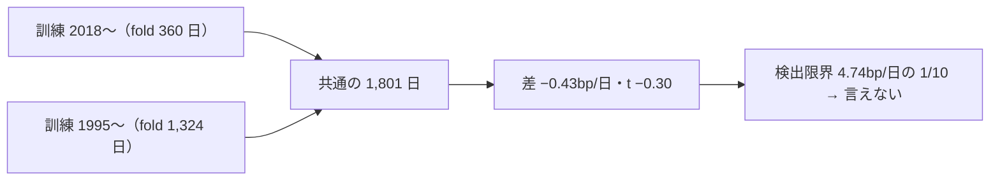
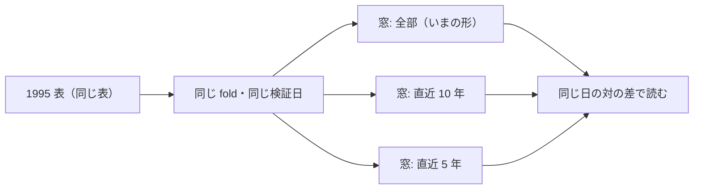

# 疑問: 古すぎるトレンドは直近では参考にならないのではないか

2026-09-18。利用者の疑問（TODO「疑問に思ったことを登録し解決していく」の子）に、**既にある実行の記録だけ**で答える。⚠ 新しい実行はしていない（n_trials は 613 のまま）。⚠ 事後の読み ＝ 診断であって、採否には使わない。

## 0. 答え

**いまの記録では「役に立つ」とも「邪魔」とも言えない。差は検出限界の 1/10 しかない。**

- 同じ手法（`own_` 41 列 × Ridge × (A) 共通）を、訓練を 2018 年から始めた実行と 1995 年から始めた実行で、**同じ 1,801 日（2019-07-09〜2026-09-04）の上で**比べた
- 1995 年から訓練したほうが **−0.43bp/日**（θ=50・対の t = −0.30）。向きは「古いデータを入れると少し悪い」だが、⚠ **この期間の検出限界は 4.74bp/日**（[validation-power.md §8-2-2](feature-discovery/validation-power.md)）で、差はその 1/10。3 つの θ すべてで |t| < 1
- ⚠ **どちらの実行も B&H に負けている**（−0.75 ／ −1.19bp/日）。そもそも予測に情報が無い（門の AUC 0.498 ／ 0.524）ので、「古いデータが情報を薄めたか」を測る土台が無い
- ⚠ **この対は疑問に答える形になっていない**（§2 の交絡）。決着をつけるには、検証日と再学習の間隔を揃えて訓練の窓だけを変える実験が要る（§3。回すかは利用者）

## 1. 数字【実測 2026-09-18。既存の `daily.csv` の読み直し】

**主張: 同じ日の上で比べると、2 つの実行の差は誤差の中に埋もれる。**



材料: `runs/2026-09-13T08-57-34_trade_own_ridge_a`（2018 表）・`runs/2026-09-12T20-40-06_trade_own_1995_ridge_a`（1995 表）。手法は「全部使う（基準）」、B&H は「基準 常に上（ドリフト）」。値は 1 日 1 銘柄あたりの純利 bp（片道 2.5bp 込み）。

| θ | 2018 表: 対 B&H 上乗せ | 1995 表: 対 B&H 上乗せ | 1995 − 2018（対の差） | 対の t |
| ---: | ---: | ---: | ---: | ---: |
| 50 | −0.752bp/日（t −0.53） | −1.187bp/日（t −1.26） | **−0.425bp/日** | −0.30 |
| 55 | −1.500（t −0.93） | −2.043（t −1.03） | −0.534 | −0.22 |
| 60 | −2.620（t −1.43） | −4.328（t −1.55） | −1.698 | −0.89 |

| 量（θ=50・共通の 1,801 日） | 2018 表 | 1995 表 |
| --- | ---: | ---: |
| 保有日率 | 0.724 | 0.957 |
| B&H と違う日の割合 | 0.636 | 0.306 |
| 保有率の日次の相関（2 つの実行の間） | −0.222 | |

年ごとの上乗せ（θ=50・bp の年合計）:

| | 2019 | 2020 | 2021 | 2022 | 2023 | 2024 | 2025 | 2026 |
| --- | ---: | ---: | ---: | ---: | ---: | ---: | ---: | ---: |
| 2018 表 | +1.5 | −586.9 | +153.3 | +801.2 | −1,305.0 | −490.5 | +94.7 | −22.8 |
| 1995 表 | −56.4 | −1,832.8 | −297.3 | +4.6 | −13.0 | +11.1 | +33.5 | +12.5 |

| # | 読み方 |
| ---: | --- |
| 1 | ⚠ **差は 3 つの θ すべてで誤差の中**（\|t\| < 1）。向きが揃って負なのは事実だが、3 つの θ は同じ買い% を別の線で切っただけで独立ではない |
| 2 | **1995 年から訓練したモデルは、直近ではほとんど「ずっと持つ」**（保有 0.957・B&H と違う日は 3 割）。2022 年以降の上乗せは年 ±35bp 以内 ＝ ほぼ B&H そのもの。⚠ 長い履歴で学ぶと「株は上がる」に寄る、と読めるが、1 対からの読みで根拠は弱い |
| 3 | 1995 表の負けは **2020 年の −1,833bp にほぼ全部ある**（コロナの急落と戻り）。⚠ 1 エピソード 1 回ぶんの観測（rules.md 14-8 と同じ注意） |
| 4 | 2 つの実行の保有の相関は **−0.22**。同じ特徴量・同じモデルでも、訓練の期間で買い% の出方が別物になる ＝ ⚠ **どちらも安定した関係を掴んでいない**ことの傍証 |

## 2. ⚠ この対では答えられない理由（交絡）

**主張: 「古いデータを入れた」以外に 2 つ違うものがある。**

| 交絡 | 中身 | 向き |
| --- | --- | --- |
| **モデルの鮮度** | 1995 表は fold が 1,324 日。2021-05〜2026-09 を当てているモデルは 2021-05 までのデータで 1 度学んだきりで、⚠ **最長 5 年 4 か月更新されていない**。2018 表は 360 日ごとに学び直す | 1995 表に不利。⚠ **疑問の「古いデータは参考にならない」と、「古いモデルは参考にならない」が分かれない** |
| **銘柄の痩せ** | 1995 年に存在するのは 63 本中 29 本（rules.md 12-1）。古い期間の訓練データは生き残った大型株に偏る | 向きは不明（生存バイアスが深くなる） |
| 校正 | Platt の校正も訓練の窓の中で学ぶ。窓が長いと買い% の幅が変わり、同じ θ でも切る位置が変わる | θ の比較を濁す |

⚠ **そもそも土台が無い**: 両方とも門を通っていない（AUC 0.498 ／ 0.524・買い% 幅 5.9 ／ 6.8 点。水準は 0.52 かつ 20 点）。情報の無い予測どうしを比べても、「古いデータが情報を薄めるか」は測れない。

## 3. 決着をつける実験の案（⚠ 回していない。回すかは利用者）

**主張: 検証日と再学習の間隔を揃え、訓練の窓の長さだけを変える。**



| 項目 | 案 |
| --- | --- |
| 変えるもの | 訓練の窓だけ（`validation` に `max_train_days` を足す。既定は無制限 ＝ いまの結果を 1 ビットも変えない） |
| 揃えるもの | 表（1995 表）・fold・検証日・特徴量・モデル・θ・コスト |
| 水準（回す前に決める） | 全部 ／ 直近 2,520 日（約 10 年）／ 直近 1,260 日（約 5 年）。⚠ 結果を見てから足さない |
| n_trials | 窓は台帳の鍵に足す ＝ 水準 2 つ × θ 3 ＝ **＋6**（全部はいまの行）。⚠ 試行を増やしても採否は厳しくならない（rules.md 14-10） |
| 読み方 | 対の差（同じ日）。⚠ 検出限界は 1995 表で 2.02bp/日。今回の −0.43bp/日 級の差なら、これでも測れない見込み【推測】 |
| 手間 | 分割に 1 引数 ＋ テスト ＋ 実行 3 分 × 2。半日【推測】 |
| 鮮度の交絡を外す | fold を短くする（1995 表で fold 360 日 ＝ 18 fold）のは別の試行。先に窓だけを見る |

⚠ **測れない見込みが高いが、回さない理由にはならない**（CLAUDE.md 2026-09-12: 可能性が低くても回す。回さないのは「測れない」か規約に反するときだけ）。⚠ ここでの「測れない」は検出限界から見た予想で、rules.md 14-2 の「測れない」（仕組みとして測る手段が無い）ではない。

## 4. 再現

```python
# experiments/feature-discovery で .venv/bin/python。読むだけ
import pandas as pd, numpy as np
A = "runs/2026-09-13T08-57-34_trade_own_ridge_a"; B = "runs/2026-09-12T20-40-06_trade_own_1995_ridge_a"
M, BH = "全部使う（基準）", "基準 常に上（ドリフト）"
def ser(run, method, theta, series="純利bp"):
    d = pd.read_csv(run + "/daily.csv", parse_dates=["ts"])
    x = d[(d["手法"] == method) & (d["閾値"] == theta) & (d["系列"] == series)].set_index("ts")["値"]
    return x[~x.index.duplicated()]
common = ser(A, M, 50.0).index.intersection(ser(B, M, 50.0).index)      # 1,801 日
diff = ser(B, M, 50.0).reindex(common) - ser(A, M, 50.0).reindex(common)
print(diff.mean(), diff.mean() / diff.std(ddof=1) * np.sqrt(len(diff)))   # −0.425, −0.30
```

⚠ B&H の日次は 2 つの表で最大 2.5bp ずれる日がある（fold の境目で建て直す日が違うため。片道の費用ぶん）。対の差は手法どうしを直接引いているので、この差は入らない。
