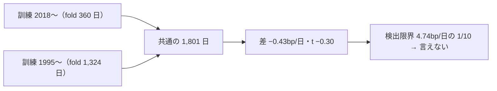
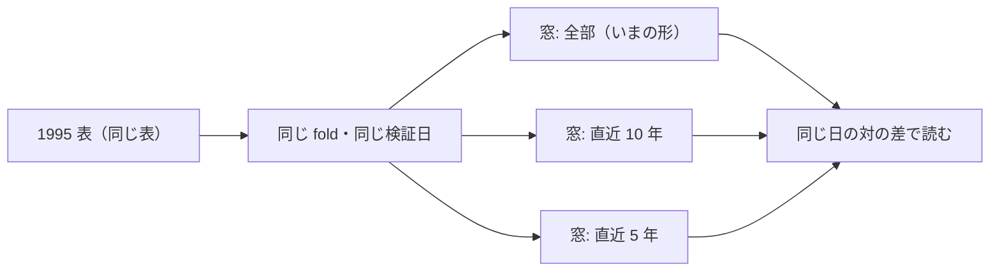
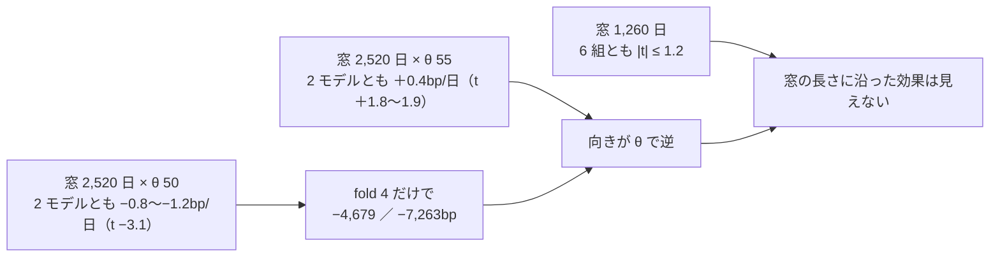

# 疑問: 古すぎるトレンドは直近では参考にならないのではないか

2026-09-18。利用者の疑問（TODO「疑問に思ったことを登録し解決していく」の子）に、**既にある実行の記録だけ**で答える。⚠ 新しい実行はしていない（n_trials は 613 のまま）。⚠ 事後の読み ＝ 診断であって、採否には使わない。

## 0. 答え

⚠ **2026-10-08 に決着の実験（訓練の窓だけを変える。§5）を回した: 答えは変わらず「言えない」**（2,520 日 × θ 50 だけ t −3.1 だが fold 4 の 1 つから・θ 55 では逆向き。n_trials 765 → 777）。以下は 2026-09-18 の読み。

**いまの記録では「役に立つ」とも「邪魔」とも言えない。差は検出限界の 1/10 しかない。**

- 同じ手法（`own_` 41 列 × Ridge × (A) 共通）を、訓練を 2018 年から始めた実行と 1995 年から始めた実行で、**同じ 1,801 日（2019-07-09〜2026-09-04）の上で**比べた
- 1995 年から訓練したほうが **−0.43bp/日**（θ=50・対の t = −0.30）。向きは「古いデータを入れると少し悪い」だが、⚠ **この期間の検出限界は 4.74bp/日**（[validation-power.md §8-2-2](feature-discovery/validation-power.md)）で、差はその 1/10。3 つの θ すべてで |t| < 1
- ⚠ **どちらの実行も B&H に負けている**（−0.75 ／ −1.19bp/日）。そもそも予測に情報が無い（門の AUC 0.498 ／ 0.524）ので、「古いデータが情報を薄めたか」を測る土台が無い
- ⚠ **この対は疑問に答える形になっていない**（§2 の交絡）。決着をつけるには、検証日と再学習の間隔を揃えて訓練の窓だけを変える実験が要る（§3。回すかは利用者）

## 1. 数字【実測 2026-09-18。既存の `daily.csv` の読み直し】

**主張: 同じ日の上で比べると、2 つの実行の差は誤差の中に埋もれる。**


```mermaid
flowchart LR
  A["訓練 2018〜（fold 360 日）"] --> C["共通の 1,801 日"]
  B["訓練 1995〜（fold 1,324 日）"] --> C
  C --> D["差 −0.43bp/日・t −0.30"]
  D --> E["検出限界 4.74bp/日の 1/10 → 言えない"]
```

材料: `runs/2026-09-13T08-57-34_trade_own_ridge_a`（2018 表）・`runs/2026-09-12T20-40-06_trade_own_1995_ridge_a`（1995 表）。手法は「全部使う（基準）」、B&H は「基準 常に上（ドリフト）」。値は 1 日 1 銘柄あたりの純利 bp（片道 2.5bp 込み）。

| θ | 2018 表: 対 B&H 上乗せ | 1995 表: 対 B&H 上乗せ | 1995 − 2018（対の差） | 対の t |
| ---: | ---: | ---: | ---: | ---: |
| 50 | −0.752bp/日（t −0.53） | −1.187bp/日（t −1.26） | **−0.425bp/日** | −0.30 |
| 55 | −1.500（t −0.93） | −2.043（t −1.03） | −0.534 | −0.22 |
| 60 | −2.620（t −1.43） | −4.328（t −1.55） | −1.698 | −0.89 |

| 量（θ=50・共通の 1,801 日） | 2018 表 | 1995 表 |
| --- | ---: | ---: |
| 保有日率 | 0.724 | 0.957 |
| B&H と違う日の割合 | 0.636 | 0.306 |
| 保有率の日次の相関（2 つの実行の間） | −0.222 | |

年ごとの上乗せ（θ=50・bp の年合計）:

| | 2019 | 2020 | 2021 | 2022 | 2023 | 2024 | 2025 | 2026 |
| --- | ---: | ---: | ---: | ---: | ---: | ---: | ---: | ---: |
| 2018 表 | +1.5 | −586.9 | +153.3 | +801.2 | −1,305.0 | −490.5 | +94.7 | −22.8 |
| 1995 表 | −56.4 | −1,832.8 | −297.3 | +4.6 | −13.0 | +11.1 | +33.5 | +12.5 |

| # | 読み方 |
| ---: | --- |
| 1 | ⚠ **差は 3 つの θ すべてで誤差の中**（\|t\| < 1）。向きが揃って負なのは事実だが、3 つの θ は同じ買い% を別の線で切っただけで独立ではない |
| 2 | **1995 年から訓練したモデルは、直近ではほとんど「ずっと持つ」**（保有 0.957・B&H と違う日は 3 割）。2022 年以降の上乗せは年 ±35bp 以内 ＝ ほぼ B&H そのもの。⚠ 長い履歴で学ぶと「株は上がる」に寄る、と読めるが、1 対からの読みで根拠は弱い |
| 3 | 1995 表の負けは **2020 年の −1,833bp にほぼ全部ある**（コロナの急落と戻り）。⚠ 1 エピソード 1 回ぶんの観測（rules.md 14-8 と同じ注意） |
| 4 | 2 つの実行の保有の相関は **−0.22**。同じ特徴量・同じモデルでも、訓練の期間で買い% の出方が別物になる ＝ ⚠ **どちらも安定した関係を掴んでいない**ことの傍証 |

## 2. ⚠ この対では答えられない理由（交絡）

**主張: 「古いデータを入れた」以外に 2 つ違うものがある。**

| 交絡 | 中身 | 向き |
| --- | --- | --- |
| **モデルの鮮度** | 1995 表は fold が 1,324 日。2021-05〜2026-09 を当てているモデルは 2021-05 までのデータで 1 度学んだきりで、⚠ **最長 5 年 4 か月更新されていない**。2018 表は 360 日ごとに学び直す | 1995 表に不利。⚠ **疑問の「古いデータは参考にならない」と、「古いモデルは参考にならない」が分かれない** |
| **銘柄の痩せ** | 1995 年に存在するのは 63 本中 29 本（rules.md 12-1）。古い期間の訓練データは生き残った大型株に偏る | 向きは不明（生存バイアスが深くなる） |
| 校正 | Platt の校正も訓練の窓の中で学ぶ。窓が長いと買い% の幅が変わり、同じ θ でも切る位置が変わる | θ の比較を濁す |

⚠ **そもそも土台が無い**: 両方とも門を通っていない（AUC 0.498 ／ 0.524・買い% 幅 5.9 ／ 6.8 点。水準は 0.52 かつ 20 点）。情報の無い予測どうしを比べても、「古いデータが情報を薄めるか」は測れない。

## 3. 決着をつける実験の案（⚠ 回していない。回すかは利用者）

**主張: 検証日と再学習の間隔を揃え、訓練の窓の長さだけを変える。**


```mermaid
flowchart LR
  T["1995 表（同じ表）"] --> S["同じ fold・同じ検証日"]
  S --> W1["窓: 全部（いまの形）"]
  S --> W2["窓: 直近 10 年"]
  S --> W3["窓: 直近 5 年"]
  W1 --> R["同じ日の対の差で読む"]
  W2 --> R
  W3 --> R
```

| 項目 | 案 |
| --- | --- |
| 変えるもの | 訓練の窓だけ（`validation` に `max_train_days` を足す。既定は無制限 ＝ いまの結果を 1 ビットも変えない） |
| 揃えるもの | 表（1995 表）・fold・検証日・特徴量・モデル・θ・コスト |
| 水準（回す前に決める） | 全部 ／ 直近 2,520 日（約 10 年）／ 直近 1,260 日（約 5 年）。⚠ 結果を見てから足さない |
| n_trials | 窓は台帳の鍵に足す ＝ 水準 2 つ × θ 3 ＝ **＋6**（全部はいまの行）。⚠ 試行を増やしても採否は厳しくならない（rules.md 14-10） |
| 読み方 | 対の差（同じ日）。⚠ 検出限界は 1995 表で 2.02bp/日。今回の −0.43bp/日 級の差なら、これでも測れない見込み【推測】 |
| 手間 | 分割に 1 引数 ＋ テスト ＋ 実行 3 分 × 2。半日【推測】 |
| 鮮度の交絡を外す | fold を短くする（1995 表で fold 360 日 ＝ 18 fold）のは別の試行。先に窓だけを見る |

⚠ **測れない見込みが高いが、回さない理由にはならない**（CLAUDE.md 2026-09-12: 可能性が低くても回す。回さないのは「測れない」か規約に反するときだけ）。⚠ ここでの「測れない」は検出限界から見た予想で、rules.md 14-2 の「測れない」（仕組みとして測る手段が無い）ではない。

## 4. 再現

```python
# experiments/feature-discovery で .venv/bin/python。読むだけ
import pandas as pd, numpy as np
A = "runs/2026-09-13T08-57-34_trade_own_ridge_a"; B = "runs/2026-09-12T20-40-06_trade_own_1995_ridge_a"
M, BH = "全部使う（基準）", "基準 常に上（ドリフト）"
def ser(run, method, theta, series="純利bp"):
    d = pd.read_csv(run + "/daily.csv", parse_dates=["ts"])
    x = d[(d["手法"] == method) & (d["閾値"] == theta) & (d["系列"] == series)].set_index("ts")["値"]
    return x[~x.index.duplicated()]
common = ser(A, M, 50.0).index.intersection(ser(B, M, 50.0).index)      # 1,801 日
diff = ser(B, M, 50.0).reindex(common) - ser(A, M, 50.0).reindex(common)
print(diff.mean(), diff.mean() / diff.std(ddof=1) * np.sqrt(len(diff)))   # −0.425, −0.30
```

⚠ B&H の日次は 2 つの表で最大 2.5bp ずれる日がある（fold の境目で建て直す日が違うため。片道の費用ぶん）。対の差は手法どうしを直接引いているので、この差は入らない。

## 5. 決着の実験（2026-10-08。⚠ この節の「水準と読み方」は回す前に書いた）

利用者決定（2026-10-08「1」＝ 回す・`T6` の形も足して n_trials ＋12 を了承）。規約は [rules.md 21 章](feature-discovery/rules.md)、プランは [old-trend-relevance.md §5](../../plans/archive/old-trend-relevance.md)。

**主張: §3 の案のとおり、表・fold・検証日・学び直しの間隔をそろえて訓練の窓だけを変える。**

| 項目 | 水準（⚠ 回す前に固定） |
| --- | --- |
| 表 | 1995 表（`own_1995`） |
| モデル | 2 つ: `trade_own_1995_ridge_a` の「全部使う（基準）」（§1 の対の元）／ `sel_small4_1995` の「F2-2 RFE」（`T6`〈ソラ〉の形） |
| 窓 | 全部（既存の行）／ 2,520 日 ／ 1,260 日 |
| θ | 50 ／ 55 ／ 60 |
| 数 | ⚠ **＋12（n_trials 765 → 777）**・leak 対照 4 本 |
| config | `window2520_trade_own_1995_ridge_a`・`window1260_trade_own_1995_ridge_a`・`window2520_sel_small4_1995`・`window1260_sel_small4_1995`（queue `train_window`） |

読み方（回す前に書いた）:

1. 問いの答え ＝ **同じ日の対の差（窓 − 全部）とその t**。検出限界は 2.02bp/日。\|t\| < 2 なら「言えない」
2. 採否は対 B&H（13-7）のまま。対の差は採否に使わない
3. 2,520 日の窓は fold 1・2 がほぼ「全部」と同じ（訓練が窓より短い）＝ 差は fold 3〜5 に出る
4. ⚠ この結果で `T6` を替えない

予想【推測】: 12 行とも採るにならない ／ 対の差は 4 組とも \|t\| < 2 ／ 窓を短くすると保有日率が下がる。

### 5-1. 結果【実測 2026-10-08・titan】

**答え: やはり「古い行が役に立つ」とも「邪魔」とも言えない。** 窓を 10 年に縮めると θ=50 では 2 モデルとも悪くなった（対の t ≈ −3.1）が、⚠ **差のほぼ全部が fold 4（2016-02〜2021-05。2020 年の急落を含む）の 1 つから来ていて、θ=55 では向きが逆**。5 年の窓は 6 組とも \|t\| ≤ 1.2。

> この図の主張: 差が出たのは 1 つの fold と 1 つの θ だけで、窓の長さに沿った向きは無い。


```mermaid
flowchart LR
  A["窓 2,520 日 × θ 50<br/>2 モデルとも −0.8〜−1.2bp/日（t −3.1）"] --> F4["fold 4 だけで<br/>−4,679 ／ −7,263bp"]
  B["窓 2,520 日 × θ 55<br/>2 モデルとも ＋0.4bp/日（t ＋1.8〜1.9）"] --> X["向きが θ で逆"]
  F4 --> X
  C["窓 1,260 日<br/>6 組とも |t| ≤ 1.2"] --> N["窓の長さに沿った効果は見えない"]
  X --> N
```

材料: 全部 ＝ `2026-09-12T20-40-06_trade_own_1995_ridge_a`・`2026-09-12T20-39-38_sel_small4_1995`（既存）／ 窓 ＝ `2026-10-08T22-06-20_window2520_trade_own_1995_ridge_a`・`22-06-51_window1260_…`・`22-07-19_window2520_sel_small4_1995`・`22-07-53_window1260_…`。対の差 ＝ 窓 − 全部（同じ 6,619 日・1 日 1 銘柄あたりの純利 bp）。fold の切れ目 ＝ 1995-02-10 ／ 2000-05-10 ／ 2005-08-17 ／ 2010-11-18 ／ 2016-02-25 ／ 2021-05-28 ／ 2026-09-04。

| モデル | 窓 | θ | 判定（対 B&H 上乗せ bp/fold・fold の符号） | 対の差（窓 − 全部） | 対の t | fold ごとの差（bp） | 保有日率（全部 → 窓） |
| --- | --- | ---: | --- | ---: | ---: | --- | --- |
| 全部使う | 2,520 | 50 | 落とす（−1,077・2/5） | **−0.810bp/日** | **−3.14** | 0 ／ −30 ／ −523 ／ **−4,679** ／ −129 | 0.698 → 0.596 |
| 全部使う | 2,520 | 55 | 落とす（−1,213・1/5） | ＋0.437 | ＋1.94 | 0 ／ −91 ／ −284 ／ ＋3,040 ／ ＋229 | 0.563 → 0.585 |
| 全部使う | 2,520 | 60 | 落とす（−3,156・0/5） | ＋0.117 | ＋0.50 | 0 ／ ＋116 ／ −1,510 ／ ＋1,083 ／ ＋1,083 | 0.245 → 0.216 |
| 全部使う | 1,260 | 50 | **保留**（＋559・4/5） | ＋0.426 | ＋1.16 | −286 ／ −931 ／ −596 ／ ＋4,507 ／ ＋124 | 0.698 → 0.669 |
| 全部使う | 1,260 | 55 | 落とす（−2,328・2/5） | −0.406 | −1.01 | ＋441 ／ −2,739 ／ ＋302 ／ −529 ／ −159 | 0.563 → 0.386 |
| 全部使う | 1,260 | 60 | 落とす（−3,230・1/5） | ＋0.061 | ＋0.18 | ＋563 ／ −715 ／ ＋844 ／ 0 ／ −290 | 0.245 → 0.203 |
| F2-2 RFE | 2,520 | 50 | 落とす（−1,043・2/5） | **−1.224** | **−3.08** | 0 ／ ＋301 ／ −821 ／ **−7,263** ／ −321 | 0.728 → 0.584 |
| F2-2 RFE | 2,520 | 55 | 落とす（−1,207・2/5） | ＋0.370 | ＋1.76 | 0 ／ −432 ／ −734 ／ ＋3,285 ／ ＋330 | 0.573 → 0.581 |
| F2-2 RFE | 2,520 | 60 | 落とす（−2,912・0/5） | ＋0.012 | ＋0.10 | 0 ／ ＋73 ／ −599 ／ ＋648 ／ −46 | 0.314 → 0.308 |
| F2-2 RFE | 1,260 | 50 | **保留**（＋462・2/5） | −0.088 | −0.26 | −484 ／ −925 ／ −336 ／ ＋1,253 ／ −89 | 0.728 → 0.660 |
| F2-2 RFE | 1,260 | 55 | 落とす（−1,280・2/5） | ＋0.314 | ＋0.59 | ＋84 ／ −3,362 ／ −170 ／ ＋5,541 ／ −13 | 0.573 → 0.530 |
| F2-2 RFE | 1,260 | 60 | 落とす（−3,365・0/5） | −0.331 | −1.01 | ＋17 ／ −449 ／ −2,475 ／ ＋1,279 ／ −563 | 0.314 → 0.169 |

参考（全部 ＝ 既存の行の対 B&H 上乗せ・θ 50）: 全部使う −4bp/fold（3/5）・F2-2 RFE ＋578bp/fold（3/5）。

| # | 読み方 |
| ---: | --- |
| 1 | ⚠ **採る 0 ／ 保留 2 ／ 落とす 10**（`n_trials` 765 → **777**）。保留の 2 つ（1,260 日 × θ 50）は平均だけ正で fold が割れる ＝ 13-7 のまま保留 |
| 2 | ⚠ **\|t\| > 2 の 2 組（2,520 日 × θ 50）は 1 つの fold の話**: fold 4 を除くと差は −30〜−523bp/fold で、t の計算が置く「日ごとに独立」が 1 エピソードの塊で崩れている。⚠ しかも同じ窓の θ=55 では 2 モデルとも逆向き（＋0.4bp/日・t ＋1.8〜1.9）。12 組を見て 2 組が \|t\| > 2 ＝ 多重比較を割り引けば「出てもおかしくない」側 |
| 3 | 窓の長さに沿った向きが無い（2,520 日で悪く・1,260 日で同じか良い・θ で向きが変わる）＝ ⚠ **「古い行を足すほど良い／悪い」という単調な効果は見えない** |
| 4 | ✅ 予想どおり 2,520 日の窓は fold 1 が「全部」と 1 ビットも同じ（差 0）・fold 2 もほぼ同じ（21-1 の 3） |
| 5 | 窓を短くすると θ=50 の保有日率は 4 組とも下がった（0.70 → 0.60〜0.67・0.73 → 0.58〜0.66）＝ ⚠ **「長い履歴で学ぶと『ずっと持つ』に寄る」（§1 の 2）とは向きが合う**。ただし上乗せは良くならない |
| 6 | ✅ leak 対照 4 本は 4 本とも跳ねた（＋81,366bp/fold・5/5）。基準線（B&H・直前符号・乱択）は 2 実行・一致 |
| 7 | ⚠ **この結果で `T6`（ソラ）を替えない**（21-4 の 4）。⚠ 2,520 日の窓の θ=50 の悪化は fold 4 の 1 エピソードなので、「T6 は古い行を学ぶほうが良い」とも読まない |

予想との照合: 「12 行とも採るにならない」✅ ／ 「対の差は 4 組とも \|t\| < 2」✗（2,520 日 × θ 50 の 2 組が −3.1。ただし 1 つの fold から）／ 「窓を短くすると保有日率が下がる」✅（θ=50。θ=55 の 2,520 日は僅かに上がった）。

⚠ **残る交絡**: 学び直しの間隔（fold 1,324 日）はそろえたまま ＝ 「古いモデル」の効き（§2 の 1 つ目）はこの実験では外していない（fold を短くする別の検証。回すかは利用者）。
