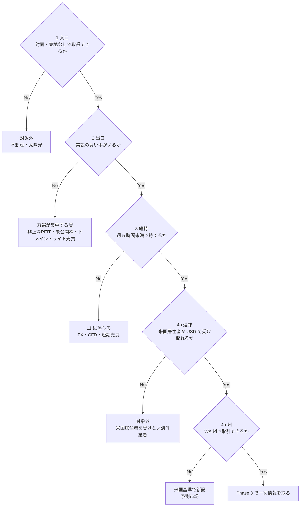
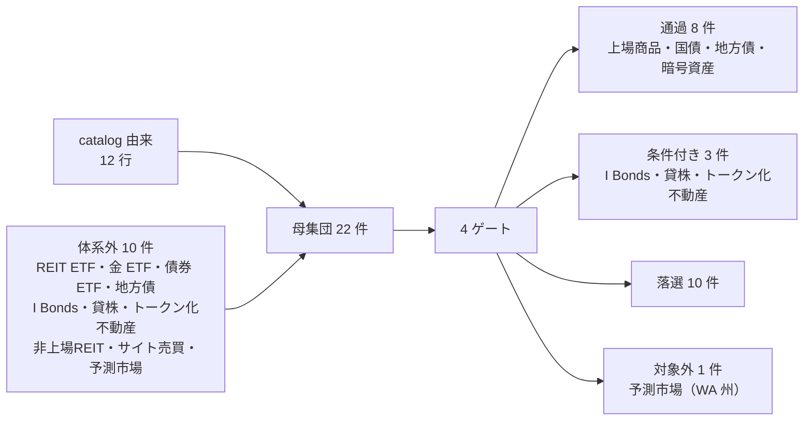
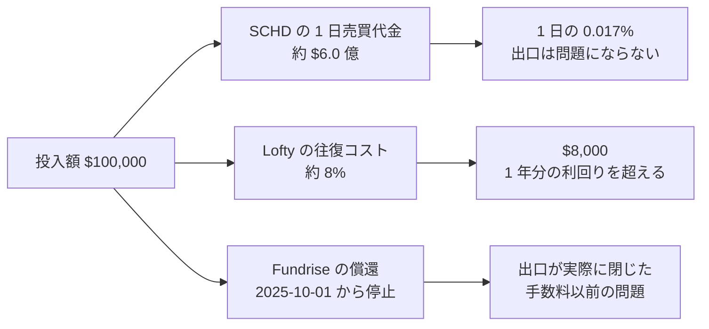
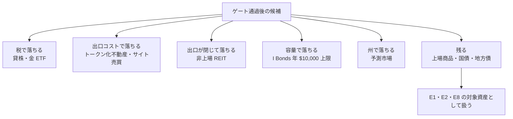
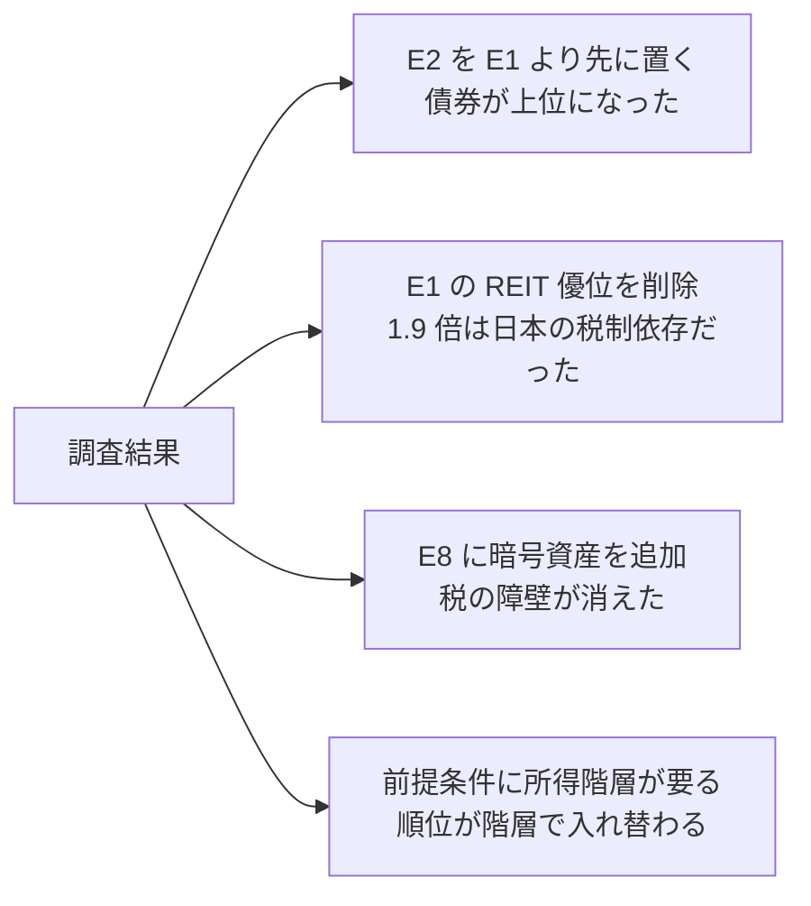

# オンラインで売買が完結する資産の洗い出し（横断調査・米国基準）

調査日: 2026-08-28。プラン: `docs/plans/us-residency-premise.md`（初版は `docs/plans/archive/online-tradable-assets.md`）。
**実行はしていない**（口座開設・入金・売買・登録を行わず、一次情報と試算で判定した）。

> **本書は 2026-08-28 に米国基準へ全面改訂した。** 初版（同日・日本居住前提）は 4 ゲート・出口の 2 型・
> 「投入額 vs 市場の厚み」という判定の枠組みを作ったが、数値・出典・規制・税務がすべて日本のものだった。
> **枠組みはそのまま流用し、中身を差し替えた。** 何が反転したかは [§7 初版からの差分](#7-初版日本居住前提からの差分) に残してある。
> 初版の全文は [archive/online-tradable-assets-jp.md](archive/online-tradable-assets-jp.md) に保存してある（日本の出典 21 件つき）。

手法 ID を接頭辞に付けないのは、これが 1 手法の検証ではなく **E1・E2・E8 が属する枠そのものの検証**だから。

> ⚠ 本書は銘柄・商品の推奨ではない。確定セグメント（資金 大 $100,000〜 × 週 5〜15 時間 × 回収 6 ヶ月〜1 年）で
> **その手法が成立するか**を一次情報と試算で判定した記録である。⚠ 個別の税務助言・投資助言は行わない。

> ⚠ **2026-08-29 訂正: 本書の母集団 22 件は狭すぎた。** 候補を手法カタログの「資本」「資源」の行から拾ったため、
> **同じ証券口座・同じ板で買えるのに見ていない層が大量にあった**（CEF・BDC・mREIT・優先株・カバードコール ETF ほか）。
> 前回 E1 の利回りを 2.19〜3.54% と見ていたが、**同じ経路で 5.5〜13.6% の層が実在する**。
> ただし ⚠ **総リターンで見ると話が逆転する**（AGNC は平均利回り 12% で 10 年の年率が 4.42%）。
> ⚠ **さらに 2 巡目（§11）で、体系の第 0 段の除外（F4 保険の引受）が崩れた。** カタストロフィボンド ETF が NYSE Arca に上場している。
> 詳細は [§10 1 巡目](#10-母集団のやり直し2026-08-29-1-巡目)・[§11 2 巡目](#11-母集団のやり直し2026-08-29-2-巡目) を先に読むこと。
> ⚠ **2 巡回して新規 30 件。まだ出尽くしていない。**

## 0. 結論

**枠の中身は同じだが、枠の中の順位が入れ替わった。**

初版と同じく、4 ゲートを通る母集団に新しい手法は 1 件も追加されなかった。E1・E2・E8 はやはり枠のほぼ全部である。
ただし**どれを先に置くかが変わった**。

| 判定 | 候補 | 決め手 |
| --- | --- | --- |
| **順位が逆転** | E2 債券が E1 株式配当を上回る | 米国債 2〜30 年が **4.19〜5.20%**、高配当株 ETF が **2.19〜3.06%**。日本では国債 1.87% が最下位だった |
| **新しく 1 位に入りうる** | 地方債（muni） | **連邦所得税が非課税**。上位所得ケースで税引後 1 位。日本の地方債にこの優遇は無い |
| **優位が消えた** | 米国 REIT（VNQ） | 分配が**非適格**で通常所得。§199A の 20% 控除を入れても高配当株 ETF の **1.0〜1.1 倍**。日本の 1.9 倍が消えた |
| **E1 の範囲に含める** | 高配当株 ETF・REIT ETF・優先株 ETF | 同一の証券口座・板・課税経路。別の手法ではなく銘柄違い |
| **上限で落ちる** | I Bonds（買取保証型の本命） | ⚠ **購入は年 $10,000 まで**。$100,000 を置けない。日本の個人向け国債には上限が無かった |
| **税で不利になった** | 金 ETF | ⚠ **collectibles 扱いで最大 28%**。株の 15〜20% より重い。日本では株と同率だった |
| **理由が変わって残留** | 貸株（FPSL） | ⚠ 代替受取金は非適格化して通常所得、貸出中の株は SIPC 保護外。**日本の結論と同じ** |
| **税の障壁が消えた** | 暗号資産 | 財産扱いで長期譲渡益は株と同率。⚠ ただし分配が無く、E8 でしか収入にならない |
| **理由だけ入れ替わって対象外** | 予測市場（Kalshi・Polymarket） | 連邦は CFTC 規制下で合法。⚠ **だが WA 州が差止めており州内で取引できない** |
| **採らない** | トークン化不動産・非上場 REIT・サイト売買 | 往復コスト約 8%／償還停止／売主手数料 5〜15% |

**副次的な発見が 3 つある。**

1. **買取保証型の出口は、米国では上限で潰れる。** 日本の個人向け国債は 1 万円単位で無制限に買え、1 年経てば額面で戻った。
   米国の対応物である I Bonds は**年 $10,000 が上限**で、確定セグメントの元手の 10% しか収容できない。
   出口の型は残っているのに、**入口の容量で落ちる**という新しい落ち方である。
2. **税引後の順位が所得階層で入れ替わる。** 地方債は上位ケースで 1 位、中位ケースで 3 位に落ちる。
   日本は配当・利子・譲渡益が一律 20.315% だったため、**順位は所得と無関係だった**。米国では前提に所得階層が要る。
3. **同じ結論に別の理由で着地することがある。** 貸株は日米どちらでも「上乗せではなく劣化」、
   予測市場は日米どちらでも「対象外」。⚠ **理由（賭博罪 → 州の差止め）は入れ替わったのに、判定は動かなかった。**

## 1. Phase 1 — 定義と 4 ゲート

「オンラインで買えるか」で判定すると、非上場 REIT もトークン化不動産も通ってしまう。**入口ではなく出口で定義する**。
**ゲート 1〜3 は初版のまま流用する。居住地に依存しないため。ゲート 4 だけを差し替えた。**

| # | ゲート | 判定基準 | 落ちる例 |
| --- | --- | --- | --- |
| 1 | 入口 | 対面・実地確認・原本郵送なしで取得できるか。口座開設時の本人確認は一度きりなので入口に含める | I1 不動産（内見・クロージング）、I4 太陽光 |
| 2 | **出口** | **常設の買い手がいるか**。板があるか、発行体・運営が常時買い取るか。「売れることがある」は不可 | E3 貸付型、E5 未公開株、I6 ドメイン、D6 権利の買取 |
| 3 | 維持 | 保有中の作業が週 5 時間未満に収まるか。継続的な判断を求められるものは L1 と判定する | FX・CFD、暗号資産の短期売買、F3 裁定取引、予測市場のイベント契約 |
| 4 | 受取 | ⚠ **米国居住者（WA 州）が本人確認を通せて、USD で受け取れるか**。連邦の規制だけでなく**州の規制で止まるものがある** | ⚠ 予測市場（WA 州が差止め）、⚠ 米国居住者を受け入れない海外業者 |

この図の主張: 4 ゲートは順に効くが、**米国基準ではゲート 4 に「州」という層が増える**。連邦で合法でも州で止まる。

### 出口は 1 種類ではない（初版から流用）

**ゲート 2 を「板があるか」で書くと買取保証型が落ちてしまう**ため、定義を「常設の買い手」に広げた。この区別は居住地に依存しない。

| 型 | 仕組み | 売却価格 | 米国の例 |
| --- | --- | --- | --- |
| **板型** | 市場で他の参加者と付け合わせる | 時価。**自分の注文量が価格を動かす** | 上場株・ETF・REIT・国債の流通市場・暗号資産 |
| **買取保証型** | 発行体・運営が定めた条件で買い取る | 額面など既定の式。**量に依存しない** | I Bonds・EE Bonds（財務省が償還）、非上場 REIT の償還プログラム |

**ただし米国では、買取保証型に初版に無かった制約が付く。**

| 制約 | 内容 |
| --- | --- |
| ⚠ **購入上限** | I Bonds は SSN あたり**年 $10,000**【公表値】。日本の個人向け国債には上限が無い |
| ⚠ **拘束期間** | 12 ヶ月は換金できない。5 年未満で換金すると**直近 3 ヶ月分の利子を失う**【公表値】 |
| ⚠ **停止しうる** | 非上場 REIT の償還は四半期の窓・枠付きで、実際に停止した例がある（§3-4） |

**「板がない＝出口がない」ではない**という初版の結論は維持する。ただし米国では
**「買取保証型はあるが、置ける金額が足りない」**という新しい落ち方が加わる。

### ⚠ 逆向きの確認 — 日本の証券口座は入口に使えるか

TODO で起票した論点。**結論は「使えない」で、E1・E2・E8 の入口は米国の証券口座に置く。**

| 層 | 確認結果 |
| --- | --- |
| 日本側（口座の維持） | SBI・楽天・マネックスは**非居住者になった時点で株式・投資信託の新規買付を停止する**。楽天は一時的な赴任と証明できない場合、保有分を売却して口座を閉じる必要がある【Web 確認済（二次）】 |
| 米国側（課税） | ⚠ **日本籍の投資信託・ETF はすべて PFIC に該当する**。既定の課税方式では長期譲渡益が通常所得に変わり、超過分配に利子税が乗る。毎年 Form 8621 が要る【Web 確認済（二次）】 |
| 米国側（優遇枠） | ⚠ **NISA・iDeCo は米国側では保護されない**。日本で非課税でも米国で課税・申告の対象になる【Web 確認済（二次）】 |

**日本の口座は「維持できない」だけでなく、維持できたとしても米国側の PFIC 課税で使うべきでない。**
初版が前提にしていた東証上場商品（1489・1540・2621・J-REIT）は、**この 1 点だけで全滅する**。
米国基準への作り直しは「同じ役割の銘柄を探す」作業ではなく、**入口ごと置き換える**作業だった。

## 2. Phase 2 — 母集団

catalog 由来 12 行と体系外 10 件、**合わせて 22 件**を母集団とする。初版と同じ構成にして、比較できるようにした。

| ゲートの結果 | 件数 | 内訳 |
| --- | ---: | --- |
| **通過** | 8 | E1 / E2 / E8 / 暗号資産 / REIT ETF / 金 ETF / 債券 ETF / 地方債 |
| 条件付き（ゲートは通るが Phase 3〜4 で落ちる） | 3 | I Bonds / 貸株 / トークン化不動産 |
| ゲートで落選 | 10 | E3 / E5 / E6・E7 / F2 / F3 / I6 / D6 / I7・I8 等 / 非上場 REIT / サイト売買 |
| ⚠ 対象外（ゲート 4b・州） | 1 | 予測市場 |

この図の主張: 母集団のうちゲートを通ったのは**米国の証券口座で買える上場商品と国債**だけで、初版と同じ形に落ちた。

### catalog 由来（12 行。近い手法は 1 行にまとめた）

| ID | 手法 | ゲート判定 | 落ちた理由 |
| --- | --- | --- | --- |
| E1 | 上場株・ETF の配当 | **通過** | — |
| E2 | 債券・社債の利子 | **通過** | 国債・地方債・債券 ETF は板型。I Bonds は買取保証型だが ⚠ 年 $10,000 上限 |
| E8 | 保有資産の譲渡益 | **通過** | ⚠ ただし実現ルールが無いとゲート 3 で L1 に落ちる |
| E3 | 貸付・ソーシャルレンディング | 落選（2） | 運用期間中に常設の買い手がいない |
| E4 | 暗号資産のステーキング等 | **条件付き → 通過**（判定変更） | ⚠ 日本での落選理由（総合課税）が米国では消滅。§4 で扱う |
| E5 | 未公開株への出資 | 落選（2） | 流動性がなく数年拘束される |
| E6/E7 | 事業買収 | 落選（1・2） | デューデリジェンスが実地。出口は個別交渉 |
| F2 | オプション売り・プレミアム収入 | 落選（3） | 継続的な建玉管理が要る |
| F3 | 裁定取引の自動運用 | 落選（3） | 監視・再調整が要り、catalog の L3 表記より重い |
| I6 | ドメインの運用・売却 | 落選（2） | 出品はできるが常設の買い手がいない |
| D6 | 権利の買取 | 落選（2） | 二次流通が個別交渉 |
| I7/I8 等 | （5 資本・9 資源の残り） | 落選（1） | 物理設置・納品が要る |

### 体系外（10 件）

初版の 8 件から、J-REIT とインフラファンドを REIT ETF に統合（2 → 1）、不動産 ST をトークン化不動産に置き換え、
**日本には無い 3 件（地方債・I Bonds・非上場 REIT）を追加**した（8 − 1 ＋ 3 = 10）。

| 候補 | 米国での対応物 | ゲート判定 | 備考 |
| --- | --- | --- | --- |
| REIT ETF | VNQ ほか | **通過** | NYSE Arca 上場。E1 と同一経路。⚠ 課税が E1 と違う（§3-3） |
| 金 ETF | IAU・GLDM・GLD | **通過** | 分配が無く、収入は E8 としてのみ発生。⚠ collectibles 課税 |
| 債券 ETF | BND・AGG・SGOV | **通過** | 板型。上場 |
| **地方債（muni）**（新規） | 現物・VTEB・MUB | **通過** | ⚠ **連邦所得税が非課税**。日本の地方債に対応する優遇が無いため初版に存在しない枠 |
| **I Bonds**（新規） | TreasuryDirect | **条件付き** | 買取保証型。⚠ 年 $10,000 上限でゲートは通るが Phase 4 で落ちる |
| 貸株（FPSL） | Fidelity・Vanguard・Schwab | 条件付き | ゲートは全通過。Phase 3 の課税・保全で落ちる |
| トークン化不動産 | Lofty・RealT | 条件付き | 二次流通は実在するが、Phase 3 で往復コストが問題になる |
| 非上場 REIT・不動産クラウドファンディング | Fundrise | 落選（2） | ⚠ 償還が四半期の窓で、実際に停止した例がある |
| サイト・事業売買 | Flippa・Empire Flippers・Acquire.com | 落選（2・3） | 出口が個別交渉。売主手数料 5〜15% |
| 予測市場 | Kalshi・Polymarket（QCEX） | ⚠ **対象外（ゲート 4b）** | 連邦は CFTC 規制下で合法。**WA 州が差止め** |

### 対象外にしたもの（ゲート以前の理由）

| 候補 | 理由 |
| --- | --- |
| 予測市場 | ⚠ 連邦では DCM 指定を受けて合法だが、**WA 州で取引できない**。ゲート 4b で落とす |
| ゲームアイテム・アカウント売買 | 各サービスの利用規約で禁止されていることが多い |
| ⚠ 米国居住者を受け入れない海外業者 | 本人確認を通せない。ゲート 4a で落とす |

## 3. Phase 3 — 一次情報

### 3-1. 入口と出口のコストは、米国の上場商品ではゼロ

| 項目 | 値 | 根拠 |
| --- | --- | --- |
| 米国上場株式・ETF の売買手数料 | **$0**（主要ネット証券のオンライン取引） | 【Web 確認済（二次）】 |
| 米国債の購入（TreasuryDirect） | **手数料なし**。$100 単位 | 【公表値】TreasuryDirect |
| 為替手数料 | **不要**（受取も支払も USD） | 米国居住・USD 建てのため発生しない |

**入口と出口のコストがゼロなので、上場商品どうしの比較は「利回り」と「税」だけで決まる。**
これは初版と同じ構造で、他の候補（トークン化不動産・非上場 REIT・サイト売買）が手数料を持つのと対照的。

**ただし初版と違い、為替が消えた。** 日本居住で米国資産を買う場合に発生していた為替コスト・為替リスクが、
収入も支出も USD になったことで**両側から消える**。これは順位ではなく前提の単純化として効く。

### 3-2. 候補ごとの一次情報

すべて 2026-08 時点。利回りの基準日は候補ごとに異なる（§8 の限界を参照）。

| 候補 | 表面利回り | 保有コスト | 最低単位 | 出口 | 課税の区分 |
| --- | --- | --- | --- | --- | --- |
| **SCHD**（高配当株 ETF） | 分配利回り **3.06%**（2026-08-11）【Web 確認済（二次）】 | 経費率 0.06% | 1 口 約 $32 | 板型・NYSE Arca | 適格配当 |
| **VYM**（高配当株 ETF） | 分配利回り **2.19%**（2026-08-11）【Web 確認済（二次）】 | 経費率 0.04% | 1 口 | 板型 | 適格配当 |
| **VNQ**（米国 REIT ETF） | 分配利回り **3.54%**（TTM）【Web 確認済（二次）】 | 経費率 0.13% | 1 口 約 $97 | 板型 | ⚠ **非適格**（通常所得）＋ §199A |
| **米国債 2 年** | **4.19%**（2026-08-27）【Web 確認済（二次）】 | なし | $100 単位【公表値】 | 板型（流通市場）＋満期償還 | 利子（通常所得） |
| **米国債 10 年** | **4.66%**（2026-08-27）【Web 確認済（二次）】 | なし | $100 単位 | 同上 | 利子 |
| **米国債 30 年** | **5.20%**（2026-08-27）【Web 確認済（二次）】 | なし | $100 単位 | 同上。⚠ 年限リスクが最大 | 利子 |
| **BND**（総合債券 ETF） | 分配利回り **4.17%**（2026-08）【Web 確認済（二次）】 | 経費率 0.03% | 1 口 | 板型 | 利子 |
| **SGOV**（0〜3 ヶ月国債 ETF） | 分配利回り **3.66%**（2026-08）【Web 確認済（二次）】 | 経費率 0.09% | 1 口 | 板型 | 利子 |
| **地方債 AAA 10 年** | **3.30%**（2026-08-28）【Web 確認済（二次）】 | 現物はなし | 通常 $5,000 単位 | 板型だが薄い（店頭） | ⚠ **連邦所得税が非課税** |
| **VTEB**（地方債 ETF） | 30 日 SEC 利回り **3.51%**（2026-04）【Web 確認済（二次）】 | 経費率 0.03% | 1 口 | 板型 | 同上 |
| **I Bonds** | 合成利率 **4.26%**（2026-05〜10 発行分、固定利率 0.90%）【公表値】 | なし | **$25 から**【公表値】 | 買取保証型。⚠ **12 ヶ月拘束、5 年未満は直近 3 ヶ月分の利子を失う**【公表値】 | 利子（州税は非課税、WA は元々ゼロ） |
| **IAU**（金 ETF） | 分配 **なし** | 経費率 0.25%【Web 確認済（二次）】 | 1 口 | 板型 | ⚠ **collectibles・最大 28%** |
| **貸株（FPSL）** | 銘柄ごと（品薄銘柄のみ高い） | なし | 1 株 | 原資産は板型 | ⚠ **1099-MISC の通常所得** |
| **トークン化不動産（Lofty）** | 銘柄ごと | 銘柄ごと | $50 から | 板型だが薄い。⚠ **買 2.5%・売 3%、成行はさらに片道 2.5%** | 通常所得・譲渡益 |
| **非上場 REIT（Fundrise）** | 銘柄ごと | 銘柄ごと | $10 から | ⚠ 四半期の償還窓。**legacy eREIT は 2025-10-01 から償還停止** | 通常所得・§199A |
| **サイト・事業売買** | 案件ごと | — | 案件ごと | 個別交渉。売主手数料 **5〜15%** | 譲渡所得・事業所得 |

### 3-3. 課税 — ここで順位が決まる

**日本の `(1 − 0.20315)` に相当する単一の式が存在しない。** 所得の種類・保有期間・所得階層で変わる。

**前提**（2026 年・単身・WA 州）:

| ケース | 課税所得の想定 | 通常所得の限界税率 | 適格配当・長期譲渡益 | NIIT 3.8% |
| --- | ---: | ---: | ---: | --- |
| **中位** | $150,000 | **24%** | **15%** | **なし**（MAGI $200,000 以下） |
| **上位** | $700,000 | **37%** | **20%** | **あり** |

【公表値】IRS 2026 年インフレ調整。長期譲渡益の 15% 帯は $49,450〜$545,500（単身）、20% はそれ超。
NIIT は MAGI $200,000 超（単身）で発生。⚠ **WA 州は州所得税がゼロ**なので州の上乗せは無い。

所得の種類ごとの実効税率【推測】（上の前提から計算した）:

| 所得の種類 | 中位ケース | 上位ケース | 根拠 |
| --- | ---: | ---: | --- |
| 適格配当・長期譲渡益 | **15.0%** | **23.8%** | 20% ＋ NIIT 3.8% |
| REIT 分配（非適格・§199A 20% 控除後） | **19.2%** | **33.4%** | 24%×0.8 ／ 37%×0.8 ＋ NIIT 3.8% |
| 利子（国債・社債・債券 ETF） | **24.0%** | **40.8%** | 37% ＋ NIIT 3.8% |
| **地方債の利子** | **0%** | **0%** | ⚠ 連邦所得税が非課税。NIIT の対象外 |
| 金 ETF の長期譲渡益（collectibles） | **24.0%** | **31.8%** | min(28%, 通常税率) ／ 28% ＋ NIIT 3.8% |
| 短期譲渡益・貸株料 | **24.0%** | **40.8%** | 通常所得と同じ |

⚠ **WA 州のキャピタルゲイン税**は別枠で存在する。

| 項目 | 値 | 根拠 |
| --- | --- | --- |
| 税率 | **7%**（$1,000,000 まで）／ **9.9%**（$1,000,001 以上）。2025 年分から | 【公表値】WA DOR、ESSB 5813 |
| 標準控除 | **$278,000**（2025 年）。毎年インフレ調整 | 【公表値】WA DOR |
| 対象 | 株式・債券・事業持分などの**長期**資産 | 【公表値】WA DOR |
| 除外 | **不動産**、⚠ **一定の退職口座内の資産** | 【公表値】WA DOR |

**確定セグメント（元手 $100,000）では、この税は発動しない。**
年間の長期譲渡益が標準控除 $278,000 を超えて初めて課税されるため、$100,000 の元本では届かない【推測】。
⚠ **ただし E8（譲渡益を繰り返し実現する運用）の規模を上げると、ここが天井になる。**
州所得税ゼロという前提だけを見て E8 を設計すると、この 1 点を見落とす。

### 3-4. 出口の厚み — 初版と同じ観点、違う落ち方

**「売買が成立する仕組みがある」と「$100,000 を売れる」は別物**なので、実際の厚みとコストを取った。

| 市場・銘柄 | 厚み／コスト | 投入額 $100,000 との比 |
| --- | --- | --- |
| **SCHD**（ETF 1 銘柄） | 1 日平均出来高 1,868 万株 × 約 $32 ≒ **1 日 $6.0 億**【Web 確認済（二次）】 | **1 日の 0.017%**。出口は問題にならない |
| **トークン化不動産（Lofty）** | 買 2.5% ＋ 売 3%。成行はさらに片道 2.5% で**往復 約 8%**【Web 確認済（二次）】 | 往復コストが **1 年分の利回りを超えうる** |
| **非上場 REIT（Fundrise）** | 四半期の償還窓。5 年未満は 1%。⚠ **legacy eREIT の償還は 2025-10-01 から停止**【Web 確認済（二次）】 | 出口が**実際に閉じた実績**がある |
| **サイト・事業売買** | 売主手数料 Flippa 5〜10%、Empire Flippers 約 15%、Acquire.com 6〜8%【Web 確認済（二次）】 | 出口が常設でなく、かつ高い |

**初版と落ち方が違う。** 日本では不動産 ST が「市場全体の 1 日平均売買代金 37 万円に対し投入額が 1.2 ヶ月分」という
**規模不足**で落ちた。米国の対応物は**規模の数字を公表していない**ため同じ比較ができず、代わりに
**往復コスト（約 8%）と、償還が実際に停止した事実**で落ちた。

⚠ **これは初版より弱い判定である。** 「市場が薄い」ことを数字で示せておらず、コストと運営の実績で代替している（§8）。

この図の主張: 投入額 $100,000 を出口と突き合わせると、**上場商品では 1 日の 0.02% 未満、それ以外ではコストか停止に当たる**。

### 3-5. 貸株は日米どちらでも「上乗せ」ではなく「劣化」だった

初版で最も有望に見えた候補。**米国でも同じ 2 点で落ちる。**

- ⚠ **課税区分が落ちる**: 貸出中の株の配当は「代替受取金」になり、**適格配当ではなくなる**。1099-MISC で通常所得として課税される【Web 確認済（二次）】
- ⚠ **保全の外に出る**: 貸出中の株は **SIPC の保護対象にならない**。ブローカーは 100% 以上の現金担保で代替している【Web 確認済（二次）】

**適格配当（15〜23.8%）を通常所得（24〜40.8%）に変える取引である。**
⚠ ただし米国には初版に無い緩和がある。Fidelity・Vanguard は代替受取金の **26.98% を上乗せ入金**して
税負担の差を埋める仕組みを持つ【Web 確認済（二次）】。**それでも SIPC 保護外という点は埋まらない。**

**日本と米国で、制度も課税区分も違うのに同じ結論に着地した。** これは判定の枠組みが居住地に依存していない証拠になる。

## 4. Phase 4 — 確定セグメントでの試算と判定

前提: 投入額 **$100,000**、保有期間 1 年、**課税口座**（優遇枠は §5 で別に見る）、売買手数料 $0、
利回りは 3-2 の値を据え置き、税率は 3-3 の 2 ケース。すべて【推測】。

| 候補 | 表面利回り | 年間収入 | 中位 税引後【推測】 | 上位 税引後【推測】 | 判定 |
| --- | ---: | ---: | ---: | ---: | --- |
| **米国債 30 年** | 5.20% | $5,200 | **$3,952** | **$3,078** | **E2 の最大値**。⚠ 年限リスク最大 |
| **米国債 10 年** | 4.66% | $4,660 | **$3,542** | $2,759 | **E2 の本命** |
| **地方債 AAA 10 年** | 3.30% | $3,300 | $3,300 | **$3,300** | **上位ケースで 1 位**。E2 に含める |
| **米国債 2 年** | 4.19% | $4,190 | $3,184 | $2,480 | E2。年限リスクが小さい |
| **BND 総合債券 ETF** | 4.17% | $4,170 | $3,169 | $2,469 | E2。板型で分散済み |
| **VNQ 米国 REIT ETF** | 3.54% | $3,540 | $2,860 | $2,358 | **E1 の範囲に含める**（優位は消えた） |
| **SGOV 0〜3 ヶ月国債 ETF** | 3.66% | $3,660 | $2,782 | $2,167 | E2。実質的な現金置き場 |
| **SCHD 高配当株 ETF** | 3.06% | $3,060 | $2,601 | $2,332 | **E1 の本命** |
| **VYM 高配当株 ETF** | 2.19% | $2,190 | $1,862 | $1,669 | E1 |
| **I Bonds** | 4.26% | ⚠ **$426**（年 $10,000 上限） | $324 | $252 | **採らない**（容量不足） |
| 金 ETF（IAU） | 分配なし | — | E8 のみ。⚠ 28% collectibles | 同左 | E8 の対象資産だが**税で不利** |
| 暗号資産 | 分配なし | — | E8 のみ。長期は株と同率 | 同左 | **E8 の対象資産に入れる**（判定変更） |
| 貸株（FPSL） | 上乗せ | 銘柄ごと | ⚠ 適格配当を通常所得に変える | 同左 | **採らない**（⚠ SIPC 保護外） |
| トークン化不動産 | 銘柄ごと | — | ⚠ 往復 約 8% | 同左 | **採らない**（出口コスト） |
| 非上場 REIT | 銘柄ごと | — | ⚠ 償還停止の実績 | 同左 | **採らない**（出口） |
| サイト・事業売買 | 案件ごと | — | ⚠ 売主手数料 5〜15% | 同左 | **採らない**（出口が常設でない） |
| 予測市場 | — | — | — | — | ⚠ **対象外**（WA 州で取引できない） |

### 4-1. 順位の入れ替わりを 3 つ読む

**（1）E2 が E1 を上回った。** これが最大の変化である。

| | 日本（初版） | 米国（本書） |
| --- | --- | --- |
| 株式の分配利回り | J-REIT 5.02% ／ 高配当 ETF 2.65% | VNQ 3.54% ／ SCHD 3.06% |
| 債券の利回り | 個人向け国債 **1.87%（最下位）** | 米国債 10 年 **4.66%（上位）** |
| 税引後の 1 位 | **J-REIT** | **米国債（中位）／地方債（上位）** |

**日本では債券が最下位で、株式の分配金を取りにいくしかなかった。米国では債券が上位で、株式を取りにいく理由が薄い。**
同じ手法（E1・E2）の同じ定義のまま、**どちらを先に置くかが逆になった**。

**（2）REIT の 1.9 倍優位が消えた。** 初版の「E1 を株だけで分析すると利回りが倍近い層を見落とす」は日本の税制に依存していた。

| | 日本（初版） | 米国（本書） |
| --- | ---: | ---: |
| REIT の表面利回り ÷ 高配当株 ETF | 5.02 ÷ 2.65 = **1.89 倍** | 3.54 ÷ 3.06 = **1.16 倍** |
| 課税 | どちらも 20.315%（同率） | REIT は**非適格**、株は**適格** |
| 税引後の比（中位） | 1.89 倍のまま | $2,860 ÷ $2,601 = **1.10 倍** |
| 税引後の比（上位） | 1.89 倍のまま | $2,358 ÷ $2,332 = **1.01 倍** |

**表面で 1.16 倍あった差が、税引後の上位ケースでは 1.01 倍まで潰れる。**
⚠ REIT は §199A の 20% 控除があってなお、適格配当に追いつかない。
**「REIT を見落とすな」という初版の警告は、米国基準では成立しない。**

**（3）税引後の順位が所得階層で入れ替わる。** 地方債は中位ケースで 3 位、上位ケースで 1 位になる。

日本は配当・利子・譲渡益が一律 20.315% だったため、**表面利回りの順位＝税引後の順位**だった。
米国では所得の種類ごとに税率が違うため、**所得階層を決めないと順位が決まらない**。
これは前提条件に「所得階層」を追加する必要があるという、体系側への要求になる。

この図の主張: 米国基準では、落ち方が初版の 3 通りから **4 通り**に増える。**州という層が独立に効く。**

### 4-2. 判定が変わった 2 件

**暗号資産 — 税の障壁は消えた。落選理由を書き直す必要がある。**

| ゲート・観点 | 日本（初版） | 米国（本書） |
| --- | --- | --- |
| ゲート 1〜4 | 通過 | 通過 |
| 課税 | ⚠ **雑所得・総合課税（最大約 55%）**。20% 申告分離は適用 2028 年見込み | **財産扱い。1 年超保有の譲渡益は株と同率（15% / 23.8%）**【Web 確認済（二次）】 |
| 判定 | **採らない**（税制の適用時期） | **E8 の対象資産に入れる** |

⚠ **ただし「E1・E2 と比較できる候補」にはならない。** 分配が無いため収入は E8 でしか発生せず、
回収 1 年の窓では**価格上昇を前提に置くこと**になる。これは利回りではない。
⚠ ステーキング報酬は受領時に通常所得として課税される点も、E1 の配当とは性質が違う。
**金 ETF と同じ位置（E8 専用の対象資産）に置き、税だけは金 ETF より有利**という整理になる。

**予測市場 — 理由が入れ替わったのに、判定は動かなかった。**

| 層 | 状況 |
| --- | --- |
| 連邦 | Kalshi・QCEX（Polymarket）・Novig・ProphetX・Crypto.com・Gemini が **CFTC の DCM 指定**を受けている【Web 確認済（二次）】 |
| ⚠ **WA 州** | **連邦判事が州側の主張を認め、Kalshi の市場が停止された**。2026-08-28 時点で WA 州居住者は取引できない【Web 確認済（二次）】 |
| 他州 | Nevada・Michigan・Utah も停止。NY・Ohio・Georgia で係争中【Web 確認済（二次）】 |
| ゲート 3 | ⚠ イベント契約は満期があり、建て替えの判断が継続的に要る。**L1 寄りで、そもそも枠に合わない** |

**日本では ⚠ 賭博罪（刑法 185・186 条）で対象外だった。米国では連邦で合法になったが、居住する州で止まった。**
⚠ **これは「米国だから反転する」という予想が外れた例**である。連邦だけを見て判定すると通過してしまう。

## 5. 税優遇枠 — NISA から IRA / 401(k) / HSA へ

初版は「NISA 枠は考慮しない」として課税口座だけで試算していた。米国の対応枠を確認した。

| 枠 | 2026 年の拠出上限 | 性質 | 根拠 |
| --- | ---: | --- | --- |
| 401(k) | **$24,500**（50 歳以上 $32,500、60〜63 歳は catch-up $11,250） | ⚠ 雇用主のプランが要る | 【公表値】IRS |
| IRA（Traditional / Roth） | **$7,500**（50 歳以上 ＋$1,000） | ⚠ 拠出には稼得所得が要る | 【公表値】IRS |
| HSA | **$4,400**（自己のみ）／ **$8,750**（家族）、55 歳以上 ＋$1,000 | ⚠ 高免責額の医療保険が要る | 【Web 確認済（二次）】 |
| 合計（自己のみ） | **年 $36,400** | | |

⚠ **どれも年次の拠出枠であり、既にある $100,000 を一度に移すことはできない。**
確定セグメントの元手を優遇枠に入れるには最短でも 3 年かかり、**回収 6 ヶ月〜1 年の窓に収まらない**。

| 論点 | 結論 |
| --- | --- |
| E1・E2・E8 の主戦場 | ⚠ **課税口座**。§4 の試算は前提として正しい |
| 優遇枠の使いどころ | 元手の運用ではなく、**毎年の稼得所得から積む枠**。本調査の対象外 |
| WA 州の効き方 | 州所得税がゼロなので、**州レベルの優遇枠を考える必要が無い**（日本の住民税に相当するものが無い） |
| ⚠ WA キャピタルゲイン税との関係 | 一定の退職口座内の資産は**除外される**【公表値】。E8 の規模を上げるときに効く |

**日本の NISA（年 360 万円・生涯 1,800 万円）と比べると、年間の枠は小さく、条件が多い。**
⚠ 特に「拠出には稼得所得が要る」「401(k) には雇用主のプランが要る」の 2 点は NISA に無い制約で、
**元手を持っている個人が資本収入を非課税化する経路としては使えない**。

## 6. Phase 5 — 体系へのフィードバック

### 反映するもの

| 反映先 | 内容 |
| --- | --- |
| [axes.md](../income-taxonomy/axes.md) | 必要資本の区分を USD で定義し直し、旧・円建てとの対応表を置いた |
| [shortlist.md](../income-taxonomy/shortlist.md) | 前提条件の確定表に**居住地 = 米国（WA 州シアトル）**を追加。反転した 4 件を表で明示 |
| [catalog.md](../income-taxonomy/catalog.md) | E1・E2・E8 の備考を米国基準へ差し替え。日本法令を米国の対応規制へ置換 |

### 残す宿題

- **catalog に 2 件を追加するかの判断**（貸株・トークン化不動産）。初版から持ち越し。どちらも実在し 4 ゲートを通るが判定は「採らない」。
  追加すると 64 → 66 件になり、ai-delta・shortlist の母集団 51 件・各所の集計を再計算する必要がある
- **「出口の流動性」を軸・属性に足すか**。初版から持ち越し。⚠ ただし米国では**流動性そのものより出口コストと州規制で落ちた**ため、
  軸にするなら「出口の厚み」ではなく「**出口の確実性**（厚み・コスト・停止しうるか・州で止まるか）」として設計する必要がある
- **前提条件に「所得階層」を足すか**（新規）。⚠ 米国では税引後の順位が所得階層で入れ替わるため、
  日本基準では不要だった項目が必要になった。本書では 2 ケース併記で回避しているが、体系側の前提表には入っていない

この図の主張: 本調査が体系に返すのは新しい候補ではなく、**既存 3 件の順序の入れ替え**と、**前提条件に足りない項目**である。

## 7. 初版（日本居住前提）からの差分

**流用したもの**（居住地に依存しなかった部分）:

| 要素 | 流用の可否 |
| --- | --- |
| 4 ゲート（入口・出口・維持・受取） | **そのまま流用**。ゲート 4 の中身だけ差し替え、州の層（4b）を追加 |
| 出口の 2 型（板型・買取保証型） | **そのまま流用**。⚠ 買取保証型に「容量」の制約を追加 |
| 「投入額 vs 市場の厚み」の判定 | **流用したが、米国では数字が取れず**コストと停止実績で代替（§8） |
| 「オンライン完結 ≠ L3」の指摘 | そのまま流用 |
| 母集団の作り方（catalog 由来＋体系外） | そのまま流用 |

**反転・変化したもの**（数値と出典を作り直した部分）:

| # | 論点 | 初版（日本） | 本書（米国・WA 州） | 変化の理由 |
| --- | --- | --- | --- | --- |
| 1 | E1 と E2 の順序 | E1（5.02%）> E2（1.87%） | **E2（4.66%）> E1（3.06%）** | 金利水準の差 |
| 2 | REIT の優位 | **1.9 倍**。「株だけで見ると見落とす」 | **1.0〜1.1 倍**。優位はほぼ消えた | 日本は同率課税、米国は REIT が非適格 |
| 3 | 買取保証型の本命 | 個人向け国債（上限なし） | **I Bonds は年 $10,000 上限で不成立** | 制度の設計差 |
| 4 | 金 ETF の課税 | 株と同率（20.315%） | ⚠ **collectibles で最大 28%**。株より不利 | 米国固有の区分 |
| 5 | 暗号資産 | ⚠ 総合課税で最大約 55% → 採らない | **株と同率。E8 の対象資産に入れる** | 財産扱い |
| 6 | 予測市場 | ⚠ 賭博罪で対象外 | ⚠ 連邦は合法だが **WA 州が差止め**。対象外のまま | 州の層が新たに効いた |
| 7 | 新しい枠 | — | **地方債（連邦非課税）** が上位ケースで 1 位 | 日本に対応する優遇が無い |
| 8 | 税の計算式 | `× (1 − 0.20315)` の 1 本 | **所得の種類 × 所得階層の表**が要る | 一律分離課税でない |
| 9 | 順位の安定性 | 所得階層と無関係 | **所得階層で入れ替わる** | 同上 |
| 10 | 為替 | 円で受け取る前提 | **消滅**（収入も支出も USD） | 居住地と通貨が一致した |
| 11 | 入口 | 日本の証券口座 | ⚠ **日本の口座は使えない**（非居住者の買付停止＋PFIC） | 居住地の変更そのもの |

**変わらなかったもの**（結論が一致した部分）:

| 論点 | 日米共通の結論 |
| --- | --- |
| 貸株 | **上乗せではなく劣化**。課税区分が落ち、投資者保護の外に出る |
| 非上場・非流動な不動産商品 | 出口で落ちる（日本: 出口コスト 3.3% ／ 米国: 償還停止・往復 8%） |
| サイト・事業売買 | 出口が常設でない |
| 新しい手法が増えるか | **1 件も増えない**。E1・E2・E8 が枠のほぼ全部 |

⚠ **11 件が変わり、4 件が変わらなかった。** 変わらなかった 4 件はいずれも
**「出口」と「保護」に関する判定**で、変わった 11 件はいずれも**「税」「金利」「制度の容量」**である。
**判定の枠組み（ゲート）は移植でき、判定の入力（数値）は移植できない**という切り分けが、この対比から読める。

## 8. この調査の限界

1. **利回りは 1 時点の値**で、かつ**基準日が候補ごとに違う**。株式 ETF は 2026-08-11、国債は 2026-08-27、
   地方債は 2026-08-28、VTEB は 2026-04。1 年間据え置いて試算しており、減配・価格変動は織り込んでいない
2. ⚠ **異なるリスクの資産を利回りだけで並べている。** 米国債（信用リスクなし）と高配当株 ETF（元本変動あり）と
   30 年債（年限リスク最大）を同じ表に置いており、**リスク調整後の比較ではない**。初版も同じ問題を持つ
3. ⚠ **出口の厚みを数字で示せていない。** 初版は不動産 ST の 1 日平均売買代金 37 万円という実数で落としたが、
   米国のトークン化不動産は売買代金を公表しておらず、**手数料と償還停止の実績で代替した**。判定として初版より弱い
4. **一次情報の比率が初版より低い。** 税率・拠出上限・WA 州のキャピタルゲイン税・I Bonds は一次情報で取れたが、
   **利回りはすべて二次情報**である（証券会社・ETF 発行体の公式ページが取得できなかった）
5. **所得階層の 2 ケースは仮置き**である。課税所得 $150,000 / $700,000（単身）と置いたが、実際の階層は確認していない。
   ⚠ 特に上位ケースの適格配当 20% は課税所得 $545,500 超で初めて適用される
6. **銘柄選定は行っていない。** SCHD・VNQ・BND 等は各カテゴリの代表として挙げたもので、その利回りで買える保証はない
7. ⚠ **予測市場の州別状況は係争中で動く。** 2026-08-28 時点の判定であり、上訴で変わりうる
8. **地方債の現物は板が薄い。** ETF（VTEB・MUB）は板型だが、⚠ 現物の地方債は店頭取引でスプレッドが乗る。
   §4 の試算は AAA 10 年の市場利回りをそのまま使っており、**実際の売買コストを織り込んでいない**

## 9. 出典

すべて 2026-08-28 取得。

**一次情報（公表ページ）**

| # | 内容 | URL |
| --- | --- | --- |
| 1 | WA 州キャピタルゲイン税の税率・標準控除 $278,000・対象資産・除外資産 | https://dor.wa.gov/taxes-rates/other-taxes/capital-gains-tax |
| 2 | WA 州キャピタルゲイン税の階層税率（7% / 9.9%、2025 年分から。ESSB 5813） | https://dor.wa.gov/forms-publications/publications-subject/special-notices/new-tiered-rates-washingtons-capital-gains-tax |
| 3 | I Bonds の合成利率 4.26%・年 $10,000 上限・12 ヶ月拘束・5 年未満の利子没収 | https://www.treasurydirect.gov/savings-bonds/i-bonds/ |
| 4 | IRS 2026 年インフレ調整（標準控除・所得ブラケット） | https://www.irs.gov/newsroom/irs-releases-tax-inflation-adjustments-for-tax-year-2026-including-amendments-from-the-one-big-beautiful-bill |
| 5 | IRS 2026 年の拠出上限（401(k) $24,500・IRA $7,500） | https://www.irs.gov/newsroom/401k-limit-increases-to-24500-for-2026-ira-limit-increases-to-7500 |
| 6 | 貸出中の株は SIPC 対象外・代替受取金は 1099-MISC の通常所得（Fidelity） | https://www.fidelity.com/webxpress/help/topics/learn_loaned_securities.shtml |
| 7 | Fully Paid Lending の条件と代替受取金の補填（Vanguard） | https://investor.vanguard.com/wealth-management/fully-paid-lending |
| 8 | 証券貸出プログラムの FAQ（Schwab） | https://www.schwab.com/securities-lending/faqs |
| 9 | VNQ の分配利回り・経費率 0.13%（Vanguard） | https://investor.vanguard.com/investment-products/etfs/profile/vnq |
| 10 | 米国の主要金利（H.15、2026-08-27） | https://www.federalreserve.gov/releases/h15/ |

**二次情報（集計サイト・解説記事。一次で裏が取れていない）**

| # | 内容 | URL |
| --- | --- | --- |
| 11 | 2026 年の連邦所得税ブラケット・長期譲渡益の帯 | https://taxfoundation.org/data/all/federal/2026-tax-brackets/ |
| 12 | SCHD 3.06% / VYM 2.19%、経費率 0.06% / 0.04%（2026-08-11 基準） | https://247wallst.com/investing/2026/08/13/vym-vs-schd-which-dividend-etf-produces-more-reliable-retirement-income/ |
| 13 | 米国債利回り（2 年 4.19%・10 年 4.66%・30 年 5.20%、2026-08-27〜28） | https://primerates.com/primerate/treasury-yield-curve/ |
| 14 | 地方債の市場利回り（AAA 10 年 3.30%、2026-08-28） | https://www.fmsbonds.com/market-yields/ |
| 15 | VTEB 30 日 SEC 利回り 3.51%・経費率 0.03%（2026-04） | https://portfolioslab.com/tools/stock-comparison/VTEB/MUB |
| 16 | BND 4.17% / SGOV 3.66%・経費率（2026-08） | https://www.dividendvision.com/compare/bnd-vs-sgov |
| 17 | REIT 分配の §199A 20% 控除と実効最高税率 29.6% | https://www.thedividenddesk.com/blog/2026-07-03-reit-tax-treatment-2026-section-199a-deduction-explained |
| 18 | 金 ETF の collectibles 課税（最大 28%）・IAU 経費率 0.25% | https://collectiblestax.com/blog/gold-etf-tax.html |
| 19 | 予測市場の州別可否（WA 州は連邦判事が州側を認め停止、2026-08-28 時点） | https://www.cbssports.com/prediction/news/prediction-market-legal-states/ |
| 20 | 暗号資産の課税（財産扱い・長期 0/15/20%） | https://www.fool.com/investing/stock-market/market-sectors/financials/cryptocurrency-stocks/crypto-taxes/ |
| 21 | 日本の証券会社の非居住者の扱い（新規買付停止・口座閉鎖） | https://www.retirejapan.com/blog/investment-accounts-in-japan/ |
| 22 | 日本籍ファンドの PFIC 該当・NISA / iDeCo は米国で保護されない | https://wiki.japanfinance.org/countries/us/ |
| 23 | Fundrise の償還（四半期窓・5 年未満 1%・legacy eREIT は 2025-10-01 から停止） | https://www.crowdfundedwealth.com/reviews/fundrise-review |
| 24 | Lofty の売買コスト（買 2.5%・売 3%・成行はさらに片道 2.5%） | https://www.crowdfundedwealth.com/reviews/lofty-review |
| 25 | Flippa / Empire Flippers / Acquire.com の売主手数料 | https://exitbid.io/blog/online-business-marketplace-comparison-2026 |
| 26 | SCHD の平均出来高（1,868 万株、2026-05 基準） | https://www.financecharts.com/etfs/SCHD/summary/volume |
| 27 | HSA 2026 年の拠出上限（自己のみ $4,400・家族 $8,750） | https://www.taxfyle.com/blog/2026-retirement-contribution-limits-401k-ira-hsa-strategies |

---

## 10. 母集団のやり直し（2026-08-29、1 巡目）

プラン: `docs/plans/online-tradable-assets-v2.md`。**⚠ まだ出尽くしていない**（§10-5 に未着手の切り口を列挙）。

### 10-1. なぜやり直したか

§2 の母集団 22 件は、**手法カタログの「資本」「資源」の行から拾った**。
出発点が金融商品に寄っていたため、「新しい手法は 1 件も無い」という結論になった。
**これは調べた結果ではなく、探した場所の結果だった。**

決定的なのは、**E1（上場株・ETF の配当）を SCHD・VYM・VNQ の 3 本しか見ていなかった**こと。
E1 は「上場株・ETF の配当」と定義されているのに、**同じ取引所に上場し、同じ証券口座で、同じ手数料 $0 で買える
高利回りの層を丸ごと見ていない**。

### 10-2. 1 巡目で見つかったもの（19 件）— 母集団は 22 → 41 件になった

**A. 同じ板で買えるのに見ていなかった層（10 件）** — ⚠ **これが最大の抜け**

| 候補 | 表面利回り | 出典区分 |
| --- | ---: | --- |
| **mREIT**（AGNC・NLY） | **13.56% / 13.30%** | 【Web 確認済（二次）】 |
| **mREIT ETF**（MORT） | 13.4% | 【Web 確認済（二次）】 |
| **BDC**（事業開発会社） | 平均 **12.6%**（S&P BDC 指数 11.7%）。ARCC 9.64%・MAIN 5.46% | 【Web 確認済（二次）】 |
| **カバードコール ETF**（QYLD） | 11.47% | 【Web 確認済（二次）】 |
| **CEF**（クローズドエンド型） | 平均 **8.7%**、NAV 比 **−4.6%**（割引） | 【Web 確認済（二次）】 |
| **カバードコール ETF**（JEPI） | 8.38%、経費率 0.35% | 【Web 確認済（二次）】 |
| **優先株 ETF**（PFF） | 30 日 SEC 利回り **6.22%**、経費率 0.45% | 【Web 確認済（二次）】 |
| **地方債 CEF**（レバレッジ型） | 30 日 SEC 利回り 5.81%。⚠ 割引は 2025 年末の −5% から縮小 | 【Web 確認済（二次）】 |
| **MMF**（SPRXX 4.01% / SWVXX 3.49% / SPAXX 3.32%） | 3.32〜4.01% | 【Web 確認済（二次）】 |
| ハイイールド債 ETF・新興国債 ETF（HYG・JNK・EMHY） | 未取得 | — |

**B. 金融商品でない層（9 件）** — 前回はここが母集団にゼロだった

| 候補 | 実態 | ゲート判定 |
| --- | --- | --- |
| **スニーカー**（StockX） | ⚠ **本物の板（bid/ask）を持つ**。前回「実物＝実地」で落としたのは誤り | ゲートは通過。⚠ **売り手数料 9%（数量で 7% まで）＋ 決済 3%** |
| **音楽印税**（Royalty Exchange） | 公開の競り上げ式オークション。**中央値 16.6%**（2,460 件） | ⚠ **落選（出口）**。「二次市場は無いに等しい」と運営自身が明記 |
| **タックスリーエン**（滞納税の公売） | 州の法定利率 **8〜36%**。オンライン公売あり（GovEase 等）。⚠ 98% が償還される | ⚠ **落選（出口・維持）**。二次市場なし。郡ごとの登録と入札、償還待ち 1〜3 年 |
| **IPv4 アドレス** | 売買 $18〜45/IP、リース $0.35/IP/月。市場規模 年 **$25 億超** | ⚠ **落選（出口）**。ブローカー経由の相対取引で板が無い |
| **トークン化国債**（BUIDL・OUSG・USDY） | オンチェーンの国債ファンド。AUM $70 億超 | ⚠ **落選（受取・ゲート 4）**。BUIDL/OUSG は適格購入者（$5M 以上）、**USDY は非米国リテール専用** |
| **未公開株の二次市場**（Forge・EquityZen） | 手数料 3〜5% | ⚠ **落選**。適格投資家要件、最低 $10,000〜100,000 |
| **美術品の分割所有**（Masterworks） | ⚠ **2026-12-14 に ATS を終了予定**。以後は掲示板方式で「取引量は極めて少ない見込み」と自ら開示 | ⚠ **落選（出口）**。加えて購入時に約 11% の上乗せ、年 1.5% |
| **オルタナ総合**（YieldStreet） | 訴訟ファイナンス・美術・海運・不動産デット | ⚠ **落選（出口）**。満期保有前提で流動性なし。多くが適格投資家限定 |
| **住宅ローン債権**（Paperstac 等） | 個別の売り手・買い手のマッチング | ⚠ **落選（出口）**。板ではない |

**C. 前回の判定が正しかったことの確認**

⚠ **D6「権利の買取」を「二次流通が個別交渉」として落とした判定は正しかった。**
音楽印税は買うときは常設のオークションがあるが、**買ったあと売る市場が無い**。
運営自身が「二次市場は無いに等しく、ロイヤリティの期間が尽きるまで持つことになる」と書いている。
⚠ ゲート 2 が「入口ではなく出口で定義する」となっている理由が、ここで実証された。

### 10-3. 通過した 10 件を、既存の最上位と比べる

前提は §4 と同じ（$100,000、1 年、課税口座、中位＝適格 15%・通常 24%／上位＝適格 23.8%・通常 40.8%）。すべて【推測】。

| 候補 | 表面 | 年間収入 | 中位 税引後 | 上位 税引後 | 課税区分 |
| --- | ---: | ---: | ---: | ---: | --- |
| **AGNC**（mREIT） | 13.56% | $13,560 | **$10,956** | **$9,031** | REIT・§199A あり |
| **NLY**（mREIT） | 13.30% | $13,300 | $10,746 | $8,858 | 同上 |
| **BDC 平均** | 12.6% | $12,600 | $9,576 | $7,459 | ⚠ **通常所得・§199A なし** |
| **QYLD** | 11.47% | $11,470 | $8,717 | $6,790 | ⚠ ROC 混在（課税繰延・簿価減） |
| **ARCC**（BDC） | 9.64% | $9,640 | $7,326 | $5,707 | ⚠ 通常所得 |
| **CEF 平均** | 8.7% | $8,700 | $6,612 | $5,150 | 原資産次第 |
| **JEPI** | 8.38% | $8,380 | $6,369 | $4,961 | ⚠ ELN 収入は通常所得 |
| **PFF**（優先株） | 6.22% | $6,220 | $5,287 | $4,740 | 一部が適格配当 |
| **SPRXX**（MMF） | 4.01% | $4,010 | $3,048 | $2,374 | 利子 |
| — 既存の最上位 — | | | | | |
| 米国債 30 年 | 5.20% | $5,200 | $3,952 | $3,078 | 利子 |
| 地方債 AAA 10 年 | 3.30% | $3,300 | **$3,300** | **$3,300** | 連邦非課税 |

**表面利回りでも税引後でも、9 件すべてが既存の最上位を上回る。** 最大の AGNC は税引後で**地方債の 3.3 倍**。

### 10-4. ⚠ しかし、この比較方法はこの層には通用しない

**表面利回りで並べる方法は、元本が安定している商品どうしでしか成立しない。**
高利回り層は分配の一部が元本の払い戻しで、NAV が減っていく。

**AGNC の 10 年間【Web 確認済（二次）】**

| 項目 | 値 |
| --- | ---: |
| 平均の分配利回り | 約 **12%** |
| 株価 | **−52%** |
| 配当再投資込みの総リターン | **＋54%**（$5,000 → $7,708） |
| **年率に直すと** | **4.42%** |
| 同期間の S&P 500 の総リターン | ＋224%（年率 12.47%） |

⚠ **年 12% を配りながら、10 年の年率は 4.42% だった。** これは**今日の米国債 10 年の 4.66% を下回る**。
配られた 12% のうち約 8 ポイントは元本だったことになる。

同じ構造は他にもある。⚠ QYLD の 11.47% は「長期の株式リターンに迫るか超える水準で、
一部が元本の払い戻しか元本の減少に依存している可能性が高い」と指摘されている。
⚠ mREIT ETF の MORT も「13% の利回りが NAV の下落を隠している」と指摘されている【Web 確認済（二次）】。

**これは catalog の E1 に書いてある失敗理由そのものである。**

> 「利回りの高さだけで銘柄を選び、減配と元本毀損を同時に受ける」

**体系は最初からこの罠を警告していたのに、調査の比較方法がその警告を実装していなかった。**

### 10-5. 1 巡目の結論と、まだ出尽くしていないもの

**結論は 2 つに分かれる。**

1. **手法としては、やはり新しいものは出ていない。** 通過した 10 件はすべて E1（配当）か E2（利子）に収まる。
   §0 の「E1・E2・E8 が枠のほぼ全部」という判定は**手法の粒度では維持される**
2. ⚠ **しかし E1・E2 の中身の見積もりは大きく間違っていた。** E1 の利回りを 2.19〜3.54% としていたが、
   同じ経路に 5.5〜13.6% の層がある。**「E1 は低利回りだから E2 を先に置く」という §4-1 の順位判断は、根拠を失う**
3. ⚠ **ただし高利回り層を採るという結論にもならない。** 総リターンで見ると代表例が国債に負けている。
   **必要なのは「もっと利回りの高いものを探す」ことではなく、「分配利回りではなく総リターンで比べ直す」こと**だった

**⚠ まだ 1 巡目で、出尽くしていない。** プランの「2 巡続けて新規ゼロ」に達していない。未着手は次のとおり。

| 切り口 | 状態 |
| --- | --- |
| A 監督官庁からの逆引き | 部分的（SEC・CFTC・FDIC は当てた。⚠ **州の保険庁・州の徴税は未着手**） |
| B **米国の税務書類からの逆引き** | ⚠ **未着手**。プランで「最も漏れにくい」とした切り口をまだ使っていない |
| C 証券会社の取扱商品一覧 | ⚠ **未着手**（IBKR・Fidelity の一覧を機械的に当てていない） |
| D 資産クラス分類 | 部分的（⚠ **カタストロフィボンド・生命保険買取・炭素クレジット・水利権・林地は未着手**） |
| E 実在する取引所の一覧 | 部分的（⚠ **官公庁の払い下げ・倉庫競売・返品ロット・周波数・排出枠は未着手**） |
| F 過去の見落としのパターン | 使った。⚠ **パターン 1（実物＝実地と決めつけた）と 3（1 行にまとめた）で実際に抜けが見つかった** |
| 商品（コモディティ） | 部分的（⚠ 農産物 ETF の DBA に米が入っていないことのみ確認。原油・天然ガス・銅は未着手） |
| ゲームアイテム・マイル・NFT | ⚠ **未着手** |

### 10-6. 体系へのフィードバック（1 巡目分）

| 反映先 | 内容 |
| --- | --- |
| catalog E1 | ⚠ **対象範囲に CEF・BDC・mREIT・優先株・カバードコール ETF を加える**。「上場株・ETF」だけでは足りない |
| catalog E1 の失敗理由 | **変更不要**。「利回りの高さだけで銘柄を選び、減配と元本毀損を同時に受ける」は正しかった |
| 本書 §4-1 | ⚠ **「E2 が E1 を上回る」という順位判断は根拠を失う**。E1 の利回り範囲を取り違えていたため |
| 比較方法 | ⚠ **分配利回りでなく総リターンで比べる**。少なくとも高利回り層には必須 |
| ゲート 1（入口） | ⚠ **運用を直した**。「物か情報か」ではなく「対面が要るか」。StockX で実証された |
| ゲート 2（出口） | **定義は正しかった**。音楽印税・IPv4・Masterworks がここで落ちた |

---

## 11. 母集団のやり直し（2026-08-29、2 巡目）

**⚠ 2 巡目も出尽くさなかった。新規 11 件。母集団は 41 → 52 件。**
プランの終了条件（2 巡続けて新規ゼロ）に達していない。

### 11-1. ⚠ 最大の発見 — 体系の「第 0 段」の除外が 1 件崩れた

[shortlist.md](../income-taxonomy/shortlist.md) は絞り込みの第 0 段で **F4「保険の引受・債務保証」を
「保険業法。個人は引受主体になれない」として全セグメント共通で除外**している。
この除外は 64 件 → 58 件の最初の削減に含まれ、以降のすべての集計の前提になっている。

**カタストロフィボンド ETF が、その前提を崩す。**

| 項目 | 値 | 出典区分 |
| --- | --- | --- |
| 銘柄 | **ILS**（Brookmont Catastrophic Bond ETF）。**NYSE Arca 上場** | 【Web 確認済（二次）】 |
| 登録 | 2025-01-04。**米国初の上場カタストロフィボンド ETF** | 【Web 確認済（二次）】 |
| 市場利回り | カタストロフィボンド市場の 2026 年の利回りは **6.3%**、総利回りベースで 7.42% | 【Web 確認済（二次）】 |
| ⚠ 経費率 | **1.58%**。債券 ETF の平均の 3 倍以上 | 【Web 確認済（二次）】 |
| 純資産の増加 | 1 年で ＋$73.5M | 【Web 確認済（二次）】 |
| 分配 | 年 4 回 | 【Web 確認済（二次）】 |
| 従来の入り方 | ⚠ 直接投資は最低 **$100 万**から。個人はインターバルファンド経由が普通だった | 【Web 確認済（二次）】 |

**4 ゲートをすべて通る。** 上場しているので入口も出口も板、保有は受動的、米国居住者が買える。

⚠ **ただし体系上の扱いは単純ではない。**
F4 の除外理由は「**引受主体**になれない」であって、これは今も正しい（個人は保険会社になれない）。
カタストロフィボンド ETF は**証券化された保険リスクを買う**もので、引受主体にはならない。

**つまり体系は「引受主体になれるか」で除外したが、実際に個人が取れるのは「引受主体にならずに同じリスクを取ること」だった。**
源泉 6（リスク引受）は、個人にとって完全に閉じてはいない。

→ ⚠ **catalog に追加するか、F4 の定義を書き換えるかの判断が要る。** 追加すると 64 → 65 件になり、
ai-delta・shortlist の母集団 51 件・各所の集計を再計算する必要がある（貸株・ST の追加と同じ問題）。

**試算**【推測】: 純利回りを市場利回り 6.3% − 経費率 1.58% ＝ **4.7%** と置くと、$100,000 で年 $4,720。
利子として通常所得課税なら 中位 **$3,587** ／ 上位 **$2,794**。
⚠ **中位ケースでは地方債（$3,300）を上回るが、上位ケースでは下回る。** 経費率 1.58% がほぼすべてを食っている。

### 11-2. 2 巡目で見つかったその他（10 件）

| 候補 | 内容 | ゲート判定 |
| --- | --- | --- |
| **MYGA**（多年保証年金） | 3 年 最大 **5.65%**、5 年 最大 **6.30%**。A 格付会社で 5.30〜6.00%。⚠ 年 10% 程度は無penalty で引き出せる | **条件付き**。⚠ 買取保証型だが解約控除があり、5 年拘束は回収 1 年の窓と合わない |
| **§1256 契約**（規制先物・SPX 等の広範指数オプション） | ⚠ **60/40 課税**（保有期間に関係なく 60% を長期・40% を短期扱い）。年末に時価評価 | ⚠ **落選（維持）**。限月・建玉の管理が要る。ただし**税制上有利な区分が存在すること**は記録に値する |
| **商品 ETF**（USO 原油・UNG 天然ガス・CPER 銅） | CFTC 規制の商品プール。⚠ **1940 年法のファンドではない**ため K-1 が出る。⚠ コンタンゴでロールコストが発生 | 通過（ゲートは通る）。⚠ 分配が無く E8 でしか収入にならない |
| **炭素クレジット ETF**（KRBN） | EU ETS・カリフォルニア CCA・北東部 RGGI の 3 つの強制市場の先物 | 通過。⚠ 分配なし・E8 のみ |
| **林地 REIT**（WY ワイエアハウザー） | 1,000 万エーカーの林地。REIT なので分配あり | 通過。E1 の範囲 |
| **官公庁の払い下げ**（GovDeals・GSA Auctions） | GovDeals は年 $903M・登録買手 630 万人。⚠ 買手数料 **12.5%**（GSA は無料） | ⚠ **落選（維持）**。仕入れて売る作業が要り L1 に落ちる |
| **航空マイル** | ⚠ ユタ州を除く 49 州で売買自体は合法 | ⚠ **対象外**。ほぼ全プログラムの規約で禁止。⚠ **口座凍結・マイル没収のリスク** |
| **ゲーム内アイテム** | 法的には合法な地域が多い | ⚠ **対象外**。ほぼ必ず ToS 違反 |
| **NFT** | ⚠ 2025 課税年度から **Form 1099-DA** で報告対象に | ⚠ 未判定（板の厚みを取っていない） |
| **アニュイティ全般**（1099-R） | MYGA 以外の変額・インデックス年金 | 未判定 |

### 11-3. 切り口 B（税務書類からの逆引き）の途中経過

⚠ **プランで「最も漏れにくい」とした切り口だが、まだ半分しか使えていない。**
1099 は 2026 年 1 月時点で **22 種類**ある【Web 確認済（二次）】。当てられたのは次のとおり。

| 様式 | 拾えたもの | 状態 |
| --- | --- | --- |
| 1099-INT | 預金・債券・CD・MMF | 既出 |
| 1099-DIV | 株・ファンド・REIT | 既出 |
| 1099-OID | 割引債・ゼロクーポン債・CDO | ⚠ **CDO は未着手** |
| 1099-B | 売却全般 | 既出 |
| 1099-MISC Box 2 | ロイヤリティ、⚠ **配当金相当額（貸株）**、賃料、賞金、⚠ **作物保険金** | 一部未着手 |
| 1099-R | ⚠ **アニュイティ・保険契約** | **新規に拾えた** |
| **1099-DA**（新設） | ⚠ **暗号資産・NFT**（2025 課税年度から） | 新規に拾えた |
| Form 6781 | ⚠ **§1256 契約**（規制先物・広範指数オプション） | **新規に拾えた** |
| 1099-G | 政府からの支払・⚠ **農業関係の支払** | ⚠ 未着手 |
| 1099-Q | 529 プラン | ⚠ 未着手 |
| 1099-K | 決済ネットワーク経由の受取 | ⚠ 未着手 |
| 残り 11 種類 | — | ⚠ **未着手** |

**この切り口だけで、まだ 11 種類の様式が手つかずである。**

### 11-4. 2 巡目の結論

| 項目 | 結果 |
| --- | --- |
| 新規 | **11 件**（1 巡目 19 件、累計 30 件） |
| 母集団 | 22 → 41 → **52 件** |
| 出尽くしたか | ⚠ **していない。** 終了条件（2 巡続けて新規ゼロ）に遠い |
| ⚠ 体系への影響 | **第 0 段の除外（F4）が 1 件崩れた**。母集団 51 件の前提が動く |

**⚠ 2 巡回して、増え方が止まる兆候が無い。** 1 巡目 19 件、2 巡目 11 件。
**「もう無い」と言える状態ではない。**

### 11-5. まだ手をつけていないもの（3 巡目以降）

| 切り口 | 未着手 |
| --- | --- |
| B 税務書類 | ⚠ **1099 の 22 種類中 11 種類が手つかず** |
| C 証券会社の商品一覧 | ⚠ **IBKR の完全な商品リストを機械的に当てていない**（150 取引所・10,000 銘柄超） |
| D 資産クラス | 生命保険買取、水利権、REC（再エネ証書）、仕組債、ワラント・ライツ、転換社債、SPAC、外国国債、通貨 ETF |
| E 取引所の一覧 | 倉庫競売、返品在庫のロット、周波数の二次市場、クラウドの予約枠の転売 |
| 商品 | 貴金属以外の現物、農産物の個別（⚠ **米単体の ETF の有無は未確定のまま**） |
