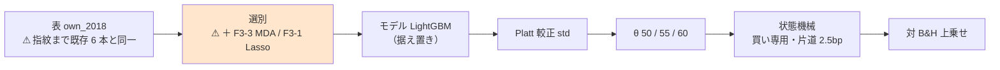
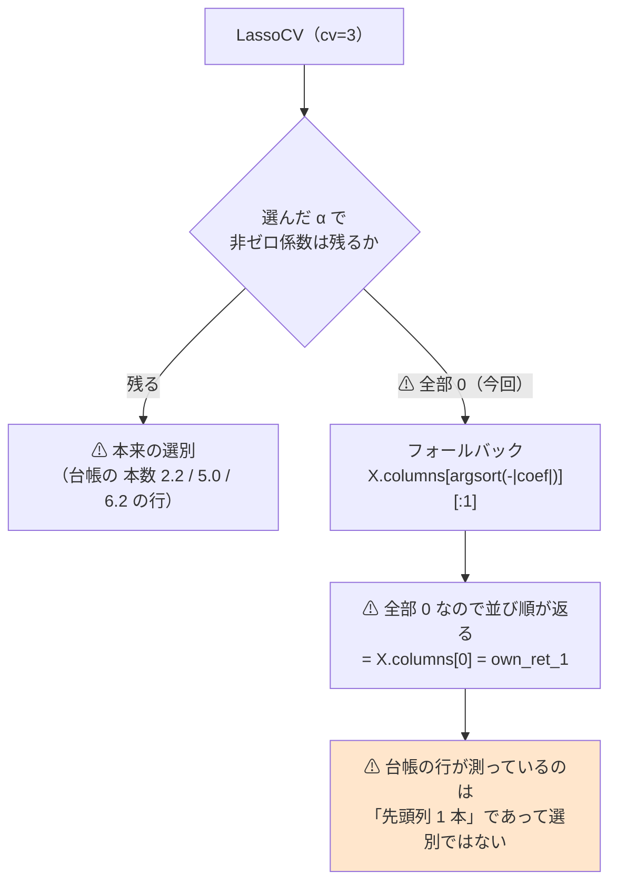

# LightGBM × 閾値売買 に選別 2 本（F3-3 MDA・F3-1 Lasso）— ⚠ **6 行とも「落とす」、そして F3-1 は選別として機能していなかった**

⚠ **結論は 2 つある。**

1. ⚠ **6 行（2 選別 × 3 θ）とも「落とす」。** ⚠ **選別の軸の空白 2 つは埋まった。**
2. ⚠ **より重いのはこちら — `F3-1 Lasso` は 5 fold すべてで 1 本も選べず、フォールバックの「先頭列」が入っていた**（§3）。
   ⚠ **これは今回の実行だけの話ではない。台帳の `本数 1.0` の Lasso 行が全部同じ疑いを持つ**（§3-3）。

プラン: [selectors-lgbm-two.md](../../plans/archive/selectors-lgbm-two.md) ／ 先例: [selectors-small-four.md](selectors-small-four.md) ／
規約: [rules.md 13 章](feature-discovery/rules.md)（閾値つき売買）・[14-10](feature-discovery/rules.md)（空白は積極的に埋める）／ 台帳: [ledger.md](feature-discovery/ledger.md)

> ⚠ **これは投資助言ではなく調査資料である。** ⚠ **数字はすべて【実測】**（2026-09-13）。

---

## 0. 何をやったか

閾値売買で回した選別は **4 本だけ**（F1-4・F1-7・F2-2・F5-1）で、⚠ **実装のある 13 本のうち 9 本が毎日往復にしか無かった。**
⚠ **`gpu_lgbm_2018` が持っている 2 本（F3-3 MDA・F3-1 Lasso）を新しい物差しへ移した。**

| | 回した本数 | 実行 |
| --- | ---: | --- |
| 本番 | 1 | `2026-09-13T10-43-55_sel_lgbm_two` |
| leak 対照 | 1 | `2026-09-13T10-44-50_sel_lgbm_two_leak` |

⚠ **回すと決めたのは結果を見る前**（[14-10 規約 3](feature-discovery/rules.md)。固定した内容はプラン §0-1）。
⚠ **数えた試行は 2 選別 × 3 θ ＝ 6。** `n_trials` **421 → 427**（⚠ **事前の見積もりと一致**）。

⚠ **コードは 1 行も書いていない。** 足したのは config 1 本（`sel_lgbm_two.toml`）で、
⚠ **既存の `trade_own_lgbm_a.toml` と `selectors`（と `name`）以外は 1 key も違わない**【実測。`tomllib` で全 key を突き合わせた】。

> この図の主張: ⚠ **既存の経路のうち差し替わったのは「選別」の箱 1 つだけである。**



⚠ **形式は (A) 共通だけで回した**（プラン §0-2）。⚠ **[13-6](feature-discovery/rules.md) の「両形式」は処置が検証方式のときの要求**で、
⚠ **ここの処置は選別である。** ⚠ **先例 `sel_small4_1995` も (A) だけ**、かつ ⚠ **比較相手になる既存 4 選別が (A) にしか無い。**

---

## 1. 結果 — ⚠ **6 行とも「落とす」**

⚠ **判定は対 B&H の上乗せ**（[13-7](feature-discovery/rules.md)）。B&H は **＋1,652.02bp/fold**。

| 選別 | θ | 選んだ本数 | 純利 bp/fold | ⚠ **上乗せ bp/fold** | fold の符号 | 取引/fold | 保有日率 | 判定 |
| --- | ---: | ---: | ---: | ---: | :---: | ---: | ---: | --- |
| **F3-1 Lasso** | 50 | ⚠ **1.0** | ＋1,598.28 | **−53.74** | 0 0 − − 0 | 87 | 0.801 | **落とす** |
| **F3-1 Lasso** | 55 | ⚠ **1.0** | ＋430.51 | **−1,221.51** | − − − − − | 24 | 0.240 | **落とす** |
| **F3-1 Lasso** | 60 | ⚠ **1.0** | ＋574.04 | **−1,077.98** | ＋ − ＋ − − | 18 | 0.179 | **落とす** |
| **F3-3 MDA** | 50 | 16.0 | ＋1,525.52 | **−126.49** | 0 − − − − | 187 | 0.800 | **落とす** |
| **F3-3 MDA** | 55 | 16.0 | ＋961.66 | **−690.36** | 0 − − − ＋ | 53 | 0.423 | **落とす** |
| **F3-3 MDA** | 60 | 16.0 | ＋417.04 | **−1,234.97** | − − − − − | 14 | 0.101 | **落とす** |

⚠ **純利はどれも正だが、それは B&H が正だからである**（13-7 が「純利の符号で判定しない」と定めた理由）。

### 1-1. ⚠ 基準線と並べる — ⚠ **どちらも「全部使う」を超えていない**

| 手法 | θ=50 の上乗せ | θ=55 | θ=60 |
| --- | ---: | ---: | ---: |
| 全部使う（基準） | −142.14 | −417.25 | −1,254.56 |
| 乱択（基準） | −63.92 | −486.54 | −1,266.93 |
| **F3-1 Lasso** | **−53.74** | −1,221.51 | −1,077.98 |
| **F3-3 MDA** | −126.49 | −690.36 | −1,234.97 |

⚠ **θ=50 で F3-1 が最良（−53.74）だが、`乱択（基準）` との差は ＋10.18bp しかない。**
⚠ **別物である `乱択ゲート`**（[14-6 b](feature-discovery/rules.md) の「同じ保有日数だけでたらめに休む」基準線）**との差も ＋11.85bp・t 1.01** で、⚠ **どちらも区別がついていない。**

> ⚠ **`乱択（基準）` と `乱択ゲート` は別物である。** 前者は**列をでたらめに選ぶ選別**、後者は**日をでたらめに休む売買**。⚠ **混ぜて読まない。**

⚠ **θ を変えると順位が入れ替わる**（θ=55 では F3-1 が全手法中の最下位）。⚠ **順位が安定していない量に意味を持たせない。**

⚠ **「選別が効く」を主張するには、少なくとも `全部使う` と `乱択（基準）` の両方を 3 θ すべてで超える必要がある。** ⚠ **どちらも満たさない。**

---

## 2. leak 対照 — ⚠ **跳ねた（配線は健全）**

| θ | 上乗せ | t | fold の符号 |
| ---: | ---: | ---: | :---: |
| 50 | ⚠ **＋22,193.85bp** | 17.14 | ＋＋＋＋＋ |
| 55 | ⚠ **＋22,193.85bp** | 17.14 | ＋＋＋＋＋ |
| 60 | ⚠ **＋22,193.93bp** | 17.14 | ＋＋＋＋＋ |

既存の leak 対照の実測（＋16,108〜25,131bp・t 7.9〜27.0）と同じ範囲にある（[13-10](feature-discovery/rules.md)）。
⚠ **選別は「標本から学ぶ変換」なので、訓練分割の外を見ていたら leak 対照ではなく本番が跳ねる**（[3 章 B](feature-discovery/rules.md)）。⚠ **本番は跳ねていない。**

---

## 3. ⚠ **本題: F3-1 Lasso は 1 本も選べていなかった**

⚠ **プラン §6 の失敗モード 1（「F3-1 Lasso が全列を 0 に潰す」）が、結果を見る前に書いたとおり起きた。**

### 3-1. 何が起きたか

`ail/selectors/embedded.py` の実装はこうなっている。

```python
@register("selector", "F3-1 Lasso")
def sel_lasso(X, y, k, ctx):
    m = LassoCV(cv=3, random_state=ctx["seed"], n_alphas=20, max_iter=2000).fit(X, y)
    keep = list(X.columns[np.abs(m.coef_) > 0])
    return keep or list(X.columns[np.argsort(-np.abs(m.coef_))[:1]])   # ⚠ フォールバック
```

⚠ **`LassoCV` が交差検証で選んだ罰則 α が強すぎて、係数が 35 本すべて厳密に 0 になる。**
⚠ **すると `keep` は空になり、`or` の右側 ＝ フォールバックが動く。** ⚠ **係数が全部 0 なので `argsort` は元の並び順を返し、`X.columns[0]` が採られる。**

⚠ **再現した**【実測 2026-09-13。同じ表・同じ設定で `LassoCV` を直接叩いた】。

| 訓練の切り方 | 訓練行数 | 選ばれた α | ⚠ 非ゼロ係数 |
| --- | ---: | ---: | ---: |
| fold 1 相当（先頭 33%） | 44,763 | 2.936e-03 | ⚠ **0 / 35** |
| fold 3 相当（先頭 60%） | 81,480 | 1.701e-03 | ⚠ **1 / 35**（最大 \|coef\| **6.98e-19** ＝ 実質 0） |
| fold 5 相当（先頭 85%） | 115,487 | 1.284e-03 | ⚠ **0 / 35** |

### 3-2. ⚠ だから `selected.csv` は 5 fold とも同じ 1 列だった

`runs/2026-09-13T10-43-55_sel_lgbm_two/selected.csv` の実測。

| 選別 | fold ごとの本数 | ⚠ 全 fold で同じ列か | 全 fold 共通の列数 |
| --- | ---: | :---: | ---: |
| **F3-3 MDA** | 16・16・16・16・16 | ⚠ **違う** ✅ | 8 / 16 |
| **F3-1 Lasso** | ⚠ **1・1・1・1・1** | ⚠ **同じ（すべて `own_ret_1`）** | 1 |
| 全部使う（基準） | 35 × 5 | 同じ（当然） | 35 |
| 乱択（基準） | 16 × 5 | 同じ（種が固定なので当然） | 16 |

⚠ **`own_ret_1` は表の 0 列目である**【実測】。⚠ **「Lasso が直前リターンを選んだ」のではなく「何も選べず先頭列が入った」。**

> この図の主張: ⚠ **台帳に「F3-1 Lasso」と書かれた行が実際に測っているのは、選別ではなく「先頭列 1 本だけを使う」である。**



### 3-3. ⚠ 今回の行だけの話ではない

台帳の `F3-1 Lasso`（表示名「Lasso・Elastic Net」）の行を `本数` で見ると【実測 2026-09-13 の台帳】、

| `本数` | 行数の目安 | ⚠ 読み |
| --- | --- | --- |
| **1.0** | 多数（own 日足の Ridge・LightGBM・MLP・GAN 増強・今回の 3 行） | ⚠ **全 fold でフォールバック ＝ 選別として機能していない疑いが濃い** |
| 1.2 / 1.4 / 1.6 | 数行 | ⚠ **一部の fold だけフォールバック**（平均が整数にならない） |
| 2.2 / 5.0 / 6.2 | 数行 | ⚠ **本来の選別が働いている** |

⚠ **`本数 1.0` の行は「Lasso が 1 本に絞った」ではなく「1 本も選べなかった」と読む。** ⚠ **数字は正しいが、名前が中身と合っていない。**

### 3-4. ⚠ 今回は直さない

| # | 理由 |
| ---: | --- |
| 1 | ⚠ **実装を直すと、既存の `F3-1 Lasso` の行が全部「別の手法」になる。** ⚠ **台帳の 427 試行の一部を作り直すことになり、本タスクの範囲を超える**（[14-10 規約 5](feature-discovery/rules.md): 既存行は再計算しない） |
| 2 | ⚠ **「直す」の中身が 1 通りに決まらない** — α の下限を切る ／ `LassoCV` を `lasso_path` に替えて必ず k 本残す ／ フォールバックを「選別できず」として記録し行を落とす、のどれもありうる。⚠ **どれを選ぶかは利用者の裁定** |
| 3 | ⚠ **今回の 6 行は「回したものは全部数える」ので、そのまま `n_trials` に残す**（14-10 規約 1）。⚠ **数字は正しい** |

⚠ **`TODO.md` に別タスクとして起こした。** ⚠ **本記録が根拠になる。**

---

## 4. F3-3 MDA のほうは正常に動いた

| 確かめたこと | 実測 |
| --- | --- |
| fold ごとに列が変わるか | ✅ **変わる**（16 本中 8 本が全 fold 共通、残り 8 本は fold ごとに入れ替わる）。⚠ **全 fold で同一なら先読みの疑いだった** |
| 選んだ本数 | 16.0（`k = 16` のとおり） |
| 門 | ⚠ **門前**（holdout AUC 0.503・買い% 幅 2.1 点）。⚠ **記録するだけで回した**（14-10 規約 2） |
| 上乗せ | ⚠ **3 θ とも負**（−126 / −690 / −1,235bp） |

⚠ **MDA は「モデル依存の順位づけ」なので、LightGBM の使い方に沿った選別になるはずだった。** ⚠ **ならなかった。**
⚠ **原因の候補は AUC 0.503** — ⚠ **並べ替えても成績がほとんど落ちない ＝ どの列も効いていない**ので、順位そのものが雑音である【推測】。

---

## 5. 費用 — ⚠ **見積りより速かった**

| 本 | 見積り【推測】 | ⚠ 実測 |
| --- | ---: | ---: |
| 本番 | 5〜20 分 | **47.4 秒** |
| leak 対照 | 同程度 | **56.9 秒** |
| 合計 | ⚠ **10〜40 分** | ⚠ **1 分 44 秒** |

⚠ **MDA を「重い」と見たのは外れた。** ⚠ **35 列 × 5 fold の並べ替え再評価は 3090 Ti では 1 分に収まる。**
⚠ **ただし CPU 時間は 11 分 45 秒**（`user`）＝ ⚠ **並列で回っているだけで計算量は小さくない。** ⚠ **列が 124 本になれば 3.5 倍になる見込み**【推測】。

---

## 6. 台帳への反映と検算

| # | 検算 | 結果 |
| ---: | --- | --- |
| 1 | `pytest -q tests` | ✅ **276 件 pass** |
| 2 | ⚠ **基準線 2 本が `trade_own_lgbm_a` と 1 バイトも違わない** | ✅ **突き合わせた 30 行（2 手法 × 3 θ × 5 fold）で食い違い 0**（純利・粗利・取引回数・保有日率・的中率のすべて） |
| 3 | ⚠ **回す前の台帳の行が 1 行も消えず 1 バイトも変わらない** | ✅ **消えた台帳の行 0・数字が変わった行 0**。⚠ **足されたのは 13 行**（台帳 6 ／ 実行の一覧 2 ／ 配線の検査 5）。⚠ **既存行で動いたのは 18 行の `再現` 列・代表実行 ID だけ**。⚠ **唯一の文言差は §3 の生成文「落とした 345 行 → 351 行」** |
| 4 | ⚠ **leak 対照が跳ねる** | ✅ ＋22,194bp・t 17.14・5/5（3 θ とも） |
| 5 | **n_trials 421 → 427**（＋6） | ✅ 一致（`checks.json` の `dsr.n_trials` が 427） |
| 6 | `checks.json` の `calibration` が `std` | ✅ `std` |
| 7 | ⚠ **表の指紋が既存 6 本と一致** | ✅ `own_2018/d.parquet` 135,962 行 × 35 列 × 63 銘柄・`raw 81ade06ba58c8e42` / `adjusted 1a9c6d15374af248` |
| 8 | ⚠ **3 θ とも台帳に載る** | ✅ 6 行すべて |
| 9 | ⚠ **選ばれた列が fold で違う** | ⚠ **F3-3 は違う ✅ ／ F3-1 は同じ ❌** → ⚠ **先読みではなくフォールバックが原因と特定した**（§3） |
| 10 | ⚠ **config が既存と `selectors` 以外で違わない** | ✅ `tomllib` で全 key を突き合わせ、差は `selectors` と `name` の 2 つだけ |

⚠ **台帳の総数は 落とす 345 → 351 行・保留 76 行（変わらず）・採る 0 件。**

---

## 7. ⚠ 残ったもの

| | 状態 |
| --- | --- |
| ⚠ **F3-1 Lasso のフォールバック** | ⚠ **未解決。TODO に別タスクとして起こした**（§3-4） |
| **選別の軸** | ⚠ **残り 7 本が毎日往復にしか無い**（F1-1・F1-2・F1-3・F1-5・F2-3・F3-2・F3-5） |
| **LightGBM × 断面**（own cs rel ll） | ⚠ **未実施**（親タスクの手間「小」） |
| **GAN 増強 3 種 × 閾値売買** | ⚠ **未実施**（親タスクの手間「大」） |
| ⚠ **形式 (B) での選別** | ⚠ **回していない**（プラン §0-2 の裁定）。⚠ **足すなら別の試行として ＋6 数える** |

⚠ **本タスクは検出限界を改善しない。** fold 360 日 × 5 では上乗せ t は 1 前後までしか出ない
（[validation-power.md](feature-discovery/validation-power.md)）。⚠ **空白を埋めただけである。**
