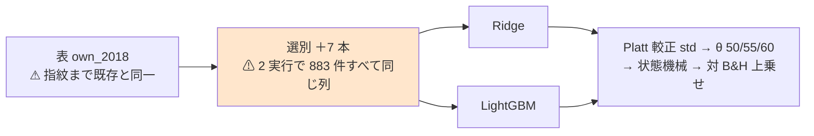

# 選別 7 本（F1-1・F1-2・F1-3・F1-5・F2-3・F3-2・F3-5）× 閾値売買 × Ridge / LightGBM — ⚠ **42 行とも「落とす」**

⚠ **結論は 3 つある。**

1. ⚠ **42 行（7 選別 × 3 θ × 2 モデル）とも「落とす」。** ⚠ **上乗せが正の行は 0**。⚠ **選別の軸の空白は、実装のある 13 本すべてで埋まった。**
2. ⚠ **事前に書いた「選別が効く」の条件（同じモデルの `全部使う`・`乱択` を 3 θ すべてで上回る）を満たした選別は 0 本。** 42 セルのうち両方を上回ったのは 10 セルで、⚠ **どの選別も θ かモデルを替えると入れ替わる**（§2）。
3. ⚠ **7 本は Ridge と LightGBM に「1 列も違わない」列を渡したのに、選別の順位はモデルを替えるとほぼ無相関だった**（θ=50 で順位相関 −0.07）。⚠ **順位の差は選別の差ではなく雑音と読む**（§2-2）。

プラン: [selectors-seven-threshold.md](../../plans/archive/selectors-seven-threshold.md) ／ 先例: [selectors-lgbm-two.md](selectors-lgbm-two.md)・[selectors-small-four.md](selectors-small-four.md) ／
規約: [rules.md 13 章](feature-discovery/rules.md)（閾値つき売買）・[14-10](feature-discovery/rules.md)（空白は積極的に埋める）／ 台帳: [ledger.md](feature-discovery/ledger.md)

> ⚠ **これは投資助言ではなく調査資料である。** ⚠ **数字はすべて【実測】**（2026-09-15）。⚠ **計算で出した値は【実測から計算】と書く。**

---

## 0. 何をやったか

閾値売買で回した選別は **6 本だけ**（F1-4・F1-7・F2-2・F5-1・F3-3・F3-1）で、⚠ **残る 7 本は毎日往復にしか無かった。**
⚠ **同じ 7 本を、own_2018 × 形式 (A) のまま、Ridge と LightGBM の 2 モデルで閾値売買へ移した。**

| | モデル | 実行 |
| --- | --- | --- |
| 本番 | Ridge | `2026-09-15T09-42-43_trade_own_ridge_sel7_a` |
| leak 対照 | Ridge | `2026-09-15T09-45-27_trade_own_ridge_sel7_a_leak` |
| 本番 | LightGBM | `2026-09-15T09-48-15_trade_own_lgbm_sel7_a` |
| leak 対照 | LightGBM | `2026-09-15T09-51-08_trade_own_lgbm_sel7_a_leak` |

⚠ **回すと決めたのは結果を見る前**（[14-10 規約 3](feature-discovery/rules.md)。固定した内容はプラン §0-1）。
⚠ **数えた試行は 7 選別 × 3 θ × 2 モデル ＝ 42。** `n_trials` **511 → 553**（⚠ **事前の見積もりと一致**）。

⚠ **コードは 1 行も書いていない。** 足したのは config 2 本で、⚠ **既存の `trade_own_ridge_a` ／ `trade_own_lgbm_a` と `selectors`・`name` 以外は 1 key も違わない**【実測。`tomllib` で全 25 key を突き合わせた】。

> この図の主張: ⚠ **既存の経路のうち差し替わったのは「選別」の箱 1 つだけで、その出力は 2 モデルで同一だった。**

⚠ **モデルを 2 本にした理由**（プラン §0-2 の 1）: ⚠ **Ridge** は 7 本を毎日往復で測ったモデル、⚠ **LightGBM** は親タスク（GPU 系）と先例 `sel_lgbm_two` のモデル。⚠ **片方だけだともう片方が空白として残る。**
⚠ **形式は (A) 共通だけ**（先例と同じ。⚠ **比較相手の既存 6 選別が (A) にしか無い**）。

---

## 1. 結果 — ⚠ **42 行とも「落とす」**

⚠ **判定は対 B&H の上乗せ**（[13-7](feature-discovery/rules.md)）。B&H は **＋1,652.02bp/fold**（両モデル共通）。
⚠ **純利はどれも 0 以上だが、それは B&H が正だからである**（13-7 が純利の符号で判定しない理由）。

### 1-1. Ridge

| 選別 | θ | 本数 | ⚠ **上乗せ bp/fold** | t | fold の符号 | 取引/fold | 保有日率 |
| --- | ---: | ---: | ---: | ---: | :---: | ---: | ---: |
| F1-2 相互情報量 | 50 | 16.0 | **−148.51** | −1.14 | − ＋ − − − | 737 | 0.76 |
| F1-5 検定+FDR | 50 | 27.8 | **−180.34** | −0.80 | − ＋ − − ＋ | 1,115 | 0.72 |
| F3-2 木の重要度 | 50 | 16.0 | **−300.74** | −1.11 | − ＋ − − 0 | 1,146 | 0.73 |
| F2-3 Boruta | 50 | 17.8 | **−314.53** | −1.40 | − ＋ − − ＋ | 1,038 | 0.74 |
| F3-5 クラスタ化MDA | 50 | 16.0 | **−330.97** | −1.40 | − ＋ − − ＋ | 889 | 0.74 |
| F1-3 mRMR | 50 | 16.0 | **−345.99** | −1.15 | − ＋ − − ＋ | 1,340 | 0.72 |
| F1-1 相関 | 50 | 16.0 | **−389.80** | −1.44 | − ＋ − − ＋ | 1,344 | 0.72 |
| F1-2 相互情報量 | 55 | 16.0 | **−402.29** | −1.61 | ＋ − − − ＋ | 54 | 0.57 |
| F1-3 mRMR | 55 | 16.0 | **−442.21** | −3.23 | − ＋ − − − | 155 | 0.62 |
| F1-5 検定+FDR | 55 | 27.8 | **−603.85** | −1.49 | − ＋ − − − | 108 | 0.55 |
| F3-2 木の重要度 | 55 | 16.0 | **−648.62** | −1.64 | − − − − − | 98 | 0.56 |
| F1-1 相関 | 55 | 16.0 | **−661.51** | −1.90 | − ＋ − − − | 150 | 0.56 |
| F2-3 Boruta | 55 | 17.8 | **−677.61** | −1.80 | − − − − − | 91 | 0.55 |
| F3-5 クラスタ化MDA | 55 | 16.0 | **−773.77** | −3.45 | − − − − − | 100 | 0.50 |
| F1-5 検定+FDR | 60 | 27.8 | **−949.69** | −2.28 | ＋ − − − − | 37 | 0.30 |
| F2-3 Boruta | 60 | 17.8 | **−987.30** | −2.51 | − − − − − | 32 | 0.30 |
| F1-3 mRMR | 60 | 16.0 | **−995.99** | −2.66 | − − − − − | 51 | 0.36 |
| F3-2 木の重要度 | 60 | 16.0 | **−1,017.93** | −2.78 | − − − − − | 35 | 0.30 |
| F1-2 相互情報量 | 60 | 16.0 | **−1,096.72** | −2.06 | ＋ − − − − | 18 | 0.18 |
| F3-5 クラスタ化MDA | 60 | 16.0 | **−1,268.25** | −2.84 | − − − − − | 40 | 0.24 |
| F1-1 相関 | 60 | 16.0 | **−1,289.64** | −4.03 | − − − − − | 50 | 0.32 |

最良の行（θ=50 の F1-2）の DSR は **0.087**（`n_trials` 532 の時点。13-7 の注記どおり ⚠ **SR > 0 の検定であって B&H を超えたかの検定ではない**）。

### 1-2. LightGBM

| 選別 | θ | 本数 | ⚠ **上乗せ bp/fold** | t | fold の符号 | 取引/fold | 保有日率 |
| --- | ---: | ---: | ---: | ---: | :---: | ---: | ---: |
| F1-1 相関 | 50 | 16.0 | **−29.97** | −0.40 | 0 ＋ − − ＋ | 186 | 0.79 |
| F1-2 相互情報量 | 50 | 16.0 | **−48.51** | −0.86 | 0 ＋ − 0 ＋ | 64 | 0.80 |
| F3-5 クラスタ化MDA | 50 | 16.0 | **−62.01** | −1.09 | 0 0 − ＋ − | 110 | 0.80 |
| F2-3 Boruta | 50 | 17.8 | **−118.28** | −1.63 | 0 0 − 0 − | 194 | 0.79 |
| F1-5 検定+FDR | 50 | 27.8 | **−178.60** | −1.36 | 0 ＋ − − − | 276 | 0.79 |
| F3-2 木の重要度 | 50 | 16.0 | **−196.34** | −1.78 | 0 ＋ − − − | 236 | 0.79 |
| F1-3 mRMR | 50 | 16.0 | **−268.20** | −2.02 | ＋ ＋ − − − | 860 | 0.81 |
| F1-1 相関 | 55 | 16.0 | **−674.60** | −1.58 | 0 − − − − | 50 | 0.43 |
| F3-5 クラスタ化MDA | 55 | 16.0 | **−686.42** | −1.41 | 0 − − − ＋ | 28 | 0.36 |
| F1-5 検定+FDR | 55 | 27.8 | **−720.85** | −1.74 | 0 − − − − | 95 | 0.49 |
| F1-3 mRMR | 55 | 16.0 | **−728.46** | −1.61 | 0 − ＋ − − | 132 | 0.48 |
| F3-2 木の重要度 | 55 | 16.0 | **−743.64** | −1.54 | 0 − − − ＋ | 100 | 0.49 |
| F2-3 Boruta | 55 | 17.8 | **−783.66** | −1.72 | 0 − − − − | 63 | 0.36 |
| F1-2 相互情報量 | 55 | 16.0 | **−946.23** | −2.27 | 0 − − − − | 23 | 0.29 |
| F1-3 mRMR | 60 | 16.0 | **−911.98** | −1.74 | ＋ − ＋ − − | 69 | 0.32 |
| F3-2 木の重要度 | 60 | 16.0 | **−1,193.99** | −2.20 | − − − − ＋ | 49 | 0.16 |
| F2-3 Boruta | 60 | 17.8 | **−1,215.83** | −2.46 | − − − − − | 28 | 0.12 |
| F1-5 検定+FDR | 60 | 27.8 | **−1,368.43** | −3.00 | − − − − − | 41 | 0.13 |
| F3-5 クラスタ化MDA | 60 | 16.0 | **−1,512.36** | −3.60 | − − − − − | ⚠ **3** | ⚠ **0.02** |
| F1-1 相関 | 60 | 16.0 | **−1,553.37** | −3.81 | − − − − − | 16 | 0.08 |
| F1-2 相互情報量 | 60 | 16.0 | ⚠ **−1,652.02** | −3.73 | − − − − − | ⚠ **0** | ⚠ **0.00** |

最良の行（θ=50 の F1-1）の DSR は **0.103**（`n_trials` 553）。

⚠ **LightGBM θ=60 の F1-2 は 5 fold とも 1 回も建てなかった**（ずっと休む ＝ 上乗せがちょうど −B&H）。⚠ **プラン §6 の失敗モード 7（「全部持つ / 全部休む」に潰れる）が起きた**（§3）。

---

## 2. ⚠ 基準線と並べる — ⚠ **どの選別も入れ替わる**

### 2-1. 事前条件「同じモデルの `全部使う` と `乱択` を 3 θ すべてで上回る」

| モデル | θ | 全部使う（基準） | 乱択（基準） | ⚠ 両方を上回った選別 |
| --- | ---: | ---: | ---: | --- |
| Ridge | 50 | −270.89 | −556.05 | F1-2 ・ F1-5（2/7） |
| Ridge | 55 | −540.17 | −657.36 | F1-2 ・ F1-3（2/7） |
| Ridge | 60 | −943.72 | −1,072.25 | ⚠ **なし（0/7）** |
| LightGBM | 50 | −142.14 | −63.92 | F1-1 ・ F1-2 ・ F3-5（3/7。⚠ **F3-5 の差は 1.9bp**） |
| LightGBM | 55 | −417.25 | −486.54 | ⚠ **なし（0/7）** |
| LightGBM | 60 | −1,254.56 | −1,266.93 | F1-3 ・ F3-2 ・ F2-3（3/7） |

⚠ **3 θ そろって上回った選別は、両モデルとも 0 本。** ⚠ **42 セル中 10 セルで上回ったが、同じ選別が続けて上回ったのは Ridge の F1-2（θ=50・55）だけで、その F1-2 は LightGBM では θ=55・60 で最下位**だった。
⚠ **基準線の数字は既存 `trade_own_ridge_a` ／ `trade_own_lgbm_a` と 1 バイトも違わない**（§5 の 2）。

### 2-2. ⚠ 同じ列を渡しても、順位はモデルで入れ替わる

⚠ **7 本はどれも本体のモデルを使わずに選ぶので、Ridge 実行と LightGBM 実行が選んだ列は `selected.csv` の 883 件すべてで一致した**【実測】。⚠ **それでも θ=50 の順位はこうなった。**

| 順位 | Ridge（θ=50） | LightGBM（θ=50） |
| ---: | --- | --- |
| 1 | F1-2 相互情報量 | ⚠ **F1-1 相関** |
| 2 | F1-5 検定+FDR | F1-2 相互情報量 |
| 3 | F3-2 木の重要度 | F3-5 クラスタ化MDA |
| 4 | F2-3 Boruta | F2-3 Boruta |
| 5 | F3-5 クラスタ化MDA | F1-5 検定+FDR |
| 6 | F1-3 mRMR | F3-2 木の重要度 |
| 7 | ⚠ **F1-1 相関** | F1-3 mRMR |

⚠ **順位相関（Spearman）は −0.07**【実測から計算】。⚠ **F1-1 は Ridge で最下位・LightGBM で最上位。**
⚠ **「どの列を選んだか」が同じなのに順位がほぼ無相関 ＝ 順位を決めているのは選別ではなく、モデルと列の組み合わせの雑音である**【推測】。⚠ **だから θ=50 の LightGBM F1-1（−29.97bp・t −0.40）を「7 本の最良」と読まない。**

先例 `sel_lgbm_two` の 2 本（F3-1 −53.74 ／ F3-3 −126.49bp。θ=50）を足した **LightGBM × own × θ=50 の 9 本**でも、⚠ **上乗せが正のものは 0 本**である。

---

## 3. ⚠ LightGBM は買い% が潰れていた — ⚠ **θ 別の差を「閾値の効き」と読まない**

⚠ **門の値（診断。訓練内 holdout の fold 中央値。採否には使わない — [14-5](feature-discovery/rules.md)）**を並べると、2 モデルの差がはっきり出る。

| 選別 | Ridge の AUC | Ridge の買い% 幅 | LightGBM の AUC | LightGBM の買い% 幅 |
| --- | ---: | ---: | ---: | ---: |
| F1-1 相関 | 0.5010 | 7.94 点 | 0.4986 | 1.25 点 |
| F1-2 相互情報量 | 0.5057 | 3.30 点 | 0.5024 | 1.13 点 |
| F1-3 mRMR | 0.4882 | 8.83 点 | ⚠ **0.5186** | 1.56 点 |
| F1-5 検定+FDR | 0.4957 | 5.03 点 | 0.5054 | 1.64 点 |
| F2-3 Boruta | 0.4963 | 5.77 点 | 0.4979 | 2.44 点 |
| F3-2 木の重要度 | 0.4940 | 6.12 点 | 0.5102 | 1.70 点 |
| F3-5 クラスタ化MDA | 0.4940 | 4.61 点 | 0.5018 | ⚠ **0.15 点** |
| 全部使う（基準） | 0.4976 | 5.86 点 | 0.5000 | 1.26 点 |

⚠ **LightGBM の買い% 幅は 0.15〜2.44 点で、θ の間隔（5 点）より狭い。** ⚠ **θ を 1 段上げると、ほぼ全部の日が同時に閾値の下へ落ちる。**
⚠ **F3-5（幅 0.15 点）が θ=60 で保有日率 0.02、F1-2 が θ=60 で取引 0 になったのはこの形**である。
⚠ **Ridge は 3.30〜8.83 点**で、θ=60 でも取引は 18〜51 回/fold 残った。

⚠ **AUC は 16 値すべてが 0.52 未満**（最大は LightGBM F1-3 の 0.5186）。⚠ **42 行とも「門前」だったが、14-10 規約 2 のとおり回して数えた。**
⚠ **MLP・GAN 増強で見た「潰れ」と同じ形**（[mlp-threshold-trading.md](mlp-threshold-trading.md)）で、⚠ **選別を替えても直らなかった。**

---

## 4. 選別は機械としては正常に動いた

⚠ **先例で F3-1 Lasso は 1 本も選べずフォールバックに落ちていた。** 同じ穴（プラン §6 の失敗モード 1）を 7 本すべてで確かめた。

| 選別 | fold ごとの本数 | 全 fold 共通 | 延べの異なる列 | ⚠ 全 fold 同一 |
| --- | --- | ---: | ---: | :---: |
| F1-1 相関 | 16・16・16・16・16 | 5 | 24 | いいえ ✅ |
| F1-2 相互情報量 | 16・16・16・16・16 | 13 | 19 | いいえ ✅ |
| F1-3 mRMR | 16・16・16・16・16 | 10 | 22 | いいえ ✅ |
| F1-5 検定+FDR | ⚠ **25・28・28・29・29** | 23 | 30 | いいえ ✅ |
| F2-3 Boruta | ⚠ **13・19・20・14・23** | 9 | 26 | いいえ ✅ |
| F3-2 木の重要度 | 16・16・16・16・16 | 8 | 22 | いいえ ✅ |
| F3-5 クラスタ化MDA | 16・16・16・16・16 | 13 | 20 | いいえ ✅ |

⚠ **k を使わない F1-5・F2-3 もフォールバック（1 本）には落ちていない。** ⚠ **F1-5 は 35 本中 25〜29 本を「有意」として残した** ＝ ⚠ **13.6 万行では相関の検定がほとんどの列を通す**（行数を標本数と読むと t を過大に読む。12 章 限界 2 の形）【推測】。

⚠ **F1-1 と F1-3 は同じ材料（|相関|）を使う**ので重なりを数えた: ⚠ **16 本中 7〜8 本が共通**（fold ごとに 7・8・7・7・7）。⚠ **2 試行として数えたが、独立な 2 本の証拠とは読まない**（プラン §6 の 2）。

---

## 5. leak 対照と検算

### 5-1. leak 対照 — ⚠ **跳ねた（配線は健全）・7 本とも先読みの列を拾った**

| モデル | 7 選別の上乗せ | t | fold の符号 | ⚠ `LEAK_future_ret` を選んだ fold |
| --- | ---: | ---: | :---: | :---: |
| Ridge | ⚠ **＋22,193.72〜＋22,194.61bp** | 17.14 | ＋＋＋＋＋ | ⚠ **7 本とも 5/5** |
| LightGBM | ⚠ **＋22,189.2〜＋22,193.5bp** | 17.13〜17.15 | ＋＋＋＋＋ | ⚠ **7 本とも 5/5** |

既存の leak 対照の実測（＋16,108〜25,131bp・t 7.9〜27.0）と同じ範囲にある（[13-10](feature-discovery/rules.md)）。
⚠ **`乱択（基準）` だけは跳ねない**（Ridge −293.80 / −389.25 / −996.71bp、LightGBM −153.9 / −690.2 / −1,375.5bp）。⚠ **でたらめに選んだ 16 本に先読みの列が入らない（0/5）からで、これも期待どおり。**
⚠ **選別は「標本から学ぶ変換」なので、訓練分割の外を見ていたら leak 対照ではなく本番が跳ねる**（[3 章 B](feature-discovery/rules.md)）。⚠ **本番は跳ねていない。**

⚠ **副産物: 先読みの列があると F2-3 Boruta は 1〜5 本に縮む**（本番は 13〜23 本）。⚠ **先読みの列の重要度が影の最大値を押し上げ、他の列が全部その下に沈む**ため。⚠ **Boruta の本数は「一番強い列」との相対で決まる**ことが見えた。

### 5-2. 検算（プラン §4 の 12 項目）

| # | 検算 | 結果 |
| ---: | --- | --- |
| 1 | `pytest -q tests` | ✅ **294 件 pass**（着手時と同じ。コードを変えていない） |
| 2 | ⚠ **基準線 4 本が既存と 1 バイトも違わない** | ✅ Ridge は `2026-09-13T08-57-34_trade_own_ridge_a`、LightGBM は `2026-09-13T08-57-48_trade_own_lgbm_a` と、⚠ **それぞれ 60 行（基準線 4 本 × 3 θ × 5 fold）× 10 列で食い違い 0** |
| 3 | ⚠ **回す前の台帳の行が消えず、数字が変わらない** | ✅ **§2 の既存 843 行で消えた行 0・数字か判定が変わった行 0**（鍵 13 列 ＋ 数字 7 列で突き合わせ）。⚠ **足されたのは 42 行**。⚠ **既存行で動いたのは基準線 18 行の `再現` と `実行` だけ**（同じ鍵の実行が増えたため） |
| 4 | ⚠ **leak 対照が跳ねる** | ✅ §5-1 |
| 5 | **n_trials 511 → 553**（＋42） | ✅ 一致（LightGBM 本番の `checks.json` の `dsr.n_trials` が 553。Ridge 本番は回した時点の 532） |
| 6 | `checks.json` の `calibration` が `std` | ✅ 4 実行とも `std` |
| 7 | ⚠ **表の指紋が既存と一致** | ✅ `own_2018/d.parquet` 135,962 行 × 35 列 × 63 銘柄・`raw 81ade06ba58c8e42` / `adjusted 1a9c6d15374af248` |
| 8 | ⚠ **3 θ × 7 選別 × 2 モデルが全部台帳に載る** | ✅ 42 行 |
| 9 | ⚠ **選ばれた列が fold で違う** | ✅ 7 本とも違う（§4） |
| 10 | ⚠ **7 選別の列が Ridge と LightGBM で一致** | ✅ **883 件すべて一致・片方だけ 0 件**（RF を回す 3 本も種 0 で決定的だった） |
| 11 | ⚠ **config が既存と `selectors`・`name` 以外で違わない** | ✅ `tomllib` 全 25 key。Ridge 版と LightGBM 版の差は `model`・`name` だけ |
| 12 | ⚠ **`env.json` の `git_commit` が実際に走ったコード** | ✅ **4 実行とも `a0581ce`**。⚠ **config 2 本は未コミットで回した**が、⚠ **コードは HEAD のままで、config の中身は各実行の `config.json` に残る**。⚠ **キューの走行中はコミットしていない** |

⚠ **台帳の総数は 落とす 434 → 476 行・保留 77 行（変わらず）・採る 0 件。** 台帳の差分は **追加 128 行・削除 40 行**（台帳 §2 の 42 行と基準線 18 行の書き換え、§4 実行の一覧 ＋4、§5 配線の検査の書き換え）。

---

## 6. 費用 — ⚠ **見積りの下限よりも速かった**

| 本 | 見積り【推測】 | ⚠ 実測（経過） | CPU（user） |
| --- | ---: | ---: | ---: |
| Ridge 本番 | 3〜15 分 | **2 分 45 秒**（164.6 秒） | 40 分 35 秒 |
| Ridge leak | 同程度 | **2 分 47 秒**（167.3 秒） | 42 分 26 秒 |
| LightGBM 本番 | 4〜17 分 | **2 分 54 秒**（173.8 秒） | 41 分 54 秒 |
| LightGBM leak | 同程度 | **3 分 18 秒**（197.6 秒） | 43 分 43 秒 |
| 合計（直列） | ⚠ **15〜65 分** | ⚠ **11 分 43 秒** | ⚠ **2 時間 48 分** |

⚠ **5 回目の過大な外れ**（見積りの下限 15 分をさらに下回った）。⚠ **CPU は経過の約 14 倍** ＝ ⚠ **32 コアの並列で縮んでいるだけで、計算量は小さくない。** 最大 RSS は 1.47GB。
⚠ **基準線だけの `trade_own_ridge_a` は 5 秒だったので、選別 7 本の計算が 1 本あたり約 160 秒を占める**【実測から計算】。⚠ **選別ごとの内訳は測っていない。**

---

## 7. ⚠ 残ったもの・広げていないもの

| | 状態 |
| --- | --- |
| ⚠ **選別の軸（形式 (A)・own 表）** | ✅ **閉じた。** 実装のある 13 本（＋ 直した F3-1b）すべてに閾値売買の行がある |
| ⚠ **モデルの軸（own・ownex）** | ✅ 2026-09-15 に閉じている（[gan-threshold-ownex.md](gan-threshold-ownex.md)） |
| **形式 (B) での選別** | ⚠ **回していない**（プラン §0-2 の 2）。⚠ **足すなら別の試行として数える**（2 モデルで ＋42） |
| **ownex・断面の表での 7 選別** | ⚠ **回していない**（断面は F3-3・F3-1・F3-1b だけ。[lasso-fix-cs-threshold.md](lasso-fix-cs-threshold.md)） |
| **LightGBM の買い% が潰れる理由** | ⚠ **測っていない**（§3。⚠ **選別を替えても直らない**ところまで） |
| **選別ごとの計算時間** | ⚠ **測っていない**（§6） |

⚠ **本タスクは検出限界を改善しない。** fold 約 340 日 × 5 では上乗せ t は 1 前後までしか出ない
（[validation-power.md](feature-discovery/validation-power.md)）。⚠ **LightGBM F1-1 θ=50 の −29.97bp（t −0.40）は「勝っていない」であって「引き分けを検出した」ではない。**
⚠ **数字を毎日往復の行と直接比べない**（[13-8](feature-discovery/rules.md)。fold の切り方も行数も違う）。
