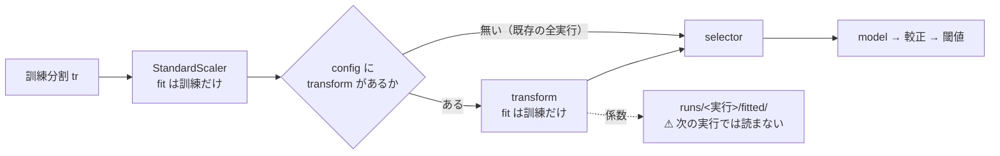

# 台帳の空白を埋めた（手間「小」の 4 件）

⚠ **結論: 4 件とも「採る」に届かなかった。** ⚠ **だが空白は埋まり、⚠ 3 件は「効かない」ではなく「測れる差を作らない」ことが分かった。**

プラン: [selectors-small-four.md](../../plans/archive/selectors-small-four.md) ／ 規約: [rules.md 14-10](feature-discovery/rules.md)（空白は積極的に埋める）／ 台帳: [ledger.md](feature-discovery/ledger.md)

> ⚠ **これは投資助言ではなく調査資料である。** ⚠ **数字はすべて【実測】**（2026-09-12）。

---

## 0. 何をやったか

[rules.md 14-10](feature-discovery/rules.md)（利用者の決定 2026-09-12）に従い、台帳 §3 の未実施を**手間の小さい順**に埋めた、その先頭 4 件。

| ID | 手法 | 種類 | 実行 |
| --- | --- | --- | --- |
| F2-2 | 再帰的特徴量削減（RFE） | `selector` | `sel_small4_1995` |
| F1-7 | 情報係数（IC）の時系列安定性 | `selector` | `sel_small4_1995` |
| F1-4 | 分散しきい値 | `selector` | `sel_small4_1995` |
| F5-1 | PCA・主成分 | ⚠ **`transform`** | `pca_1995` |

土俵は `trade_own_1995_ridge_a` と ⚠ **`selectors` の行だけが違う**設定（[13-8](feature-discovery/rules.md) の橋渡しの形）。
⚠ **回すと決めたのは結果を見る前**（14-10 規約 3）。⚠ **数えた試行は 4 手法 × θ 3 水準 ＝ 12。** `n_trials` **253 → 265**（事前の見積もりと一致）。

---

## 1. ⚠ 回す前に書いた 2 つの穴は、どちらも実在した

⚠ **プラン §0-1 に「結果を見る前」に書いたもの。** ⚠ **どちらも台帳 §3 の「実装 10 行」が成り立たないという意味だった。**

### 穴 1: F5-1 PCA は `selector` の契約に入らない ✅ **実在した**

選別の契約は `selector(X, y, k, ctx) -> 既存の列名の一覧` で、呼び出し側が `Xtr[cols]` を取る（`cli/run.py:79`）。
⚠ **PCA が作る `pc0..pcN` は `Xtr` に無い**し、⚠ **検証分割 `Xte` は選別に渡らない**ので transform を当てる先も無い。

**採った手**: registry に種類 **`transform`** を 1 つ足し、⚠ **標準化と選別の間に 1 段**入れた（`ail/validation/prep.py`）。
⚠ **理由は「PCA のため」ではなく「同じ穴を 4 回掘らないため」** — 未実施の残り 12 件のうち **F5-2 AE・F4-4 多項式展開・F5-4 ウェーブレット**が同じ口に乗る。

> この図の主張: ⚠ **変換は選別の前に 1 段だけ入り、config に `transform` が無ければ 1 行も通らない。**

### 穴 2: F1-4 は定義から退化する ✅ **実在した。だが 2 列だけ拾った**

選別に渡る `Xtr` は `StandardScaler` 済みなので ⚠ **訓練分割での分散は全列ちょうど 1**。分散で順位を付けると並ぶのは数値誤差だけになる。

⚠ **だから実装は「k を使わず、しきい値を下回る列を落とすだけ」にした**（`VarianceThreshold` に忠実。F1-5・F2-3 と同じ扱い）。

✅ **結果: 35 列のうち 2 列を落とした**【実測】 — ⚠ **5 fold とも `own_tod_cos` と `own_tod_sin`**。
⚠ **日足では「時刻」が全行同じなので、この 2 列は定数である。** ⚠ **F1-4 は日足の表に死んだ列が 2 本あることを正しく見つけた。**

⚠ **ただし成績はまったく動かなかった**: F1-4 の結果は ⚠ **「全部使う（基準）」と 1 ビットも違わない**（60 行の `result.csv` が完全一致）。
⚠ **定数列は Ridge に何も寄与しないので、落としても落とさなくても同じ**である。

---

## 2. 結果

⚠ **判定は対 B&H 上乗せの符号**（[13-7](feature-discovery/rules.md)）。⚠ **純利の符号では「買って持っただけ」と区別できない。**

| 手法 | θ | 純利bp/fold | ⚠ 対 B&H 上乗せ | fold の符号 | DSR | 判定 |
| --- | ---: | ---: | ---: | :-: | ---: | :-: |
| **F2-2 RFE** | 50 | ＋5,143.31 | **＋527.42** | 1/5 ＋0000 | 0.518 | **保留** |
| F1-4 分散しきい値 | 50 | ＋4,999.98 | ＋384.10 | 1/5 ＋0000 | 0.496 | **保留** |
| F1-7 IC の安定性 | 50 | ＋4,553.80 | −62.09 | 0/5 −0000 | 0.416 | **落とす** |
| F5-1 PCA | 50 | ＋4,553.80 | −62.09 | 0/5 −0000 | 0.416 | **落とす** |
| （参考）全部使う（基準） | 50 | ＋4,999.98 | ＋384.10 | 1/5 ＋0000 | — | 基準線 |
| （参考）乱択（基準） | 50 | ＋4,553.80 | −62.09 | 0/5 | — | 基準線 |

⚠ **θ=55・60 は 4 手法とも「落とす」**（上乗せ −4,392 〜 −4,624bp）。⚠ **3 閾値の符号が揃った手法は 1 つも無い。**

⚠ **「採る」は 0 件のまま**（台帳全体でも 0 件）。

### 2-1. ⚠ いちばん効いた結果は「3 手法が乱択と 1 ビットも違わない」こと

| 比較 | `result.csv` 60 行の完全一致 |
| --- | :-: |
| F1-4 分散しきい値 ↔ 全部使う（基準） | ✅ **一致** |
| F1-7 IC の安定性 ↔ 乱択（基準） | ✅ **一致** |
| F5-1 PCA ↔ 乱択（基準） | ✅ **一致** |
| F2-2 RFE ↔ 全部使う（基準） | ⚠ **違う**（唯一動いた） |

⚠ **予測は違うのに売買が同じ**である（例: F1-7 の IC 0.0223 対 乱択 0.0211）。
⚠ **較正した買い% に幅が無いので、θ を跨ぐ日が無い** ＝ 状態機械が fold ごとに「ずっと持つ」か「ずっと休む」のどちらかに潰れる。

✅ **門の実測がそれを裏づける**【実測】: ⚠ **買い% の p05-p95 幅は 4 手法とも 0.0 点**（門の水準は 20 点）。AUC は 0.519〜0.528 で ⚠ **こちらは門を通る**。
⚠ **つまり「順位はわずかに付くが、確率に幅が出ない」。**

⚠ **これは前のタスクが残した示唆と同じ形である**（[entry-timing.md](entry-timing.md): ⚠ **D 系の買い% は幅 0.0008〜10.6 点・5 fold のうち 3 fold は B&H と 1 日も違わない**）。
⚠ **選別を替えても、変換を替えても、律速はそこではなかった。**

### 2-2. F2-2 RFE だけが基準線を超えた（が届かない）

⚠ **上乗せ ＋527.42bp は「全部使う」の ＋384.10bp を超える**【実測】。35 列から 16 列に絞ると成績が上がる方向。
⚠ **だが fold の符号は 1/5・t 1.00・DSR 0.518** で、⚠ **[14-2](feature-discovery/rules.md) の検出限界に遠い。**
⚠ **しかも θ=55 で ＋−−−−、θ=60 で −−−−− と符号が崩れる。** ⚠ **1 つの閾値でだけ良いのは、偶然と区別できない。**

### 2-3. F5-1 PCA — 情報は保っているが、成績には出ない

16 成分で ⚠ **元の 35 列の分散の 91.47%** を説明する【実測】（第 1 主成分 24.2%）。⚠ **圧縮そのものは効いている。**
⚠ **それでも売買は乱択と 1 ビットも違わない。** ⚠ **「直交化しても情報は増えない」が実測になった。**

✅ **副産物**: 台帳 §3 の **F5-2 オートエンコーダの見送り理由**（「⚠ PCA が効かないなら AE も効かない。PCA の結果を見てから判断する」）の ⚠ **前提が実測で埋まった。**

---

## 3. 検算

| # | 何を確かめたか | 結果 |
| ---: | --- | --- |
| 1 | ⚠ **`--leak` 対照が跳ねる**（[7 章 規約 7](feature-discovery/rules.md)・14-10 規約 6） | ✅ 上乗せ **＋81,363bp・t 11.30**（selector 側）／ **＋81,352bp・t 11.30**（PCA 側） |
| 2 | ⚠ **配線を足しても既存の実行が変わらない** | ✅ `trade_own_1995_ridge_a` を回し直し、⚠ **共有列 3,672 行が完全一致**（`per_symbol.csv` 3,600 行・`result.csv` 60 行・`summary.csv` 12 行） |
| 3 | ⚠ **台帳の既存の行の数字が変わらない** | ✅ **数字が変わった行 0**。⚠ **動いた 12 行は全部基準線で、再現欄が `—` → `3 実行・一致` になっただけ** |
| 4 | ⚠ **`n_trials` が事前の見積もりと合う** | ✅ **253 → 265（＋12）**。事前に数えた 12 と一致 |
| 5 | ⚠ **変換が無いとき配線が素通りする** | ✅ テストで固定（⚠ **同じオブジェクトが返ることまで見る**） |
| 6 | ⚠ **PCA の fit に検証分割が入っていない** | ✅ テストで固定（⚠ **検証分割を丸ごと壊しても訓練分割の主成分が 1 ビットも動かない**） |
| 7 | 全体のテスト | ✅ **274 件 pass**（前 256 ＋ 新規 18） |

### 3-1. ⚠ 途中で踏んだこと 2 つ（配線の話）

- ⚠ **F2-2 RFE は列の尺度に依存する。** 合成データのテストで ⚠ **「y を並べ替えても同じ列を選ぶ」**が出た。原因は ⚠ **Ridge の係数が尺度だけで決まっていた**こと（尺度の小さい列ほど係数が大きい）。⚠ **本番は `StandardScaler` 済みなので起きない**が、⚠ **その前提が崩れると F2-2 はラベルを見ていないのと同じになる**（実装の docstring に明記した）
- ⚠ **`catalog.implemented()` は `selector` しか見ていなかった。** ⚠ **F5-1 は `transform` なので、回しても台帳 §3 では「未実施」のままになるところだった** — ⚠ **空白の数え方が静かに狂う形の誤り**。両方の種類を見るように直し、テストで固定した

---

## 4. ⚠ 代償は事前の見積もりどおり小さかった

| n_trials | SR0 | 同じ実行の DSR |
| ---: | ---: | ---: |
| 253（この作業の前） | 0.034926 | 0.4963 |
| 265（4 件を足した後） | 0.035108 | — |

⚠ **SR0 の上がり方は ＋0.52%**【実測】。⚠ **[14-10](feature-discovery/rules.md) の「n_trials は DSR を √ln N でしか悪化させない」がそのまま出た。**
⚠ **採否の判定式に DSR は入らない**（13-7 は上乗せの符号）ので、⚠ **試行を増やしても採用しにくくなっていない。**

---

## 5. ⚠ 限界（先に書いたものと、回して増えたもの）

- ⚠ **銘柄集合・期間・モデル・形式を 1 つも動かしていない。** 言えるのは「この土俵では効かない」だけで、(B) 銘柄別で効く可能性は閉じていない
- ⚠ **F5-1 の成分数は 16 の 1 水準しか試していない。** 水準を増やすとそのぶん `n_trials` が増える（[14-9](feature-discovery/rules.md)）
- ⚠ **F1-4 を「他の手法の前に挟む」形は試していない。** ⚠ **挟む形は別の試行になる**。⚠ **ただし落とせるのは定数 2 列だけと分かったので、挟んでも結果は変わらない**【実測】
- ~~⚠ **新しく増えた限界**: ⚠ **3 手法が乱択と一致した理由を切り分けていない。** 較正（Platt）・ラベル・Ridge・`own` 35 列のどれが買い% の幅を潰しているかは分からないまま~~
  ✅ **2026-09-12 に切り分けて直した**（[buy-pct-width-collapse.md](buy-pct-width-collapse.md)）: 犯人は ⚠ **較正（Platt）の数値解が 1 反復で止まっていたこと。** ⚠ **ラベルでも Ridge でも列でもなかった。**
  ⚠ **直して回し直すと取引が 1,505 → 9,202 回/fold に増え、3 手法は乱択とも互いとも違う売買になった。** ⚠ **それでも「採る」は 0 件**（θ=50 の上乗せ ＋728.5bp・t 0.47）
- ⚠ **配線（`transform` の段）は以後の全実行が通る。** ⚠ **空のとき 1 行も通らないことをテストで固定してあるが、そこが壊れれば静かに全実行へ効く**

---

## 6. ⚠ 次の一手

⚠ **「選別を替える」「変換を替える」で動かない**ことが 4 件ぶん増えた。⚠ **[entry-timing.md](entry-timing.md) の結論と同じ方向を指している。**

| 次 | 中身 | ⚠ なぜ |
| --- | --- | --- |
| **1** | ⚠ **検知器の中身**（買い% の幅が 0 点になる原因の切り分け: 較正 ／ ラベル ／ モデル ／ 列） | ⚠ **入力側も選別側も変換側も、律速ではないことが分かった** |
| 2 | 台帳 §3 の残り 12 件を手間の小さい順に（次は「中」の **F3-4 SHAP ／ F3-6 knockoffs ／ F1-6 距離相関 ／ F2-1 前進選択 ／ F4-4 多項式展開 ／ F5-4 ウェーブレット**） | 14-10 規約 4。⚠ **F4-4・F5-4 は今回足した `transform` の口にそのまま乗る** |
| 3 | **F5-2 オートエンコーダの見送りを再判断** | ⚠ **見送り理由の前提（PCA の結果）が埋まった** — ⚠ **PCA は乱択と一致したので、見送りのままにする根拠が強まった** |
