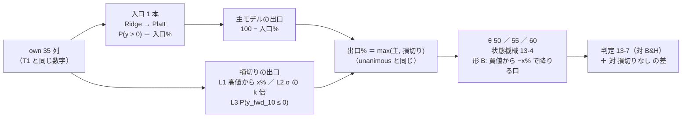
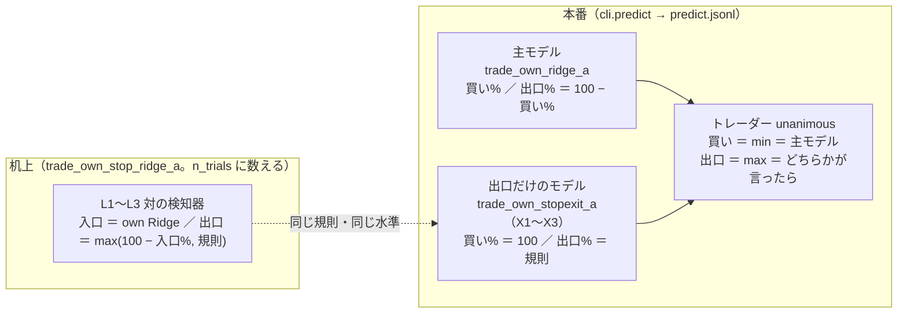

# 損切りを 1 つの予測モデルとして扱えるか（形 A ＝ 位置を知らない出口 ／ 形 B ＝ 買値からの下落）

作成日: 2026-09-27（§0 は**回す前**に書いた。§1 以降は回した後）。派生元: [プラン new-model-trader.md §3 Phase 2-2](../../plans/new-model-trader.md)（親「titan を使って、新規の予測モデルと、複数の予測モデルを持ったトレーダーを作成する方法を確立する」の 2 つ目の実例）。
利用者の指示（2026-09-27）: **「損切りは一つのモデルとして考えてもよいかも検証」**。TODO の子「損切りの手法や対応方法を考える。損切りしたほうが損を多く生む可能性の調査も行う」は、この検証の**事前固定（§0）**として先にやる。
決めごと: K2（合成規則を足さない。出口だけのモデルは買い% 100 ＋ `unanimous`）・K3（形 A を先に、形 B は `simulate` に口を足して机上は並行）・K8（`over_budget` の扱い）＝ [プラン §2](../../plans/new-model-trader.md)。
規約: [rules.md](feature-discovery/rules.md) 13 章（閾値売買）・14-9（事前固定は構造だけ）・14-10（空白は埋める）・15-3（学習の対象と損益の対象を分ける）・16 章（出口% を別に持つ）・18 章（線を別に置く）。手順書: [howto-model-trader.md §1](../howto-model-trader.md)。
関連: [entry-timing.md](entry-timing.md)（出口の価値の上限・16 章の対）／ [forward10-target.md §7](forward10-target.md)（売る線を上げても情報が無ければ負ける）／ [downtrend-detection.md §4](downtrend-detection.md)（負けの主因 ＝ 休んだあいだの上げの取り損ね）／ [live-trading.md §0-2](live-trading.md)（含み損 20% は警告だけ）。

> ⚠ **これは投資助言ではなく調査資料である。** 特定の銘柄・売買を推奨しない。
> ⚠ **資金は動かしていない**（2026-08-27 の方針）。取得済みの日足（研究用の `data/`）だけを使った。
> ⚠ **数字はすべて【実測】**（自前の検証で出したもの）。良い数字は根拠「中」が上限（rules.md 11 章 規約 3）。

## 0. 事前固定（⚠ 回す前に書いた。2026-09-27）

### 0-1. 問いと、いまあるもの

| 問い | 回す前の答え |
| --- | --- |
| 損切りは 1 つの予測モデルとして扱えるか | ⚠ **器としては扱える**（K2）。いまのモデルは 1 本で買い（買い% > θ）と売り（出口% > θ）を決める。出口% は検知器が返さなければ `100 − 買い%` で埋まる（16-1 の 4・`cli.predict`）。「損切りモデル」＝ **買い% を常に 100 で返し、出口% だけを言うモデル**を `[[models]]` の 1 本にし、`unanimous`（買いは min・出口は max ＝ `trader.combine`）で主モデルと合わせる ＝ 買いは主モデル・売りはどちらかが言ったら。**扱えるかは作りで決まり、効くかは別**で、それをここで測る |
| 損切りはいまあるか | ⚠ **無い。** 机上の検証（検証結果一覧 703 検証）は全部「主モデルの出口% > θ」だけで降りる。実売買の 3 人も同じ。含み損 20% は**警告だけ**（`drawdown_warning`。止めるのは人 ＝ live-trading.md §0-2）。出口を別の指標にした検証は 16 章の 36 検証（入口は短期・出口は長期。保留 2 ／ 落とす 34）だけで、**買値や高値からの下落で降りる形は空白** |
| 「損切りしたほうが損を多く生む」はありうるか | ⚠ **ありうる。作りからそう出る向きが 3 つある**（§0-2）。だから「損切りは常に良い」を前提にせず、**損切りなしを対照に置いて差で測る** |
| 位置（買値）を知る損切りは机上で回せるか | ⚠ **いまの器では回せない。** `simulate` は買値を持たない（`opened` の添字は保有日数の記録にだけ使う）。K3 ＝ **出口の口を 1 つ足す**（既定は 1 ビットも変えない ＝ 指紋テスト） |

### 0-2. 考え方 — 損切りの形と、損を多く生みうる理由

⚠ **「損切り」と一口に言っても、位置を知るかどうかで器が違う。** ここでは 4 つの形に分け、回すもの・回さないもの・基準線を先に決める。

| 形 | 何を見て降りるか | 位置（買値）を知るか | 机上の器 | 本番の器 | ここで |
| --- | --- | --- | --- | --- | --- |
| **L1 高値からの下落** | 直近 20 日の最高値からの下落が x% を超えたら降りる（`own_trend20_dd`） | 知らない（買値ではなく高値） | 対の検知器（16 章）。`simulate` は変えない | いまの執行器で読める（`exit` の欄 ＋ `unanimous`） | **回す** |
| **L2 値動きで割った下落** | 同じ下落を、直近 20 日の 1 日の値動きの大きさ（σ ＝ `own_trend20_vol`）で割り、k 倍を超えたら降りる | 知らない | 同上 | 同上 | **回す** |
| **L3 学ぶ出口** | 先 10 営業日が下がる確率 P(y_fwd_10 ≤ 0) を学び、θ を超えたら降りる（16-3 の 2） | 知らない | 同上（[forward10-target.md](forward10-target.md) の H1 と同じ fit の補数） | 同上 | **回す** |
| **形 B 買値からの下落** | 建ててからの累積リターンが −x% を割ったら降りる | ⚠ **知る** | ⚠ `simulate` に口を足す（`stop_loss_pct`。既定 None） | ⚠ 執行器が買値をモデルに渡す口が要る ＝ **10/20 の後**（プラン §7 の道 1。買値そのものは売買履歴の `avg_price` に既にある） | **回す（机上だけ）** |
| 固定日数の出口 | 建ててから d 日たったら降りる | 知る | `simulate` に口を足す（`max_hold_days`。既定 None） | — | **基準線**（数えない） |
| 乱択ゲート | 同じ保有日数で日付だけ壊す（15-6） | — | 既存（自動で付く） | — | **基準線**（数えない） |
| 損切りなし | 主モデルの出口% だけ | — | 対の検知器の退化（出口% ＝ 100 − 入口%） | いまの形 | **対照**（⚠ 新しい登録名なので数える） |
| 利益確定・トレーリング以外の複合規則 | — | — | — | — | ⚠ **回さない**（軸が 2 つ増える。要るなら別の検証） |

⚠ **損切りが損を多く生みうる理由（作りから。回す前に書く）**:

| # | 向き | 根拠（この案件の実測） |
| ---: | --- | --- |
| 1 | **降りた日に情報が無ければ、降りるほど上げを取り損ねる。** 降りる合図に情報が無いとき、損切りは「休む日を増やす」だけで、生存バイアスの銘柄集合（12-1）では休んだぶんだけ B&H に負ける | [downtrend-detection.md §4](downtrend-detection.md)（負けの主因は取り損ね。費用は負けの 7%）／ [forward10-target.md §7-4](forward10-target.md)（売る線を上げて早く降りた 18 組のうち 17 組で悪化） |
| 2 | **下げたあとに戻る標本では、下げで降りるのは底で売ること。** 12 回の下げが 12 回とも回復した銘柄集合（12-1）なので、「下げたら降りる」規則は構造的に不利に出る | rules.md 12-1・16-7 の 2（早く戻る規則は構造的に有利 ＝ その裏返し） |
| 3 | **降りて入り直すたびに片道 2.5bp × 2 を払う。** 損切りが浅いほど回転が増え、費用が積む | rules.md 13-4 の 3・6（保有が短い取引ほど 1 日あたりの費用が重い） |

⚠ **逆に損切りが効きうる理由も 1 つ書いておく**: 出口の価値は銘柄別では入口より大きい（神託の上限 ＋30,992 対 ＋27,119bp ＝ [entry-timing.md §1](entry-timing.md)）。⚠ **ただし片側だけを直しても測れない**（同 §5-1）ので、ここでも「採る」に届く見込みは低い。

### 0-3. 試す形（構造だけ。⚠ 水準は下の表のとおり回す前に固定し、結果を見て動かさない）

> この図の主張: 入口は 4 つの形で**同じ 1 本**（T1 と同じ own 35 列 → Ridge → Platt）。違うのは出口だけで、出口% ＝ max(主モデルの出口, 損切りの出口) ＝ 本番の `unanimous` と同じ「どちらかが言ったら降りる」。

| 決めごと | 中身 | 根拠 |
| --- | --- | --- |
| 動かす軸 | **出口だけ。** 入口（表・列・学習器・較正）・θ・費用・fold・判定は動かさない | 軸を 2 つ同時に動かさない（16-4 の「動かさないもの」と同じ） |
| 入口 | `own` 35 列（⚠ `own_trend*` は入口に入れない）→ 標準化 → Ridge → Platt（訓練の日付の尻 10% を 1 営業日パージした holdout。`scale._fit_calibration(w=1)`）。学習の対象は 1 日の `y` | T1（`own.all.ridge.shared`）と同じ数字・同じ学習器。⚠ 較正の holdout の切り方が T1 の行（行数で切る）と違うので**同じ数字にはならない**（対照は同じ実行の L0 の行で取る） |
| 損切りの出口% | L1: `own_trend20_dd < log(1 − x/100)` なら 100・でなければ 0 ／ L2: `own_trend20_dd < −k × own_trend20_vol` なら 100・でなければ 0 ／ L3: `100 × P(y_fwd_10 ≤ 0)`（own 35 列 → Ridge → Platt を `y_fwd_10` で fit した買い% の補数 ＝ 16-3 の 2。10 営業日パージ） | L1・L2 は 0 か 100 しか取らない（C 系と同じ。θ で結果が変わらないが 3 検証と数える ＝ 13-3 の 5） |
| 合わせ方 | **出口% ＝ max(100 − 入口%, 損切りの出口%)** | K2 の `unanimous`（出口は max）を机上でそのまま写す。⚠ 損切りの出口だけにすると主モデルの出口が消え、本番の形と違うものを測ることになる |
| 形 B | `simulate(stop_loss_pct=x)`: 保有中の足 t で Σ_{u=opened}^{t−1} y_u < log(1 − x/100) なら足 t の終値で降りる（その日の y_t は取らない ＝ 13-4 の 1 と同じ時間の向き）。出口% > θ と**どちらか**が立てば降りる | 位置を知る形。既定 None ＝ 1 ビットも変えない（`tests/test_trading_run.py` の指紋） |
| 水準（⚠ 事前固定） | L1: **x ∈ {5, 10, 20}%** ／ L2: **k ∈ {2, 4, 8}** ／ 形 B: **x ∈ {5, 10, 20}%**（L1 と同じ値 ＝ 高値からと買値からを直接比べる） | 20% は実売買の警告の線（§0-2）。5 → 10 → 20 と倍にして、浅い（よく降りる）〜深い（ほとんど降りない）を 3 点で覆う。k は 1 日 σ ≈ 1.5% なら 3 ／ 6 ／ 12% に当たる【推測】＝ L1 と同じ幅を σ の単位で。⚠ 手で置いた数値は 1 つずつが自由度（14-9）なので、**水準の数だけ n_trials に数え、結果を見て足さない・動かさない**。学ぶ出口 L3 には数値が無い |
| 窓 | **20 日だけ**（`trend_windows = [20]`） | 損切りは「直近の高値」を見るもの。60 ／ 200 日は 16 章の出口（トレンドの崩れ）に近づく。窓を足すと ×窓の数になるので足さない |
| θ・形式・学習器 | θ ∈ {50, 55, 60}・(A) 共通・Ridge のみ | 13-3・13-6。⚠ LightGBM は足さない（×2） |
| 表 | 新しい表 1 本 `trade_own_stop_ridge_a`（`own` ＋ `trend`〔窓 20 の 6 列〕・`label_scales = [10]`・2018-01-31〜・63 銘柄）。⚠ `y_fwd_10` と `own_trend20_*` が要るので既存の表を `features_from` で読めない | 15-3 の 5・forward10-target.md §5 の注意 (a)。表の尻は 10 本短い（基準線の行に「幅」の印が付く ＝ 同 §4 の 2） |
| パージ | `horizon_min = 21,600` 分（10 営業日 × 1.5 × 1,440） | 14-7・16-3 の 4（2 つのラベルの長いほう） |
| 基準線 | 常に上（B&H）・直前リターンの符号・乱択ゲート（自動）・**固定日数の出口 d ∈ {5, 10} 日**（`simulate(max_hold_days=d)`。L0 に当てる。名前は `基準 ` で始める ＝ 数えない） | 13-5・15-6・17-4 の「モデルを使わない並べ方」の精神（降りることそのものの効果と、損で降りることの効果を分ける） |
| 対照 | **L0 損切りなし**（入口だけ。出口% ＝ 100 − 入口%）。⚠ 同じ実行で出す | 「損切りしたほうが損を多く生むか」はこの差でしか答えられない |
| 門 | 測って記録するが、門前でも回す（既定 ＝ 診断） | 14-10 規約 2 |
| 採否の物差し | 13-7 のまま（対 B&H 上乗せ > 0 かつ fold の符号 5/5 で採る） | 13-7。⚠ 対 損切りなし の差は問いの答えであって採否ではない（§0-5） |

### 0-4. 数と名前（⚠ 回すと決めたのは結果を見る前 ＝ 14-10 規約 3）

| 形 | 登録名（検知器 ＝ 記録の識別項目。変えない） | 綴り（`config/names.toml`） | 数 |
| --- | --- | --- | ---: |
| L0 損切りなし（対照） | `L0 入口のみ（損切りなし）` | `l0-nostop` | 1 × θ 3 ＝ **3** |
| L1 高値からの下落 | `L1 高値20日から−5%で降りる` ／ `…−10%…` ／ `…−20%…` | `l1-dd20-5` ／ `-10` ／ `-20` | 3 × θ 3 ＝ **9** |
| L2 σ で割った下落 | `L2 高値20日からσの2倍で降りる` ／ `…4倍…` ／ `…8倍…` | `l2-ddvol20-2` ／ `-4` ／ `-8` | 3 × θ 3 ＝ **9** |
| L3 学ぶ出口 | `L3 先10日の下げを学んで降りる` | `l3-learn10` | 1 × θ 3 ＝ **3** |
| 形 B 買値からの下落 | `L0 入口のみ（損切りなし）〔買値から−5%〕` ／ `〔…−10%〕` ／ `〔…−20%〕`（config の `[trading] stop_loss_pct = [5, 10, 20]` が L0 の行の後ろに足す。18-2 の `〔売り線N〕` と同じ形） | `l0-nostop-stop5` ／ `-stop10` ／ `-stop20` | 3 × θ 3 ＝ **9** |
| 基準線 固定日数 | `基準 L0 入口のみ（損切りなし）〔5日で降りる〕` ／ `〔10日で降りる〕`（`[trading] max_hold_days = [5, 10]`） | `l0-nostop-hold5` ／ `-hold10` | 数えない |
| **合計** | | | **33**（n_trials **703 → 736** の見込み） |

- 1 検証 ＝ 手法（登録名 × 〔変種〕）× θ。識別項目に列は足さない（16-6・17-5・18-2 と同じ）
- leak 対照は queue が足す（1 実行。`LEAK_future_ret` が入口に・`LEAK_fwd_10` が L3 の出口に入るので、全部の行で跳ねるはず）
- 予測モデル名（10-2）: `own-trend.l1-dd20-10.ridge.shared@50` の形（層は `own` ＋ `trend`）
- 実験 config は 1 本 `trade_own_stop_ridge_a`（検知器 8 本 ＋ 変種 5 ＝ 13 行 × θ 3）。queue は `stop.toml`

### 0-5. 物差しと読み方（⚠ 回す前に固定）

| 物差し | 定義 | 使いみち |
| --- | --- | --- |
| 採否 | 13-7（対 B&H 上乗せの fold 平均・符号 5/5・t） | 検証結果一覧の判定 |
| **対 損切りなし の差** | fold ごとの（形 − L0 の同じ θ の行）の純利 bp。符号と t（fold 5 本） | ⚠ **問い「損切りしたほうが損を多く生むか」の答え**。読み方: 5 fold とも負 → 「この設定では損切りが損を多く生んだ」／ 5 fold とも正 → 「損切りが効いた」／ 割れる → 「区別がつかない」。⚠ 採否には使わない（13-7 は対 B&H のまま） |
| 対 乱択ゲート | 手法 − 乱択ゲート（同じ保有日数で日付だけ壊す。`checks.random_gate`） | 「損で降りた日」に情報があったかの診断（14-6 b）。⚠ 向きは 手法 − 乱択（正なら乱択より良い） |
| 最大の含み損 | ポートフォリオ日次純利の累積の**最大ドローダウン**（fold ごと。`daily.csv` から後処理）と、**1 取引あたりの最悪の損**（`holds.csv` の建てた日・保有日数 × 表の `y` から後処理） | 「損切りで損は減ったか」の診断。⚠ 純利が減って含み損も減れば「損は減るが取り損ねが大きい」と読む。採否に使わない |
| 回転 | 取引/fold・保有日率・保有日数の中央値・強制清算の割合（`checks.by_threshold[θ].holding`） | 費用（理由 3）の効き方の診断 |

### 0-6. 先に書く見立て（⚠ 結果を見る前）

| # | 見立て | 理由 |
| ---: | --- | --- |
| 1 | **33 検証とも採るにならない**【推測】 | 入口に情報が無い（T1 の own × Ridge は対 B&H −271bp・AUC ≈ 0.5）。出口を足しても入口の情報は増えない。片側だけでは測れない（entry-timing §5-1） |
| 2 | **対 損切りなし の差は、浅い水準（L1 −5%・L2 2 倍・形 B −5%）で負・深い水準（−20%・8 倍）で 0 に近い** | 浅いほどよく降りて上げを取り損ね（理由 1・2）、費用も積む（理由 3）。深いとほとんど降りないので L0 と同じ行になる |
| 3 | 最大ドローダウンは浅い水準ほど小さい | 作りから決まる。⚠ **これが出ても「効いた」ではない**（純利と並べて読む） |
| 4 | L3（学ぶ出口）は L0 とほとんど同じ行になる | 先 W 日が下がる確率は W が長いほど 0.5 を割る側に寄らない（13-3 の注記 ＝ 先 W 日上がる確率は W が長いほど 1 に寄る）ので、P(y_fwd_10 ≤ 0) > θ の日がほとんど無い。16-7 の 5 と同じ形 |
| 5 | 形 B（買値から）と L1（高値から）は同じ水準で似た動きだが、**L1 のほうが早く降りる**（保有日率は L1 ≤ 形 B） | 高値は買値以上なので、高値からの下落 x% は買値からの下落 x% より先に立つ |
| 6 | 固定日数の出口（5 ／ 10 日）は L0 より悪い | 情報の無い日で降りる ＝ 乱択ゲートの別の形。⚠ これより悪い損切りは「損で降りることに情報が無い」どころか逆向き |
| 7 | leak 対照は全部の行で跳ねる（対 B&H 5/5・t ≫ 2） | 入口に `LEAK_future_ret` が入る。L3 は `LEAK_fwd_10` も |

⚠ **2〜6 が当たっても「損切りは無駄」の証明ではない**（この入口・この銘柄集合・この期間の話）。⚠ **見立てが外れて浅い損切りが L0 に fold 5/5 で勝ったら、まず生存バイアス（16-7 の 2）と多重検定（33 本の中の最良）を疑う。**

### 0-7. 本番の器と、予算の守り方（K2・K3・K8）

| 項目 | 決めごと | 状態 |
| --- | --- | --- |
| 形 A（L1〜L3）を本番で持つ形 | 出口だけの実験 config（入口 ＝ 定数 100・出口 ＝ 規則）を `cli.predict` のためだけに 1 本（queue に入れない ＝ 検証ではない）。トレーダー `T5` は `[[models]]` ＝ 主モデル ＋ 損切りモデル・`combine = "unanimous"`。⚠ 出口だけのモデルは**主モデルとは別の実験名**（`signals.py` は `(model, symbol)` で行を引く） | ✅ **Phase 3 は 2026-09-28 に済んだ**（§7 ＝ 検知器 `X1`〜`X3`・config `trade_own_stopexit_a`）。`T5` は Phase 4。✅ 執行器のコードは 0 |
| 形 B を本番で持つ形 | 執行器がその人の買値（`Holding.avg_price`）をモデルに渡す口 ＝ 「状態を読むモデルの kind」（プラン §7 の道 1） | ⚠ **10/20 の後**（実売買の判定が済むまで執行器を変えない） |
| `drawdown_warning`（含み損 20% は警告だけ） | ⚠ **そのまま**。損切りモデルが入っても、人が止める線は別に残す | 変えない |
| **K8 `over_budget`** | ⚠ **推すのは「残す」**。理由: (1) 損切りは出口の話で、買いの予算の守り方（`target = min(per_symbol, available)` の丸め）に触れない ＝ 作り替える理由が損切りの側から出ない (2) 到達できないことを `tests/test_sim_limits.py` が固定しており、丸めが壊れたときの**番人**として働く (3) 消すと `paper.py` の「執行できなかった買い」の数え方（`over_budget` を含む）も直すことになる。⚠ 作り替え（損切りに合わせた歯止め）は執行器の変更 ＝ 10/20 の後で、この検証の結果を見てから要るかを決めればよい | ✅ **2026-09-27 利用者決定: 残す**（何も変えない。テストが「出ないこと」を固定したまま ＝ 丸めが壊れたときの番人） |

### 0-8. 回すもの（コード・config・コマンド）

| 手順（howto §1） | 中身 |
| --- | --- |
| 1-2 検知器 | `ail/detectors/stop.py`（新規。入口 `_entry`・出口 L1 ／ L2 ／ L3・合わせ方 max・登録 8 本）＋ `ail/bootstrap.py` に import 1 行。⚠ 既存の `pair.py`・`fwd.py`・`scale.py` は変えない（`_fit_calibration` を共用） |
| 1-2 器 | `ail/validation/simulate.py` に `stop_loss_pct=None`・`max_hold_days=None`（既定は 1 ビットも変えない）／ `cli/run.py` に `[trading] stop_loss_pct`・`max_hold_days`（無い config は経路が同一。18 章の `threshold_pairs` と同じ形で、検知器の行の後ろに足すだけ。基準線・上位 K には当てない） |
| 1-3 綴り | `config/names.toml` `[method]` に 8 本・`ail/names.py` に `〔買値から−N%〕` → `-stopN`・`〔N日で降りる〕` → `-holdN` |
| 1-4 config | `config/experiment/trade_own_stop_ridge_a.toml`（表の持ち主。`feature_layers = ["own", "trend"]`・`[features] trend_windows = [20]`・`label_scales = [10]`・`horizon_min = 21600`・`detectors` 8 本・`[trading] stop_loss_pct = [5, 10, 20]`・`max_hold_days = [5, 10]`） |
| 表 | `cli.build --experiment trade_own_stop_ridge_a`（＋ `--leak`） |
| 1-5 queue | `config/queue/stop.toml` → `cli.queue --config stop`（1 本 ＋ leak 1。見積り: 表 2 本 1 分・実行 2 本 1〜2 分【推測。fwd10 の実測 31 秒 ／ 8〜10 秒 × 行が 13 本】） |
| 1-6 | `cli.report --catalog` → `ledger.md`。n_trials 703 → 736 |
| 1-7 | `cli.predict --experiment trade_own_stop_ridge_a --method "L1 高値20日から−10%で降りる" --asof <日>` が `exit` の欄に規則の出口を載せること（道の確認。判定が落とすでも通す） |
| テスト | `tests/test_stop.py`（契約 ＝ 2 本返す・L0 は 100 − 入口% と一致・規則の向き・max の合わせ方・形 B の口と固定日数の口・既定は同一・leak で跳ねる）＋ 既定経路の指紋 `tests/test_trading_run.py`・`tests/test_exit_line.py`・`tests/test_names.py` |

⚠ **1-8（`models.toml` の `[[model]]`）はここではやらない**（プラン §3 Phase 4-3 ＝ `T5` を作るときに、この記録から写す）。

コード: `ail/detectors/stop.py`（検知器 8 本 `L0 入口のみ（損切りなし）`・`L1 高値20日から−{5,10,20}%で降りる`・`L2 高値20日からσの{2,4,8}倍で降りる`・`L3 先10日の下げを学んで降りる`）／ `ail/validation/simulate.py` の `stop_loss_pct`・`max_hold_days`（既定 None ＝ 1 ビットも変えない）／ `cli/run.py` の `[trading.position_exits]`（`position_exits`・`stop_loss_name`・`hold_days_name`）／ 綴り `config/names.toml` と `ail/names.py`（`〔買値から−N%〕` → `-stopN`・`〔N日で降りる〕` → `-holdN`）／ 診断 `cli/stopdiag.py`（読むだけ）／ テスト `tests/test_stop.py` 15 本。規約は [rules.md 19 章](feature-discovery/rules.md)（同日に足した）。
実行: `2026-09-27T15-53-55_trade_own_stop_ridge_a`（本番）／ `2026-09-27T15-54-18_trade_own_stop_ridge_a_leak`（leak 対照）。再現: `cli.queue --config stop` → `cli.report --catalog` → `cli.stopdiag --run 2026-09-27T15-53-55_trade_own_stop_ridge_a`。

## 1. 一言で（2026-09-27 に回した。⚠ ここから下は結果を見て書いた）

⚠ **器としては扱えた。損切りは損を減らさなかった。** 33 検証は **全部落とす**（採る 0 ／ 保留 0）。n_trials **703 → 736**。
⚠ **「損切りしたほうが損を多く生むか」の答え（§0-5 の物差し）: この入口・この銘柄集合では、損切りを足した 27 行のうち θ=50 ／ 55 の 18 行が全部、損切りなし（L0）より純利の平均が低い。** fold 5/5 で負なのは 4 行（θ=50 の L2 σ×4・θ=55 の 買値−5%・L2 σ×2・L2 σ×4）で、残りは割れる（＝ 区別がつかない側）。θ=60 は 1 年に十数回しか建てないので差がほぼ 0。

| 問い | 答え |
| --- | --- |
| 損切りを 1 つの予測モデルとして扱えるか | ✅ **扱える。** 出口だけを言う検知器 8 本が同じ物差しに載り、`cli.predict` が `exit` の欄に規則の出口を載せた（63 行・4 銘柄で 100 ＝ §5）。合わせ方 max（＝ 本番の `unanimous`）で主モデルの出口と両立する |
| 損切りで損は減ったか | ⚠ **減ったのは「最悪の 1 取引」と「高値からの規則の最大ドローダウン」だけ。** 純利は全部の形で減った（§2-2）。⚠ **買値からの損切り（形 B）は θ=50 で最大ドローダウンを悪化させた**（−3,815 → −4,216bp。降りて入り直してまた降りる） |
| どの形が一番ましか | 深い水準（L1 −20%・L2 σ×8・買値 −20%）＝ ほとんど降りないので L0 とほぼ同じ行。⚠ **「ましな損切り」は「効かない損切り」である** |
| 浅い損切りはなぜ負けるか | 取り損ねと費用が半々【実測】: L1 −5%（θ=50）の対 L0 −351bp ＝ 粗利 −176 ＋ 費用 ＋176（取引 1,099 → 3,310 回/fold）。L2 σ×2 は −534 ＝ 粗利 −238 ＋ 費用 ＋297。⚠ **これまでの記録（費用は負けの 7%）と違い、浅い損切りでは費用が負けの半分を占める** |
| 先に書いた見立て（§0-6）は | 7 つのうち 5 当たり・2 半分（§3） |
| 門（14-5）は | 8 本とも門前（入口は 1 本なので同じ値。AUC 0.483・幅 2.5 点）。回すと事前に決めて回し、33 検証として数えた |

⚠ **これは「損切りは無駄」の証明ではなく「情報の無い入口に損切りを足しても純利は増えなかった」である。** 限界は §4。

## 2. 結果【実測】

列: 純利 ＝ fold 1 本あたり bp（5 fold 平均・63 銘柄等加重）。上乗せ ＝ 対 B&H（fold 平均・符号・fold 5 本の t）。対 L0 ＝ 手法 − 損切りなし（同じ θ）。対 乱択 ＝ 手法 − 乱択ゲート（正なら乱択より良い）。中央値 ＝ 1 取引の保有日数の中央値・強制 ＝ 末尾まで持ったままの割合。最大 DD ＝ ポートフォリオ日次純利の累積の最大ドローダウン（fold 平均）。最悪 ＝ 1 取引の最悪の損益 bp（往復 5bp 込み）。B&H ＝ ＋1,666bp。判定は 33 行とも落とす（基準線は採否の対象外）。

### 2-1. θ=50（L0: 取引 1,099 回/fold・保有日率 0.73・保有の中央値 2 日）

| 形 | 純利 | 上乗せ | 符号 | t | 対 L0 | 符号 | 取引 | 保有日率 | 対 乱択 | 最大 DD | 最悪 |
| --- | ---: | ---: | --- | ---: | ---: | --- | ---: | ---: | ---: | ---: | ---: |
| **L0 損切りなし** | ＋1,296 | −370 | −＋−−＋ | −1.79 | — | — | 1,099 | 0.73 | −25 | −1,558 | −7,216 |
| L1 高値 −5% | ＋945 | −722 | −＋−−− | −3.03 | **−351** | −＋＋−− | 3,310 | 0.62 | ＋41 | −1,038 | −3,069 |
| L1 高値 −10% | ＋1,206 | −460 | −−−−− | −2.74 | −90 | ＋−−＋− | 1,841 | 0.69 | ＋10 | −1,226 | −4,331 |
| L1 高値 −20% | ＋1,229 | −437 | −＋−−− | −2.27 | −67 | −＋−＋− | 1,202 | 0.72 | −57 | −1,500 | −5,473 |
| L2 σ×2 | ＋762 | −905 | −−−−− | −5.84 | **−534** | −−＋−− | 4,833 | 0.55 | −103 | −966 | −3,069 |
| L2 σ×4 | ＋989 | −678 | −−−−− | −5.12 | **−307** | **−−−−−** | 2,863 | 0.64 | −84 | −1,231 | −4,331 |
| L2 σ×8 | ＋1,176 | −490 | −−−−− | −2.58 | −120 | −−0−− | 1,298 | 0.72 | −135 | −1,586 | −5,832 |
| L3 学ぶ出口 | ＋1,191 | −476 | −＋−−＋ | −2.00 | −105 | −＋−＋− | 1,395 | 0.71 | −110 | −1,440 | −6,616 |
| 形 B 買値 −5% | ＋1,163 | −504 | −−−−＋ | −2.16 | −133 | −−0−＋ | 1,254 | 0.72 | −172 | **−1,586** | −3,813 |
| 形 B 買値 −10% | ＋1,178 | −489 | −＋−−＋ | −2.03 | −118 | −−0−＋ | 1,167 | 0.72 | −156 | **−1,638** | −4,132 |
| 形 B 買値 −20% | ＋1,265 | −402 | −＋−−− | −1.99 | −31 | −−00− | 1,115 | 0.73 | −60 | −1,574 | −5,473 |
| 基準 5 日で降りる | ＋1,298 | −368 | ＋−−−− | −1.11 | ＋2 | ＋−0−− | 3,407 | 0.62 | ＋454 | −1,211 | −4,690 |
| 基準 10 日で降りる | ＋1,284 | −383 | −−−−＋ | −1.42 | −12 | −−0−＋ | 2,294 | 0.67 | ＋158 | −1,332 | −5,163 |

⚠ fold 3 の「0」は、その fold で損切りが 1 度も立たなかった（L0 と同じ行 ＝ 最大 DD −81bp の静かな期間）。

### 2-2. θ=55（L0: 取引 76 回/fold・保有日率 0.62・中央値 183 日・強制 0.58）

| 形 | 純利 | 上乗せ | 符号 | t | 対 L0 | 符号 | 取引 | 保有日率 | 中央値 | 最大 DD | 最悪 |
| --- | ---: | ---: | --- | ---: | ---: | --- | ---: | ---: | ---: | ---: | ---: |
| **L0 損切りなし** | ＋1,360 | −306 | ＋−−−＋ | −1.36 | — | — | 76 | 0.62 | 183 | −1,446 | −8,899 |
| L1 高値 −5% | ＋573 | −1,094 | −−−−− | −7.51 | −787 | −＋−−− | 526 | 0.21 | 1 | −367 | −2,045 |
| L1 高値 −10% | ＋1,075 | −591 | −−−−− | −5.20 | −285 | −＋−−− | 347 | 0.43 | 1 | −691 | −2,071 |
| L1 高値 −20% | ＋1,300 | −367 | −−−−＋ | −1.98 | −61 | −＋0−− | 140 | 0.60 | 36.5 | −1,174 | −5,658 |
| L2 σ×2 | ＋483 | −1,183 | −−−−− | −6.08 | **−877** | **−−−−−** | 558 | 0.13 | 1 | −308 | −2,045 |
| L2 σ×4 | ＋724 | −943 | −−−−− | −5.96 | **−636** | **−−−−−** | 389 | 0.25 | 2 | −534 | −2,318 |
| L2 σ×8 | ＋1,324 | −342 | ＋−−−− | −1.19 | −36 | ＋−−−− | 147 | 0.52 | 42 | −981 | −5,666 |
| L3 学ぶ出口 | ＋1,120 | −547 | −−−−＋ | −2.15 | −240 | −0−＋0 | 108 | 0.59 | 83 | −1,172 | — |
| 形 B 買値 −5% | ＋1,249 | −417 | −−−−＋ | −2.22 | **−111** | **−−−−−** | 147 | 0.55 | 28 | −1,067 | −4,201 |
| 形 B 買値 −10% | ＋1,311 | −355 | ＋−−−＋ | −1.49 | −49 | ＋−−−− | 114 | 0.59 | 70 | −1,165 | −4,562 |
| 形 B 買値 −20% | ＋1,280 | −386 | −−−−＋ | −2.11 | −80 | −＋0−− | 92 | 0.61 | 134.5 | −1,295 | −5,307 |
| 基準 5 日で降りる | ＋325 | −1,342 | −−−−− | −4.84 | −1,035 | −−−−− | 503 | 0.11 | 5 | −419 | −5,634 |
| 基準 10 日で降りる | ＋478 | −1,188 | −−−−− | −8.42 | −882 | −−−−− | 400 | 0.17 | 10 | −508 | −5,197 |

⚠ θ=55 の L0 は「建てたら半年持つ」形（中央値 183 日・強制清算 58%）なので、降りる規則は全部「持ち続ける利益」を削る側に働いた。固定日数の基準線が最も悪い（−1,035 ／ −882）＝ 情報の無い日に降りる代償の大きさ。⚠ 損切り（L1 −5%・L2 σ×2）はそれより少しましだが、fold 5/5 で L0 に負けている。

### 2-3. θ=60（L0: 取引 12 回/fold・保有日率 0.08）

13 行とも純利 ＋9〜＋161bp・上乗せ −1,505〜−1,657bp（fold 5/5 負）。対 L0 は −113〜＋39 で、形 B −5% ／ −10% だけ ＋28 ／ ＋39（fold 3/5 正・t 1.2 ／ 1.8。⚠ 1 年に十数回の取引の話で、多重検定を通していない小さな正）。θ=60 では入口がほとんど立たないので損切りの出番が無い。

### 2-4. 配線・門・較正

| 項目 | 実測 |
| --- | --- |
| leak 対照（1 実行・33 行 ＋ 基準線） | ✅ **全行跳ねた**: 上乗せ ＋18,618〜＋22,084bp/fold・fold 5/5・t 17.4・DSR 1.000。fold の最小でも ＋15,205bp。`LEAK_future_ret` が入口に入る形（`tests/test_stop.py` で「入口に入っている」ことを縛った） |
| 門（訓練内 holdout・fold 中央値） | 入口 1 本なので 8 本とも同じ: AUC 0.483（fold 0.465〜0.516）・買い% の幅 2.5 点（0.3〜9.4）。⚠ **門前**（AUC < 0.52・幅 < 20 点）。診断で採否に使わない |
| 較正（Platt。fold 1〜5） | 入口 a ＝ −14.4 ／ ＋14.6 ／ −7.6 ／ −48.9 ／ ＋18.0（⚠ 符号が fold で入れ替わる ＝ T1 の `own-ridge` と同じ癖）・b ＝ ＋0.16 → ＋0.12。L3 の出口の fit（`y_fwd_10`）は a ＝ −28.6 ／ −5.6 ／ −14.4 ／ ＋13.5 ／ ＋6.0（forward10-target.md §2-4 の own × Ridge と同じ値 ＝ 同じ列・同じ fit）。訓練の `y > 0` は 0.52〜0.53・`y_fwd_10 > 0` は 0.56〜0.59 |
| L0 と T1 の行の違い | L0 θ=50 の対 B&H −370 に対し、T1 の行（`own.all.ridge.shared@50`）は −271。同じ列・同じ学習器だが、較正の holdout の切り方（日付で切って 1 日パージ ／ 行数で切る）と表の尻（10 本短い ＝ fold の切れ目が数日ずれる）が違う。⚠ **同じ数字にはならないと §0-3 に書いたとおり** |

## 3. 見立ての答え合わせ（§0-6 の 7 つ）

| # | 見立て | 結果 |
| ---: | --- | --- |
| 1 | 33 検証とも採るにならない | ✅ 当たり（全部落とす） |
| 2 | 対 L0 の差は浅い水準で負・深い水準で 0 に近い | ✅ 当たり。θ=50: L1 −351 → −90 → −67・L2 −534 → −307 → −120・形 B −133 → −118 → −31（θ=55 も同じ向き）。⚠ 深い水準でも符号は負が多い（0 に近いが正には寄らない） |
| 3 | 最大ドローダウンは浅い水準ほど小さい | △ **半分当たり**。高値からの規則（L1・L2）と固定日数はそのとおり（θ=50 で −1,558 → −966〜−1,226）。⚠ **買値からの損切り（形 B）は θ=50 で悪化した**（−1,586 ／ −1,638 対 L0 −1,558）＝ 降りて入り直してまた降りる（fold 1 ＝ 2020 年の下げで −3,815 → −4,216）。位置を知る損切りは「同じ銘柄に何度も入り直す」入口と組むと、損を確定する回数が増える |
| 4 | L3（学ぶ出口）は L0 とほとんど同じ行になる | △ **半分外れ**。θ=50 で取引 1,099 → 1,395・対 L0 −105（割れる）＝ 出口は立った。`y_fwd_10 ≤ 0` の確率は 0.41〜0.44 が中心だが、較正の傾き a が大きい fold では 50 を越える日がある（fold 1 ＝ −553bp）。⚠ **「先 W 日が下がる確率が θ を越えない」は平均の話で、fold ごとには越える** |
| 5 | L1（高値から）は形 B（買値から）より早く降りる ＝ 保有日率 L1 ≤ 形 B | ✅ 当たり（同じ水準の 3 対 × θ 3 の 9 対とも。例 θ=50 −5%: 0.62 対 0.72） |
| 6 | 固定日数の出口は L0 より悪い | ✅ 当たり（θ=55 ／ 60 で 4 行とも負。θ=50 では ＋2 ／ −12 ＝ 同じ ＝ L0 の保有の中央値が 2 日なので 5 ／ 10 日の上限がほとんど効かない） |
| 7 | leak は全行で跳ねる | ✅ 当たり（§2-4） |

⚠ **問い「損切りしたほうが損を多く生む可能性」への答え**: **この設定ではある。** 純利で見れば、損切りを足した 27 行のうち θ=50 ／ 55 の 18 行が全部 L0 より低く、うち 4 行は fold 5/5 で低い。「損」の意味を最悪の 1 取引にすれば減る（−7,216 → −3,069bp）が、代わりに負ける取引の割合が 0.45 → 0.53 に増え、1 取引の中央値が負に転じる（L1 −5%: ＋24 → −12bp）。⚠ **降りる合図に情報が無いとき、損切りは「大きな損を小さな損の束に替える」だけで、束の合計は元より大きい**（forward10-target.md §7 の「早く降りても情報が無い」と同じ形）。

## 4. ⚠ 限界と注意（読む前に）

| # | 限界 | 効き方 |
| ---: | --- | --- |
| 1 | 入口が 1 本（own 35 列 × Ridge ＝ 門前・AUC 0.48）。⚠ **入口に情報が無いので、出口の情報も測りにくい**（entry-timing §5-1「片側だけでは測れない」） | 損切りが「効く入口」で効くかは分からない。ただし K1 の実例 B（`T5`）は T1 の入口に損切りを足す形なので、その机上の物差しとしては十分 |
| 2 | 銘柄集合は 2026 年の時価総額上位（生存バイアス 12-1）。⚠ **12 回の下げが 12 回とも回復した標本** | 「下げたら降りる」は構造的に不利（§0-2 理由 2）。⚠ **戻らない銘柄が混ざる集合では向きが変わりうる**（測っていない） |
| 3 | 水準は 3 点ずつ（5 ／ 10 ／ 20%・σ×2 ／ 4 ／ 8・20 日）。⚠ **あいだ・外側・別の窓は試していない** | 結果を見て足さない（14-9）。深い水準ほど L0 に近づく単調な形なので、あいだを試しても順序は変わらないと読む【推測】 |
| 4 | 表の尻が 10 本短い（`y_fwd_10` のぶん）＝ fold の切れ目が T1 の行と数日ずれる（forward10-target.md §4 の 1 と同じ） | L0 と T1 の行の数字は目安（§2-4）。⚠ 検証結果一覧の基準線の行の印は今回は増えていない（同じ形の表が既にあった） |
| 5 | 形 B の `simulate` は「建ててからの累積対数リターン」で位置を見る。本番の買値（`avg_price`）は約定価格なので、気配との差（執行の差）は入っていない | 机上の形 B は本番より少し楽観側【推測】。本番の口は 10/20 の後（§0-7） |
| 6 | 対 L0 の差の t は fold 5 本（自由度 4）。5/5 の符号も 1/16 で偶然に出る | 「損切りが損を生んだ」の 4 行は「傾向」の根拠で、証明ではない（11 章 規約 5） |
| 7 | 最大ドローダウンと 1 取引の損益は後処理の診断（`cli.stopdiag`。`checks.json` には無い） | 採否に使わない。再現は §0 冒頭の 3 コマンド |

## 5. 道の確認と、かかった時間【実測 2026-09-27・titan】（手順書 [howto-model-trader.md §1](../howto-model-trader.md) の 1-1〜1-7）

| 手順 | やったこと | 時間 ／ 結果 |
| --- | --- | --- |
| 1-1 事前固定 | §0 を書いた（回す前。形 4 つ・水準・基準線・物差し・見立て 7 つ） | — |
| 1-2 検知器 ＋ 器 | `ail/detectors/stop.py`（8 本。入口は `fwd.py` と同じ形で `y` を学ぶ・L3 は `fwd.forward_gate(10)` の補数・合わせ方 max）／ `simulate(stop_loss_pct=, max_hold_days=)`／ `cli/run.py` の `[trading.position_exits]`（`threshold_pairs` と同じ「後ろに足すだけ」の形） | テスト `tests/test_stop.py` 15 本 ＋ 既定経路の指紋 `test_trading_run`・`test_exit_line`・`test_names`・`test_fwd`・`test_pairs`・`test_trading` ＝ **120 本 14 秒・全部通過** |
| 1-3 綴り | `names.toml` に 8 本・`names.py` に `-stopN`・`-holdN` | `test_names` 通過 |
| 1-4 config | 1 本（表の持ち主）。`feature_layers = ["own", "trend"]`・`[features] trend_windows = [20]`・`label_scales = [10]`・`horizon_min = 21600`・`[trading.position_exits]` | `config.resolve_experiment` OK |
| 表 | `cli.build` × 2（本番 ＋ leak。41 列 ＝ own 35 ＋ trend 6・135,395 行 ＝ fwd10 の表と同じ形） | **64 秒**（31 ＋ 33 秒。15:52:43〜15:53:47） |
| 1-5 queue | `config/queue/stop.toml` → `cli.queue --config stop`（2 本・失敗 0） | **56 秒**（本番 23.4 秒 ＋ leak 32.4 秒。15:53:54〜15:54:50）。⚠ 見積り 5 分の 1/5 |
| 1-6 検証結果一覧 | `cli.report --catalog` → `ledger.md`・`ledger_rows` | n_trials 703 → 736（落とす 585 → 618・基準線 488 → 500）。⚠ 既存の行は 1 つも動いていない（`git diff` は頭の数と足した行だけ） |
| 1-7 `cli.predict` | `--experiment trade_own_stop_ridge_a --method "L1 高値20日から−10%で降りる" --asof 2026-09-04` | **63 行・32 秒**（表 31 秒 ＋ fit 0.16 秒）。買い% 48.9〜52.3・**4 銘柄（AVGO・CSCO・HON・LLY）で `exit` ＝ 100**（規則が立った）・残りは 100 − 買い%。⚠ 訓練は 2026-08-21 まで（forward10-target.md §4 の 7 と同じ穴 ＝ Phase 3 で直す） |
| 診断 | `cli.stopdiag --run …`（読むだけ・§0-5 の 4 表） | 約 40 秒 |

⚠ **手順書（Phase 6）に足す注意 2 つ**: (a) 出口だけの検知器は入口を 1 本に揃え、合わせ方（max）を検知器の中で書く ＝ 本番の `unanimous` と同じ形にしないと机上と本番で違うものを測る ／ (b) 位置を知る出口（買値・日数）は検知器では書けないので `simulate` の口（`[trading.position_exits]`）に置き、`methods` で当てる行を限る（全部の検知器に当てると数が掛け算になる）。

## 6. 次に効くこと（このタスクの外）

- ✅ **Phase 3**（プラン §3。2026-09-28 ＝ §7）: 出口だけの実験 config を `cli.predict` のためだけに 1 本置いた。`T5`（主モデル ＋ 損切りモデルを `unanimous`）の配線は Phase 4。⚠ **この検証の結果からは、本番に損切りモデルを入れる理由は出ていない**（配線の確認に使うだけ ＝ K1 の位置づけ）
- 形 B を本番で持つ口（買値をモデルに渡す `kind`）は 10/20 の後。⚠ **机上の結果（形 B は最大ドローダウンを悪化させた）を先に読んでから決める**
- K8（`over_budget`）は ✅ 2026-09-27 に利用者が「残す」と決めた（§0-7）。この検証は予算の守り方に触れなかった
- 「損切りが効く入口」があるかは別の問い。入口に情報のあるモデルが出てきたら、同じ 8 本の検知器（入口を差し替えるだけ）で回せる

## 7. 執行器が読める形（Phase 3。2026-09-28・titan）

> この図の主張: 机上では「入口 ＝ 主モデル・出口 ＝ 規則」を 1 本の対の検知器の中で max に合わせるが、本番では主モデルと出口だけのモデルを 2 本の `[[models]]` に分け、執行器の `unanimous` が同じ max をやる。

| 項目 | 中身 |
| --- | --- |
| 検知器 | `ail/detectors/stop.py` の `X1 出口だけ 高値20日から−{5,10,20}%で降りる`・`X2 出口だけ 高値20日からσの{2,4,8}倍で降りる`・`X3 出口だけ 先10日の下げを学んで降りる`（7 本。`(入口 100, 出口, doc)` の 3 つ返し）。水準は L1〜L3 と同じ（足さない・動かさない） |
| 綴り | `config/names.toml` に `x1-exit-dd20-N`・`x2-exit-ddvol20-N`・`x3-exit-learn10` |
| config | `config/experiment/trade_own_stopexit_a.toml`（`features_from = "trade_own_stop_ridge_a"`。⚠ **`cli.predict` のためだけ ＝ queue に入れない ＝ `n_trials` に数えない ＝ 検証結果一覧に出ない**。規約は [rules.md 19-1 の 8](feature-discovery/rules.md)） |
| `cli.predict`【実測 asof 2026-09-04】 | `X1 −10%`: 63 行・`buy` 全行 100・`exit` 100 が **4 銘柄（AVGO・CSCO・HON・LLY ＝ §5 の対の検知器 L1 と同じ）**・残り 0。表 34 秒 ＋ fit 0.01 秒。`X3`: 63 行・`buy` 100・`exit` 44.9〜52.2（＝ H1 の補数）。表 36 秒 ＋ fit 0.19 秒。訓練は **2026-08-20 まで**（`split_asof` の直し ＝ [forward10-target.md §4 の 7](forward10-target.md)） |
| テスト | `tests/test_stop.py` に 2 本（入口 100・出口 ＝ 規則そのもの・L1 と「規則が立つ行」が一致・綴り・机上の 8 本とは別名） |
| ⚠ | 同じ実験名で `--method` を替えて同じ日に 2 度流すと `predict.jsonl` は後の 1 本だけ残る（(日付, 実験名) で置き換える仕様）＝ 1 人の中で使う水準は 1 本。`T5` は Phase 4（[howto §2](../howto-model-trader.md)） |

