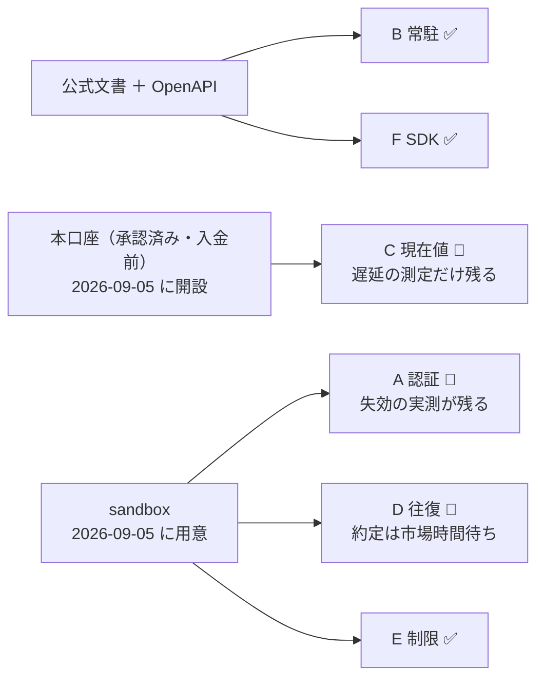
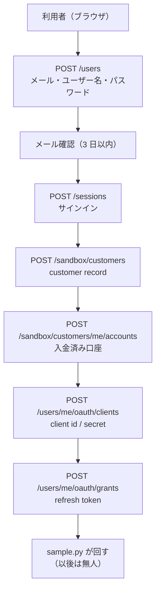
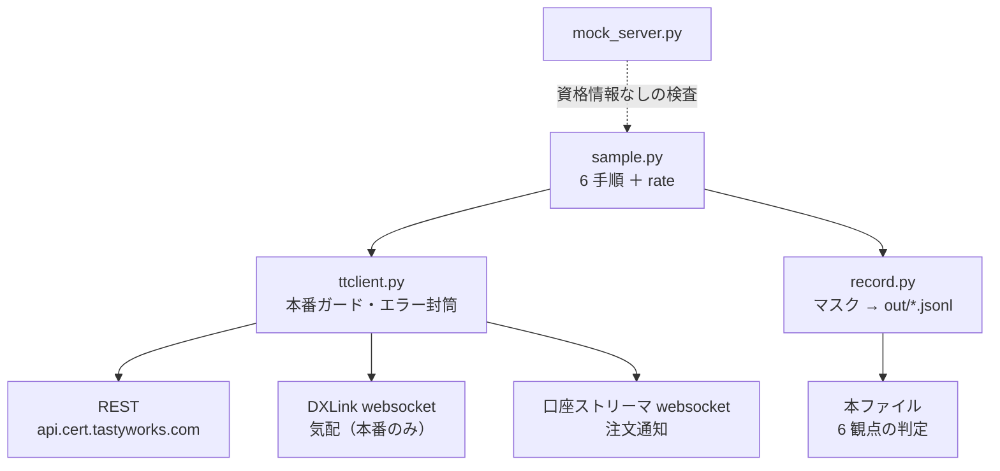

# tastytrade API 取引サンプル — 実測と判定

実施日: 2026-09-05〜（進行中） / プラン: [docs/plans/tastytrade-api-sample.md](../../plans/tastytrade-api-sample.md)
コード: [experiments/tastytrade-api-sample/](../../../experiments/tastytrade-api-sample/)
方針: **選択肢 (c)**（sandbox ＋ 本口座 ＋ 入金 ＋ 本番で 1 株）を 2026-09-05 に利用者が選択。
CLAUDE.md にこの 1 手法だけの例外として追記した。**口座開設・入金・本番発注を実行するのは利用者**で、
Claude は手順とコードを示すところまで。

読み方: [../overview.md](../overview.md) ／ 前 3 タスク: [service-trust-assessment.md](../service-trust-assessment.md)・[trading-fee-comparison.md](../trading-fee-comparison.md)・[trading-api-availability.md](../trading-api-availability.md)

## 現在の状態

| Phase | 内容 | 状態 |
| --- | --- | --- |
| 0 | 方針の決定と入口の確認 | ✅ 完了（2026-09-05） |
| 1 | 環境と記録形式 | ✅ 完了（2026-09-05）。モックに対して 6 手順が通ることを確認 |
| 2〜4 | 認証・REST・ストリーミングの【実測】 | ✅ **2026-09-08 の市場時間に完了**（§0-4）。気配の遅延・ストリーミング・レート制限・失効 900 秒・refresh の 3 日後再利用・**発注の往復**（⚠ 1 度目は `Session offline` で拒否、25 分後に成功） |
| 5 | 記録と判定 | ⏸ Phase 2〜4 のあと |
| 6 | 本番で 1 株 | ⏸ 方針 (c)。利用者が入金と発注を行う |

## 0. 実測 1 — 入金前の本番口座で気配は取れる（2026-09-05 14:09 ET）

⚠ **未確定 #3（入金なしで `api-quote-tokens` が下りるか）は「下りる」で決着した。**
利用者が同日に本口座を開設し、SoFi から $1,000 の送金を出したが**まだ着金していない**状態で、
読み取りだけのプローブ（`sample.py --step probe`。発注はしない）を 1 回通した記録。

| 測ったもの | 結果 |
| --- | --- |
| 口座の資金状態 | `cash-balance` **0.0** / `net-liquidating-value` **0.0** / `cash-available-to-withdraw` **0.0**、`pending-cash` **1000.0**（Credit）。**入金前で間違いない** |
| REST `/market-data/by-type` SPY | ✅ 取れた。bid 769.42 / ask 769.55 / last 770.19（`updated-at` 2026-09-05T10:37:42Z。土曜で市場が閉まっているため約 7.5 時間前の値） |
| `GET /api-quote-tokens` | ✅ 取れた。`level: "api"` |
| DXLink 接続（15 秒） | ✅ **AUTHORIZED → CHANNEL_OPENED → FEED_CONFIG まで到達し、Trade と Quote を受信**（SPY last 770.25）。⚠ 受信 2 件で止まったのは土曜で配信が無いためで、権限の問題ではない |
| 所要 | 認証から DXLink 切断まで 17.9 秒 |

**したがって観点 C の前提が変わった。**「気配には入金済み口座が要る」という前 3 タスクの読みは誤りで、
**承認済みの口座であれば残高 0 でも気配は取れる**。方針 (a)（sandbox のみ）でも、本口座の開設さえ済めば
観点 C は埋められたことになる。

### 同時に分かったこと

| 発見 | 中身 |
| --- | --- |
| **口座承認が即日だった** | `opened-at` 2026-09-05T17:21:55Z。申込から約 1 時間で口座が開いている。事前の見込み（米国内 1〜3 営業日【二次】）より大幅に速い |
| **着金前に買付余力が立っている** | `equity-buying-power` / `derivative-buying-power` とも **1000.0**。⚠ ただし `available-trading-funds` は **0.0** で食い違う。どちらが効くかは dry-run でしか分からない（下記 §5） |
| **DXLink の URL が文書と違う** | 実際は `wss://tasty-openapi-dxlink-md-ws.dxfeed.com/realtime`。公式ガイドの例は `wss://tasty-openapi-ws.dxfeed.com/realtime`。**応答の `dxlink-url` を使うべきで、URL を決め打ちしてはいけない** |
| 新規口座の取引権限 | `options-level: "Covered And Cash Secured"`、`equities-margin-calculation-type: "Cash Secured Margin"`、`is-full-equity-margin-required: true`、`is-futures-enabled: false`。**株の現物買いには支障なし** |

## 0-2. 実測 2 — 着金前でも買付余力は使える（2026-09-05 14:26 ET、dry-run のみ）

`equity-buying-power` 1000.0 と `available-trading-funds` 0.0 の食い違いを、**本番の dry-run だけ**で切り分けた。
⚠ dry-run は検証だけで注文をルーティングしない。実弾は 1 株も出していない。

| 試した注文（指値 $615.54 ＝ 気配の 8 割。約定しない水準） | 結果 |
| --- | --- |
| **SPY 1 株** | ✅ **通る**。`current-buying-power` 1000.0 → `new-buying-power` 384.459。手数料は `total-fees` **0.001**（実質 $0） |
| **SPY 10 株**（$6,155） | ❌ **422 `preflight_check_failure` / `margin_check_failed`**「sufficient buying power がない。入金するか注文を小さくしろ」 |

**結論: 効いているのは `equity-buying-power`（＝ `pending-cash` を含む即時与信）で、`available-trading-funds` 0.0 ではない。**
着金を待たずに 1 株の発注が通る状態にある。⚠ ただし引き出し（`cash-available-to-withdraw` 0.0）は別で、
入金の決済が済むまで出金はできない。

ついでに取れた 2 つ:

- 土曜に出した Day 注文には `tif.next_valid_session`「Your order will begin working during next valid session」の**警告が付く**。
  時間外の注文は弾かれるのではなく**次のセッションまで待つ**
- SPY 1 株の買いの手数料見積もりは **$0.001**。fee 文書の「株 $0」と整合する（規制費の端数のみ）

## 0-3. 実測 3 — sandbox で 6 手順（2026-09-05 14:57〜15:06 ET、土曜）

`sample.py --step all`。**5 つ通り、手順 5 だけ市場が閉まっているため通らなかった**（理由は特定済み）。

| 手順 | 結果 | 実測値 |
| --- | :--: | --- |
| 1 認証 | ✅ | 3,402 ms。`expires_in` **900 秒**、⚠ JWT の `exp - iat` は **954 秒**（応答値より 54 秒長い）。refresh token は**回転しない**（応答に含まれない）。`openid` を付けたので `id_token` も返る |
| 2 口座照会 | ✅ | 551 ms。cert の初期資金 **$100,000** が反映。`equity-buying-power` 200,000（Reg T の 2 倍）、`options-level: "No Restrictions"`（⚠ 本番の新規口座は `Covered And Cash Secured` で、**cert のほうが緩い**） |
| 3 現在値 | ✅（想定どおり不可） | cert は **502**（nginx/1.31.0 の HTML。JSON ですらない）。本番は取れたが `updated-at` が 8.3 時間前で、**遅延の測定は市場時間でやり直す** |
| 4 dry-run → 指値 → 取消 | ✅ | dry-run **1,810 ms** / 発注 **1,279 ms** / 取消 **1,734 ms**。⚠ 土曜なので `Received` のまま `Live` にならず、取消は `Received → Cancelled` と一段で飛んだ。手数料 0.001 |
| 5 成行の約定 | ❌ | **422 `tif_no_after_hours_opening_market_orders`**「Opening market orders not allowed when market closed.」 |
| 6 口座ストリーマ | ✅（1 回目は失敗 → 原因特定して修正） | 下記 |
| 6' DXLink 気配 | ✅ | AUTHORIZED まで 606 ms。⚠ 土曜のため受信は購読直後のスナップショット 2 件のみ |
| rate レート制限 | ✅ | **60 回/分・10 回/秒（30 連射）とも 429 は出なかった**。中央値 132.5 ms / 136.1 ms |

### 手順 5 が通らないことの中身 — cert は時間外に約定しない

成行が塞がれているので、疑似約定の規則（**$3 未満の指値は即約定**）で迂回できるかを試した（`--step 5limit`）。

- 指値 $2.00 の買いは**受理された**が、**`Received` のまま約定しなかった**
- 続く売りは **422 `illegal_buy_and_sell_on_same_symbol`**「Cannot buy and sell against the same symbol.」で弾かれた
  （建玉が無く、買い注文だけが働いている状態のため）

**つまり cert の疑似約定はセッション規則の下にある。**「$3 未満は即約定」は**市場が開いているときの話**で、
時間外は約定しない。⚠ 時間外に出した指値は `Received` で残り続けるので、**次の実行の前に取り消す**必要がある
（`--step cleanup` を追加した）。

### 口座ストリーマは `Bearer ` が要る — 文書の例では繋がらない

1 回目は `connect` が `status: "error"` / `message: "Unknown domain"` を返し、**Order 通知が 1 件も来なかった**
（ハートビートだけ `ok` が返るので、気づきにくい）。3 通り試して切り分けた:

| 送ったもの | 応答 |
| --- | --- |
| `"auth-token": "<access token>"`（**公式文書の例のとおり**） | ❌ `status: error` / `message: "Unknown domain"` |
| `"auth-token": "Bearer <access token>"` | ✅ `status: ok` |
| `value: []` | ❌ `status: error` / `message: "value missing or not valid"` |

`Bearer ` を付けて再実行したところ通った。**REST と同じ文字列（`Bearer ` 込み）が要る**という意味だった。

| 測ったもの | 結果 |
| --- | --- |
| connect の応答 | 123 ms |
| Order 通知 | `Received` 3,670 ms → `Cancelled` 29,444 ms |
| 同じ状態を REST 照会が見た時刻 | `Received` 3,824 ms → `Cancelled` 29,622 ms |
| **通知が REST より速い分** | **155 ms / 178 ms** |
| ほかに届いた通知 | `AccountBalance`（注文のたびに 1 件） |

⚠ 成功応答に口座番号の配列（`value`）は**含まれない**。公式ガイドの例は含む形で書かれている。

## 0-4. 実測 4 — 市場時間に回した（2026-09-08 火、14:23〜14:31 ET）

TODO の「9/8 の市場時間にまとめて回す」を実施した。**取れたもの 3 つ、取れなかったもの 1 つ、新しく分かった落とし穴が 1 つ。**

| 手順 | 結果 | 中身【実測】 |
| --- | :--: | --- |
| 3 現在値（prod） | ✅ | SPY bid 767.58 / ask 767.60。遅延は**サーバの時計で −0.12 秒**（下記）。sandbox 側は【公表値】どおり 502 |
| 6 口座ストリーマ | ✅ | 接続 ack 123 ms、60 秒で 5 メッセージ（Order 通知 2・AccountBalance 1・heartbeat 2）。**DXLink は 229 イベント**受信 |
| 7 レート制限 | ✅ | 60 回/分・30 連射とも 429 なし。中央値 **133.9 ms** |
| 4 指値と取消 | ⚠→✅ | 14:28 ET は **HTTP 422 `cannot_update_order`**。⚠ **14:52 ET に再試行したら通った**（`final_Cancelled`。dry-run 877 ms / 発注 1,885 ms / 取消 387 ms） |
| 5 約定と反対売買 | ⚠→✅ | 14:24 ET は買いも売りも **`Rejected`**。⚠ **14:53 ET に再試行したら通った**（`buy_Filled/sell_Filled`。買い 6.8 秒で `Routed → In Flight → Filled`、SPY 1 株を $766.47 で建て、売りで解消） |
| cleanup | ✅ | 働いている注文 0 件（前日の残りなし） |

### ⚠ 最大の発見 — cert は市場時間でも「Session offline」で注文を拒否することがある（一時的）

拒否された注文を直接引くと、理由が入っていた。

```
#1571881 Rejected  reject-reason = "Session offline"
#1571883 Rejected  reject-reason = "Session offline"
```

同じ時刻に `/market-time/sessions/current` は **`state: "Open"`**（open-at 13:30 UTC / close-at 20:00 UTC）を返している。
**cert のマッチングセッションは `market-time` の状態とは独立で、市場時間内でも閉じていることがある。**

- 手順 4 の 422 も同じ原因。注文が即 `Rejected` になったので、そのあとの取消が `cannot_update_order` で落ちた
- ⚠ **9/5（土曜・市場閉場）は指値が `Live` のまま残り取消できた**のに、9/8（火曜・市場開場）は拒否された。**「時間外だから約定しない」という 9/5 の読みは逆で、cert の約定可否は時間帯だけでは決まらない**
- ⚠ **約 25 分後（14:52〜14:53 ET）に再試行したら、手順 4・5 とも通った。** この状態は**一時的**で、市場時間内でも起きうる。⚠ **自動売買を書くなら `Session offline` の `Rejected` を「注文の中身が悪い」と読まず、時間をおいて再送する設計が要る**
- ⚠ §0-3 で「手順 4 は通った」と書いた記録は `out/` に残っておらず、いま `out/` にある 9/5 の手順 4・5 成功は**すべて selftest のモック記録**（`mock: true`）で判定からは除外される。**本物での往復が成立したのは 2026-09-08 14:52〜14:53 ET が初めて**

### ⚠ 気配の遅延は「こちらの時計」では測れない — WSL2 の時計が ±1 秒揺れる

最初の測定で **遅延 −1.218 秒**（負）が出た。負は「気配の時刻が計測時刻より先」なので、こちらの時計のずれを疑って測り直した。

同じ応答の `Date` ヘッダ（サーバの時計）でずれを外し、2.5 秒おきに 12 回サンプルした【実測】:

| | こちらの時計（`delay_s`） | サーバの時計（`delay_corrected_s`） |
| --- | ---: | ---: |
| 中央値 | −0.522 秒 | **−0.12 秒** |
| 最小 / 最大 | −1.140 / +0.648 秒 | −0.343 / −0.107 秒 |
| ばらつき（幅） | **1.79 秒** | **0.24 秒** |

**サーバの時計で測ると −0.12 秒付近で安定し、こちらの時計で測ると 1.8 秒も揺れる。**
`updated-at` はどれも `X.04` 秒台に並んでおり気配側は規則正しいので、**揺れているのは開発機（WSL2）の時計**。
NTP は `synchronized: yes` を返すが、WSL2 は時刻が飛ぶことで知られる。

- 対応: `ttclient.py` に応答の `Date` を控えさせ、`sample.py` の手順 3 が **`delay_corrected_s` と `clock_skew_s` も記録する**ようにした（2026-09-08）
- 判定 C は **`delay_corrected_s` を優先**し、無ければ素の `delay_s` を使ってその旨を断る。負の値は大小でなく**絶対値**で見る（−30 秒を「1 秒未満」と読まないため）
- ⚠ `Date` は秒精度（切り捨て）なので、補正後も ±0.5 秒の粗さは残る。**1 秒未満かどうかの判断には足りるが、100 ms 単位の議論には使えない**

### access token は 900 秒で失効する — 「954 秒」は読み違いだった

`--step 1 --verify-expiry` で **920 秒待って 401** を確認した（`expired_401`）。920 < 954 なので、**応答の `expires_in: 900` が正しい**。

⚠ **§0-3 で「JWT は `exp − iat` が 954 秒で応答値と 54 秒ずれる」と書いたのは誤り。** 今日 2 本のトークンを取って比べると:

| | 1 本目 | 2 本目 |
| --- | --- | --- |
| `iat` | 2026-09-05T18:56:29Z | **同じ** |
| `exp` | 2026-09-08T18:46:22Z | 2026-09-08T19:02:26Z |
| `exp − iat` | 258,593 秒 | 259,557 秒 |
| **`exp` − 発行時刻** | **901 秒** | 約 900 秒 |

**`iat` は grant を作った時刻で固定**され、トークンを発行するたびには動かない。`exp` だけが「発行 ＋ 900 秒」で前へ進む。
9/5 は grant を作った直後だったので `iat` がたまたま発行時刻に近く、差が 954 秒に見えていた。**寿命を測るなら `exp − iat` ではなく `expires_in`（＝ `exp` − 発行時刻）を使う。**

### 同時に確定したこと

| 論点 | 結果【実測】 |
| --- | --- |
| **9/5 の refresh token が 3 日後も使えるか** | ✅ **使えた**。`.env` の refresh token をそのまま交換でき、回転もしない |
| **cert の 24 時間リセットで grant と口座が残るか** | ✅ **残った**。同じ口座番号で残高は $100,000 に戻っている（建玉・注文はリセット済み） |
| 買付余力 | cash-balance 100,000 / equity-buying-power 200,000。**資金不足ではない**（拒否の原因ではない） |

## 1. 6 観点の現況

点数は付けず ✅ / ⚠ / ❌ で記録する。成立条件は「**無人で 1 営業日回る**」。

| 観点 | 現況 | 根拠 |
| --- | :--: | --- |
| **A 認証の寿命** | 🔶 半分実測 | `expires_in` 900 秒・refresh token は回らない。**2026-09-08 に 920 秒待って 401 を確認**し、**900 秒で失効**すると確定（§0-4）。⚠ 以前書いた「954 秒」は `exp − iat` の読み違いで、`iat` は grant 作成時刻の固定値だった。9/5 の refresh token が 3 日後もそのまま使えることも確認。⚠ 残るのは**営業日を 2 日跨ぐ交換**だけ（9/5 は土曜なので実測の営業日はまだ 1 日）。サーバの監視を回し続ければ翌営業日に埋まる |
| **B 常駐** | ✅ | **本物の API で確認済み**（§0-3）。REST ＋ websocket 2 本だけで動き、常駐プロセスも GUI も要らない。WSL2 で追加の設定は不要だった |
| **C 現在値** | ✅ | **市場時間内に測れた**（§0-4。2026-09-08 14:25 ET）。遅延 **−1.218 秒**（絶対値 1 秒台。⚠ 負＝時計のずれ）、DXLink は 60 秒で 229 イベント。sandbox 側は【公表値】どおり全経路 502 |
| **D 発注の往復** | ✅ | **2026-09-08 14:52〜14:53 ET に本物の sandbox で成立**（§0-4）。手順 4 は `final_Cancelled`（dry-run 877 ms / 発注 1,885 ms / 取消 387 ms）、手順 5 は `buy_Filled/sell_Filled`（SPY 1 株を $766.47 で建てて解消、買いは 6.8 秒で `Routed → In Flight → Filled`）。⚠ **その 25 分前は同じ手順が `Session offline` で拒否されていた**。一時的な状態があることを前提に組む |
| **E レート制限** | ✅ | **60 回/分・10 回/秒（30 連射）とも 429 は出ず**、中央値 132〜136 ms（§0-3）。成立条件「1 分に 60 回の照会が通る」を満たす |
| **F SDK** | ✅ | **公式 OpenAPI 3.1 を 17 本配布**（`/openapi/*.json`、Orders は `info.version: 11.124.10`）。AsyncAPI 2.6・Postman collection もある。⚠ ただし公式 Python SDK `tastytrade-sdk` は **GitHub リポジトリが archived**（最終 push 2026-03-13、PyPI 1.2.0 は 2025-05-20）。現役なのは非公式の `tastytrade`（tastyware、13.2.3 / 2026-08-07、MIT）。**本サンプルは SDK を使わず OpenAPI どおりに直接叩いた** |

> この図の主張: 観点 B・F は文書と配線で決まったが、A・C・D・E は資格情報が入るまで動かせない。C だけは本口座（＝利用者の手続き）を待つ。



## 2. Phase 0 で確定したこと（すべて 2026-09-05 取得の【公表値】）

| 項目 | 値 |
| --- | --- |
| REST | sandbox `https://api.cert.tastyworks.com` / 本番 `https://api.tastyworks.com`。パス・ペイロード・ヘッダ規則は同一 |
| 口座ストリーマ | `wss://streamer.cert.tastyworks.com` / `wss://streamer.tastyworks.com`。`connect` → `heartbeat`（2 秒〜1 分間隔）の順。通知は**常に全体像**（差分ではない） |
| 気配ストリーマ | DXLink。`GET /api-quote-tokens` が `dxlink-url` とトークン（**24 時間**）を返す。COMPACT 形式・`KEEPALIVE` 30 秒ごと |
| 認証 | `POST /oauth/token`（`grant_type=refresh_token` ＋ `client_secret`）。**access token 15 分**、refresh token は無期限・**更新で回転しない** |
| 必須ヘッダ | `User-Agent: product/version`。無い / 形式違いだと nginx が **HTML の 401** を返す（JSON エラーが返らないのが見分け方） |
| 環境の分離 | sandbox と本番の資格情報は**相互に使えない**。取り違えると `invalid_credentials` が返るだけで環境の問題とは分からない |
| sandbox の疑似約定 | 成行は常に **$1**、指値 **$3 未満**は即約定、**$3 以上**は `Live` のまま約定しない |
| sandbox の制約 | 相場データ無し（502）、Net-Liq 履歴は本番のみ、**24 時間ごとにリセット**（ユーザーと口座は残る） |
| メール確認 | sandbox ユーザーも **3 日以内**に確認しないと `unconfirmed_user` |
| IP ブロック | 失敗ログインが続くと**約 8 時間**、全エンドポイントがタイムアウトする |
| レート制限（REST） | 閾値は非公開。429 に**レート制限ヘッダは付かない**。目安として MCP サーバが使う「エンドポイント別上限 ＋ 全体 50 req/秒」が案内されている |
| レート制限（DXLink） | 同時 5 セッション / 25,000 購読・セッション / `Candle`・`Order`・`Series` は各 **100** / 購読変更 **10,000 per 分** |
| 重複排除 | **無い**。idempotency ヘッダも無い。`external-identifier` を付け、再送前に `/orders`・`/orders/live` を照会する |
| API の版 | 日付版（`Accept-Version: YYYYMMDD`）。廃止まで **6 か月**、消えた版は 406 |

### sandbox の入口 — 「coming next」の記述は古い

プランの未確定 #4（OAuth application パネルが未実装かもしれない）は**解消**した。
ページ末尾に「Account creation, funding and OAuth application management are coming next」が残っているが、
ページの JavaScript は下の経路を `api.cert.tastyworks.com` に直接投げている
（2026-09-05 に `_next/static/chunks/app/docs/sandbox/tools/page-209017ee5724b005.js` を読んで確認）。

> この図の主張: sandbox の資格情報はブラウザのツール 1 枚で最後まで作れる。人手が要るのはここだけで、以降はプログラムが回す。



⚠ `/sandbox/*` と `/users/me/oauth/*` は公式リファレンス（98 operations）に載っていない経路で、
ツールの実装から読み取ったもの。予告なく変わりうる。

## 3. Phase 1 の成果物

コードは `experiments/tastytrade-api-sample/`。SDK を使わず OpenAPI どおりに直接叩く。

> この図の主張: 6 手順は REST・気配 websocket・口座 websocket の 3 経路に分かれ、出口は 1 つの JSONL に揃う。常駐プロセスは無い。



### 記録形式

1 手順 1 行の JSON Lines。列は `venue`（会場名。他社を後から足せる）・`run_id`・`step`・`name`・`env`・
`started_at`（UTC / ET / PT）・`ended_at`・`elapsed_ms`・`ok`・`result`・`detail`・`sdk`。
トークン・client secret・refresh token・口座番号は書き出す直前に置き換える（未登録の JWT も正規表現で落とす）。

### 取り違え防止（cert と prod）

| 仕掛け | 挙動 |
| --- | --- |
| 起動時の表示 | 環境名と接続先 URL を必ず出す |
| 本番ガード | `TT_ENV=prod` では発注系を既定で全部拒否する（dry-run を含む） |
| 鍵は 2 段（2026-09-05 に分離） | **dry-run** は注文をルーティングしないので `--allow-prod-dry-run` の 1 本で開く。**本発注**は `TT_ALLOW_PROD_ORDERS=1` **と** `--i-know-this-is-real-money` の両方が要る。⚠ dry-run を許しても本発注は開かない（`selftest.sh` で回帰確認） |
| 本番の資格情報 | `TT_PROD_*` は気配の読み取りにしか渡さない（`allow_prod_orders=False` 固定） |

### 検証（2026-09-05、モックに対して）

`./selftest.sh` — **すべて通った**。⚠ これは**コードの配線の確認**であって、tastytrade の挙動の【実測】ではない。

| 検査 | 結果 |
| --- | --- |
| 記録とマスクの単体テスト（`test_record.py`、22 項目） | ✅ |
| 6 手順の通し（認証・口座・気配・指値と取消・約定と反対売買・ストリーミング 2 本） | ✅ |
| 記録に秘密が出ないか（client secret・refresh token・口座番号・JWT を実際に混ぜて grep） | ✅ 0 件 |
| 本番ガード（`--env prod` で手順 4・5 を拒否 / フラグ 1 つでは通らない） | ✅ |

## 4. 訂正候補（前 3 タスクの文書は書き換えない）

| # | 前 3 タスクの記述 | 2026-09-05 に分かったこと | 扱い |
| --- | --- | --- | --- |
| 1 | availability A-1「OAuth クライアントは口座内で自己登録【推測。手順ページは JS で未読】」 | 【公表値】に格上げできる。本番は my.tastytrade.com → Manage → My Profile → API → OAuth Applications、sandbox は sandbox account tool。⚠ `read`・`trade` スコープの付与には **2FA が必須** | 訂正候補 |
| 2 | availability A-1「RT1。DXLink が funded account で無償」 | ✅ **実測で決着（2026-09-05）。入金は要らない。** 残高 0・`pending-cash` のみの口座で REST・`api-quote-tokens`・DXLink がすべて通った（§0）。要るのは入金ではなく**口座の承認（onboarding）** | **訂正候補（実測の裏付けあり）** |
| 3 | availability A-1「レート制限は非公開（429 のみ）」 | REST はそのとおり。ただし **DXLink には明示された上限がある**（5 セッション・25,000 購読・Candle/Order/Series 各 100・変更 10,000/分） | 補足候補 |
| 4 | trust 表 4-1B C2「`/sessions` は 2026-02-11 廃止」 | 本番 API としては廃止だが、**sandbox account tool は今も `POST /sessions` を使っている**（ツール内のセッション用） | 補足候補 |
| 5 | fee 付録 A-1「API・データとも $0」 | 料金表に課金項目が無いことは変わらず。⚠ ただし DXLink の同時セッション 5 という上限があり、「無料だが無制限ではない」 | 補足候補 |
| 6 | — | 公式 Python SDK のリポジトリが **archived**。前 3 タスクは SDK の保守状況に触れていない | 新規（観点 F） |
| 7 | 本プラン §1-3「本口座の開設は米国内 1〜3 営業日【二次】」 | **申込から約 1 時間で承認された**（2026-09-05、SoFi 連携での入金指示まで同日に完了）。⚠ n=1 で、居住地・書類の状況に依存する | 訂正候補 |
| 8 | 公式ガイドの DXLink URL 例 `wss://tasty-openapi-ws.dxfeed.com/realtime` | 実際に返るのは `wss://tasty-openapi-dxlink-md-ws.dxfeed.com/realtime`。**`dxlink-url` を応答から読むこと**（決め打ちすると繋がらない） | 文書側の古さ。コードは応答準拠なので影響なし |
| 9 | **公式ガイドの口座ストリーマの例 `"auth-token": "<access token>"`** | ⚠ **素のトークンでは繋がらない。`Bearer ` を付けた文字列が要る**（実測。§0-3）。素のまま送ると `status: error` / `message: "Unknown domain"` という原因の分からない応答になり、ハートビートだけは `ok` が返るので気づきにくい | **文書の不備。実装で回避済み** |
| 10 | 公式ガイド「connect の応答に口座番号の配列が返る」 | 実際の成功応答に `value` は**含まれない** | 文書側の古さ |
| 11 | 公式文書「sandbox は $3 未満の指値が即約定」 | **市場が開いているときだけ**。土曜に出した指値 $2.00 は `Received` のまま約定しなかった。成行に至っては `tif_no_after_hours_opening_market_orders` で発注自体ができない | 補足候補（条件が抜けている） |
| 12 | 公式文書「access token は 15 分」 | 応答の `expires_in` は 900 秒だが、**JWT の `exp - iat` は 954 秒**（54 秒長い）。どちらで失効するかは未実測 | 補足候補 |

## 5. 未実測とその理由

| 項目 | 理由 | いつ埋まるか |
| --- | --- | --- |
| 認証の寿命（実際に 401 になる時刻） | まだ待っていない。`expires_in` 900 と JWT の 954 秒のどちらで切れるかを見る | `--verify-expiry` を回すだけ（15 分） |
| 翌営業日に同じ refresh token が使えるか / 24 時間リセットで grant が残るか | 1 営業日置く必要がある | ⚠ 9/7 は Labor Day のため **9/8（火）** |
| 気配の**遅延**（取得時刻と `updated-at` の差） | 土曜は配信が無い。市場時間中に測る必要がある | 次の市場営業日（⚠ 9/7 は Labor Day のため **9/8 火**） |
| 手順 5（約定 → 建玉 → 反対売買） | 時間外は成行が弾かれ、指値も約定しない（§0-3 で判明） | **市場時間（PT 6:30〜13:00）。9/8（火）** |
| `Live` 状態を経由する遷移の実時刻 | 土曜は `Received` 止まりだった | 同上 |
| 429 が出る水準 | 60 回/分・10 回/秒では出なかった。どこまで上げると出るかは未探索 | ⚠ 発注は連打しない前提で、必要になったら |
| 約定価格と気配の差（約定品質） | 本番の入金と発注が要る（利用者が行う） | Phase 6 |
| 着金後の資金の見え方（保留期間・引き出し制限） | 着金前 | 着金後に `--step probe` をもう 1 回 |

## 6. 出典（すべて 2026-09-05 取得）

| 内容 | URL |
| --- | --- |
| sandbox の仕様・疑似約定・24 時間リセット | developer.tastytrade.com/docs/sandbox |
| sandbox account tool（8 パネル） | developer.tastytrade.com/docs/sandbox/tools/ |
| OAuth2（15 分・無期限 refresh・2FA・User-Agent） | developer.tastytrade.com/docs/authentication/oauth2 |
| レート制限と DXLink の上限 | developer.tastytrade.com/docs/guides/rate-limits-and-backoff |
| 重複排除が無いこと | developer.tastytrade.com/docs/guides/idempotency-and-retries |
| ストリーミング 2 本の手順 | developer.tastytrade.com/docs/concepts/streaming |
| 注文の状態遷移 | developer.tastytrade.com/docs/concepts/order-lifecycle |
| API の日付版・6 か月猶予 | developer.tastytrade.com/docs/concepts/api-versions |
| `unconfirmed_user`・IP ブロック・User-Agent の 401 | developer.tastytrade.com/docs/faq |
| OpenAPI 3.1 / AsyncAPI 2.6 / Postman の一覧 | developer.tastytrade.com/llms.txt |
| 公式 SDK が archived | api.github.com/repos/tastytrade/tastytrade-sdk-python |
| 公式 / 非公式 SDK の版と日付 | pypi.org/pypi/tastytrade-sdk/json、pypi.org/pypi/tastytrade/json |
