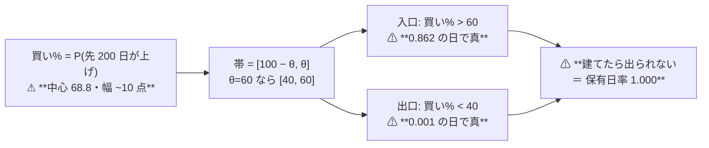
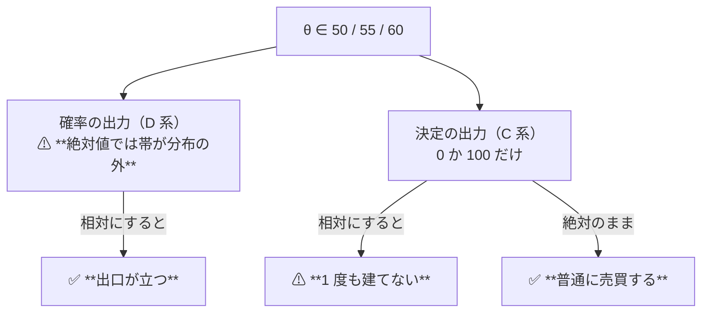
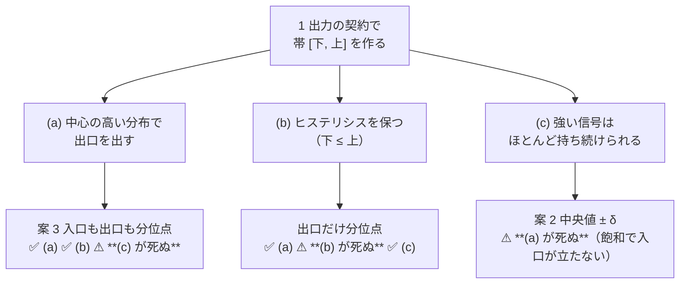

# 買い% の中心と θ の置き方

調査日: 2026-09-12〜13（**完了**。⚠ **裁定は「絶対のままで閉じる」**）。派生元: [TODO の同名タスク](../../../TODO.md)。
プラン: [theta-placement.md](../../plans/archive/theta-placement.md) ／ 規約: [rules.md 13-3](feature-discovery/rules.md)（θ の事前固定）・[13-4](feature-discovery/rules.md)（状態機械）・[16-1](feature-discovery/rules.md)（出力の契約）。
コード: `experiments/feature-discovery/cli/calibdiag.py --theta`（⚠ **診断専用。`runs/` に書かない**）。

> ⚠ **これは投資助言ではなく調査資料である。** ⚠ **資金は動かしていない**（2026-08-27 の方針）。
> ⚠ **数字はすべて【実測 2026-09-12】で、材料は訓練分割の内側だけ**（較正を fit した標本）。
> ⚠ **検証 fold の上乗せは 1 つも見ていない** — 見たら θ を検証データで選んだことになる（[13-3 規約 4](feature-discovery/rules.md)）。
> ⚠ **`n_trials` は 337 のまま動いていない。**

## 0. ここまでで分かったこと

✅ **結論（2026-09-13 の利用者裁定）: θ の定義は変えない。** ⚠ **検知器の軸はここで閉じる**（§6-3）。
⚠ **理由は「効かないから」ではない** — ⚠ **相対的な置き方を 3 通り実装して回したら、どれも別の検査を壊した**（§6）。

⚠ **問題は「θ が高すぎる」ではなく 2 つある。** ⚠ **そして相対的な置き方は、いま唯一まともに売買している系統を壊す。**

| 問い | 答え |
| --- | --- |
| θ を上げ下げすれば直るか | ⚠ **直らない。** 出口の条件は `買い% < 100 − θ` で、⚠ **θ ≥ 50 は規約で固定**（13-3 規約 2）。⚠ **θ を上げると出口はさらに遠のき、下げるのは禁じられている**（§2 の証明） |
| ⚠ **相対的な置き方（案 2・3）は効くか** | ✅ **D 学習ゲートには効く。** 長期 200 日の θ=50 で、入口が立つ日 **0.978 → 0.500**・出口が立つ日 **0.022 → 0.500** ＝ ⚠ **初めて出口が出る**（§3） |
| ⚠ **副作用は無いか** | ⚠ **ある。致命的。** ⚠ **案 2・3 は C 古典フィルタを「1 度も建てない」状態にする**（買い% が 0 か 100 なので中央値が 100 になり、`買い% > 100` が永久に偽）。⚠ **いま唯一まともに売買している系統である**（§4） |
| 1 日ラベル（選別 × モデル）の既存の行は動くか | 案 2 なら ⚠ **わずか**（中央値 51.1 なので帯が 1 点ずれるだけ。θ=55 の入口が 0.055〜0.090 → 0.027〜0.043）。案 3 なら ⚠ **大きく動く**（θ=55 の入口が 0.450 に固定される。§3-2） |
| ⚠ **案 3 は θ の意味を変える** | ⚠ **入口が立つ日の割合が `1 − θ/100` に機械的に固定される**（0.50 / 0.45 / 0.40）。⚠ **信号の強さに関係なく同じだけ売買する** ＝ θ は「自信の水準」ではなく「売買の量のつまみ」になる |

> この図の主張: ⚠ **いまの契約では、入口と出口が同じ 1 本の確率の同じ側にあるので、出口が構造的に立たない。**

## 1. 何を測ったか

⚠ **動かした軸はゼロ。** 既存の config・表・fold・種をそのまま使い、⚠ **訓練分割の内側の買い% だけを材料に、θ の置き方 3 通りを紙の上で当てた。**

| 対象 | 実行 | ねらい |
| --- | --- | --- |
| 検知器 D / C | `trend_scales_1995` | ⚠ **D と C を同じ表で比べられる唯一の実行** |
| 選別 × モデル | `sel_small4_1995` | ⚠ **1 日ラベル。案を当てると既存の行がどれだけ動くか** |

⚠ **いまの契約は「帯」と厳密に同じである**ことを先に確認した（`ail/validation/simulate.py`）:

| | 条件 | 買い% に直すと |
| --- | --- | --- |
| 入口 | 入口% > θ | **買い% > θ** |
| 出口 | 出口% > θ（出口% = 100 − 買い%） | **買い% < 100 − θ** |

⚠ **だから θ ∈ {50,55,60} は帯 [50,50] / [45,55] / [40,60] と同じもの**である。3 案はこの帯の置き方の違いとして 1 つの表に並べられる。

| 案 | 帯 | ⚠ 現状に戻る条件 |
| --- | --- | --- |
| **1 現行（絶対）** | [100 − θ, θ] | — |
| **2 中央値 ± δ**（δ = θ − 50） | [中央値 − δ, 中央値 ＋ δ] | ⚠ **中央値が 50 なら完全一致** |
| **3 分位点** | [Q(100 − θ), Q(θ)] | ⚠ **買い% が 0〜100 に一様なら一致** |

⚠ **保有日率そのものは出していない** — 状態機械にはヒステリシスがあるので、⚠ **保有日率は
[入口が立つ割合, 1 − 出口が立つ割合] の間に入る。** ⚠ **検証 fold を読まずに言えるのはここまでである。**

## 2. ⚠ 証明: θ ≥ 50 では出口が立たない

⚠ **出口は必ず「買い% < 50」以下を要求する**（上の表 ＋ 13-3 規約 2 の θ ≥ 50）。
⚠ **一方、先 W 営業日が上がる確率は W が長いほど 1 に寄る**（ドリフト）。

訓練分割の内側の買い% の中央値【実測】:

| 手法 | 買い% の中央値 | 案 1 θ=50 の入口 | 案 1 θ=50 の出口 | 案 1 θ=60 の入口 | 案 1 θ=60 の出口 |
| --- | ---: | ---: | ---: | ---: | ---: |
| D1 短期 20 日 | **59.4** | 1.000 | ⚠ **0.000** | 0.393 | ⚠ **0.000** |
| D2 中期 60 日 | **62.5** | 0.968 | 0.032 | 0.564 | ⚠ **0.007** |
| D3 長期 200 日 | **68.8** | 0.978 | 0.022 | 0.862 | ⚠ **0.001** |

⚠ **θ を 50 → 60 に上げると入口は厳しくなるが、出口は 0.022 → 0.001 とさらに立たなくなる。**
⚠ **建てたら fold 末尾の強制清算まで持つ** ＝ 保有日率 1.000 ＝ B&H と同じ。

⚠ **16 章の 2 出力でも同じ**（`pair.py` の出口% ＝ 100 − P(先 W_out 日が上げ)。中心 31.6〜41.5 で θ ≥ 50 を超えない）。
⚠ **窓を替えても、較正が正しいかぎり同じ壁に当たる。**

## 3. 案 2・3 を当てるとどうなるか【実測】

### 3-1. D 学習ゲート — ✅ **効く**

| 手法 | θ | 案 | 帯 | 入口が立つ | 出口が立つ |
| --- | ---: | --- | --- | ---: | ---: |
| D3 長期 200 日 | 50 | 1 現行 | [50.0, 50.0] | 0.978 | ⚠ **0.022** |
| D3 長期 200 日 | 50 | **2 中央値±δ** | [68.8, 68.8] | **0.500** | ✅ **0.500** |
| D3 長期 200 日 | 50 | **3 分位点** | [68.8, 68.8] | **0.500** | ✅ **0.500** |
| D3 長期 200 日 | 55 | 1 現行 | [45.0, 55.0] | 0.921 | 0.005 |
| D3 長期 200 日 | 55 | 2 中央値±δ | [63.8, 73.8] | 0.129 | **0.109** |
| D3 長期 200 日 | 55 | 3 分位点 | [68.3, 69.4] | 0.450 | **0.450** |
| D2 中期 60 日 | 55 | 1 現行 | [45.0, 55.0] | 0.888 | 0.013 |
| D2 中期 60 日 | 55 | 2 中央値±δ | [57.5, 67.5] | 0.076 | **0.084** |
| D2 中期 60 日 | 55 | 3 分位点 | [62.1, 62.9] | 0.450 | **0.450** |

- ✅ **θ=50 では案 2 と案 3 は同じもの**（どちらも帯が中央値 1 点に潰れる）。⚠ **入口 0.500・出口 0.500** ＝ 初めて出口が立つ
- ⚠ **θ=55・60 で 2 案は大きく違う**: ⚠ **案 2 は ±5 点の帯が分布の幅（約 10 点）に対して広すぎて売買が減る**（入口 0.076〜0.129）。⚠ **案 3 は帯が分布に合わせて縮む**（±0.5 点）ので売買が残る

### 3-2. 選別 × モデル（1 日ラベル）— ⚠ **案 3 は既存の行を大きく動かす**

| 手法 | θ | 案 1 現行 の入口 | 案 2 の入口 | ⚠ 案 3 の入口 |
| --- | ---: | ---: | ---: | ---: |
| F2-2 RFE | 50 | 0.744 | 0.500 | 0.500 |
| F2-2 RFE | 55 | 0.090 | 0.043 | ⚠ **0.450** |
| F2-2 RFE | 60 | 0.006 | 0.007 | ⚠ **0.400** |
| 乱択（基準） | 55 | 0.002 | 0.001 | ⚠ **0.450** |

⚠ **案 3 では入口が立つ割合が `1 − θ/100` に機械的に固定される**（0.50 / 0.45 / 0.40）。
⚠ **信号が無い乱択でも同じだけ売買する。** ⚠ **つまり θ は「自信の水準」ではなく「売買の量のつまみ」になる。**

> ⚠ **これは欠点とも利点とも読める。** ⚠ **利点**: 保有日数が揃うので「同じだけ持つなら正しい日を選べるか」という
> 公平な比較になり、[14-6 (b) の「同じ保有日率の乱択ゲート」](feature-discovery/rules.md)が自然な基準線になる。
> ⚠ **欠点**: 「ほとんど持つのが正しい」という答えを表現できなくなる。⚠ **モデルが「常に持て」と言っていても必ず 50〜60% 休む。**

## 4. ⚠ **案 2・3 は C 古典フィルタを壊す**（プランの失敗モード 3 が的中）

`classic_filter` は買い% が **0 か 100 しか取らない**。⚠ **訓練分割の 56〜66% の日が 100 なので、中央値は 100 になる。**

| 手法 | θ | 案 | 帯 | 入口が立つ | 出口が立つ |
| --- | ---: | --- | --- | ---: | ---: |
| C2 中期 SMA60 | 50 | 1 現行 | [50.0, 50.0] | **0.604** | **0.396** |
| C2 中期 SMA60 | 50 | 2 中央値±δ | [100.0, 100.0] | ⚠ **0.000** | 0.396 |
| C2 中期 SMA60 | 50 | 3 分位点 | [100.0, 100.0] | ⚠ **0.000** | 0.396 |
| C1 短期 SMA20 | 60 | 3 分位点 | [0.0, 100.0] | ⚠ **0.000** | ⚠ **0.000** |
| C3 長期 SMA200 | 60 | 2 中央値±δ | [90.0, 110.0] | ⚠ **0.000** | 0.343 |

⚠ **`買い% > 100` は永久に偽なので、C 系は 1 度も建てない ＝ 取引ゼロ・保有日率 0。**
⚠ **いま唯一まともに売買している系統である**（取引 1,194〜1,361 回/fold。D 系は 63 回）。

⚠ **原因は「C の出力が確率ではなく決定（0/1）だから」である。** ⚠ **確率の分布に相対的な置き方は、退化した分布に当てられない。**

> この図の主張: ⚠ **θ が 2 種類の出力を兼用していたことが、ここで初めて表に出た。**

## 5. Phase 2 に出す案（⚠ **利用者の裁定**）

| 案 | 中身 | ⚠ 触る規約 | ⚠ 代償 |
| --- | --- | --- | --- |
| **1 何もしない** | 絶対確率 50/55/60 のまま | — | ⚠ **学習する検知器は永久に B&H と同じ。** ⚠ **「効かない」と「測れない」を区別できない**（36 試行がその状態） |
| **2 中央値 ± δ** | 帯 = [訓練の買い% 中央値 − δ, ＋ δ]、δ ∈ {0,5,10} | 13-3 | ⚠ **C 系が建てなくなる**（§4）。⚠ **θ=55・60 で D 系の売買も薄い**（入口 0.076〜0.129） |
| **3 分位点** | 帯 = [Q(100−θ), Q(θ)] | 13-3 | ⚠ **C 系が建てなくなる**。⚠ **1 日ラベルの既存の行も大きく動く。** ⚠ **θ が売買量のつまみになる** |
| **4 出力を中心化** | 買い% を訓練の中央値で 50 に寄せる。θ は据え置き | ⚠ **13-2・14-1**（⚠ **出力が確率でなくなる**） | ⚠ **C 系は同じく壊れる**（100 → 50 になり `> 50` が偽）。⚠ **確率としての解釈と門の指標の意味を失う** |
| **5 出力の種類を宣言させる** | ⚠ **手法が「確率」か「決定」かを宣言し、確率にだけ相対的な置き方を当てる**（C 系は案 1 のまま） | 13-3 ＋ **14-1**（契約に種類を足す） | ⚠ **C と D を同じ物差しで比べられなくなる**（そこが 15 章の狙いだった）。⚠ **宣言は構造なので 14-9 には反しない** |

⚠ **Claude の見立て**: ⚠ **案 5 ＋ 分位点（案 3）の組み合わせが、測れないものを測れるようにする最短路である。**
⚠ **ただし「C と D を同じ物差しで」を捨てることになるので、そこは利用者の判断である。**

## 6. 実装して分かったこと ⚠ **3 つの置き方が別々の理由で壊れた**【実測 2026-09-12】

利用者の裁定は **案 5 ＋ 分位点**（確率の出力にだけ分位点・決定の出力は絶対）。⚠ **配線は全部入れた**
（`calibrate.levels` ／ `simulate(enter_at, exit_at)` ／ 検知器が `出力` と `水準` を宣言 ／ 選別は較正の標本から作る）。
⚠ **だが有効にしていない。** ⚠ **実測で、どの置き方も別の検査を壊したからである。**

> この図の主張: ⚠ **1 出力の契約で帯を 1 つの分布から作ると、3 つの要求を同時に満たせない。**

| 置き方 | ✅ できたこと | ⚠ 壊れたこと |
| --- | --- | --- |
| **案 3**（入口も出口も分位点） | ✅ **出口が出る**: D 系の保有日率 **1.000 → 0.105〜0.909**・取引 **63 → 404〜6,850 回/fold**。✅ **C 系は 1 ビットも変わらない**（保有日率 0.527/0.558/… が完全一致） | ⚠ **leak 対照が死ぬ。** ⚠ **実データで D 系 4 本とも取引 0 回・保有日率 0.000**（`trend_scales_1995 --leak`）。飽和した確率では θ パーセンタイルが訓練分布のいちばん上に張り付き、⚠ **検証 fold の買い% がそこに届かない**（合成 leak では θ=60 の上乗せ **−159.7bp** ＝ 跳ねない） |
| **出口だけ分位点** | ✅ leak 対照が戻る（3/3・＋1,409〜2,640bp） | ⚠ **帯が逆転してヒステリシスが消える**（入口 50 < 出口の境目 68.8）。⚠ **14,493〜22,226 回/fold の日替わり売買**になり、コストだけで数百 bp 溶ける |
| **案 2**（中央値 ± δ） | — | ⚠ **飽和した確率では中央値が上端なので入口が永久に立たない**（Phase 1 で C 系、leak でも同じ形） |

⚠ **`np.percentile` をそのまま使うと同じ値の束を 1 日も選べない**ので、⚠ **「θ パーセンタイルを下回る最大の値」を返す `_cut` を書いた**（`ail/models/calibrate.py`）。
⚠ **それでも足りない** — 訓練で飽和した分布は ⚠ **fold を跨いで位置が動く**ので、訓練から作った水準が検証 fold の外に出る。

### 6-1. ⚠ **副産物: 本命の数字が 1 回だけ取れた**

⚠ **採用しなかった案 3 で 1 回回した結果**（⚠ **`runs/` には残していない** — 出荷しなかったコードの数字は再現できないので、
⚠ **台帳に入れると「再現しない行」になる**。⚠ **数字はここに書いて残す**）:

| 手法 | θ | 純利bp | ⚠ 対 B&H 上乗せ | 取引/fold | 保有日率 | ⚠ 同じ保有日率の乱択ゲート |
| --- | ---: | ---: | ---: | ---: | ---: | ---: |
| 基準 常に上（B&H） | — | **4,220.2** | — | 59.8 | 1.00 | 4,220.2 |
| D3 長期 200 日 | 55 | 2,063.6 | ⚠ **−2,156.6** | 203.8 | 0.5 | ⚠ **2,708.4** |
| D4 合成 | 55 | 1,989.3 | ⚠ **−2,230.9** | 1,184.4 | 0.5 | ⚠ **2,500.2** |
| D1 短期 20 日 | 60 | 1,996.5 | ⚠ **−2,223.7** | 2,978.4 | 0.5 | 1,930.0 |
| D2 中期 60 日 | 50 | 651.2 | ⚠ **−3,569.0** | 1,732.0 | 0.4 | 1,150.4 |

- ⚠ **出口が出るようにすると、学習ゲートは全部 B&H に大きく負ける**（−1,650〜−3,569bp）
- ⚠ **さらに、同じ保有日率の乱択ゲートにも負ける**（D3 2,063.6 対 2,708.4 ／ D4 1,989.3 対 2,500.2）
  ＝ ⚠ **[14-6 (b)](feature-discovery/rules.md) の分離検定に落ちた。** ⚠ **「休むと損」だけでなく「乱択より下手に休む」**
- ⚠ **これは「測れないから分からない」ではなく「測ったら負けた」である**（弱い器での 1 回きりの観測という限界つき）

### 6-2. 利用者の裁定（2026-09-13）と後片付け

✅ **裁定: 絶対のままで閉じる。** ⚠ **θ の定義は変えない。** 守るのは ⚠ **leak 対照**・⚠ **337 試行と同じ物差し**・⚠ **ヒステリシス**。

| # | 後片付け |
| ---: | --- |
| 1 | ⚠ **本番コードは全部 HEAD に戻した**（`simulate` / `calibrate` / `scale` / `pair` / `cli/run` / テスト）。⚠ **出荷しない配線は残さない** — ⚠ **呼ばれない機構は「いつか使う」ではなく負債である** |
| 2 | ✅ **残したのは診断の道具だけ**: `cli/calibdiag.py --theta`（⚠ **`out/diag/` にしか書かない**）。3 案の帯・入口が立つ割合・出口が立つ割合を訓練分割の内側だけで出せる |
| 3 | ⚠ **試作で回した 4 実行は `runs/` から消した。** ⚠ **手法の試行ではなく器の試作**であり、⚠ **`env.json` の commit が実際のコードと一致しない**（出荷しなかった木で回した）ので、残すと再現の規約（[rules.md 0 章](feature-discovery/rules.md)）に反する |
| 4 | ✅ **検算**: `n_trials` **337 のまま** ／ 台帳 **498 行** ／ ⚠ **HEAD の台帳と生成日の 1 行を除いて完全一致** ／ **276 件 pass** |
| 5 | ⚠ **再現も確かめた**: 戻す前の inert なコードで `trend_scales_1995` を回して上乗せ ＋14.73 / ＋100.57 / −55.98 が完全再現（台帳の再現欄が「2 実行・一致」「3 実行・一致」） |

### 6-3. ⚠ **検知器の軸をここで閉じる**

⚠ **「効かない」とは言わない。言えるのは次の 2 つだけである。**

| # | 言えること | 根拠 |
| ---: | --- | --- |
| 1 | ⚠ **いまの物差しでは検定できない** | §2 の証明（θ ≥ 50 では出口が構造的に立たない）。⚠ **だから既存の 36 試行の「保留」は「効かなかった」ではなく「測っていない」** |
| 2 | ⚠ **検定できる器で 1 回測ったら、同じ保有日率の乱択ゲートに負けた** | §6-1（D3 2,063.6 対 2,708.4 ／ D4 1,989.3 対 2,500.2）。⚠ **1 回きり・弱い器という限界つき** |

⚠ **だから追加の検証はしない**（[14-10 規約 1](feature-discovery/rules.md) の「測れない」に当たる）。
⚠ **器を作り直すなら、直すのは θ ではなく出力の契約かラベルである**（§5 の案 5 ＋ 16 章の拡張）。⚠ **それは別の処置＝別のタスク。**

## 7. ⚠ 限界

| # | 限界 |
| ---: | --- |
| 1 | ⚠ **保有日率そのものは測っていない**（ヒステリシスがあるので上限と下限で挟むところまで）。⚠ **上乗せ・fold の符号・DSR は 1 つも測っていない** |
| 2 | ⚠ **測ったのは 2 実行だけ**（`trend_scales_1995` と `sel_small4_1995`）。LightGBM・GPU 系・16 章の 2 出力は当てていない |
| 3 | ⚠ **案 2 の δ と案 3 の分位点は、いまの θ の 3 水準から機械的に導いた**（δ = θ − 50・Q(θ)）。⚠ **別の導き方もありうるが、それは新しい自由度なので増やしていない** |
| 4 | ⚠ **「どれが儲かるか」は分からない。** ⚠ **分かるのは「どれなら売買が起きるか」だけである** |
