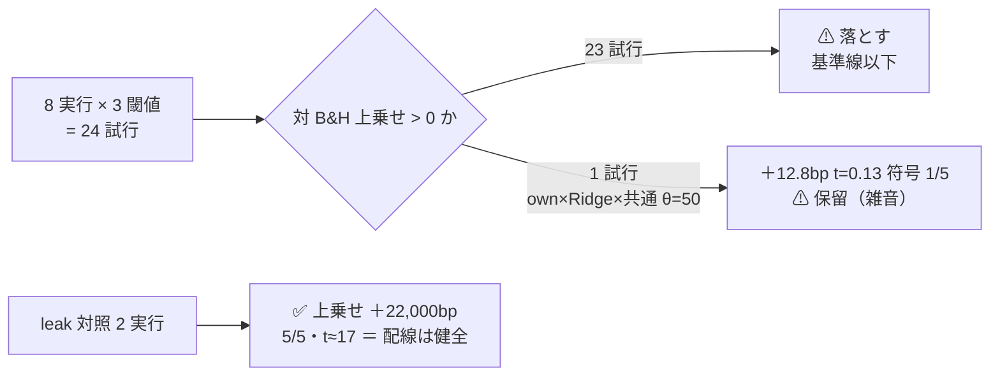
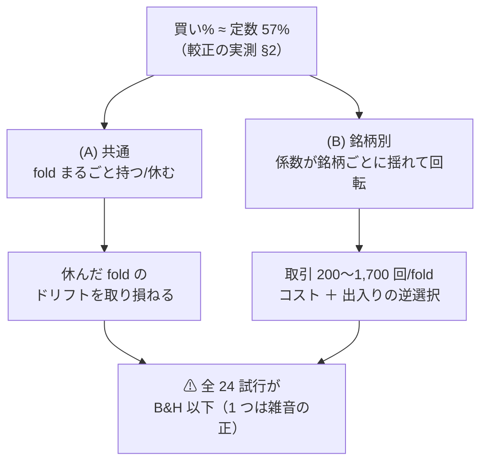
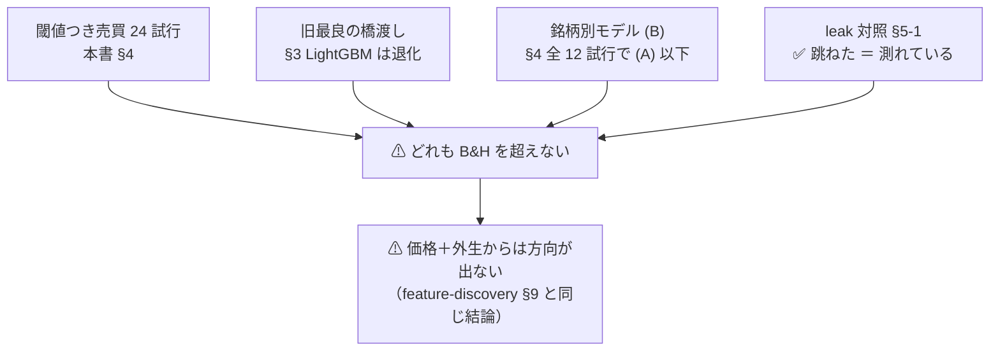

# 閾値つき売買の検証（実際の取引に近づけた検証方式での追試）

調査日: 2026-09-10（**完了**）。派生元: [TODO の同名タスク Step 4](../../TODO.md)（利用者の指示 2026-09-10 ＋ 追記 4 件）。
プラン: [trading-validation.md](../../plans/archive/trading-validation.md) ／ 規約: [rules.md 13 章](feature-discovery/rules.md)（正本）／ 台帳: [ledger.md](feature-discovery/ledger.md)。
コード: `experiments/feature-discovery/`（シミュレータ・較正は Step 3 で実装済み。本書は追試の記録）。

> ⚠ **これは投資助言ではなく調査資料である。** 特定の銘柄・売買を推奨しない。
> ⚠ **資金は動かしていない**（2026-08-27 の方針）。データは取得済みの日足だけを使った。
> ⚠ **数字はすべて【実測 2026-09-10】**。良い数字は根拠「中」が上限（rules.md 11 章 規約 3）。

## 0. ここまでで分かったこと

⚠ **検証方式を実際の取引（閾値・買い専用・銘柄別 bp）に近づけても、どの手法・形式・閾値も「期初に買って期末に売るだけ」（B&H）を超えなかった。**
旧方式で唯一正だった LightGBM の＋1.52bp は、新方式では **B&H から「fold 3 を休んだ」分だけ負ける形**に変わった。

> この図の主張: ⚠ **8 実行 × 3 閾値 = 24 試行のうち、上乗せが正なのは 1 つだけで、それも t = 0.13 の雑音である。**

| 問い | 答え |
| --- | --- |
| 実際の取引に近づけると数字は良くなったか | ⚠ **ならない。** 24 試行中 23 で対 B&H 上乗せが負。唯一の正（own × Ridge × 共通 × θ=50 の＋12.8bp）は t = 0.13・符号 1/5 で雑音 |
| 旧最良（LightGBM ＋1.52bp）はどうなったか | ⚠ **較正すると確率がほぼ定数（買い% ≈ 57%）になり、θ=50 では「fold 3 だけ休む B&H」に退化した。** 差分は fold 3 のドリフトの取り損ね −274bp だけ（§3-2） |
| 銘柄ごとのモデル (B) は効いたか | ⚠ **効かない。全 12 試行で (A) 共通 1 本より悪い。** 回転が増えてコストと逆選択で削られる（θ=50 で中央値 2,339 対 6,899bp。§4） |
| 横断＋外生（ownex）は効いたか | ⚠ **効かない。** own_ だけと同じ形（θ=50 で上乗せ −68〜−592bp）。ex_ を足しても閾値売買では差が出ない |
| 閾値を上げるとどうなるか | ⚠ **取引が減ってドリフトを取り損ねるだけ**（θ=60 は LightGBM 共通で取引 0 回 = 上乗せ −1,652bp）。「θ が高いほど良い」は出ていない（13-10 の逆向き） |
| 配線は信用できるか | ✅ **leak 対照は両形式で跳ねた**（上乗せ ＋22,000bp・5/5・t ≈ 17・DSR 1.000）。「測れていない」ではない |
| §9 の結論は変わったか | ⚠ **変わらない。** 「価格（＋外生）だけからは方向が出ない」は、検証方式を実際の取引に近づけても同じだった。⚠ **これはプラン §5 が事前に予想した形であり、それ自体が成果** |

## 1. 何を検証したか

⚠ **処置は検証方式（＋形式・閾値）だけ。** 予測モデル・表・分割・パージ・種（0）は既存と揃えた（rules.md 13-1）。
選別は「全部使う」1 本に絞った（選別の優劣は決着済み。乱択は基準線として残す）。

| 決めごと | 中身 | どこで決めたか |
| --- | --- | --- |
| 検証方式 | 較正（Platt）→ 買い% 0〜100 → 閾値 θ ∈ {50, 55, 60}% → 買い専用の状態機械 → 売買した日だけ片道 2.5bp → fold 末尾で強制清算 | [rules.md 13-2〜13-4](feature-discovery/rules.md) |
| 判定の量 | ポートフォリオ（等加重）の**対 B&H 上乗せ**（純利の符号では「買って持っただけ」と区別できない） | 13-7 |
| 形式 | (A) 銘柄共通 1 本 ／ (B) 銘柄別 63 本（fit も較正も銘柄ごと） | 13-6 |
| 入力 | own_（35 本。橋渡し）／ own＋cs＋rel＋ex（124 本。本命。対象は会社株 48・エンバーゴ 1 本） | [プラン §Phase 3](../../plans/archive/trading-validation.md) |
| モデル | Ridge ／ LightGBM（旧最良）。MLP は追試しない（own_ で LightGBM と同型・断面で悪化が実測済み） | 同上 |

実行の一覧（10 本。全部 日足・地平 1 日・5 fold・種 0・コスト 5bp）:

| # | 実行 | 入力 | モデル | 形式 | ねらい |
| ---: | --- | --- | --- | --- | --- |
| 1 | `2026-09-10T20-04-53_trade_own_ridge_a` | own_ | Ridge | (A) | 橋渡し |
| 2 | `2026-09-10T20-05-08_trade_own_ridge_b` | own_ | Ridge | (B) | 橋渡し |
| 3 | `2026-09-10T20-05-14_trade_own_lgbm_a` | own_ | LightGBM | (A) | ⚠ **旧最良の橋渡し** |
| 4 | `2026-09-10T20-05-20_trade_own_lgbm_b` | own_ | LightGBM | (B) | 橋渡し |
| 5 | `2026-09-10T20-05-45_trade_ownex_ridge_a` | own+cs+rel+ex | Ridge | (A) | 本命（指示 ⑤） |
| 6 | `2026-09-10T20-05-49_trade_ownex_ridge_b` | 同上 | Ridge | (B) | 本命 |
| 7 | `2026-09-10T20-05-56_trade_ownex_lgbm_a` | 同上 | LightGBM | (A) | 本命 |
| 8 | `2026-09-10T20-06-03_trade_ownex_lgbm_b` | 同上 | LightGBM | (B) | 本命 |
| 9 | `2026-09-10T20-06-33_trade_own_lgbm_a_leak` | own_ の leak 表 | LightGBM | (A) | ⚠ 配線の検査 |
| 10 | `2026-09-10T20-06-42_trade_own_lgbm_b_leak` | 同上 | LightGBM | (B) | ⚠ 配線の検査 |

## 2. 配線【実測 2026-09-10】

実装は Step 3（`simulate.py`・`calibrate.py`・`splits.date_edges`・`cli/run.py` の `[trading]` 節）。本節は追試で確かめた挙動だけを書く。

| # | 確かめたこと | 結果 |
| ---: | --- | --- |
| 1 | fold の切れ目（日付基準）が (A)(B) で同じか | ✅ 同じ edge を共有（下の表）。⚠ **旧方式（行 rank）とは境目が少しずれる**ので、旧 fold 番号と 1 対 1 では対応しない |
| 2 | 閾値売買は間引かない（`--sample` が効かない）か | ✅ ログに「⚠ 閾値つき売買は間引かない」。135,962 行（own）／ 101,157 行（ownex）を全部使った |
| 3 | 較正の fit 元が記録されるか | ✅ `fitted/calibration_f*.json` に (a, b, source)。(A) は全 fold holdout。⚠ **(B) の fold 1 は 63 銘柄すべて train**（訓練 ≈ 360 日/銘柄で holdout が切れない。13-2 の想定どおり）。fold 2 以降はほぼ holdout |
| 4 | B&H のコスト | ✅ 1 fold あたり片道 2 回 = 5bp（純利 1652.02 = 粗利 1657.02 − 5.0） |

fold の検証期間（日付基準・own の表。ownex も同じ日付集合）:

| fold | 検証の期間 | 検証日数 |
| ---: | --- | ---: |
| 1 | 2019-07-09 〜 2020-12-08（⚠ コロナ暴落と回復を含む） | 360 |
| 2 | 2020-12-09 〜 2022-05-16 | 361 |
| 3 | 2022-05-17 〜 2023-10-19（⚠ 2022 年の下げ相場） | 359 |
| 4 | 2023-10-20 〜 2025-03-28 | 360 |
| 5 | 2025-03-31 〜 2026-09-04 | 361 |

⚠ **較正が明かしたこと（本書でいちばん効く実測）**: (A) の Platt 係数は **a ≈ 0**（LightGBM fold 1: a = −3.1e-05, b = 0.276）。
つまり ⚠ **holdout では予測値と「上がるか」に単調な関係がほぼ無く**、買い% は fold ごとの基準率 σ(b) ≈ 57% の**ほぼ定数**になる。
θ=50 では「fold まるごと持つ / 持たない」の 2 択に退化し、θ=55・60 では取引がほぼ消える。
⚠ **これは較正の不具合ではなく、予測に確率の情報が無いことの実測である**（leak 表では同じ較正が買い% 0/100 に振り切れて跳ねる。§5-1）。

## 3. 橋渡し — 旧最良を同じ表で新方式にかける【実測 2026-09-10】

⚠ **旧「純利 bp（毎日往復・1 日あたり平均）」と新「ポートフォリオ純利 bp（閾値売買・fold 累計）」は別の物差しで、数字は直接比べない**（rules.md 13-8）。
対で見るのは「旧で正だったものが、新でも B&H を超えるか」だけである。

| 対（own_ の表・全部使う） | 旧: 純利 bp/日 | 旧: 対ドリフト | 新 (A) θ=50: 対 B&H 上乗せ bp/fold | 新の符号 | 判定 |
| --- | ---: | ---: | ---: | :-: | :-: |
| × LightGBM（旧最良） | ＋1.52 | ＋1.50（t 0.92） | ⚠ **−54.8（t −1.00）** | 0/5 00−00 | **落とす** |
| × Ridge | −4.10 | −3.72 | ＋12.8（t 0.13） | 1/5 0＋−00 | **保留** |

| # | 読み方 |
| ---: | --- |
| 1 | ⚠ **LightGBM の「正」は新方式に生き残らない。** 買い% がほぼ定数なので θ=50 では fold 1・2・4・5 が B&H と完全一致（上乗せ 0）になり、fold 3（2022 の下げ〜回復）だけ全休した。⚠ **その fold 3 も B&H は＋274bp 稼いでおり、休んだ分だけ負けた** |
| 2 | 旧方式で LightGBM が勝って見えたのは、**空売りと「毎日往復 5bp を B&H にも課す」歪み**の上でだけ。買い専用でコストを売買した日だけにすると、ドリフトを持ち続ける B&H に勝る材料が無い |
| 3 | Ridge (A) θ=50 の＋12.8bp は fold 2 ＋337.9 と fold 3 −273.9 の差し引きで、t = 0.13・DSR 0.279。⚠ **雑音であり「採る」の一歩手前ではない**（rules.md 11 章 規約 2） |

## 4. 結果 — 8 実行 × 3 閾値の全表【実測 2026-09-10】

数字は最良手法（= 全部使う。基準線を除く）のポートフォリオ純利（fold 平均・bp）と対 B&H 上乗せ。B&H の純利は own 1652.0 ／ ownex 1650.6bp。
⚠ **3 閾値とも載せる**（良かった閾値だけ報告しない。rules.md 13-3 の 3）。

| 入力 | モデル | 形式 | θ | 純利 bp | 上乗せ bp | t | 符号 | 取引/fold | 保有日率 | DSR | 判定 |
| --- | --- | :-: | ---: | ---: | ---: | ---: | :-: | ---: | ---: | ---: | :-: |
| own | Ridge | A | 50 | ＋1664.8 | **＋12.8** | 0.13 | 1/5 | 182 | 0.79 | 0.279 | **保留** |
| own | Ridge | A | 55 | ＋697.3 | −954.7 | −1.73 | 1/5 | 34 | 0.39 | 0.064 | 落とす |
| own | Ridge | A | 60 | −4.4 | −1656.4 | −3.76 | 0/5 | 4 | 0.03 | 0.007 | 落とす |
| own | Ridge | B | 50 | ＋785.3 | −866.8 | −4.33 | 0/5 | 1173 | 0.54 | 0.117 | 落とす |
| own | Ridge | B | 55 | ＋676.1 | −975.9 | −3.47 | 0/5 | 353 | 0.41 | 0.106 | 落とす |
| own | Ridge | B | 60 | ＋507.4 | −1144.6 | −3.38 | 0/5 | 174 | 0.32 | 0.071 | 落とす |
| own | LightGBM | A | 50 | ＋1597.2 | −54.8 | −1.00 | 0/5 | 50 | 0.80 | 0.242 | 落とす |
| own | LightGBM | A | 55 | ＋491.0 | −1161.0 | −2.37 | 0/5 | 13 | 0.20 | 0.042 | 落とす |
| own | LightGBM | A | 60 | 0.0 | −1652.0 | −3.73 | 0/5 | ⚠ **0** | 0.00 | — | 落とす |
| own | LightGBM | B | 50 | ＋779.8 | −872.2 | −3.46 | 0/5 | 772 | 0.55 | 0.118 | 落とす |
| own | LightGBM | B | 55 | ＋457.3 | −1194.7 | −3.96 | 0/5 | 567 | 0.32 | 0.057 | 落とす |
| own | LightGBM | B | 60 | ＋264.1 | −1387.9 | −3.86 | 0/5 | 447 | 0.19 | 0.029 | 落とす |
| ownex | Ridge | A | 50 | ＋1173.2 | −477.4 | −1.06 | 1/5 | 1705 | 0.75 | 0.119 | 落とす |
| ownex | Ridge | A | 55 | ＋1095.5 | −555.1 | −1.35 | 0/5 | 223 | 0.58 | 0.124 | 落とす |
| ownex | Ridge | A | 60 | ＋106.9 | −1543.7 | −2.83 | 0/5 | 33 | 0.22 | 0.014 | 落とす |
| ownex | Ridge | B | 50 | ＋985.1 | −665.6 | −6.53 | 0/5 | 989 | 0.57 | 0.184 | 落とす |
| ownex | Ridge | B | 55 | ＋957.8 | −692.8 | −3.41 | 0/5 | 394 | 0.49 | 0.198 | 落とす |
| ownex | Ridge | B | 60 | ＋700.4 | −950.2 | −3.42 | 0/5 | 265 | 0.39 | 0.116 | 落とす |
| ownex | LightGBM | A | 50 | ＋1583.0 | −67.6 | −1.00 | 0/5 | 38 | 0.80 | 0.219 | 落とす |
| ownex | LightGBM | A | 55 | ＋552.9 | −1097.7 | −2.42 | 0/5 | 10 | 0.20 | 0.046 | 落とす |
| ownex | LightGBM | A | 60 | 0.0 | −1650.6 | −3.62 | 0/5 | ⚠ **0** | 0.00 | — | 落とす |
| ownex | LightGBM | B | 50 | ＋1058.4 | −592.2 | −2.96 | 0/5 | 759 | 0.58 | 0.220 | 落とす |
| ownex | LightGBM | B | 55 | ＋672.0 | −978.6 | −3.39 | 0/5 | 578 | 0.34 | 0.139 | 落とす |
| ownex | LightGBM | B | 60 | ＋485.2 | −1165.4 | −3.43 | 0/5 | 484 | 0.18 | 0.106 | 落とす |

> この図の主張: ⚠ **負け方は 2 通りしかない。** (A) は「休んだ fold のドリフトの取り損ね」、(B) は「回転のコストと逆選択」。どちらも B&H に勝つ経路ではない。

| # | 読み方 |
| ---: | --- |
| 1 | ⚠ **(B) 銘柄別は全 12 試行で (A) 共通より悪い。** 銘柄あたり訓練 360〜1,800 日では係数が安定せず、買い% が閾値をまたいで揺れて回転が増える（own × Ridge で 1,173 回/fold）。⚠ **利用者の指示「銘柄ごとにモデルを作る」の答えは「この標本の薄さでは共通 1 本に勝てない」である** |
| 2 | ⚠ **ownex（横断＋外生）も own_ と同じ形。** ex_ 追加は旧方式（impact-ex ＋2.60bp・検定は通らず）と同様、閾値売買でも B&H を超える力にならない |
| 3 | θ=55・60 の純利がすべて θ=50 より小さいのは、**見送りがドリフトの放棄としてしか働かない**ため（保有日率 0.8 → 0.2 → 0.03 と縮む）。「θ が高いほど良い」は出ていない（13-10 の検査は §5-2） |
| 4 | DSR の最良でも 0.279（n_obs 1801・n_trials 91）。慣例の 0.95 に遠い |

## 5. 検査【実測 2026-09-10】

### 5-1. leak 対照 — 上乗せの跳ね（rules.md 13-10）

| 実行 | θ=50 の上乗せ bp | 符号 | t | 取引/fold | DSR |
| --- | ---: | :-: | ---: | ---: | ---: |
| own × LightGBM × (A) の leak | ⚠ **＋22,192.6** | 5/5 | 17.14 | 5,712 | 1.000 |
| own × LightGBM × (B) の leak | ⚠ **＋22,037.2** | 5/5 | 17.72 | 5,651 | 1.000 |

✅ **両形式とも跳ねた ＝ 較正 → 閾値 → 状態機械の配線は健全で、§4 の数字は「測れている」。**
leak 表では同じ Platt 較正が買い% を 0 / 100 に振り切り（上がる日だけ持つ）、θ の 3 水準の差は (A) 3bp・(B) 23bp と、純利 2.4 万 bp に対して無視できる。
⚠ **本番の表で θ 依存が大きく leak で消えるのは、「本番の買い% だけが 50% 近傍に密集している」ことの傍証**でもある（§2 の a ≈ 0 と同じ事実の裏面）。

### 5-2. 「θ が高いほど良い」の潰し（13-10）

出ていない（§4 の表のとおり、θ を上げると全 8 実行で純利も上乗せも単調に悪化し、取引回数は 0 に向かう）。
「取引しない ＝ コストを払わないだけ」で良く見える危険は、今回は逆向き（取引しないほどドリフトを失って悪化）に出た。⚠ **買い専用・上乗せ判定の設計が先回りして潰した形。**

### 5-3. 台帳の後方互換（13-9）

✅ 旧 67 試行は 1 行も変わらない（pytest 170 件に固定テストあり。台帳の再生成でも旧行は値・判定とも不変で、新 3 列が（毎日往復・共通・—）で埋まるだけ）。
n_trials は **67 → 91**（+24 = 2 モデル × 2 形式 × 3 閾値 × 2 入力。leak・基準線は数えない。見積りどおり）。

## 6. 銘柄別 bp（成果物）【実測 2026-09-10】

⚠ **採否には使わない**（63 銘柄は独立でない。rules.md 13-7）。利用者の求める出力として残す。全量は各実行の `per_symbol.csv`。

要約（最良手法 × θ=50・5 fold 合計・銘柄あたり）:

| 実行 | 銘柄数 | 中央値 bp | 四分位 bp | 勝ち銘柄（>0） |
| --- | ---: | ---: | --- | ---: |
| own × LightGBM × (A) | 63 | ＋6,899 | ＋4,185 〜 ＋10,438 | 57 |
| own × LightGBM × (B) | 63 | ＋2,339 | −194 〜 ＋8,580 | 45 |
| own × Ridge × (A) | 63 | ＋7,082 | ＋3,934 〜 ＋10,928 | 58 |
| ownex × LightGBM × (A) | 48 | ＋6,180 | ＋2,907 〜 ＋10,011 | 42 |
| （参考）B&H | 63 | ＋7,100 | ＋3,718 〜 ＋10,778 | — |

⚠ **銘柄別の正は手法の手柄ではない。** B&H の中央値（＋7,100bp）とほぼ同じで、**ドリフトの写し**である。
対 B&H で勝った銘柄は (A) 30/63・(B) 12/63（own × LightGBM × θ=50）。(A) の 30/63 はコイン投げと区別がつかない。

(A)(B) の横並び（own × LightGBM × θ=50・5 fold 合計。⚠ 同じ銘柄・同じ fold・同じ閾値のセルどうし）— 抜粋。全 63 銘柄は `runs/2026-09-10T20-05-14_trade_own_lgbm_a` ／ `…20_trade_own_lgbm_b` の `per_symbol.csv`:

| 銘柄 | B&H bp | (A) bp | (A)−B&H | (A) 取引 | (B) bp | (B)−B&H | (B) 取引 |
| --- | ---: | ---: | ---: | ---: | ---: | ---: | ---: |
| NVDA | ＋40,475 | ＋32,252 | −8,223 | 4 | ＋28,836 | −11,639 | 77 |
| TSLA | ＋31,757 | ＋33,565 | ＋1,808 | 4 | ＋14,700 | −17,057 | 158 |
| AMD | ＋27,225 | ＋27,294 | ＋70 | 4 | ＋2,716 | −24,509 | 118 |
| AAPL | ＋18,357 | ＋16,892 | −1,465 | 4 | ＋11,094 | −7,263 | 58 |
| SPY | ＋9,441 | ＋9,134 | −307 | 4 | ＋4,310 | −5,131 | 62 |
| PFE | −3,935 | ＋1,237 | ＋5,171 | 4 | −277 | ＋3,658 | 36 |
| NKE | −8,524 | −7,178 | ＋1,347 | 4 | −150 | ＋8,374 | 55 |
| BA | −5,190 | −8,290 | −3,100 | 4 | −11,335 | −6,145 | 45 |

| # | 読み方 |
| ---: | --- |
| 1 | (A) の取引は**全銘柄そろって 4 回**（= fold 3 を除く 4 fold で「期初に建てて期末清算」1 回ずつ）。⚠ **買い% が銘柄によらずほぼ同じ定数だから**で、「銘柄ごとに違う指標」は事実上出ていない（§2） |
| 2 | (B) は銘柄ごとに取引 24〜158 回とばらつくが、⚠ **勝ちは下げ銘柄（PFE・NKE）で「持たない時間が長かった」ものに限られ**、上げ銘柄（AMD −24,509bp 等）で大きく取り損ねる。⚠ **下げを避けたのではなくドリフトを捨てただけ**（(A)(B) の銘柄別 bp の相関 0.70） |
| 3 | 利用者の指示 ④「1 つの予想モデルで各銘柄を売買したときの bp」はこの表と `per_symbol.csv` が答え。⚠ **ただしその大小は手法ではなく銘柄のドリフトの大小である** |

## 7. 判定【実測 2026-09-10】

⚠ **2026-09-10 に完了。** ⚠ **「効かないことの証明」ではなく「この設定では効かなかった」である。**

> この図の主張: ⚠ **検証方式の軸を動かしても、選別（§9）・断面（§8）・モデル（gpu-models）と同じ場所に戻る。**

| 問い | 答え |
| --- | --- |
| 追試 24 試行の行き先 | **落とす 23 ／ 保留 1**（own × Ridge × (A) × θ=50。上乗せ ＋12.8bp・t 0.13・符号 1/5 の雑音）。「採る」は 0 |
| 旧方式の結論との関係 | ⚠ **強くなった。** 旧方式の「正」（LightGBM ＋1.52bp・コロナ期依存）は、買い専用・実コストの下では**存在しない**。検証方式を実際の取引に近づけるほど、B&H との差は消える方向に動いた |
| E8 のどの型か | **X2（コストで消える）＋ X9（標本不足）**に加え、⚠ **「そもそも確率に情報が無い」（較正の a ≈ 0）が直接見えた**。§9 から変わらない |
| n_trials | ⚠ **67 → 91**（台帳が数える）。DSR の最良は 0.279 で、慣例の 0.95 に遠い |
| 次に動かすなら | ⚠ **検証方式の軸はこれで閉じる**（実際の取引に近い物差しは整った。以後の手法検証はこの物差しで測れる）。残る軸は入れる情報と手法系統（DL / 進化的探索のタスクが後続。⚠ **その検証は本方式＝対 B&H 上乗せで測る**） |
