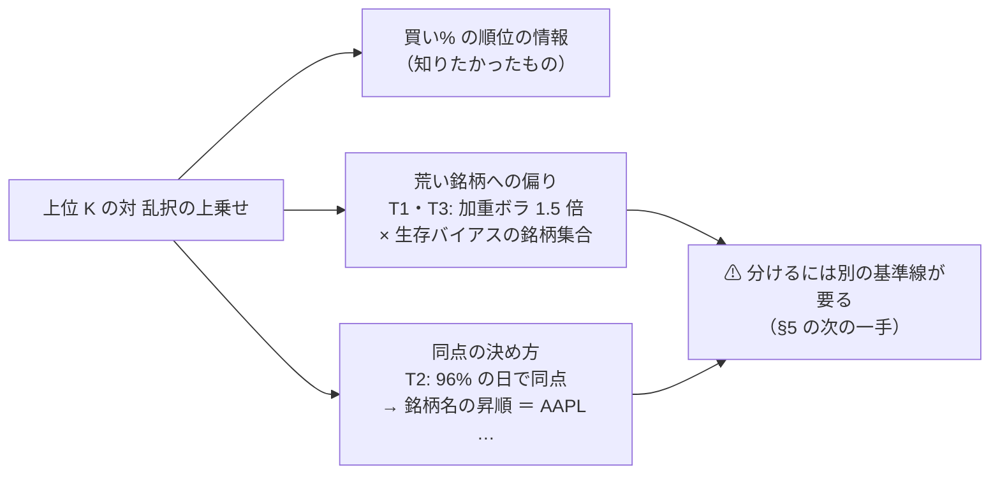
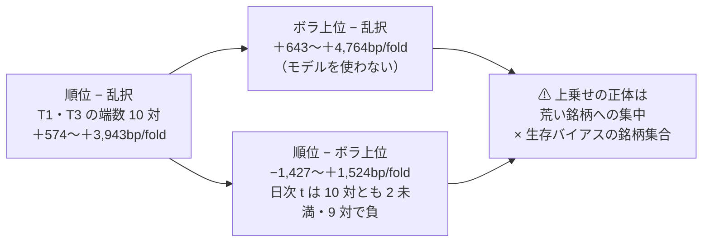

# 上位 K — 保有できる銘柄数に上限を置いた閾値売買（K 5 水準 × 3 モデル × 予算 2 規模）

作成日: 2026-09-19。利用者の指示（2026-09-19）: **「もっとも高い３銘柄を購入するようなことはできる？」「保有可能な銘柄数をいくつかのパターンで試します」「B で進めて」「$1000 と $10000 の両方を比較できるようにして。$10000 は実際の取引で使えない可能性があるのでそれを明記する」**。
事前登録: [rules.md 17 章](feature-discovery/rules.md)（売買の規則・水準・基準線・予想を結果の前に固定）。プラン: [topk-holdings.md](../../plans/archive/topk-holdings.md)。

> ⚠ **これは投資助言ではなく調査資料である。** 数字はすべて【実測】（自前のバックテスト）。⚠ **資金は動かしていない**（取得済みの日足・既存の 3 つの表）。
> ⚠ **規模 B（1 人 $3,000 ＝ 口座 $10,000）は実際の取引で使えない可能性がある**（口座の残高は $1,000【実測 2026-09-16】）。下の表の「整数株B⚠」の行は全部そうである。

## 0. 一言で

| 問い | 答え |
| --- | --- |
| 上位 K にするとバックテストの数字はどうなったか | ⚠ **大きく良く出た**（端数の 15 行は全部 対 B&H で平均が正。最大は T2・K=1 の ＋5,400bp/fold）。⚠ **だが「採る」は 0 行**（fold の符号 5/5 は 1 行も無い） |
| それは「買い% の順位が当たっている」からか | ⚠ **そう読めない。** 順位で選ぶと **値動きの荒い銘柄（NVDA・TSLA・AMD・LLY …）に寄る**（保有日の加重ボラ 250〜265bp/日 対 乱択 160〜205）。銘柄集合は 2026 年時点の時価総額上位（生存バイアス）で、この期間は荒い大型株が大きく上げた。⚠ **「荒い銘柄に集中した」効果と「当てた」効果が分かれていない** |
| T2（LightGBM）は | ⚠ **検証になっていない。** 買い% が**同じ日の 48 銘柄でほぼ同じ値**（候補が 2 本以上ある日の 96% で最高値が同点・中央値 48 本で同点）。上位 K は同点の決め方（銘柄名の昇順）で **AAPL・ABBV・ABT・AMD…** を買っていただけ。⚠ **事前登録の「同点は実質起きない」が T2 では外れた** |
| 規模 A（$1,000）と B（$10,000 ⚠）の差は | **K ≤ 3 ではほぼ同じ形**で、**K ≥ 10 で A は買えなくなる**（K=10 の株価での見送りは A 約 6 万回 対 B 数百回。K=20 の A は投下率 0.02〜0.03 ＝ ほぼ全額現金）。B は K=20 まで端数の版に近い |
| 事前に書いた予想は | (1)「45 行とも採るにならない」＝ ✅ 当たり。(2)「端数の 15 対とも 対 乱択の日次 |t| < 2」＝ ❌ **外れ（6 対で |t| ≥ 2。最大 3.44）**。⚠ 外れた理由は上の 2 つ（荒い銘柄への偏り・T2 の同点）で説明がつき、順位の情報とは言えない |
| ✅ **その後、荒さだけで並べる基準線を足して分けた（§6）** | **モデルを使わない「ボラ上位 K」が、T1・T3 の端数 10 対のうち 9 対でモデルの順位を上回った。** 順位 − ボラ上位の日次 \|t\| は 10 対とも 2 未満 ＝ ⚠ **上位 K の上乗せは荒い銘柄への集中で説明がつき、順位の情報とは言えない** |
| 実売買に持ち込めるか | ⚠ **この結果で K を選ばない**（17-6 の 4）。分かったのは「上位 K にすると成績は少数の荒い銘柄の運になる」「T2 は銘柄を選んでいない」の 2 つ |

> この図の主張: 上位 K の良い数字には、順位の情報のほかに 2 つの別の原因が混ざっていて、今回の基準線（乱択上位 K）ではそれを分けられなかった。

## 1. 回したもの

| 項目 | 中身 |
| --- | --- |
| 実行 | 本番 3 ＋ leak 対照 3（キュー `topk`。6 本で 2 分 1 秒・失敗 0）。`runs/2026-09-19T12-33-14_trade_own_ridge_a_topk` ほか |
| モデル × θ | T1 `trade_own_ridge_a`（Ridge・θ=50・63 銘柄）／ T2 `trade_ownex_lgbm_a`（LightGBM・θ=55・⚠ **48 銘柄** ＝ `targets = "company"`）／ T3 `trade_ownseq_ridge_a` の T3 QUANT（θ=50・63 銘柄） |
| K × 行の種類 | K ∈ {1, 3, 5, 10, 20} × 端数 ／ 整数株 A（$300）／ 整数株 B⚠（$3,000）＝ 1 モデル 15 行 |
| 基準線 | B&H（端数・全銘柄の等加重。判定の式は 13-7 のまま）／ 乱択上位 K（同じ規則で順位だけ乱数・種 5 つの平均） |
| 台帳 | **n_trials 622 → 667**（＋45。事前登録どおり）。検算: 既存の 899 鍵は数字も判定も 1 つも動かず・消えた鍵 0・新しい鍵 90（試行 45 ＋ 基準線 45）。素の行は既存の鍵にまとまった（再現・一致）。「採る」は 0 件のまま |
| テスト | `tests/test_topk.py` 18 本（K ＝ 銘柄数で 13 章の状態機械とポジション・日次純利が完全一致 ／ 枠 ／ 売った日の枠は翌日から ／ 整数株の見送り ／ 乱択の再現 ／ `top_k` を足しても素の行の値が 1 ビットも変わらない ／ leak で跳ねる）。全体 457 本通過 |
| leak 対照 | 45 行のうち 42 行で上乗せが 5/5 で跳ねた（＋5,500〜＋49,000bp）。⚠ **跳ねなかった 3 行は 3 モデルとも「整数株 A・K=20」**（枠 $15 では何も買えない ＝ 17-6 の 3 で予告した形。配線の穴ではない） |

## 2. 結果【実測】

列の読み方: 純利は fold 1 本あたりの bp（5 fold の平均）。「対 B&H」「対 乱択」は fold ごとの差の平均と符号。日次 t は日次の対の差（fold 連結・約 1,800 日）の t で、⚠ **多重検定を通していない目安**。投下率 ＝ 平均して資金の何割が株になっていたか。判定は 13-7（対 B&H の上乗せが正で 5/5 なら採る・正だが割れれば保留・0 以下は落とす）。

### 2-1. T1 — Ridge・own 35 列・θ=50（2026-09-19T12-33-14_trade_own_ridge_a_topk）

B&H 1,652.02 ／ 素の行 全部使う（基準） 1,381.12（上乗せ -270.89）θ=50 銘柄 63
⚠ **素の行は「落とす」**（較正 std。B6 で引いた「保留 ＋12.79」は較正「旧」の行だった ＝ [live-trading.md §0-1](live-trading.md)）。

| 行の種類 | K | 純利 bp/fold | 対 B&H | fold | 対 乱択 | fold | 日次 t（対 乱択） | 日次 t（対 B&H） | 投下率 | 買えた ／ 株価で見送り | 銘柄の種類 | 判定 |
| --- | ---: | ---: | ---: | --- | ---: | --- | ---: | ---: | ---: | --- | ---: | --- |
| 端数 | 1 | ＋3,550.99 | ＋1,898.97 | 4/5 ＋＋＋−＋ | ＋2,127.69 | 4/5 ＋＋＋−＋ | ＋1.06 | ＋0.96 | 0.76 | 134 ／ 0 | 11.0 | 保留 |
| 端数 | 3 | ＋2,711.81 | ＋1,059.80 | 3/5 −＋＋−＋ | ＋1,644.54 | 3/5 −＋＋−＋ | ＋1.54 | ＋0.91 | 0.76 | 309 ／ 0 | 19.0 | 保留 |
| 端数 | 5 | ＋2,646.69 | ＋994.68 | 3/5 −＋＋−＋ | ＋1,267.24 | 3/5 −＋＋−＋ | ＋1.44 | ＋1.01 | 0.76 | 492 ／ 0 | 24.2 | 保留 |
| 端数 | 10 | ＋1,986.26 | ＋334.25 | 3/5 −＋＋−＋ | ＋665.11 | 4/5 ＋＋0＋＋ | ＋1.28 | ＋0.46 | 0.76 | 903 ／ 0 | 30.8 | 保留 |
| 端数 | 20 | ＋1,883.35 | ＋231.33 | 3/5 ＋＋−−＋ | ＋625.26 | 4/5 ＋＋0＋＋ | ＋2.02 | ＋0.40 | 0.76 | 1751 ／ 0 | 39.2 | 保留 |
| 整数株A | 1 | ＋2,907.45 | ＋1,255.43 | 4/5 ＋＋＋−＋ | ＋1,821.66 | 4/5 ＋＋＋−＋ | ＋1.05 | ＋0.72 | 0.66 | 133 ／ 24 | 10.6 | 保留 |
| 整数株A | 3 | ＋2,913.45 | ＋1,261.43 | 3/5 −＋＋−＋ | ＋1,709.06 | 4/5 ＋＋0＋＋ | ＋2.34 | ＋1.42 | 0.62 | 293 ／ 788 | 11.8 | 保留 |
| 整数株A | 5 | ＋1,445.05 | −206.97 | 2/5 −＋＋−− | ＋460.66 | 4/5 ＋−＋＋＋ | ＋1.01 | −0.27 | 0.59 | 455 ／ 2861 | 10.4 | 落とす |
| 整数株A | 10 | ＋679.60 | −972.41 | 1/5 −＋−−− | ＋0.00 | 2/5 ＋00＋0 | ＋0.89 | −1.34 | 0.29 | 326 ／ 58578 | 6.2 | 落とす |
| 整数株A | 20 | ＋245.00 | −1,407.02 | 0/5 −−−−− | ＋0.00 | 0/5 00000 | −0.07 | −1.44 | 0.02 | 19 ／ 81352 | 1.0 | 落とす |
| 整数株B⚠ | 1 | ＋3,505.19 | ＋1,853.18 | 4/5 ＋＋＋−＋ | ＋2,073.70 | 4/5 ＋＋＋−＋ | ＋1.07 | ＋0.96 | 0.75 | 134 ／ 0 | 11.0 | 保留 |
| 整数株B⚠ | 3 | ＋2,592.70 | ＋940.68 | 3/5 −＋＋−＋ | ＋1,521.38 | 3/5 −＋＋−＋ | ＋1.52 | ＋0.86 | 0.71 | 309 ／ 0 | 19.0 | 保留 |
| 整数株B⚠ | 5 | ＋2,299.45 | ＋647.43 | 3/5 −＋＋−＋ | ＋1,083.63 | 3/5 −＋＋−＋ | ＋1.41 | ＋0.73 | 0.66 | 502 ／ 28 | 24.4 | 保留 |
| 整数株B⚠ | 10 | ＋1,888.96 | ＋236.94 | 4/5 ＋＋＋−＋ | ＋744.20 | 4/5 ＋＋＋−＋ | ＋1.65 | ＋0.35 | 0.64 | 939 ／ 386 | 27.4 | 保留 |
| 整数株B⚠ | 20 | ＋1,621.42 | −30.60 | 2/5 ＋＋−−− | ＋416.56 | 4/5 ＋＋0＋＋ | ＋2.15 | −0.05 | 0.61 | 1814 ／ 4645 | 30.8 | 落とす |

### 2-2. T2 — LightGBM・own cs rel ex・θ=55（2026-09-19T12-33-41_trade_ownex_lgbm_a_topk）

B&H 1,650.62 ／ 素の行 全部使う（基準） 1,699.33（上乗せ +48.72）θ=55 銘柄 48
⚠ **この表は順位の検証になっていない**（§3-2。同点を銘柄名の昇順で割った結果 ＝ ほぼ「AAPL と AMD を持つ」）。

| 行の種類 | K | 純利 bp/fold | 対 B&H | fold | 対 乱択 | fold | 日次 t（対 乱択） | 日次 t（対 B&H） | 投下率 | 買えた ／ 株価で見送り | 銘柄の種類 | 判定 |
| --- | ---: | ---: | ---: | --- | ---: | --- | ---: | ---: | ---: | --- | ---: | --- |
| 端数 | 1 | ＋7,051.10 | ＋5,400.48 | 4/5 ＋＋−＋＋ | ＋5,991.39 | 4/5 ＋＋0＋＋ | ＋3.44 | ＋2.93 | 0.66 | 20 ／ 0 | 1.8 | 保留 |
| 端数 | 3 | ＋4,032.68 | ＋2,382.07 | 4/5 ＋＋−＋＋ | ＋2,381.15 | 4/5 ＋＋0＋＋ | ＋3.04 | ＋2.19 | 0.66 | 61 ／ 0 | 4.0 | 保留 |
| 端数 | 5 | ＋3,620.05 | ＋1,969.44 | 2/5 ＋−−−＋ | ＋1,591.02 | 3/5 ＋＋0−＋ | ＋2.55 | ＋1.98 | 0.66 | 101 ／ 0 | 6.2 | 保留 |
| 端数 | 10 | ＋2,575.26 | ＋924.64 | 3/5 ＋−−＋＋ | ＋628.22 | 3/5 ＋−0＋＋ | ＋1.66 | ＋1.17 | 0.66 | 201 ／ 0 | 10.8 | 保留 |
| 端数 | 20 | ＋2,081.58 | ＋430.97 | 2/5 −−−＋＋ | ＋178.25 | 2/5 −−0＋＋ | ＋0.87 | ＋0.71 | 0.66 | 401 ／ 0 | 19.6 | 保留 |
| 整数株A | 1 | ＋6,079.95 | ＋4,429.33 | 4/5 ＋＋−＋＋ | ＋5,199.53 | 4/5 ＋＋0＋＋ | ＋3.43 | ＋2.81 | 0.55 | 20 ／ 2 | 1.8 | 保留 |
| 整数株A | 3 | ＋4,458.51 | ＋2,807.90 | 4/5 ＋＋−＋＋ | ＋1,623.33 | 4/5 ＋＋0＋＋ | ＋2.55 | ＋2.32 | 0.54 | 60 ／ 254 | 3.8 | 保留 |
| 整数株A | 5 | ＋2,067.60 | ＋416.98 | 3/5 ＋−−＋＋ | ＋238.31 | 2/5 −＋0−＋ | ＋0.65 | ＋0.58 | 0.55 | 98 ／ 646 | 4.8 | 保留 |
| 整数株A | 10 | ＋1,216.94 | −433.68 | 1/5 ＋−−−− | ＋0.00 | 1/5 0−0−＋ | ＋0.62 | −0.59 | 0.22 | 56 ／ 17760 | 3.6 | 落とす |
| 整数株A | 20 | ＋349.45 | −1,301.16 | 0/5 −−−−− | ＋0.00 | 0/5 00000 | −0.56 | −1.33 | 0.02 | 2 ／ 19908 | 0.4 | 落とす |
| 整数株B⚠ | 1 | ＋6,889.01 | ＋5,238.40 | 4/5 ＋＋−＋＋ | ＋5,865.94 | 4/5 ＋＋0＋＋ | ＋3.45 | ＋2.91 | 0.64 | 20 ／ 0 | 1.8 | 保留 |
| 整数株B⚠ | 3 | ＋3,815.51 | ＋2,164.90 | 4/5 ＋＋−＋＋ | ＋2,325.62 | 4/5 ＋＋0＋＋ | ＋3.18 | ＋2.11 | 0.62 | 61 ／ 0 | 4.0 | 保留 |
| 整数株B⚠ | 5 | ＋3,184.45 | ＋1,533.83 | 2/5 ＋−−−＋ | ＋1,426.29 | 3/5 ＋＋0−＋ | ＋2.52 | ＋1.64 | 0.58 | 101 ／ 3 | 6.0 | 保留 |
| 整数株B⚠ | 10 | ＋2,554.31 | ＋903.70 | 3/5 ＋−−＋＋ | ＋753.03 | 4/5 ＋＋0＋＋ | ＋2.91 | ＋1.26 | 0.56 | 201 ／ 79 | 10.6 | 保留 |
| 整数株B⚠ | 20 | ＋1,731.47 | ＋80.86 | 2/5 −−−＋＋ | −52.28 | 2/5 −−0＋＋ | −0.48 | ＋0.14 | 0.52 | 358 ／ 1062 | 17.6 | 保留 |

### 2-3. T3 — 時系列分類器 T3 QUANT（60 日窓）・θ=50（2026-09-19T12-34-23_trade_ownseq_ridge_a_topk）

B&H 1,652.02 ／ 素の行 T3 QUANT（60日窓） 1,713.93（上乗せ +61.92）θ=50 銘柄 63

| 行の種類 | K | 純利 bp/fold | 対 B&H | fold | 対 乱択 | fold | 日次 t（対 乱択） | 日次 t（対 B&H） | 投下率 | 買えた ／ 株価で見送り | 銘柄の種類 | 判定 |
| --- | ---: | ---: | ---: | --- | ---: | --- | ---: | ---: | ---: | --- | ---: | --- |
| 端数 | 1 | ＋4,520.70 | ＋2,868.69 | 2/5 ＋−−＋− | ＋3,033.13 | 2/5 ＋−0＋− | ＋1.37 | ＋1.31 | 0.78 | 41 ／ 0 | 4.0 | 保留 |
| 端数 | 3 | ＋5,367.34 | ＋3,715.33 | 4/5 ＋＋−＋＋ | ＋3,943.08 | 4/5 ＋＋0＋＋ | ＋3.40 | ＋3.10 | 0.78 | 107 ／ 0 | 7.8 | 保留 |
| 端数 | 5 | ＋4,037.72 | ＋2,385.70 | 4/5 ＋＋−＋＋ | ＋2,463.25 | 3/5 ＋＋0−＋ | ＋2.94 | ＋2.62 | 0.78 | 162 ／ 0 | 11.0 | 保留 |
| 端数 | 10 | ＋2,590.48 | ＋938.47 | 3/5 ＋＋−−＋ | ＋959.25 | 3/5 ＋＋0−＋ | ＋1.74 | ＋1.35 | 0.79 | 302 ／ 0 | 16.8 | 保留 |
| 端数 | 20 | ＋2,237.91 | ＋585.89 | 2/5 ＋＋−−− | ＋573.88 | 2/5 ＋＋0−− | ＋1.69 | ＋1.05 | 0.79 | 565 ／ 0 | 24.0 | 保留 |
| 整数株A | 1 | ＋6,946.61 | ＋5,294.60 | 2/5 ＋−−＋− | ＋5,217.24 | 2/5 ＋−0＋− | ＋2.66 | ＋2.73 | 0.71 | 34 ／ 11 | 3.8 | 保留 |
| 整数株A | 3 | ＋5,246.87 | ＋3,594.85 | 4/5 ＋＋−＋＋ | ＋3,448.63 | 3/5 ＋＋0−＋ | ＋3.34 | ＋3.43 | 0.65 | 77 ／ 144 | 5.8 | 保留 |
| 整数株A | 5 | ＋3,195.41 | ＋1,543.39 | 4/5 ＋＋−＋＋ | ＋1,415.04 | 3/5 ＋＋0−＋ | ＋3.01 | ＋2.17 | 0.61 | 122 ／ 437 | 6.6 | 保留 |
| 整数株A | 10 | ＋1,279.06 | −372.96 | 2/5 ＋＋−−− | ＋1.54 | 2/5 ＋−0＋0 | ＋0.03 | −0.56 | 0.35 | 132 ／ 63583 | 5.2 | 落とす |
| 整数株A | 20 | ＋457.35 | −1,194.67 | 0/5 −−−−− | −0.00 | 0/5 −0000 | ＋0.54 | −1.25 | 0.03 | 20 ／ 87581 | 1.0 | 落とす |
| 整数株B⚠ | 1 | ＋4,619.22 | ＋2,967.21 | 2/5 ＋−−＋− | ＋3,144.35 | 2/5 ＋−0＋− | ＋1.45 | ＋1.39 | 0.75 | 41 ／ 0 | 4.0 | 保留 |
| 整数株B⚠ | 3 | ＋5,274.78 | ＋3,622.76 | 4/5 ＋＋−＋＋ | ＋3,920.27 | 4/5 ＋＋0＋＋ | ＋3.48 | ＋3.14 | 0.72 | 107 ／ 0 | 7.8 | 保留 |
| 整数株B⚠ | 5 | ＋3,925.12 | ＋2,273.10 | 3/5 ＋＋−−＋ | ＋2,554.72 | 4/5 ＋＋0＋＋ | ＋3.38 | ＋2.74 | 0.67 | 163 ／ 2 | 11.2 | 保留 |
| 整数株B⚠ | 10 | ＋2,885.67 | ＋1,233.66 | 3/5 ＋＋−−＋ | ＋1,304.54 | 3/5 ＋＋0−＋ | ＋2.74 | ＋1.90 | 0.66 | 279 ／ 70 | 16.0 | 保留 |
| 整数株B⚠ | 20 | ＋2,005.83 | ＋353.81 | 3/5 ＋＋−−＋ | ＋382.45 | 3/5 ＋＋0−＋ | ＋1.72 | ＋0.63 | 0.64 | 503 ／ 857 | 19.8 | 保留 |

### 2-4. 規模 A（$1,000）と 規模 B（$10,000 ⚠）の比較

⚠ **規模 B は実際の取引で使えない可能性がある。** 下は T1 の数字（T2・T3 も同じ形。§2-1〜2-3 の表）。

| K | 端数 純利 | A 純利 | A 投下率 | A 株価で見送り | B⚠ 純利 | B⚠ 投下率 | B⚠ 株価で見送り |
| ---: | ---: | ---: | ---: | ---: | ---: | ---: | ---: |
| 1 | ＋3,550.99 | ＋2,907.45 | 0.66 | 24 | ＋3,505.19 | 0.75 | 0 |
| 3 | ＋2,711.81 | ＋2,913.45 | 0.62 | 788 | ＋2,592.70 | 0.71 | 0 |
| 5 | ＋2,646.69 | ＋1,445.05 | 0.59 | 2,861 | ＋2,299.45 | 0.66 | 28 |
| 10 | ＋1,986.26 | ＋679.60 | 0.29 | 58,578 | ＋1,888.96 | 0.64 | 386 |
| 20 | ＋1,883.35 | ＋245.00 | 0.02 | 81,352 | ＋1,621.42 | 0.61 | 4,645 |

- 規模 A は **K ≤ 3 なら端数の版に近い**が、買える銘柄が安いものに限られる（買った銘柄の種類 10〜12 対 端数 11〜19）。**K ≥ 10 は成立しない**
- 規模 B⚠ は K=20 まで端数の版の 8 割以上を再現する（T1 86%・T2 83%・T3 90%）。⚠ 端数との差は「枠を使い切れない端数の現金」（投下率 0.76 → 0.61〜0.75）
- ⚠ 整数株の版は調整済み終値で判定している（17-3 の 3）。過去ほど株価が安く、実際より多く買えている

## 3. ⚠ なぜ良く出たか — 事前登録に無い診断（採否に使わない）

端数の版で、順位で選んだときと乱数で選んだときに、どの銘柄を何日持っていたかを数えた（`runs/` には書かず、同じ経路をもう 1 度通して数えただけ）。

### 3-1. 順位で選ぶと荒い銘柄に寄る（T1・T3）

| モデル | K | 順位: 保有日の加重ボラ（bp/日） | 乱択 | 全銘柄の平均 | 順位で長く持った銘柄 |
| --- | ---: | ---: | ---: | ---: | --- |
| T1 | 1 | 261.5 | 163.4 | 185.9 | NVDA 18%・ORCL 17%・MRK 13%・TSLA 11%・AMD 10% |
| T1 | 3 | 230.5 | 170.0 | 185.9 | INTC・XLRE・NVDA・CRM・NFLX・TSLA |
| T1 | 20 | 194.1 | 172.3 | 185.9 | （広く分散） |
| T3 | 1 | 265.8 | 158.9 | 185.9 | TSLA 28%・LLY 27%・ADBE 26% |
| T3 | 3 | 248.7 | 167.5 | 185.9 | LLY・TSLA・AMD・NFLX・PEP・QCOM |
| T3 | 20 | 190.6 | 178.8 | 185.9 | （広く分散） |

- 較正した買い% は、値動きの荒い銘柄ほど 50 から遠くへ振れる（17-6 の 5 で予告した癖）。上位を取ると荒い銘柄が並ぶ
- 銘柄集合は **2026-09-08 時点の時価総額上位**（rules.md 12-1 の生存バイアス）。2019〜2026 に荒く動いて**生き残った**大型株は、結果として大きく上げた銘柄である
- ⚠ **K=1 の成績は 3〜5 銘柄の値動きそのもの**（T3・K=1 は fold の符号 2/5）。乱択との差が大きいのは、乱択が ETF や値動きの小さい銘柄も等しく引くから

### 3-2. T2 は銘柄を選んでいない

| 測ったもの | T1 | T2 | T3 |
| --- | ---: | ---: | ---: |
| 候補が 2 本以上ある日のうち、最高の買い% が同点の日 | 0.0% | **96.0%** | 0.0% |
| 候補の買い% の種類 ÷ 候補の数（平均） | 1.00 | **0.04** | 1.00 |
| 最高値を分け合う本数（中央値） | 1 | **48** | 1 |

- T2 の買い% は**同じ日の 48 銘柄でほぼ同じ値** ＝ 木が市場全体の列（為替・金利などの `ex_`）で分かれ、銘柄ごとの列をほとんど使っていない
- 上位 K は同点を銘柄名の昇順で割るので、K=1 は **AAPL 60%・AMD 33%**、K=3 は AAPL・ABBV・ABT・AVGO・AMD・BA。⚠ **T2 の 15 行は「名前が A で始まる銘柄を持った」成績**であって、順位の検証ではない
- ⚠ **実売買への含意**: T2 は「いつ買うか」だけを決め、「どれを買うか」は決めていない。いまの閾値売買（銘柄ごとに独立）では 48 銘柄をほぼ同時に買い、ほぼ同時に売る

## 4. 判定と読み方

| 項目 | 判定 |
| --- | --- |
| 台帳の 45 行 | 採る 0 ／ 保留 37 ／ 落とす 8（落とすは整数株 A の K ≥ 5〜10 と B⚠ の K=20 の一部 ＝ 買えなかった行） |
| 「上位 K は効くか」 | ⚠ **白黒つかない。** 数字は良いが、荒い銘柄への偏り（T1・T3）と同点の決め方（T2）で説明がつく。⚠ **45 本の中の良い数字で、多重検定を通していない** |
| 実売買の K | ⚠ **この結果では選ばない**（17-6 の 4）。口座の制約（`dryrun2` で端株が通るか）で決める |
| 規模 A と B⚠ | 整数株で上位 K を回すなら、**A は K ≤ 3、B⚠ は K ≤ 20** が成立の範囲。⚠ B は実際の取引で使えない可能性がある |

## 5. 次の一手（⚠ 回すかどうかは利用者の裁定。回す前に rules.md 17 章へ追記する）

| 案 | 中身 | 分かること | 代償 |
| --- | --- | --- | --- |
| ✅ (a) 基準線「ボラ上位 K」（2026-09-19 に回した ＝ §6） | 買い% の代わりに、直近 60 日の値動きの大きさで並べる（モデルを使わない） | T1・T3 の上乗せが「荒い銘柄を持った」だけで再現するか | 基準線なので n_trials は増えない。半日【推測】 |
| (b) 買い% を銘柄ごとに標準化してから並べる | 銘柄ごとの過去の買い% の平均・幅で割る（訓練の内側） | 荒さの癖を除いた順位に情報が残るか | 新しい構成 ＝ n_trials ＋15〜45 |
| (c) T2 の同点を乱数で割る | 同点のときだけ乱数（種 5 つの平均） | T2 の本当の数字（たぶん乱択上位 K と同じになる） | 規約 17-1 の 5 の変更。＋15 |
| (d) 1995 表で回す | 期間を 31 年に延ばす | 2019〜2026 の大型株の上げに依存しているか | ＋15〜45。⚠ 生存バイアスはいっそう深くなる（12-1） |

## 6. 基準線「ボラ上位 K」を足した（2026-09-19。次の一手 (a)）

利用者の指示（2026-09-19）: **「(a) で進めて」**。事前登録は [rules.md 17-7](feature-discovery/rules.md)（⚠ 回す前に書いた）、プランは [topk-vol-baseline.md](../../plans/archive/topk-vol-baseline.md)。
候補（未保有 ＆ 買い% > θ）・売り・枠・コストは上位 K と同じで、**並べる値だけを買い% から「直近 60 営業日の日次対数リターンの標準偏差」に替えた**。モデルの順位は使わない。

### 6-0. 一言で

⚠ **上位 K の上乗せは、荒い銘柄に集中した効果で説明がつく。買い% の順位に情報があるとは言えない。**

| 問い | 答え【実測】 |
| --- | --- |
| モデルを使わず荒さだけで並べても、乱択に勝つか | ✅ **勝つ。** T1・T3 の端数 10 対とも平均が正（＋643〜＋4,764bp/fold）で、⚠ **10 対のうち 9 対で、モデルの順位より大きい** |
| 荒さで説明できない分（順位 − ボラ上位）は残るか | ⚠ **残らない。** T1・T3 の端数 10 対とも日次 |t| < 2（最大 1.12）。平均は 9 対で**負**（モデルの順位のほうが悪い） |
| 事前に書いた予想は | ✅ **2 つとも当たり**（10 対とも |t| < 2 ／ ボラ上位 K は 10 対とも 対 乱択で正） |
| T2 | 順位が銘柄名の昇順なので読まない（17-7）。数字は下の表に出した |

> この図の主張: 「順位 − 乱択」の上乗せは「ボラ上位 − 乱択」でほぼ再現でき、残り（順位 − ボラ上位）は 0 の周りか負である。

### 6-1. 端数の版【実測】

列: どれも fold 1 本あたりの bp（5 fold の平均）と、日次の対の差（fold 連結・約 1,800 日）の t。⚠ **t は多重検定を通していない目安**。

| モデル | K | 順位 − 乱択 | 日次 t | ボラ上位 − 乱択 | fold | 日次 t | ⚠ 順位 − ボラ上位 | fold | 日次 t |
| --- | ---: | ---: | ---: | ---: | --- | ---: | ---: | --- | ---: |
| T1 | 1 | ＋2,127.69 | ＋1.06 | ＋3,555.08 | 5/5 ＋＋＋＋＋ | ＋1.65 | −1,427.40 | 2/5 ＋＋−−− | −0.64 |
| T1 | 3 | ＋1,644.54 | ＋1.54 | ＋2,534.55 | 4/5 ＋＋＋−＋ | ＋1.69 | −890.01 | 1/5 −−−−＋ | −0.65 |
| T1 | 5 | ＋1,267.24 | ＋1.44 | ＋2,540.82 | 4/5 ＋−＋＋＋ | ＋1.97 | −1,273.57 | 2/5 −＋＋−− | −1.12 |
| T1 | 10 | ＋665.11 | ＋1.28 | ＋1,206.28 | 3/5 ＋−0＋＋ | ＋1.47 | −541.18 | 2/5 −＋0＋− | −0.76 |
| T1 | 20 | ＋625.26 | ＋2.02 | ＋813.01 | 3/5 ＋−0＋＋ | ＋1.61 | −187.75 | 1/5 −＋0−− | −0.42 |
| T2 | 1 | ＋5,991.39 | ＋3.44 | ＋2,213.78 | 4/5 ＋＋0＋＋ | ＋1.15 | ＋3,777.60 | 3/5 ＋−0＋＋ | ＋1.74 |
| T2 | 3 | ＋2,381.15 | ＋3.04 | ＋3,646.82 | 3/5 ＋＋0−＋ | ＋2.42 | −1,265.67 | 3/5 −＋0＋＋ | −0.84 |
| T2 | 5 | ＋1,591.02 | ＋2.55 | ＋2,871.64 | 4/5 ＋＋0＋＋ | ＋2.84 | −1,280.61 | 1/5 −−0−＋ | −1.25 |
| T2 | 10 | ＋628.22 | ＋1.66 | ＋1,330.96 | 4/5 ＋＋0＋＋ | ＋2.04 | −702.74 | 2/5 −−0＋＋ | −1.31 |
| T2 | 20 | ＋178.25 | ＋0.87 | ＋474.07 | 3/5 ＋−0＋＋ | ＋1.26 | −295.82 | 2/5 −＋0＋− | −0.89 |
| T3 | 1 | ＋3,033.13 | ＋1.37 | ＋1,509.40 | 3/5 ＋＋0−＋ | ＋0.67 | ＋1,523.73 | 2/5 ＋−0＋− | ＋0.51 |
| T3 | 3 | ＋3,943.08 | ＋3.40 | ＋4,763.73 | 4/5 ＋＋0＋＋ | ＋2.96 | −820.65 | 1/5 0−0＋− | −0.68 |
| T3 | 5 | ＋2,463.25 | ＋2.94 | ＋3,585.34 | 4/5 ＋＋0＋＋ | ＋2.65 | −1,122.10 | 1/5 −＋0−− | −0.95 |
| T3 | 10 | ＋959.25 | ＋1.74 | ＋1,739.39 | 3/5 ＋−0＋＋ | ＋1.82 | −780.14 | 1/5 −＋0−− | −0.88 |
| T3 | 20 | ＋573.88 | ＋1.69 | ＋643.20 | 2/5 ＋−0−＋ | ＋1.25 | −69.33 | 2/5 ＋＋0−− | −0.14 |

- ⚠ **T3・K=1 だけ順位のほうが大きい（＋1,524）が、fold の符号は 2/5・日次 t 0.51** ＝ 3〜4 銘柄の運（§3-1: TSLA・LLY・ADBE で保有日の 8 割）
- ⚠ **T2 の行は読まない**（§3-2。K=1 の ＋3,778 は「AAPL・AMD を持った」対「荒い銘柄を持った」の差）

### 6-2. 整数株の版【実測】（⚠ **規模 B は実際の取引で使えない可能性がある**）

#### 整数株A
| モデル | K | 順位 − 乱択 | 日次 t | ボラ上位 − 乱択 | fold | 日次 t | ⚠ 順位 − ボラ上位 | fold | 日次 t |
| --- | ---: | ---: | ---: | ---: | --- | ---: | ---: | --- | ---: |
| T1 | 1 | ＋1,821.66 | ＋1.05 | ＋2,257.01 | 4/5 ＋＋＋＋− | ＋1.19 | −435.35 | 3/5 ＋＋−−＋ | −0.31 |
| T1 | 3 | ＋1,709.06 | ＋2.34 | ＋2,833.83 | 4/5 ＋＋0＋＋ | ＋2.80 | −1,124.78 | 2/5 −＋0−＋ | −1.16 |
| T1 | 5 | ＋460.66 | ＋1.01 | ＋1,739.80 | 5/5 ＋＋＋＋＋ | ＋3.00 | −1,279.14 | 1/5 −−0＋− | −2.45 |
| T1 | 10 | ＋0.00 | ＋0.89 | ＋0.00 | 2/5 ＋00＋0 | ＋0.89 | ＋0.00 | 0/5 00000 | — |
| T1 | 20 | ＋0.00 | −0.07 | ＋0.00 | 0/5 00000 | −0.07 | ＋0.00 | 0/5 00000 | — |
| T2 | 1 | ＋5,199.53 | ＋3.43 | ＋1,175.61 | 3/5 ＋＋0−＋ | ＋0.77 | ＋4,023.92 | 3/5 ＋−0＋＋ | ＋2.28 |
| T2 | 3 | ＋1,623.33 | ＋2.55 | ＋3,605.62 | 4/5 ＋＋0＋＋ | ＋3.65 | −1,982.30 | 1/5 −−0＋0 | −2.08 |
| T2 | 5 | ＋238.31 | ＋0.65 | ＋869.28 | 3/5 ＋−0＋＋ | ＋1.53 | −630.97 | 2/5 −＋0−＋ | −1.13 |
| T2 | 10 | ＋0.00 | ＋0.62 | ＋0.00 | 1/5 0−0−＋ | ＋0.62 | ＋0.00 | 0/5 00000 | — |
| T2 | 20 | ＋0.00 | −0.56 | ＋0.00 | 0/5 00000 | −0.56 | ＋0.00 | 0/5 00000 | — |
| T3 | 1 | ＋5,217.24 | ＋2.66 | ＋797.99 | 3/5 ＋＋0−＋ | ＋0.46 | ＋4,419.25 | 2/5 ＋−0＋− | ＋1.74 |
| T3 | 3 | ＋3,448.63 | ＋3.34 | ＋2,924.19 | 4/5 ＋＋0＋＋ | ＋2.42 | ＋524.44 | 2/5 0＋0−＋ | ＋0.64 |
| T3 | 5 | ＋1,415.04 | ＋3.01 | ＋1,673.80 | 4/5 ＋＋0＋＋ | ＋2.79 | −258.76 | 2/5 −＋0−＋ | −0.55 |
| T3 | 10 | ＋1.54 | ＋0.03 | ＋7.89 | 2/5 ＋−0＋0 | ＋0.31 | −6.35 | 0/5 −0000 | −0.09 |
| T3 | 20 | −0.00 | ＋0.54 | −0.00 | 0/5 −0000 | ＋0.54 | ＋0.00 | 0/5 00000 | — |

#### 整数株B⚠
| モデル | K | 順位 − 乱択 | 日次 t | ボラ上位 − 乱択 | fold | 日次 t | ⚠ 順位 − ボラ上位 | fold | 日次 t |
| --- | ---: | ---: | ---: | ---: | --- | ---: | ---: | --- | ---: |
| T1 | 1 | ＋2,073.70 | ＋1.07 | ＋3,407.91 | 5/5 ＋＋＋＋＋ | ＋1.65 | −1,334.21 | 2/5 ＋＋−−− | −0.62 |
| T1 | 3 | ＋1,521.38 | ＋1.52 | ＋2,388.63 | 4/5 ＋＋＋−＋ | ＋1.68 | −867.25 | 1/5 −−−−＋ | −0.66 |
| T1 | 5 | ＋1,083.63 | ＋1.41 | ＋2,465.65 | 4/5 ＋−＋＋＋ | ＋2.21 | −1,382.02 | 2/5 −＋＋−− | −1.39 |
| T1 | 10 | ＋744.20 | ＋1.65 | ＋1,066.68 | 5/5 ＋＋＋＋＋ | ＋1.50 | −322.48 | 1/5 −＋0−− | −0.55 |
| T1 | 20 | ＋416.56 | ＋2.15 | ＋518.98 | 4/5 ＋＋0＋＋ | ＋1.82 | −102.41 | 2/5 −＋0＋− | −0.35 |
| T2 | 1 | ＋5,865.94 | ＋3.45 | ＋2,201.54 | 4/5 ＋＋0＋＋ | ＋1.17 | ＋3,664.40 | 3/5 ＋−0＋＋ | ＋1.73 |
| T2 | 3 | ＋2,325.62 | ＋3.18 | ＋3,745.34 | 3/5 ＋＋0−＋ | ＋2.56 | −1,419.71 | 3/5 −＋0＋＋ | −0.98 |
| T2 | 5 | ＋1,426.29 | ＋2.52 | ＋2,907.32 | 4/5 ＋＋0＋＋ | ＋3.07 | −1,481.02 | 1/5 −−0−＋ | −1.55 |
| T2 | 10 | ＋753.03 | ＋2.91 | ＋1,266.71 | 4/5 ＋＋0＋＋ | ＋2.39 | −513.68 | 1/5 −−0＋− | −1.15 |
| T2 | 20 | −52.28 | −0.48 | ＋353.29 | 3/5 ＋−0＋＋ | ＋1.86 | −405.57 | 3/5 −＋0＋＋ | −2.38 |
| T3 | 1 | ＋3,144.35 | ＋1.45 | ＋1,455.64 | 3/5 ＋＋0−＋ | ＋0.67 | ＋1,688.70 | 2/5 ＋−0＋− | ＋0.58 |
| T3 | 3 | ＋3,920.27 | ＋3.48 | ＋4,715.61 | 4/5 ＋＋0＋＋ | ＋3.10 | −795.33 | 1/5 0−0＋− | −0.75 |
| T3 | 5 | ＋2,554.72 | ＋3.38 | ＋3,571.23 | 4/5 ＋＋0＋＋ | ＋2.86 | −1,016.51 | 1/5 −＋0−− | −1.01 |
| T3 | 10 | ＋1,304.54 | ＋2.74 | ＋1,318.63 | 3/5 ＋−0＋＋ | ＋1.69 | −14.09 | 1/5 −＋0−− | −0.02 |
| T3 | 20 | ＋382.45 | ＋1.72 | ＋548.85 | 3/5 ＋＋0−＋ | ＋2.00 | −166.39 | 1/5 −−0＋− | −0.62 |

- 形は端数と同じ。⚠ 規模 A の K ≥ 10 はどの並べ方でも買えないので差が 0 になる
- ⚠ 45 対のうち「順位 − ボラ上位」の日次 t が ＋2 を超えたのは **T2・整数株 A・K=1 の 1 対だけ**（読まない T2）。−2 を下回ったのは 3 対

### 6-3. 検算

| 項目 | 結果【実測】 |
| --- | --- |
| 実行 | 同じ config 3 本（1 行も変えていない）をキュー `topk_vol` で回し直した。本番 3 ＋ leak 3 ＝ 2 分 11 秒・失敗 0 |
| 台帳 | **n_trials 667 のまま**（基準線 443 → 488 ＝ ボラ上位の 45 行ぶん）。既存の 989 鍵は数字も判定も動かず・消えた鍵 0 |
| 再現 | 上位 K の 45 行と乱択上位の 45 行は、1 回目の実行と**「2 実行・一致」** ＝ `rank` の引数を足しても既存の結果は変わっていない |
| leak | 1 回目と同じ（跳ねないのは 3 モデルとも整数株 A・K=20 だけ） |
| テスト | `tests/test_topk.py` 22 本（`rank` を省けば買い% の順 ／ NaN は最下位 ／ ⚠ **足 t より先の `close` を書き換えても足 t までのボラが変わらない** ／ 既存の行が動かない ／ 台帳が数えない）・全体 461 本通過 |

### 6-4. 読み方と限界

- ⚠ **「荒い銘柄を持てば儲かる」という発見ではない。** 銘柄集合は 2026 年時点の時価総額上位（rules.md 12-1）で、2019〜2026 に荒く動いて**生き残った**銘柄は結果として上げた銘柄である。同じ規則を当時の銘柄集合で回せば、荒くて消えた銘柄も買っていた
- ⚠ ボラ上位 K は基準線であって手法ではない（試行に数えていない・採否の対象ではない）。窓 60 日は 1 水準だけで、動かしていない
- これで上位 K の検証は一区切り: **順位に情報が無い以上、K を小さくして得られるのは「集中」だけ**で、その損益は選んだ銘柄の運になる。⚠ 実売買の K は引き続き口座の制約で決める
