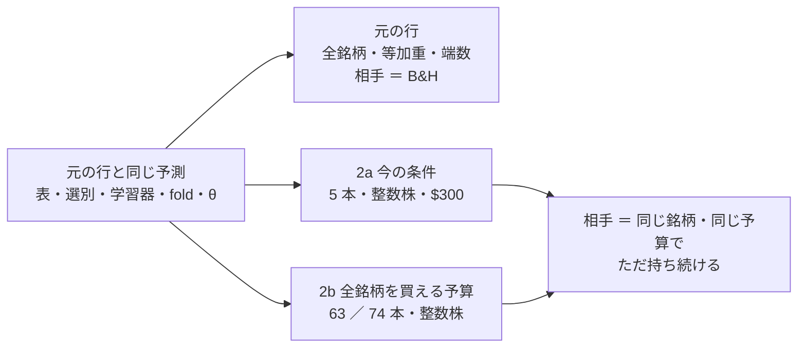
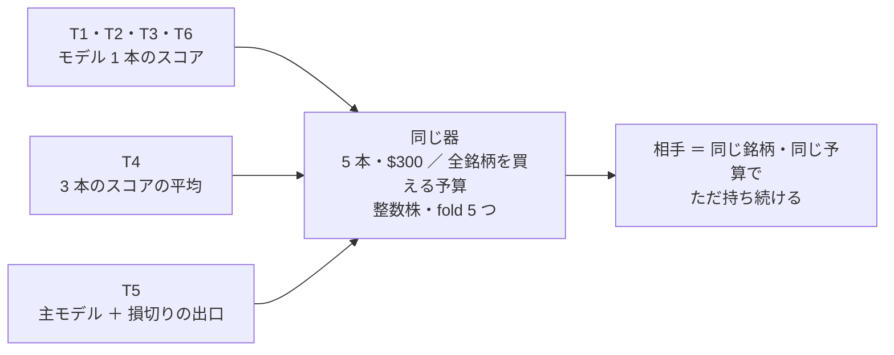

# トレーダーと同じ形で机上にかける（候補 3 本 × 条件 2）

作成 2026-10-01（titan の Claude）。プラン [best-model-trader.md](../../plans/archive/best-model-trader.md) §2 Step 2a・2b。規約（結果を見る前に固定）は [rules.md 20 章](feature-discovery/rules.md)（コミット `6bd2eee`）。

> ⚠ **これは投資助言ではなく調査資料である。** 数字はすべて【実測】（自前の机上の検証）。⚠ 多重検定は通していない（n_trials は §0〜§4 の時点で 751・§5 を足して 765）。

## 0. 何を確かめたか

利用者の指示（2026-09-29・09-30）: **「検証結果のうちで一番いい成績のものをベースにして新しいトレーダーを投入する」「予算を全銘柄を購入できる条件にしての検証もする」**。

検証結果一覧の上位 3 本（Step 1 の物差しで選んだ F1-7・F2-2・D2）は、63 ／ 74 銘柄・等加重・端数・予算なしで測った数字である。実際のトレーダーの形（決めた銘柄・整数株・予算）にしても上乗せが残るかを、同じ予測のまま売買の器だけ替えて測った。

この図の主張: 予測は元の行とまったく同じで、替えたのは売買の器と比べる相手だけ。



## 1. 回したもの

| 実行 | 中身 | 時間【実測】 |
| --- | --- | ---: |
| `2026-10-01T07-45-29_trader_trend_scales_1995_us74` | D2 中期ゲート（60日・学習）・θ 55・74 本の表 | 12.7 秒 |
| `2026-10-01T07-45-56_trader_sel_small4_1995` | F2-2 RFE ・ F1-7 IC の安定性・θ 50・63 本の表（1995 年から） | 22.9 秒 |
| 上の 2 本の leak 対照 | queue が足す | 14.9 ／ 29.0 秒 |

```bash
cd experiments/feature-discovery
.venv/bin/python -m cli.queue --config trader_shape      # 本番 2 ＋ leak 2（約 1 分半【実測】）
.venv/bin/python -m cli.report --catalog > ../../docs/specs/experiments/feature-discovery/ledger.md
```

- n_trials **745 → 751**（＋6 ＝ 3 本 × 条件 2。20-4 の 1 のとおり）
- ✅ 素の行（F1-7・F2-2 θ 50 ／ D2 θ 55）は 3 本とも「2 実行・一致」＝ 配線を壊していない
- ✅ leak 対照は 6 行とも跳ねた（純利 ＋7,299〜＋76,332bp）
- ✅ 変更の前に検証結果一覧を吐き直し、1 文字も変わらないことを確かめた（鍵の直し 20-4 の 2 で既存の行は割れない）

## 2. 結果

対「持ち続ける」の上乗せ（bp/fold。判定の量 ＝ 20-3 の 2）と、元の行（対 B&H）を並べる。

| 候補 | 元の行（対 B&H） | 2a 5 本・$300 | 2b 全銘柄を買える予算 |
| --- | --- | --- | --- |
| F1-7 IC の安定性（θ 50） | ＋728.46・3/5 ＋＋−−＋ | ＋500.36・3/5 −＋＋−＋ **保留** | ＋422.61・3/5 ＋＋−−＋ **保留** |
| F2-2 RFE（θ 50） | ＋578.12・3/5 ＋＋−−＋ | ＋718.44・3/5 −＋＋−＋ **保留** | ＋338.82・3/5 ＋＋−−＋ **保留** |
| D2 中期ゲート us74（θ 55） | ＋120.90・3/5 ＋−0＋＋ | −152.40・0/5 −−000 **落とす** | ＋34.78・2/5 ＋−0＋− **保留** |

- **採る 0 ／ 6**。保留 5・落とす 1
- 2b の上乗せは 3 本とも元の行より小さい（F1-7 は 58%・F2-2 は 59%・D2 は 29%）。fold の割れ方は元の行とほぼ同じ
- fold の期間（63 本の表）: 1 ＝ 2000-05〜2005-08（IT バブルの崩壊）／ 2 ＝ 2005-08〜2010-11（金融危機）／ 3 ＝ 2010-11〜2016-02 ／ 4 ＝ 2016-02〜2021-05 ／ 5 ＝ 2021-05〜2026-09

### 2-1. 予想（20-5）との突き合わせ

| 予想 | 結果 |
| --- | --- |
| 6 行とも「採る」にならない | ✅ |
| 2a は 3 本とも上乗せ ≤ 0 か fold が割れる | ✅（D2 は ≤ 0・F1-7 と F2-2 は 3/5） |
| 2b は元の行と同じ向きで、上乗せは小さく、fold は割れたまま | ✅ |

### 2-2. 診断（⚠ 採否に使わない。`trader.csv`・`checks.json` の `trader`）

| 見たこと | 数字【実測】 | 読み |
| --- | --- | --- |
| 上乗せの出どころ | F1-7・F2-2 は 2 つの条件とも、下げ相場の fold で勝ち、上げ相場の fold 4 で負ける（2a の fold 2: 持ち続ける −1,203bp に対し F2-2 ＋3,254bp ／ fold 4: 持ち続ける ＋3,962bp に対し ＋2,129bp） | 元の行と同じ型 ＝ 「下げの時期に降りている」。上げの時期には取り損ねる |
| 2a は高い株が買えない | fold 4・5 の買いの合図のほとんどが株価で見送り（F2-2 の fold 5: 合図 1,095 回のうち 1,072 回）。枠 $60 を NKE が超える期間 | 2a の数字は実質 4 本ぶん。⚠ 銘柄が少ないので 1〜2 本の運に支配される（20-5 の 1） |
| D2 は 5 本ではほぼ持ち続けるだけ | 2a の fold 3〜5 は持ち続けると 1 bp も違わない（買い% が θ 55 を下回らない） | 5 本の大型株では D2 の合図が出ない |
| 2b の予算（20-2） | 63 本: $8,235 ／ $14,627 ／ $13,317 ／ $33,629 ／ $80,661（fold 1〜5）。74 本: $8,989 ／ **$525,614** ／ $55,253 ／ $39,501 ／ $79,688 | ⚠ 調整済み終値の最高値 × 銘柄数（17-3 の 3）。74 本の fold 2 だけ額が大きく跳ねる（最高値の銘柄が 1 本だけ高い）。直近の fold 5 は プラン §1 の $73,041 に近い |
| 対 乱択（並べ替え） | F1-7・F2-2 は 2a・2b とも ＋1,569〜＋2,150bp（fold 4〜5/5 が正） | 合図の数が同じでも、出す時期を壊すと大きく負ける ＝ 時期に情報がある。⚠ ただし「持ち続ける」には勝ちきれない（下の §3） |
| 平均の投下率 | F1-7・F2-2: 2a 0.53 ／ 2b 0.65（持ち続ける 0.73 ／ 0.90） | 現金でいる時間が長い ＝ 上げの時期に取り損ねる原因 |

## 3. 読み方

- ⚠ **トレーダーの形にしても、上位 3 本は「採る」に届かない。** F1-7・F2-2 の上乗せは残るが、どの条件でも fold の符号が 3/5 で割れる。「採る」の一歩手前ではない（`ledger.md` §0）
- 上乗せは「下げ相場で降りる」から来ていて、上げ相場では持ち続けるに負ける。⚠ **26 年間のうち大きな下げが 2 回（2000〜2002 年・2008 年）ある期間で測った数字**で、次の数週間〜数か月に同じことが起きるかは分からない
- ⚠ **2a（今の条件）は銘柄が実質 4 本**で、NKE は枠 $60 を超える期間に買えない。数字は 1〜2 本の運に支配される
- ⚠ **2b の予算（$55,650〜$73,041。プラン §1）は口座（規模 A $1,000）の 55〜73 倍**で、机上の検証だけに使う
- 学び直しは fold ごと（約 5 年に 1 回）。実売買の毎日の学び直しは再現していない（20-1 の 1）

## 4. この先（Step 3。⚠ 利用者の決定）

物差し（20-3 の 2）では採るものが無い。Step 3「残ったものを候補の人にする」の「残ったもの」をどう読むかは利用者が決める:

| 案 | 中身 |
| --- | --- |
| (a) 候補の人を作らない | 採る 0 なので Step 3 は空。子タスクは「投入する候補が無い」で閉じる |
| (b) 保留の F2-2（2a の上乗せが最大）か F1-7 を候補の人にする | `candidates/` に置き sim で配線だけ通す（成績は測らない ＝ T4・T5 と同じ扱い）。⚠ 先に `cli.predict` が 1995 年からの表の選別を `data-live/`（2018 年からの写し）で出せるかを確かめる（プラン Step 1 の決まり 6 の印） |

✅ **2026-10-01 利用者決定「(b) で進めて」** → F2-2 RFE を候補の人 `T6` にして sim6 で配線を通した（[プラン](../../plans/archive/best-model-trader.md) Step 3・[live-trading.md](live-trading.md) §0-1・§0-7 (k)）。⚠ 今の時期の F2-2 は毎日「全部買う」＝ T6 は持ち続けるだけの人になった。

## 5. いまの 3 人と候補の 3 人（`T1`〜`T6`）を同じ形で並べる（2026-10-02）

利用者の指摘（2026-09-26）「モデルの検証はトレーダー込みで確認しないと意味がないのではないか」と、指示（2026-10-01）**「新しく作られたT4移行とT1-T3も比較したい」**。規約は [rules.md 20-6](feature-discovery/rules.md)（⚠ 結果を見る前に固定 ＝ コミット `0e675c3`。`T4` のための合わせる口のコードは `ca639fc`）。プランは [trader-shape-live-three.md](../../plans/archive/trader-shape-live-three.md)。

> ⚠ **順位で人を採らない・外さない。** この結果で実売買の 3 人を止めない・替えない・候補を本番に入れると決めない（20-6 の 3）。数字はすべて【実測】・多重検定は通していない（n_trials 765）。

この図の主張: 6 人とも同じ器（同じ 5 本・同じ予算・相手は「持ち続ける」）に通した。違うのは、スコアの作り方（1 本 ／ 3 本の平均 ／ 損切りつき）だけ。



### 5-1. 回したもの

| 人 | 机上の形 | 実行 |
| --- | --- | --- |
| `T1`（アキ） | `trade_own_ridge_a` の「全部使う（基準）」θ 50 | `2026-10-02T00-01-13_trader_trade_own_ridge_a` |
| `T2`（アリス） | `trade_ownex_lgbm_a` の「全部使う（基準）」θ 55・会社の 48 本 | `2026-10-02T00-01-59_trader_trade_ownex_lgbm_a` |
| `T3`（カエデ） | `trade_ownseq_ridge_a` の「T3 QUANT（60日窓）」θ 50 | `2026-10-02T00-02-31_trader_trade_ownseq_ridge_a` |
| `T4`（ハル） | `M1 3本の平均` ＝ `T1`・`T2`・`T3` のモデルの買い% ／ 出口% を行ごとに平均（合わせる口 `[[trading.mix]]`）θ 50・会社の 48 本 | `2026-10-02T00-07-32_trader_mix_t4` |
| `T5`（ミオ） | 対の検知器「L1 高値20日から−10%で降りる」θ 50（入口 ＝ own 35 列 × Ridge・出口 ＝ max） | `2026-10-02T00-01-43_trader_trade_own_stop_ridge_a` |
| `T6`（ソラ）(b) | F2-2 RFE・θ 50 を **2018 年からの表**（`own_2018`）で ＝ 本番の日足に入れたときの形 | `2026-10-02T00-01-29_trader_sel_small4_2018` |
| `T6` (a) | F2-2 RFE・θ 50 を 1995 年からの表で（§2 の行。回し直していない） | `2026-10-01T07-45-56_trader_sel_small4_1995` |

```bash
cd experiments/feature-discovery                          # titan
.venv/bin/python -m cli.queue --config trader_shape_people   # 本番 5 ＋ leak 5（1 分 57 秒【実測】）
.venv/bin/python -m cli.queue --config trader_shape_mix      # T4: 本番 20 秒 ＋ leak 31 秒【実測】
.venv/bin/python -m cli.report --catalog > ../../docs/specs/experiments/feature-discovery/ledger.md
```

- n_trials **751 → 765**（＋14 ＝ 20-6 の 2 のとおり: 条件 2 × 6 人 ＋ `T4` の素の行 ＋ `T6` (b) の素の行）
- ✅ 素の行は既存の行にまとまった（再現の検算）: `T1` 6 実行・一致 ／ `T3` 5 実行・一致 ／ `T5` の L1 2 実行・一致 ／ `T2` の LightGBM は 6 実行・幅 123.40bp（幅は前と同じ ＝ 既知のばらつきの内）
- ✅ leak 対照は 6 本とも跳ねた（2a ＋12,541〜＋13,061 ／ 2b ＋18,719〜＋20,826bp/fold・fold 5/5）
- ✅ 変更の前後で検証結果一覧の既存の行は消えていない。手法の行で変わったのは「N 実行」の数と代表の実行名だけ。⚠ 基準線「常に上」「直前リターンの符号」の表示の値が変わった（＋1671.42 → ＋1657.02 など）のは、同じ識別項目に尻の短い表の実行が混ざる既知の「幅 14.40bp」（[forward10-target.md](forward10-target.md) §5）で、代表が今日の実行に替わっただけ
- ✅ `T4` の合成で欠けた行は 5 fold とも 0（3 本とも同じ日付の切れ目・会社の 48 本の全行にスコアがある）
- fold の期間（2018 年からの表）: 1 ＝ 2019-07-09〜2020-12-09 ／ 2 ＝ 〜2022-05-17 ／ 3 ＝ 〜2023-10-20 ／ 4 ＝ 〜2025-03-31 ／ 5 ＝ 〜2026-09-04

### 5-2. 結果（bp/fold。上乗せ ＝ 純利 − 同じ条件の「持ち続ける」）

**2a 今の条件（5 本・$300）**

| 人 | 純利 | 持ち続ける | 上乗せ | fold の符号 | 判定 |
| --- | ---: | ---: | ---: | --- | --- |
| `T1` | ＋208.74 | −69.81 | ＋278.55 | 3/5 −＋＋−＋ | 保留 |
| `T2` | ＋364.54 | −75.16 | ＋439.70 | 2/5 0−＋−＋ | 保留 |
| `T3` | ＋447.09 | −69.81 | ＋516.90 | 2/5 0＋＋00 | 保留 |
| `T4` | ＋349.91 | −75.16 | ＋425.06 | 2/5 0−＋−＋ | 保留 |
| `T5` | ＋146.39 | −17.24 | ＋163.63 | 3/5 ＋−＋−＋ | 保留 |
| `T6` (b) 2018 年から | ＋273.30 | −69.81 | ＋343.11 | 2/5 −−＋−＋ | 保留 |
| `T6` (a) 1995 年から（⚠ 別の表・別の期間） | — | — | ＋718.44 | 3/5 −＋＋−＋ | 保留 |

**2b 全銘柄を買える予算**（63 本。`T2`・`T4` は会社の 48 本）

| 人 | 純利 | 持ち続ける | 上乗せ | fold の符号 | 判定 |
| --- | ---: | ---: | ---: | --- | --- |
| `T1` | ＋1,282.43 | ＋1,501.59 | −219.16 | 2/5 −＋−−＋ | 落とす |
| `T2` | ＋1,531.97 | ＋1,523.25 | ＋8.71 | 2/5 0−−＋＋ | 保留 |
| `T3` | ＋1,573.12 | ＋1,501.59 | ＋71.53 | 2/5 ＋＋−−0 | 保留 |
| `T4` | ＋1,612.32 | ＋1,523.25 | ＋89.07 | 3/5 −＋−＋＋ | 保留 |
| `T5` | ＋1,130.09 | ＋1,500.51 | −370.42 | 1/5 −＋−−− | 落とす |
| `T6` (b) 2018 年から | ＋1,307.96 | ＋1,501.59 | −193.62 | 2/5 −＋−−＋ | 落とす |
| `T6` (a) 1995 年から（⚠ 別の表・別の期間） | — | — | ＋338.82 | 3/5 ＋＋−−＋ | 保留 |

**元の行**（全銘柄・等加重・端数・予算なし。相手は B&H）

| 人 | 上乗せ | fold の符号 | 判定 |
| --- | ---: | --- | --- |
| `T1` | −270.89 | 2/5 | 落とす |
| `T2` | ＋48.72 | 2/5 | 保留 |
| `T3` | ＋61.92 | 2/5 | 保留 |
| `T4`（⚠ 今日の新しい行） | ＋122.78 | 3/5 −＋−＋＋ | 保留 |
| `T5` | −460.05 | 0/5 | 落とす |
| `T6` (b)（⚠ 今日の新しい行） | −240.97 | 2/5 −＋−−＋ | 落とす |
| `T6` (a) | ＋578.12 | 3/5 | 保留 |

- **採る 0 ／ 14**。保留 10・落とす 4（新しい 14 行: 条件 2 × 6 人 ＋ `T4`・`T6` (b) の素の行）
- 2b の予算: 63 本 $33,629 ／ $43,367 ／ $38,848 ／ $67,842 ／ $80,661（fold 1〜5）・48 本 $25,622 ／ $33,042 ／ $29,599 ／ $51,689 ／ $61,456

### 5-3. 予想（20-6）との突き合わせ

| 予想 | 結果 |
| --- | --- |
| 14 行とも「採る」にならない | ✅ |
| `T1`・`T3` は 2a・2b とも fold が割れる（保留か落とす） | ✅ |
| `T2` は落とす寄り | ❌ 2a ＋440・2b ＋9 でどちらも保留（fold 2/5） |
| `T4` の上乗せは `T1`〜`T3` のあいだに入る | △ 2a は入った（＋279 ／ ＋440 ／ ＋517 に対し ＋425）。2b は 3 本のどれよりも上（＋89）。素の行も 3 本より上（＋123） |
| `T5` は落とす | △ 2b と素の行は落とす。2a は保留（＋164・3/5） |
| `T6` (b) は (a) より小さく、fold は割れる | ✅ 2a ＋343 ＜ ＋718・2b −194 ＜ ＋339 |
| 2a は NKE が枠 $60 を超える期間に買えず実質 4 本 | ✅ NKE の終値は fold 1〜4 の全部の日で $60 を超え（$63〜$178）、fold 5 は 54% の日で超えた【実測。研究用の日足】。買った銘柄は fold 1・2・4 で最大 4 種類・fold 5 で 5 種類（株価で見送り: `T1` は 353 ／ 343 ／ 188 回）。fold 3 はほとんど買っていない（§5-4） |

### 5-4. 診断（⚠ 採否に使わない。`trader.csv`・`checks.json` の `trader`）

| 見たこと | 数字【実測】 | 読み |
| --- | --- | --- |
| ⚠ **2a の上乗せは fold 3 の 1 つから来ている** | fold 3（2022-05〜2023-10）の「持ち続ける」は −2,286〜−2,378bp。6 人とも投下率 0〜0.6%（`T2`・`T3`・`T4` は買い 0 回）＝ ほぼ全期間を現金で過ごした。fold ごとの上乗せ: `T1` −632 ／ ＋116 ／ **＋2,524** ／ −1,143 ／ ＋528・`T2` 0 ／ −132 ／ **＋2,286** ／ −393 ／ ＋438・`T3` 0 ／ ＋206 ／ **＋2,378** ／ 0 ／ 0・`T4` 0 ／ −119 ／ **＋2,286** ／ −110 ／ ＋69・`T5` ＋64 ／ −150 ／ **＋2,306** ／ −1,480 ／ ＋78・`T6` (b) −1,137 ／ −182 ／ **＋2,595** ／ −165 ／ ＋605 | 「5 本が 2 割強下がった 1 年 5 か月に、たまたま休んでいた」ぶん。fold 3 を除く 4 fold の上乗せの平均は `T3` だけ正（＋52）で、ほかは負（`T1` −283 ／ `T2` −22 ／ `T4` −40 ／ `T5` −372 ／ `T6` (b) −220）【計算】 |
| `T3` は 2a でほとんど「持ち続ける」と同じ | fold 1・4・5 は「持ち続ける」と 1bp も違わない（初日に買って売らない） | 5 本では合図が動かない期間が長い（元の行の「全部持つ か 全部休む」と同じ型 ＝ `ledger.md` の T3 の注） |
| 2b では同じ fold 3 が逆に効く | 全銘柄の「持ち続ける」は fold 3 で ＋243（63 本）／ ＋588（48 本）。休んだ人はそのぶん負ける | 5 本（安い株）と全銘柄で fold 3 の向きが逆 ＝ 2a の勝ちは銘柄の運（20-5 の 1） |
| `T5` は 2b と素の行で負ける | 素の行 0/5・2b 1/5（上乗せ −370） | 損切りを足すと悪化する（[stoploss-as-model.md](stoploss-as-model.md) と同じ向き）。⚠ 机上の `T5` には「売った翌日に買い戻す」動きは入っていない（20-6 の 3 の 4） |
| `T4`（平均）は 3 本より fold が割れにくい | 2b 3/5・素の行 3/5（3 本は 2/5） | ⚠ それでも保留（上乗せ ＋89 ／ ＋123・t 0.48 ／ 0.87 ＝ たまたまと区別がつかない大きさ） |
| 対 乱択（並べ替え） | 2a: ＋92 ／ ＋91 ／ ＋82 ／ ＋29 ／ −49 ／ ＋12（`T1`〜`T6` (b)）・2b: ＋75 ／ ＋392 ／ ＋148 ／ ＋323 ／ ＋145 ／ ＋22 | 合図の時期を壊しても差は小さい（候補 3 本の 1995 年からの表の ＋1,569〜＋2,150 とは桁が違う）＝ 2018 年からの期間では時期の情報が薄い |
| 揃っていないもの（20-6 の 3 の 3） | `T2`・`T4` の全銘柄は 48 本（「持ち続ける」は ＋1,523 ／ ほかは ＋1,502）／ `T5` の表は尻が短く切れ目が数日早い（評価 1,793 日 ／ ほかは 1,801 日・2a の「持ち続ける」−17 ／ ほかは −70〜−75）／ `T6` (a) は別の表・別の期間 | 人どうしの差が 5〜50bp のところは、表の違いと区別がつかない |

### 5-5. 読み方

- ⚠ **6 人とも「採る」に届かない。** 今の条件（2a）では 6 人とも上乗せが正だが、fold の符号は 2/5〜3/5 で割れ、正のほとんどは 1 つの fold（全員がほぼ現金だった時期に 5 本が大きく下がった）から来ている
- 全銘柄を買える予算（2b）では、`T1`・`T5`・`T6` (b) が「持ち続ける」に負け、`T2`・`T3`・`T4` はほぼ同じ（＋9〜＋89）
- `T6`（ソラ）: 1995 年から学ぶ形の上乗せ（＋718 ／ ＋339）は、**2018 年からの表では ＋343 ／ −194** になる。本番の日足は 2018 年からなので、本番に入れた `T6` は (b) の形 ＝ `T1` と同じくらい
- `T4`（ハル）: 3 本の平均は、3 本それぞれより fold が割れにくかった。⚠ ただし差は小さく（t 1 未満）、14 行の中でいちばん良く見えた行を拾っているぶんの上振れを含む
- ⚠ **机上で再現していないもの**: 毎日の学び直し（机上は約 1 年 5 か月ごと）・15:50 ET の途中の足・気配と約定の差・実売買の日足。実売買の記録（[live-trading.md](live-trading.md) §1）と突き合わせるときは、この違いを先に引く
- ⚠ この結果で実売買の 3 人を止めない・替えない・候補を本番に入れると決めない（続ける・止める・入れるは利用者 ＝ 20 営業日の判定）

