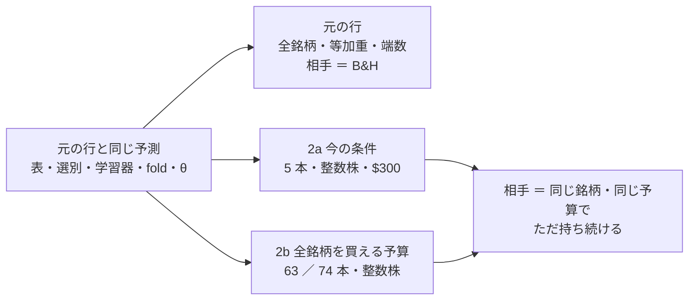

# トレーダーと同じ形で机上にかける（候補 3 本 × 条件 2）

作成 2026-10-01（titan の Claude）。プラン [best-model-trader.md](../../plans/best-model-trader.md) §2 Step 2a・2b。規約（結果を見る前に固定）は [rules.md 20 章](feature-discovery/rules.md)（コミット `6bd2eee`）。

> ⚠ **これは投資助言ではなく調査資料である。** 数字はすべて【実測】（自前の机上の検証）。⚠ 多重検定は通していない（n_trials 751）。

## 0. 何を確かめたか

利用者の指示（2026-09-29・09-30）: **「検証結果のうちで一番いい成績のものをベースにして新しいトレーダーを投入する」「予算を全銘柄を購入できる条件にしての検証もする」**。

検証結果一覧の上位 3 本（Step 1 の物差しで選んだ F1-7・F2-2・D2）は、63 ／ 74 銘柄・等加重・端数・予算なしで測った数字である。実際のトレーダーの形（決めた銘柄・整数株・予算）にしても上乗せが残るかを、同じ予測のまま売買の器だけ替えて測った。

この図の主張: 予測は元の行とまったく同じで、替えたのは売買の器と比べる相手だけ。



## 1. 回したもの

| 実行 | 中身 | 時間【実測】 |
| --- | --- | ---: |
| `2026-10-01T07-45-29_trader_trend_scales_1995_us74` | D2 中期ゲート（60日・学習）・θ 55・74 本の表 | 12.7 秒 |
| `2026-10-01T07-45-56_trader_sel_small4_1995` | F2-2 RFE ・ F1-7 IC の安定性・θ 50・63 本の表（1995 年から） | 22.9 秒 |
| 上の 2 本の leak 対照 | queue が足す | 14.9 ／ 29.0 秒 |

```bash
cd experiments/feature-discovery
.venv/bin/python -m cli.queue --config trader_shape      # 本番 2 ＋ leak 2（約 1 分半【実測】）
.venv/bin/python -m cli.report --catalog > ../../docs/specs/experiments/feature-discovery/ledger.md
```

- n_trials **745 → 751**（＋6 ＝ 3 本 × 条件 2。20-4 の 1 のとおり）
- ✅ 素の行（F1-7・F2-2 θ 50 ／ D2 θ 55）は 3 本とも「2 実行・一致」＝ 配線を壊していない
- ✅ leak 対照は 6 行とも跳ねた（純利 ＋7,299〜＋76,332bp）
- ✅ 変更の前に検証結果一覧を吐き直し、1 文字も変わらないことを確かめた（鍵の直し 20-4 の 2 で既存の行は割れない）

## 2. 結果

対「持ち続ける」の上乗せ（bp/fold。判定の量 ＝ 20-3 の 2）と、元の行（対 B&H）を並べる。

| 候補 | 元の行（対 B&H） | 2a 5 本・$300 | 2b 全銘柄を買える予算 |
| --- | --- | --- | --- |
| F1-7 IC の安定性（θ 50） | ＋728.46・3/5 ＋＋−−＋ | ＋500.36・3/5 −＋＋−＋ **保留** | ＋422.61・3/5 ＋＋−−＋ **保留** |
| F2-2 RFE（θ 50） | ＋578.12・3/5 ＋＋−−＋ | ＋718.44・3/5 −＋＋−＋ **保留** | ＋338.82・3/5 ＋＋−−＋ **保留** |
| D2 中期ゲート us74（θ 55） | ＋120.90・3/5 ＋−0＋＋ | −152.40・0/5 −−000 **落とす** | ＋34.78・2/5 ＋−0＋− **保留** |

- **採る 0 ／ 6**。保留 5・落とす 1
- 2b の上乗せは 3 本とも元の行より小さい（F1-7 は 58%・F2-2 は 59%・D2 は 29%）。fold の割れ方は元の行とほぼ同じ
- fold の期間（63 本の表）: 1 ＝ 2000-05〜2005-08（IT バブルの崩壊）／ 2 ＝ 2005-08〜2010-11（金融危機）／ 3 ＝ 2010-11〜2016-02 ／ 4 ＝ 2016-02〜2021-05 ／ 5 ＝ 2021-05〜2026-09

### 2-1. 予想（20-5）との突き合わせ

| 予想 | 結果 |
| --- | --- |
| 6 行とも「採る」にならない | ✅ |
| 2a は 3 本とも上乗せ ≤ 0 か fold が割れる | ✅（D2 は ≤ 0・F1-7 と F2-2 は 3/5） |
| 2b は元の行と同じ向きで、上乗せは小さく、fold は割れたまま | ✅ |

### 2-2. 診断（⚠ 採否に使わない。`trader.csv`・`checks.json` の `trader`）

| 見たこと | 数字【実測】 | 読み |
| --- | --- | --- |
| 上乗せの出どころ | F1-7・F2-2 は 2 つの条件とも、下げ相場の fold で勝ち、上げ相場の fold 4 で負ける（2a の fold 2: 持ち続ける −1,203bp に対し F2-2 ＋3,254bp ／ fold 4: 持ち続ける ＋3,962bp に対し ＋2,129bp） | 元の行と同じ型 ＝ 「下げの時期に降りている」。上げの時期には取り損ねる |
| 2a は高い株が買えない | fold 4・5 の買いの合図のほとんどが株価で見送り（F2-2 の fold 5: 合図 1,095 回のうち 1,072 回）。枠 $60 を NKE が超える期間 | 2a の数字は実質 4 本ぶん。⚠ 銘柄が少ないので 1〜2 本の運に支配される（20-5 の 1） |
| D2 は 5 本ではほぼ持ち続けるだけ | 2a の fold 3〜5 は持ち続けると 1 bp も違わない（買い% が θ 55 を下回らない） | 5 本の大型株では D2 の合図が出ない |
| 2b の予算（20-2） | 63 本: $8,235 ／ $14,627 ／ $13,317 ／ $33,629 ／ $80,661（fold 1〜5）。74 本: $8,989 ／ **$525,614** ／ $55,253 ／ $39,501 ／ $79,688 | ⚠ 調整済み終値の最高値 × 銘柄数（17-3 の 3）。74 本の fold 2 だけ額が大きく跳ねる（最高値の銘柄が 1 本だけ高い）。直近の fold 5 は プラン §1 の $73,041 に近い |
| 対 乱択（並べ替え） | F1-7・F2-2 は 2a・2b とも ＋1,569〜＋2,150bp（fold 4〜5/5 が正） | 合図の数が同じでも、出す時期を壊すと大きく負ける ＝ 時期に情報がある。⚠ ただし「持ち続ける」には勝ちきれない（下の §3） |
| 平均の投下率 | F1-7・F2-2: 2a 0.53 ／ 2b 0.65（持ち続ける 0.73 ／ 0.90） | 現金でいる時間が長い ＝ 上げの時期に取り損ねる原因 |

## 3. 読み方

- ⚠ **トレーダーの形にしても、上位 3 本は「採る」に届かない。** F1-7・F2-2 の上乗せは残るが、どの条件でも fold の符号が 3/5 で割れる。「採る」の一歩手前ではない（`ledger.md` §0）
- 上乗せは「下げ相場で降りる」から来ていて、上げ相場では持ち続けるに負ける。⚠ **26 年間のうち大きな下げが 2 回（2000〜2002 年・2008 年）ある期間で測った数字**で、次の数週間〜数か月に同じことが起きるかは分からない
- ⚠ **2a（今の条件）は銘柄が実質 4 本**で、NKE は枠 $60 を超える期間に買えない。数字は 1〜2 本の運に支配される
- ⚠ **2b の予算（$55,650〜$73,041。プラン §1）は口座（規模 A $1,000）の 55〜73 倍**で、机上の検証だけに使う
- 学び直しは fold ごと（約 5 年に 1 回）。実売買の毎日の学び直しは再現していない（20-1 の 1）

## 4. この先（Step 3。⚠ 利用者の決定）

物差し（20-3 の 2）では採るものが無い。Step 3「残ったものを候補の人にする」の「残ったもの」をどう読むかは利用者が決める:

| 案 | 中身 |
| --- | --- |
| (a) 候補の人を作らない | 採る 0 なので Step 3 は空。子タスクは「投入する候補が無い」で閉じる |
| (b) 保留の F2-2（2a の上乗せが最大）か F1-7 を候補の人にする | `candidates/` に置き sim で配線だけ通す（成績は測らない ＝ T4・T5 と同じ扱い）。⚠ 先に `cli.predict` が 1995 年からの表の選別を `data-live/`（2018 年からの写し）で出せるかを確かめる（プラン Step 1 の決まり 6 の印） |
