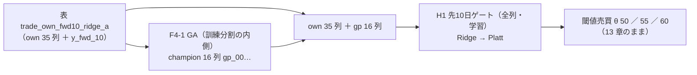
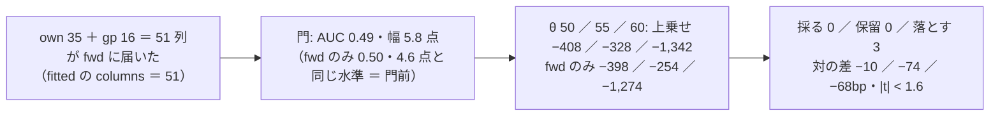

# 変換を検知器に通す口 — GA × 先 10 日の門（机上）

2026-10-09。利用者の問い（2026-09-16）「遺伝的アルゴリズムは既存のモデル全てに当てはめることはできる？」の残り ＝ ⚠ **検知器 23 本には届かなかった**（[evolutionary-search.md §8](evolutionary-search.md)）を、汎用の口で埋める。利用者決定 2026-10-09 ＝ **A（汎用の口）**「検証の幅が広がる汎用的な方」。規約は [rules.md 24 章](feature-discovery/rules.md)、プランは [transform-into-detectors.md](../../plans/transform-into-detectors.md)。
⚠ **これは投資助言ではなく調査資料である。** ⚠ 数字は【実測】（自前の机上の検証）。⚠ **この結果で実売買の人を替えない**。

## 0. 回す前に決めたこと（⚠ この節は結果を見る前に書いた）

> この図の主張: 変わるのは「検知器の説明変数に GA の列 16 本が足される」ことだけで、検知器・学習器・較正・θ・fold・表は `fwd` × Ridge と同じ。

| 項目 | 中身 |
| --- | --- |
| 口 | `prep.augment`（rules.md 24-1）。訓練分割で標準化 → GA（y ＝ 1 日の `y`・日付は訓練）→ 返った `gp_00`〜`gp_15` を `tr`・`te` に**足す** → `fwd` が `feats` の全列（35 ＋ 16）を説明変数にする |
| config | `trade_own_fwd10_gp_ridge_a`（`trade_own_fwd10_ridge_a` と `name` ／ `transform` 以外は 1 文字も違わない）。queue `transform_detector` |
| 表 | `features_from = "trade_own_fwd10_ridge_a"`（作り直さない。13-8） |
| GA の水準 | `trade_own_gp_a` と同じ（`evolve.DEFAULTS`。個体 100 ／ 世代 20 ／ k 16 ／ 適合度 pooled ／ 種 0） |
| θ | 50 ／ 55 ／ 60 |
| 数 | ⚠ **＋3（n_trials 798 → 801）**・leak 対照 1 本（数えない） |
| 手法名 ／ 鍵 ／ 予測モデル名 | `F4-1 記号回帰（遺伝的プログラミング） ＋ H1 先10日ゲート（全列・学習）` ／ `F4-1 ＋ H1 先10日ゲート（全列・学習）` ／ `own.f4-1-h1-gate10.ridge.shared`（rules.md 24-2） |
| 対の相手（変換なし） | 既存の実行 `2026-09-27T14-21-10_trade_own_fwd10_ridge_a`（[forward10-target.md §2-1](forward10-target.md)。回し直さない）。GA × Ridge の全部使う `2026-09-16` の行（[evolutionary-search.md §8-2](evolutionary-search.md)）も並べる |
| ⚠ Phase 3 | 残り 5 変換（tsfresh・多項式・PCA・行列プロファイル・ウェーブレット）× `fwd` は **この結果を見てから水準を選ばない**（6 本全部か回さないか。利用者の了承が要る） |

物差し（回す前に書いた）: ① 判定は 13-7 のまま（対 B&H 上乗せの符号・fold の符号）／ ② 対の差（GA あり − `fwd` のみ。bp/fold）と t ／ ③ 保有日率と取引回数の変化（列が 35 → 51 に増えた影響）。

予想【推測】（rules.md 24-3）: 3 行とも「採る」にならない（`fwd` × Ridge は −254〜−1,274bp/fold で 3 行とも落とす・GA × Ridge も 3 行とも落とす）。対の差は §8-3 と同じく向きが揃わない・誤差の中。列が増えるぶん Ridge の過学習が増え、θ 60 の保有日率はさらに落ちうる。leak は跳ねる（`LEAK_fwd_10` は `fwd` に直接届く ＝ 変換の有無によらず）。

## 1. 結果【実測 2026-10-09・titan】（⚠ ここから下は結果を見て書いた）

**答え: GA の列を先 10 日の門に足しても、3 行とも落とす。** 上乗せは −408 ／ −328 ／ −1,342bp/fold（`fwd` のみ −398 ／ −254 ／ −1,274 とほぼ同じ）。対の差（GA あり − `fwd` のみ）は 3 θ とも負で \|t\| < 1.6 ＝ 誤差の中。⚠ **列を 35 → 51 に増やしても検知器の出力はほとんど動かない**（的中率 0.5185 対 0.5182・IC −0.0033 対 −0.0026）。n_trials 798 → **801**。

> この図の主張: 変換の列は届いたが（説明変数 51 本・式は訓練の内側で選ばれた）、門も検証も `fwd` のみと同じ答えを出した。

### 1-0. ⚠ 1 回目の実行は口の穴で leak と同じ値になった（回し直した）

| 実行 | 何が起きたか | 処置 |
| --- | --- | --- |
| `2026-10-09T11-27-40_trade_own_fwd10_gp_ridge_a`（＋ `11-27-53_…_leak`） | 上乗せ **＋7,196bp・t 12.6・5/5 fold・DSR 1.0**（leak 対照と同じ値）。原因: 本物の表の `feats` は `META_COLUMNS` だけを外すので **学習の対象 `y_fwd_10` が残っている**（検知器 `fwd` が自分で接頭辞を外す前提）。口はそれをそのまま GA に渡し、8 本の式のうち 6 本に `y_fwd_10` が入った。⚠ テストの表は `contracts.feature_columns` で meta を外していたので見えなかった。⚠ `k = 16` の書き忘れもあった（champion が 8 本） | `prep.augment` の入力を `contracts.is_meta` で外す（rules.md 24-1 の 2）・config に `k = 16`・テスト `test_the_label_never_reaches_the_transform`（`cli/run.py` と同じ作り方の `feats` で式に `y_fwd_` が出ないこと。meta を外さないと落ちることを確かめた）→ `cli.queue --restart` |
| `2026-10-09T11-31-10_trade_own_fwd10_gp_ridge_a`（＋ `11-31-24_…_leak`） | **この節の結果** | — |

⚠ **1 回目の実行は DB に残る**（閉じた実行は消せない・1 実行 1 記録）。検証結果一覧では同じ識別項目の 2 実行としてまとまり、代表は新しい方で、「再現」の列に **⚠ 2 実行・幅 7,536〜8,560bp** の印が付く ＝ **この幅は再現の失敗ではなく、1 回目が配線の穴だったことの跡**。n_trials は識別項目の数なので 1 回目を入れても ＋3 のまま。

### 1-1. 判定（13-7。B&H ＋1,666.42bp/fold ＝ `fwd` の 3 表と同じ値で一致）

| θ | 純利bp/fold | 上乗せ | t | fold の符号 | 取引/fold | 保有日率 | 対 乱択 | DSR | 判定 |
| ---: | ---: | ---: | ---: | :-: | ---: | ---: | ---: | ---: | --- |
| 50 | ＋1,258.21 | **−408.21** | −1.55 | 2/5 −＋−＋− | 502.0 | 0.819 | −266 | 0.057 | 落とす |
| 55 | ＋1,338.50 | **−327.92** | −1.31 | 1/5 −−−−＋ | 88.2 | 0.749 | −108 | 0.084 | 落とす |
| 60 | ＋324.00 | **−1,342.42** | −4.95 | 0/5 −−−−− | 50.4 | 0.383 | −317 | 0.004 | 落とす |

門（診断・門前でも回す）: AUC 0.4896（fold 0.450 ／ 0.506 ／ 0.504 ／ 0.484 ／ 0.490）・買い% の幅 5.8 点 ＝ 通らない（`fwd` のみも通らなかった）。⚠ DSR は SR > 0 の検定で、採否に使わない。

### 1-2. 対の差（GA あり − `fwd` のみ。同じ表・同じ fold・同じ θ ＝ 違いは説明変数に gp 16 列が足されたことだけ）

| θ | `fwd` のみ | GA ＋ `fwd` | 差 | t | fold ごとの差 | 本数 |
| ---: | ---: | ---: | ---: | ---: | --- | --- |
| 50 | ＋1,268.65 | ＋1,258.21 | **−10.45** | −0.92 | −53 ／ ＋8 ／ −2 ／ −13 ／ ＋8 | 35 → 51 |
| 55 | ＋1,412.92 | ＋1,338.50 | **−74.42** | −1.52 | ＋16 ／ 0 ／ −148 ／ −9 ／ −231 | 〃 |
| 60 | ＋392.46 | ＋324.00 | **−68.46** | −1.12 | −51 ／ ＋17 ／ ＋18 ／ −20 ／ −307 | 〃 |

⚠ **3 θ とも負だが誤差の中**（fold の符号は 2〜3/5）。§8-3（GA × LightGBM ／ MLP。±30〜390bp・向きが揃わない）と同じ読み。⚠ **予想「θ 60 の保有日率はさらに落ちる」は外れ**（0.386 → 0.383 で変わらない）＝ Ridge は足された 16 列にほとんど重みを置かなかった【推測。係数は見ていない】。参考: GA × Ridge の全部使う（`own_2018`・1 日の y を学ぶ形）は −219 ／ −384 ／ −699bp（[evolutionary-search.md §8-2](evolutionary-search.md)）。

### 1-3. GA の探索（訓練分割の内側・適合度は 1 日の `y`）

| fold | 世代 | 止めた理由 | 秒 | 最良の適合度 | champion | `own_dow` を含む式 |
| ---: | ---: | --- | ---: | ---: | ---: | ---: |
| 1 | 18 | 改善が止まった | 0.2 | 0.2835 | 16 | 15/16 |
| 2 | 8 | 改善が止まった | 0.2 | 0.1303 | 16 | 4/16 |
| 3 | 20 | 世代の上限 | 0.8 | 0.1849 | 16 | 16/16 |
| 4 | 20 | 世代の上限 | 1.0 | 0.1494 | 15 | 13/15 |
| 5 | 7 | 改善が止まった | 0.5 | 0.0625 | 16 | 0/16 |

⚠ **式と適合度の SHA-256 は `2f11303c…` で、GA × Ridge（`own_2018`）の `b090ba7d…` と違う** ＝ 表の尻が 10 本短く（`y_fwd_10` のぶん）fold の切れ目と訓練の行が違うので、探索の答えも違う（⚠ 同じ表なら同じ答えになる ＝ §8-1）。⚠ **曜日（`own_dow`）は今回も 4 fold で champion の大半に入った**（[§9](evolutionary-search.md) と同じ癖。pooled の適合度のまま）。

### 1-4. 検算

| # | 見たもの | 結果 |
| ---: | --- | --- |
| 1 | ⚠ **leak 対照** | ✅ **跳ねた**（＋7,195〜7,205bp・t 12.6・5/5・的中率 0.6012）。⚠ `fwd` のみの leak 対照（2026-09-27）と**同じ値** ＝ `LEAK_fwd_10` は検知器に直接届くので変換の有無で変わらない。口の側の leak 検査は「式の材料に `LEAK_` が出る」こと（`tests/test_transform_detector.py`）。⚠ 検証結果一覧の「先読みの列を拾わなかった」の印は 的中率 < 0.9 の機械的な判定で、10 日のラベルを 1 日の的中率で見るとそうなる（fwd の 3 表とも 0.60。2026-09-27 と同じ） |
| 2 | 指紋 | ✅ `tests/test_trading_run.py::test_default_path_fingerprint_is_unchanged`・`tests/test_predict.py`（10 件）・`fwd` の指紋 `tests/fixtures/fwd_fingerprint.json` ＝ **`transform` の無い config は 1 ビットも変わらない** |
| 3 | `n_trials` | ✅ **798 → 801**（事前登録どおり ＋3）。落とす 662 → 665・保留 136 のまま。leak 対照は数えない |
| 4 | 識別項目 | ✅ 鍵 `F4-1 ＋ H1 先10日ゲート（全列・学習）`（既存の GA × Ridge の行 `F4-1` と割れている）・予測モデル名 `own.f4-1-h1-gate10.ridge.shared`・系統 F4 生成型 |
| 5 | 既存の行 | ✅ 数字が変わった手法の行 0・消えた行 0（`git diff` は頭の数・足した 3 行・基準線の代表の実行〔表の尻が違う ＝ howto 1-6 の注記どおり〕・leak の節だけ） |
| 6 | B&H | ✅ ＋1,666.42bp ＝ `fwd` の own 表と一致 |
| 7 | 口が足した列 | ✅ 検知器の `columns` ＝ 51（fold 4 は 50。champion が 15 本） |

### 1-5. かかった時間【実測】と次にしないこと

- 本番 14.0 秒・leak 12.6 秒（GA は 1 fold 0.2〜1.0 秒）。1 回目の穴を含めても全体で 1 分。
- ⚠ **この結果で θ・水準・検知器を足さない**（14-10 の「緩めないもの」）。⚠ **Phase 3（残り 5 変換 × `fwd`）は利用者の了承の後に、6 本全部か回さないか**（この結果で水準を選ばない）。
- ⚠ 口が届くのは `fwd` だけ（rules.md 24-1 の 4）。窓固定・配列・接頭辞の検知器に広げるのは別の処置。
