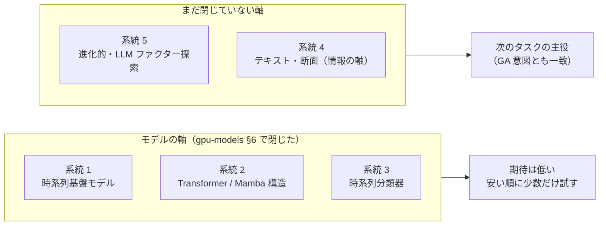
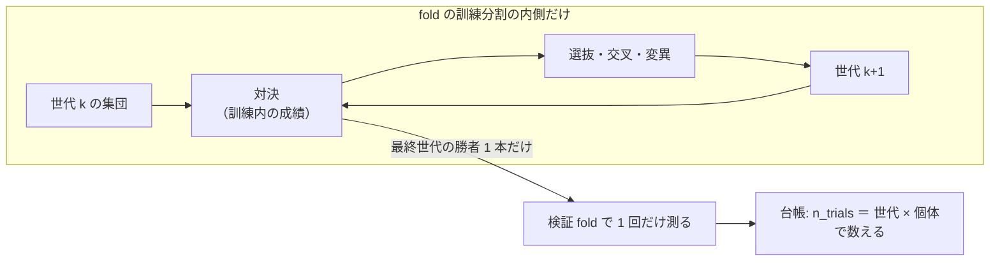

# 時系列から上昇下降トレンドを学習する最新 AI 技術の調査

調査日: 2026-09-10（**完了**）。派生元: TODO「DeepLearning と GAN を使った検証をかなり増やす」（利用者の指示 2026-09-10「時系列のデータから上昇下降のトレンドを学習するような最新の AI 技術がないか調べて」）。
プラン: [ts-trend-ai-survey.md](../../plans/archive/ts-trend-ai-survey.md)。実験基盤の規約は [rules.md](feature-discovery/rules.md)、既存の結論は [feature-discovery §9](feature-discovery.md)・[gpu-models §6](gpu-models.md)。

> ⚠ **これは投資助言ではなく調査資料である。** 特定の銘柄・売買を推奨しない。
> ⚠ **本書の数値はすべて【公表値】（出典 URL・取得日 2026-09-10）か【推測】である。** ベンチマークの数字は一般の時系列予測のもので、⚠ **金融の日次リターンでコスト後に勝てる証拠にはならない**（§2-2 の一次評価がそれを裏づける）。

## 0. ここまでで分かったこと

⚠ **「最新の AI 技術」は 5 系統に整理できる。だが金融の日次データでの一次評価は「汎用の最新モデルでも、ランダムウォーク基準への利得は小さくまばら」で、この基盤の結論（価格だけからは方向が出ない）と同じ形が外部でも出ている。** 有望なのはモデルを替える系統ではなく、**探索を自動化する系統（利用者の意図する「対決と進化」）と、入れる情報を増やす系統**である。

> この図の主張: 5 系統のうち、閉じたはずの「モデルの軸」に効くのは 3 系統で、残る「探索の軸」「情報の軸」に効くのが 2 系統ある。

| 問い | 答え |
| --- | --- |
| 最新技術はあるか | ⚠ **ある。** 2024〜2026 は時系列基盤モデル（zero-shot 予測）が主役で、ベンチマーク GIFT-Eval 上位は Moirai-2・Chronos-2・TimesFM-2.5・TiRex 等【公表値】 |
| それは金融の方向予測に効くか | ⚠ **効く証拠は無い。** 株価リターンでの一次評価 2 本がともに「対ランダムウォークの利得は小さくまばら」「zero-shot は不振」【公表値】（§2-2） |
| この基盤で試す価値があるのは | ① 時系列分類器（安い・数時間で決着）② 系列モデル 1 本（PatchTST 系）③ 金融特化 TSFM の fine-tune 1 本。いずれも**モデルの軸の追試**で期待は低い（§7） |
| 利用者の意図（対決と進化）に当たる技術は | ⚠ **ある。** ファクター探索の自動化（遺伝的プログラミング・強化学習 AlphaGen・LLM 駆動の進化）が 2023〜2026 に活発【公表値】（§6）。**GA タスクの土台に採用** |
| §9 の「変えるべきは入れる情報」に効く技術は | テキスト（ニュース・センチメント）を特徴量にする系統（§5）。⚠ ただし LLM エージェントに売買させる形はバックテストの信頼性に難があり見送り |

## 1. 前提 — この基盤に照らした読み方

⚠ **どの技術も、この実験基盤では同じ土俵で測る**: 日足 131,250 行・コスト 5bp・walk-forward 5 fold・パージ・基準線「常に上（ドリフト）」・DSR（[rules.md](feature-discovery/rules.md)）。
外部ベンチマークの勝敗は MASE / CRPS（値の予測誤差）で測られており、⚠ **「コスト後に方向で稼げるか」とは別の物差し**である。gpu-models で LightGBM の的中率 0.5208 が「常に上」の 0.5211 を下回ったまま粗利だけ勝った例のとおり、誤差の物差しの優劣は売買の優劣に直結しない。

| 用語 | 意味 |
| --- | --- |
| 時系列基盤モデル（TSFM） | 大量の多分野時系列で事前学習し、未知の系列を **zero-shot**（追加学習なし）で予測するモデル。LLM の時系列版 |
| GIFT-Eval | TSFM の標準ベンチマーク。23 データセット・14.4 万系列・7 分野【公表値: [arXiv:2410.10393](https://arxiv.org/abs/2410.10393)・[リーダーボード](https://github.com/SalesforceAIResearch/gift-eval)】 |
| 時系列分類（TSC） | 系列 → ラベルの分類問題。方向予測（上/下）はこの型に直せる |

## 2. 系統 1 — 時系列基盤モデル（zero-shot 予測）

### 2-1. 主なモデル【公表値・取得日 2026-09-10】

| モデル | 提供元 | 特徴 |
| --- | --- | --- |
| TimesFM-2.5 | Google | 約 200M パラメータ・文脈 16k・LoRA fine-tune 例つき（[出典](https://machinelearningmastery.com/the-2026-time-series-toolkit-5-foundation-models-for-autonomous-forecasting/)） |
| Chronos-2 | Amazon | 9M〜710M の 5 サイズ。値を離散トークン化して LLM 的に学習（[同上](https://machinelearningmastery.com/the-2026-time-series-toolkit-5-foundation-models-for-autonomous-forecasting/)） |
| Moirai-2 | Salesforce | 共変量（過去・未来の外生変数）を素で扱える。GIFT-Eval 上位（[出典](https://www.emergentmind.com/topics/gift-eval)） |
| TiRex | NX-AI | xLSTM ベース。長短ホライズンの zero-shot に強い（[arXiv:2505.23719](https://arxiv.org/abs/2505.23719)） |
| Sundial / Time-MoE / TabPFN-TS / Toto 2.0 | 清華 / — / Prior Labs / Datadog | GIFT-Eval 上位常連（[出典](https://www.emergentmind.com/topics/gift-eval)・[Toto 2.0](https://arxiv.org/pdf/2605.20119)） |
| FinCast | — | ⚠ **金融特化**の TSFM。株式・商品・先物の大規模金融データで事前学習（[arXiv:2508.19609](https://arxiv.org/abs/2508.19609)） |

### 2-2. ⚠ 金融リターンでの一次評価 — 期待を裏切る結果が既に 2 本ある

| 評価 | 結果【公表値】 |
| --- | --- |
| [Pretrained TSFM for Financial Return Forecasting](https://arxiv.org/abs/2606.27100)（2026） | TimeGPT・TimesFM-2.5・Moirai-2.0・Chronos-2 等 6 モデル対自前学習 5 基線。事前学習勢が 10 タスク中 8 勝と順位は支配するが、⚠ **「対ランダムウォークの利得は小さくまばら」**。統計的に有意な優位は 10 中 2 例のみ。結論は「**信頼できるアルファ生成の普遍的エンジンではない**」 |
| [Re(Visiting) TSFM in Finance](http://wp.lancs.ac.uk/fofi2026/files/2026/03/FoFI-2026-020-Eghbal-Rahimikia.pdf)（2026） | ⚠ **既製の事前学習モデルは zero-shot でも fine-tune でも不振**。金融データからの from-scratch 事前学習で大きく改善 ＝ 分野特化が要る |

⚠ **読み方**: これはこの基盤の §9・gpu-models §6 と独立に同じ形である。「汎用の系列知識」は日次リターンの方向にほぼ寄与しない。試すなら **金融特化（FinCast）か fine-tune の 1 本だけ**にし、zero-shot の横並べに n_trials を費やさない。

## 3. 系統 2 — 教師ありの新しい構造（Transformer・Mamba・xLSTM）

| 構造 | 中身【公表値】 |
| --- | --- |
| PatchTST（ICLR 2023） | 系列をパッチに切って Transformer に入れる。長期予測の定番（[arXiv:2211.14730](https://arxiv.org/abs/2211.14730)） |
| iTransformer（ICLR 2024） | 注意を「時点間」でなく「変数間」に掛ける。多変量に強い（[arXiv:2310.06625](https://arxiv.org/abs/2310.06625)）。⚠ §2-2 の評価では META で基盤モデル勢に勝った唯一の基線 |
| DLinear（AAAI 2023） | ⚠ **「単純な線形が凝った Transformer に並ぶ」ことを示した批判論文**（[arXiv:2205.13504](https://arxiv.org/abs/2205.13504)）。この基盤で Ridge ≒ LightGBM ≒ MLP（どれも採れない）だった形と同じ |
| S-Mamba / xLSTM-Mixer | 状態空間モデル・拡張 LSTM の多変量予測（[Neurocomputing 2025](https://dl.acm.org/doi/10.1016/j.neucom.2024.129178)・[arXiv:2410.16928](https://arxiv.org/abs/2410.16928)）。線形計算量が売りで、精度は Transformer 系と拮抗 |

⚠ **この基盤への含意**: これらは gpu-models で閉じた「モデルの軸」の続きである。ただし [feature-discovery §9-2](feature-discovery.md) で見送った**系列モデル**（窓を特徴量に潰さず系列のまま入れる ＝ 入力表現が変わる）だけは厳密には未検証の 1 枠として残っている。やるなら PatchTST か iTransformer を 1 本だけ。

## 4. 系統 3 — 時系列分類（方向予測を分類として解く）

方向（上/下）はラベルなので、時系列分類（TSC）の最先端がそのまま使える。⚠ **この系統は GPU 不要・数分〜数十分で回り、5 系統の中で最も安い**。

| 手法 | 中身【公表値】 |
| --- | --- |
| MiniRocket / MultiRocket | 大量のランダム畳み込み核 ＋ 線形分類器。UCR アーカイブで最高精度圏・非常に高速（[arXiv:2409.01115](https://arxiv.org/abs/2409.01115)） |
| Hydra | 競合するカーネル群の「どれが最強応答か」を数える。Rocket 系と併用で精度が上がる（[arXiv:2203.13652](https://arxiv.org/abs/2203.13652)） |
| QUANT | 区間ごとの分位点だけの極小手法。区間系で最良・著しく速い（[arXiv:2308.00928](https://arxiv.org/abs/2308.00928)） |
| Hydra ＋ QUANT 結合（2025-12） | 大規模 10 データセットで平均精度 0.829 → 0.836（[arXiv:2512.06666](https://arxiv.org/abs/2512.06666)）。⚠ **結合しても ＋0.007 ＝ TSC は成熟していて伸び代が小さい** |

⚠ **この基盤への含意**: 実装が小さく fold 構造・台帳にそのまま載る。ただし入れる情報は価格だけのままなので、**「モデルの軸が本当に閉じたか」を安価に締める最終確認**という位置づけ。Ridge/LightGBM と同型の結果（1 期間依存 or 基準線以下)が出たら、モデルの軸は完全に閉じる。

## 5. 系統 4 — 金融特化（テキスト・エージェント・断面）＝ 情報の軸

| 技術 | 中身【公表値】 | この基盤での扱い |
| --- | --- | --- |
| TradingAgents | アナリスト・強気弱気・リスク管理の役割別 LLM 多エージェントが議論して売買（[arXiv:2412.20138](https://arxiv.org/abs/2412.20138)・[GitHub](https://github.com/tauricresearch/tradingagents)）。⚠ **v0.4.0 で先読み（look-ahead）バグの修正が入った**＝ 本家のバックテスト自体に先読みが混入していた | ⚠ エージェントに売買させる形は**見送り**（右記） |
| TradeTrap | ⚠ **LLM 取引エージェントの信頼性・忠実性を疑う検証**（[arXiv:2512.02261](https://arxiv.org/abs/2512.02261)）。LiveTradeBench（[arXiv:2511.03628](https://arxiv.org/abs/2511.03628)）も実運用との乖離を測る流れ | 同上。バックテストが leak 対照・n_trials の規約に載らない |
| テキスト → 特徴量 | ニュース・開示・センチメントを**数値の列**に落として既存の表に足す | ✅ **§9「変えるべきは入れる情報」に唯一整合する形**。データ源の検討は TODO「既存にないデータを考える」へ |
| 断面 Transformer（MASTER 等） | 銘柄間関係を注意で学ぶ | §8（断面）は Ridge・LightGBM とも不振。優先度低 |

⚠ **読み方**: LLM を「売買の意思決定者」にする系統は、2025〜26 の検証論文が信頼性の穴（先読み・再現性・スタイル漂流）を突いており、この基盤の規約と相容れない。**LLM は「テキストを数値特徴量に変換する装置」として使うのが、規約に載る唯一の形**【推測】。

## 6. 系統 5 — 探索の自動化（進化的・LLM 駆動）＝ 利用者の意図する「対決と進化」

⚠ **「予測モデル（ファクター式）の集団を成績で対決させ、勝者から次世代を作る」は、クオンツ研究では「ファクター採掘（alpha mining）」として確立している。** 2023〜2026 の系譜:

| 世代 | 手法【公表値】 |
| --- | --- |
| 遺伝的プログラミング（従来） | 式木の交叉・変異で探索。warm-start 改良が 2024 にも（[arXiv:2412.00896](https://arxiv.org/abs/2412.00896)） |
| 強化学習 | AlphaGen（2023）: 組み合わせ後の成績を報酬に式を生成（[AlphaAgent 内の参照](https://arxiv.org/abs/2502.16789)） |
| LLM 駆動の進化（2025〜26） | LLM が式やコードを生成 → 対決 → 勝者を変異: AlphaAgent（alpha 減衰への正則化。[arXiv:2502.16789](https://arxiv.org/abs/2502.16789)）・LLM ＋ MCTS（[arXiv:2505.11122](https://arxiv.org/abs/2505.11122)）・コード進化型（[arXiv:2511.18850](https://arxiv.org/abs/2511.18850)）・進化的ファクター探索 EFS（[arXiv:2507.17211](https://arxiv.org/abs/2507.17211)） |

> この図の主張: 進化的探索をこの基盤に載せるときは、対決（選抜）を訓練の内側に閉じ込め、外の検証には勝者 1 本しか出さない。

⚠ **注意（rules §11-4）**: 世代 × 個体がそのまま多重検定の試行数になる。20 個体 × 50 世代 ＝ 1,000 試行【推測】で、DSR の合格水準は現行の n_trials 58 とは桁違いに厳しくなる。**「検証 fold の成績で選抜する」設計にした瞬間、全体が過剰適合の自動化装置になる**ので、上図の分離が絶対条件。

⚠ **もう 1 つの含意**: 探索が増やすのは式（＝ 価格の変換）であって情報ではない。価格だけの表の上で回す限り、§9 の壁（価格だけからは方向が出ない）の内側の探索である。**情報の軸（§5）と組むと初めて探索空間が広がる**【推測】。

## 7. 判定 — 候補リスト

| 優先 | 候補 | 系統 | 期待 | コスト【推測】 | n_trials への影響 | 判定 |
| ---: | --- | --- | --- | --- | --- | --- |
| 1 | 進化的ファクター探索の基盤づくり（GA。選抜の分離・台帳の自動集計） | 5 | 探索の自動化。⚠ 価格だけでは §9 の壁の内側 | 設計 ＋ 実装 数日 | ⚠ 世代 × 個体で爆発。**数え方を先に決める** | **採る**（利用者の意図。継続実行の仕組みと同一タスク） |
| 2 | MiniRocket ＋ Hydra ＋ QUANT（時系列分類） | 3 | モデルの軸の最終確認。低い | 実装 半日・実行 数十分（CPU） | ＋3 | **採る**（最も安い） |
| 3 | PatchTST か iTransformer を 1 本（系列表現） | 2 | §9-2 の未検証枠。低い | 実装 1 日・実行 数時間（GPU） | ＋1 | 採る（1 本だけ） |
| 4 | FinCast か TimesFM-2.5 LoRA の fine-tune 1 本 | 1 | ⚠ 一次評価 2 本が否定的 | 実装 1〜2 日 | ＋1 | 保留（系統 2・3 が全滅してから） |
| 5 | テキスト → 特徴量（情報の軸） | 4 | §9 に整合する唯一の方向 | ⚠ データ源の調査から。大 | データ源ごとに設計 | 別タスク（「既存にないデータを考える」に接続） |
| — | LLM エージェントに売買させる | 4 | 検証論文が信頼性を否定的に評価 | — | 規約に載らない | **見送り** |
| — | 拡散モデル等での増強 | — | GAN 増強（gpu-models §4「落とす」）と同型 | — | — | **見送り** |

⚠ **総括**: 「最新技術」の主戦場（基盤モデル・新構造）は、この基盤で閉じた「モデルの軸」の延長にあり、金融の一次評価も否定的。**次のタスクの主役は、優先 1（進化的探索の基盤）に優先 2・3 を最初の「対決の参加者」として載せる構成**が、利用者の意図・既存の結論・多重検定の規約の 3 つを同時に満たす【推測】。

## 8. 出典一覧（取得日はすべて 2026-09-10）

- 基盤モデル概況: [The 2026 Time Series Toolkit（MachineLearningMastery）](https://machinelearningmastery.com/the-2026-time-series-toolkit-5-foundation-models-for-autonomous-forecasting/) ／ [GIFT-Eval（arXiv:2410.10393）](https://arxiv.org/abs/2410.10393) ／ [GIFT-Eval リーダーボード](https://github.com/SalesforceAIResearch/gift-eval) ／ [GIFT-Eval 解説（EmergentMind）](https://www.emergentmind.com/topics/gift-eval) ／ [TiRex（arXiv:2505.23719）](https://arxiv.org/abs/2505.23719) ／ [Toto 2.0（arXiv:2605.20119）](https://arxiv.org/pdf/2605.20119)
- 金融での評価: [Pretrained TSFM for Financial Return Forecasting（arXiv:2606.27100）](https://arxiv.org/abs/2606.27100) ／ [Re(Visiting) TSFM in Finance（FoFI 2026）](http://wp.lancs.ac.uk/fofi2026/files/2026/03/FoFI-2026-020-Eghbal-Rahimikia.pdf) ／ [FinCast（arXiv:2508.19609）](https://arxiv.org/abs/2508.19609) ／ [チャート画像 DNN は実用か神話か（Nature HSSC 2025）](https://www.nature.com/articles/s41599-025-04761-8)
- 構造: [PatchTST（arXiv:2211.14730）](https://arxiv.org/abs/2211.14730) ／ [iTransformer（arXiv:2310.06625）](https://arxiv.org/abs/2310.06625) ／ [DLinear（arXiv:2205.13504）](https://arxiv.org/abs/2205.13504) ／ [S-Mamba（Neurocomputing）](https://dl.acm.org/doi/10.1016/j.neucom.2024.129178) ／ [xLSTM-Mixer（arXiv:2410.16928）](https://arxiv.org/abs/2410.16928)
- 時系列分類: [MultiRocket 系の整理（arXiv:2409.01115）](https://arxiv.org/abs/2409.01115) ／ [Hydra（arXiv:2203.13652）](https://arxiv.org/abs/2203.13652) ／ [QUANT（arXiv:2308.00928）](https://arxiv.org/abs/2308.00928) ／ [Hydra＋Quant（arXiv:2512.06666）](https://arxiv.org/abs/2512.06666)
- LLM エージェント: [TradingAgents（arXiv:2412.20138）](https://arxiv.org/abs/2412.20138) ／ [TradingAgents GitHub](https://github.com/tauricresearch/tradingagents) ／ [TradeTrap（arXiv:2512.02261）](https://arxiv.org/abs/2512.02261) ／ [LiveTradeBench（arXiv:2511.03628）](https://arxiv.org/abs/2511.03628)
- ファクター探索: [AlphaAgent（arXiv:2502.16789）](https://arxiv.org/abs/2502.16789) ／ [warm-start GP（arXiv:2412.00896）](https://arxiv.org/abs/2412.00896) ／ [LLM＋MCTS（arXiv:2505.11122）](https://arxiv.org/abs/2505.11122) ／ [コード進化型（arXiv:2511.18850）](https://arxiv.org/abs/2511.18850) ／ [EFS（arXiv:2507.17211）](https://arxiv.org/abs/2507.17211)
