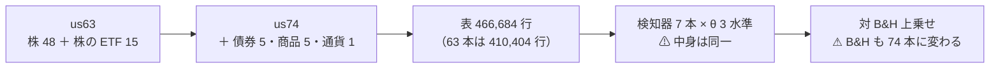
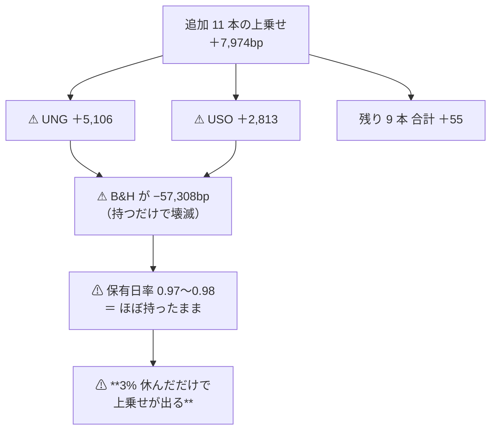

# 段 1: 低相関の 11 本を売買の対象に加えた【実測 2026-09-12】

- プラン: [universe-lowcorr-trade.md](../../plans/archive/universe-lowcorr-trade.md) ／ 検討: [universe-widening.md §8](universe-widening.md)
- 利用者の決定（2026-09-12）: **(a) 売買する**（入力にだけ使う (b) ではない）
- 実行: `runs/2026-09-12T17-35-16_trend_scales_1995_us74`（本番）／ `runs/2026-09-12T17-34-30_trend_scales_1995_us74_leak`（leak 対照）
- 橋渡し対（[13-8](feature-discovery/rules.md)）の相手: `runs/2026-09-12T15-15-12_trend_scales_1995`（63 本）

## 1. 結論

⚠ **狙いどおり実効系列数は伸び、t も伸びた。だが伸びの中身は skill ではなかった。**

| 問い | 答え |
| --- | --- |
| 実効系列数は伸びたか | ✅ **4.192 → 5.436**（＋29.7%） |
| t は伸びたか | ✅ **0.92 → 1.12**（×1.22。⚠ **予測の ×1.17 に近い**） |
| ⚠ **足した 11 本で効いたのか** | ⚠ **11 本のうち 2 本でだけ効いた。** ⚠ **追加分の上乗せ ＋7,974bp のうち 99% が UNG と USO**で、⚠ **残り 9 本は実質ゼロ**（[分解](edge-drift-bias.md)後の当てた分は合計 −415bp） |
| その 2 本は何者か | ⚠ **B&H が UNG −57,308bp・USO −16,780bp の商品 ETF。** ⚠ **片道 2.5bp が成り立つか疑わしい銘柄**でもある |
| 採否 | ⚠ **上乗せ ＋126.5bp/fold・符号 3/5・t 1.12。** 検出限界（4,500〜6,300bp/fold）の ⚠ **1 桁半下**。台帳の判定は **保留** |

⚠ **「対 B&H 上乗せ」という物差しは、B&H が壊滅する銘柄を混ぜると易しくなる。**
⚠ **その分は測れて、引いても残った**（[edge-drift-bias.md](edge-drift-bias.md)）。⚠ **残る問題は「2 本にしか効いていない」ことのほうである。**

## 2. 何を回したか — ⚠ 動かした軸は銘柄集合だけ

> この図の主張: ⚠ **足したのは「当てる材料」ではなく「売買する対象」である。** 判断の仕方は 1 つも変えていない。

| | 63 本 | 74 本 |
| --- | ---: | ---: |
| 表の行 | 410,404 | **466,684** |
| 検証期間 | 2000-09-08 〜 2025-11-18 | ⚠ **同一** |
| 設定の差 | — | ⚠ **`name` と `dataset` の 2 行だけ**（層・スケール・検知器・θ・形式・種・パージ・コストは同一） |

⚠ **コードは 1 行も触っていない**（新規の設定 3 ファイルだけ）。⚠ **`us63.toml` も `daily.toml` も書き換えていない。**

## 3. 結果【実測 2026-09-12】

| | 63 本 | 74 本 |
| --- | ---: | ---: |
| 実効系列数 | 4.192 | ✅ **5.436** |
| 最良手法 | D2 中期ゲート θ=55 | ⚠ **同じ手法が最良** |
| 対 B&H 上乗せ | ＋101.3bp/fold | **＋126.5bp/fold** |
| t | 0.92 | **1.12** |
| fold の符号 | 3/5 ＋−＋0＋ | 3/5 ＋−0＋＋ |
| leak 対照 | ＋16,844bp・t 8.15 | ✅ **＋16,410bp・t 8.37・DSR 1.000** |

⚠ **leak は跳ねた**ので配線は疑わなくてよい（7 章 規約 7）。

## 4. ⚠ 本書の核 — 追加分の効きは 2 本に集中している

⚠ **プランの通り、最良手法の銘柄別 bp を「既存 63 本」と「追加 11 本」に分けた。**

| 群 | 銘柄 | 上乗せ合計 bp | ポートフォリオへの寄与 |
| --- | ---: | ---: | ---: |
| 既存 63 本 | 63 | ＋22,867 | ＋61.8bp/fold |
| 追加 11 本 | 11 | ＋7,974 | ＋21.6bp/fold |

⚠ **一見すると追加分は 1 銘柄あたり 159.5bp で、既存の 76.5bp より効いている。** ⚠ **中身を開けると違う。**

| 銘柄 | B&H bp | 手法 bp | 上乗せ bp | 保有日率 |
| --- | ---: | ---: | ---: | ---: |
| ⚠ **UNG** | ⚠ **−57,308** | −52,201 | ⚠ **＋5,106** | 0.97 |
| ⚠ **USO** | ⚠ **−16,780** | −13,967 | ⚠ **＋2,813** | 0.98 |
| TLT | −482 | ＋30 | ＋512 | 0.86 |
| IEF | ＋898 | ＋1,305 | ＋407 | 0.80 |
| SHY | ＋21 | ＋242 | ＋221 | 0.80 |
| SLV ／ UUP | ＋11,961 ／ ＋1,828 | 同じ | **0** | 1.00 |
| TIP ／ LQD ／ DBC ／ GLD | ＋600 ／ −344 ／ −667 ／ ＋21,340 | — | −83 ／ −129 ／ −371 ／ −501 | 0.80〜1.00 |

（参考: ⚠ **既存 63 本の B&H の中央値は ＋16,832bp**）

> この図の主張: ⚠ **追加分の上乗せは「当てた」のではなく「壊滅する基準線を少しだけ避けた」ものである。**

| # | 読み方 |
| ---: | --- |
| 1 | ⚠ **追加 11 本の上乗せの 99.3% が UNG と USO の 2 本**（7,919 / 7,974）。⚠ **残り 9 本の合計は ＋55bp で、実質ゼロである** |
| 2 | ⚠ **その 2 本は保有日率 0.97・0.98。** ⚠ **ほとんど持ちっぱなしで、わずかに休んだだけで上乗せが出た。** ⚠ **2026-09-12 に分解して訂正**（[edge-drift-bias.md](edge-drift-bias.md)）: ⚠ **UNG は 31% が「でたらめに休んでも出る分」だが、残る ＋3,515bp はそれを超えている。USO は ＋2,813bp のほぼ全部が超えている分**。⚠ **「当てていない」は言い過ぎだった** |
| 3 | ⚠ **UNG・USO は先物を転がす商品 ETF で、期近の乗り換えで価値が目減りする**【推測。B&H の −57,308bp・−16,780bp は【実測】】。⚠ **B&H が壊滅する銘柄では「対 B&H 上乗せ」が易しくなる。** ⚠ **ただし易しくなる分は測れて、引いても残った**（§4 の訂正） |
| 4 | ⚠ **この 3 本（UNG・USO・DBC）はプランで「片道 2.5bp が疑わしい」と先に挙げていた銘柄である。** ⚠ **結果を見てから外すと選別になる**ので外していない（プラン §2 の 3） |
| 5 | ⚠ **t の伸び（0.92 → 1.12）を「手法が債券・商品でも広く効く」と読んではいけない。** ⚠ **[§8-0](universe-widening.md) が立てた問い「11 本で効くか」の答えは「11 本のうち 2 本でだけ効く」である**（残り 9 本の当てた分は合計 −415bp）。⚠ **そしてその 2 本は片道 2.5bp が疑わしい** |

## 5. ⚠ 台帳の鍵に穴があった — 回して初めて見つかった

⚠ **プラン Phase 4 の検算（n_trials が 160 → 181 になるか）が落ちた。** ⚠ **再生成しても 160 のままだった。**

| # | 何が起きていたか |
| ---: | --- |
| 1 | ⚠ **`catalog.KEY` に銘柄集合が入っていなかった。** us63 の実行と us74 の実行が**同じ鍵にまとまった** |
| 2 | ⚠ **まとまった差は「再現の幅 756.33bp」として出た** — ⚠ **銘柄集合の差が、配線の壊れのように見えた** |
| 3 | ⚠ **同じ穴が前からあった**: 断面の実行（48 本）と他の実行（63 本）も同じ鍵にまとまっていた |
| 4 | ⚠ **向きは甘い側**（n_trials が少なく出る ＝ DSR が高く出る） |

⚠ **これは [11 章 規約 4](feature-discovery/rules.md)（「`n_trials` は 手法 × 粒度 × 地平 × **銘柄集合**」）が要求していたものが、実装に無かったということである。**
⚠ **`_period_of` の注記が、期間について同じ失敗をそのまま書いていた**（2026-09-11 に直した形）。

**直した内容**: `catalog.KEY` に **銘柄**（⚠ **その実行が実際に読んだ本数**。`inputs.symbols`）を足した。

| 量 | 前 | 後 |
| --- | ---: | ---: |
| n_trials | 160 | **190** |
| 内訳 | — | ⚠ **＋21 が今回の実行 ／ ＋9 が 48 本と 63 本の分離** |
| 基準線の行 | 112 | 122 |

⚠ **検算**: ✅ **HEAD の台帳 365 行のうち、数字が変わった行 0・消えた行 0**（49 行増えただけ）。
⚠ **いまの config からは引いていない**（`dataset` → `universe` を後から当てるのは自己申告になる）。記録の無い実行は「—」に寄せる。

## 6. 限界

| # | 限界 | ⚠ 効き方 |
| ---: | --- | --- |
| 1 | ⚠ **11 本の開始は 2002-07〜2007-04。** 検証の始まり 2000-09-08 には 1 本も無い | ⚠ **fold 1 はほぼ 63 本のまま。** 効果が出るのは fold 2 以降 |
| 2 | ⚠ **B&H が「株の籠」から「株 ＋ 債券 ＋ 商品の籠」に変わった** | ⚠ **63 本の実行と数字を直接比べない**（橋渡し対として並べて読む） |
| 3 | ⚠ **鍵は銘柄の「本数」だけで、一覧ではない** | ⚠ **同じ本数で中身が違う集合は割れない。** 本数は実行が必ず記録しているが一覧は記録していない |
| 4 | ⚠ **実行時の `checks.json` の DSR は n_trials=160 で計算されている**（台帳はそのあと 190 になった） | ⚠ **台帳が正本**（[ledger-role.md](feature-discovery/ledger-role.md) の「輪になっている」） |
| 5 | 生存バイアス（12-1） | ⚠ **ETF も 2026 年に存在するものから選んでいる** |

## 7. 次にやるなら

⚠ **「UNG・USO を外してもう一度」は、結果を見てから外すので選別になる。** やるなら ⚠ **事前に規則を書いて別の試行として数える。**
⚠ **規則の候補**【推測】: 「先物を転がす ETF を対象から外す」は ⚠ **取得の前に決められる基準**（商品の仕組みで引ける。測った成績では引かない）。

⚠ **より効くのは物差しの側である**: ⚠ **B&H が壊滅する銘柄が混ざると「対 B&H 上乗せ」が易しくなる**という穴は、
⚠ **銘柄を足すかぎり付いて回る。** [13-7](feature-discovery/rules.md) の物差しを見直すかどうかは別のタスクにする。
