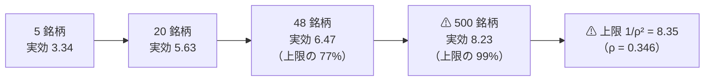
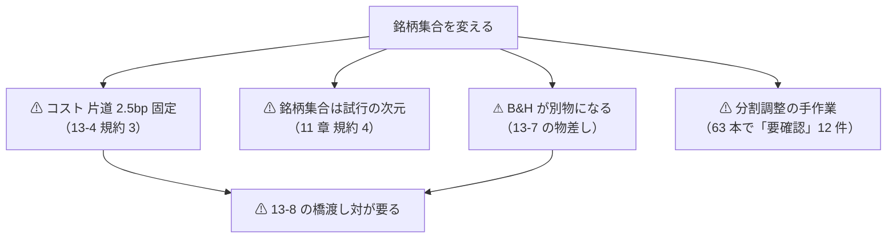
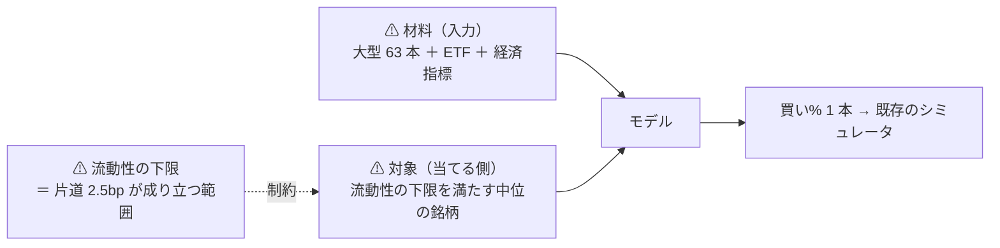
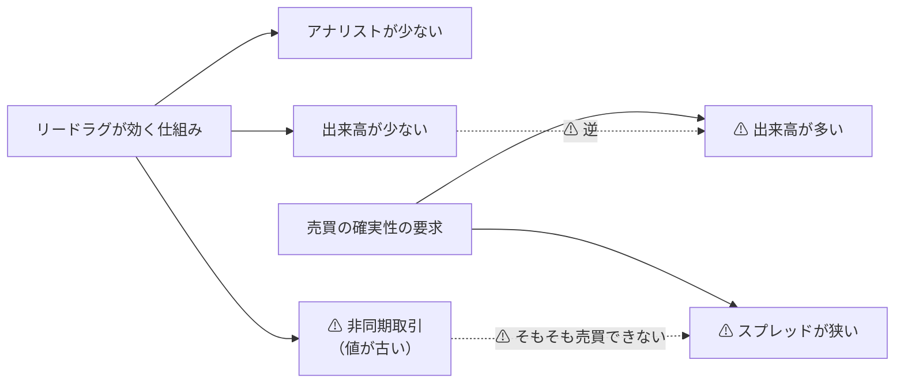

# 銘柄集合をどこまで広げられるか（検討）

- プラン: [universe-widening.md](../../plans/archive/universe-widening.md)
- 利用者の指示（2026-09-12）: **「時価総額上位 63 本、最も流動性が高い」も変更します。どれくらいの幅まで広げられるか検討して**
- 関連: [daily-data-sources.md §7](daily-data-sources.md)（⚠ **銘柄を増やす実測は既にある**）／ [rules.md 12-1](feature-discovery/rules.md)（生存バイアス）／ [volume-trend-ml.md](volume-trend-ml.md)（流動性の向き）
- ⚠ **文書だけ。新しい取得も新しい試行もしていない**（`runs/` は 44 本・`n_trials` は 160 のまま）

## 1. 結論

⚠ **「広げる」には目的の違う 3 つが混ざっている。効く広げ方は 1 つだけで、しかもそれは「広げる」ではなく「選び直す」である。**

| 目的 | どこまで広げられるか | ⚠ 効くか |
| --- | --- | --- |
| A 標本を増やす | 技術的には数百〜数千本。⚠ **だが 500 本でも実効系列は 8.23 本**【実測】 | ⚠ **ほとんど効かない**（銘柄 10 倍で t は **1.13 倍**） |
| B 流動性の低い側へ届く | 取得はできる。⚠ **だがコストの前提（片道 2.5bp 固定）が崩れる** | ⚠ **唯一「効く」見込みがある。ただし物差しの変更が要る** |
| C 上場廃止銘柄を入れる | ⚠ **いまのデータ源では 0 本**【実測 2026-09-16】（廃止 6 本とも日足 0 本・対照は 8,001 本。[universe-delisted.md](universe-delisted.md)） | ⚠ **12-1 を直接潰せる唯一の道。** ⚠ **無償の経路では閉じた** — 有償データ（Norgate Platinum 以上・US$630/年【推測】）が要る |

✅ **いますぐ効くのは「低相関の 12 本を混ぜる」で、⚠ データは既に取得済みで使われていない。**
⚠ **t の伸びは 1.170 倍で、大型株を 500 本に増やす（1.13 倍）より大きい**【実測 2026-09-09】。

## 2. ⚠ 広げても標本はほとんど増えない【実測 2026-09-09・[§7-1](daily-data-sources.md)】

> この図の主張: ⚠ **大型株は互いに相関するので、何本足しても実効系列数は 8.35 本で頭打ちになる。**

| 銘柄数 | 実効系列数 | t の伸び（48 本を 1.000 として） |
| ---: | ---: | ---: |
| 48（現在の会社株） | 6.47 | 1.000 |
| ⚠ **500** | **8.23** | ⚠ **1.13** |
| ∞ | 8.35 | 1.14 |

⚠ **会社株を 10 倍に増やして得られるのは t の 13% だけである。** ⚠ **検出力を上げる手段として、大型株を足すのは効率が悪い。**

### 2-1. ✅ 広げるより「混ぜる」ほうが効く — しかも取得済み

| 組み合わせ | 銘柄 | 実効系列数 | t の伸び |
| --- | ---: | ---: | ---: |
| 会社株だけ | 48 | 6.62 | 1.000 |
| ＋ 低相関の候補 23 本ぜんぶ | 71 | 7.81 | 1.086 |
| ✅ **＋ 低相関の 12 本だけ** | **60** | ⚠ **9.06** | ✅ **1.170** |

⚠ **23 本ぜんぶ足すより 12 本に絞ったほうが実効系列数が多い。** 株に近い 11 本（国際株・小型株・REIT・ハイイールド債）は
⚠ **列を増やして多重検定を厳しくするだけで、独立な情報を足していない。**

⚠ **この 12 本は既に `data/adjusted/d` にある**（86 銘柄 ＝ us63 の 63 ＋ 低相関 23）。
⚠ **しかし全実験が `universe = "us63"` を使っているので、1 度も検証に入っていない**（`config/dataset/daily.toml`）。

⚠ **断り書き**: 実効系列数は正規化された指標なので、⚠ **相関の高い系列を足すと情報が減っていなくても値が下がる。**
⚠ **「11 本が有害」の証明ではない**（[§7-3](daily-data-sources.md)）。

## 3. 取得の上限【実測・公表値 2026-09-12】

| 制約 | 値 | 出どころ |
| --- | --- | --- |
| 日足の本数 | 1 銘柄 **最大 8,000 本 ≒ 32 年** | `config/dataset/daily.toml` |
| DXLink の購読上限 | ⚠ **1 セッション 100 件**【公表値】 | `ail/data/sources/tastytrade.py` |
| 取得の束 | 16 銘柄ずつ | 同上（`batch=16`） |
| 現在の取得済み | **86 銘柄**（us63 63 ＋ 低相関 23） | `data/adjusted/d` |
| 行数 | 63 銘柄 × 31 年 ＝ **410,404 行** | `trend_scales_1995` の表 |

⚠ **取得そのものは上限ではない。** 500 銘柄なら束を 32 回回すだけで、行は約 240 万（×5.8）。
⚠ **上限は取得ではなく、下の 3 つの「手作業と規約」である。**

## 4. ⚠ 広げると壊れるもの

> この図の主張: ⚠ **広げた瞬間に壊れるのは物差しのほうである。** 銘柄を足すのは安いが、比べられなくなる。

| # | 壊れるもの | ⚠ 中身 |
| ---: | --- | --- |
| 1 | **コストの前提** | ⚠ **13-4 規約 3 は片道 2.5bp 固定。** ⚠ **小型株のスプレッドはそれより広い。** 固定のまま小型株を入れると ⚠ **小型株だけ有利に出る（嘘になる）**。⚠ **銘柄別コストにするのはシミュレータの変更 ＝ 検証方式の変更** |
| 2 | **物差しの相手** | ⚠ **B&H は「その銘柄集合の等加重」なので、集合を変えると基準線が別物になる。** ⚠ **旧 63 本の数字と新しい数字を直接比べられない**（13-8 と同じ形） |
| 3 | **試行の数え方** | ⚠ **11 章 規約 4 が「手法 × 粒度 × 地平 × 銘柄集合」と書いている。** ⚠ **銘柄集合を増やすと、同じ手法がもう 1 回数えられる**（160 → 320 相当）。⚠ **DSR への影響自体は小さい**（√ln N。0.941 → 0.913 程度） |
| 4 | **手作業** | ⚠ **分割調整の「要確認」は 63 銘柄で 12 件。** 線形なら 500 銘柄で **約 95 件**【推測】。⚠ **一次情報で確かめるまで直さない**規約（2-4 段階 2）なので、⚠ **これは自動化できない手作業である** |
| 5 | **生存バイアスは消えない** | ⚠ **いま存在する銘柄から選ぶ限り、何本に増やしても 12-1 は消えない。** ⚠ **500 本に増やすと「2026 年の上位 500 を 1995 年に知っていた」に変わるだけで、むしろ深くなる** |

## 5. 段階と、段ごとに要る規約変更

| 段 | 中身 | 銘柄 | 取得 | ⚠ 効く見込み | ⚠ 要る規約変更 |
| ---: | --- | ---: | --- | --- | --- |
| **0** | 現在（us63） | 63 | 済 | — | — |
| ✅ **1** | ⚠ **低相関の 12 本を混ぜる** | **60〜75** | ✅ **済（未使用）** | ⚠ **t ×1.170**【実測】 | ⚠ **無し**（`config/` の universe を差し替えるだけ）。⚠ **ただし橋渡し対は要る**（B&H が変わるため） |
| 2 | 大型株を厚くする（S&P 500 相当） | 〜500 | 可（束 32 回） | ⚠ **t ×1.13 止まり** | 無し。⚠ **手作業は「要確認」約 95 件**【推測】 |
| 3 | ⚠ **中小型へ届かせる**（Russell 2000 相当） | 〜2,000 | 可だが手作業が線形に増える | ⚠ **唯一「効く」見込み**（[volume-trend-ml §4-2](volume-trend-ml.md)） | ⚠ **13-4 のコストを銘柄別にする ＝ 検証方式の変更・橋渡し対（13-8）** |
| 4 | ⚠ **上場廃止銘柄を入れる** | ＋数千 | ⚠ **取れない**【実測 2026-09-16】（[universe-delisted.md](universe-delisted.md)） | ⚠ **12-1 を直接潰す唯一の道** | ✅ **調査は済んだ。** ⚠ **有償データの試算まで書いた（契約しない）** — 要件を満たすのは Norgate Platinum 以上【公表値】・US$630/年【推測】 |

## 6. ⚠ 段 3・段 4 は「広げる」より重い

⚠ **段 3 は物差しを変える。** 片道 2.5bp を銘柄別にした瞬間、⚠ **過去 160 試行の純利が全部別定義になる。**
⚠ **13-8 の橋渡し対（同じ手法を新旧両方の物差しで 1 回ずつ回す）が要る。**

⚠ **段 4 はデータの問題である。** ✅ **2026-09-16 に確かめた**（[universe-delisted.md](universe-delisted.md)）: ⚠ **instruments は廃止銘柄を知っている**（`active=false`・CUSIP・最後の上場市場）が、
⚠ **日足は 6 本とも 0 本**だった（対照の AAPL・SPY は同じ接続で 8,001 本）。⚠ **broker の配信は上場中の銘柄だけ、という見込みは当たっていた**【実測】。
⚠ **無償の経路では生存バイアスを消せない。** 有償データの試算（Norgate Platinum 以上・US$630/年【推測】）まで書き、⚠ **いまは買わないと判断した**（「採る」が 0 件の段階では順位が変わらないため）。

## 7. 判定

| 段 | 判定 | 理由 |
| ---: | --- | --- |
| 1 低相関 12 本を混ぜる | ✅ **採る（最優先）** | ⚠ **取得済み・規約変更なし・t ×1.170 で段 2 より効く。** ⚠ **やらない理由が無い** |
| 2 大型を 500 本へ | ⚠ **落とす** | ⚠ **t ×1.13 のために「要確認」約 95 件の手作業を払う。** ⚠ **生存バイアスはむしろ深くなる** |
| 3 中小型へ | **保留（条件つき）** | ⚠ **効く見込みはここにしか無いが、先に「コストを銘柄別にする」が要る。** ⚠ **それは検証方式の変更なので単独のタスクにする** |
| 4 廃止銘柄 | **保留（調査が先）** | ⚠ **まず「取れるか」を確かめる**（API の挙動なので実測可）。取れないなら有償データの試算まで |

⚠ **積極的に埋める方針（[14-10](feature-discovery/rules.md)）との関係**: 段 2 を「落とす」にしたのは可能性の低さではなく、
⚠ **払う手作業が約 95 件で、得られる t が 13% しかない**という費用の話である。⚠ **14-10 規約 1 の除外（測れない）ではなく、費用対効果の判断であることを明記しておく。**

## 8. 段 1 の設計 — ⚠ 先に決めることが 1 つある（2026-09-12 追記）

⚠ **取得済みの 23 本は「予測に使う候補」として取ってあるが、§7 の t の伸びは「売買する」前提の数字である。**
⚠ **どちらで使うかで別の実験になる。** ⚠ **先に決めないと、出てきた数字が何の数字か分からない。**

| 使い方 | 何が起きるか | ⚠ 注意 |
| --- | --- | --- |
| **(a) 売買する**（対象に入れる） | ポートフォリオの独立な系列が増え、⚠ **t が 1.170 倍**【実測 2026-09-09】 | ⚠ **B&H が「株の等加重」から「株 ＋ 債券 ＋ 商品の等加重」に変わる。** ⚠ **問いが「株を当てられるか」から「混ぜ物の籠を当てられるか」に変わる**（橋渡し対が要る） |
| **(b) 入力にだけ使う**（説明変数） | ⚠ **標本は 1 行も増えない。** 列だけ増える | ⚠ **多重検定が厳しくなるだけで t は伸びない。** `config/universe/lowcorr.toml` の注記はこちらを想定している |

⚠ **§7 の「t ×1.170」は (a) の数字である。** ⚠ **(b) を選ぶなら、その数字を根拠に使ってはいけない。**

### 8-0. ⚠ **「t ×1.170」は条件つきの上限である**

⚠ **§7 が測ったのは実効系列数（ばらつきの効果）だけで、⚠ 上乗せの大きさは変わらないと仮定している。**
⚠ **足した 11 本に上乗せが無ければ、t はむしろ下がる。**

t ＝ ポートフォリオの平均上乗せ ÷（ばらつき ÷ √日数）なので、48 本の上乗せを e として:

| 足した 11 本の上乗せ | 平均上乗せ | ばらつき | ⚠ **t の変化** |
| --- | ---: | ---: | ---: |
| 株と同じ e（§7 の仮定） | e | ×0.855 | ✅ **×1.170** |
| ⚠ **0（効かない）** | 48e/59 ＝ 0.814e | ×0.855 | ⚠ **×0.95（下がる）** |

⚠ **つまり (a) の利得は「手法が債券・金・商品でも同じだけ効く」ことに賭けている。**
⚠ **トレンド追随は商品・債券で効きやすいという通説はあるが、このプロジェクトでは 1 度も測っていない**【推測】。
⚠ **回すなら「t が上がるはず」ではなく「足した 11 本で効くかどうかを測る」と書いて回す。**

### 8-1. ⚠ 本数は 11 か 12 か — 記録が食い違っている

| 出どころ | 本数 | 中身 |
| --- | ---: | --- |
| [§7-3](daily-data-sources.md) の実測 | **12** | 相関 0.04〜0.33 の 12 本（⚠ **GDX を含む**） |
| `config/universe/lowcorr.toml` の `etf` | **11** | ⚠ **GDX を外した**（金鉱株 ＝ 資産クラスでは株） |

⚠ **これは誤りではなく、[§7-4](daily-data-sources.md) が明記した判断の食い違いである**（測った相関ではなく資産クラスで線を引いた）。
⚠ **どちらを使うかを実行の設定に書き、台帳の鍵に残す。**

### 8-2. コストの前提はどうか【推測】

⚠ **TLT・IEF・SHY・LQD・GLD・SLV は出来高の大きい ETF なので、片道 2.5bp は大型株と同程度に妥当**【推測】。
⚠ **UNG・USO・DBC は商品 ETF で回転が小さく、スプレッドが広い可能性がある**【推測】。⚠ **段 1 を (a) で回すなら、この 3 本だけ別扱いにするか除くかを先に決める。**

## 9. 段 3 の再定義（利用者の指示 2026-09-12）

**利用者の指示: 売買の確実性を担保したいので流動性がある程度あるものとし、大型株や経済指標などのデータを入力に入れて、その銘柄の予測ができるかを検証したい。**

> この図の主張: ⚠ **これは「小型株へ広げる」ではない。** ⚠ **流動性のある中位の銘柄を「当てられる側」に置き、大型株と経済指標を「当てる材料」にする設計である。**

### 9-1. ✅ 配線は既にある — コードを書かずに組める

| 要るもの | 既にあるか |
| --- | --- |
| 対象と材料を分ける | ✅ **ある**。`targets = "company"` が universe の group を選ぶ（`cross_section_h1.toml`） |
| 先行銘柄を指定する | ✅ **ある**。⚠ **`ll_leaders` は "etf" / "all" / 銘柄の一覧が書ける**（リードラグの層 `ll`） |
| 断面・相対の特徴量 | ✅ **ある**（`cs` / `rel` / `ll` の 3 層） |
| 経済指標 | ✅ **ある**（`ex` 層。為替・イールド・気象・地震） |

⚠ **必要なのは `config/universe/` に新しい集合を 1 つ書くことだけ**【推測】。⚠ **コードは触らない**（10 章）。

### 9-2. ⚠ ただし入力側は両方とも既に試して落ちている【実測】

| 入力 | いつ | 結果 |
| --- | --- | --- |
| 断面 ＋ 相対 ＋ リードラグ（`own cs rel ll`） | 2026-09-08 / 09 | ⚠ **最良で純利 ＋2.30bp・2/5 fold**（F1-2 相互情報量）。⚠ **保留 → 2026-09-11 に「閉じる」**（検出限界の 2 桁下） |
| 経済指標（`own ex`。為替・イールド） | 2026-09-09 | ⚠ **偽薬（気象・地震）を超えなかった**（[§9](daily-data-sources.md)）。⚠ **本命 −2.83bp に対し偽薬 0.00bp** |

⚠ **「経済指標を入れる」は、この形では既に否定されている。** ⚠ **ただし否定されたのは「大型株を当てる材料として」である。**

### 9-3. ⚠ 何が新しいのか — 変わるのは対象であって入力ではない

| 軸 | これまで | 利用者の設計 |
| --- | --- | --- |
| 入力 | 大型株の断面・経済指標 | ⚠ **同じ** |
| **対象** | ⚠ **大型 48 社**（最も情報が行き渡っている） | ⚠ **流動性の下限を満たす中位の銘柄**（情報が遅れて届く側） |
| 地平・物差し | 1 日先・毎日往復 | 先 W 日・閾値売買（13 章） |

⚠ **仮説は「材料が効かない」ではなく「大型株は当てる相手として難しすぎた」である。** ⚠ **これは未検証であり、試す価値がある。**

### 9-4. 一次情報 — 仮説には根拠がある。ただし条件が噛み合わない

| 出典 | 何を言っているか |
| --- | --- |
| Lo & MacKinlay（1990） | ⚠ **大型株の遅れリターンが小型株のリターンを予測する。逆は成り立たない**【公表値・要約経由・2026-09-12 取得】 |
| [Hou（2007）](https://www.researchgate.net/publication/5217119_Industry_Information_Diffusion_and_the_Lead-Lag_Effect_in_Stock_Returns) | ⚠ **大企業 → 小企業のリードラグは主に同一業種内の現象**【公表値・要約経由】 |
| 後続研究の説明 | ⚠ **情報の遅い拡散の原因は、アナリストの少なさ・非同期取引・出来高の少なさ・投資家の認知の低さ**【公表値・要約経由】 |

> この図の主張: ⚠ **効く仕組みそのものが、売買の確実性の要求と正面から衝突する。**

⚠ **非同期取引は「値が古いだけ」で、板がそこに無いので取りにいけない。** ⚠ **この分は仕組みとして最初から除かれる。**
⚠ **残るのはアナリスト被覆と認知の遅れだが、これは流動性と相関している。** ⚠ **良い数字が出たら、まず「取れない流動性帯に入っていないか」を疑う。**

### 9-5. 流動性の下限をどこに引くか【公表値・要約経由 2026-09-12】

| 帯 | スプレッド | 片道 2.5bp は成り立つか |
| --- | --- | --- |
| 最も流動性の高い大型株（AAPL・MSFT 級） | ⚠ **1 セント刻みに張り付く** | ✅ 余裕 |
| S&P 500 全体 | ⚠ **1 取引あたり約 4.5bp**（Nasdaq 2024） | ⚠ **片道 ≒ 2.25bp。ぎりぎり成り立つ** |
| 小型・薄商い | ⚠ **往復 50bp 超になりうる** | ❌ ⚠ **10 倍外れる** |

⚠ **したがって「流動性がある程度ある」の実務的な下限は S&P 500 相当である**【推測】。
⚠ **そこから下は、コストを銘柄別にしない限り数字が嘘になる。**

### 9-6. ⚠ 段 2 の判定を取り消す — 目的が変わったから

⚠ **§7 で段 2（大型 500 本）を「落とす」にしたのは「標本が増えないのに手作業が増える」という理由だった。**
⚠ **利用者の設計では、500 本は標本を増やすためではなく「当てられる側の候補」を得るためである。** ⚠ **目的が違うので、あの判定は当たらない。**

| 段 2 の目的 | 判定 |
| --- | --- |
| 標本を増やす（§7 の読み） | ⚠ **落とすのまま**（t ×1.13 のために手作業 95 件） |
| ⚠ **リードラグの対象を得る**（9 節の読み） | ⚠ **落とさない。段 3 の器そのもの** |

### 9-7. 設計案（⚠ 実装しない）

| # | 決めごと | ⚠ 理由 |
| ---: | --- | --- |
| 1 | universe に **`leaders`（現在の 63）** と **`targets`（新しい中位の銘柄）** の 2 群を持たせ、`ll_leaders` に `leaders` を渡す | ⚠ **配線は既にある。設定だけで組める** |
| 2 | ⚠ **流動性の下限は「取得の前に決められる基準」で引く**（指数の構成銘柄など）。⚠ **測った出来高で選ばない** | [§7-4](daily-data-sources.md) と同じ向き。⚠ **測って選ぶと全期間の情報で選ぶことになる** |
| 3 | ⚠ **生存バイアスは消えない。むしろ増える**（いまの指数構成銘柄を過去に当てはめる） | 12-1。⚠ **段 4 は 2026-09-16 に閉じた** — 廃止銘柄の日足は取れない（[universe-delisted.md](universe-delisted.md)）。⚠ **残る限界として書き続ける** |
| 4 | ⚠ **物差しは 13 章のまま**（片道 2.5bp・対 B&H 上乗せ）。⚠ **下限を S&P 500 相当に引くのは、この物差しを守るための制約である** | ⚠ **下限を下げるならコストを銘柄別にする ＝ 検証方式の変更** |
| 5 | ⚠ **B&H が別物になる**（対象集合が変わる）ので橋渡し対（13-8）が要る | 13-8 |
| 6 | ⚠ **`ex` 層は「全銘柄で同じ値」**（[§8-1](daily-data-sources.md)）。⚠ **断面の順位には効きようがない。効くとすれば市場全体の方向だけ** | ⚠ **経済指標に期待する効き方を先に書いておく**（14-5 規律 3 と同じ向き） |

### 9-8. 判定

**採る（回す）。** ⚠ **ただし「効くはず」ではなく「対象を変えたら効くか」を 1 度で閉じるために回す。**

| 採る理由 | ⚠ 落とす理由 |
| --- | --- |
| ⚠ **配線があり設定だけで組める**（コードを書かない） | ⚠ **入力側は 2 つとも既に落ちている**（9-2） |
| ⚠ **一次情報が仮説を支持する**（大型 → 小型のリードラグ） | ⚠ **効く仕組みが売買の確実性と衝突する**（9-4） |
| ⚠ **対象を変えるのは未検証の軸**（9-3） | ⚠ **取得と分割調整の手作業が増える**（約 80 件【推測】） |
| [14-10](feature-discovery/rules.md)（積極的に埋める） | ⚠ **生存バイアスは深くなる** |

## 10. 出どころ

- 実効系列数と t の伸び: [daily-data-sources.md §7](daily-data-sources.md)【実測 2026-09-09】
- 断面・経済指標の過去の結果: [ledger.md](feature-discovery/ledger.md)（`cross_section_h1` ／ `gpu_lgbm_cs` ／ `exog_h1`）／ [daily-data-sources.md §9](daily-data-sources.md)（偽薬との比較）【実測 2026-09-08〜09】
- 取得の上限: `experiments/feature-discovery/ail/data/sources/tastytrade.py` ／ `config/dataset/daily.toml`
- 取得済み銘柄: `data/adjusted/d`（86）／ `config/universe/us63.toml` ／ `config/universe/lowcorr.toml`
- 配線: `config/experiment/cross_section_h1.toml`（`targets` ／ `ll_leaders` ／ `ll_lags`）
- 規約: [rules.md](feature-discovery/rules.md) 11 章 規約 4 ／ 12-1 ／ 13-4 規約 3 ／ 13-7 ／ 13-8 ／ 14-10 ／ 2-4 段階 2
- リードラグ（取得日 2026-09-12・⚠ **いずれも要約経由で本文は未確認**）: Lo & MacKinlay（1990）大型株が小型株を予測する ／ [Hou（2007）同一業種内の現象](https://www.researchgate.net/publication/5217119_Industry_Information_Diffusion_and_the_Lead-Lag_Effect_in_Stock_Returns) ／ 遅い拡散の原因（アナリスト被覆・非同期取引・出来高・認知）
- スプレッド（取得日 2026-09-12・⚠ **要約経由**）: S&P 500 は 1 取引あたり約 4.5bp（Nasdaq 2024）／ 小型は往復 50bp 超になりうる
