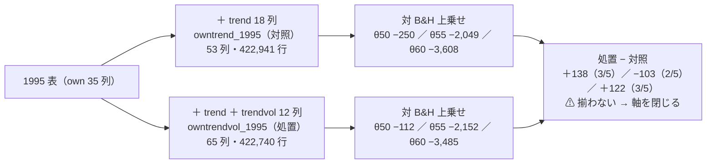

# 出来高を `trend` 層の隣に足して回した（記録）

- プラン: [volume-trend-input.md](../../plans/archive/volume-trend-input.md) ／ 調査: [volume-trend-ml.md](volume-trend-ml.md)（2026-09-12 の「保留（条件つきで採る）」の続き）
- 利用者の決定（2026-09-12）: **積極的に埋める方針で回す**（[rules.md 14-10](feature-discovery/rules.md)）
- 実施: 2026-09-17（titan・commit `696cf7b` ＋ 作業ツリーの変更）／ 実行 4 本（本番 2 ＋ leak 2）／ **n_trials 607 → 613（＋6）**

## 1. 結論

⚠ **出来高（長い窓の 4 列 × 3 スケール）を足しても、1 日ラベルの閾値売買は B&H に勝たず、価格だけの対照との差は fold 3/5 に留まった。**
⚠ **プラン §2-3 に先に書いた読み方どおり、「価格だけの入力の軸」は閉じる。** 処置は 3 水準とも「落とす」（対 B&H 上乗せが負）。

| 問い（プラン §2-3。⚠ 結果を見る前に固定） | 答え【実測 2026-09-17】 |
| --- | --- |
| 出来高は効いたか | ⚠ **処置 − 対照 の上乗せは θ=50 で ＋137.7bp（fold 3/5）・θ=55 で −103.0bp（2/5）・θ=60 で ＋122.4bp（3/5）。** 符号が揃わず、大きさは fold 間の散らばり（±400bp）の中 |
| 採否 | ⚠ **3 水準とも落とす**（対 B&H 上乗せ −112〜−3,485bp）。対照も同じく落とす |
| 価格だけの入力の軸を閉じられたか | ✅ **閉じる**（処置が対照を 5/5 で超えなかった） |

> この図の主張: 対照と処置は表が 12 列違うだけで、⚠ **選別・モデル・シミュレータ・基準線・物差しは同じ**。差は fold 3/5 で符号が揃わない。

## 2. 裁定（Phase 0）— B を選んだ理由

| 案 | 中身 | 判断 |
| --- | --- | --- |
| A 検知器 D1〜D4 に足す（元の決定） | 先 W 日ラベル。＋12 | ⚠ **測れない**（[theta-placement.md §2](theta-placement.md): θ ≥ 50 では出口が立たず保有日率 0.91〜0.95）。14-10 規約 1 が回さない理由として認める唯一のもの |
| **B 1 日ラベルの閾値売買の対** | own＋trend と own＋trend＋trendvol を Ridge (A) で。＋6 | ✅ **採用**。出口が立つ（保有日率 0.10〜0.69【実測】）ので対 B&H 上乗せで測れる |
| C 見送る | — | ⚠ 「可能性が低いから見送る」は 14-10 規約 1 が退ける |

⚠ **裁定は Claude が利用者の規約から決め、結果を見る前に TODO に書いた**（2026-09-17）。利用者が A の行も台帳に残したいなら、別の試行（＋12）として後から足す。

## 3. 何を作ったか

### 3-1. `trendvol` 層（`ail/features/trendvol.py`）

| 列（窓 W ∈ {20, 60, 200}） | 定義 | 由来 |
| --- | --- | --- |
| `own_trend{W}_vratio` | log(v ÷ v の W 日平均) | `own_vratio_*`（窓 5〜60）と同じ形を長い窓に |
| `own_trend{W}_dollar` | log((c × v) の W 日平均) | `own_dollar_20` と同じ形 |
| `own_trend{W}_updown` | log(上げ日の平均出来高 ÷ 下げ日の平均出来高)（窓 W） | 調査 §5 の「上げ日と下げ日の出来高比」 |
| `own_trend{W}_vslope` | log v を窓 W で 1 次回帰した傾き × W | `trend._slope` をそのまま使う |

- ⚠ **`trend` 層は 1 列も触っていない**（[rules.md 15-2 規約 2-2](feature-discovery/rules.md) を足した）。config の `feature_layers` に書いたときだけ表に入る。⚠ **既定の表の指紋は変わらない**（`tests/test_trading_run.py` の指紋テストが通ったまま）
- 名前を `own_trend{W}_` で始めたので `trend.scale_columns` が自動で拾う（窓 W の列が 6 → 10 本。`tests/test_trendvol.py`）。A を後から回すときもコードは変えない
- 出来高 0 の日は NaN（log の −∞ を表に入れない）。分割調整は済んだ表を読む（層で二重に直さない。定数倍で比の列が動かないことをテストで縛った）
- テスト 6 件（行数と並び・窓が i で閉じる・出来高 0・定数倍不変・`scale_columns` の本数・登録）

### 3-2. 表 2 つ・実験 2 つ

| | 対照 `owntrend_1995` ／ `trade_owntrend_1995_ridge_a` | 処置 `owntrendvol_1995` ／ `trade_owntrendvol_1995_ridge_a` |
| --- | --- | --- |
| `feature_layers` | own trend | own trend **trendvol** |
| 列 ／ 行 ／ 銘柄 | 53 ／ **422,941** ／ 63 | 65 ／ **422,740** ／ 63 |
| 期間 | 1995-08-31 〜 2026-09-04（`trend200` の助走 200 本。`own_1995` の 02-10 より遅い） | 同じ |
| 違う key（tomllib で照合） | — | `feature_layers`・`features_from`・`name` の 3 つだけ【実測】 |

⚠ **行が 201 行（0.05%）違う**: `updown` は窓内に上げ日か下げ日が無いと NaN、出来高 0 の日も NaN で、`cli.build` の `dropna` がその行を落とす。⚠ **対の差に「表の差」が 0.05% 混ざる**（B&H の純利が 4,624.84 と 4,621.12 で 3.7bp 違うのがそれ）。判定の量（上乗せ）は各表の B&H に対して取るので影響は 3.7bp の桁。

## 4. 結果【実測 2026-09-17】

### 4-1. 本番 2 本（全部使う × Ridge・(A) 共通・θ 3 水準）

| | θ | 純利 bp/fold | B&H 純利 | 対 B&H 上乗せ | fold の符号 | t | DSR | 取引/fold | 保有日率 |
| --- | ---: | ---: | ---: | ---: | --- | ---: | ---: | ---: | ---: |
| 対照（価格だけ） | 50 | ＋4,374.7 | ＋4,624.8 | **−250.1** | ＋＋−−＋ | −0.26 | 0.481 | 6,137 | 0.69 |
| | 55 | ＋2,575.5 | | **−2,049.4** | −−＋−− | −1.17 | 0.149 | 73 | 0.48 |
| | 60 | ＋1,017.1 | | **−3,607.8** | −−−−− | −2.49 | 0.319 | 12 | 0.10 |
| 処置（＋出来高） | 50 | ＋4,508.7 | ＋4,621.1 | **−112.4** | ＋＋−−＋ | −0.12 | 0.521 | 5,751 | 0.69 |
| | 55 | ＋2,468.7 | | **−2,152.4** | −−＋−− | −1.26 | 0.126 | 63 | 0.49 |
| | 60 | ＋1,135.7 | | **−3,485.4** | −−−−− | −2.37 | 0.290 | 12 | 0.10 |

- ⚠ **6 行とも「落とす」**（上乗せ ≤ 0。[rules.md 13-7](feature-discovery/rules.md)）
- 門（14-5。診断）: AUC 0.515 ／ 0.516、買い% の幅 4.0 ／ 4.4 点で **どちらも門前**。⚠ **門前でも回す既定どおり回し、普通に数えた**（14-10 規約 2）
- 乱択ゲートとの差（14-6 b）: θ=50 で対照 ＋1,119bp（＋＋＋−−）・処置 ＋1,226bp。選日の上乗せ S（[reverse-trading.md](feature-discovery/reverse-trading.md)）: ＋1,036 ／ ＋1,130（＋＋＋−＋）。⚠ **「腕はあるが、買って持つほうが儲かる」の形**で、出来高の有無で変わらない
- 保有日数（[holding-days.md](feature-discovery/holding-days.md)）: θ=50 で中央値 3 日（p25–p75 1–6）、**保有 1 日が 33%・2 日以下が 50%**（対照・処置とも）。θ=55・60 は取引が 1 銘柄 1 fold に 1 回前後で、中央値 241〜609 日・強制清算 45〜80%

### 4-2. 処置 − 対照（fold ごとの対 B&H 上乗せの差）

| θ | fold 1 | fold 2 | fold 3 | fold 4 | fold 5 | 平均 | 正の fold |
| ---: | ---: | ---: | ---: | ---: | ---: | ---: | :-: |
| 50 | −45.3 | ＋273.6 | ＋87.4 | ＋419.5 | −46.6 | **＋137.7** | 3/5 |
| 55 | −290.2 | −250.2 | −91.3 | ＋73.1 | ＋43.6 | **−103.0** | 2/5 |
| 60 | −87.5 | ＋501.4 | −145.5 | ＋24.8 | ＋318.6 | **＋122.4** | 3/5 |

⚠ **符号が揃わず、大きさは対照自身の fold 間の散らばり（−3,529〜＋2,171bp）の 1 桁下。** ⚠ **良い数字ではないので疑う場面にも至らない。**

### 4-3. leak 対照 2 本 — 跳ねた（配線は無事）

| | 上乗せ | fold | t | 保有日数の中央値 |
| --- | ---: | :-: | ---: | ---: |
| 対照 leak | ＋78,667bp | 5/5 | 13.08 | 2 日 |
| 処置 leak | ＋78,666bp | 5/5 | 13.06 | 2 日 |

⚠ **入力を 12 列増やしても跳ね方は同じ**（先読み列 1 本が支配する）。⚠ **逆売買の列は −86,600bp に跳ね下がった**（補集合の検査。[reverse-trading.md](feature-discovery/reverse-trading.md)）。

## 5. 判定と、この記録で言えないこと

| | |
| --- | --- |
| 判定 | **落とす**（6 行。上乗せ ≤ 0）。調査 §7 の「保留（条件つきで採る）」は ✅ **回して落とした** |
| 価格だけの入力の軸 | ✅ **閉じる**（処置が対照を 5/5 で超えない。プラン §2-3） |
| ⚠ 言えないこと | (1) **検知器（先 W 日ラベル）で出来高が効くか** — 測れない（§2 の A）。(2) **出来高が「効かない」** — 検出限界（[validation-power.md](feature-discovery/validation-power.md)。1995 表で 2.02bp/日）の下の差であり、「勝っていない」まで。(3) 一次情報が言う条件（断面・長短・小型株・低流動性）での効き — ここは銘柄ごと・買い専用・大型 63 本で、1 つも共有していない（調査 §4-3） |
| 台帳 | n_trials **607 → 613**（対で ＋6。⚠ 604 → 607 は同日の `midcap_ex` の期間の変化。[daily-data-sources.md §16-1](daily-data-sources.md)）。乱択・B&H・直前符号・leak は数えない |
| 費用 | 実装 半日 ／ 表の構築 2.9 分（4 表）／ 実行 4 本 1.4 分【実測】。資金は動かしていない |

⚠ **試行を増やしても採否は厳しくならない**（判定式に DSR は入らない。14-10）。この 6 行は「価格だけの軸を閉じた」ことの分母として残す（14-10 規約 5）。
