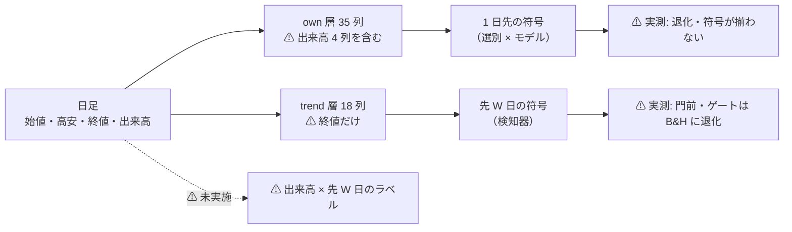
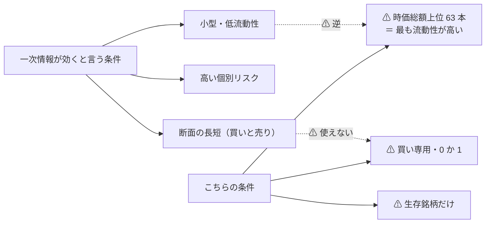
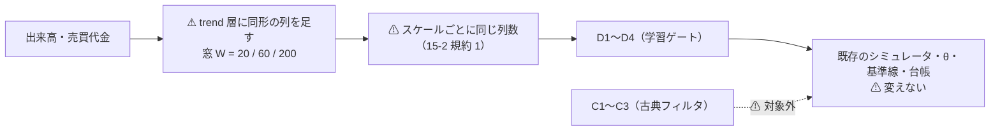

# 出来高を含めた機械学習でトレンドを判断できるか（調査）

- プラン: [volume-trend-ml.md](../../plans/archive/volume-trend-ml.md)
- 利用者の指示（2026-09-12）: **出来高も含んだデータから機械学習でトレンドを判断するようなものは作れるか調査して**
- 関連: [ts-trend-ai-survey.md](ts-trend-ai-survey.md)（⚠ **モデルの軸の調査で、入力の軸は扱っていない**）／ [entry-timing.md](entry-timing.md)（検出限界）／ [downtrend-detection.md](downtrend-detection.md)（学習ゲートが退化した実測）
- ⚠ **調査だけ。コードも `runs/` も台帳も触っていない。新しい試行は 0**

## 1. 結論

| 問い | 答え |
| --- | --- |
| 作れるか | ✅ **作れる。安い。** `trend` 層に出来高由来の列を足すだけで、⚠ **検知器の契約（買い% 1 本）もシミュレータも変えない** |
| 効く見込みは | ⚠ **一次情報は「効く」側、手元の実測は「効かない」側。** ⚠ **しかも一次情報が効くと言う条件が、この銘柄群と正反対** |
| 測れるか | ✅ **測れる。** トレンドの検知器は入口と出口を同時に動かすので、[entry-timing](entry-timing.md) が「測定可能域」と判定した側に入る |
| 多重検定の代償は | ✅ **小さい。** n_trials 160 → 172 で SR0 は **1.007 倍**【実測】 |
| 判定 | **保留（条件つきで採る）** — ⚠ **「効くか」ではなく「価格だけの入力が尽きているか」を決着させる 1 本として回すなら価値がある** |

⚠ **期待していい水準を先に書く**: 学習ゲートは ⚠ **AUC 0.50〜0.51・買い% の幅 0〜11 点**で門（0.52・20 点）に 7 本とも落ちた【実測】。
⚠ **出来高がこれを門の向こうへ押し上げる保証はどこにも無い。**

## 2. 空いている枠は 1 つだけ

> この図の主張: ⚠ **出来高は「表にある」と「使われている」の間で止まっている。** 空いているのは右下の 1 枠。

| 組み合わせ | 状態 |
| --- | --- |
| 価格 × 1 日先 | ✅ 実施済み（多数。⚠ **効かなかった**） |
| 出来高 × 1 日先 | ✅ 実施済み（`own` 層 35 列の中に混ざっていた。⚠ **効かなかった**） |
| 価格 × 先 W 日 | ✅ 実施済み（[downtrend-detection](downtrend-detection.md)。⚠ **門前**） |
| ⚠ **出来高 × 先 W 日** | ⚠ **未実施。この調査の対象** |

出来高由来の 4 列（[own.py](../../../experiments/feature-discovery/ail/features/own.py)）: `own_vratio_5` / `_20` / `_60`（出来高 ÷ 窓の平均出来高）と `own_dollar_20`（売買代金の 20 日平均）。

## 3. 手元の実測 — 出来高が入力に入っていた実行【実測 2026-09-12】

⚠ **外を見る前に手元を見た。** `own` 層 35 列（出来高 4 列を含む）を全部使った基準線の、対 B&H 上乗せ:

| 実行 | モデル | 上乗せ bp/fold | fold の符号 | t |
| --- | --- | ---: | --- | ---: |
| `trade_own_1995_ridge_a` | Ridge | ＋384.1 | ⚠ **＋0000** | 1.00 |
| `trade_own_ridge_a`（2018 表） | Ridge | ＋12.8 | 0＋−00 | 0.13 |
| `trade_own_lgbm_a`（2018 表） | LightGBM | −54.8 | 00−00 | −1.00 |

⚠ **符号の 0 は「B&H と 1 日も違わなかった fold」である。** 5 fold のうち 3〜4 fold が 0 ＝ ⚠ **手法が基準線に退化している。**
⚠ **＋384bp/fold も 1 fold だけの値**で、検出限界（4,500〜6,300bp/fold・[entry-timing §5](entry-timing.md)）の 1/12 に届かない。

⚠ **ただしこれは「1 日先の符号」を当てにいった実験である。** 出来高が効くとされる地平（数か月）とは違う。
⚠ **だから「出来高は効かない」の証拠にはならない。** 効かなかったのは ⚠ **地平と入力の組み合わせ**である。

### 3-1. トレンドの検知器はどれくらい信号が無かったか【実測 2026-09-12】

| 検知器 | AUC | 買い% の幅（点） | 門（AUC 0.52・幅 20 点） |
| --- | ---: | ---: | --- |
| D1 短期ゲート（20 日） | 0.5018 | ⚠ **0.0008** | ❌ |
| D2 中期ゲート（60 日） | 0.5123 | 10.62 | ❌ |
| D3 長期ゲート（200 日） | 0.5094 | 6.28 | ❌ |
| D4 合成ゲート | 0.5110 | 5.76 | ❌ |

⚠ **買い% の幅 0.0008 点は「確率が動いていない」という意味である。** D1 は 5 fold 中 3 fold でこの状態だった。
⚠ **これが「学習ゲートが B&H に退化した」ことの正体**であり、⚠ **出来高に期待するとしたらここを動かせるかどうかである。**

## 4. 一次情報

### 4-1. ⚠ 効く側の証拠

| 出典 | 何を言っているか | ⚠ こちらへの当てはまり |
| --- | --- | --- |
| [Gu, Kelly & Xiu（NBER w25398 / RFS 2020）](https://www.nber.org/papers/w25398) | 「**All methods agree on the same set of dominant predictive signals which includes variations on momentum, liquidity, and volatility.**」【公表値・2026-09-12 取得】 | ⚠ **liquidity（回転率・売買代金）が上位群に入る**。⚠ **ただし断面（銘柄間の順位）の話で、こちらは銘柄ごとの持つ / 休むである** |
| [Lee & Swaminathan（JF 2000）](https://econpapers.repec.org/RePEc:bla:jfinan:v:55:y:2000:i:5:p:2017-2069) | 過去の出来高がモメンタムの**大きさと持続**を予測する。「high (low) volume winners (losers) experience faster reversals」【公表値・2026-09-12 取得】 | ✅ **地平（数か月）とラベル（先 W 日の符号）が近い。** ⚠ **回転率と価格の相互作用**という形が示唆される |

⚠ **「価格モメンタムだけより年 2〜7% 上回る」という数字が二次要約に出てくるが、読めた抄録には入っていなかった**ので【推測】として扱う。

### 4-2. ⚠ 効かない側の証拠

> この図の主張: ⚠ **一次情報が「効く」と言う条件は、この銘柄群と正反対を向いている。**

| 出典 | 何を言っているか | ⚠ こちらへの当てはまり |
| --- | --- | --- |
| [McLean & Pontiff（JF 2016）](https://papers.ssrn.com/sol3/papers.cfm?abstract_id=2156623) | 82 の特性・68 論文を追試し、収益は **標本外で 26%・公表後で 58% 低下**。予測力は**個別リスクが高く流動性の低い**銘柄に集中する【公表値・要約経由・2026-09-12 取得。⚠ **本文は読めなかった**】 | ⚠ **二重に不利**。(1) 出来高 × モメンタムは 2000 年公表 ＝ 減衰の対象。(2) ⚠ **こちらの 63 銘柄は「流動性が最も高い」側**で、効きが最も薄いところ |
| [技術指標の予測力の追試（Springer 2023）](https://link.springer.com/article/10.1007/s11408-023-00433-2) | 先進国市場では技術的売買規則の優位は小さく、**時間とともに急速に減衰**し、**取引コストにきわめて敏感**【公表値・要約経由・2026-09-12 取得】 | ⚠ **出来高系の指標（OBV 等）もこの括りに入る。** ⚠ **こちらは米国大型株 ＝ 最も効きにくい側** |
| [DL によるトレンド予測の評価（arXiv:2408.12408）](https://arxiv.org/html/2408.12408v1) | ⚠ **出来高を入力に使っていない**（終値だけ）。⚠ **「出来高を試して駄目だった」ではなく「試していない」**【本文確認・2026-09-12】 | ⚠ **最近の評価が出来高を素通りしていることの実例。** 空白は本当に空白である |

### 4-3. ⚠ 読み方

⚠ **賛否が割れているのではない。条件が違う。**
出来高が効くという証拠は ⚠ **断面・長短・小型株・2000 年代前半**に集まり、こちらは ⚠ **銘柄ごと・買い専用・大型株・2000〜2025 年**である。
⚠ **効く条件をひとつも共有していない。**

## 5. 設計案（⚠ 実装はしない）

> この図の主張: ⚠ **足すのは入力だけ。物差しは 1 つも動かさない。**

| # | 決めごと | ⚠ 理由 |
| ---: | --- | --- |
| 1 | ⚠ **動かす軸は入力だけ。** スケール・ラベル・θ・形式・モデルは据え置き | ⚠ **2 つ動かすと「出来高が効いた」のか「別の何かが効いた」のか分からない**（13-2 規約 5 と同じ向き） |
| 2 | 列はスケールごとに同形（案: 出来高比・売買代金の対数・上げ日と下げ日の出来高比・出来高の傾き） | 15-2 規約 1。⚠ **列の顔ぶれが違うとスケールの差と読めなくなる** |
| 3 | ⚠ **対象は学習ゲート D1〜D4 だけ。** C1〜C3 は公表された価格の規則なので触らない | ⚠ **古典フィルタに出来高を足したら「公表された規則」ではなくなる** |
| 4 | ⚠ **数値は 1 つも手で置かない**（「出来高が平均の 2 倍で売り」のような閾値を書かない） | 14-9 |
| 5 | ⚠ **分割調整の向きに注意**（価格を割ったら出来高は掛ける） | [rules.md 分割調整](feature-discovery/rules.md)。⚠ **価格だけ直すと出来高の列が全部おかしくなる** |
| 6 | ⚠ **`--leak` の対照を必ず通す** | 7 章 規約 7。⚠ **入力を増やすと配線の穴も増える** |

## 6. コスト【推測】

| 項目 | 見積もり |
| --- | --- |
| 実装 | `ail/features/trend.py` に列を足す ＋ テスト。**半日** |
| 実行 | 既存の `trend_scales_1995` と同じ規模。**数分〜数十分（CPU）** |
| n_trials | D1〜D4 × θ 3 水準 ＝ **＋12**（160 → 172） |
| ⚠ **多重検定の代償** | ✅ **小さい。** SR0 は **1.0071 倍**【実測】（√ln N で効くため） |

## 7. 判定

**保留（条件つきで採る）。** → ✅ **2026-09-17 に回した（裁定 B: 1 日ラベルの閾値売買の対）→ 落とす。価格だけの入力の軸は閉じた**（[volume-trend-input.md](volume-trend-input.md)。処置 − 対照 の上乗せは fold 3/5・2/5・3/5 で揃わず、6 行とも対 B&H 上乗せが負）。⚠ **検知器（先 W 日ラベル）の側は 2026-09-13 に「測れない」と分かった**ので回していない（[theta-placement.md §2](theta-placement.md)）。

| 採る理由 | 落とす理由 |
| --- | --- |
| ⚠ **未実施の枠が 1 つだけ残っており、それがここ**（出来高 × 先 W 日） | ⚠ **一次情報が効くと言う条件を 1 つも共有していない**（§4-3） |
| 安い（半日・数分・＋12 試行・SR0 1.007 倍） | ⚠ **手元の実測は、出来高を含む 35 列でも基準線に退化した** |
| ⚠ **測れる側にある**（検知器は入口と出口を同時に動かす） | ⚠ **門を越える保証が無い。** 買い% の幅 0.0008 点から 20 点へは遠い |
| ⚠ **「価格だけの入力は尽きた」を言い切るのに要る 1 本** | 2000 年公表の効果で、公表後 58% 減衰の対象【公表値・要約経由】 |

⚠ **回すなら「効くはず」ではなく「入力の軸を閉じるため」と書いて回す。**
⚠ **結果を見てから理由を決めない**（14-5 規律 3 と同じ向き）。⚠ **回すと決めたら 12 試行を全部台帳に載せる。**

⚠ **順番についての注記**: [entry-timing](entry-timing.md) の Phase 0-1（回すかどうかの裁定）が未決である。
⚠ **どちらも「検知器を良くする」方向なので、先にどちらを回すかは利用者の裁定が要る。**

## 8. 出典（取得日はすべて 2026-09-12）

- [Gu, Kelly & Xiu, Empirical Asset Pricing via Machine Learning（NBER w25398）](https://www.nber.org/papers/w25398) ／ [RFS 33(5) 2223](https://academic.oup.com/rfs/article/33/5/2223/5758276)（⚠ **抄録は NBER 側で確認。RFS 側は 403**）
- [Lee & Swaminathan, Price Momentum and Trading Volume, JF 55(5) 2017-2069](https://econpapers.repec.org/RePEc:bla:jfinan:v:55:y:2000:i:5:p:2017-2069) ／ [本文 PDF](https://www.lsvasset.com/pdf/research-papers/Price-Momentum-Trad-Vol-2000.pdf)
- [McLean & Pontiff, Does Academic Research Destroy Stock Return Predictability?（SSRN）](https://papers.ssrn.com/sol3/papers.cfm?abstract_id=2156623)（⚠ **本文・抄録とも読めず、要約経由**）
- [技術的売買規則の予測力（Financial Markets and Portfolio Management 2023）](https://link.springer.com/article/10.1007/s11408-023-00433-2)（⚠ **要約経由**）
- [An Evaluation of Deep Learning Models for Stock Market Trend Prediction（arXiv:2408.12408）](https://arxiv.org/html/2408.12408v1)（⚠ **本文確認。出来高は使っていない**）
- 手元の実測: `runs/2026-09-11T22-50-47_trade_own_1995_ridge_a` ／ `runs/2026-09-10T20-04-53_trade_own_ridge_a` ／ `runs/2026-09-10T20-05-14_trade_own_lgbm_a` ／ `runs/2026-09-12T15-15-12_trend_scales_1995` の `checks.json`
