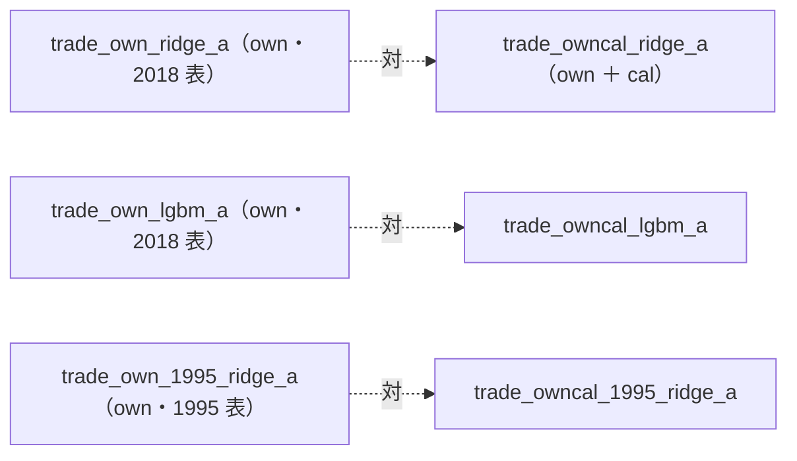
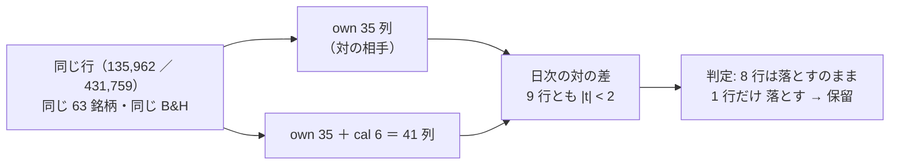

# 曜日を特徴量に入れる（`cal` 層）

利用者の指示（2026-09-17）「データに曜日を含めたものを検証する」。[プラン](../../plans/archive/weekday-feature.md)。

## 0. 状態

**2026-09-19: 実行して記録した（§3）。結論: 曜日の列を足しても、対の相手との差は 9 行とも検出限界の下。8 行は「落とす」のまま、1 行（1995 表・Ridge・θ=50）が「落とす → 保留」に変わったが、差は ＋0.14bp/日（t ＋1.31）で「効いた」とは言えない。** この文書の §1 は ⚠ **結果を見る前に書いた事前登録**で、実行の後に書き換えていない。

## 1. 事前登録（2026-09-18・結果を見る前）

**主張: 変えるのは表だけ。同じモデル・同じ θ・同じ期間の行と対にして読む。**



| 項目 | 決めたこと |
| --- | --- |
| 回すか | **回す**（rules.md 14-10 規約 1。可能性が低いことは回さない理由にならない） |
| 足す列（6 本） | `cal_dow_mon`〜`cal_dow_fri`（足 i の日付の曜日の one-hot）・`cal_gap_prev`（前の足からの暦日数。ふつう 1・週明け 3・連休明け 4 以上）。⚠ 数値は 1 つも手で置いていない（14-9） |
| ラベルとの向き | `y` は足 i の終値 → 足 i+1 の終値。⚠ **週末をまたぐリターンは金曜の行**（`cal_dow_fri` ＝ 1）に出る |
| 入れないもの | 次の足までの日数（連休の前か）。暦からは前もって分かるが、表の上では `ts.shift(-1)` でしか作れない（rules.md 7 章）。月末・月初・祝日前後も入れない（指示は曜日。足すなら別の試行として先に登録する） |
| 水準 | 3 本: Ridge × 2018 表 ／ LightGBM × 2018 表 ／ Ridge × 1995 表。形式は (A) 共通・θ = 50 / 55 / 60（既存の行と同じ。13-3） |
| なぜこの 3 本か | Ridge は曜日を足し算でしか使えない（曜日ごとに買い% を上下させるだけ）。LightGBM は曜日 × 値動きの組み合わせを拾える。1995 表は検出限界が 2.02bp/日 と一番小さい |
| n_trials | 台帳の鍵「特徴量の層」が `own cal` になる新しい行 ＝ 3 本 × θ 3 ＝ **＋9**（613 → 622 の見込み。⚠ GAN の後始末で 613 が動いていないことを確かめてから）。leak 対照は数えない |
| leak 対照 | 3 本とも自動で並ぶ（`leak = true`）。跳ねなければ配線の穴 |
| 表の検算 | ✅ `owncal_2018` 135,962 行 ／ `owncal_1995` 431,759 行 ＝ 基準の表（`own_2018`・`own_1995`）と**同じ行数**【実測 2026-09-18】。特徴量は 35 → 41 本。⚠ `cal_gap_prev` の最初の行の NaN は `own_` の助走 60 本の中に入るので、行は 1 つも減らない |
| 読み方 | (1) 対 B&H 上乗せの fold の符号（13-7 の判定）(2) 橋渡し対の差は**日次**で、同じ日の対の差として読む（14-4。fold の bp を跨いで比べない）(3) 診断: LightGBM が `cal_` を使ったか（重要度）・曜日別の保有率 |
| 予想【推測】 | 差は検出限界より小さく、3 本とも判定は対の相手と同じになる見込み。⚠ 予想が外れても水準は足さない・動かさない |
| 限界 | `cal_` は全銘柄で同じ値なので銘柄を区別しない。効くとしても「その日に全体として張るか」にだけ効く（(A) 共通の形式なら買い% が日ごとに全銘柄で揃って動く） |

## 2. 実行の手順（Phase 2）

```bash
cd experiments/feature-discovery
# 表は 2026-09-18 に作成済み（data/features/owncal_{2018,1995}{,_leak}/）。作り直すなら:
#   for e in owncal_2018 owncal_1995; do .venv/bin/python -m cli.build --experiment $e; .venv/bin/python -m cli.build --experiment $e --leak; done
.venv/bin/python -m cli.queue --config weekday        # 3 本 ＋ leak 3 本。見積り 10 分【推測】
.venv/bin/python -m cli.report --catalog               # 台帳を 1 回吐く（n_trials 613 → 622 を確かめる）
```

## 3. 結果【実測 2026-09-19】

キュー `weekday` は 09:26〜09:27 に 6 本（本物 3 ＋ leak 3）が done（合計 71 秒・失敗 0。見積り 10 分【推測】よりずっと短い）。commit `3b28a31`（⚠ 作業ツリーには未コミットの差分があったが、`cli.run` の経路では `ail/config.py` に関数を 1 つ足しただけで挙動は同じ。指紋テストを含む 431 本が通っている）。
対の相手は較正 `std` の一番新しい実行（`2026-09-13T08-57-34_trade_own_ridge_a`・`2026-09-13T08-57-48_trade_own_lgbm_a`・`2026-09-12T20-40-06_trade_own_1995_ridge_a`）。

**主張: 変えたのは表の 6 列だけで、行・銘柄・B&H は対の相手と 1 ビットも違わない。差は全部 `cal_` の 6 列から来ている。**



### 3-1. 対 B&H 上乗せ（fold 累計 bp。13-7 の判定）

| 実行 | θ | 上乗せ 旧（own）→ 新（own ＋ cal） | fold の符号 旧 → 新 | 判定 旧 → 新 |
| --- | ---: | --- | --- | --- |
| Ridge × 2018 | 50 | −270.9 → −250.0 | −＋−−＋ → −＋−−＋ | 落とす → 落とす |
| | 55 | −540.2 → −459.3 | −＋−−− → −＋−−− | 落とす → 落とす |
| | 60 | −943.7 → −1,008.7 | ＋−−−− → −−−−− | 落とす → 落とす |
| LightGBM × 2018 | 50 | −142.1 → −417.5 | 0＋−−− → −＋−−− | 落とす → 落とす |
| | 55 | −417.3 → −866.7 | 0＋−−＋ → −−−−− | 落とす → 落とす |
| | 60 | −1,254.6 → −722.8 | −−−−− → ＋−−−− | 落とす → 落とす |
| Ridge × 1995 | 50 | ⚠ **−4.4 → ＋178.4**（t −0.00 → ＋0.15） | ＋＋−−＋ → ＋＋−−＋ | ⚠ **落とす → 保留** |
| | 55 | −1,791.2 → −1,751.7 | ＋−＋−− → ＋＋＋−− | 落とす → 落とす |
| | 60 | −3,310.1 → −3,124.2 | −−−−− → −−−−− | 落とす → 落とす |

行数（135,962 ／ 431,759）・銘柄（63）・B&H の純利（1,652.02 ／ 4,615.89bp）は対の相手と一致【実測】。特徴量は 35 → 41 本。

### 3-2. 橋渡し対の差（日次・同じ日の対の差。14-4）

「全部使う × モデル」の日次の純利の差（新 − 旧）。n は 2018 表 1,801 日・1995 表 6,619 日（対の相手と同じ日付が全部揃う）。

| 実行 | θ=50 | θ=55 | θ=60 |
| --- | --- | --- | --- |
| Ridge × 2018 | ＋0.06bp/日（t ＋0.41） | ＋0.22（＋0.91） | −0.18（−0.90） |
| LightGBM × 2018 | −0.76（−1.47） | −1.25（−1.85） | ＋1.48（＋0.73） |
| Ridge × 1995 | ＋0.14（＋1.31） | ＋0.03（＋0.23） | ＋0.14（＋0.92） |

⚠ **9 行とも |t| < 2。向きも揃わない**（Ridge × 2018 は ＋＋−、LightGBM は −−＋、1995 は ＋＋＋だが最大でも ＋0.14bp/日）。⚠ **t は日次の差を独立とみなした素朴な値**で、保有が続く日は差も続くので実際はもっと小さい側に寄る【推測】。
⚠ **検出限界（1995 表で 2.02bp/日。[validation-power.md](feature-discovery/validation-power.md)）に対し、一番大きい差でも LightGBM の 1.5bp/日**。1995 表の差は検出限界の 1/14 以下。

### 3-3. 判定が変わった 1 行の読み

⚠ **1995 表・Ridge・θ=50 の「落とす → 保留」は、上乗せの平均が 0 を跨いだだけである。** 旧 −4.4bp → 新 ＋178.4bp（fold 1 本 ≒ 1,324 日の累計。日次に直すと ＋0.14bp/日）。fold の符号列は ＋＋−−＋ のまま 1 つも動いておらず、t は ＋0.15。
⚠ **もともと 0 の真上にいた行が、6 列足したぶんの揺れで反対側に出た**（[daily-data-sources.md §16-3](daily-data-sources.md) の `trade_ownex_lgbm_a` θ=50 の「保留 ↔ 落とす」と同じ形）。⚠ **「保留」は「採るの一歩手前」ではない**（多重検定を通していない。台帳の注記どおり）。DSR は 0.61 → 0.57（n_trials が 280 → 622 に増えたぶん下がった）。
事前登録の予想（「3 本とも判定は対の相手と同じ」）は ⚠ **この 1 行で外れた**。ただし外れ方は「差が検出限界より小さい」という予想の本体とは矛盾しない。⚠ **水準は足さない・動かさない**（§1 のとおり）。

### 3-4. leak 対照 — 跳ねた（配線は無事）

| 実行 | 上乗せ（θ=50） | fold |
| --- | ---: | --- |
| `trade_owncal_ridge_a_leak` | ＋22,194.6bp（t ＋17.1） | 5/5 |
| `trade_owncal_lgbm_a_leak` | ＋22,190.1bp（t ＋17.1） | 5/5 |
| `trade_owncal_1995_ridge_a_leak` | ＋81,365.3bp（t ＋11.3） | 5/5 |

### 3-5. 診断（採否には使わない）

**(1) 曜日別の保有率**（「全部使う」・日次の `hold` の曜日平均）。⚠ **Ridge の θ=50 だけ、曜日で少し揺れるようになった**（足し算でしか使えないので、曜日ごとに買い% が上下する ＝ §1 の見立てどおり）。

| 実行（θ=50） | 月 | 火 | 水 | 木 | 金 | 最大 − 最小 |
| --- | ---: | ---: | ---: | ---: | ---: | ---: |
| Ridge × 2018 旧 | 0.703 | 0.721 | 0.729 | 0.732 | 0.734 | 0.031 |
| Ridge × 2018 新 | 0.695 | 0.732 | 0.743 | 0.722 | 0.741 | 0.048 |
| LightGBM × 2018 旧 | 0.802 | 0.788 | 0.777 | 0.772 | 0.774 | 0.030 |
| LightGBM × 2018 新 | 0.799 | 0.790 | 0.777 | 0.776 | 0.782 | 0.023 |
| Ridge × 1995 旧 | 0.685 | 0.694 | 0.697 | 0.707 | 0.708 | 0.023 |
| Ridge × 1995 新 | 0.674 | 0.703 | 0.693 | 0.662 | 0.709 | 0.047 |

θ=55・60 の曜日の差（最大 − 最小）は新旧とも 0.003〜0.024 で、`cal_` を足して広がった行は無い（LightGBM θ=55 は 0.024 → 0.013、θ=60 は 0.013 → 0.017）。⚠ **揺れが出ても損益の差にはなっていない**（3-2）。

**(2) LightGBM は `cal_` をほとんど使わなかった。** 実行は木の重要度を残さないので、⚠ **診断のためだけに同じ設定（`ail/models/trees.py`）で 1 回 fit した**（`owncal_2018` の表の古い側 8 割・成績は測っていない ＝ 試行ではない）。497 本の木で、`cal_` 6 列の合計は **分岐の回数の 2.2%・利得の 2.7%**。重要度の順位は 41 列中 **34〜39 位**（6 列とも下位 8 位の中）。⚠ 0/1 の列は連続値の列より分岐の候補が少ないので、割合が小さいこと自体は割り引いて読む。それでも「曜日 × 値動きの組み合わせを拾う」ほどには使われていない。

### 3-6. 台帳

吐き直した。⚠ **n_trials 613 → 622（＋9。事前登録どおり）**。`cal` 以外の行は、集計の文（試行・基準線・落とす・保留の数）と実行数を除いて 1 行も変わらない【実測】。落とす 535 → 543（＋8）・保留 78 → 79（＋1）。基準線 377 → 398 行。
⚠ **代償**: 既存の全行の DSR が n_trials ＋9 のぶんだけわずかに厳しくなる（判定式に DSR は入らないので、採否は変わらない。rules.md 14-10）。

### 3-7. 結論

**曜日の列（`cal_` 6 本）は、この 3 構成では予測に情報を足していない。** 差は 9 行とも検出限界の下で向きも揃わず、LightGBM は列をほとんど使わず、Ridge は曜日で保有を少し揺らしただけで損益は変わらなかった。⚠ **「曜日に効果が無い」ことの証明ではない**（検出限界より小さい効果は見えない。§1 の限界のとおり `cal_` は銘柄を区別しない）。月末・月初・祝日前後・連休の前は試していない（足すなら別の試行として先に登録する）。
