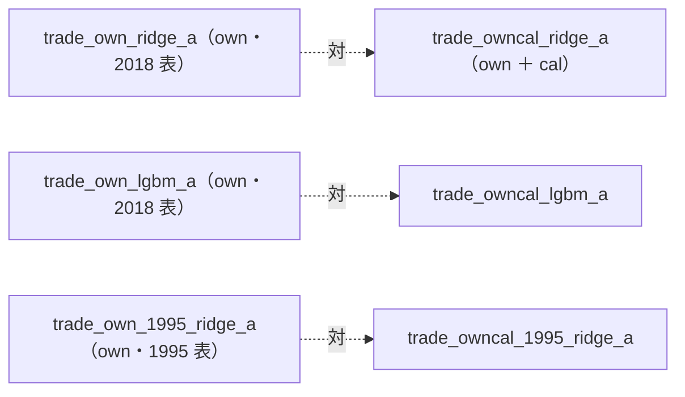

# 曜日を特徴量に入れる（`cal` 層）

利用者の指示（2026-09-17）「データに曜日を含めたものを検証する」。[プラン](../../plans/weekday-feature.md)。

## 0. 状態

**2026-09-18: 準備まで済み。実行はまだ**（GAN × ownex の後始末 ＝ 台帳の検算の後に回す）。この文書の §1 は ⚠ **結果を見る前に書いた事前登録**で、実行の後に書き換えない（結果は §2 以降に足す）。

## 1. 事前登録（2026-09-18・結果を見る前）

**主張: 変えるのは表だけ。同じモデル・同じ θ・同じ期間の行と対にして読む。**



| 項目 | 決めたこと |
| --- | --- |
| 回すか | **回す**（rules.md 14-10 規約 1。可能性が低いことは回さない理由にならない） |
| 足す列（6 本） | `cal_dow_mon`〜`cal_dow_fri`（足 i の日付の曜日の one-hot）・`cal_gap_prev`（前の足からの暦日数。ふつう 1・週明け 3・連休明け 4 以上）。⚠ 数値は 1 つも手で置いていない（14-9） |
| ラベルとの向き | `y` は足 i の終値 → 足 i+1 の終値。⚠ **週末をまたぐリターンは金曜の行**（`cal_dow_fri` ＝ 1）に出る |
| 入れないもの | 次の足までの日数（連休の前か）。暦からは前もって分かるが、表の上では `ts.shift(-1)` でしか作れない（rules.md 7 章）。月末・月初・祝日前後も入れない（指示は曜日。足すなら別の試行として先に登録する） |
| 水準 | 3 本: Ridge × 2018 表 ／ LightGBM × 2018 表 ／ Ridge × 1995 表。形式は (A) 共通・θ = 50 / 55 / 60（既存の行と同じ。13-3） |
| なぜこの 3 本か | Ridge は曜日を足し算でしか使えない（曜日ごとに買い% を上下させるだけ）。LightGBM は曜日 × 値動きの組み合わせを拾える。1995 表は検出限界が 2.02bp/日 と一番小さい |
| n_trials | 台帳の鍵「特徴量の層」が `own cal` になる新しい行 ＝ 3 本 × θ 3 ＝ **＋9**（613 → 622 の見込み。⚠ GAN の後始末で 613 が動いていないことを確かめてから）。leak 対照は数えない |
| leak 対照 | 3 本とも自動で並ぶ（`leak = true`）。跳ねなければ配線の穴 |
| 表の検算 | ✅ `owncal_2018` 135,962 行 ／ `owncal_1995` 431,759 行 ＝ 基準の表（`own_2018`・`own_1995`）と**同じ行数**【実測 2026-09-18】。特徴量は 35 → 41 本。⚠ `cal_gap_prev` の最初の行の NaN は `own_` の助走 60 本の中に入るので、行は 1 つも減らない |
| 読み方 | (1) 対 B&H 上乗せの fold の符号（13-7 の判定）(2) 橋渡し対の差は**日次**で、同じ日の対の差として読む（14-4。fold の bp を跨いで比べない）(3) 診断: LightGBM が `cal_` を使ったか（重要度）・曜日別の保有率 |
| 予想【推測】 | 差は検出限界より小さく、3 本とも判定は対の相手と同じになる見込み。⚠ 予想が外れても水準は足さない・動かさない |
| 限界 | `cal_` は全銘柄で同じ値なので銘柄を区別しない。効くとしても「その日に全体として張るか」にだけ効く（(A) 共通の形式なら買い% が日ごとに全銘柄で揃って動く） |

## 2. 実行の手順（Phase 2）

```bash
cd experiments/feature-discovery
# 表は 2026-09-18 に作成済み（data/features/owncal_{2018,1995}{,_leak}/）。作り直すなら:
#   for e in owncal_2018 owncal_1995; do .venv/bin/python -m cli.build --experiment $e; .venv/bin/python -m cli.build --experiment $e --leak; done
.venv/bin/python -m cli.queue --config weekday        # 3 本 ＋ leak 3 本。見積り 10 分【推測】
.venv/bin/python -m cli.report --catalog               # 台帳を 1 回吐く（n_trials 613 → 622 を確かめる）
```

## 3. 結果

（未実施）
