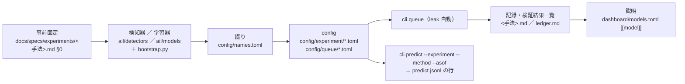
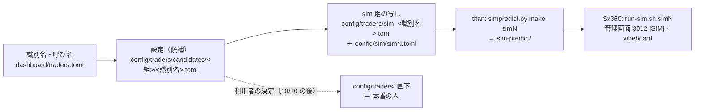

# 手順書: 新しい予測モデルを足す ／ 複数の予測モデルを持つトレーダーを足す

2026-09-27 に骨組みを書いた（[プラン](../plans/new-model-trader.md) Phase 1）。⚠ **実例で 1 度通すまでは骨組み**（各手順の実測の時間・落ちたテストと直し方は Phase 6 で入れる。入れる前の欄は「—」）。

## 0. この手順書の範囲

- 書くのは **「どこに何を書くか・何を流すか・何が落ちるか」**だけ。しくみの説明（モデルが何を見て点を出すか・トレーダーが何を決めるか・1 日の流れ）は vibeboard の「システム説明」タブ（`dashboard/system.toml`）が正本で、ここには書かない
- 対象は **titan で作って Sx360 で通すところまで**。本番（13500t）に人やモデルを入れるかは利用者が別に決める（[live-trading.md §0-15](experiments/live-trading.md) C11 ＝ いまの人は編集せず新しい識別名の新しい人を作る・10/20 の判定の後）。入れるときの決めごとはプラン §2 K7
- ⚠ **守るもの**（この手順書に沿っても外せない）
  - モデル・θ（売買基準値）・合成規則・銘柄・`sizing` を替えるのは**新しい検証** ＝ `n_trials` に数える・回すと決めるのは結果を見る前（[rules.md 14-9・14-10](experiments/feature-discovery/rules.md)）・基準線を最初から置く（17-7 の教訓）
  - **10/20 の判定までは執行器（`run_day.py`・`trader.py`・`signals.py`・`plan.py`）を変えない**。設定・研究側のコード・管理画面・vibeboard は変えてよい。執行器を変えたくなったらプラン §7 に溜める
  - 説明の正本は TOML（`dashboard/models.toml`・`traders.toml`・`system.toml`）。説明を Python に書かない
  - 損益で手法を採らない。実例の人の成績は判定に混ぜない（sim の記録は `test = true`）

### 機械の役割

| 機械 | ここでやること | やらないこと |
| --- | --- | --- |
| **titan** | 研究用の `data/` と GPU で回す全部（1 章）。`cli.predict` の確認・`simpredict.py make`・vibeboard の確認（3010） | 本番の発注（印 `NOT_PRODUCTION` あり） |
| **Sx360** | `sim-predict/` を写して `run-sim.sh simN`・管理画面 3012 の確認（2 章の 4〜5） | 研究の計算（GPU なし） |
| **13500t** | ⚠ **触らない**（本番） | — |

## 1. 新しい予測モデルを足す（titan）

> この図の主張: 新しいモデルは「研究の config」から入り、検証結果一覧と `models.toml` を経て `predict.jsonl` の 1 行になる。手順はこの矢印の順に並んでいる。



作業は `experiments/feature-discovery/` の中で。Python は `.venv/bin/python`。

| # | やること | 場所 | 落ちるテスト ／ 止まるもの | 実測（Phase 6） |
| --- | --- | --- | --- | --- |
| 1-1 | **事前固定を書く**: 試す形・数・θ ＝ {50, 55, 60}・地平（学習の対象と損益の対象。[15-3](experiments/feature-discovery/rules.md)）・基準線（モデルを使わない並べ方も）・採否の物差し・見立て | `docs/specs/experiments/<手法>.md` §0（新規） | —（人が守る。14-9・14-10） | — |
| 1-2 | **検知器 ／ 学習器を書く**: 検知器は `@register("detector", "<登録名>")`（契約は [14-1](experiments/feature-discovery/rules.md) ＝ 買い% を返す。出口も返すなら [16 章](experiments/feature-discovery/rules.md) の対）。学習器は `@register("model", "<登録名>")`。⚠ 登録名は記録の識別項目 ＝ 一度付けたら変えない | `ail/detectors/<x>.py` ／ `ail/models/<x>.py`。`ail/bootstrap.py` に import を 1 行 | 「registry に無い」（bootstrap に足し忘れ） | — |
| 1-3 | **綴りを 1 行足す**（予測モデル名の部品。英小文字・数字・`-`。一意） | `config/names.toml` の `[method]`（検知器・選び方）／ `[learner]`（学習器） | `tests/test_names.py`・`cli.report --catalog`・queue の検証結果一覧の書き出し（一覧に無い名前が出ると止まる） | — |
| 1-4 | **config を書く**（既存の表を `features_from` で読む ＝ 表を作り直さない。`thresholds = [50, 55, 60]`・`horizon = 1`。先を当てるなら `label_scales` ＋ `horizon_min` ＝ ⚠ **`y_fwd_W` の列が要るので既存の表を `features_from` で読めない。表の持ち主を 1 本作り直し、ほかはそれを `features_from` で読む**〔[forward10-target.md §5](experiments/forward10-target.md)〕。⚠ TOML の平の項目はテーブル見出しより上） | `config/experiment/trade_<表>_<x>_a.toml`（雛形 `trade_own_ridge_a.toml`） | `config.resolve_experiment`（読めない config はここで止まる） | — |
| 1-5 | **queue を書いて回す**（`leak = true` を切らない・`ledger = false` にして終わってから 1 回吐く・`time_budget_s` は見積りの 4 倍） | `config/queue/<x>.toml` → `.venv/bin/python -m cli.queue --config <x>`（⚠ 背景で回すなら `setsid nohup`） | `runs/research.sqlite` の `queue_state`（途中で落ちても再開できる） | — |
| 1-6 | **検証結果一覧を吐き、記録を書く**（結果・判定・`n_trials` の前後。⚠ 回したものは全部数える。⚠ 表の終わりが既存の表と違うと、基準線の行〔常に上 ／ 直前リターンの符号〕に「⚠ N 実行・幅 …bp」の印が付く ＝ 計算の変更ではないので記録に理由を書く〔[forward10-target.md §4](experiments/forward10-target.md)〕） | `.venv/bin/python -m cli.report --catalog` → `ledger.md`・`ledger_rows`。記録は 1-1 の文書に §1 以降 | — | — |
| 1-7 | **執行器が読める形を確かめる**（1 日ぶんの `predict.jsonl` の行が出ること。`--asof` は日足のある営業日） | `.venv/bin/python -m cli.predict --experiment <名前> --method "<登録名>" --asof <日付> --out /tmp/p.jsonl` | `tests/test_predict.py`（新しい形が要るなら 1 本足す。⚠ `cli.build.assemble`・`cli.run.fold_buy_pct` を触ったら指紋テスト `tests/test_trading_run.py`） | — |
| 1-8 | **説明を書く**（`[[model]]` 1 つ ＝ `id`・`name`・`method`・`formal`・`traits`〔必ず `basis`〕・`sees`・`flow`・`sets`・`history`〔`names` のパターン〕・`records`・`configs`。やさしい言葉・比較しない・数字を書かない。欄の意味は `models.toml` の頭のコメントと [dashboard.md §17-4](dashboard.md)） | `dashboard/models.toml` | `cd dashboard && .venv/bin/python -m pytest -q tests/test_models_tab.py tests/test_traders_tab.py tests/test_system_tab.py`（⚠ `history.names` の数は titan の DB と同じでないと落ちる） | — |

⚠ 深層学習（GPU）のモデルは 1-2 で `ail/detectors/seqmodel.py`（PatchTST の検知器）を雛形にする。依存は titan の `.venv` にだけ足す（13500t のイメージには入れない ＝ 本番に入れると決めるまで）。

## 2. 複数の予測モデルを持つトレーダーを足す

> この図の主張: 人は `[[models]]` で `predict.jsonl` の行を束ねるだけで、執行器は 1 行も変えない。候補の置き場から本番の直下へ写すのは利用者の決定。



作業は `experiments/live-trading/` の中で。

| # | やること | 場所 | ⚠ | 実測（Phase 6） |
| --- | --- | --- | --- | --- |
| 2-1 | **識別名・呼び名・銘柄を選んだ理由を書く**（識別名は新しく・変えない。呼び名は意味の無い名前・使い回さない ＝ ⚠ 利用者が選ぶ） | `dashboard/traders.toml` の `[nicks]`・`[symbols_why]` | 呼び名の無い人は識別名だけで出る | — |
| 2-2 | **設定を書く**: `[[models]]` × N（`kind = "experiment"`・`name` ＝ 実験名・`method` ＝ 登録名）・`combine`・`threshold` ≥ 50・`budget_usd`・`symbols`・`sizing = "shares"`・`test = false` | `config/traders/candidates/<組>/<識別名>.toml`（複数モデルの人は `candidates/multi/`） | 下の「合成規則の決まり」。⚠ **同じ実験名の違う手法を 1 人で 2 本持てない**（`signals.py` は実験名 × 銘柄で行を引く）。予算の合計 ≤ $1,000（`run_day.py` の既定の上限） | — |
| 2-3 | **sim 用の写しと筋書きを書く**（`test = true`・名前は `sim_` 始まり。`config/sim/simN.toml` の `traders` に並べる。雛形 `sim4.toml`） | `config/traders/sim_<識別名>.toml`・`config/sim/simN.toml` | `sim_` で始まらない人は `simdata` が拒む | — |
| 2-4 | **作り置き → 写す → 通す**: titan で `python simpredict.py make simN`（研究用の `data/` を読むだけ）→ `sim-predict/` を Sx360 へ写す → Sx360 で `./run-sim.sh simN --fresh --speed max` | titan → Sx360 | 1 日でも作り置きが欠けると運転手は rc=2。⚠ titan で `run-sim.sh` を流すなら作業用の置き場（本物の `MODE` に触らない） | — |
| 2-5 | **見る**: 管理画面 3012 の帯 `[SIM]`・トレーダーの段に新しい人 ／ vibeboard のトレーダーのタブに「（候補）」・予測モデルのタブの「いま使っている」 | ブラウザ | 本番の管理画面（13500t）には出ない | — |
| 2-6 | **テストと記録**: 人が読めること（`test_trader.py`）・作り置き（`test_simpredict.py`）・管理画面（`dashboard/tests/`）。候補の人の表を `live-trading.md` §0-1 の下に、sim の記録を §0-7 (k) に | `experiments/live-trading/tests/`・`dashboard/tests/`・[live-trading.md](experiments/live-trading.md) | `./run-tests.sh --full` で黄金の集計値が**変わらない**こと ＝ 執行器を変えていない証拠 | — |
| 2-7 | **本番に入れる**（⚠ 利用者の決定。この手順書の外） | `config/traders/` 直下へ写す・13500t の `live.env` の `AIL_LIVE_TRADERS`・予算の上限・`bench_predict.py` で予測の時間 | 10/20 の後・C11・プラン §2 K7 | — |

### 合成規則の決まり（`trader.py` の `COMBINE_RULES`。⚠ 執行器は変えない）

| `combine` | 買い% | 出口% | 使える本数 |
| --- | --- | --- | --- |
| `asis` | そのまま | そのまま | 1 本だけ |
| `mean` | 平均 | 平均 | 2 本以上 |
| `majority` | θ 超えが過半なら 100、でなければ 0 | 同じ | 奇数本 |
| `unanimous` | min（全員が θ 超えのときだけ買う） | max（1 本でも θ 超えなら売る） | 2 本以上 |

- **出口だけを言うモデル（損切りなど）は買い% を常に 100 で返し、`unanimous` で合わせる**（2026-09-27 利用者決定 K2）＝ 買いは主モデル・売りはどちらかが言ったら。⚠ `mean` に入れると買い% が半分になって使えない。⚠ 主モデルを 2 本以上入れると「全員が θ 超え」が買いの条件になる（意味が変わる）
- 損切りモデルが買値を知る形（形 B）は執行器の変更が要る ＝ 10/20 の後（プラン §7 の道 1）。それまでに机上で載るのは買値を知らない形 A

### 設定の例（実例 A `T4`。書いたら差し替える）

```toml
name = "T4"
test = false
budget_usd = 300.0
symbols = ["T", "PFE", "NKE", "VZ", "BAC"]
sizing = "shares"
combine = "mean"
threshold = 50.0

[[models]]
kind = "experiment"
name = "trade_own_ridge_a"
method = "全部使う（基準）"

[[models]]
kind = "experiment"
name = "trade_ownex_lgbm_a"
method = "全部使う（基準）"

[[models]]
kind = "experiment"
name = "trade_ownseq_ridge_a"
method = "T3 QUANT（60日窓）"
```

## 3. 実例（Phase 2〜5 で埋める）

| 実例 | 何 | 記録 | 状態 |
| --- | --- | --- | --- |
| 先 10 営業日を当てにいくモデル | 見る数字 3 組 × 学習器 2 × θ 3 ＝ 18 検証（K4） | `docs/specs/experiments/forward10-target.md` | 未着手 |
| 損切りをモデルとして扱う | 形 A（規則の出口・学ぶ出口）と形 B（机上のみ）・基準線（K3） | `docs/specs/experiments/stoploss-as-model.md` | ✅ 2026-09-27 回した（33 検証とも落とす。1-1〜1-7 を通した。手順書に足す注意は記録 §5） |
| 深層学習の型 2 本 | Chronos-2 zero-shot（共変量あり ／ なし）・TimeXer（K5） | `docs/specs/experiments/exog-deep-models.md` | 未着手 |
| 実例 A `T4`（ハル） | いまの 3 本を `mean`・θ 50 | `live-trading.md` §0-1・§0-7 (k)（sim5） | 未着手 |
| 実例 B `T5`（ミオ） | 主モデル ＋ 損切りモデルを `unanimous` | 同上 | 未着手（Phase 2-2 の後） |

## 4. 落ちたテストと直し方（Phase 6 で埋める）

| 手順 | 落ちたもの | 原因 | 直し方 |
| --- | --- | --- | --- |
| — | — | — | — |

## 5. 関連

- プラン: [new-model-trader.md](../plans/new-model-trader.md)（決めごと K1〜K8 は §2・10/20 の後に回す案は §7）
- 予測モデル名の規約: [rules.md 10-2](experiments/feature-discovery/rules.md)。検知器の契約: 14-1・16 章。事前固定: 14-9・14-10
- トレーダーの定義と合成規則: [live-trading-three-models.md §2-1](../plans/live-trading-three-models.md)。3 人の設定: [live-trading.md §0-1](experiments/live-trading.md)。sim3 ／ sim4 の作り置き: §0-7 (k)
- 説明の書き方: [dashboard.md §16-3・§17-4](dashboard.md)（トレーダー・予測モデルのタブ）
