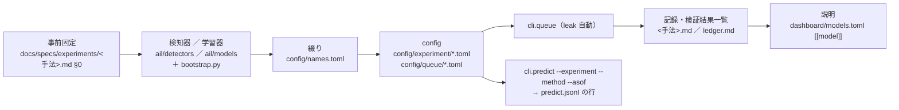
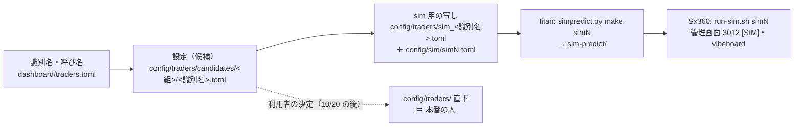

# 手順書: 新しい予測モデルを足す ／ 複数の予測モデルを持つトレーダーを足す

2026-09-27 に骨組みを書き（[プラン](../plans/archive/new-model-trader.md) Phase 1）、✅ **2026-09-29 に実例で 1 度通して実測を入れた**（Phase 6。モデル 3 系統 ＝ 1 章を 3 度・候補の人 2 人 ＝ 2 章を 1 度・sim5）。✅ 2-4 の「`sim-predict/` を Sx360 へ写して Sx360 で通す」は 2026-09-30（sim5）・2026-10-01（sim6）に済んだ（titan から Sx360 へは ssh が届かない ＝ Sx360 から `rsync titan:…/sim-predict/` で引く）。落ちたテストと直し方は §4。

## 0. この手順書の範囲

- 書くのは **「どこに何を書くか・何を流すか・何が落ちるか」**だけ。しくみの説明（モデルが何を見て点を出すか・トレーダーが何を決めるか・1 日の流れ）は vibeboard の「システム説明」タブ（`dashboard/system.toml`）が正本で、ここには書かない
- 対象は **titan で作って Sx360 で通すところまで**。本番（13500t）に人やモデルを入れるかは利用者が別に決める（[live-trading.md §0-15](experiments/live-trading.md) C11 ＝ いまの人は編集せず新しい識別名の新しい人を作る・10/20 の判定の後）。入れるときの決めごとはプラン §2 K7
- ⚠ **守るもの**（この手順書に沿っても外せない）
  - モデル・θ（売買基準値）・合成規則・銘柄・`sizing` を替えるのは**新しい検証** ＝ `n_trials` に数える・回すと決めるのは結果を見る前（[rules.md 14-9・14-10](experiments/feature-discovery/rules.md)）・基準線を最初から置く（17-7 の教訓）
  - **10/20 の判定までは執行器（`run_day.py`・`trader.py`・`signals.py`・`plan.py`）を変えない**。設定・研究側のコード・管理画面・vibeboard は変えてよい。執行器を変えたくなったらプラン §7 に溜める
  - 説明の正本は TOML（`dashboard/models.toml`・`traders.toml`・`system.toml`）。説明を Python に書かない
  - 損益で手法を採らない。実例の人の成績は判定に混ぜない（sim の記録は `test = true`）

### 機械の役割

| 機械 | ここでやること | やらないこと |
| --- | --- | --- |
| **titan** | 研究用の `data/` と GPU で回す全部（1 章）。`cli.predict` の確認・`simpredict.py make`・vibeboard の確認（3010） | 本番の発注（印 `NOT_PRODUCTION` あり） |
| **Sx360** | `sim-predict/` を写して `run-sim.sh simN`・管理画面 3012 の確認（2 章の 4〜5） | 研究の計算（GPU なし） |
| **13500t** | ⚠ **触らない**（本番） | — |

## 1. 新しい予測モデルを足す（titan）

> この図の主張: 新しいモデルは「研究の config」から入り、検証結果一覧と `models.toml` を経て `predict.jsonl` の 1 行になる。手順はこの矢印の順に並んでいる。

作業は `experiments/feature-discovery/` の中で。Python は `.venv/bin/python`。

| # | やること | 場所 | 落ちるテスト ／ 止まるもの | 実測【2026-09-27〜28・titan】（先 10 日 ／ 損切り ／ 深層学習の 3 系統） |
| --- | --- | --- | --- | --- |
| 1-1 | **事前固定を書く**: 試す形・数・θ ＝ {50, 55, 60}・地平（学習の対象と損益の対象。[15-3](experiments/feature-discovery/rules.md)）・基準線（モデルを使わない並べ方も）・採否の物差し・見立て | `docs/specs/experiments/<手法>.md` §0（新規） | —（人が守る。14-9・14-10） | 3 記録とも回す前に §0 を書いた（形・数・水準・基準線・物差し・見立て）。⚠ 見立てが外れても §0 は書き換えない（答え合わせは §3 に） |
| 1-2 | **検知器 ／ 学習器を書く**: 検知器は `@register("detector", "<登録名>")`（契約は [14-1](experiments/feature-discovery/rules.md) ＝ 買い% を返す。出口も返すなら [16 章](experiments/feature-discovery/rules.md) の対）。学習器は `@register("model", "<登録名>")`。⚠ 登録名は記録の識別項目 ＝ 一度付けたら変えない | `ail/detectors/<x>.py` ／ `ail/models/<x>.py`。`ail/bootstrap.py` に import を 1 行 | 「registry に無い」（bootstrap に足し忘れ） | 検知器 1 本 ＋ 単体テスト 6 本（先 10 日 `ail/detectors/fwd.py`）／ 検知器 8 本 ＋ 15 本（損切り `stop.py`。`simulate` に出口の口も）／ 検知器 3 本 ＋ 学習器 2 本（深層学習 `exomodel.py`・`ail/models/chronos2.py`・`timexer.py`）。⚠ 深層学習は最初の実行を 1 時間で捨てた（§4 ＝ 出力の読み方の単体テストを先に書く） |
| 1-3 | **綴りを 1 行足す**（予測モデル名の部品。英小文字・数字・`-`。一意） | `config/names.toml` の `[method]`（検知器・選び方）／ `[learner]`（学習器） | `tests/test_names.py`・`cli.report --catalog`・queue の検証結果一覧の書き出し（一覧に無い名前が出ると止まる） | `[method]` に 1 行（`h1-gate10`）／ 8 行（`l1-…`・`l2-…`・`l3-…`・`b-…`。`names.py` に `-stopN`・`-holdN` の綴りも）／ 3 行 ＋ `[learner]` 2 行（`s2-chronos2-60-fwd10-cov` ほか）。`test_names` は数秒 |
| 1-4 | **config を書く**（既存の表を `features_from` で読む ＝ 表を作り直さない。`thresholds = [50, 55, 60]`・`horizon = 1`。先を当てるなら `label_scales` ＋ `horizon_min` ＝ ⚠ **`y_fwd_W` の列が要るので既存の表を `features_from` で読めない。表の持ち主を 1 本作り直し、ほかはそれを `features_from` で読む**〔[forward10-target.md §5](experiments/forward10-target.md)〕。⚠ TOML の平の項目はテーブル見出しより上） | `config/experiment/trade_<表>_<x>_a.toml`（雛形 `trade_own_ridge_a.toml`） | `config.resolve_experiment`（読めない config はここで止まる） | config 6 本（表の持ち主 3 ＋ `features_from` 3）／ 1 本（持ち主）／ 2 本（先 10 日の表を `features_from` で読む）。表は `cli.build` 1 本 31〜39 秒（先 10 日の 6 本で 3 分 16 秒・損切りの 2 本で 64 秒） |
| 1-5 | **queue を書いて回す**（`leak = true` を切らない・`ledger = false` にして終わってから 1 回吐く・`time_budget_s` は見積りの 4 倍） | `config/queue/<x>.toml` → `.venv/bin/python -m cli.queue --config <x>`（⚠ 背景で回すなら `setsid nohup`） | `runs/research.sqlite` の `queue_state`（途中で落ちても再開できる） | 先 10 日: 12 本 2 分 44 秒（Ridge 8〜10 秒 ／ LightGBM 10〜15 秒 ／ leak 8〜29 秒。見積り 1 時間の 1/20）／ 損切り: 2 本 56 秒 ／ 深層学習: 4 本 **3 時間 38 分**（GPU。Chronos-2 46 分 × 2・TimeXer 本番 46 分 ＋ leak 79 分。1 単位を測ってから掛け算した見積り 3 時間とほぼ一致）＋ 捨てた 1 時間 4 分 |
| 1-6 | **検証結果一覧を吐き、記録を書く**（結果・判定・`n_trials` の前後。⚠ 回したものは全部数える。⚠ 表の終わりが既存の表と違うと、基準線の行〔常に上 ／ 直前リターンの符号〕に「⚠ N 実行・幅 …bp」の印が付く ＝ 計算の変更ではないので記録に理由を書く〔[forward10-target.md §4](experiments/forward10-target.md)〕） | `.venv/bin/python -m cli.report --catalog` → `ledger.md`・`ledger_rows`。記録は 1-1 の文書に §1 以降 | — | `n_trials` 667 → 685（先 10 日 ＋18）→ 736（損切り ＋33）→ 745（深層学習 ＋9）。判定は 60 検証とも「採る」無し（保留 2）。⚠ 既存の行は 1 つも動かない（`git diff` は頭の数と足した行だけ ＝ 動いたら計算を触っている） |
| 1-7 | **執行器が読める形を確かめる**（1 日ぶんの `predict.jsonl` の行が出ること。`--asof` は日足のある営業日。⚠ 研究用の `data/` で ＝ `data-live/` は触らない）。確かめるのは 3 つ: 行の形（`date・model・method・symbol・buy・exit・proxy_close・input_fingerprint・commit`）／ `.meta.jsonl` の `train_end` が **asof より最長のラベルぶん前**（`purge_bars`。先 W 本を学ぶ表なら W 営業日 ＋ 1 日前 ＝ 2026-09-28 に `split_asof` を直した）／ 出口だけのモデルなら `buy` が全行 100。⚠ **`predict.jsonl` は (日付, 実験名) で行を置き換える** ＝ 同じ実験名の違う手法を同じ日に 2 度流すと後の 1 本だけ残る ＝ **1 人の中で同じ実験名の手法を 2 本持てない**（別の実験名にする。§2） | `.venv/bin/python -m cli.predict --experiment <名前> --method "<登録名>" --asof <日付> --out /tmp/p.jsonl`（深層学習は `AIL_TORCH_DEVICE=cuda` を頭に） | `tests/test_predict.py`（新しい形が要るなら 1 本足す。⚠ `cli.build.assemble`・`cli.run.fold_buy_pct` を触ったら指紋テスト `tests/test_trading_run.py`） | どれも 63 行（asof 2026-09-04）。表 31〜39 秒 ＋ fit ＝ Ridge・規則 0.01〜0.2 秒 ／ Chronos-2 7 秒〔共変量なし〕・192 秒〔あり ＝ 較正の holdout への推論〕／ TimeXer **685 秒**（GPU で 11 分半 ＝ 13500t〔GPU なし〕では成立しない。本番に入れるなら重みを titan で作って写す道 ＝ プラン K7・§7）。`.meta.jsonl` の `train_end` は 2026-08-20（`purge_bars` 10） |
| 1-8 | **説明を書く**（`[[model]]` 1 つ ＝ `id`・`name`・`method`・`formal`・`traits`〔必ず `basis`〕・`sees`・`flow`・`sets`・`history`〔`names` のパターン〕・`records`・`configs`。やさしい言葉・比較しない・数字を書かない。欄の意味は `models.toml` の頭のコメントと [dashboard.md §17-4](dashboard.md)） | `dashboard/models.toml` | `cd dashboard && .venv/bin/python -m pytest -q tests/test_models_tab.py tests/test_traders_tab.py tests/test_system_tab.py`（⚠ `history.names` の数は titan の DB と同じでないと落ちる） | `[[model]]` 4 つ（`fwd10-gate`・`stop-exit`・`chronos2-exog`・`timexer-exog`）。`dashboard/tests` の 3 本 60 本 通過・`test_real_history_matches_the_db` が試した経緯の数を DB と突き合わせた（例 `stop-exit` は 3 ／ 21 ／ 9） |

⚠ 深層学習（GPU）のモデルは 1-2 で `ail/detectors/seqmodel.py`（PatchTST の検知器）を雛形にする。依存は titan の `.venv` にだけ足す（13500t のイメージには入れない ＝ 本番に入れると決めるまで）。

## 2. 複数の予測モデルを持つトレーダーを足す

> この図の主張: 人は `[[models]]` で `predict.jsonl` の行を束ねるだけで、執行器は 1 行も変えない。候補の置き場から本番の直下へ写すのは利用者の決定。

作業は `experiments/live-trading/` の中で。

| # | やること | 場所 | ⚠ | 実測【2026-09-28〜29・titan】（実例 A `T4`・B `T5`・sim5） |
| --- | --- | --- | --- | --- |
| 2-1 | **識別名・呼び名・銘柄を選んだ理由を書く**（識別名は新しく・変えない。呼び名は意味の無い名前・使い回さない ＝ ⚠ 利用者が選ぶ） | `dashboard/traders.toml` の `[nicks]`・`[symbols_why]` | 呼び名の無い人は識別名だけで出る | 呼び名 ハル（T4）・ミオ（T5）＝ 利用者が選んだ。`[symbols_why]` ＝ 3 人と同じ 5 本にした理由（株を変えるとモデルを合わせた違いと株の違いが混ざる） |
| 2-2 | **設定を書く**: `[[models]]` × N（`kind = "experiment"`・`name` ＝ 実験名・`method` ＝ 登録名）・`combine`・`threshold` ≥ 50・`budget_usd`・`symbols`・`sizing = "shares"`・`test = false` | `config/traders/candidates/<組>/<識別名>.toml`（複数モデルの人は `candidates/multi/`） | 下の「合成規則の決まり」。⚠ **同じ実験名の違う手法を 1 人で 2 本持てない**（`signals.py` は実験名 × 銘柄で行を引く）。予算の合計 ≤ $1,000（`run_day.py` の既定の上限） | `candidates/multi/T4.toml`（3 本を `mean`）・`T5.toml`（主モデル ＋ `trade_own_stopexit_a` の `X1 −10%` を `unanimous`）。`test_trader.py` に 4 本（候補が読める・sim の写しが一致・`asis` は 2 本で拒む・`unanimous` の買いは主モデルの値）。執行器のコードは 0 |
| 2-3 | **sim 用の写しと筋書きを書く**（`test = true`・名前は `sim_` 始まり。`config/sim/simN.toml` の `traders` に並べる。雛形 `sim4.toml`） | `config/traders/sim_<識別名>.toml`・`config/sim/simN.toml` | `sim_` で始まらない人は `simdata` が拒む | `sim_T4.toml`・`sim_T5.toml`・`config/sim/sim5.toml`（2 人 $600・筋書きなし・期間は sim1 と同じ） |
| 2-4 | **作り置き → 写す → 通す**: titan で `python simpredict.py make simN`（研究用の `data/` を読むだけ）→ `sim-predict/` を Sx360 へ写す → Sx360 で `./run-sim.sh simN --fresh --speed max` | titan → Sx360 | 1 日でも作り置きが欠けると運転手は rc=2。⚠ titan で `run-sim.sh` を流すなら作業用の置き場（本物の `MODE` に触らない） | titan `simpredict.py make sim5 --jobs 8` ＝ 増えた 64 本だけ **282 秒**（1 本 32〜39 秒。sim3 の 192 本は 16 分。学習なしでも表の組み立てに 30 秒）→ titan の作業用の置き場で `./run-sim.sh sim5 --fresh --speed max --no-dashboard` ＝ 64 営業日 **14 秒**・注文 81 本 全部 Filled・口座 − 売買履歴 0・検査 16,968 行 印なし 0。⚠ Sx360 へ写して通すのは残り |
| 2-5 | **見る**: 管理画面 3012 の帯 `[SIM]`・トレーダーの段に新しい人 ／ vibeboard のトレーダーのタブに「（候補）」・予測モデルのタブの「いま使っている」 | ブラウザ | 本番の管理画面（13500t）には出ない。⚠ vibeboard の sidecar（3015）は起動時のコードのまま ＝ `traderview.py` を直したら入れ直す（TOML だけなら 5 秒で反映） | 管理画面（デモ 3014）に `[SIM]`・帯「シミュレーション sim5」・2 人の段 ／ vibeboard に ハル・ミオ「（候補）」と `stop-exit`。⚠ sidecar を入れ直すまで候補の人が出なかった（§4） |
| 2-6 | **テストと記録**: 人が読めること（`test_trader.py`）・作り置き（`test_simpredict.py`）・管理画面（`dashboard/tests/`）。候補の人の表を `live-trading.md` §0-1 の下に、sim の記録を §0-7 (k) に | `experiments/live-trading/tests/`・`dashboard/tests/`・[live-trading.md](experiments/live-trading.md) | `./run-tests.sh --full` で黄金の集計値が**変わらない**こと ＝ 執行器を変えていない証拠 | 2026-09-29 titan: `./run-tests.sh` ✅（執行器 165 ／ 管理画面 246 ／ selftest ／ mockrun。2 分 44 秒）・研究側 9 本 155 通過（`test_names`・`test_predict`・`test_trading_run`・`test_fwd`・`test_stop`・`test_pairs`・`test_exomodel`・`test_ledger_rows`・`test_catalog`。2 分 32 秒）・`--full` ✅ 黄金の集計値は変わらず（3 分 1 秒 ＝ 執行器を変えていない証拠） |
| 2-7 | **本番に入れる**（⚠ 利用者の決定。この手順書の外） | `config/traders/` 直下へ写す・13500t の `live.env` の `AIL_LIVE_TRADERS`・予算の上限・`bench_predict.py` で予測の時間。外す人の持ち株は `liquidate.py`（手じまい。2026-10-05。[プラン](../plans/liquidate.md)）で売って売買履歴に写す | 10/20 の後・C11・プラン §2 K7 | —（利用者。⚠ 候補を本番に足すと 3 人 $900 ＋ 1 人 $300 が上限 $1,000 に当たる ＝ プラン K7） |

### 合成規則の決まり（`trader.py` の `COMBINE_RULES`。⚠ 執行器は変えない）

| `combine` | 買い% | 出口% | 使える本数 |
| --- | --- | --- | --- |
| `asis` | そのまま | そのまま | 1 本だけ |
| `mean` | 平均 | 平均 | 2 本以上 |
| `majority` | θ 超えが過半なら 100、でなければ 0 | 同じ | 奇数本 |
| `unanimous` | min（全員が θ 超えのときだけ買う） | max（1 本でも θ 超えなら売る） | 2 本以上 |

- **出口だけを言うモデル（損切りなど）は買い% を常に 100 で返し、`unanimous` で合わせる**（2026-09-27 利用者決定 K2）＝ 買いは主モデル・売りはどちらかが言ったら。⚠ `mean` に入れると買い% が半分になって使えない。⚠ 主モデルを 2 本以上入れると「全員が θ 超え」が買いの条件になる（意味が変わる）
- 出口だけを言うモデルの実験 config は **`cli.predict` のためだけに 1 本**置く（例 `config/experiment/trade_own_stopexit_a.toml` ＝ 検知器 `X1`〜`X3`〔`ail/detectors/stop.py`〕。買い% 100・出口% ＝ 規則そのもの）。⚠ **queue に入れない**（検証ではない ＝ `n_trials` に数えない。机上の検証は「入口 ＝ 主モデル」の対の検知器で済ませる ＝ [rules.md 19-1 の 8](experiments/feature-discovery/rules.md)）。⚠ **主モデルとは別の実験名**（`signals.py` は `(model, symbol)` で行を引く）。人の設定では `[[models]]` の `method` で水準を 1 本選ぶ
- 損切りモデルが買値を知る形（形 B）は執行器の変更が要る ＝ 10/20 の後（プラン §7 の道 1）。それまでに机上で載るのは買値を知らない形 A

### 設定の実物（✅ 2026-09-28 Phase 4。書いた場所）

| 実例 | 設定 | sim 用の写し | 言葉の正本 | テスト |
| --- | --- | --- | --- | --- |
| A `T4`（ハル）: いまの 3 本を `mean`・θ 50 | `config/traders/candidates/multi/T4.toml` | `config/traders/sim_T4.toml` | `dashboard/traders.toml` の `[nicks]`・`[symbols_why]`（モデルの解説は既存の 3 本） | `tests/test_trader.py` `test_multi_candidates_parse_and_are_wired_as_decided`・`test_sim_copies_match_the_multi_candidates` |
| B `T5`（ミオ）: 主モデル ＋ 損切りモデルを `unanimous`・θ 50 | `config/traders/candidates/multi/T5.toml` | `config/traders/sim_T5.toml` | 同上 ＋ `dashboard/models.toml` の `[[model]] id = "stop-exit"`（経緯の数は研究の DB の対の検知器の行 3 ／ 21 ／ 9 と一致 ＝ `test_real_history_matches_the_db`） | 同上 ＋ `test_unanimous_with_exit_only_model_buys_on_the_main_model` |

- 2-2 で分かったこと: **`combine` の文の正本（`traders.toml` の `combine_unanimous`）が「売りも同じ」になっていた**（unanimous の売りは max ＝ どれか 1 本）。出口だけのモデルを合わせる形を書いて初めて気づいた ＝ 2026-09-28 に直した（`dashboard/tests/test_traders_tab.py` `test_candidate_in_another_group_is_listed`）
- 2-5 で分かったこと: vibeboard のトレーダーのタブは `candidates/notional/` しか読んでいなかった → `candidates/*/` に広げた（`traderview.candidate_files`。同じ識別名が 2 つの組に居れば先の組）。⚠ 候補の人が使うモデルは予測モデルのタブで「いま使っている」の束に入る（使う人に「（未確定）」が付く）

## 3. 実例（Phase 2〜5 で埋める）

| 実例 | 何 | 記録 | 状態 |
| --- | --- | --- | --- |
| 先 10 営業日を当てにいくモデル | 見る数字 3 組 × 学習器 2 × θ 3 ＝ 18 検証（K4） | `docs/specs/experiments/forward10-target.md` | ✅ 2026-09-27 回した（採る 0 ／ 保留 2 ／ 落とす 16。1-1〜1-8 を通した） |
| 損切りをモデルとして扱う | 形 A（規則の出口・学ぶ出口）と形 B（机上のみ）・基準線（K3） | `docs/specs/experiments/stoploss-as-model.md` | ✅ 2026-09-27 回した（33 検証とも落とす。1-1〜1-7 を通した。手順書に足す注意は記録 §5）。✅ 2026-09-28 Phase 3 ＝ 出口だけの検知器 `X1`〜`X3` と `cli.predict` のためだけの config `trade_own_stopexit_a`（記録 §7） |
| 深層学習の型 2 本 | Chronos-2 zero-shot（共変量あり ／ なし）・TimeXer（K5） | `docs/specs/experiments/exog-deep-models.md` | ✅ 2026-09-27 回した（9 検証とも落とす。1-1〜1-6・1-8 を通した。手順書に足す注意は記録 §5）。✅ 2026-09-28 Phase 3 ＝ 1-7〔`cli.predict`〕を 3 本とも通した（記録 §7） |
| 実例 A `T4`（ハル） | いまの 3 本を `mean`・θ 50 | `live-trading.md` §0-1・§0-7 (k)（sim5） | ✅ 2026-09-28 書いた（2-1〜2-3・2-6 のテストと記録。§2「設定の実物」）。2-4・2-5（sim5 を通す）は Phase 5。✅ 2026-09-29 Phase 5 ＝ sim5 を titan で通した（2-4・2-5）。✅ 2026-09-30 Sx360 でも通した。✅ 2026-10-02 トレーダーと同じ形で机上にかけた（[trader-shaped-validation.md §5](experiments/trader-shaped-validation.md)。複数モデルの人は合わせる口 `[[trading.mix]]` ＝ rules.md 20-6 の 4 ／ 損切りつきの人は対の検知器） |
| 実例 B `T5`（ミオ） | 主モデル ＋ 損切りモデル（`X1 出口だけ 高値20日から−10%で降りる`）を `unanimous`・θ 50 | 同上・`stoploss-as-model.md` §7 | ✅ 2026-09-28 書いた（同上。`models.toml` に `stop-exit`）。2-4・2-5 は Phase 5。✅ 2026-09-29 Phase 5 ＝ sim5 を titan で通した（2-4・2-5）。✅ 2026-09-30 Sx360 でも通した。✅ 2026-10-02 トレーダーと同じ形で机上にかけた（[trader-shaped-validation.md §5](experiments/trader-shaped-validation.md)。複数モデルの人は合わせる口 `[[trading.mix]]` ＝ rules.md 20-6 の 4 ／ 損切りつきの人は対の検知器） |
| 検証結果一覧の上位 `T6`（ソラ） | `sel_small4_1995` の F2-2 RFE 1 本を `asis`・θ 50（既存のモデルを候補の人にする最短の道 ＝ 1 章は 1-7〔`cli.predict`〕と 1-8〔`[[model]]`〕だけ） | [trader-shaped-validation.md](experiments/trader-shaped-validation.md)・`live-trading.md` §0-1・§0-7 (k)（sim6） | ✅ 2026-10-01 titan で 2-2〜2-6 を通した（作り置き 64 本 349 秒・sim6 12 秒・注文 5 本 全部 Filled）。✅ 2026-10-01 Sx360 へ `sim-predict/` を写して sim6 を回し直した（注文・事象・検査の件数が titan と同じ）。✅ 同日 呼び名 ＝ ソラ（利用者決定）。✅ 2026-10-02 2018 年からの表（本番の日足に入れたときの形）でも机上にかけた（[trader-shaped-validation.md §5](experiments/trader-shaped-validation.md)） |

## 4. 落ちたテストと直し方（✅ 2026-09-29 Phase 6。実例で踏んだもの全部）

⚠ **落ちたテストより「見て気づいた穴」のほうが多かった**（契約のテストは通っていた）。次に足す人は、コードを書く前にこの表を 1 度読む。

| 手順 | 落ちたもの | 原因 | 直し方 |
| --- | --- | --- | --- |
| 1-2（2026-09-27 深層学習） | テストは通ったのに、**最初の実行を 1 時間で捨てた**（P(上) が全行 0.99・sd 0.002 ＝ 較正が定数） | Chronos-2 に目的を「相対価格（最後 1.0）」で渡しながら確率を「0 を上回るか」で読んでいた。契約のテスト（0〜100・行数）はこれを通す | 読みを直し、**学習しないモデルでも出力の読み方の単体テスト**（作り物の pipeline で 上がり調子の行 > 下がり調子の行）を先に書く（[exog-deep-models.md §5](experiments/exog-deep-models.md)） |
| 1-2（同） | `tests/test_exomodel.py` の leak 対照テストが安定せず **3 回書き直した** | 8.4M パラメータの網を小さい合成データで回すと雑音が大きく、「本番との差」でも揺れる | 網を小さくする口（`timexer_d_model` ほかテスト用の引数）を作り、**絶対の水準**で測る |
| 1-2（同） | 「fit は訓練だけ」のテストが落ちた | 検知器が表の外（同じ日付の他の行・外部系列）から入力を組むので、検証の行を日の途中で切ると同じ日の他銘柄の道筋が欠ける | テストの検証の行を**日付の境で切る**（`_half_by_date`）。基準線「直前リターンの符号」は `own_ret_1` を読む ＝ 合成パネルに足す |
| 1-2（2026-09-27 損切り） | 落ちたテストは無し。設計で決めた 2 つ | 出口だけの検知器の合わせ方が本番（`unanimous` ＝ max）と違うと、机上と本番で違うものを測る ／ 位置を知る出口（買値・日数）は検知器では書けない | 入口を 1 本に揃え、合わせ方 max を**検知器の中**で書く ／ 位置を知る出口は `simulate` の口（`[trading.position_exits]`）に置き、`methods` で当てる行を限る（全部に当てると数が掛け算になる。[stoploss-as-model.md §5](experiments/stoploss-as-model.md)） |
| 1-4（2026-09-27 先 10 日） | `features_from` で既存の表を読んだ config が `y_fwd_10` が無くて止まる | `label_scales` の列は表の持ち主にしか無い | 表の持ち主を 1 本作り直し、ほかはそれを `features_from` で読む（[forward10-target.md §5](experiments/forward10-target.md)） |
| 1-6（同） | 基準線の行に「⚠ 6 実行・幅 14.40bp」の印が付いた | 表の尻が 10 本短いので基準線の純利が既存の表と揃わない（計算の変更ではない） | 記録に理由を書く（§4 の 2）。既存の行が動いていないことを `git diff` で確かめる |
| 1-7（2026-09-27 → 28） | 落ちたテストは無く、**見て気づいた穴**: 先 10 日を学ぶ表で `cli.predict` の `train_end` が asof の 10 営業日前（答えの端が asof の終値に触れる行が訓練に入る） | `split_asof` が 1 日の `y_elapsed_min` でしか訓練を切っていなかった（研究側 `cli.run` は `horizon_min` でパージするので机上には効かない） | `split_asof` を「最長の `y_fwd_W` の終わりで切る」に直した（`cli/predict.py`。`y_fwd_` の無い表は 1 ビットも変わらない ＝ `test_predict` の指紋が動かないことで確認）。テスト `test_training_stops_before_the_longest_label_touches_asof` |
| 1-7（2026-09-28） | 同じ実験名で `--method` を替えて 2 度流したら、`predict.jsonl` に後の 1 本しか残らなかった | `write_rows` は (日付, 実験名) で行を置き換える（同じ日に流し直しても二重にならないための仕様） | 仕様どおり。**1 人の中で同じ実験名の手法を 2 本持たない**（出口だけのモデルは別の実験名 `trade_own_stopexit_a`） |
| 1-3（2026-09-28） | `test_every_registered_name_has_a_distinct_spelling` | 出口だけの検知器 `X1`〜`X3` を登録して綴りを書き忘れると落ちる（queue に入れなくても登録名には綴りが要る） | `config/names.toml` に 7 行（`x1-exit-dd20-N`・`x2-exit-ddvol20-N`・`x3-exit-learn10`） |
| 2-2（2026-09-28） | 落ちたテストは無く、**書いて気づいた誤り**: `traders.toml` の `combine_unanimous` の文が「売りも同じ」 | `unanimous` の売りは max ＝ どれか 1 本が言えば売る。出口だけのモデルを合わせる形を書いて初めて読み直した | 文を直した。`dashboard/tests/test_traders_tab.py` `test_candidate_in_another_group_is_listed` が候補の組を見る |
| 2-5（2026-09-28〜29） | vibeboard のトレーダーのタブに候補の人が出ない（2 度） | ① `traderview` が `candidates/notional/` しか読んでいなかった ／ ② sidecar（3015）が起動時のコードのまま（TOML は 5 秒ごとに読み直すが Python は読み直さない） | ① `candidates/*/` に広げた（`traderview.candidate_files`）／ ② sidecar を入れ直す（`kill` → `python3 dashboard/vibetab.py`） |
| 2-4（2026-09-29 sim5） | テストは通り、記録を見て気づいた: **`sim_T5` は売った翌日に買い戻す**（売り 32 本のうち 30 本） | 出口だけのモデルは「今日降りる」しか言えず（買い% 常に 100 ＝ K2）、`unanimous` の買いは min ＝ 主モデルの値のまま | そのまま（配線の確認としては通った）。⚠ 本番に `T5` の形を入れるなら先に決める: 出口の日は買い% 0 にする（K2 の変更 ＝ 新しい検証）／ 執行器に「売った翌日は買わない」休み（執行器の変更 ＝ プラン §7）。[live-trading.md §0-7 (k)](experiments/live-trading.md) |
| 1-6（2026-10-01 トレーダーの形） | `dashboard/tests/test_models_tab.py` の `test_real_history_matches_the_db`（予測モデルのタブの「試した経緯」が DB の数と合わない） | 既存の行に〔…〕の変種（`d2-gate60-tr5`）を足すと、`models.toml` の `history` のパターン（`[cd][0-9]-*`）が新しい行まで数える | 古い行のパターンを新しい綴りに当たらない形に絞り（`*[0-9][0-9]` ＋ `d4-gatemix`）、新しい行を別の経緯として足す（`aside` つき）。⚠ **変種を足したら `*` のパターンを grep で拾い直す**（[trader-shaped-validation.md](experiments/trader-shaped-validation.md)） |
| 1-5（同） | 落ちたテストは無く、**書いて気づいた穴**: カタログ ID を持つ手法（`F1-7 …`）に〔…〕を付けると、鍵が ID だけになり元の行と 1 行にまとまる | `catalog.canonical` が ID だけを鍵にしていた（上位 K などの〔…〕は ID の無い手法にしか付いていなかった） | `canonical` が〔トレーダー・…〕を鍵に残す（[rules.md 20-4](experiments/feature-discovery/rules.md) の 2）。⚠ 直す前後で `ledger.md` が 1 文字も変わらないことを先に確かめる |

## 5. 関連

- プラン: [new-model-trader.md](../plans/archive/new-model-trader.md)（決めごと K1〜K8 は §2・10/20 の後に回す案は §7）
- 予測モデル名の規約: [rules.md 10-2](experiments/feature-discovery/rules.md)。検知器の契約: 14-1・16 章。事前固定: 14-9・14-10
- トレーダーの定義と合成規則: [live-trading-three-models.md §2-1](../plans/live-trading-three-models.md)。3 人の設定: [live-trading.md §0-1](experiments/live-trading.md)。sim3 ／ sim4 の作り置き: §0-7 (k)
- 説明の書き方: [dashboard.md §16-3・§17-4](dashboard.md)（トレーダー・予測モデルのタブ）
