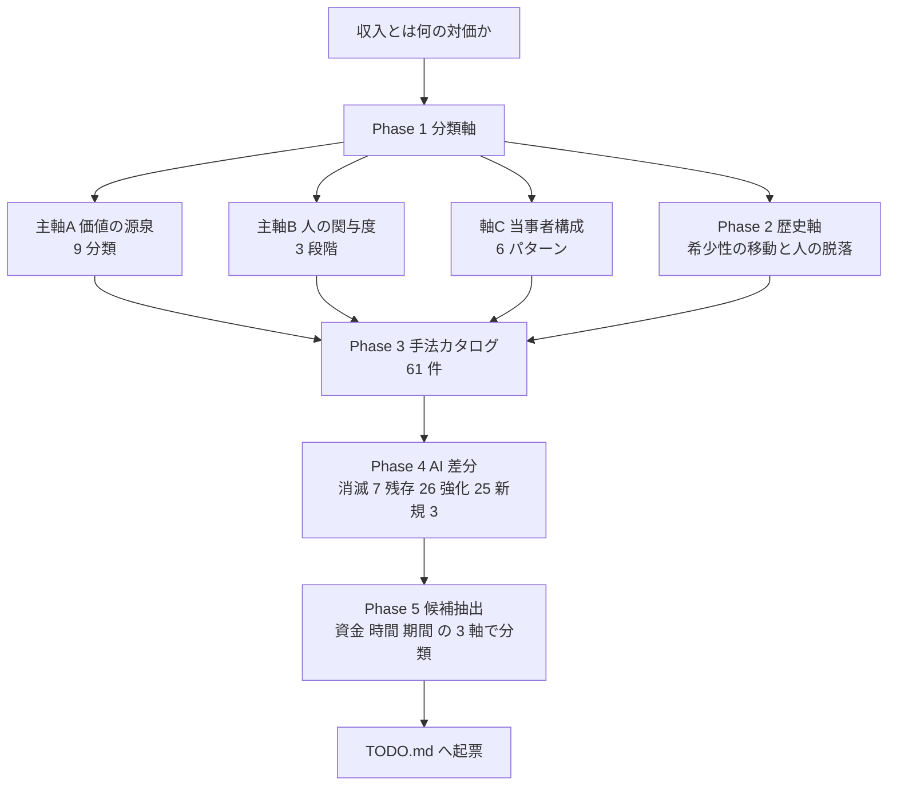

# 人類と収入の体系

AI に限らず、**そもそも金銭がどう発生するか**の全体地図。
「AI で収入を稼ぐ方法」を探す前に、収入手法の空間全体のどこを触っているのかを見えるようにするための体系。

対象範囲は人が働いて得る収入に限定しない。**人対人**（施術、介護、交渉）と
**人の視点がないもの**（利子・地代・アルゴリズム取引・API 課金・法人・AI エージェント間取引）の
両端をどちらも同じ体系に載せている。

作成プラン: `docs/plans/archive/income-taxonomy.md`

## 構成

| Phase | 文書 | 内容 |
| --- | --- | --- |
| 1 | [axes.md](income-taxonomy/axes.md) | 分類軸。価値の源泉 9 分類 × 人の関与度 3 段 × 当事者構成 6 パターン |
| 2 | [history.md](income-taxonomy/history.md) | 歴史軸。希少性の移動と、取引から人が抜けていく過程 |
| 3 | [catalog.md](income-taxonomy/catalog.md) | 手法カタログ 61 件。属性と典型的な失敗理由 |
| 4 | [ai-delta.md](income-taxonomy/ai-delta.md) | AI 差分。全 61 件に 消滅 / 残存 / 強化 / 新規 を判定 |
| 5 | [shortlist.md](income-taxonomy/shortlist.md) | 候補抽出。資金額別・時間別・期間別に分類 |
| 補 | [related-fields.md](income-taxonomy/related-fields.md) | 接続する学問。各層の対応文献と、学問側からの異議 7 件 |

## 背骨に置いた 2 つの仮説

1. **収入とは「その時代に希少なものを、必要としている相手に渡す」ことの対価である。**
   何が希少かは時代とともに移り、そのたびに主要な収入手法が入れ替わる。
2. **経済史は「取引から人を抜いていく」方向に進んできた。**
   物々交換 → 貨幣 → 法人 → 市場のアルゴリズム化 → AI エージェント、と段階的に人が抜けた。
   抜けずに人対人に残ったものが、その時点で人にしか出せない価値であり、
   AI はこの境界線を再び動かしている。

## 体系の全体像

この図の主張: 軸を先に決め、カタログを流し込み、AI 差分を重ね、最後に候補を絞る — 一方向に積み上がる。

## この体系から出た主な結論

| # | 結論 | 根拠 |
| --- | --- | --- |
| 1 | **AI で消滅するのは 61 件中 7 件（11%）だけ。** ただしその 7 件は「AI で稼ぐ」と聞いて最初に思いつく手法とほぼ一致する | [ai-delta.md](income-taxonomy/ai-delta.md) — B6 制作受託 / B7 翻訳 / C1 文章直販 / C2 講座 / C3 素材 / G1 アフィリエイト / H1 広告収入 |
| 2 | **AI に最も強い源泉は「権利」と「資源」。** 希少性が技術ではなく法制度と物理に由来するため、生成コストがゼロになっても無傷 | [ai-delta.md](income-taxonomy/ai-delta.md) D 群・I 群に消滅判定がゼロ |
| 3 | **人対人は残るが、スケールしない。** 残存 26 件の大半が L1（毎回関与）で、単価は守れても件数は増やせない | [ai-delta.md](income-taxonomy/ai-delta.md) 両端への影響 |
| 4 | **「人であること自体が価値」より「責任を引き受ける主体が要る」ほうが強い。** 前者は相手の気持ちで崩れるが、後者は法が支えている | [ai-delta.md](income-taxonomy/ai-delta.md) 人対人の側 |
| 5 | **元手ゼロと「人が関与しない収入」はほぼ両立しない。** 資本ゼロ起点 29 件のうち L3 は 2 件だけで、どちらもリード 1〜3 年 | [catalog.md](income-taxonomy/catalog.md) 集計 |
| 6 | **AI は L3 に入る技術と手間を大きく下げるが、元手は 1 円も下げない。** 元手のない個人の経路は「仕組みを作る」か「AI に売る」の 2 本 | [ai-delta.md](income-taxonomy/ai-delta.md) 人が居ない側 |
| 7 | **時間の投下は収入を増やすが、関与度は下げない。** 関与度を下げるのは資金か仕組みであって、時間ではない | [shortlist.md](income-taxonomy/shortlist.md) 時間軸 |

## 受け入れ条件の検証結果

プランのテスト方針 7 項目を実施した。

| # | テスト | 結果 |
| --- | --- | --- |
| 1 | 網羅性テスト | **合格** 20 件中 18 件を分類できた（差し戻し基準は 3 件以上の分類不能）。下表参照 |
| 2 | 両端テスト | **合格** 20 件のうち人対人 5 件、人が関与しない 6 件。どちらも 5 件以上 |
| 3 | 一意性テスト | **合格** カタログ 61 件に重複なし。所属決定ルールで主所属を 1 つに固定し、副源泉は備考に残した |
| 4 | 実例テスト | **合格** 全 61 件が実在する手法。空のカテゴリなし |
| 5 | 判断可能性テスト | **合格** [shortlist.md](income-taxonomy/shortlist.md) の 3 軸交差表で「明日から始めるならどれか」に答えられる |
| 6 | 出典テスト | **合格** 相場・収益額は一切書いていない。区分レンジは「取り決め」、維持工数と AI 判定は【推測】と明示 |
| 7 | 図テスト | **合格** 図 17 枚。全枚に直前 1 行の主張を付けた。全体像 1・分類軸 5・歴史 2・カタログ 1・AI 差分 4・絞り込み 4 |

### 網羅性テスト（20 件）

体系の外から無作為に挙げた収入手法を、カタログを見ずに軸へ当てはめた。

| # | 手法 | A 源泉 | B 関与度 | C 構成 | 判定 |
| --- | --- | --- | --- | --- | --- |
| 1 | 結婚式の司会 | 2 技能 | L1 | P1 | ○ |
| 2 | 民泊運営（清掃・対応を委託） | 9 資源 | L3 | P4 | ○ |
| 3 | 駐車場オーナー | 9 資源 | L3 | P4 | ○ |
| 4 | 保険外交員の歩合 | 7 仲介 | L1 | P1 | ○ |
| 5 | 自治体の非常勤職員 | 1 時間 | L1 | P1 | ○ |
| 6 | 特許権の一括売却 | 4 権利 | L2 | P6 | ○ |
| 7 | FX の自動売買 | 6 リスク引受 | L3 | P5 | ○ |
| 8 | 声優の出演料 | 2 技能 | L1 | P6 | ○ |
| 9 | 音楽ストリーミングの分配金 | 4 権利 | L2 | P6 | ○ |
| 10 | 農産物の直売 | 9 資源（副 1 時間） | L1 | P2 | ○ |
| 11 | クラウドソーシングのアンケート回答 | 1 時間 | L1 | P3 | ○ |
| 12 | 空き家の管理代行 | 2 技能 | L1 | P1 | ○ |
| 13 | 太陽光の余剰売電 | 9 資源 | L3 | P6 | ○ |
| 14 | 社外取締役の報酬 | 2 技能（副 信用） | L1 | P6 | ○ |
| 15 | NFT 二次流通のロイヤリティ | 4 権利 | L3 | P5 | ○ |
| 16 | 銀行預金の利息 | 5 資本 | L3 | P6 | ○ |
| 17 | 治験の負担軽減費 | 1 時間（副 6 リスク引受） | L1 | P6 | ○ |
| 18 | 訪問理美容 | 2 技能 | L1 | P1 | ○ |
| 19 | メルカリで不用品を売る | — | — | — | **✕ 分類不能** |
| 20 | 遺族年金・公的給付 | — | — | — | **✕ 分類不能** |

**分類できなかった 2 件から分かったこと（体系の対象範囲）**

19 と 20 は、どちらも「継続的に金銭を生む手法」ではない。

- 19 は**単発の資産処分**。手持ちの物を現金化しているだけで、繰り返し金銭を生む構造がない
- 20 は**移転収入**。他者（国家・制度）から一方的に配分されるもので、対価としての交換が発生していない

差し戻し基準（3 件以上）には達しなかったため軸は変更していない。
代わりに **本体系の対象範囲を「繰り返し金銭を生む手法」に限定する**ことを明記した。
単発の資産処分と移転収入は、体系の外側にある別カテゴリとして扱う。

なお移転収入の原資は [catalog.md](income-taxonomy/catalog.md) の J1（徴税）に遡れるため、
地図の上流としては繋がっている。

## この体系の使い方

1. 新しい収入アイデアを思いついたら、まず [axes.md](income-taxonomy/axes.md) の所属決定ルールで
   3 軸の座標を出す。座標が出ない場合、それは収入手法ではない可能性が高い
2. [ai-delta.md](income-taxonomy/ai-delta.md) で同じ源泉・同じ関与度の手法がどう判定されているかを見る。
   消滅判定の隣にいるなら、着手前に「なぜ自分だけ崩れないのか」を説明できる必要がある
3. [shortlist.md](income-taxonomy/shortlist.md) の 3 軸交差表で、自分の制約に合うセルを見る
4. 実験したら **【実測】** 付きで結果を [catalog.md](income-taxonomy/catalog.md) の該当エントリに追記する。
   判定が実測と食い違ったら [ai-delta.md](income-taxonomy/ai-delta.md) を書き換える

体系は完成品ではなく、実測でしか更新できない。**実験を回すまでは全て【推測】である。**
