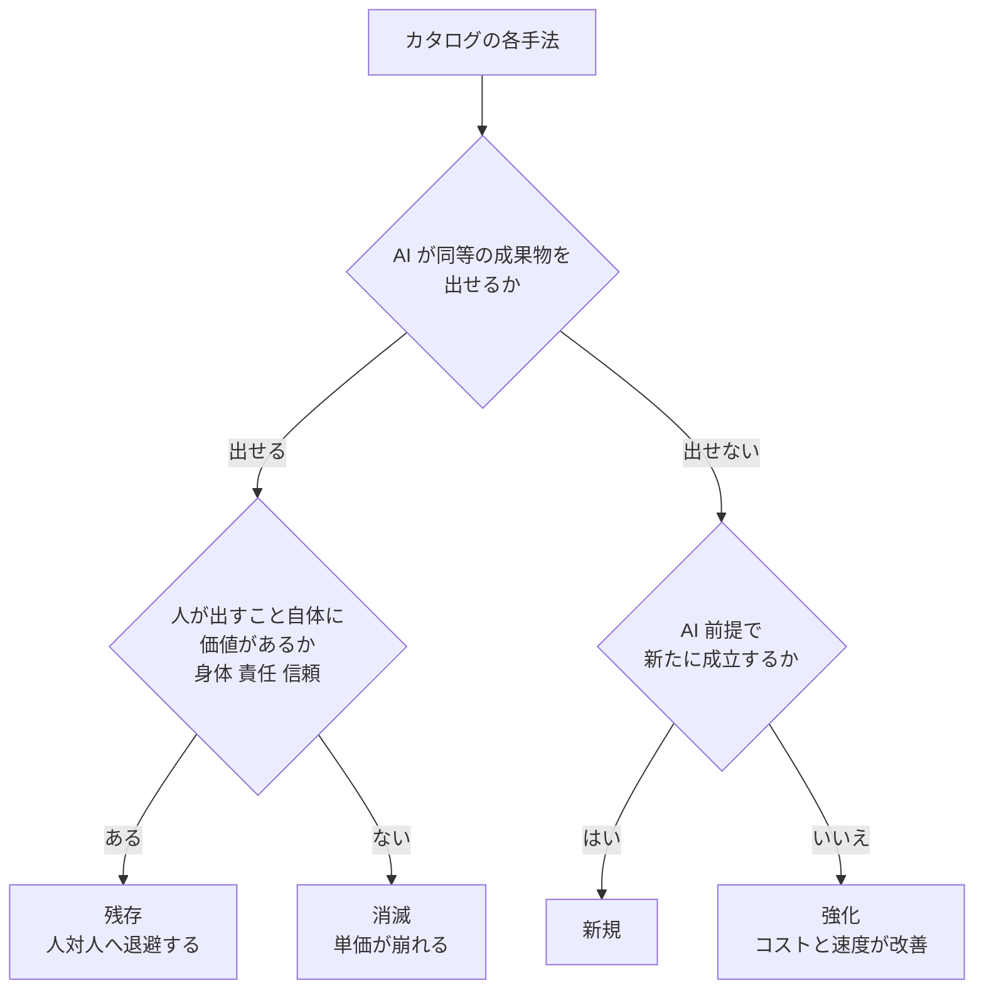
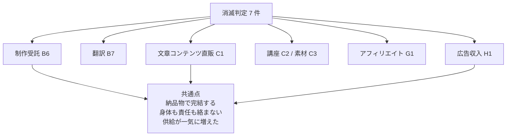
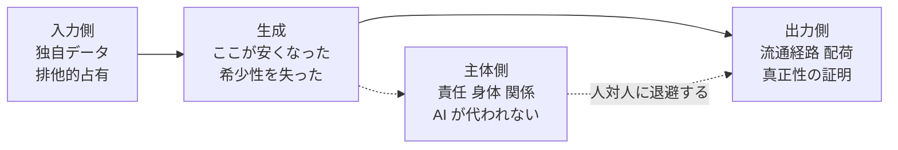
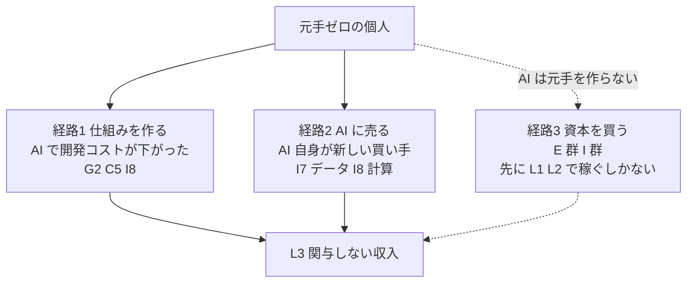

# Phase 4: AI による差分の重ね合わせ

[catalog.md](catalog.md) の全 61 件に、AI が何を変えるかの判定を付ける。
本プロジェクト固有の価値はここにある。

入口: [../income-taxonomy.md](../income-taxonomy.md) ／ 前: [catalog.md](catalog.md) ／ 次: [shortlist.md](shortlist.md)

## 判定フロー

この図の主張: 判定は「AI が同等の成果物を出せるか」と「人が出すこと自体に価値があるか」の 2 問で機械的に決まる。

判定は 4 区分になる。プランでは「消滅 / 強化 / 新規」の 3 区分としていたが、
フローを回すと「AI が出せるのに単価が崩れない」群が独立して現れたため、**残存**を追加した。
残存は消滅の裏返しではない。**消滅圧を受けたうえで、人対人に退避することで残る**という別の挙動を指す。

| 区分 | 意味 | 収入への効き方 |
| --- | --- | --- |
| **消滅** | AI が代替でき、人が出す必然性もない | 単価が崩れる。件数を増やしても追いつかない |
| **残存** | AI が代替できるが、人が出すことに価値がある | 単価は維持または上昇。ただし件数は増やせない |
| **強化** | AI では代替できないが、AI を使うと安く速くなる | 粗利が上がる。競合も同じ改善を得る点に注意 |
| **新規** | AI 以前は成立しなかった | 先行者利得があるが、参入も速い |

判定に際しての前提: **2026 年 8 月時点の実用水準**で判定する。
「いずれできるようになる」は判定に入れない（入れると全件が消滅になり、地図として役に立たなくなる）。
すべて【推測】であり、実測ではない。実験で覆ったらこの表を書き換える。

## 全 61 件の判定

### A. 時間

| ID | 手法 | 判定 | 理由 |
| --- | --- | --- | --- |
| A1 | 時給労働・スポットワーク | 残存 | 身体がその場に必要。AI は関係ない。ただしロボティクスは別軸の脅威 |
| A2 | 家事代行・便利屋 | 残存 | 同上。物理作業は代替されない |
| A3 | ギグ配達 | 残存 | 同上。配車の最適化だけが強化される |
| A4 | 見守り・付き添い・立会人 | 残存 | 「人が居ること」が商品そのもの。AI が代替できる対象ではない |

時間を売る手法は **AI の影響をほとんど受けない**。これは朗報ではなく、
「AI が来ても時給は上がらない」という意味でもある。

### B. 技能

| ID | 手法 | 判定 | 理由 |
| --- | --- | --- | --- |
| B1 | 施術 | 残存 | 手で触れることが価値。代替不能 |
| B2 | 介護・保育 | 残存 | 身体接触と責任の引受。記録・報告のみ強化 |
| B3 | 有資格の対人専門職 | 残存 | 診断支援は強化されるが、責任を負う主体が法的に人でなければならない |
| B4 | 士業 | 強化 | 書類作成は AI に寄る。残るのは「署名して責任を負うこと」。単価は下がる方向 |
| B5 | 受託開発 | 強化 | 実装速度が上がる。ただし発注側も同じ道具を持つため、単価は下押しされる |
| B6 | 制作受託（デザイン・映像・ライティング） | **消滅** | 量産帯の成果物は AI で足りる。単価崩壊が最も速い層 |
| B7 | 翻訳・通訳 | **消滅** | 文書翻訳はほぼ代替済み。同時通訳・法廷通訳など責任が伴う帯だけ残存 |
| B8 | 個別指導・家庭教師 | 残存 | 学習内容は AI で足りるが、**やらせ切ること**は人が要る |
| B9 | コーチング・カウンセリング | 残存 | 傾聴の一部は代替されるが、責任と継続的な関係は残る |
| B10 | 対面営業・代理店販売 | 強化 | 提案資料は AI。決めるのは関係。訪問件数が増やせる |
| B11 | 研修・登壇 | 強化 | 教材作成が速くなる。登壇そのものは残る |
| B12 | 仲人・身元保証・立会人 | 残存 | 保証は責任の引受そのもの。AI は責任を負えない |
| B13 | 現地の修理・保守 | 強化 | 診断・手順書が AI で速くなる。作業は人 |

技能群の傾向: **成果物が納品物として完結する手法（B6, B7）だけが消滅し、
身体か責任が絡む手法は残存する**。「専門性が高い＝安全」ではない。B7 翻訳は専門性が高いが消滅側にいる。

### C. 成果物

| ID | 手法 | 判定 | 理由 |
| --- | --- | --- | --- |
| C1 | 文章コンテンツの直販 | **消滅** | 供給が爆発し、書けること自体の希少性が消えた。残るのは著者への信頼 |
| C2 | オンライン講座 | 消滅 | 情報の提供部分は AI に置換。伴走・添削型なら B8 と同じく残存 |
| C3 | 素材・テンプレート販売 | **消滅** | 生成コストがゼロに近づき、点数の優位が消える。⚠ AI 生成物の受付禁止も進行中 |
| C4 | 買い切りソフト・アプリ | 強化 | 作る速度は上がるが、競合も増えるため純増は不明 |
| C5 | SaaS | 強化 | 開発と一次サポートが安くなる。ただし「作れる人が増える」ため競争は激化 |
| C6 | ゲーム・創作作品 | 強化 | 制作コストが下がる。⚠ プラットフォームの AI 生成物表示義務に注意 |

成果物群は **本プロジェクトが最初に飛びつきやすい層でありながら、消滅判定が最も多い**。
「AI で記事を書いて売る」は、この表では C1（消滅）に真正面から入る。

### D. 権利

| ID | 手法 | 判定 | 理由 |
| --- | --- | --- | --- |
| D1 | 著作物の印税・使用料 | 強化 | 制作は速くなる。⚠ AI 生成物の著作権保護範囲が国により未確定 |
| D2 | 特許・実用新案のライセンス | 強化 | 先行調査・明細書ドラフトが安くなる。出願件数の爆発で審査は混む |
| D3 | 商標・ブランドのライセンス | 残存 | 法が作った排他性は AI で複製できない。むしろ真正性の担保として価値が上がる |
| D4 | フランチャイズ・ロイヤリティ | 強化 | SV 業務・マニュアル整備が安くなる |
| D5 | IP の二次利用許諾 | 残存 | 生成物が溢れるほど「公式であること」の価値が上がる |
| D6 | 権利の買取・相続 | 残存 | 権利そのものは AI の影響を受けない。買値の評価だけが変わる |

**権利は AI に最も強い源泉**。理由は、権利の希少性が技術ではなく法制度に由来するため。
生成コストがゼロになっても、法が作った排他性は無傷で残る。

### E. 資本

| ID | 手法 | 判定 | 理由 |
| --- | --- | --- | --- |
| E1 | 上場株・ETF の配当 | 残存 | 資本収益は AI の影響を受けない。分析だけが安くなる |
| E2 | 債券・社債の利子 | 残存 | 同上 |
| E3 | 貸付・レンディング | 強化 | 与信審査が安くなり、小口貸付の採算ラインが下がる |
| E4 | 暗号資産のステーキング | 残存 | プロトコル由来の収入。AI は無関係 |
| E5 | 未公開株への出資 | 強化 | ソーシング・デューデリが安くなる |
| E6 | 事業買収・所有型 | 強化 | 買収後の業務効率化で利益率が上がる。買収候補の探索も速い |
| E7 | 事業買収・経営型 | 強化 | 経営の管理業務が安くなる |

資本収入は **AI に対して構造的に無風**。元手さえあれば AI 時代でも影響を受けない、
というのがカタログ全体を通した最も安定した結論になる。

### F. リスク引受

| ID | 手法 | 判定 | 理由 |
| --- | --- | --- | --- |
| F1 | 買取再販・せどり | 強化 | 相場探索・価格改定が自動化できる。ただし全員が同じ道具を持ち、鞘は縮む |
| F2 | オプション売り | 残存 | リスクを引き受ける主体は人（または資本）でしかありえない |
| F3 | 裁定・マーケットメイクの自動運用 | 強化 | 戦略開発が速くなる。ただし対戦相手も AI。鞘は縮む |
| F4 | 保険・債務保証（体系枠） | 強化 | 引受査定が精緻化する。個人は取れないまま |

リスク引受の共通点: **AI は「探索」を安くするが、「引き受ける」ことは代替しない**。
そして探索が全員に行き渡ると、探索由来の利益（鞘）は消える。

### G. 仲介・場

| ID | 手法 | 判定 | 理由 |
| --- | --- | --- | --- |
| G1 | アフィリエイト | **消滅** | 記事型は生成物の洪水と検索側の対策で崩れる。⚠ 加えてステマ規制 |
| G2 | マッチング・マーケットプレイス運営 | 強化 | マッチング精度と運営コストが改善。参入も容易になる |
| G3 | 不動産仲介・人材紹介 | 強化 | 候補の探索は自動化。決めるのは人対人の信頼 |
| G4 | 卸・輸入代理・ドロップシッピング | 強化 | 商品探索・翻訳・出品が自動化 |
| G5 | 紹介料・リファラル | 残存 | 「誰を知っているか」は AI で複製できない |

仲介は **情報の非対称を埋める源泉**なので、AI が非対称を縮めるほど本質的に不利。
それでも残るのは、**非対称が「情報」ではなく「関係」に由来する場合**（G5, G3 の成約部分）。

### H. 注目

| ID | 手法 | 判定 | 理由 |
| --- | --- | --- | --- |
| H1 | 広告収入 | **消滅** | 供給爆発で 1 再生・1PV あたりの取り分が下がる方向 |
| H2 | スポンサー・タイアップ | 残存 | 広告主が買っているのは「その人への信頼」。AI で複製できない |
| H3 | ライブ配信の投げ銭 | 残存 | リアルタイムの人格そのものが商品 |
| H4 | 有料メンバーシップ | 残存 | 情報ではなく「その人と繋がっていること」を売っている |

注目の分岐が明快: **注意そのものを卸す（H1）と消滅、その人への信頼を売る（H2〜H4）と残存**。
同じ「注目」でも、匿名の注意は AI で希釈され、記名の信頼は希釈されない。

### I. 資源

| ID | 手法 | 判定 | 理由 |
| --- | --- | --- | --- |
| I1 | 不動産賃貸 | 残存 | 物理占有は代替不能。管理・審査が強化される程度 |
| I2 | 遊休スペースの賃貸 | 残存 | 同上 |
| I3 | 自動販売機・無人販売 | 強化 | 需要予測・補充計画が最適化される |
| I4 | 太陽光発電の売電 | 強化 | データセンター需要で電力需要が増える側の追い風 |
| I5 | 山林・農地の賃貸 | 残存 | 影響なし |
| I6 | ドメインの運用・売却 | 残存 | 名前の一意性は AI で複製できない |
| I7 | 独自データセットの提供・販売 | **新規** | 学習・評価用データの需要が AI 以前には存在しなかった。⚠ 権利処理が最大の関門 |
| I8 | 計算資源・回線の貸出 | **新規** | GPU 貸出という手法自体が AI 需要で成立した |

資源群は **残存と新規に二分され、消滅がゼロ**。物理・法的な占有は AI に侵食されない。
かつ、AI 自身が新しい資源需要（データ・計算）を作っている。

### J. 非人格の主体

| ID | 手法 | 判定 | 理由 |
| --- | --- | --- | --- |
| J1 | 徴税・通貨発行益 | 残存 | 強制力に裏付けられており、技術で崩れない |
| J2 | 公的年金・ソブリンファンド運用 | 強化 | 運用の効率化 |
| J3 | 財団・DAO トレジャリー | 新規寄り | AI エージェントが主体になる形は制度上まだ未確定 ⚠ |
| J4 | 法人の余剰資金運用 | 強化 | 同 J2 |

## 判定の集計

| 判定 | 件数 | 割合 | 主な該当 |
| --- | --- | --- | --- |
| 残存（人対人へ退避） | 26 | 43% | A 群全部、B の身体・責任系、E 群、I の物理資源 |
| 強化 | 25 | 41% | B の一部、C の開発系、D 群、F 群、G の大半 |
| 消滅 | 7 | 11% | B6, B7, C1, C2, C3, G1, H1 |
| 新規 | 3 | 5% | I7, I8, J3（J3 は制度次第） |
| 合計 | 61 | 100% | |

この図の主張: 消滅判定は「成果物が納品物として完結し、身体も責任も絡まない層」に集中している。

## 生成コストが消えた後、次に希少になるもの

仮説 1（収入 ＝ その時代の希少なものの対価）を AI に当てはめる。
**生成が安くなった分、生成の周辺にあったものが希少になる。**

| 次に希少なもの | なぜ希少か | どの手法に効くか |
| --- | --- | --- |
| **1. 責任を負う主体** | AI は署名できず、訴えられず、免許を持てない | B3, B4, B12, F2, D1 |
| **2. 身体がそこにあること** | 物理作業と接触は代替されない | A 群、B1, B2, B13 |
| **3. 継続する関係と信頼** | 一度きりの成果物は複製できるが、履歴のある関係は複製できない | H2, H3, H4, G5, B8, B9 |
| **4. 流通経路（配荷）** | 作れる人が増えるほど、届けられる経路が相対的に希少になる | G1 → G2, C 群全体 |
| **5. 独自データ** | 公開情報は学習済み。外に出ていないデータだけが差分になる | I7, C5 |
| **6. 排他的な占有** | 法（権利）または物理（土地・計算）による占有は AI に無関係 | D 群、I 群、E 群 |
| **7. 真正性の証明** | 生成物が溢れるほど「本物であること」の確認需要が生まれる | D3, D5, H2 |

この図の主張: 希少性は「作れること」から、その前後の 3 箇所へ逃げた。

歴史軸（[history.md](history.md)）の読み筋 1「複製が容易になった側は必ず単価が落ちる」が、
そのまま当てはまっている。情報化のとき複製コストが消えて**原本**が希少になり、
AI で生成コストが消えて**入力・主体・経路**が希少になった。

## 両端への影響

### 人対人の側 — AI はどこまで入ってくるか

問い: 「AI が代替しにくい」と言われる領域（相談、教育、伴走、介護）に、実際どこまで入るか。
残るのは「人であること自体が価値」の部分なのか、「責任を引き受ける主体が要る」部分なのか。

判定結果から読むと、**残る理由は 3 種類あり、強さが違う**。

| 残る理由 | 強さ | 崩れる条件 | 該当 |
| --- | --- | --- | --- |
| **責任**（署名・免許・賠償） | 強い（法が支えている） | 法が AI に責任を認めた瞬間に崩れる | B3, B4, B12, F2 |
| **身体**（接触・現地作業） | 強い（物理が支えている） | ロボティクスのコストが下がれば崩れる。AI 単体では崩れない | A 群, B1, B2, B13 |
| **関係**（履歴・信頼・伴走） | 中くらい | 相手が「AI でいい」と思った瞬間に崩れる。主観に依存する | B8, B9, H2, H4, G5 |

つまり **「人であること自体が価値」よりも「責任を引き受ける主体が要る」ほうが強い**、
というのが本体系の答えになる。前者は相手の気持ち次第で崩れるが、後者は法制度が支えているため
個人の選好では崩れない。

実際に入ってくる度合いは、同じ領域内でも工程で割れる。

| 領域 | AI が入る工程 | 人に残る工程 |
| --- | --- | --- |
| 相談（B9） | 情報提供、整理、24時間の一次受付 | 見立ての責任、継続の伴走、緊急時の判断 |
| 教育（B8） | 教材作成、演習の出題・採点、質問応答 | 動機付け、やらせ切ること、進路の責任 |
| 介護（B2） | 記録、シフト、家族への報告 | 身体介助、状態の察知、事故時の責任 |
| 医療（B3） | 一次問診、鑑別の候補出し、書類 | 診断の確定、処置、法的責任 |

共通構造: **AI は「情報を出す工程」を取り、人には「決めて責任を負う工程」と「身体の工程」が残る**。
そして残った工程は L1（毎回関与）なので、**単価は上がりうるが件数は増やせない**。
人対人は AI 時代に消えないが、**スケールもしない**。この非対称が Phase 5 の設計を決める。

### 人が居ない側 — AI は非労働収入をどこまで個人に降ろすか

問い: これまで資本や専門性が要って個人には届かなかった「人が関与しない収入」を、
AI がどこまで個人の手に降ろすか。

[catalog.md](catalog.md) の集計で出た制約 —— **元手ゼロと L3 はほぼ両立しない** —— を、
AI が緩めるかどうかで判定する。

| L3 に入るための障壁 | AI は緩めるか | 判定 |
| --- | --- | --- |
| **元手そのもの**（E 群、I1, I2, I4） | **緩めない** | 資本の額は AI で増えない。ここが最大の壁で、AI は無力 |
| **運用の専門性**（E3, E5, F2, F3） | 緩める | 分析・審査・戦略開発が安くなる。ただし対戦相手も同じ |
| **運用の手間**（I1 の管理、I3 の補充計画、G2 の運営） | 緩める | 維持工数が下がり、L1 に落ちていた手法が L3 に留まれる |
| **仕組みを作る技術力**（G2, C5, I8） | **大きく緩める** | 個人が作れる仕組みの規模が上がる。ここが AI の最大の貢献 |
| **新しい資源需要**（I7, I8） | **新たに作る** | AI 自身が買い手。個人が供給側に回れる唯一の新規枠 |

結論を 1 文にすると: **AI は「L3 に入るための技術と手間」を大きく下げるが、
「L3 に入るための元手」は 1 円も下げない。**

したがって元手のない個人にとって、AI が開ける L3 への経路は次の 2 本に限られる。

この図の主張: 元手ゼロから L3 に至る経路は、AI で 2 本に絞られる。

### AI エージェント同士の取引に、個人は課金主体として入れるか

軸 C の P5（システム → システム）に、個人が売り手として参加できるかという問い。

現時点（2026 年 8 月）の判定:

- **入れる**: API・MCP サーバー・ツールの従量課金として、エージェントを顧客にできる。
  買い手が人間かエージェントかを問わない課金設計は既に成立している
- **まだ薄い**: エージェントが自律的に予算を持ち、人間の承認なしに新規サービスを購入して
  継続課金する市場は、決済・与信・責任の制度がまだ育っていない ⚠
- **効く前提**: この市場が育つ場合、必要なのは「エージェントが発見でき、評価でき、
  信用できる」形で供給を置くこと。人間向けのマーケティングとは別の配荷経路になる

本プロジェクトとして意味があるのは、**この経路は元手ゼロで L3 に入れる数少ない候補**という点。
ただし需要の実在は未検証であり、[shortlist.md](shortlist.md) では「検証すべき仮説」として扱う。

## この Phase から出た、体系上の結論

1. **消滅は 11% しかない。** AI は収入手法の地図を焼き払っていない。
   焼けているのは「納品物で完結し、身体も責任も絡まない層」だけで、そこが本プロジェクトが
   最初に思いつく層と完全に一致している
2. **AI に最も強いのは権利と資源。** 希少性が技術ではなく法と物理に由来するため
3. **人対人は残るがスケールしない。** 残存 26 件の大半が L1 で、単価は守れても件数は増やせない
4. **AI は L3 への技術的な壁を壊すが、資本の壁は壊さない。**
   元手のない個人が非労働収入に向かう経路は、仕組みを作るか AI に売るかの 2 本に絞られる
