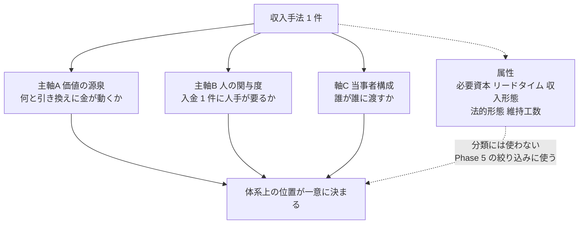
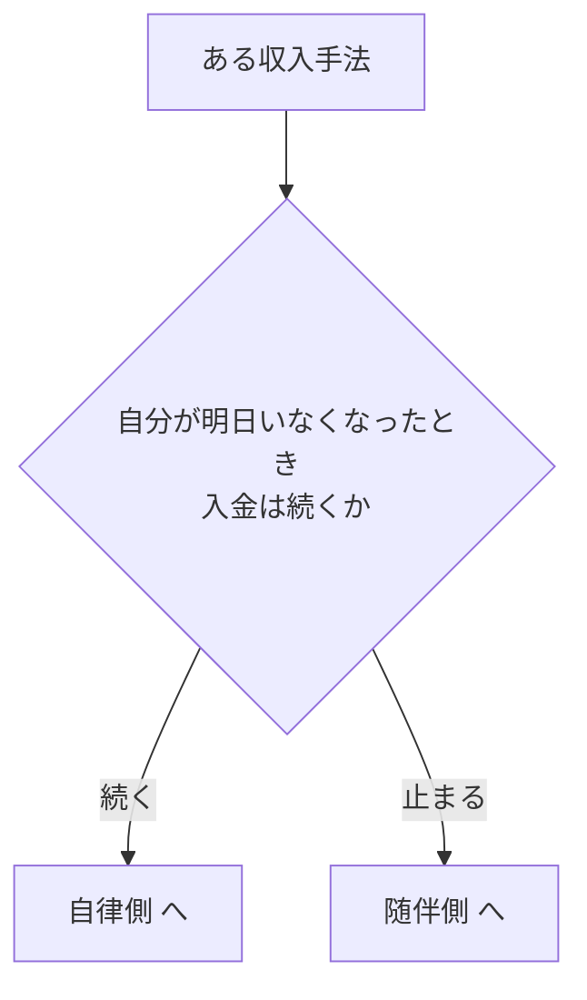
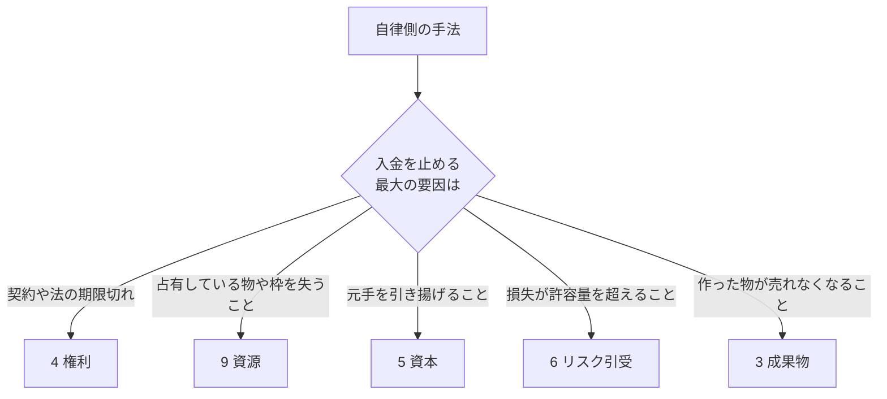
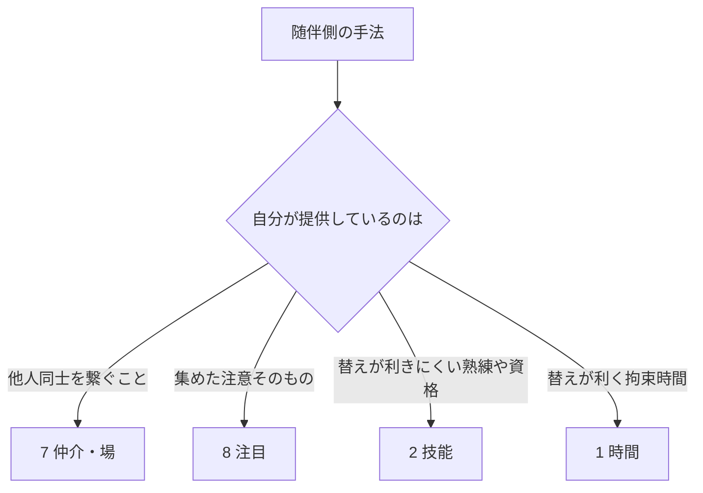
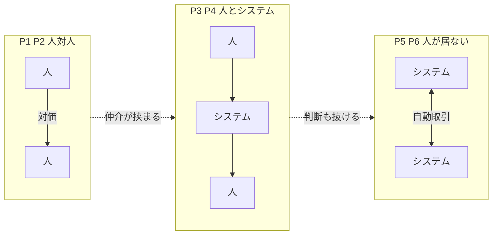

# Phase 1: 分類軸

収入手法を並べるための座標系を定義する。以降の [history.md](history.md) / [catalog.md](catalog.md) /
[ai-delta.md](ai-delta.md) / [shortlist.md](shortlist.md) は、すべてこの軸の上に載る。

読み方: [../overview.md](../overview.md) ／ 入口: [../income-taxonomy.md](../income-taxonomy.md)

**記法**は下の [記法](#記法) 節で定義する。

**この層を支える学問**: 生産要素論・レント論（Christophers の 7 レント）、人的資本論、Knight のリスクと不確実性 → [related-fields.md](related-fields.md) §2

## 背骨に置く 2 つの仮説

1. **収入とは「その時代に希少なものを、必要としている相手に渡す」ことの対価である。**
   何が希少かは時代とともに移り、そのたびに主要な収入手法が入れ替わる。
2. **経済史は「取引から人を抜いていく」方向に進んできた。**
   抜けずに人対人に残ったものが、その時点で人にしか出せない価値である。

軸 A（価値の源泉）は仮説 1 を、軸 B（人の関与度）と軸 C（当事者構成）は仮説 2 を座標にしたもの。

## 記法

体系全体で次の記号を使う。**手法 ID と軸の値を取り違えないよう、別の文字を割り当てている。**

| 記号 | 意味 | 例 |
| --- | --- | --- |
| **L1 / L2 / L3** | 主軸 B の値（人の関与度） | L3 ＝ 人が関与しない |
| **P1 〜 P6** | 軸 C の値（当事者構成） | P1 ＝ 人 → 人 |
| **1 〜 9 ＋ 名称** | 主軸 A の値（価値の源泉） | 「4 権利」「9 資源」 |
| **A1 〜 J4** | [catalog.md](catalog.md) の手法 ID。頭文字は源泉のグループ | B1 ＝ 施術、I8 ＝ 計算資源の貸出 |
| **⚠** | 法規制・利用規約に触れる。備考に内容を記す | |
| **【推測】/【実測】** | 数値の根拠。実験前は原則すべて【推測】 | |

## 軸は 3 本、残りは属性

この図の主張: 分類に使う軸は 3 本だけで、必要資本やリードタイムは「分類」ではなく「絞り込み」に使う。

軸を増やさない理由は運用上の問題である。軸が 4 本を超えると分類作業そのものが目的化し、
埋めることはできても引くときに使われなくなる。属性は「後から足せるが、軸は後から替えられない」。

なお、よく使われる「線形 ↔ 非線形（スケールするか）」は独立の軸に**しない**。
軸 B の帰結として説明できるため（毎回関与＝線形、関与しない＝非線形）、軸に立てると重複する。

## 主軸 A: 価値の源泉

候補として挙がっていた 10 分類から、**土地・自然資源**と**データ・計算資源**を「資源」に統合して
**9 分類**に確定した。統合の理由は、どちらも「排他的に占有していること自体が入金を生む」構造が同じで、
判定手順も同じになるため。物理／デジタルの差はサブタイプとして残す。

| 源泉 | 入金の直前に渡っているもの | 希少性の根拠 | 何が尽きると止まるか | 代表例 |
| --- | --- | --- | --- | --- |
| 1. 時間 | 拘束された自分の可処分時間 | 1 日 24 時間という物理制約 | 自分の寿命と体力 | 時給労働、スポットワーク |
| 2. 技能 | 再現の難しい熟練・資格の行使 | 習得コストと免許による参入制限 | 自分の時間と体力 | 施術、士業、受託開発 |
| 3. 成果物 | 複製できる完成物のコピー | 作れる側の少なさ | 需要の飽和・陳腐化 | 書籍、買い切りソフト、素材 |
| 4. 権利 | 法が保証する排他的な使用許可 | 法制度が人為的に作った希少性 | 権利期間・契約期間 | 印税、特許ライセンス、FC ロイヤリティ |
| 5. 資本 | 元手そのものの一時的な提供 | 元手を持つ側が限られる | 元手の額 | 配当、社債利子、レンディング |
| 6. リスク引受 | 相手が抱えたくない不確実性の肩代わり | リスク許容度の個人差 | 耐えられる損失額 | 保険引受、在庫買取、オプション売り |
| 7. 仲介・場 | 需要と供給の間の距離を埋めること。**非対称型**（情報の非対称を埋める、L1）と**占有型**（場を占有して手数料を取る、L3・レント）の 2 型 | 相手を見つけられない情報の非対称、または場の集約 | 非対称型は非対称が消えると同時に消える。占有型は場の競合が現れるまで消えない | 非対称型: アフィリエイト、紹介料。占有型: マーケットプレイス手数料 |
| 8. 注目 | 他人の可処分注意 | 注意の総量が有限 | 飽き・可処分時間の総量 | 広告、スポンサー、投げ銭 |
| 9. 資源 | 占有している有限物の使用枠 | 物理的・契約上の排他占有 | 物理量と稼働率 | 不動産賃貸、売電、GPU 貸出、データ販売 |

資源のサブタイプ:

| サブタイプ | 性質 | 例 |
| --- | --- | --- |
| 物理資源 | 競合性あり（誰かが使うと他が使えない） | 土地、建物、駐車枠、日照、山林 |
| デジタル資源 | データは非競合、計算は競合 | 独自データセット、GPU 時間、IP アドレス、ドメイン |

定義への注記（2026-08-26、[related-fields.md](related-fields.md) §7）:

| 異議 | 注記 |
| --- | --- |
| D 譲渡益 | 保有資産の値上がり益は源泉 5 資本に含める（E8）。Haig–Simons の包括的所得は保有利得を所得に数える。繰り返し保有・売却する運用は体系内、単発の不用品処分は体系外 |
| F 仲介の 2 型 | 非対称型の単価は非対称と共に消えるが、占有型の手数料はプラットフォーム・レントとして残る（Spulber 1999、Christophers 2020）。G1 アフィリエイトは非対称型、G2 マーケットプレイスは占有型 |
| G 建物賃貸 | SNA 2008 では建物賃貸はサービス産出で、賃貸料（rent）は天然資源に限る。本体系は「占有が入金を生む」で一貫させ、建物も 9 資源に含める |

### 所属を 1 つに決めるルール

多くの手法は複数の源泉にまたがる（例: SaaS は成果物でも権利でもある）。
一意性を保つため、次の順で主所属を決める。

この図の主張: 主所属は「自分が抜けても入金が続くか」でまず二分し、その先で確定する。

**自律側**（自分が抜けても入金が続く）— この図の主張: 収入が止まる最大の要因が主所属を決める。

**随伴側**（自分が動かないと止まる）— この図の主張: 自分が提供しているものの替えの利きにくさで決まる。

副次的な源泉はカタログの備考に「副: ◯◯」として残す。捨てずに残すのは、
Phase 4 の AI 差分判定で「主所属は残るが副源泉だけ崩れる」ケースを拾うため。

判定例:

| 手法 | 主所属 | 理由 | 副源泉 |
| --- | --- | --- | --- |
| 書籍の印税 | 4 権利 | 出版契約が切れれば入金が止まる | 3 成果物 |
| 電子書籍の自己出版・直販 | 3 成果物 | 契約ではなく需要の消滅で止まる | 4 権利 |
| SaaS（自社プロダクト） | 3 成果物 | 陳腐化・解約で止まる | 4 権利、9 資源 |
| YouTube 広告収入 | 8 注目 | 再生数が消えれば止まる | 3 成果物 |
| 不動産賃貸（管理委託） | 9 資源 | 物件を手放せば止まる | 5 資本 |
| せどり・買取再販 | 6 リスク引受 | 在庫が捌けず値崩れすれば止まる | 7 仲介 |

## 主軸 B: 人の関与度

**定義**: 入金 1 件を追加で発生させるのに、追加で必要な人手がどれだけあるか（限界人手）。
固定的にかかる維持工数はここに含めず、属性「維持工数」で別に持つ。この分離をしないと、
「保守が要るから関与しない枠には入れない」という判定になり、軸が使えなくなる。

| 段階 | 限界人手 | 収入の形 | 例 |
| --- | --- | --- | --- |
| L1 毎回関与 | 入金のたびに人が働く | 働いた分だけ。止めれば即ゼロ | 施術、接客、受託開発、登壇 |
| L2 初回のみ関与 | 作るときだけ働く。売れるたびの人手はほぼゼロ | 作った量の蓄積。止めても数ヶ月〜数年は残る | 書籍、買い切りソフト、素材、特許 |
| L3 関与しない | 追加の人手がゼロに漸近する | 元手・占有・仕組みの大きさに比例 | 配当、地代、駐車場、アルゴ取引、API 従量課金 |

L2 と L3 の境目は「作り続ける必要があるか」。作品を出し続けないと収入が減衰するものは L2、
一度置いた資産・契約・仕組みが減衰せずに回るものは L3。

**維持工数（属性）** は L3 でもゼロにはならない。ここを見落とすと「不労所得」という言葉に引きずられる。

| 段階 | 典型的な維持工数【推測・実測値ではない】 | 内訳 |
| --- | --- | --- |
| L1 | 収入時間とほぼ同じ | 作業そのもの |
| L2 | 月 数時間〜十数時間 | 不具合対応、問い合わせ、規約変更追随 |
| L3 | 月 0〜数時間 | 監視、税務、契約更新、故障対応の手配 |

## 軸 C: 当事者構成

誰が誰に渡しているか。「取引相手は誰か」もここに統合する。

| 構成 | 内容 | 例 |
| --- | --- | --- |
| P1 人 → 人 | 相手が特定の個人。関係・信頼・身体性が価値 | 訪問介護、家庭教師、理容、対面営業 |
| P2 人 → 多数の人 | 一対多。相手は顔が見えない群 | 出版、配信、広告収入 |
| P3 人 → システム | 納品先が機械・プラットフォーム | データ提供、API 向けコンテンツ供給 |
| P4 システム → 人 | 人手を介さず人に売る | 自動販売機、SaaS の自動課金 |
| P5 システム → システム | 人が両端に居ない | アドテクの RTB、高頻度取引、API 課金、AI エージェント間取引 |
| P6 非人格の主体 | そもそも受け取り手が人でない | 法人、国家（徴税）、ファンド、DAO |

この図の主張: 金の流れは「人が両端から抜けていく」順に並べられる。

P6 は「流れの向き」ではなく「主体の性質」を表すため、P1〜P5 と直交する。
体系の上流（金がどこから来ているか）を欠くと地図が閉じないので、独立の枠として残す。

## 属性

軸ではないが、Phase 5 の絞り込みに必須の項目。カタログの各エントリに付ける。

| 属性 | 区分 | 備考 |
| --- | --- | --- |
| 必要資本 | ゼロ / 小 / 中 / 大 | 下表の取り決めによる |
| リードタイム | 即日 / 〜3ヶ月 / 〜1年 / 1〜3年 / 3年〜 | 最初の入金までの期間 |
| 収入形態 | フロー / ストック / ハイブリッド | 止めたときの減衰速度 |
| 法的形態 | 雇用 / 業務委託 / 法人 / 投資家 / 権利者 / 該当なし | 課税と責任の所在が変わる |
| 維持工数 | 高 / 中 / 低 / ほぼゼロ | 軸 B とは独立 |

必要資本の区分は本体系での**取り決め**であり、相場の推定ではない。

**2026-08-28 に USD で定義し直した。** 本体系の前提となる税務上の居住地を
**米国（ワシントン州シアトル）** に確定したため（[shortlist.md 前提条件の確定](shortlist.md#前提条件の確定2026-08-26)）。
区分の刻みは初版と同じく **1 桁ずつ**で、意味は変えていない。

| 区分 | 金額（現行・USD） | 初版（円建て） | 対応 |
| --- | --- | --- | --- |
| ゼロ | 〜 $1,000 | 〜10 万円 | 10^3 USD ↔ 10^5 JPY |
| 小 | $1,000 〜 $10,000 | 10 〜 100 万円 | 10^4 USD ↔ 10^6 JPY |
| 中 | $10,000 〜 $100,000 | 100 〜 1,000 万円 | 10^5 USD ↔ 10^7 JPY |
| 大 | $100,000 〜 | 1,000 万円〜 | — |

⚠ **この対応は換算ではなく、区分の刻みを USD の桁に置き直したもの**である。
1 USD = 150 円で機械的に換算すると 1,000 万円 ≒ $67,000 になるが、
区分は「相場の推定ではなく取り決め」なので、桁を揃えて $100,000 を「大」の起点に置いた。
2026-08-28 より前に書かれた円建ての記述を読むときは、この表で読み替える。

## 表記ルール

- 金額・期間・件数を書くときは **【実測】** または **【推測】** を付ける。
  本体系はまだ実験を回していないため、原則すべて【推測】になる。出典のない相場は断定しない
- **金額は USD で書く。** 税務上の居住地を米国（ワシントン州シアトル）に確定したため（2026-08-28）。
  円建ての記述はそれ以前に書かれたもので、上の対応表で読み替える
- 区分のための取り決め（上表の必要資本レンジなど）は「取り決め」と明記し、推測とは区別する
- 法規制・利用規約に触れる手法は、カタログの備考に **⚠** を付けて先に指摘する
