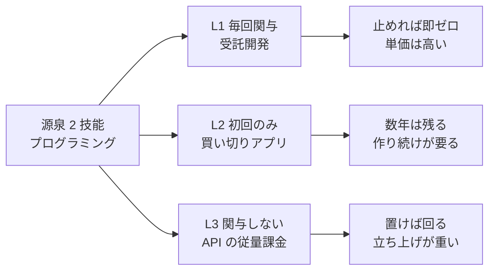

# Phase 3: 手法カタログ

現代で実際に取れる収入手法を **61 件** 列挙し、[axes.md](axes.md) の軸で属性を埋める。

入口: [../income-taxonomy.md](../income-taxonomy.md) ／ 前: [history.md](history.md) ／ 次: [ai-delta.md](ai-delta.md)

## 凡例

| 記号 | 意味 |
| --- | --- |
| L1 / L2 / L3 | 人の関与度（毎回関与 / 初回のみ関与 / 関与しない） |
| P1 〜 P6 | 当事者構成（[axes.md](axes.md) の軸 C） |
| 資本 | ゼロ（〜10万）/ 小（10〜100万）/ 中（100〜1000万）/ 大（1000万〜）※区分の取り決め |
| リード | 最初の入金までの期間 |
| ⚠ | 法規制・利用規約に触れる。備考に内容を記す |

**金額に関する注記**: 本カタログには相場・収益額を書かない。実験を回していないため、
書けば全て根拠のない【推測】になる。数値は [shortlist.md](shortlist.md) で実験を起票した後、
実測値として追記していく。

## 同じ源泉でも、関与度が違えば別の手法になる

この図の主張: 軸 A（源泉）だけでは手法は決まらない。軸 B と掛け合わせて初めて別物になる。

同じスキルを持っていても、どの関与度に置くかで必要資本・リードタイム・上限が全部変わる。
Phase 5 の絞り込みが「スキル」ではなく「関与度」を先に見るのはこのため。

## 軸の妥当性検証（先行 10 件）

カタログを全件埋める前に、両端を含む 10 件で軸が軋まないかを確認した。

| # | 手法 | A 源泉 | B 関与度 | C 構成 | 判定 |
| --- | --- | --- | --- | --- | --- |
| 1 | 見守り・付き添い | 1 時間 | L1 | P1 | ○ |
| 2 | 施術（整体） | 2 技能 | L1 | P1 | ○ |
| 3 | 受託開発 | 2 技能 | L1 | P1 | ○ |
| 4 | 電子書籍の自己出版 | 3 成果物 | L2 | P2 | ○ |
| 5 | SaaS（自社プロダクト） | 3 成果物 | L2 | P4 | △ L2/L3 の境界 |
| 6 | 商業出版の印税 | 4 権利 | L2 | P6 | ○ 受け取り元が法人 |
| 7 | 上場株の配当 | 5 資本 | L3 | P6 | ○ |
| 8 | 不動産賃貸（管理委託） | 9 資源 | L3 | P4 | ○ |
| 9 | GPU の貸出 | 9 資源 | L3 | P5 | ○ 両端に人が居ない |
| 10 | 事業買収 | 5 資本 | L1/L3 | P6 | ✕ 関与度が一意に決まらない |

**軋んだ 2 点と、その対処**

1. **SaaS の L2/L3 境界**（#5）— 売れるたびの人手はゼロだが、保守を止めると死ぬ。
   → 軸 B の定義を「限界人手」に限定し、保守は属性「維持工数」に分離した（[axes.md](axes.md) に反映済み）。
   これで SaaS は L2（作り続けが要る）と確定する。
2. **事業買収の関与度が一意に決まらない**（#10）— 自分で経営すれば L1、所有だけなら L3。
   → **同じ資産でも運営形態が違えば別エントリ**として扱うルールを追加した。
   カタログでは E6（所有型）と E7（経営型）に分けている。

軸そのものの作り直し（Phase 1 への差し戻し）は不要と判断し、残り 50 件の記入に進んだ。

---

## A. 源泉 1: 時間

拘束された可処分時間そのものを売る。替えが利くため、単価は「その場に居ること」の需給で決まる。

| ID | 手法 | B 関与度 | C 構成 | 資本 | リード | 典型的な失敗理由 | 備考 |
| --- | --- | --- | --- | --- | --- | --- | --- |
| A1 | 時給労働・スポットワーク | L1 | P1 | ゼロ | 即日 | 時給の上限に早く当たり、他の手法に移る時間が残らない | 法的形態: 雇用 |
| A2 | 家事代行・便利屋 | L1 | P1 | ゼロ | 〜3ヶ月 | 移動時間が計上されず実質時給が半減する | 副: 2 技能 |
| A3 | ギグ配達 | L1 | P3 | ゼロ | 即日 | 車両・体調の固定費を織り込まず、繁忙期の数字で判断する | 納品先はアプリ＝ P3 |
| A4 | 見守り・付き添い・立会人 | L1 | P1 | ゼロ | 〜3ヶ月 | 需要が単発で、リピート導線が作れない | 「人が居ること」自体が商品 |

## B. 源泉 2: 技能

習得コストと免許が参入を絞る。L1 に張り付くので、収入は自分の可処分時間で頭打ちになる。

| ID | 手法 | B 関与度 | C 構成 | 資本 | リード | 典型的な失敗理由 | 備考 |
| --- | --- | --- | --- | --- | --- | --- | --- |
| B1 | 施術（整体・鍼灸・理美容） | L1 | P1 | 小〜中 | 1〜3年 | 資格取得と設備で先に資本を使い、集客まで資金が持たない | ⚠ 業種により国家資格必須 |
| B2 | 介護・保育（訪問・個別） | L1 | P1 | ゼロ〜小 | 〜1年 | 報酬が公定価格に縛られ、努力が単価に反映されない | ⚠ 資格・指定要件 |
| B3 | 有資格の対人専門職（医療・歯科・看護） | L1 | P1 | 中〜大 | 3年〜 | 参入コストが極大。個人が「今から」取る手法ではない | ⚠ 医師法等。無資格提供は違法 |
| B4 | 士業（税理士・行政書士・司法書士） | L1 | P1 | 小 | 3年〜 | 資格を取っても集客ができず、単価競争に落ちる | ⚠ 独占業務の無資格提供は違法 |
| B5 | 受託開発・システム構築 | L1 | P1 | ゼロ | 〜3ヶ月 | 単価は上がるが稼働が埋まり、資産化する時間がゼロになる | 副: 1 時間 |
| B6 | 制作受託（デザイン・映像編集・ライティング） | L1 | P1 | ゼロ | 〜3ヶ月 | 修正回数が無制限になり、実質時給が崩れる | 副: 1 時間 |
| B7 | 翻訳・通訳 | L1 | P1 | ゼロ | 〜3ヶ月 | 機械翻訳の後編集に仕事が置き換わり、単価が下がる | Phase 4 の主戦場 |
| B8 | 個別指導・家庭教師 | L1 | P1 | ゼロ | 〜3ヶ月 | 生徒の卒業で収入が周期的に消える | 副: 1 時間 |
| B9 | コーチング・カウンセリング | L1 | P1 | ゼロ〜小 | 〜1年 | 効果の証明が難しく、実績が積み上がる前に集客が尽きる | ⚠ 医療行為との線引き |
| B10 | 対面営業・代理店販売 | L1 | P1 | ゼロ | 〜3ヶ月 | 扱う商材の都合で報酬体系が一方的に変えられる | 法的形態: 業務委託 |
| B11 | 研修・登壇・講師 | L1 | P2 | ゼロ | 〜1年 | 単発で終わり、次の登壇が実績依存で読めない | 副: 8 注目 |
| B12 | 仲人・身元保証・立会人 | L1 | P1 | ゼロ〜小 | 〜1年 | 信用の構築に時間がかかり、その間の収入がない | ⚠ 業により許認可 |
| B13 | 現地の修理・保守（設備・車・住宅） | L1 | P1 | 小 | 〜1年 | 工具・車両の固定費と、移動の非効率で利益が残らない | ⚠ 電気工事士等 |

## C. 源泉 3: 成果物

一度作れば複製できる。作り続けないと減衰するので L2 に留まる。

| ID | 手法 | B 関与度 | C 構成 | 資本 | リード | 典型的な失敗理由 | 備考 |
| --- | --- | --- | --- | --- | --- | --- | --- |
| C1 | 文章コンテンツの直販（電子書籍・有料記事） | L2 | P2 | ゼロ | 〜3ヶ月 | 書くことに集中し、読まれる導線（8 注目）をゼロから作る手間を見落とす | ⚠ プラットフォームの AI 生成物規約 |
| C2 | オンライン講座（買い切り） | L2 | P2 | ゼロ〜小 | 〜1年 | 収録に数十時間かけた後で、そのテーマに需要がないと分かる | 副: 2 技能 |
| C3 | 素材・テンプレートの販売（写真・音源・3D・フォント） | L2 | P2 | ゼロ〜小 | 〜1年 | 点数が閾値に届かず、露出が発生しないまま在庫化する | ⚠ AI 生成素材の受付可否 |
| C4 | 買い切りソフト・モバイルアプリ | L2 | P4 | ゼロ | 〜1年 | OS 更新への追随が永久に続き、B2 のはずが B1 になる | 副: 4 権利 |
| C5 | SaaS（自社プロダクト） | L2 | P4 | 小 | 〜1年 | 解約率を見ずに新規獲得だけ追い、純増がマイナスのまま気づかない | 維持工数: 高 |
| C6 | ゲーム・創作作品の販売 | L2 | P2 | ゼロ〜小 | 〜1年 | 完成までが長く、途中で市場の関心が移る | 副: 8 注目 |

## D. 源泉 4: 権利

法が作った排他性。**作る**（D1〜D6）と**買う・引き継ぐ**（D7）で必要資本が全く違う。

| ID | 手法 | B 関与度 | C 構成 | 資本 | リード | 典型的な失敗理由 | 備考 |
| --- | --- | --- | --- | --- | --- | --- | --- |
| D1 | 著作物の印税・使用料（出版・音楽・映像） | L2 | P6 | ゼロ | 〜1年 | 契約条件（料率・期間・二次利用）を確認せず、権利を安く手放す | 受け取り元が法人＝ P6 |
| D2 | 特許・実用新案のライセンス | L2 | P6 | 小〜中 | 1〜3年 | 出願・維持費が先行し、ライセンス先が見つからないまま期限が来る | ⚠ 特許法 |
| D3 | 商標・ブランドのライセンス | L3 | P6 | 小 | 1〜3年 | ブランド価値がない状態で権利だけ持ち、貸す相手が居ない | ⚠ 商標法 |
| D4 | フランチャイズ本部のロイヤリティ | L3 | P6 | 大 | 3年〜 | 加盟店の品質管理コストがロイヤリティを食い潰す | 維持工数: 高 |
| D5 | キャラクター・IP の二次利用許諾 | L3 | P6 | ゼロ〜小 | 1〜3年 | IP が知られておらず許諾需要が発生しない | 副: 8 注目 |
| D6 | 権利の買取・相続（音楽カタログ・書籍権利） | L3 | P6 | 中〜大 | 即日 | 収益の減衰カーブを楽観視して高値で買う | 買った瞬間から L3 |

## E. 源泉 5: 資本

元手の額が収入の上限を直接決める。個人が L3 に入る最短経路でもある。

| ID | 手法 | B 関与度 | C 構成 | 資本 | リード | 典型的な失敗理由 | 備考 |
| --- | --- | --- | --- | --- | --- | --- | --- |
| E1 | 上場株・ETF の配当・分配金 | L3 | P6 | 小〜大 | 〜3ヶ月 | 利回りの高さだけで銘柄を選び、減配と元本毀損を同時に受ける | ⚠ 金商法。維持工数: ほぼゼロ |
| E2 | 債券・社債の利子 | L3 | P6 | 中〜大 | 〜3ヶ月 | 信用リスクを見ず、利率だけで比較する | 維持工数: ほぼゼロ |
| E3 | 貸付・ソーシャルレンディング | L3 | P6 | 小〜中 | 〜3ヶ月 | 貸倒れを織り込まず、表面利回りを実質利回りだと思う | ⚠ 業として行うなら貸金業法 |
| E4 | 暗号資産のステーキング・レンディング | L3 | P5 | 小 | 即日 | 価格変動が利回りを桁違いに上回り、利回りの議論が無意味になる | ⚠ 資金決済法・税務（雑所得） |
| E5 | 未公開株への出資（エンジェル・ファンド LP） | L3 | P6 | 中〜大 | 3年〜 | 流動性がなく、資金が数年拘束される | ⚠ 適格投資家要件 |
| E6 | 事業買収・所有型（経営は任せる） | L3 | P6 | 大 | 〜1年 | デューデリジェンスを省き、簿外債務と人材流出を引き継ぐ | E7 と対 |
| E7 | 事業買収・経営型（自分が入る） | L1 | P1 | 大 | 〜1年 | 買った後の稼働が想定の数倍になり、実質は高額な就職になる | E6 と対 |

## F. 源泉 6: リスク引受

他人が抱えたくない不確実性を引き受ける。**耐えられる損失額**が上限を決める。

| ID | 手法 | B 関与度 | C 構成 | 資本 | リード | 典型的な失敗理由 | 備考 |
| --- | --- | --- | --- | --- | --- | --- | --- |
| F1 | 買取再販・せどり | L1 | P2 | 小 | 即日 | 在庫回転を見ず、売れ残りの評価損を認識しないまま仕入れ続ける | ⚠ 古物商許可、チケット不正転売禁止法 |
| F2 | オプション売り・プレミアム収入 | L3 | P5 | 中〜大 | 即日 | 小さな利益を積んだ後、一度の急変で全部を失う | ⚠ 金商法。維持工数: 中 |
| F3 | 裁定取引・マーケットメイクの自動運用 | L3 | P5 | 中〜大 | 〜1年 | バックテストに過剰適合し、実運用で手数料負けする | 両端に人が居ない＝ P5 |
| F4 | 保険の引受・債務保証（体系枠） | L3 | P6 | 大 | 3年〜 | — 個人が取れる手法ではない | ⚠ 保険業法。枠として保持 |

## G. 源泉 7: 仲介・場

情報の非対称を埋める。非対称が縮むと同時に単価が落ちるのが構造上の宿命。

| ID | 手法 | B 関与度 | C 構成 | 資本 | リード | 典型的な失敗理由 | 備考 |
| --- | --- | --- | --- | --- | --- | --- | --- |
| G1 | アフィリエイト | L2 | P2 | ゼロ | 〜1年 | 検索流入の前提が変わった瞬間に収入がゼロになる | ⚠ 景表法ステマ規制、薬機法 |
| G2 | マッチング・マーケットプレイス運営 | L3 | P4 | 中 | 1〜3年 | 片側だけ集めて、もう片側が居ないまま資金が尽きる | 維持工数: 高 |
| G3 | 不動産仲介・人材紹介 | L1 | P1 | 小〜中 | 〜1年 | 成約までのリードタイムが長く、着手金なしでは資金が回らない | ⚠ 宅建業免許、有料職業紹介許可 |
| G4 | 卸・輸入代理・ドロップシッピング | L1 | P2 | ゼロ〜中 | 〜3ヶ月 | 供給元に直販へ回られ、仲介そのものが不要になる | ⚠ 輸入規制、PSE 等 |
| G5 | 紹介料・リファラル（BtoB 送客） | L1 | P1 | ゼロ | 〜3ヶ月 | 紹介の実績が属人的で、自分が動かないと一切発生しない | 副: 1 時間 |

## H. 源泉 8: 注目

他人の可処分注意を集めて売る。注意の総量が有限なので、常に他の全コンテンツと競合する。

| ID | 手法 | B 関与度 | C 構成 | 資本 | リード | 典型的な失敗理由 | 備考 |
| --- | --- | --- | --- | --- | --- | --- | --- |
| H1 | 広告収入（動画・音声・記事） | L2 | P5 | ゼロ | 〜1年 | 収益化条件に届く前に投下時間が尽きる。単価はプラットフォーム側が決める | 広告枠は自動入札＝ P5 |
| H2 | スポンサー・タイアップ | L1 | P1 | ゼロ | 〜1年 | 案件のたびに交渉が発生し、L1 に張り付く | ⚠ ステマ規制の表示義務 |
| H3 | ライブ配信の投げ銭 | L1 | P2 | ゼロ〜小 | 〜3ヶ月 | 配信時間と収入が直結し、休むと即ゼロになる | 副: 1 時間 |
| H4 | 有料メンバーシップ・コミュニティ | L1 | P2 | ゼロ | 〜1年 | 会員の期待が「継続的な新規提供」に固定され、降りられなくなる | 副: 3 成果物 |

## I. 源泉 9: 資源

占有していること自体が収入を生む。L3 の中心であり、**個人が非労働収入に入る主要な入口**。

| ID | 手法 | B 関与度 | C 構成 | 資本 | リード | 典型的な失敗理由 | 備考 |
| --- | --- | --- | --- | --- | --- | --- | --- |
| I1 | 不動産賃貸（住居・テナント） | L3 | P4 | 大 | 〜1年 | 空室率・修繕・金利上昇を織り込まず、表面利回りで判断する | 自主管理なら L1 に落ちる |
| I2 | 遊休スペースの賃貸（駐車場・トランクルーム・レンタルスペース） | L3 | P4 | 小〜大 | 〜3ヶ月 | 立地の需要を検証せず設備を先に入れる | 副: 5 資本 |
| I3 | 自動販売機・無人販売の設置 | L3 | P4 | 小〜中 | 〜3ヶ月 | 補充・盗難対応を自分でやると L1 に落ちる | 補充外注が前提で L3 |
| I4 | 太陽光発電の売電 | L3 | P6 | 中〜大 | 〜1年 | 買取価格の制度変更と、パネル劣化・撤去費用を見込まない | ⚠ FIT/FIP、電気事業法 |
| I5 | 山林・農地の賃貸 | L3 | P6 | 中 | 1〜3年 | 固定資産税と管理義務だけが残り、借り手が付かない | ⚠ 農地法（転用・取得制限） |
| I6 | ドメインの運用・売却 | L3 | P4 | ゼロ〜小 | 1〜3年 | 更新料を払い続けるだけで、買い手が現れない | ⚠ 商標権侵害に注意 |
| I7 | 独自データセットの提供・販売 | L2 | P3 | ゼロ〜中 | 〜1年 | データの権利処理を怠り、公開後に使えなくなる | ⚠ 著作権、個人情報保護法、規約 |
| I8 | 計算資源・回線の貸出（GPU・ホスティング） | L3 | P5 | 中〜大 | 〜3ヶ月 | 電力・冷却・陳腐化を織り込まず、償却前で赤字になる | 両端が機械＝ P5 |

## J. 非人格の主体（体系の完全性のための枠）

個人が取れる手法ではない。ただし **金がどこから来ているか** の上流を欠くと地図が閉じないため残す。
カタログ全体の入金は、最終的にこの層のいずれかから流れてきている。

| ID | 手法 | B 関与度 | C 構成 | 資本 | リード | 主体 | 備考 |
| --- | --- | --- | --- | --- | --- | --- | --- |
| J1 | 徴税・通貨発行益 | L3 | P6 | — | — | 国家・中央銀行 | 強制力に裏付けられた唯一の源泉 |
| J2 | 公的年金・ソブリンファンドの運用 | L3 | P6 | — | — | 政府系ファンド | E1〜E5 の対岸に居る主体 |
| J3 | 財団・DAO のトレジャリー運用 | L3 | P6 | — | — | 財団・DAO | ⚠ 法人格の扱いが国により未整備 |
| J4 | 法人の余剰資金運用 | L3 | P6 | — | — | 事業法人 | 個人の資本収入と同じ構造を法人規模で行う |

---

## 集計

**関与度別**

| 段階 | 件数 | 割合 | ID |
| --- | --- | --- | --- |
| L1 毎回関与 | 25 | 41% | A1-A4, B1-B13, E7, F1, G3, G4, G5, H2, H3, H4 |
| L2 初回のみ関与 | 11 | 18% | C1-C6, D1, D2, G1, H1, I7 |
| L3 関与しない | 25 | 41% | D3-D6, E1-E6, F2-F4, G2, I1-I6, I8, J1-J4 |
| 合計 | 61 | 100% | |

L3 が **25 件（41%）** で、プランの条件「人が関与しない手法を最低 1/3（21 件）」を満たしている。

**当事者構成別**

| 構成 | 件数 | ID |
| --- | --- | --- |
| P1 人 → 人 | 19 | A1, A2, A4, B1-B10, B12, B13, E7, G3, G5, H2 |
| P2 人 → 多数の人 | 10 | B11, C1, C2, C3, C6, F1, G1, G4, H3, H4 |
| P3 人 → システム | 2 | A3, I7 |
| P4 システム → 人 | 7 | C4, C5, G2, I1, I2, I3, I6 |
| P5 システム → システム | 5 | E4, F2, F3, H1, I8 |
| P6 非人格の主体 | 18 | D1-D6, E1-E3, E5, E6, F4, I4, I5, J1-J4 |

P1（人対人）が 19 件、P5＋P6（人が居ない側）が 23 件。両端がどちらも厚く取れている。
プランの受け入れ条件「両端テスト」はここで満たされる。

**必要資本別**（レンジ表記のものは下限で集計）

| 区分 | 件数 |
| --- | --- |
| ゼロ起点 | 29 |
| 小起点 | 13 |
| 中起点 | 10 |
| 大 | 5 |
| — （J 群） | 4 |

資本ゼロ起点が 29 件ある一方、そのうち L3（関与しない）は **D5（IP の二次利用許諾）と I6（ドメイン）の 2 件だけ**で、
どちらもリードタイムが 1〜3 年ある。残り 27 件はすべて L1 か L2 に属する。

**「元手ゼロ」と「人が関与しない」は、現時点ではほぼ両立しない。**
これがカタログから読み取れる最も重要な制約で、Phase 5 の絞り込みを規定する。
元手が無い側が L3 に到達する経路は、原則として次の 2 つしかない。

| 経路 | 内容 | 該当 |
| --- | --- | --- |
| 時間を先に払う | L1/L2 で稼いだ資金を L3 の元手に変える | A・B 群 → E・I 群 |
| 仕組みを先に作る | L2 で作った資産が減衰しない形になるまで作り込む | C・G 群 → G2, D3 |

AI がこの制約を緩めるのかどうかが、[ai-delta.md](ai-delta.md) の最大の論点になる。

## このカタログの使い方

- Phase 4（[ai-delta.md](ai-delta.md)）で全 60 件に AI 差分の判定を付ける
- Phase 5（[shortlist.md](shortlist.md)）で、資金・時間・期間の各軸で絞り込む
- 実験を回したら、そのエントリに **【実測】** 付きで結果を追記する
  （かかった時間・費用・得られた収入。これが本プロジェクトの本体）
