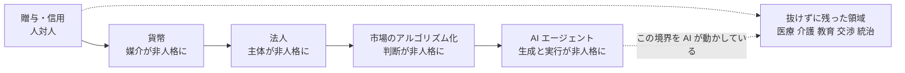
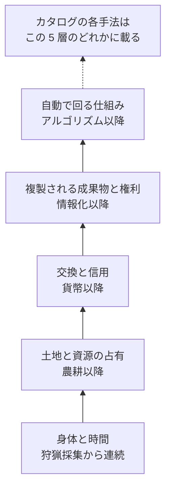

# Phase 2: 歴史軸 — 希少性の移動と、人の脱落

追うのは 2 本だけ。**何が希少だったか**と、**取引から誰が抜けたか**。
通史の網羅はしない（歴史記述に踏み込むと体系が使えなくなる）。

読み方: [../overview.md](../overview.md) ／ 入口: [../income-taxonomy.md](../income-taxonomy.md) ／ 前: [axes.md](axes.md) ／ 次: [catalog.md](catalog.md)

**記法**: L1〜L3（人の関与度）／ P1〜P6（当事者構成）／ 1〜9（価値の源泉）／ A1〜J4（手法 ID）／ ⚠（法規制・利用規約に触れる）／【推測】【実測】（数値の根拠）。定義は [axes.md の記法](axes.md#記法)。

**この層を支える学問**: 経済人類学（贈与・負債）、地代論、ギルド研究、Polanyi の二重運動 → [related-fields.md](related-fields.md) §3

## 全体表

| 時代 | 希少だったもの | 代表的な収入手法 | 取引から抜けたもの | 人対人のまま残った例 |
| --- | --- | --- | --- | --- |
| 狩猟採集 | 食料・体力 | 分配・贈与（貨幣以前） | — 何も抜けていない | すべて |
| 農耕 | 土地・収穫 | 地代、小作、年貢 | 労働と収入の直結（土地が稼ぐ） | 出産・治療・祭祀 |
| 交易 | 距離・情報の非対称 | 商人、仲介、運搬 | 生産者と消費者の対面 | 交渉・信用の見極め |
| 貨幣・信用の成立 | 交換の媒介・信用 | 両替、貸付、利子 | 物そのもの（価値が数値になる） | 貸す相手の人物評価 |
| 手工業・ギルド | 技能 | 職人、徒弟、独占的販売 | — 技能で人が戻る | 徒弟への伝承 |
| 産業革命 | 資本・機械 | 賃労働、株式、工場所有 | 職人の身体（機械が代替） | 監督・労務・医療 |
| 法人・株式会社 | 大規模な資本集約 | 配当、経営、有限責任 | 取引主体としての個人 | 経営判断・統治 |
| 情報・ソフトウェア | 複製コストの消失 | ライセンス、SaaS、広告 | 生産の反復 | 設計・営業・サポート |
| ネットワーク・プラットフォーム | 集約された需給 | 手数料、マッチング、レベニューシェア | 売り手と買い手の相互認知 | 紛争解決・与信 |
| 市場のアルゴリズム化 | 速度・情報処理 | 高頻度取引、アドテク、自動マーケットメイク | 判断する人間 | 規制対応・責任の引受 |
| AI | 生成コストの消失 | → [ai-delta.md](ai-delta.md) で扱う | → [ai-delta.md](ai-delta.md) で扱う | → [ai-delta.md](ai-delta.md) で扱う |

## 各時代（何が希少 → 誰が払った → なぜ成立した → 誰が居なくなった）

### 狩猟採集

- 希少: 今日の食料と、それを獲れる体力
- 払った側: 集団の他の成員（金銭ではなく将来の分配で返す）
- 成立理由: 保存が利かないので、貯めるより配って貸しを作るほうが合理的だった
- 抜けたもの: なし。取引は全面的に人対人で、相手の顔と履歴が担保だった

### 農耕

- 希少: 耕せる土地と、そこから出る収穫
- 払った側: 土地を持たない耕作者（地代・小作料・年貢として）
- 成立理由: 収穫が保存・蓄積できるようになり、余剰の所有権が発生した
- 抜けたもの: **労働と収入の直結**。働かない者が土地を持つだけで収入を得る形が初めて成立した

軸 A でいう「9 資源」の起点。L3（関与しない）の最古の形がここで生まれている。

### 交易

- 希少: 距離と、その両端の価格差を知っていること
- 払った側: 遠方の品を欲しがる消費者
- 成立理由: 情報の非対称が大きく、繋ぐだけで差額が取れた
- 抜けたもの: **生産者と消費者の対面**。作った人と使う人が互いを知らなくなった

軸 A の「7 仲介・場」の起点。以後この源泉は、非対称が縮むたびに単価を落としていく。

### 貨幣・信用の成立

- 希少: 誰とでも交換できる媒介と、返済されるという信用
- 払った側: 手元に元手がない者（利子として）
- 成立理由: 価値が数値に還元され、時間をまたいで持ち運べるようになった
- 抜けたもの: **物そのもの**。取引の中身が実体から数値に置き換わった

軸 A の「5 資本」の起点であり、仮説 2 でいう「媒介が非人格になった」段。

### 手工業・ギルド

- 希少: 長い修業でしか身につかない技能
- 払った側: 完成品を必要とする都市の住民
- 成立理由: 技能の習得コストが高く、ギルドが参入をさらに絞った
- 抜けたもの: なし。**むしろ人が戻った時代**

一方向に進むわけではない、という反例としてこの行を残す。
希少性が「土地・貨幣」から「身体に埋め込まれた技能」に戻ったため、収入も人に戻った。
AI 以後に人対人が再評価されうるかを考えるときの、唯一の歴史的前例になる。

### 産業革命

- 希少: 機械を買える資本と、それを置く工場
- 払った側: 安価な製品を求める大衆市場
- 成立理由: 機械が職人の技能を分解し、未熟練でも生産できるようにした
- 抜けたもの: **職人の身体**。技能の価値が機械に移り、人は時間を売る側に押し戻された

軸 A の「2 技能」から「1 時間」への大規模な移動。同じ移動が AI で起きるかが Phase 4 の主題。

### 法人・株式会社

- 希少: 個人では集められない規模の資本
- 払った側: 出資者に対して法人が（配当として）
- 成立理由: 有限責任が発明され、破産リスクを出資額に限定できた
- 抜けたもの: **取引主体としての個人**。契約する側が人ではなく法人になった

仮説 2 の「主体が非人格になった」段。軸 C の P6（非人格の主体）はここで生まれる。

### 情報・ソフトウェア

- 希少: 複製コストがゼロになったので、**複製されるに値する原本**
- 払った側: 利用者（ライセンス料・サブスクリプション）と、広告主
- 成立理由: 限界費用がほぼゼロになり、売れば売るだけ利益率が上がる構造になった
- 抜けたもの: **生産の反復**。一度作れば作り直さなくてよくなった

軸 B の L2（初回のみ関与）が、少数の職業から誰でも取れる形に降りてきた段。

### ネットワーク・プラットフォーム

- 希少: 集約された需給そのもの（売り手と買い手が一箇所に居ること）
- 払った側: 出品者・出店者（手数料・レベニューシェア）
- 成立理由: 参加者が増えるほど価値が上がるため、勝者が需給を独占できた
- 抜けたもの: **売り手と買い手の相互認知**。誰から買ったかを覚えなくなった

「7 仲介・場」が個人の商人から常設のインフラに変わり、仲介マージンが恒久化した。

### 市場のアルゴリズム化

- 希少: 速度と情報処理量
- 払った側: 遅い参加者（スプレッド・スリッページとして）
- 成立理由: 価格発見が機械の速度で回るようになり、人間の反応速度では勝てなくなった
- 抜けたもの: **判断する人間**。売買の意思決定そのものが機械に移った

仮説 2 の「判断が非人格になった」段。軸 C の P5（システム → システム）が主流になる。

## 抜けたものだけを並べると一本の線になる

この図の主張: 経済史は、取引から人を段階的に抜いてきた一本の線として読める。

起点は物々交換ではなく**贈与・信用**に置く。人類学の記録では貨幣以前の交換は贈与と帳簿的な貸し借り（信用）で行われ、
物々交換は貨幣経済が壊れたときに現れる一時的な現象である（Humphrey 1985、Graeber 2011。[related-fields.md](related-fields.md) §7 異議 A、2026-08-26 修正）。

抜けた順に注目する。**媒介 → 主体 → 判断 → 生成と実行**。
残っているのは「責任を負う主体であること」と「身体がそこにあること」の 2 つだけになりつつある。
Phase 4 の問いはここから出る。

## 古い層は消えない

この図の主張: 新しい層ができても古い層は消えず、今日の収入手法はこの 5 層のどこかに載っている。

農耕が始まっても狩猟は消えず、産業革命後も職人は残った。
「AI が来たから労働型は終わり」という読み方をこの図は否定する。
起きるのは消滅ではなく、**各層の単価と、層ごとの人数の再配分**である。

## 歴史から取り出す 3 つの読み筋

1. **希少性は「作りにくいもの」から「余りにくいもの」へ移る。**
   複製が容易になった側は必ず単価が落ちる。落ちた先で希少になるのは、複製できない側（占有、責任、関係）。
2. **人が抜けた領域は、抜けたあとに単価が上がることがある。**
   仲介から人が抜けてプラットフォームになったとき、仲介マージンは消えず、むしろ恒久化した。
   AI で人が抜ける領域も、収入がゼロになるのではなく**受け取り手が変わる**と読むのが自然。
3. **一方向とは限らない。**
   ギルドの時代は、希少性が人の身体に戻った実例である。
   Polanyi はこれを**二重運動**と呼んだ: 市場化（取引から人を抜く）が進むたびに、社会は保護（人を戻す）で応じる（[related-fields.md](related-fields.md) §7 異議 E）。
   AI 以後に「人がやったこと自体」が希少財になる筋は、歴史的にありえない話ではない。
