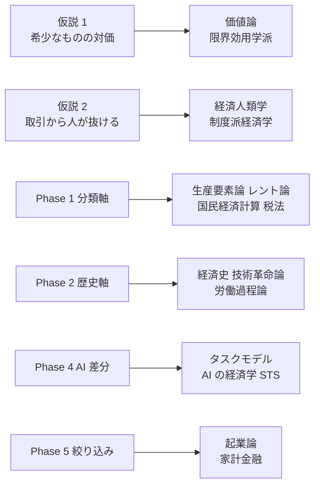
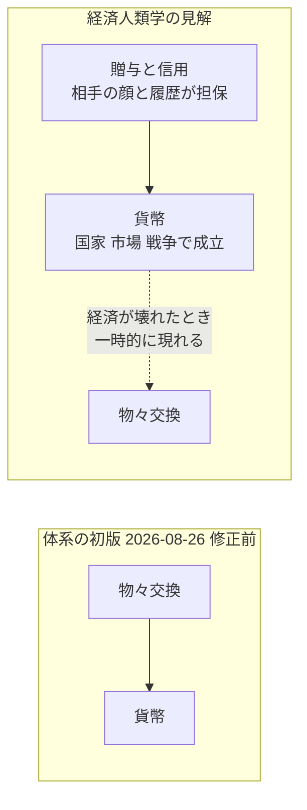
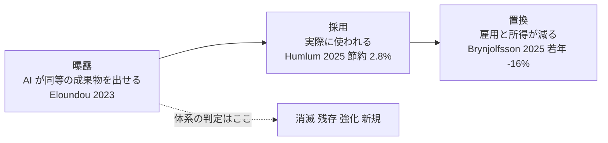

# 収入体系に接続する学問

[体系](../income-taxonomy.md) の各層が、どの学問のどの概念の上に載っているかを対応付ける。
目的は 2 つ。**体系を補強する材料**を確保することと、**学問側から見て体系が食い違っている点**を洗い出すこと。

入口: [../income-taxonomy.md](../income-taxonomy.md) ／ 関連: [axes.md](axes.md) [history.md](history.md) [ai-delta.md](ai-delta.md) [shortlist.md](shortlist.md)

**記法**: L1〜L3（人の関与度）／ P1〜P6（当事者構成）／ 1〜9（価値の源泉）／ A1〜J4（手法 ID）／ ⚠（法規制・利用規約に触れる）／【推測】【実測】（数値の根拠）。定義は [axes.md の記法](axes.md#記法)。

## 全体マップ

この図の主張: 体系の各層は、それぞれ別の学問の上に載っている。1 つの学問で全部は説明できない。

体系の結論のうち最も強く裏付けが取れたのは、**「生成が安くなると判断・責任が希少になる」**
（Agrawal, Gans & Goldfarb の「予測が安くなると判断が高くなる」と同型）と、
**「人対人は残るがスケールしない」**（Baumol のコスト病そのもの）の 2 つ。
逆に最も強い異議を受けるのは、**歴史線の起点を物々交換に置いたこと**（経済人類学は否定している）と、
**AI 差分の判定が「できるか」止まりで「実際に置き換わったか」を見ていないこと**の 2 つ。

## 1. 背骨の仮説

### 仮説 1: 収入とは希少なものを渡した対価である

| 学問・概念 | 代表文献 | 体系との対応 |
| --- | --- | --- |
| 経済学の定義（希少な手段の配分） | Robbins, *An Essay on the Nature and Significance of Economic Science* (1932) | 仮説 1 の前提そのもの |
| 限界効用学派・主観価値説 | Menger, *Grundsätze der Volkswirtschaftslehre* (1871) | 価値は希少性と主観から生まれる。「何が希少かは時代で移る」は主観価値説の帰結 |
| 労働価値説（対立仮説） | Smith (1776), Ricardo (1817), Marx (1867) | 価値を投下労働で説明する。体系はこれを採らない。L3（人が関与しない収入）を説明できないため |
| 所得の定義 | Fisher, *The Nature of Capital and Income* (1906); Hicks, *Value and Capital* (1939) | 所得＝資本を減らさずに消費できる流れ。網羅性テストで「単発の資産処分」を体系外にした判断と一致 |

### 仮説 2: 経済史は取引から人を抜いてきた

| 学問・概念 | 代表文献 | 体系との対応 |
| --- | --- | --- |
| 大転換・擬制商品・離床 | Polanyi, *The Great Transformation* (1944)【邦訳あり】 | 労働・土地・貨幣を商品化し、経済を社会関係から「離床」させた。体系の **1 時間・9 資源・5 資本** は Polanyi の 3 つの擬制商品と一致する。「人が抜ける」＝離床 |
| 二重運動 | 同上 | 市場化には社会からの押し返しが必ず伴う。体系がギルドを「人が戻った反例」として置いたのはこれに対応する |
| 企業の本質・取引費用 | Coase, "The Nature of the Firm" (1937) | 法人という非人格の主体が取引主体になる理由 |
| 所有と経営の分離 | Berle & Means, *The Modern Corporation and Private Property* (1932) | カタログの E6（所有型）／ E7（経営型）の分割そのもの |
| 法人格の本質＝資産分割 | Hansmann & Kraakman, "The Essential Role of Organizational Law" (2000) | P6 非人格の主体が「受け取り手」になれる法的根拠 |
| 埋め込み | Granovetter, "Economic Action and Social Structure" (1985) | 経済行為は人が抜けた後も社会関係に埋め込まれている。「関係」が残る根拠 |
| 物々交換の神話 | Humphrey, "Barter and Economic Disintegration" (1985); Graeber, *Debt: The First 5,000 Years* (2011)【邦訳あり】 | **異議 A**。物々交換の段階は民族誌上一度も観察されていない |

## 2. Phase 1 分類軸

### 主軸 A: 価値の源泉 ↔ 生産要素論・レント論

体系の 9 源泉は、経済学の「生産要素」（労働・土地・資本＋企業家）を現代向けに細分したものになっている。

| 源泉 | 対応する概念 | 代表文献 |
| --- | --- | --- |
| 1 時間 | 生産要素としての労働。Polanyi の擬制商品「労働」 | Polanyi (1944) |
| 2 技能 | 人的資本。職業免許による参入制限。専門職の管轄 | Becker, *Human Capital* (1964); Kleiner, *Licensing Occupations* (2006); Abbott, *The System of Professions* (1988) |
| 3 成果物 | 情報財の経済学。限界費用ゼロ | Shapiro & Varian, *Information Rules* (1998) |
| 4 権利 | 知的財産のレント。法が作る希少性 | Christophers, *Rentier Capitalism* (2020) の IP rent |
| 5 資本 | 生産要素としての資本。利子論 | Fisher, *The Theory of Interest* (1930) |
| 6 リスク引受 | 利潤＝不確実性を負担した報酬 | Knight, *Risk, Uncertainty and Profit* (1921) |
| 7 仲介・場 | 情報の非対称。仲介理論。起業家的機敏性。二面市場 | Akerlof (1970); Spulber, *Market Microstructure* (1999); Kirzner (1973); Rochet & Tirole (2003) |
| 8 注目 | アテンション・エコノミー。スーパースターの経済学。象徴資本 | Simon (1971); Rosen, "The Economics of Superstars" (1981); Bourdieu, "The Forms of Capital" (1986) |
| 9 資源 | 地代論。経済レント | Ricardo, *On the Principles of Political Economy and Taxation* (1817) |

**レント論との対応が最も強い。** Christophers (2020) はレントを
「希少な資産の所有・占有・支配から、競争が限定された条件下で得られる所得」と定義し、
資産を 7 種（金融・天然資源・知的財産・デジタルプラットフォーム・サービス契約・インフラ・土地）に分けている。
これは体系の **L3（関与しない）側をそのまま切り出したもの** に相当する。

| Christophers の 7 レント | 体系の対応 |
| --- | --- |
| 金融 | 5 資本（E 群） |
| 天然資源 | 9 資源（I4, I5） |
| 知的財産 | 4 権利（D 群） |
| デジタルプラットフォーム | 7 仲介・場のうち L3 側（G2） |
| サービス契約 | 4 権利のうち D4 フランチャイズ |
| インフラ | 9 資源（I8 計算資源） |
| 土地 | 9 資源（I1, I2） |

Bourdieu の「資本の諸形態」（経済資本・文化資本・社会関係資本・象徴資本）も対応する。
文化資本＝2 技能、社会関係資本＝関係（G5, H2）、象徴資本＝8 注目の記名側。
Phase 4 で「次に希少になる」とした **関係・真正性** は、Bourdieu の語彙では社会関係資本と象徴資本である。

### 主軸 B: 人の関与度 ↔ 労働所得と資本所得

| 学問・概念 | 代表文献 | 体系との対応 |
| --- | --- | --- |
| 資本所得と労働所得の分配（r > g） | Piketty, *Capital in the Twenty-First Century* (2013)【邦訳あり】 | L1 と L3 の分布論。「元手ゼロと L3 は両立しない」の巨視的な裏付け |
| 労働分配率の低下 | Karabarbounis & Neiman, "The Global Decline of the Labor Share" (2014) | 「人が抜ける」の計量的な裏付け |
| スーパースターの経済学 | Rosen (1981) | 複製可能な才能は勝者総取りになる。L2 がスケールする理由 |
| コスト病 | Baumol & Bowen, *Performing Arts: The Economic Dilemma* (1966); Baumol, *The Cost Disease* (2012) | 生演奏は生産性が上がらないが相対価格は上がる。**「人対人は残るがスケールしない」の理論的根拠**であり、残存判定の「単価は維持または上昇」もコスト病の予測と一致 |

制度化された分類との対応も取れる。国民経済計算と所得税法は、どちらも「所得の源泉」で区分している。

| 体系 | SNA 2008（国民経済計算） | 所得税法の 10 区分 |
| --- | --- | --- |
| L1 時間・技能 | 雇用者報酬 ／ 混合所得 | 給与所得、事業所得 |
| L2 成果物・権利 | 混合所得（使用料はサービス産出扱い） | 事業所得、雑所得（印税） |
| L3 資本 | 財産所得（利子・配当） | 利子所得、配当所得 |
| L3 資源 | 財産所得（天然資源の賃貸料）／ 不動産サービス産出 | 不動産所得、山林所得 |
| 体系外: 単発の資産処分 | 資本取引（所得でない） | 譲渡所得。生活用動産の譲渡は非課税 |
| 体系外: 移転収入 | 経常移転（第二次所得分配） | 一時所得。遺族年金は非課税 |

網羅性テストで外した 2 件（メルカリの不用品売却、遺族年金）は、
**税法上も所得の外（非課税）に置かれている**。体系の対象範囲の判断は制度と一致している。
ただし譲渡所得の扱いには問題が残る（**異議 D**）。

通俗版として Kiyosaki の「キャッシュフロー・クワドラント」（E/S/B/I）が同じ軸を扱っているが、学術的な裏付けは上表の側にある。

### 軸 C: 当事者構成 ↔ 取引費用・プラットフォーム・エージェント経済

| 構成 | 学問・概念 | 代表文献 |
| --- | --- | --- |
| P1 P2 人対人 | 関係的契約。埋め込み | Macneil, *The New Social Contract* (1980); Granovetter (1985) |
| P3 人 → システム | ゴーストワーク。データは労働か | Gray & Suri, *Ghost Work* (2019); Arrieta-Ibarra, Goff, Jiménez-Hernández, Lanier & Weyl, "Should We Treat Data as Labor?" (2018) |
| P4 システム → 人 | プラットフォーム資本主義。二面市場 | Srnicek, *Platform Capitalism* (2017); Rochet & Tirole (2003); Parker, Van Alstyne & Choudary, *Platform Revolution* (2016) |
| P5 システム → システム | 市場ミクロ構造。HFT の軍拡競争。エージェント経済 | Budish, Cramton & Shim, "The High-Frequency Trading Arms Race" (2015); Tomašev et al., "Virtual Agent Economies" (2025) |
| P6 非人格の主体 | 企業の本質。AI の法人格論 | Coase (1937); Solum, "Legal Personhood for Artificial Intelligences" (1992); Bryson, Diamantis & Grant, "Of, for, and by the people" (2017) |

Tomašev et al. (2025, Google DeepMind) は、AI エージェントが人間の直接監督を超えた規模と速度で取引する
「サンドボックス経済」を、**発生（自然発生／意図的）** と **透過性（人間経済と繋がっているか／隔離されているか）** の
2 軸で整理し、現状は「自然発生かつ高透過」に向かっていると論じている。
体系が「AI エージェント同士の取引に個人が課金主体として入れるか」と問うた P5 の枠は、この論文の問題設定と同じ。
「データは労働か」（2018）は、体系の I7（独自データセットの提供）と A3（ギグ）を P3 に置いた判断を支持する。

## 3. Phase 2 歴史軸

| 時代 | 学問・概念 | 代表文献 |
| --- | --- | --- |
| 狩猟採集 | 始原のあふれる社会。贈与の義務 | Sahlins, *Stone Age Economics* (1972)【邦訳あり】; Mauss, *Essai sur le don* (1925)【邦訳あり】 |
| 農耕 | 地代論。穀物と国家 | Ricardo (1817); Scott, *Against the Grain* (2017) |
| 交易 | 起業家的機敏性。物質文明 | Kirzner (1973); Braudel, *Civilisation matérielle, économie et capitalisme* (1979) |
| 貨幣・信用 | 貨幣の起源（物々交換起点）と、その否定（信用が先） | Menger, "On the Origin of Money" (1892) ↔ Humphrey (1985); Graeber (2011) |
| 手工業・ギルド | ギルドと技術革新。専門職の管轄 | Epstein & Prak (eds.), *Guilds, Innovation and the European Economy* (2008); Abbott (1988) |
| 産業革命 | 高賃金が機械化を誘発。脱技能化 | Allen, *The British Industrial Revolution in Global Perspective* (2009); Braverman, *Labor and Monopoly Capital* (1974) |
| 法人 | 所有と経営の分離 | Berle & Means (1932) |
| 情報・ソフトウェア | 情報財の経済学。技術革命と金融資本 | Shapiro & Varian (1998); Perez, *Technological Revolutions and Financial Capital* (2002) |
| プラットフォーム | プラットフォーム資本主義 | Srnicek (2017) |
| 市場のアルゴリズム化 | HFT の軍拡競争 | Budish, Cramton & Shim (2015); MacKenzie, *Trading at the Speed of Light* (2021) |
| 通史の枠組み | 創造的破壊。技術革命の長波 | Schumpeter, *Capitalism, Socialism and Democracy* (1942); Perez (2002) |

歴史軸で最も重い指摘は起点にある。体系は「物々交換（人対人）→ 貨幣」を出発点に置いたが、
これは Menger (1892) 以来の経済学の標準的な説明であって、経済人類学は否定している。
Humphrey (1985) は「純粋な物々交換経済の例は一つも記述されておらず、そこから貨幣が生まれた例もない」と結論し、
Graeber (2011) は贈与と信用（誰が誰に借りがあるか）が先で、貨幣は国家・市場・戦争を通じて成立し、
物々交換は**貨幣経済が壊れたときに一時的に現れる**ものだと論じている。

この図の主張: 経済人類学に従うと、歴史線の起点は「物々交換」ではなく「贈与・信用」になる。

体系の全体表は狩猟採集の行を「分配・贈与」と書いており、こちらは人類学と整合していた。
食い違っていたのは一本線の図と仮説 2 の文言だけで、**2026-08-26 に「贈与・信用」へ修正済み**（**異議 A**）。

## 4. Phase 4 AI 差分

### 判定フローの対応

体系の判定フロー（AI が出せるか → 人が出すことに価値があるか → 新たに成立するか）は、
労働経済学の **タスクベース・モデル** をほぼそのままなぞっている。

| 学問・概念 | 代表文献 | 体系との対応 |
| --- | --- | --- |
| タスクベース・モデル（ルーティン／非ルーティン） | Autor, Levy & Murnane, "The Skill Content of Recent Technological Change" (2003) | 職業ではなくタスク単位で見る。体系の「工程で割れる」表はタスク分析そのもの |
| 置換効果と復元効果（新タスク） | Acemoglu & Restrepo, "The Race between Man and Machine" (2018); "Automation and New Tasks" (2019) | **消滅＝置換効果、新規＝復元効果**。強化＝補完 |
| 補完と代替 | Autor, "Why Are There Still So Many Jobs?" (2015) | 自動化は残ったタスクの価値を上げる。残存判定の「単価は上がりうる」の根拠 |
| チューリングの罠（自動化 vs 拡張） | Brynjolfsson, "The Turing Trap" (2022) | 消滅 vs 強化の区別 |
| 新しい仕事の起源 | Autor, Chin, Salomons & Seegmiller, "New Frontiers" (2024) | 1940–2018 の新職種の大半が新技術由来。**「新規」枠は歴史的に必ず生まれる** |
| 職業・タスクの曝露推定 | Frey & Osborne (2013, 職業単位); Eloundou, Manning, Mishkin & Rock, "GPTs are GPTs" (2023, タスク単位) | 体系の判定は「曝露」推定に相当する。O*NET のタスクデータで機械的に再現できる |
| 実利用のタスク集計 | Anthropic Economic Index (2025–2026) | 職業の約 49% でタスクの 1/4 以上に Claude が使われ、拡張 55% ／ 自動化 42%（2026 年 3 月）。判定を「曝露」から「実利用」に更新する材料 |

### 「次に希少になるもの」の対応

| 学問・概念 | 代表文献 | 体系との対応 |
| --- | --- | --- |
| 予測が安くなると判断が高くなる | Agrawal, Gans & Goldfarb, *Prediction Machines* (2018)【邦訳あり】 | **体系の「生成が安くなると判断・責任が希少になる」と同型**。最も直接的な先行研究 |
| 補完的資産 | Teece, "Profiting from Technological Innovation" (1986) | コア技術が模倣可能になると利益は流通・ブランドなど補完的資産へ移る。体系の「流通経路」「真正性」 |
| 無料より良いもの（非学術） | Kelly, "Better Than Free" (2008) | コピーが無料になっても残る 8 つ: 即時性・個別化・解釈・真正性・アクセス・身体性・パトロン・発見可能性。体系の 7 項目とほぼ重なる |
| ポランニーのパラドックス（暗黙知） | M. Polanyi, *The Tacit Dimension* (1966); Autor, "Polanyi's Paradox" (2014) | 言語化できない技能は機械化しにくい |
| モラベックのパラドックス | Moravec, *Mind Children* (1988) | 感覚運動は推論より機械に難しい。「身体」が強い根拠 |

### 「責任が残る」の対応 — 補強と異議の両方

| 立場 | 代表文献 | 体系との関係 |
| --- | --- | --- |
| 補強: 法が AI に責任を認めない限り、責任は人に残る | Solum (1992); Bryson, Diamantis & Grant (2017, AI の法人格に反対) | 体系の「責任は法が支えているので個人の選好では崩れない」と一致 |
| 異議: 人が残るのは価値があるからではなく、責任の吸収体として | Elish, "Moral Crumple Zones" (2019) | **異議 C**。残った人は権限なしに責任だけ負わされる。単価が上がる保証はない |
| 異議: 自動化が進むほど残った人の仕事は難しくなる | Bainbridge, "Ironies of Automation" (1983) | 残存＝楽な仕事ではない。監視と例外処理だけが残る |

### 「関係が残る」の対応

Granovetter (1985) の埋め込み、Macneil (1980) の関係的契約、Coleman (1988) と Putnam (2000) の社会関係資本。
体系が「関係は相手が AI でいいと思った瞬間に崩れる」と評価を「中くらい」にした点は、
社会関係資本が主観に依存するという Coleman の定義と整合する。

### 実証研究 — 判定は「曝露」止まり

| 研究 | 対象 | 結果 | 体系への含意 |
| --- | --- | --- | --- |
| Eloundou et al. (2023) | 職業タスク × LLM 曝露 | 米労働者の約 8 割が 1 割以上のタスクで曝露 | 曝露は広い。ただし「できる」の推定 |
| Noy & Zhang (2023, *Science*) | 文章作成の RCT | 所要時間が大きく減り品質も上がる | B6・C1 の消滅判定を実験室で裏付ける |
| Brynjolfsson, Li & Raymond (2025, *QJE*) | コールセンター | 生産性向上、未熟練者ほど大きい | 強化は初心者側に効く |
| Dell'Acqua et al. (2023) | コンサルタントの RCT | 境界内は改善、境界外は悪化（ギザギザの境界） | 強化と消滅は同じ職業内で混在する |
| Humlum & Vestergaard (2025, NBER) | デンマーク 25,000 人 | 賃金・労働時間への効果は ±1% 以内。時間節約は 2.8% | **曝露 ≠ 置換**。普及後も所得は動いていない |
| Brynjolfsson, Chandar & Chen (2025, 2026 改訂) | 米 ADP 給与データ | 22〜25 歳の曝露職で雇用が相対 16% 減。経験者は安定 | 効くのは入口。既存の L1 従事者は当面残る |

この図の主張: 学問は「AI にできる」と「実際に収入が減る」の間に 2 段の落差を置く。体系の判定はまだ 1 段目しか見ていない。

体系の消滅判定 7 件のうち、置換まで実証があるのは文章作成系（B6, C1）だけで、
残りは曝露の推定に基づいている（**異議 B**）。
一方で Brynjolfsson et al. (2025) の「効くのは若年・入口」は、体系の
「既存の L1 従事者は残る」「新規参入の入口が消える」という読みを支持する。

## 5. Phase 5 絞り込み

| 学問・概念 | 代表文献 | 体系との対応 |
| --- | --- | --- |
| エフェクチュエーション | Sarasvathy, "Causation and Effectuation" (2001) | 起業家は目的からではなく手段（自分は誰か・何を知っているか・誰を知っているか・**許容損失**）から始める。Phase 5 が「手持ちの資本・スキル・時間を先に明文化する」のと一致。許容損失は資金・期間の 2 軸そのもの |
| 科学的アプローチの起業 | Camuffo, Cordova, Gambardella & Spina (2020, *Management Science*, 116 社の RCT); 2024 年に大規模再現 | 仮説を立てて検証する起業家は、そうでない起業家より撤退が早く成果が良い。**「試す → 記録 → 判断」サイクルの実証的根拠** |
| 家計金融 | Campbell, "Household Finance" (2006) | 個人の資産配分の実証。E1 の位置付け |
| 資本予算（回収期間法） | Graham & Harvey, "The Theory and Practice of Corporate Finance" (2001) | 回収期間法は理論的に NPV に劣るが実務で使われ続ける。体系の「回収期間」軸はこれを個人に適用したもの |

## 6. 分類の方法論

| 学問・概念 | 代表文献 | 体系との対応 |
| --- | --- | --- |
| 理念型 | Weber, *Wirtschaft und Gesellschaft* (1922) | 各カテゴリは純粋型であり、実例はどれも混合。副源泉を備考に残す扱いはこれに沿う |
| 類型論と分類学の区別 | Bailey, *Typologies and Taxonomies* (1994) | 概念から軸を先に決めるのが類型（typology）、データから帰納するのが分類（taxonomy）。本体系は名前に反して**類型**。「軸を先に決めてからカタログを流し込む」順序は類型論の作法 |
| 類型の運用 | Collier, LaPorte & Seawright, "Putting Typologies to Work" (2012) | 類型は概念の座標系であり、各セルに実例が要る。体系の実例テストと一致 |

## 7. 学問側からの異議

補強だけでは調査の意味がない。体系が食い違っている点を重い順に並べる。

| # | 異議 | 根拠 | 体系の該当箇所 | 修正の方向 | 重さ |
| --- | --- | --- | --- | --- | --- |
| B | AI 差分の判定が「曝露」止まりで、「実際に置き換わったか」を見ていない | Humlum & Vestergaard (2025); Brynjolfsson, Chandar & Chen (2025) | [ai-delta.md](ai-delta.md) 全 64 件 | 判定に「置換の実証: 有／無／未」の列を足す。消滅 7 件のうち実証があるのは B6・C1 のみと明記する | 中 |
| C | 「責任が残る＝単価は維持または上昇」は楽観 | Elish (2019); Bainbridge (1983) | [ai-delta.md](ai-delta.md) 残存の定義 | 残存を「価値として残る（Baumol 型: 単価上昇）」と「責任の吸収体として残る（Elish 型: 単価は下がりうる）」に分ける | 中 |
| D | 資本収入から譲渡益（キャピタルゲイン）が抜けている | 所得税法の譲渡所得; Haig–Simons の包括的所得概念（保有利得を所得に含める）; 投資実務のトータルリターン | [catalog.md](catalog.md) E1; 網羅性テスト #19 | E1 を「配当＋値上がり益」に広げるか、譲渡益を L3 の別エントリとして立てる。「単発の資産処分は体系外」との整合を取る必要がある | 中 |
| A | 歴史線の起点を物々交換に置いている | Humphrey (1985); Graeber (2011) | [history.md](history.md) 一本線の図、仮説 2 の文言 | 起点を「贈与・信用（人対人）」に変え、物々交換は「貨幣経済が壊れたときの一時的現象」として注記する | 軽 |
| E | 「取引から人を抜く」は一方向ではない | Polanyi の二重運動; Granovetter の埋め込み | [history.md](history.md) 仮説 2 | ギルドの反例は既に置いてあるので、「二重運動」として名前を付けて明示すれば足りる | 軽 |
| F | 仲介の単価は「非対称が消えると同時に消える」わけではない | Spulber (1999); Christophers (2020) の platform rent | [axes.md](axes.md) 源泉 7 の定義 | 「情報の非対称を埋める」（L1、非対称と共に消える）と「場を占有する」（L3、レント）を分ける。G2 は既に L3 なので整合は取れるが、定義文が狭い | 軽 |
| G | 「資源」に建物賃貸を含めるのは SNA と異なる | SNA 2008 では建物賃貸はサービス産出、賃貸料（rent）は天然資源のみ | [axes.md](axes.md) 源泉 9 | 体系の定義（占有が入金を生む）としては一貫しているので、注記で足りる | 軽 |

**対応状況（2026-08-26 すべて反映済み）**

| 異議 | 対応 | 反映先 |
| --- | --- | --- |
| A | 歴史線の起点を「贈与・信用」に変更、物々交換を注記 | [history.md](history.md)、[../income-taxonomy.md](../income-taxonomy.md) 仮説 2 |
| B | 「置換の実証: 有／未／—」列を追加。判定は曝露段階に基づくと明示。実証があるのは B6・C1 のみ | [ai-delta.md](ai-delta.md) |
| C | 残存を価値型（Baumol、23 件）／責任型（Elish、4 件: B2, B3, B9, B12）に二分 | [ai-delta.md](ai-delta.md) |
| D | 譲渡益を **E8** として新設。単発の資産処分は体系外のままとし、繰り返す運用のみ体系内と定義 | [catalog.md](catalog.md)、[axes.md](axes.md) 注記 |
| E | 二重運動（Polanyi）を明記 | [history.md](history.md)、[../income-taxonomy.md](../income-taxonomy.md) 仮説 2 |
| F | 源泉 7 を非対称型（L1）／占有型（L3・レント）に分割 | [axes.md](axes.md) |
| G | SNA 2008 との定義差を注記 | [axes.md](axes.md) |

## 8. 読む順

体系を補強・修正するのに効く順。上から 10 件。

| 順 | 文献 | 効く層 | 何が得られるか |
| --- | --- | --- | --- |
| 1 | Agrawal, Gans & Goldfarb, *Prediction Machines* (2018)【邦訳『予測マシンの世紀』】 | Phase 4 | 「安くなったものの隣が高くなる」の骨格。体系の結論をそのまま強化する |
| 2 | Autor, "Why Are There Still So Many Jobs?" (2015, *JEP*, 無料) | Phase 4 | タスクモデルの入門。補完と代替の区別 |
| 3 | Acemoglu & Restrepo, "Automation and New Tasks" (2019, *JEP*, 無料) | Phase 4 | 消滅（置換効果）と新規（復元効果）の理論 |
| 4 | Humlum & Vestergaard (2025, NBER WP, 無料); Brynjolfsson, Chandar & Chen (2025, WP, 無料) | Phase 4 | 曝露と置換の落差。異議 B の一次資料 |
| 5 | Christophers, *Rentier Capitalism* (2020) | Phase 1 | L3 側の全体像。7 つのレント |
| 6 | Polanyi, *The Great Transformation* (1944)【邦訳『大転換』】 | 仮説 2 | 擬制商品と離床。仮説 2 の原典 |
| 7 | Graeber, *Debt* (2011)【邦訳『負債論』】 | Phase 2 | 歴史線の起点の修正。異議 A |
| 8 | Baumol, *The Cost Disease* (2012) | Phase 4 | 人対人がスケールしない理由と、その単価が上がる理由 |
| 9 | Knight, *Risk, Uncertainty and Profit* (1921) | Phase 1 | リスク引受が独立の源泉である根拠 |
| 10 | Sarasvathy, "Causation and Effectuation" (2001, *AMR*) | Phase 5 | 手段から始める起業論。許容損失 |

## 文献の確認状況

以下の 9 件は本調査で Web 上の一次情報（arXiv、NBER、出版社、学会誌）を確認した。

| 文献 | 確認先 |
| --- | --- |
| Tomašev et al., "Virtual Agent Economies" (2025) | arXiv 2509.10147 |
| Brynjolfsson, Chandar & Chen, "Canaries in the Coal Mine?" (2025, 2026 改訂) | Stanford Digital Economy Lab |
| Humlum & Vestergaard, "Large Language Models, Small Labor Market Effects" (2025) | NBER WP 33777 |
| Christophers, *Rentier Capitalism* (2020) の 7 レント | Verso Books、書評 |
| Autor, Chin, Salomons & Seegmiller, "New Frontiers" (2024) | *QJE* 139(3) |
| Camuffo et al., "A Scientific Approach to Entrepreneurial Decision Making" (2020) | *Management Science* 66(2) |
| Arrieta-Ibarra et al., "Should We Treat Data as Labor?" (2018) | *AEA Papers and Proceedings* 108 |
| Anthropic Economic Index (2026 年 1 月・3 月報告) | anthropic.com |
| Humphrey, "Barter and Economic Disintegration" (1985) | *Man* 20(1) |

それ以外の文献は記憶に基づく。古典（Polanyi、Knight、Coase、Ricardo、Autor-Levy-Murnane 等）は書誌に確信があるが、
**引用して外に出す前には必ず原典を確認すること**。

## 受け入れ条件の検証結果

| # | テスト | 結果 |
| --- | --- | --- |
| 1 | 5 層すべてに対応する学問が付いているか | **合格** 仮説 2 本・Phase 1・2・4・5 すべてに 3 件以上 |
| 2 | 異議が 3 件以上あるか | **合格** 7 件（重: 0、中: 3、軽: 4） |
| 3 | 文献に著者・年・題名があり、確認できなかったものにその旨があるか | **合格** Web 確認 9 件を明示。残りは「記憶に基づく」と明記 |
| 4 | 図が 1 枚以上あり、直前に主張の 1 行があるか | **合格** 3 枚（全体マップ、歴史線の修正、曝露から置換への漏斗） |
