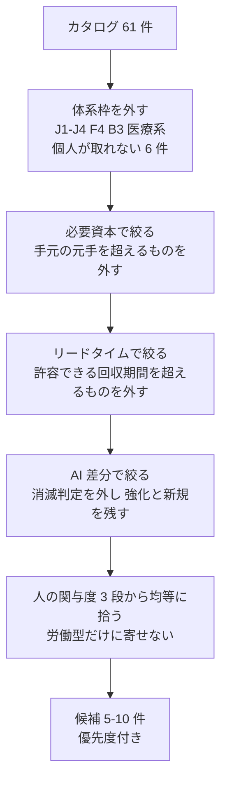
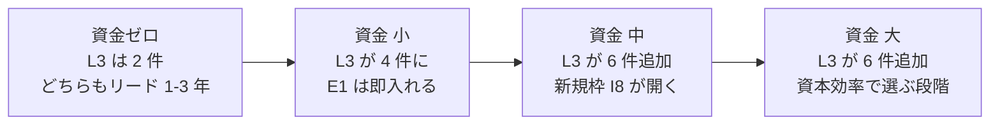
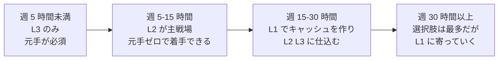
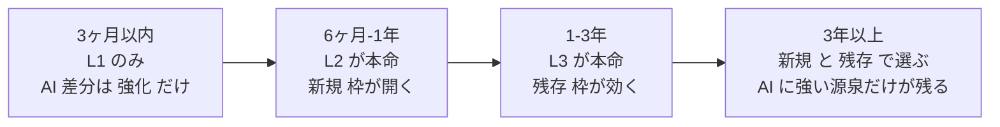

# Phase 5: 適用可能な候補の抽出

体系から実際に着手する候補を絞る。

本プロジェクトでは個人の制約を 1 つに決め打ちせず、**資金額別・時間別・期間別に分類して提示する**。
どのセグメントを選ぶかは着手時に決める（[TODO.md](../../../TODO.md) の起票分を参照）。

入口: [../income-taxonomy.md](../income-taxonomy.md) ／ 前: [ai-delta.md](ai-delta.md)

## 絞り込みの手順

この図の主張: 絞り込みは 4 段。制約の厳しい順に外し、最後に関与度で偏りを補正する。

**第 0 段（全セグメント共通）で外すもの** — 個人が制度上取れない 6 件

| ID | 手法 | 外す理由 |
| --- | --- | --- |
| B3 | 有資格の対人専門職 | 医師法等。今から取る手法ではない |
| F4 | 保険・債務保証 | 保険業法。個人は引受主体になれない |
| J1〜J4 | 徴税・公的運用・トレジャリー・法人運用 | 主体が個人でない |

**第 3 段で外すもの** — AI 消滅判定 7 件

B6 制作受託 / B7 翻訳 / C1 文章コンテンツ直販 / C2 オンライン講座 /
C3 素材・テンプレート販売 / G1 アフィリエイト / H1 広告収入

この 7 件は「AI で収入を稼ぐ」と聞いて最初に思いつく手法とほぼ一致する。
体系を作った最大の実利はここにある。**思いつきの入口が、そのまま単価崩壊層だった。**

残り: 61 − 6 − 7 = **48 件**がセグメント別の母集団になる。

---

## 資金額別

必要資本のレンジは下限で判定する。上位セグメントは下位セグメントの候補をすべて含む。

### 資金 ゼロ（〜10 万円）

母集団 22 件。**L3（関与しない）がほぼ取れない**のが決定的な特徴。

| 優先 | ID | 手法 | B 関与度 | AI 差分 | リード | なぜ上位／下位か |
| --- | --- | --- | --- | --- | --- | --- |
| 1 | I7 | 独自データセットの提供・販売 | L2 | **新規** | 〜1年 | 元手ゼロで唯一「新規」枠に入れる。⚠ 権利処理が本体 |
| 2 | B5 | 受託開発 | L1 | 強化 | 〜3ヶ月 | 即金性が最も高く、他の候補の元手を作れる |
| 3 | C4 | 買い切りソフト・アプリ | L2 | 強化 | 〜1年 | AI で開発コストが最も下がった層 |
| 4 | I6 | ドメインの運用・売却 | **L3** | 残存 | 1〜3年 | 元手ゼロで L3 に入れる数少ない枠。当たり外れが極端 |
| 5 | D5 | IP の二次利用許諾 | **L3** | 残存 | 1〜3年 | 元手ゼロの L3。ただし先に 8 注目の蓄積が要る |
| 6 | H4 | 有料メンバーシップ | L1 | 残存 | 〜1年 | 信頼を売る側。AI で希釈されない |
| 7 | D1 | 著作物の印税 | L2 | 強化 | 〜1年 | 権利は AI に最も強い源泉 |
| 8 | G5 | 紹介料・リファラル | L1 | 残存 | 〜3ヶ月 | 元手ゼロ。ただし人脈に完全依存 |

関与度の内訳: L1 が 3、L2 が 3、L3 が 2。L3 の 2 件はどちらもリード 1〜3 年で、
**元手ゼロのセグメントでは非労働収入がほぼ届かない**という制約がそのまま出ている。

### 資金 小（10 〜 100 万円）

上のすべて ＋ 以下。ここで初めて L3 が現実的な選択肢になる。

| 優先 | ID | 手法 | B 関与度 | AI 差分 | リード | なぜ上位／下位か |
| --- | --- | --- | --- | --- | --- | --- |
| 1 | C5 | SaaS（自社プロダクト） | L2 | 強化 | 〜1年 | AI で個人が作れる規模が最も上がった枠 |
| 2 | E1 | 上場株・ETF の配当 | **L3** | 残存 | 〜3ヶ月 | 小額でも L3 に入れる最短経路。維持工数ほぼゼロ |
| 3 | E4 | 暗号資産のステーキング | **L3** | 残存 | 即日 | 即日で L3。⚠ 価格変動が利回りを圧倒。税務も重い |
| 4 | F1 | 買取再販・せどり | L1 | 強化 | 即日 | 即金性は最高。⚠ 古物商許可 |
| 5 | E3 | 貸付・レンディング | **L3** | 強化 | 〜3ヶ月 | 与信が安くなった側。⚠ 貸金業法 |
| 6 | I2 | 遊休スペースの賃貸 | **L3** | 残存 | 〜3ヶ月 | 小額側（レンタルスペース転貸）なら射程 |
| 7 | B9 | コーチング・カウンセリング | L1 | 残存 | 〜1年 | 人対人の残存枠。単価は守れるがスケールしない |
| 8 | D2 | 特許・実用新案のライセンス | L2 | 強化 | 1〜3年 | 出願コストが AI で下がった |

### 資金 中（100 〜 1,000 万円）

上のすべて ＋ 以下。**L3 の選択肢が一気に増える**。

| 優先 | ID | 手法 | B 関与度 | AI 差分 | リード | なぜ上位／下位か |
| --- | --- | --- | --- | --- | --- | --- |
| 1 | I8 | 計算資源の貸出（GPU） | **L3** | **新規** | 〜3ヶ月 | AI 需要そのものに売る。新規枠かつ L3 |
| 2 | E2 | 債券・社債の利子 | **L3** | 残存 | 〜3ヶ月 | 維持工数ほぼゼロ。AI に無風 |
| 3 | G2 | マーケットプレイス運営 | **L3** | 強化 | 1〜3年 | AI で運営コストが最も下がった L3 |
| 4 | I3 | 自動販売機・無人販売 | **L3** | 強化 | 〜3ヶ月 | 補充を外注できれば L3 を維持 |
| 5 | I5 | 山林・農地の賃貸 | **L3** | 残存 | 1〜3年 | ⚠ 農地法。管理義務だけ残るリスク |
| 6 | F3 | 裁定・自動運用 | **L3** | 強化 | 〜1年 | 対戦相手も AI。鞘は縮む前提で |
| 7 | B1 | 施術・店舗型 | L1 | 残存 | 1〜3年 | 人対人の代表。AI 耐性は最強だがスケールしない |
| 8 | G3 | 不動産仲介・人材紹介 | L1 | 強化 | 〜1年 | ⚠ 免許。探索は自動化、成約は人 |

### 資金 大（1,000 万円〜）

上のすべて ＋ 以下。ここは **AI 差分よりも資本効率で決まる**。

| 優先 | ID | 手法 | B 関与度 | AI 差分 | リード | なぜ上位／下位か |
| --- | --- | --- | --- | --- | --- | --- |
| 1 | E6 | 事業買収・所有型 | **L3** | 強化 | 〜1年 | 買収後の AI 効率化で利益率が上がる |
| 2 | I1 | 不動産賃貸 | **L3** | 残存 | 〜1年 | AI に無風。維持工数を委託で下げられる |
| 3 | I4 | 太陽光発電の売電 | **L3** | 強化 | 〜1年 | AI データセンター需要で電力側は追い風。⚠ FIT/FIP |
| 4 | D6 | 権利の買取・相続 | **L3** | 残存 | 即日 | 買った瞬間から L3。評価の巧拙がすべて |
| 5 | E5 | 未公開株への出資 | **L3** | 強化 | 3年〜 | 流動性なし。長期資金でのみ |
| 6 | D4 | フランチャイズ本部 | **L3** | 強化 | 3年〜 | 維持工数が高く、実質は経営 |
| 7 | E7 | 事業買収・経営型 | L1 | 強化 | 〜1年 | 実質は高額な就職。L3 が目的なら E6 を選ぶ |

**資金軸から読める構造** — この図の主張: 資金が増えるほど、L3（関与しない収入）の選択肢が跳ね上がる。

---

## 投下時間別

第 0 段・第 3 段の除外後、**維持工数と関与度**で絞る。

### 週 5 時間未満

L1（毎回関与）は原則不可。**L3 に寄せるしかない**が、資金ゼロだと候補がほぼ残らない。

| 優先 | ID | 手法 | 必要資本 | B 関与度 | 備考 |
| --- | --- | --- | --- | --- | --- |
| 1 | E1 | 上場株・ETF の配当 | 小〜大 | L3 | 維持工数ほぼゼロ。この時間帯の第一候補 |
| 2 | E2 | 債券・社債の利子 | 中〜大 | L3 | 同上 |
| 3 | I1 | 不動産賃貸（管理委託） | 大 | L3 | 委託前提。自主管理にすると成立しない |
| 4 | D6 | 権利の買取・相続 | 中〜大 | L3 | 買うときだけ働く |
| 5 | I6 | ドメインの運用・売却 | ゼロ〜小 | L3 | 資金ゼロで唯一この時間帯に入る候補 |
| 6 | E4 | 暗号資産のステーキング | 小 | L3 | ⚠ 価格変動リスク |

**この時間帯の結論**: 資金がなければ選択肢は I6 のみ。
つまり **時間がなく元手もない状態からは、体系上ほぼ何も始められない**。
まず時間か元手のどちらかを作る必要がある。

### 週 5 〜 15 時間（副業レンジ）

L2（初回のみ関与）が主戦場。**本プロジェクトの既定レンジとして最も現実的**。

| 優先 | ID | 手法 | 必要資本 | B 関与度 | 備考 |
| --- | --- | --- | --- | --- | --- |
| 1 | C4 | 買い切りソフト・アプリ | ゼロ | L2 | AI で開発コストが最も下がった。資金ゼロで着手可 |
| 2 | I7 | 独自データセットの提供 | ゼロ〜中 | L2 | 新規枠。⚠ 権利処理が本体 |
| 3 | C5 | SaaS | 小 | L2 | 維持工数が高い点だけ注意 |
| 4 | E1 | 上場株・ETF の配当 | 小〜大 | L3 | 時間を使わない枠を並行して持つ |
| 5 | D1 | 著作物の印税 | ゼロ | L2 | 権利は AI に最も強い |
| 6 | B5 | 受託開発 | ゼロ | L1 | 元手作り用。稼働を埋めすぎない前提で |
| 7 | H4 | 有料メンバーシップ | ゼロ | L1 | 信頼を売る側。継続提供の負荷に注意 |
| 8 | D2 | 特許・実用新案 | 小〜中 | L2 | リードは長いが工数は低い |

### 週 15 〜 30 時間

L1 を並行できる。**キャッシュを作りながら L2/L3 に仕込む**構成が組める。

| 優先 | ID | 手法 | 必要資本 | B 関与度 | 備考 |
| --- | --- | --- | --- | --- | --- |
| 1 | B5 | 受託開発 | ゼロ | L1 | キャッシュ源。ここで元手を作る |
| 2 | C5 | SaaS | 小 | L2 | 仕込み側の本命 |
| 3 | G2 | マーケットプレイス運営 | 中 | L3 | 立ち上げが重いが L3 に届く |
| 4 | I8 | 計算資源の貸出 | 中〜大 | L3 | 新規枠。運用の手間は中程度 |
| 5 | F1 | 買取再販・せどり | 小 | L1 | 即金性。⚠ 古物商許可 |
| 6 | B9 | コーチング・カウンセリング | ゼロ〜小 | L1 | 人対人の残存枠 |
| 7 | B11 | 研修・登壇 | ゼロ | L1 | 単価が高く、8 注目にも効く |
| 8 | I3 | 自動販売機・無人販売 | 小〜中 | L3 | 補充を外注できるかが分岐 |

### 週 30 時間以上

立ち上げに人手が要る手法まで射程に入る。

| 優先 | ID | 手法 | 必要資本 | B 関与度 | 備考 |
| --- | --- | --- | --- | --- | --- |
| 1 | C5 | SaaS | 小 | L2 | フルタイム投下で L3 相当まで作り込める |
| 2 | G2 | マーケットプレイス運営 | 中 | L3 | 両側集客に人手が要る |
| 3 | E7 | 事業買収・経営型 | 大 | L1 | 実質フルタイム |
| 4 | B1 | 施術・店舗型 | 小〜中 | L1 | 開業に稼働が要る。AI 耐性は最強 |
| 5 | G4 | 卸・輸入代理 | ゼロ〜中 | L1 | 探索は AI、実務は人手 |
| 6 | D4 | フランチャイズ本部 | 大 | L3 | 名目 L3、実態は経営 |

**時間軸から読める構造** — この図の主張: 時間が増えるほど選択肢は増えるが、増える先は L1（労働型）に偏る。

時間を増やしても、増えるのは主に L1。**時間の投下は収入を増やすが、関与度は下げない**。
関与度を下げるのは資金か仕組みであって、時間ではない。

---

## 回収期間別

「最初の入金まで」ではなく「投下したコストを回収するまで」で分類する。

### 〜 3 ヶ月

即金性が要る場合。**L1（労働型）にほぼ限られる**。

| 優先 | ID | 手法 | 必要資本 | B 関与度 | 備考 |
| --- | --- | --- | --- | --- | --- |
| 1 | B5 | 受託開発 | ゼロ | L1 | 最も確実。AI 強化で単価あたりの工数が下がる |
| 2 | F1 | 買取再販・せどり | 小 | L1 | 即日回転。⚠ 古物商許可 |
| 3 | E1 | 上場株・ETF の配当 | 小〜大 | L3 | 元手があれば即。回収ではなく利回りで見る |
| 4 | A1〜A3 | 時給労働・ギグ | ゼロ | L1 | 最短だが上限が低い。他の手法への踏み台としてのみ |
| 5 | G5 | 紹介料・リファラル | ゼロ | L1 | 人脈があれば即日 |
| 6 | B10 | 対面営業・代理店 | ゼロ | L1 | 即金だが報酬体系を握られる |

**この期間の結論**: 元手がなければ **L1 しか選べない**。
AI で「強化」される B5 を選ぶのが最も合理的で、それ以外は AI とほぼ無関係。

### 6 ヶ月 〜 1 年

仕込み型が射程に入る。**L2 の本命レンジ**。

| 優先 | ID | 手法 | 必要資本 | B 関与度 | 備考 |
| --- | --- | --- | --- | --- | --- |
| 1 | C4 | 買い切りソフト・アプリ | ゼロ | L2 | この期間の第一候補 |
| 2 | C5 | SaaS | 小 | L2 | 解約率を最初から計測する前提で |
| 3 | I7 | 独自データセットの提供 | ゼロ〜中 | L2 | 新規枠。⚠ 権利処理 |
| 4 | I8 | 計算資源の貸出 | 中〜大 | L3 | 新規枠かつ L3。資金があるならこの期間の本命 |
| 5 | D1 | 著作物の印税 | ゼロ | L2 | 制作が AI で速くなった |
| 6 | I3 | 自動販売機・無人販売 | 小〜中 | L3 | 立地検証が先 |
| 7 | H4 | 有料メンバーシップ | ゼロ | L1 | 信頼の蓄積に時間が要る |
| 8 | B9 | コーチング・カウンセリング | ゼロ〜小 | L1 | 実績づくりにこの期間が要る |

### 1 〜 3 年

ストック型・資産形成型を本命に置ける。

| 優先 | ID | 手法 | 必要資本 | B 関与度 | 備考 |
| --- | --- | --- | --- | --- | --- |
| 1 | G2 | マーケットプレイス運営 | 中 | L3 | 両側が揃うまで 1〜3 年 |
| 2 | I1 | 不動産賃貸 | 大 | L3 | 回収は長いが AI に無風 |
| 3 | E6 | 事業買収・所有型 | 大 | L3 | 買収 → 効率化 → 利益率改善のサイクル |
| 4 | D2 | 特許・実用新案 | 小〜中 | L2 | 出願から実施許諾まで |
| 5 | I6 | ドメインの運用・売却 | ゼロ〜小 | L3 | 資金ゼロ側の長期枠 |
| 6 | D5 | IP の二次利用許諾 | ゼロ〜小 | L3 | 先に 8 注目の蓄積が必要 |
| 7 | I4 | 太陽光発電の売電 | 中〜大 | L3 | ⚠ 制度変更リスク |
| 8 | B1 | 施術・店舗型 | 小〜中 | L1 | 開業から黒字化まで |

### 3 年〜 / 期間を問わない

体系上の有望度だけで並べる。

| 優先 | ID | 手法 | B 関与度 | AI 差分 | なぜ有望か |
| --- | --- | --- | --- | --- | --- |
| 1 | I8 | 計算資源の貸出 | L3 | 新規 | AI 自身が買い手。需要が構造的に増える |
| 2 | I7 | 独自データセットの提供 | L2 | 新規 | 同上。元手ゼロで新規枠に入れる唯一の候補 |
| 3 | D3/D5 | 商標・IP の許諾 | L3 | 残存 | 生成物が溢れるほど「公式であること」の価値が上がる |
| 4 | E5 | 未公開株への出資 | L3 | 強化 | 長期資金でのみ成立 |
| 5 | I1/I2 | 不動産・遊休スペース | L3 | 残存 | 物理占有は AI に侵食されない |
| 6 | B12 | 仲人・身元保証・立会人 | L1 | 残存 | 責任の引受は AI が代われない。需要は増える側 |

**期間軸から読める構造** — この図の主張: 期間を許容するほど関与度が下がり、AI 差分は「強化」から「新規・残存」に移る。

---

## 3 軸の交差 — 代表セル

現実的に取りうる組み合わせだけを示す。空欄は「体系上その組み合わせは成立しにくい」。

| 資金 ＼ 時間 | 週 5 時間未満 | 週 5〜15 時間 | 週 15〜30 時間 | 週 30 時間以上 |
| --- | --- | --- | --- | --- |
| **ゼロ** | I6 のみ（1〜3年） | **C4, I7, D1**（6ヶ月〜1年） | B5 ＋ C4（3ヶ月〜1年） | B5 ＋ C5（3ヶ月〜1年） |
| **小** | E1, E4（〜3ヶ月） | C5, I7 ＋ E1（6ヶ月〜1年） | F1 ＋ C5（3ヶ月〜1年） | B1 店舗, C5（1〜3年） |
| **中** | E2, E1（〜3ヶ月） | I8 ＋ E2（6ヶ月〜1年） | **I8, G2**（6ヶ月〜3年） | G2, G4（1〜3年） |
| **大** | I1, D6, E1（〜1年） | E6 ＋ I1（1〜3年） | E6, I4（1〜3年） | E7, D4（1〜3年） |

太字は、そのセルで **AI 差分が「新規」または「強化」かつ関与度を下げられる**組み合わせ。

## 関与度の偏りチェック

プランの条件「候補は人の関与度 3 段階から偏りなく拾う」の確認。
全セグメントの上位 5 位以内に登場した ID を集計する。

| 段階 | 件数 | 該当 ID |
| --- | --- | --- |
| L1 毎回関与 | 5 | B5, F1, E7, B1, A1〜A3 |
| L2 初回のみ関与 | 6 | C4, C5, I7, D1, D2 |
| L3 関与しない | 12 | E1, E2, E4, E6, I1, I3, I6, I8, G2, D6, D5, I4 |

L3 が多いのは、資金・期間のセグメントを跨いで同じ L3 候補が繰り返し上位に来るため。
**L1 だけに寄る偏り（プランが警戒していた失敗）は発生していない。**

## 全セグメントを通した推奨 3 件

セグメントを跨いで一貫して上位に来る候補。どの制約から始めても外れにくい。

| # | ID | 手法 | 理由 |
| --- | --- | --- | --- |
| 1 | **I7** | 独自データセットの提供・販売 | 元手ゼロで唯一「新規」枠。AI 自身が買い手。⚠ 権利処理が成否を分ける |
| 2 | **C4/C5** | 買い切りアプリ／SaaS | AI で個人が作れる規模が最も上がった層。L2 で資金・時間の制約が最も緩い |
| 3 | **E1** | 上場株・ETF の配当 | 元手さえあれば即 L3。維持工数ほぼゼロで AI に無風。他候補と並行できる |

I8（計算資源の貸出）は体系上の有望度が最も高いが、必要資本「中〜大」がボトルネックになるため、
資金セグメントが確定するまで推奨には入れない。

## 前提条件の明文化（未確定）

Phase 5 は本来「自分の資本・スキル・投下可能時間を明文化してから絞る」フェーズだが、
本体系ではセグメント別提示に置き換えた。実際に着手するときは以下を確定させる。

| 項目 | 状態 |
| --- | --- |
| 初期投資に回せる元手 | 未確定 — 上の資金額別テーブルから選ぶ |
| 週あたり投下可能時間 | 未確定 — 上の投下時間別テーブルから選ぶ |
| 許容できる回収期間 | 未確定 — 上の回収期間別テーブルから選ぶ |
| 既存スキル | 未記載 — ソフトウェア開発が可能なことは本リポジトリから確認できる |

確定後、該当セルの候補を [TODO.md](../../../TODO.md) に個別タスクとして起票し、
検証サイクル（試す → 記録 → 判断）に渡す。

## 実験に渡すときの記録項目

起票する各候補には、以下を必ず記録する（CLAUDE.md のプロジェクト方針に従う）。

| 項目 | 内容 |
| --- | --- |
| 投下時間 | 【実測】で記録する |
| 投下費用 | API 利用料・手数料・仕入れを【実測】で記録する |
| 得られた収入 | 【実測】。ゼロならゼロと書く |
| 継続 / 打ち切り | 打ち切る場合は理由を残す |
| 体系へのフィードバック | 判定（消滅/残存/強化/新規）が実測と食い違ったら [ai-delta.md](ai-delta.md) を書き換える |
