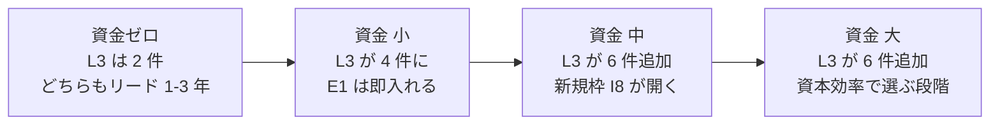
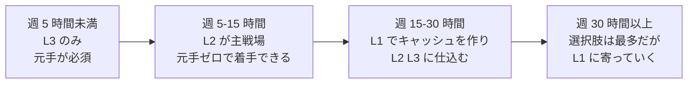
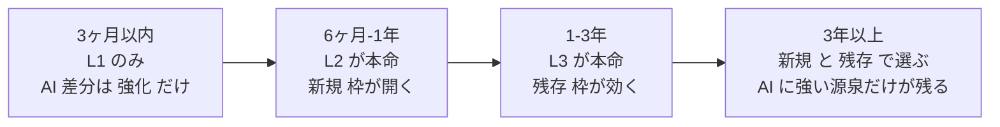
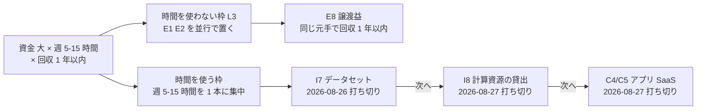

# Phase 5: 適用可能な候補の抽出

体系から実際に着手する候補を絞る。

本プロジェクトでは個人の制約を 1 つに決め打ちせず、**資金額別・時間別・期間別に分類して提示する**。
どのセグメントを選ぶかは着手時に決める（[TODO.md](../../../TODO.md) の起票分を参照）。

読み方: [../overview.md](../overview.md) ／ 入口: [../income-taxonomy.md](../income-taxonomy.md) ／ 前: [ai-delta.md](ai-delta.md)

**記法**: L1〜L3（人の関与度）／ P1〜P6（当事者構成）／ 1〜9（価値の源泉）／ A1〜J4（手法 ID）／ ⚠（法規制・利用規約に触れる）／【推測】【実測】（数値の根拠）。定義は [axes.md の記法](axes.md#記法)。

**この層を支える学問**: エフェクチュエーション（許容損失）、科学的アプローチの起業、家計金融、回収期間法 → [related-fields.md](related-fields.md) §5

## 絞り込みの手順

この図の主張: 絞り込みは 4 段。制約の厳しい順に外し、最後に関与度で偏りを補正する。

**第 0 段（全セグメント共通）で外すもの** — 個人が制度上取れない 6 件

| ID | 手法 | 外す理由 |
| --- | --- | --- |
| B3 | 有資格の対人専門職 | 州医事委員会の免許。今から取る手法ではない |
| F4 | 保険・債務保証 | 州の保険業法。個人は引受主体になれない |
| J1〜J4 | 徴税・公的運用・トレジャリー・法人運用 | 主体が個人でない |

**第 3 段で外すもの** — AI 消滅判定 7 件

B6 制作受託 / B7 翻訳 / C1 文章コンテンツ直販 / C2 オンライン講座 /
C3 素材・テンプレート販売 / G1 アフィリエイト / H1 広告収入

この 7 件は「AI で収入を稼ぐ」と聞いて最初に思いつく手法とほぼ一致する。
体系を作った最大の実利はここにある。**思いつきの入口が、そのまま単価崩壊層だった。**

残り: 64 − 6 − 7 = **51 件**がセグメント別の母集団になる。

> 2026-08-26 の修正で B14（AI 開発者向け受託）・D7（既存コンテンツの学習許諾）・E8（譲渡益）が加わった。
> 下の資金別・時間別・期間別テーブルは初版のままで、追加 3 件は「確定セグメントの候補」にのみ反映してある。

---

## 資金額別

必要資本のレンジは下限で判定する。上位セグメントは下位セグメントの候補をすべて含む。

### 資金 ゼロ（〜 $1,000）

母集団 22 件。**L3（関与しない）がほぼ取れない**のが決定的な特徴。

| 優先 | ID | 手法 | B 関与度 | AI 差分 | リード | なぜ上位／下位か |
| --- | --- | --- | --- | --- | --- | --- |
| 1 | I7 | 独自データセットの提供・販売 | L2 | **新規** | 〜1年 | 元手ゼロで唯一「新規」枠に入れる。⚠ 権利処理を通すと Web 収集が使えず、自作・合成しか残らない。個人の入口は B14・D7（[i7-dataset.md](../experiments/i7-dataset.md)） |
| 2 | B5 | 受託開発 | L1 | 強化 | 〜3ヶ月 | 即金性が最も高く、他の候補の元手を作れる |
| 3 | C4 | 買い切りソフト・アプリ | L2 | 強化 | 〜1年 | AI で開発コストが最も下がった層 |
| 4 | I6 | ドメインの運用・売却 | **L3** | 残存 | 1〜3年 | 元手ゼロで L3 に入れる数少ない枠。当たり外れが極端 |
| 5 | D5 | IP の二次利用許諾 | **L3** | 残存 | 1〜3年 | 元手ゼロの L3。ただし先に 8 注目の蓄積が要る |
| 6 | H4 | 有料メンバーシップ | L1 | 残存 | 〜1年 | 信頼を売る側。AI で希釈されない |
| 7 | D1 | 著作物の印税 | L2 | 強化 | 〜1年 | 権利は AI に最も強い源泉 |
| 8 | G5 | 紹介料・リファラル | L1 | 残存 | 〜3ヶ月 | 元手ゼロ。ただし人脈に完全依存 |

関与度の内訳: L1 が 3、L2 が 3、L3 が 2。L3 の 2 件はどちらもリード 1〜3 年で、
**元手ゼロのセグメントでは非労働収入がほぼ届かない**という制約がそのまま出ている。

### 資金 小（$1,000 〜 $10,000）

上のすべて ＋ 以下。ここで初めて L3 が現実的な選択肢になる。

| 優先 | ID | 手法 | B 関与度 | AI 差分 | リード | なぜ上位／下位か |
| --- | --- | --- | --- | --- | --- | --- |
| 1 | C5 | SaaS（自社プロダクト） | L2 | 強化 | 〜1年 | AI で個人が作れる規模が最も上がった枠 |
| 2 | E1 | 上場株・ETF の配当 | **L3** | 残存 | 〜3ヶ月 | 小額でも L3 に入れる最短経路。維持工数ほぼゼロ |
| 3 | E4 | 暗号資産のステーキング | **L3** | 残存 | 即日 | 即日で L3。⚠ 価格変動が利回りを圧倒。税務も重い |
| 4 | F1 | 買取再販・せどり | L1 | 強化 | 即日 | 即金性は最高。⚠ 州・市の中古品取扱業者免許 |
| 5 | E3 | 貸付・レンディング | **L3** | 強化 | 〜3ヶ月 | 与信が安くなった側。⚠ 州の貸金業免許 |
| 6 | I2 | 遊休スペースの賃貸 | **L3** | 残存 | 〜3ヶ月 | 小額側（レンタルスペース転貸）なら射程 |
| 7 | B9 | コーチング・カウンセリング | L1 | 残存 | 〜1年 | 人対人の残存枠。単価は守れるがスケールしない |
| 8 | D2 | 特許・実用新案のライセンス | L2 | 強化 | 1〜3年 | 出願コストが AI で下がった |

### 資金 中（$10,000 〜 $100,000）

上のすべて ＋ 以下。**L3 の選択肢が一気に増える**。

| 優先 | ID | 手法 | B 関与度 | AI 差分 | リード | なぜ上位／下位か |
| --- | --- | --- | --- | --- | --- | --- |
| 1 | I8 | 計算資源の貸出（GPU） | **L3** | **新規** | 3年〜 | AI 需要そのものに売る。新規枠かつ L3。⚠ リードは当初「〜3ヶ月」としていたが、2026-08-27 の試算で **3 年〜に訂正**（[i8-gpu-rental.md](../experiments/i8-gpu-rental.md)） |
| 2 | E2 | 債券・社債の利子 | **L3** | 残存 | 〜3ヶ月 | 維持工数ほぼゼロ。AI に無風 |
| 3 | G2 | マーケットプレイス運営 | **L3** | 強化 | 1〜3年 | AI で運営コストが最も下がった L3 |
| 4 | I3 | 自動販売機・無人販売 | **L3** | 強化 | 〜3ヶ月 | 補充を外注できれば L3 を維持 |
| 5 | I5 | 山林・農地の賃貸 | **L3** | 残存 | 1〜3年 | ⚠ 郡のゾーニング。管理義務だけ残るリスク |
| 6 | F3 | 裁定・自動運用 | **L3** | 強化 | 〜1年 | 対戦相手も AI。鞘は縮む前提で |
| 7 | B1 | 施術・店舗型 | L1 | 残存 | 1〜3年 | 人対人の代表。AI 耐性は最強だがスケールしない |
| 8 | G3 | 不動産仲介・人材紹介 | L1 | 強化 | 〜1年 | ⚠ 免許。探索は自動化、成約は人 |

### 資金 大（$100,000 〜）

上のすべて ＋ 以下。ここは **AI 差分よりも資本効率で決まる**。

| 優先 | ID | 手法 | B 関与度 | AI 差分 | リード | なぜ上位／下位か |
| --- | --- | --- | --- | --- | --- | --- |
| 1 | E6 | 事業買収・所有型 | **L3** | 強化 | 〜1年 | 買収後の AI 効率化で利益率が上がる |
| 2 | I1 | 不動産賃貸 | **L3** | 残存 | 〜1年 | AI に無風。維持工数を委託で下げられる |
| 3 | I4 | 太陽光発電の売電 | **L3** | 強化 | 〜1年 | AI データセンター需要で電力側は追い風。⚠ 連邦の住宅用税額控除は 2025 年末に失効 |
| 4 | D6 | 権利の買取・相続 | **L3** | 残存 | 即日 | 買った瞬間から L3。評価の巧拙がすべて |
| 5 | E5 | 未公開株への出資 | **L3** | 強化 | 3年〜 | 流動性なし。長期資金でのみ |
| 6 | D4 | フランチャイズ本部 | **L3** | 強化 | 3年〜 | 維持工数が高く、実質は経営 |
| 7 | E7 | 事業買収・経営型 | L1 | 強化 | 〜1年 | 実質は高額な就職。L3 が目的なら E6 を選ぶ |

**資金軸から読める構造** — この図の主張: 資金が増えるほど、L3（関与しない収入）の選択肢が跳ね上がる。

---

## 投下時間別

第 0 段・第 3 段の除外後、**維持工数と関与度**で絞る。

### 週 5 時間未満

L1（毎回関与）は原則不可。**L3 に寄せるしかない**が、資金ゼロだと候補がほぼ残らない。

| 優先 | ID | 手法 | 必要資本 | B 関与度 | 備考 |
| --- | --- | --- | --- | --- | --- |
| 1 | E1 | 上場株・ETF の配当 | 小〜大 | L3 | 維持工数ほぼゼロ。この時間帯の第一候補 |
| 2 | E2 | 債券・社債の利子 | 中〜大 | L3 | 同上 |
| 3 | I1 | 不動産賃貸（管理委託） | 大 | L3 | 委託前提。自主管理にすると成立しない |
| 4 | D6 | 権利の買取・相続 | 中〜大 | L3 | 買うときだけ働く |
| 5 | I6 | ドメインの運用・売却 | ゼロ〜小 | L3 | 資金ゼロで唯一この時間帯に入る候補 |
| 6 | E4 | 暗号資産のステーキング | 小 | L3 | ⚠ 価格変動リスク |

**この時間帯の結論**: 資金がなければ選択肢は I6 のみ。
つまり **時間がなく元手もない状態からは、体系上ほぼ何も始められない**。
まず時間か元手のどちらかを作る必要がある。

### 週 5 〜 15 時間（副業レンジ）

L2（初回のみ関与）が主戦場。**本プロジェクトの既定レンジとして最も現実的**。

| 優先 | ID | 手法 | 必要資本 | B 関与度 | 備考 |
| --- | --- | --- | --- | --- | --- |
| 1 | C4 | 買い切りソフト・アプリ | ゼロ | L2 | AI で開発コストが最も下がった。資金ゼロで着手可 |
| 2 | I7 | 独自データセットの提供 | ゼロ〜中 | L2 | 新規枠。⚠ 個人が売れた実例は無い。B14・D7 を見る |
| 3 | C5 | SaaS | 小 | L2 | 維持工数が高い点だけ注意 |
| 4 | E1 | 上場株・ETF の配当 | 小〜大 | L3 | 時間を使わない枠を並行して持つ |
| 5 | D1 | 著作物の印税 | ゼロ | L2 | 権利は AI に最も強い |
| 6 | B5 | 受託開発 | ゼロ | L1 | 元手作り用。稼働を埋めすぎない前提で |
| 7 | H4 | 有料メンバーシップ | ゼロ | L1 | 信頼を売る側。継続提供の負荷に注意 |
| 8 | D2 | 特許・実用新案 | 小〜中 | L2 | リードは長いが工数は低い |

### 週 15 〜 30 時間

L1 を並行できる。**キャッシュを作りながら L2/L3 に仕込む**構成が組める。

| 優先 | ID | 手法 | 必要資本 | B 関与度 | 備考 |
| --- | --- | --- | --- | --- | --- |
| 1 | B5 | 受託開発 | ゼロ | L1 | キャッシュ源。ここで元手を作る |
| 2 | C5 | SaaS | 小 | L2 | 仕込み側の本命 |
| 3 | G2 | マーケットプレイス運営 | 中 | L3 | 立ち上げが重いが L3 に届く |
| 4 | I8 | 計算資源の貸出 | 中〜大 | L3 | 新規枠。運用の手間は中程度。⚠ 回収は 3 年〜（2026-08-27 訂正、[i8-gpu-rental.md](../experiments/i8-gpu-rental.md)） |
| 5 | F1 | 買取再販・せどり | 小 | L1 | 即金性。⚠ 州・市の中古品取扱業者免許 |
| 6 | B9 | コーチング・カウンセリング | ゼロ〜小 | L1 | 人対人の残存枠 |
| 7 | B11 | 研修・登壇 | ゼロ | L1 | 単価が高く、8 注目にも効く |
| 8 | I3 | 自動販売機・無人販売 | 小〜中 | L3 | 補充を外注できるかが分岐 |

### 週 30 時間以上

立ち上げに人手が要る手法まで射程に入る。

| 優先 | ID | 手法 | 必要資本 | B 関与度 | 備考 |
| --- | --- | --- | --- | --- | --- |
| 1 | C5 | SaaS | 小 | L2 | フルタイム投下で L3 相当まで作り込める |
| 2 | G2 | マーケットプレイス運営 | 中 | L3 | 両側集客に人手が要る |
| 3 | E7 | 事業買収・経営型 | 大 | L1 | 実質フルタイム |
| 4 | B1 | 施術・店舗型 | 小〜中 | L1 | 開業に稼働が要る。AI 耐性は最強 |
| 5 | G4 | 卸・輸入代理 | ゼロ〜中 | L1 | 探索は AI、実務は人手 |
| 6 | D4 | フランチャイズ本部 | 大 | L3 | 名目 L3、実態は経営 |

**時間軸から読める構造** — この図の主張: 時間が増えるほど選択肢は増えるが、増える先は L1（労働型）に偏る。

時間を増やしても、増えるのは主に L1。**時間の投下は収入を増やすが、関与度は下げない**。
関与度を下げるのは資金か仕組みであって、時間ではない。

---

## 回収期間別

「最初の入金まで」ではなく「投下したコストを回収するまで」で分類する。

### 〜 3 ヶ月

即金性が要る場合。**L1（労働型）にほぼ限られる**。

| 優先 | ID | 手法 | 必要資本 | B 関与度 | 備考 |
| --- | --- | --- | --- | --- | --- |
| 1 | B5 | 受託開発 | ゼロ | L1 | 最も確実。AI 強化で単価あたりの工数が下がる |
| 2 | F1 | 買取再販・せどり | 小 | L1 | 即日回転。⚠ 州・市の中古品取扱業者免許 |
| 3 | E1 | 上場株・ETF の配当 | 小〜大 | L3 | 元手があれば即。回収ではなく利回りで見る |
| 4 | A1〜A3 | 時給労働・ギグ | ゼロ | L1 | 最短だが上限が低い。他の手法への踏み台としてのみ |
| 5 | G5 | 紹介料・リファラル | ゼロ | L1 | 人脈があれば即日 |
| 6 | B10 | 対面営業・代理店 | ゼロ | L1 | 即金だが報酬体系を握られる |

**この期間の結論**: 元手がなければ **L1 しか選べない**。
AI で「強化」される B5 を選ぶのが最も合理的で、それ以外は AI とほぼ無関係。

### 6 ヶ月 〜 1 年

仕込み型が射程に入る。**L2 の本命レンジ**。

| 優先 | ID | 手法 | 必要資本 | B 関与度 | 備考 |
| --- | --- | --- | --- | --- | --- |
| 1 | C4 | 買い切りソフト・アプリ | ゼロ | L2 | この期間の第一候補 |
| 2 | C5 | SaaS | 小 | L2 | 解約率を最初から計測する前提で |
| 3 | I7 | 独自データセットの提供 | ゼロ〜中 | L2 | 新規枠。⚠ 個人が売れた実例は無い。B14・D7 を見る |
| 4 | ~~I8~~ | ~~計算資源の貸出~~ | 中〜大 | L3 | **この期間には載らない**。2026-08-27 の試算で回収 2.5〜5.5 年と判明したため「3 年〜」テーブルへ移した（[i8-gpu-rental.md](../experiments/i8-gpu-rental.md)） |
| 5 | D1 | 著作物の印税 | ゼロ | L2 | 制作が AI で速くなった |
| 6 | I3 | 自動販売機・無人販売 | 小〜中 | L3 | 立地検証が先 |
| 7 | H4 | 有料メンバーシップ | ゼロ | L1 | 信頼の蓄積に時間が要る |
| 8 | B9 | コーチング・カウンセリング | ゼロ〜小 | L1 | 実績づくりにこの期間が要る |

### 1 〜 3 年

ストック型・資産形成型を本命に置ける。

| 優先 | ID | 手法 | 必要資本 | B 関与度 | 備考 |
| --- | --- | --- | --- | --- | --- |
| 1 | G2 | マーケットプレイス運営 | 中 | L3 | 両側が揃うまで 1〜3 年 |
| 2 | I1 | 不動産賃貸 | 大 | L3 | 回収は長いが AI に無風 |
| 3 | E6 | 事業買収・所有型 | 大 | L3 | 買収 → 効率化 → 利益率改善のサイクル |
| 4 | D2 | 特許・実用新案 | 小〜中 | L2 | 出願から実施許諾まで |
| 5 | I6 | ドメインの運用・売却 | ゼロ〜小 | L3 | 資金ゼロ側の長期枠 |
| 6 | D5 | IP の二次利用許諾 | ゼロ〜小 | L3 | 先に 8 注目の蓄積が必要 |
| 7 | I4 | 太陽光発電の売電 | 中〜大 | L3 | ⚠ 制度変更リスク |
| 8 | B1 | 施術・店舗型 | 小〜中 | L1 | 開業から黒字化まで |

### 3 年〜 / 期間を問わない

体系上の有望度だけで並べる。

| 優先 | ID | 手法 | B 関与度 | AI 差分 | なぜ有望か |
| --- | --- | --- | --- | --- | --- |
| 1 | I8 | 計算資源の貸出 | L3 | 新規 | AI 自身が買い手。需要が構造的に増える。ただし 2026-08-27 の試算では回収 2.5〜5.5 年で、**GPU の陳腐化期間と重なるため個人には利益が残らない**（[i8-gpu-rental.md](../experiments/i8-gpu-rental.md)） |
| 2 | I7 | 独自データセットの提供 | L2 | 新規 | 同上。ただし個人が届くのは B14（受託）と D7（許諾）で、作って売る形の実例は無い |
| 3 | D3/D5 | 商標・IP の許諾 | L3 | 残存 | 生成物が溢れるほど「公式であること」の価値が上がる |
| 4 | E5 | 未公開株への出資 | L3 | 強化 | 長期資金でのみ成立 |
| 5 | I1/I2 | 不動産・遊休スペース | L3 | 残存 | 物理占有は AI に侵食されない |
| 6 | B12 | 仲人・身元保証・立会人 | L1 | 残存 | 責任の引受は AI が代われない。需要は増える側 |

**期間軸から読める構造** — この図の主張: 期間を許容するほど関与度が下がり、AI 差分は「強化」から「新規・残存」に移る。

---

## 3 軸の交差 — 代表セル

現実的に取りうる組み合わせだけを示す。空欄は「体系上その組み合わせは成立しにくい」。

| 資金 ＼ 時間 | 週 5 時間未満 | 週 5〜15 時間 | 週 15〜30 時間 | 週 30 時間以上 |
| --- | --- | --- | --- | --- |
| **ゼロ** | I6 のみ（1〜3年） | **C4, I7, D1**（6ヶ月〜1年） | B5 ＋ C4（3ヶ月〜1年） | B5 ＋ C5（3ヶ月〜1年） |
| **小** | E1, E4（〜3ヶ月） | C5, I7 ＋ E1（6ヶ月〜1年） | F1 ＋ C5（3ヶ月〜1年） | B1 店舗, C5（1〜3年） |
| **中** | E2, E1（〜3ヶ月） | E2（6ヶ月〜1年） | **G2**（1〜3年） | G2, G4（1〜3年） |
| **大** | I1, D6, E1（〜1年） | E6 ＋ I1（1〜3年） | E6, I4（1〜3年） | E7, D4（1〜3年） |

太字は、そのセルで **AI 差分が「新規」または「強化」かつ関与度を下げられる**組み合わせ。

## 関与度の偏りチェック

プランの条件「候補は人の関与度 3 段階から偏りなく拾う」の確認。
全セグメントの上位 5 位以内に登場した ID を集計する。

| 段階 | 件数 | 該当 ID |
| --- | --- | --- |
| L1 毎回関与 | 7 | B5, F1, E7, B1, G4, A1〜A3, G5 |
| L2 初回のみ関与 | 5 | I7, C4, C5, D1, D2 |
| L3 関与しない | 17 | I6, D5, E1, E4, E3, I8, E2, G2, I3, I5, E6, I1, I4, D6, E5, D3, I2 |

（2026-08-26 再集計。初版は L1 を 5・L2 を 6・L3 を 12 と数えていたが、実際の表と合っていなかったため訂正した。）

L3 が多いのは、資金・期間のセグメントを跨いで同じ L3 候補が繰り返し上位に来るため。
**L1 だけに寄る偏り（プランが警戒していた失敗）は発生していない。**

## 全セグメントを通した推奨 3 件

セグメントを跨いで一貫して上位に来る候補。どの制約から始めても外れにくい。

| # | ID | 手法 | 理由 |
| --- | --- | --- | --- |
| 1 | **I7 → B14 / D7** | AI 開発者向け受託／既存コンテンツの学習許諾 | AI 自身が買い手という点は正しいが、2026-08-26 の調査で**個人がデータセットを作って売った実例はゼロ**と判明。実在する入口は B14（受託、$31〜65/時）と D7（既存の声・映像の許諾）（[i7-dataset.md](../experiments/i7-dataset.md)） |
| 2 | **C4/C5** | 買い切りアプリ／SaaS | AI で個人が作れる規模が最も上がった層。L2 で資金・時間の制約が最も緩い |
| 3 | **E1** | 上場株・ETF の配当 | 元手さえあれば即 L3。維持工数ほぼゼロで AI に無風。他候補と並行できる |

I8（計算資源の貸出）は体系上の有望度が最も高いが、必要資本「中〜大」がボトルネックになるため、
資金セグメントが確定するまで推奨には入れない。
→ 2026-08-26 に資金セグメントが「大」で確定したため、[確定セグメントの候補](#確定セグメントの候補2026-08-26) では時間を使う枠の 2 位（全体 4 位）に入れた。
→ **2026-08-27 に打ち切り**。ボトルネックは必要資本ではなく**回収期間**だった。レンタル単価がハード価格の 2〜3 年回収を前提に設計されており、稼働率 100%・電気代ゼロでも 1 年回収に届かない（[i8-gpu-rental.md](../experiments/i8-gpu-rental.md)）。

## 前提条件の確定（2026-08-26）

Phase 5 は本来「自分の資本・スキル・投下可能時間を明文化してから絞る」フェーズだが、
本体系ではセグメント別提示に置き換えた。2026-08-26 に以下で確定した（プラン: `docs/plans/archive/decide-segment.md`）。

| 項目 | 確定値 | 確定日 |
| --- | --- | --- |
| **税務上の居住地** | **米国・ワシントン州シアトル** | 2026-08-28 |
| 初期投資に回せる元手 | **大（$100,000 〜）** | 2026-08-26（2026-08-28 に USD へ） |
| 週あたり投下可能時間 | **週 5〜15 時間** | 2026-08-26 |
| 許容できる回収期間 | **6 ヶ月〜1 年** | 2026-08-26 |
| 既存スキル | ソフトウェア開発 | 2026-08-26 |

### 居住地を後から足した（2026-08-28）

⚠ **初版の表には税務上の居住地が無かった。** それにもかかわらず
[experiments/](../experiments/) の 5 件はすべて暗黙に日本居住で書かれており、
20.315% の申告分離課税・賭博罪・東証の銘柄・日本の電気代が判定の入力になっていた。
正しい前提は**米国居住者（WA 州シアトル）が扱えるか**であるため、前提条件に追加した（プラン: `docs/plans/us-residency-premise.md`）。

**居住地は「換算すれば済む項目」ではなく、結論の向きを変える項目だった。**
[online-tradable-assets.md](../experiments/online-tradable-assets.md) の再判定で、次の 4 つが反転または消滅した。

| 旧（日本居住） | 新（米国・WA 州） |
| --- | --- |
| J-REIT が高配当株 ETF の **1.9 倍**有利 | REIT 分配は**非適格**で通常所得。優位は **1.0〜1.1 倍**に縮む |
| 債券（個人向け国債 1.87%）が**最下位** | 国債（2〜30 年 4.19〜5.20%）が**最上位**。順位が逆転 |
| 暗号資産は ⚠ 総合課税で最大約 55% | 財産扱いで**株と同じ長期譲渡益率**。税の理由は消滅 |
| 予測市場は ⚠ 賭博罪で対象外 | 連邦は CFTC 規制下で合法。⚠ **ただし WA 州が差止め**。結論は同じで理由が変わった |

**通貨**は axes の資本区分ごと USD で定義し直した（[axes.md 属性](axes.md#属性)）。
区分の刻み（1 桁ずつ）は変えていないため、「資金 大」は **$100,000 〜**になる。

⚠ **上の 3 軸別テーブル・交差表・候補導出は 2026-08-26 に日本居住前提で作った。**
2026-08-28 に金額表記を USD へ、⚠ の指す法令を米国連邦法・WA 州法へ置き換えたが、
**候補の導出そのもの（どの ID をどのセルに置くか）は再実行していない**。
区分の刻みが同じで、AI 差分・関与度・リードはいずれも居住地に依存しないため、顔ぶれは変わらない見込み【推測】。

3 軸交差表のセル「大 × 週 5〜15 時間」は E6 ＋ I1（1〜3 年）だが、これは第 3 軸の回収期間を 1〜3 年に置いた場合の組み合わせで、
**回収 6 ヶ月〜1 年とは合わない**。そのため交差表のセルをそのまま使わず、3 つの軸別テーブルを交差させて候補を導出した。

## 確定セグメントの候補（2026-08-26）

### 導出

| 軸 | 絞り方 | 残る ID |
| --- | --- | --- |
| 資金 大 | 資金軸では何も外れない | 母集団 51 件のまま |
| 週 5〜15 時間 | 「週 5 時間未満」「週 5〜15 時間」の 2 テーブルに載る 13 件 | E1 E2 I1 D6 I6 E4 C4 I7 C5 D1 B5 H4 D2 |
| 回収 6 ヶ月〜1 年 | 「〜3 ヶ月」「6 ヶ月〜1 年」の 2 テーブルに載る 15 件 | B5 F1 E1 A1〜A3 G5 B10 C4 C5 I7 ~~I8~~ D1 I3 H4 B9  ※ I8 の掲載はリード誤り（〜3ヶ月）に由来。2026-08-27 に「3 年〜」へ訂正 |
| **交差** | 時間 ∩ 回収 | **E1 C4 I7 C5 D1 B5 H4**（7 件） |
| 境界で拾う | 軸のどれか 1 つに載っていないが、条件付きで成立する | ~~**I8**（時間軸は「週 15〜30」に載る → 運用委託を条件に拾う）~~ → **2026-08-27 打ち切り**（[i8-gpu-rental.md](../experiments/i8-gpu-rental.md)）、**E2**（回収別テーブル未掲載だが E1 と同型: 回収ではなく利回りで見る） |

**外した候補と理由**

| ID | 手法 | 外した軸 | 理由 |
| --- | --- | --- | --- |
| I1 E6 D2 I6 D5 | 不動産・事業買収・特許・ドメイン・IP 許諾 | 回収 | 回収 1〜3 年。回収期間を延ばすなら再検討 |
| D6 | 権利の買取 | 回収 | 減衰カーブ次第で回収年数が読めない【推測】 |
| E4 | 暗号資産ステーキング | — | 軸では残るが、⚠ 価格変動が利回りを圧倒し税務も重い。E1・E2 が取れるこのセグメントでは優先しない |
| F1 A1〜A3 G5 B10 B9 I3 | せどり・時給・紹介・営業・コーチング・自販機 | 時間 | L1 で稼働が要る。I3 は立地検証と補充で稼働が要る |

### 候補 8 件（着手順）

時間を使わない L3 を先に置き、週 5〜15 時間は 1 本の仕込みに集中する。

| 着手順 | ID | 手法 | B 関与度 | AI 差分 | 必要資本 | このセグメントでの位置づけ |
| --- | --- | --- | --- | --- | --- | --- |
| 1 | E1 | 上場株・ETF の配当 | **L3** | 残存 | 小〜大 | 資金確定で即着手可。維持工数ほぼゼロなので他と並行する |
| 2 | E2 | 債券・社債の利子 | **L3** | 残存 | 中〜大 | 同上。E1 と組にして時間を使わない枠を埋める |
| 3 | ~~I7~~ | ~~独自データセットの提供・販売~~ | L2 | **新規** | ゼロ〜中 | **2026-08-26 打ち切り**。需要側・権利側の調査は通過したが、個人が作って売った実例がゼロで、合法な源が自作・合成に限られる（[i7-dataset.md](../experiments/i7-dataset.md)） |
| 3' | E8 | 保有資産の譲渡益 | **L3** | 残存 | 小〜大 | I7 の代替。E1・E2 と同じ元手を使い、時間を使わずに回収 1 年以内に入る |
| 3'' | **D7** | 既存コンテンツの AI 学習許諾 | L2 | **新規** | ゼロ | **唯一の残存候補**。声・動画は時間あたり $96〜1,280 で受託を上回る（写真は不成立）。2026-08-28 の米国基準での再判定で、⚠ 最大リスクだった「日本語話者の実例ゼロ」と「Troveo の対応国が非公表」が**両方とも消えた**。⚠ ただし比較対象 B14 が $65〜110/時 に上がり、登録に 10 時間超かけると割に合わない（[d7-content-licensing.md](../experiments/d7-content-licensing.md)） |
| 4 | ~~I8~~ | ~~計算資源の貸出（GPU）~~ | **L3** | **新規** | 中〜大 | **2026-08-27 打ち切り**。稼働率 100%・電気代ゼロという到達不能な上限でも回収 1 年に届かず、最良ケースで 30.8 ヶ月（[i8-gpu-rental.md](../experiments/i8-gpu-rental.md)） |
| 5 | ~~C4/C5~~ | ~~買い切りアプリ・SaaS~~ | L2 | 強化 | ゼロ〜小 | **2026-08-27 打ち切り**。投下時間の機会費用の回収が中央値で 57〜170 ヶ月。かつ CAC > LTV で資金 大が効かない（[c4c5-app-saas.md](../experiments/c4c5-app-saas.md)） |
| 6 | D1 | 著作物の印税 | L2 | 強化 | ゼロ | 制作に時間が要る。I7 の副産物として出せるなら拾う |
| 7 | H4 | 有料メンバーシップ | L1 | 残存 | ゼロ | 継続提供の負荷。8 注目の蓄積が先 |
| 8 | B5 | 受託開発 | L1 | 強化 | ゼロ | 元手作りの役割がないため最下位 |
| 9 | B14 | AI 開発者向けの評価・RLHF 受託 | L1 | **新規** | ゼロ | 回収は最も確実（米国・ソフトウェア開発スキルで **$65〜110/時**、2026-08-28 更新）だが L1 の労働でデータ資産が残らない。⚠ 発注元の都合で供給が消える。⚠ 米国では労働者誤分類の訴訟が係属 |

関与度の内訳: L1 が 3、L2 が 2、L3 が 3（I7・I8・C4/C5 の打ち切り分を除く）。

⚠ **時間を使う枠は D7 と B14 しか残っていない**（2026-08-28 の米国基準での再判定でも変わらず）。
時間を使う候補（I7 → I8 → C4/C5）が 3 件連続で打ち切られ、L2 は D1（著作物の印税）と D7（学習許諾）のみになった。
打ち切りの理由は 3 件とも別々だが、**いずれも「AI で作れるようになった＝供給が増えた」側に立っていた**という共通点がある（[c4c5-app-saas.md](../experiments/c4c5-app-saas.md)）。

**そして D7 だけが残った理由も、同じ軸で説明できる。**
D7 は作る側ではなく**既に在庫を持つ側**に立つ。AI で増えたのは「作れる人」であって「昔から手元にある素材」ではないため、
供給過剰の影響を受けない。この対比は、候補の並べ方を見直す際の軸になる（[d7-content-licensing.md](../experiments/d7-content-licensing.md)）。

この図の主張: このセグメントは「時間を使わない L3 を並行で置き、時間は 1 本の仕込みに集中する」二層構成になる。

### 時間を使わない枠は、母集団のほぼ全部だった（2026-08-28）

E1・E2・E8 が「枠の代表」なのか「たまたま残った 3 件」なのかを確かめるため、
**売買がオンラインで完結する**という性質で横断的に洗い直した（[online-tradable-assets.md](../experiments/online-tradable-assets.md)）。

> ⚠ **2026-08-28 に米国基準へ改訂した。** 以下は改訂後の内容で、日本基準の初版の結論
> （J-REIT が 1.9 倍有利・個人向け国債が E2 の本命）は**もう当てはまらない**。

母集団（catalog 由来 12 行＋体系外 9 件）に 4 ゲート（入口・出口・維持工数・**米国居住者の受取**）を当てた結果、**新しい手法は 1 件も追加されなかった**。
E1・E2・E8 はやはりゲートを通る母集団のほぼ全部だった。**ただし枠の中の順位が入れ替わった。**

| 判定 | 候補 | 決め手 |
| --- | --- | --- |
| **E2 を E1 より先に置く** | 米国債・地方債・債券 ETF | 国債 2〜30 年が 4.19〜5.20% で、高配当株 ETF の 2.19〜3.06% を上回る。**日本とは順位が逆** |
| **新しく上位に入る** | 地方債（muni） | ⚠ 連邦所得税が非課税。高所得帯では税引後 1 位 |
| E1 の範囲に含める | REIT ETF・優先株 ETF・金 ETF・債券 ETF | 同一の証券口座・板・手数料 $0。⚠ **ただし課税は同一でない**（REIT 分配は非適格） |
| 採らない | I Bonds | ⚠ **年 $10,000 の購入上限**。買取保証型の出口はあるが元手を置けない |
| 採らない | 貸株（FPSL） | ⚠ 適格配当が通常所得の代替受取金に変わり、⚠ 貸出中は SIPC 保護外。**日本と同じ結論** |
| 対象外 | 予測市場 | 連邦は CFTC 規制下で合法だが、⚠ **WA 州が差止め**。日本の賭博罪と結論は同じで理由が違う |
| E8 の対象資産に入れる | 暗号資産 | 財産扱いで長期譲渡益は株と同率。⚠ 日本の総合課税という障壁が消えた |
| 採らない | トークン化不動産・非上場 REIT・サイト売買 | 往復コスト約 8%／償還停止の実績／売主手数料 5〜15% |

**E1 の REIT 優位は消えた。** 日本では同率課税で 1.9 倍あった差が、米国では REIT 分配が非適格になるため
税引後 1.0〜1.1 倍まで潰れる。**「株だけで見ると見落とす」という初版の警告は米国では成立しない。**

落とした要因は AI 差分でも関与度でもなく、**出口の確実性（厚み・コスト・停止しうるか・州で止まるか）**だった。
この観点は体系のどの軸にも入っていない。

候補は [TODO.md](../../../TODO.md) にこの順で起票し、検証サイクル（試す → 記録 → 判断）に渡す。

## 実験に渡すときの記録項目

起票する各候補には、以下を必ず記録する（CLAUDE.md のプロジェクト方針に従う）。

| 項目 | 内容 |
| --- | --- |
| 投下時間 | 【実測】で記録する |
| 投下費用 | API 利用料・手数料・仕入れを【実測】で記録する |
| 得られた収入 | 【実測】。ゼロならゼロと書く |
| 継続 / 打ち切り | 打ち切る場合は理由を残す |
| 体系へのフィードバック | 判定（消滅/残存/強化/新規）が実測と食い違ったら [ai-delta.md](ai-delta.md) を書き換える |
