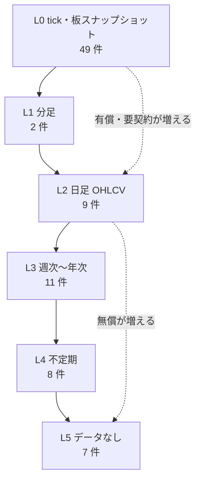
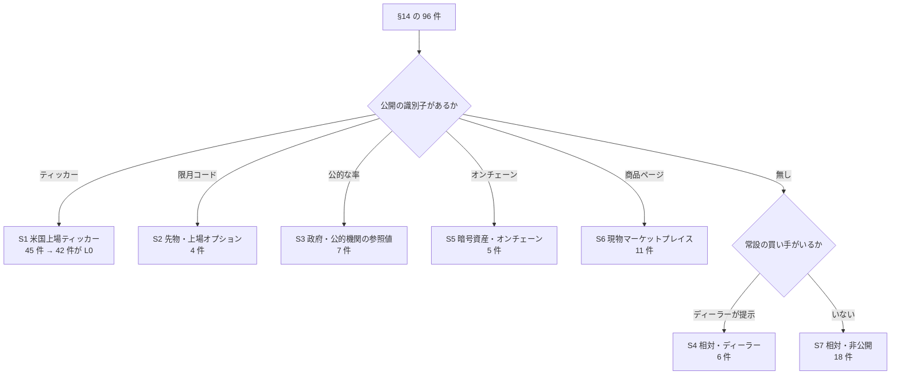
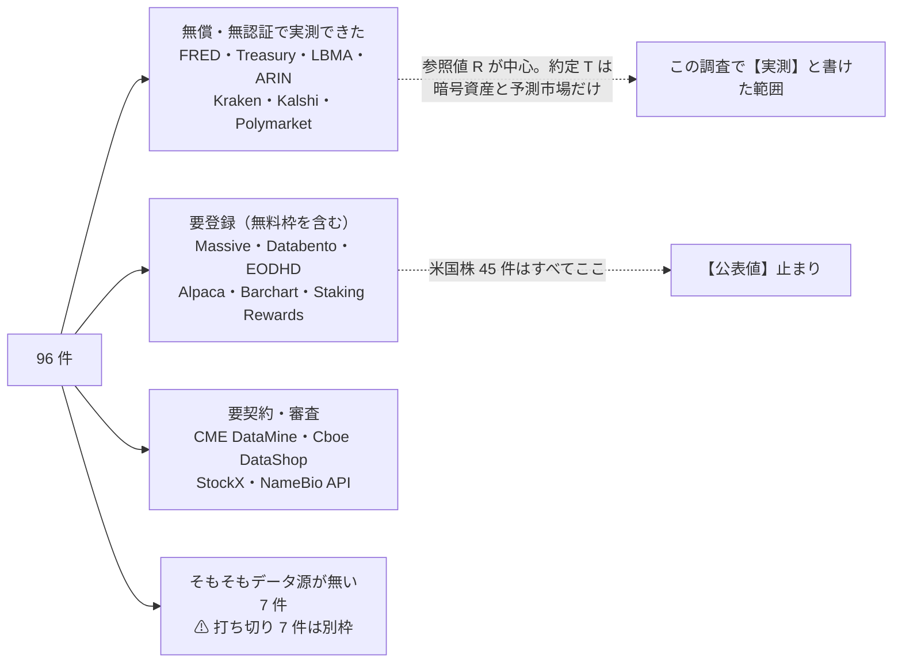
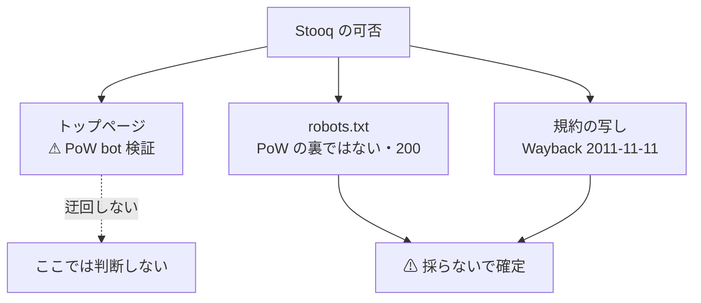
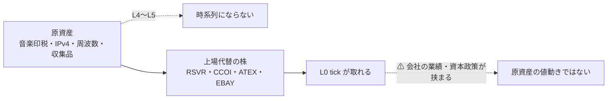
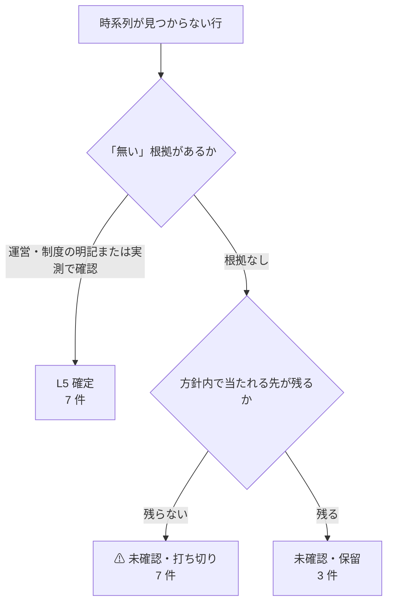

# §14 の 96 件について、過去の取引データが取れるサービスと粒度

調査日: 2026-09-01。対象: [online-tradable-assets-slides.html](online-tradable-assets-slides.html) の **11 分類・96 件**（元文書は [online-tradable-assets.md](online-tradable-assets.md) §14）。
プラン: [docs/plans/archive/market-data-availability.md](../plans/archive/market-data-availability.md)

> §14 は「売買する市場が存在するか（板があるか）」までを確定させた一覧である。**この文書はその横に「その値動きが時系列データとして手に入るか」を並べる。**元文書とスライドは書き換えていない。

## 0. 結論

**96 件のうち 49 件は tick まで取れ、7 件は時系列にならないと確定した。**残りはその中間に散る。
⚠ **さらに 10 件は「探した範囲で見つからず」のまま打ち切った**（2026-09-01・付録 B-3）。**「無い」と断定はしていない。**

| 最小粒度 | 件数 | 中身 |
| --- | ---: | --- |
| **L0** tick・板 | **49** | 米国上場ティッカー 42 ＋ 先物/オプション 3 ＋ 地方債の約定 1 ＋ 暗号資産 1 ＋ 予測市場 1 ＋ 小売 FX 1 |
| **L1** 分足 | 2 | ステーキング利回り、AWS RI（⚠ ただし 2020-05 で停止） |
| **L2** 日足 | 9 | 金の基準値・国債利回り・SREC・物理ウラン ほか |
| **L3** 週次〜年次 | 11 | I Bonds 利率・MMF・住宅価格指数・業界団体の年次集計 ほか |
| **L4** 不定期 | 8 | 音楽印税・ドメイン・周波数・NFT の落札／約定イベント |
| **L5** データなし | **7** | 括り 3 ＋ 成約が記録・公開されないと確認できた 4（特許・時計・官公庁の払い下げ・協同組合の持分） |
| **未確認** | **10** | MYGA・トークン化国債・StockX ＋ ⚠ **打ち切った 7**（ブローカード CD・変額年金・住宅ローン債権・YieldStreet・返品在庫・貸株・貸付） |
| | **96** | |

⚠ **L0 の 49 件のうち 42 件は「同じ 1 つの経路」で片付く。**米国上場ティッカーであれば、商品が REIT だろうがカバードコール ETF だろうがロイヤリティ LP だろうが、データの取れ方は変わらない。**この調査で本当に個別に効いてくるのは、残り 54 件のほうである。**

そして次の 2 点が、後続タスク（API 売買・自動売買）の前提を左右する。

1. ⚠ **無償かつ無登録で tick が取れるのは、暗号資産と予測市場だけだった。**⚠ **米国株は個別銘柄では無償でも必ずアカウント登録を要求する**（§3）。唯一の無登録候補だった Stooq は、⚠ **運営が `robots.txt` で全自動アクセスを拒否している**ことを確認して 2026-09-01 に「採らない」で確定した（3-2）。ただし**株価指数なら FRED から無登録・日次で取れる**（`NASDAQCOM` 14,498 行 1971〜。⚠ **指数であって個別銘柄ではない**）。
2. ⚠ **「板がある」と「過去データがある」はずれる。**§14 で板ありとした 55 件のうち、L4 以下に落ちるものがある（SREC・NFT・トークン化不動産・Masterworks）。逆に板が無くても参照値なら日次で取れるものがある（現物金・国債利回り）。

## 1. 何を「過去の取引データ」と呼ぶか

### 1-1. データの種類（4 種）

同じ「価格の履歴」でも、下の 4 つは別物として扱う。

| 種類 | 中身 | この調査での例 |
| --- | --- | --- |
| **T** 約定 | 実際に売買が成立した値段と数量 | 株式の tick、Kraken の約定、TRACE の社債約定 |
| **Q** 気配 | 板に出ていた買い値・売り値 | NBBO、Kalshi の yes_bid / yes_ask、Dukascopy の bid/ask |
| **N** 基準価額 | 運用側が計算する 1 口あたりの価値。**売買の値段ではない** | MMF、Fundrise、CCLFX |
| **R** 参照値 | 第三者が決めて公表する率・指数 | LBMA 金価格、米国債利回り曲線、NQH2O、FHFA 住宅価格指数 |

⚠ **N と R は「取引データ」ではない。**取れても「板の過去データが取れた」ことにはならない。表では必ず区別している。

### 1-2. 粒度の階梯（L0〜L5）

> この図の主張: 粒度は 6 段で、上に行くほど提供元が限られ有償になる。判定はこの階梯のどこに着地するかで書く。

⚠ **L3 の定義を広げた。**プランでは「週次・月次」としていたが、業界団体の**年次**集計（生命保険買取）と**半期**の利率改定（I Bonds）が出てきた。いずれも間隔が一定なので L4（不定期）ではなく L3 に入れ、表の「履歴」列に実際の間隔を書いた。

### 1-3. 複数のティッカーが入る行の扱い

1 行に複数のティッカーが入る行が 9 行ある（`SCHD・VYM`、`AGNC・NLY`、`VRSN・GDDY・TCX` など）。**代表 1 本を決めるのではなく全部を識別子列に持ち、左端を代表とした。**データの取れ方が銘柄で変わらない以上、代表を選ぶ意味が無く、行を落とすほうが害が大きいため。

## 2. 96 件をどう束ねたか

96 件を 1 件ずつ当たると重複が多い。**データの取れ方は商品ではなく「識別子と市場の型」で決まる**ので、先に束ねた。

> この図の主張: 96 件は 7 つの束に落ち、束ごとに当たるべきサービスが決まる。個別調査が要るのは下 2 束だけ。

束の内訳は **45 / 4 / 7 / 6 / 5 / 11 / 18 = 96** で、プランの初期案どおりに確定した（変更なし）。束ごとの着地は次のとおり。

| 束 | 件数 | L0 | L1 | L2 | L3 | L4 | L5 | 未確認 |
| --- | ---: | ---: | ---: | ---: | ---: | ---: | ---: | ---: |
| **S1** 米国上場ティッカー | 45 | **42** | | 1 | | | 2 | |
| **S2** 先物・上場オプション | 4 | 3 | | | 1 | | | |
| **S3** 公的機関の参照値 | 7 | 1 | | 2 | 3 | | | 1 |
| **S4** 相対・ディーラー | 6 | 1 | | 1 | 1 | 1 | | 2 |
| **S5** 暗号資産・オンチェーン | 5 | 1 | 1 | | | 2 | | 1 |
| **S6** 現物マーケットプレイス | 11 | 1 | 1 | 2 | 2 | 1 | 2 | 2 |
| **S7** 相対・非公開 | 18 | | | 3 | 4 | 4 | 3 | **4** |
| **合計** | **96** | **49** | **2** | **9** | **11** | **8** | **7** | **10** |

⚠ **括りの 3 行が L5 に落ちる。**「CEF（クローズドエンド）」「地方債 CEF（レバレッジ型）」は S1 の中に、「BDC 平均 12.6%」は S7 にいるが、**いずれも行そのものに識別子が無い。**構成銘柄は個別に L0 で取れても、**この行に対応する時系列は存在しない。**

⚠ **S7（相対・非公開）は「無い」ことすら示せなかった。**18 件のうち L5 と確定できたのは 3 件だけで、**4 件は未確認のまま打ち切った**（付録 B-3-2）。⚠ **相対の市場では、データが無いことの根拠も公開情報から取れない。**

## 3. ⚠ 登録できないことが結論に効いた

CLAUDE.md の 2026-08-27 方針変更により、**登録・契約・課金は行わない。**この調査では次の線を引いた。

| 行為 | 可否 | 結果 |
| --- | --- | --- |
| 公式ドキュメント・料金表・規約を読む | ✅ 行った | 判定の主根拠 |
| **無登録・無認証**で叩ける公開エンドポイントから 1 本取り、粒度を目視確認 | ⚠ 規約を確認したうえで実施 | **7 経路で実測できた**（下表） |
| アカウント登録・API キー取得（無料枠を含む） | ❌ 行わなかった | 該当サービスは【公表値】止まり |
| 有償契約・課金 | ❌ 行わなかった | 同上 |

> この図の主張: 無償かつ無登録で実測できたのは公的データと暗号資産・予測市場だけで、米国株はどの経路でも認証の壁の向こうにある。

### 3-1. 実測できた 7 経路

いずれも 2026-09-01 に 1 回だけ取得し、粒度を目視確認した。

| # | 経路 | 確認できたこと |
| --- | --- | --- |
| 1 | FRED `fredgraph.csv` | API キー無しで CSV。`DGS30` 12,925 行 1977-02-15〜、`DFII10` 6,173 行 2003-01-02〜、`NASDAQNQH2O` 409 点 2018-10-31〜2026-08-26。⚠ **2026-09-01 追加確認 — 株価指数も無登録で取れた**（`NASDAQCOM` 14,498 行 1971-02-05〜、`SP500`・`DJIA` 各 2,609 行、`VIXCLS` 9,566 行 1990〜）。⚠ **指数であって個別銘柄ではない** |
| 2 | 米財務省 日次イールドカーブ XML | キー無し。2026 年分 168 営業日、当日（2026-09-01）まで。10 年 4.79% |
| 3 | LBMA `gold_pm.json` | キー無し。**14,673 件・1968-04-01〜2026-09-01**、USD/GBP/EUR の 3 通貨 |
| 4 | ARIN `transfers_latest.json` | キー無し・30.5MB。⚠ **価格フィールドが存在しない**ことを確認 |
| 5 | Kraken `public/Trades`・`public/OHLC` | キー無し。**約定 1 本ずつ（L0）**が取れる。1 分足は直近 721 本（約 12 時間）だけで、深い履歴は `Trades` を遡る必要がある |
| 6 | Kalshi `markets` / `markets/trades` / `candlesticks` | キー無し。**約定（L0）と 1 分足（L1）**。1 分足に `yes_bid` / `yes_ask`・出来高・建玉が付く |
| 7 | Polymarket `gamma` / `clob/prices-history` | キー無し。`fidelity=1` で**60 秒間隔・24 時間で 1,389 点** |

### 3-2. ⚠ 実測を見送ったもの

| 対象 | 理由 |
| --- | --- |
| **Stooq** | ⚠ **運営が自動アクセスを拒否していることを確認したため「採らない」で確定した**（2026-09-01・下記）。データ用エンドポイントは叩いていない |
| **Treasury Fiscal Data API** | I Bonds 利率のデータセットは存在するが、推測したエンドポイントパスが 404 を返した。**正確なパスを一次情報で確定できていない**ため【公表値】止まり |

#### ⚠ Stooq は「採らない」で確定した（2026-09-01）

第三者記事は「無登録で日足・5 分足の CSV が取れる」と書き、⚠ **S1（米国上場ティッカー 45 件）で唯一の無登録候補**だった。当初はトップページの **JavaScript proof-of-work による bot 検証**に阻まれて規約に到達できず「未確認」で置いたが、**規約を別経路から当たり直して決着させた。**

> この図の主張: トップページの PoW は迂回せず、運営の意思表示が読める別の入口を当たった。

| # | 一次情報 | 内容 | 判定 |
| --- | --- | --- | --- |
| 1 | **`robots.txt`**（2026-09-01 取得【実測】） | `User-agent: Bingbot → Allow: /` ／ `Googlebot → Allow: /` ／ ⚠ **`User-agent: * → Disallow: /`**。stooq.com・stooq.pl とも同一 | ⚠ **Bingbot・Googlebot 以外の自動アクセスをサイト全体で拒否**。CSV エンドポイントも当然含む |
| 2 | **「Bazy danych」規約**（Wayback 2011-11-11【公表値】） | データ提供は**有料サブスク**（MetaStock 形式のファイル）。⚠ **「平均を超えるファイル・ページのダウンロードが生じた場合、即時にアクセスを遮断する権利を留保する」**と明記 | 方向性が 1 と一致。⚠ ただし**無償 CSV を直接カバーする規約ではなく、15 年前の版**である |
| 3 | **PoW の掛かり方**（2026-09-01【実測】） | 規約パスへの直接アクセスは PoW 無しで 404 を返し、`robots.txt` も 200 で返った | ⚠ **PoW は全 HTML に掛かっているわけではない。**ただし判断は 1 で決まるため、この点は結論に影響しない |

**⚠ 解釈の限界を書いておく。**`robots.txt`（RFC 9309）は本来**クローラ向けの指示**であり、人手による 1 回の取得までを禁じる契約文書ではない、という読み方はあり得る。それでもここでは「採らない」とした。理由は、⚠ **PoW 検証・`Disallow: /`・有料版規約の遮断条項という 3 つの独立した意思表示が同じ方向を向いている**こと、そして本プロジェクトが §3 で「**規約を確認したうえで**実測する」という線を自分で引いていることによる。

⚠ **この結論は「データが無い」ではない。**Stooq にデータはある。**方針の内側では取りに行けない**という判定である。

### 3-3. ⚠ 調査中に判明した提供元の変化

| 変化 | 影響 |
| --- | --- |
| **Polygon.io → Massive**（`polygon.io` が `massive.com` へ 301） | S1 の主データ源。旧名で書かれた資料が大量にあるので、参照時は注意 |
| **FRED の LBMA 金価格（`GOLDPMGBD228NLBM`）が 404** | ICE Benchmark Administration の許諾方針の変更と整合。⚠ **LBMA 自身の JSON は生きている**ので、そちらを正とする |
| **TCGplayer の API が新規発行停止**（eBay 買収後） | §14-9 のトレーディングカードは、公式経路が閉じている |
| **Masterworks の PPEX ATS が 2026-12-14 に終了** | ⚠ 過去データを終了後も参照できるかの開示が無い。**終了前の確保はしないと決めた（2026-09-01）。以降は L5 として扱う**（付録 B-4） |

## 4. 96 行の表

⚠ **費用・認証・規約・出典は行ごとに書かず、**付録 A** の `D1`〜`D42` に集約した。**同じデータ源が 45 行に出るため、行に書くと同じ内容を 45 回繰り返すことになるのを避けた。行の「データ源」列の記号を付録 A で引く。

### §14-1 株式・株式ファンド（18 件）

| # | 商品 | 識別子 | 束 | データ源 | 種類 | 最小粒度 | 履歴 | ⚠ 注意 |
| --- | --- | --- | --- | --- | --- | --- | --- | --- |
| 1 | 上場株・高配当 ETF（SCHD・VYM） | SCHD・VYM | S1 | D1・D2 | T+Q | **L0** | tick 2004〜 | — |
| 2 | REIT ETF（VNQ） | VNQ | S1 | D1・D2 | T+Q | **L0** | tick 2004〜 | — |
| 3 | mREIT（AGNC・NLY） | AGNC・NLY | S1 | D1・D2 | T+Q | **L0** | tick 2004〜 | ⚠ 分配 13% 台。未調整終値では値動きの解釈を誤る。調整済み系列を別に取る |
| 4 | mREIT ETF（MORT） | MORT | S1 | D1・D2 | T+Q | **L0** | tick 2004〜 | ⚠ ROC による NAV 減。調整済み系列が要る |
| 5 | BDC（ARCC） | ARCC | S1 | D1・D2 | T+Q | **L0** | tick 2004〜 | — |
| 6 | BDC（MAIN） | MAIN | S1 | D1・D2 | T+Q | **L0** | tick 2004〜 | — |
| 7 | BDC「平均 12.6%」 | 無し（括り） | S7 | 無し | — | **L5** | — | ⚠ 括り。この行に対応する識別子が無く、時系列にならない。構成銘柄は個別に L0 |
| 8 | カバードコール ETF（QYLD） | QYLD | S1 | D1・D2 | T+Q | **L0** | tick 2004〜 | ⚠ 株価 $25→$18 かつ分配 −24%。調整の有無で結論が変わる |
| 9 | カバードコール ETF（JEPI） | JEPI | S1 | D1・D2 | T+Q | **L0** | tick 2004〜 | — |
| 10 | CEF（クローズドエンド） | 無し（括り） | S1 | 無し（構成銘柄は D1） | — | **L5** | — | ⚠ 括り。「平均 8.7%・NAV 比 −4.6%」に対応する無償の公開時系列は確認できず |
| 11 | 優先株 ETF（PFF） | PFF | S1 | D1・D2 | T+Q | **L0** | tick 2004〜 | ⚠ 調整済み系列が要る |
| 12 | 鉱区ロイヤリティ LP（DMLP） | DMLP | S1 | D1・D2 | T+Q | **L0** | tick 2004〜 | — |
| 13 | 鉱区ロイヤリティ LP（BSM） | BSM | S1 | D1・D2 | T+Q | **L0** | tick 2004〜 | — |
| 14 | MLP ETF（AMLP） | AMLP | S1 | D1・D2 | T+Q | **L0** | tick 2004〜 | — |
| 15 | 石油ガスロイヤリティトラスト（PBT・SBR） | PBT・SBR | S1 | D1・D2 | T+Q | **L0** | tick 2004〜 | ⚠ 板が薄い。出来高ゼロの日が並びうる |
| 16 | 農地 REIT（FPI・LAND） | FPI・LAND | S1 | D1・D2 | T+Q | **L0** | tick 2004〜 | ⚠ 上場 2 社のみで板が薄い |
| 17 | 林地 REIT（WY） | WY | S1 | D1・D2 | T+Q | **L0** | tick 2004〜 | — |
| 18 | 転換社債 ETF（CWB・ICVT） | CWB・ICVT | S1 | D1・D2 | T+Q | **L0** | tick 2004〜 | — |

### §14-2 上場の代替アクセス（10 件）

| # | 商品 | 識別子 | 束 | データ源 | 種類 | 最小粒度 | 履歴 | ⚠ 注意 |
| --- | --- | --- | --- | --- | --- | --- | --- | --- |
| 1 | 生命保険買取 → NYSE:ABX（Abacus。旧 ABL） | ABX | S1 | D1・D2 | T+Q | **L0** | 上場以降 | ⚠ 旧 ABL からの改称。改称前と系列がつながるかは提供元による |
| 2 | 訴訟ファイナンス → NYSE:BUR（Burford） | BUR | S1 | D1・D2 | T+Q | **L0** | 上場以降 | — |
| 3 | 未公開株 → NYSE:DXYZ（Destiny Tech100） | DXYZ | S1 | D1・D2 | T+Q | **L0** | 上場以降 | ⚠ NAV（型 N）は運営開示。板の値段（T）とプレミアムは別系列 |
| 4 | 未公開株の板 → NYSE:FRGE（Forge Global） | FRGE | S1 | D1・D2 | T+Q | **L0** | 上場以降 | ⚠ 2025-10 に Schwab が買収合意。上場廃止で系列が止まる |
| 5 | 周波数 → NASDAQ:ATEX（Anterix） | ATEX | S1 | D1・D2 | T+Q | **L0** | 上場以降 | — |
| 6 | 音楽印税 → NASDAQ:RSVR（Reservoir Media） | RSVR | S1 | D1・D2 | T+Q | **L0** | 上場以降 | — |
| 7 | 官公庁払い下げ・返品在庫 → NASDAQ:LQDT | LQDT | S1 | D1・D2 | T+Q | **L0** | 上場以降 | — |
| 8 | IPv4 アドレス → NASDAQ:CCOI（Cogent） | CCOI | S1 | D1・D2 | T+Q | **L0** | 上場以降 | — |
| 9 | ドメイン → NASDAQ:VRSN・GDDY・TCX | VRSN・GDDY・TCX | S1 | D1・D2 | T+Q | **L0** | 上場以降 | ⚠ 3 銘柄。代表は VRSN |
| 10 | 収集品の板 → NASDAQ:EBAY | EBAY | S1 | D1・D2 | T+Q | **L0** | 上場以降 | — |

### §14-3 債券・金利（17 件）

| # | 商品 | 識別子 | 束 | データ源 | 種類 | 最小粒度 | 履歴 | ⚠ 注意 |
| --- | --- | --- | --- | --- | --- | --- | --- | --- |
| 1 | 米国債 2〜30 年 | CUSIP（銘柄ごと） | S3 | D11・D10（参照値）/ D14（約定） | R ＋ T | **L2** | DGS30 は 1977-02-15〜【実測】 | ⚠ 利回り曲線（R）と個別 CUSIP の約定（T）は別物 |
| 2 | TIPS | CUSIP（銘柄ごと） | S3 | D10（DFII10）/ D14 | R ＋ T | **L2** | 2003-01-02〜【実測】 | — |
| 3 | I Bonds | 無し（シリーズのみ） | S3 | D17 | R | **L3** | 1998-09〜 | ⚠ 板が無いので約定は存在しない。取れるのは半期の利率改定だけ |
| 4 | EE Bonds | 無し（シリーズのみ） | S3 | D17 | R | **L3** | 1998-09〜 | ⚠ 同上 |
| 5 | 地方債 AAA 10 年 | VTEB・MUB / AAA 指数 | S3 | D15（約定）/ D1（VTEB・MUB） | T | **L0** | — | ⚠ AAA 10 年の指数（MMD）は有償。ETF は L0 で取れる |
| 6 | 地方債 CEF（レバレッジ型） | 無し（括り） | S1 | 無し（個別 CEF は D1） | — | **L5** | — | ⚠ 括り。個別 CEF はティッカー単位で L0 |
| 7 | 債券 ETF（BND・AGG・SGOV） | BND・AGG・SGOV | S1 | D1・D2 | T+Q | **L0** | tick 2004〜 | — |
| 8 | ハイイールド債 ETF（HYG・JNK） | HYG・JNK | S1 | D1・D2 | T+Q | **L0** | tick 2004〜 | — |
| 9 | 新興国現地通貨建て国債 ETF（EMLC・LEMB） | EMLC・LEMB | S1 | D1・D2 | T+Q | **L0** | tick 2004〜 | — |
| 10 | CLO ETF（JAAA） | JAAA | S1 | D1・D2 | T+Q | **L0** | 設定 2020-10 以降 | — |
| 11 | CLO ETF（JBBB） | JBBB | S1 | D1・D2 | T+Q | **L0** | 設定 2022-01 以降 | — |
| 12 | CLO ETF（CLOZ） | CLOZ | S1 | D1・D2 | T+Q | **L0** | 設定 2023-01 以降 | ⚠ 履歴が 3 年半。サービス非対応ではなく歴史が短い |
| 13 | シニアローン ETF（BKLN・SRLN） | BKLN・SRLN | S1 | D1・D2 | T+Q | **L0** | tick 2004〜 | — |
| 14 | MMF（SPRXX・SWVXX・SPAXX） | SPRXX・SWVXX・SPAXX | S3 | D16 | N ＋ R | **L3** | 2010-09〜 | ⚠ $1.00 固定で値動きが無い。取れるのは利回りと保有明細 |
| 15 | ブローカード CD | CUSIP（銘柄ごと） | S3 | 無し | — | **未確認** ⚠ 打ち切り | — | ⚠ TRACE 対象外。二次流通の値段は各社の在庫画面のみで、時系列の公開源を確認できず。**残るのは有償の債券ベンダーのみで、2026-09-01 に打ち切った（付録 B-3）** |
| 16 | カタストロフィボンド ETF（ILS） | ILS | S1 | D1・D2 | T+Q | **L0** | 設定 2025-04 以降 | ⚠ 履歴が 1 年半。サービス非対応ではなく歴史が短い |
| 17 | 仕組債 | CUSIP（144A・登録） | S4 | SEC EDGAR 424B2 | — | **L4** | 発行ごと | ⚠ 発行条件は公開だが、二次の値段は発行体の系列 BD の気配のみ。時系列にならない |

### §14-4 保険・年金（4 件）

| # | 商品 | 識別子 | 束 | データ源 | 種類 | 最小粒度 | 履歴 | ⚠ 注意 |
| --- | --- | --- | --- | --- | --- | --- | --- | --- |
| 1 | MYGA（多年保証年金） | 無し | S4 | D41 | R | **未確認** | — | ⚠ 現在値のスナップショットは公開。時系列で蓄積・公開されているかを確認できず |
| 2 | 変額・インデックス年金 | 無し | S4 | 無し | — | **未確認** ⚠ 打ち切り | — | ⚠ 契約ごとのサブアカウント基準価額。横断の公開時系列を確認できず。**2026-09-01 に打ち切った（付録 B-3）** |
| 3 | 生命保険買取（直接） | 無し | S4 | D38 | R | **L3** | 年次 | ⚠ 業界団体の年次集計（件数・平均額）。個別取引は非公開 |
| 4 | トークン化国債（BUIDL・OUSG・USDY） | コントラクトアドレス | S5 | D23 ＋ チェーンのインデクサ | N ＋ T | **未確認** | — | ⚠ 購入資格の制限とデータ取得可否は別問題。板が薄く粒度は未確認 |

### §14-5 商品・実物（8 件）

| # | 商品 | 識別子 | 束 | データ源 | 種類 | 最小粒度 | 履歴 | ⚠ 注意 |
| --- | --- | --- | --- | --- | --- | --- | --- | --- |
| 1 | 金 ETF（IAU・GLDM・GLD） | IAU・GLDM・GLD | S1 | D1・D2 | T+Q | **L0** | tick 2004〜 | — |
| 2 | 現物金・銀 | 無し（LBMA 参照値） | S4 | D12 | R | **L2** | 1968-04-01〜 14,673 件【実測】 | ⚠ 参照値であって、ディーラーの実際の買取値（スプレッド込み）ではない |
| 3 | 商品 ETF（USO・UNG・CPER） | USO・UNG・CPER | S1 | D1・D2 | T+Q | **L0** | tick 2004〜 | — |
| 4 | 農産物 ETF（DBA） | DBA | S1 | D1・D2 | T+Q | **L0** | tick 2004〜 | — |
| 5 | 米（rough rice） | ZR（CBOT 限月コード） | S2 | D25（tick）/ D8（日足） | T | **L0** | 日足は 1980 年頃〜 | ⚠ 限月ごとに切れる。連続足は合成物でロール規則が提供元ごとに違う |
| 6 | 物理ウラン（SRUUF / U.UN） | SRUUF（OTC）・U.UN（TSX） | S1 | D8 | T | **L2** | 無償は日足 2 年 | ⚠ U.UN は TSX、SRUUF は OTC。米国データ源のカバー外になりやすい |
| 7 | 炭素クレジット ETF（KRBN） | KRBN | S1 | D1・D2 | T+Q | **L0** | tick 2004〜 | — |
| 8 | 水（NQH2O 先物） | H2O（CME 限月コード） | S2 | D10（指数）/ D25（先物） | R | **L3** | 2018-10-31〜 409 点【実測】 | ⚠ 指数は週次（7 日間隔を実測）。建玉が極小で、先物の約定はほとんど無い |

### §14-6 デリバティブ・仕組み（7 件）

| # | 商品 | 識別子 | 束 | データ源 | 種類 | 最小粒度 | 履歴 | ⚠ 注意 |
| --- | --- | --- | --- | --- | --- | --- | --- | --- |
| 1 | §1256 契約（規制先物・SPX 指数オプション） | ES 等の限月・SPX オプション | S2 | D25・D26 | T+Q | **L0** | 取引所の提供範囲 | ⚠ 限月ごとに切れる |
| 2 | オプション売り（プレミアム収入） | OCC オプションシリーズ | S2 | D26 | T+Q | **L0** | 取引所の提供範囲 | ⚠ 限月 × 権利行使価格でシリーズ数が爆発する。日足でもデータ量が S1 と桁違い |
| 3 | バッファー ETF（Innovator ZALT・IBUF・EBUF） | ZALT・IBUF・EBUF | S1 | D1・D2 | T+Q | **L0** | 設定以降 | — |
| 4 | SPAC（信託） | 個別 SPAC ティッカー | S1 | D1・D2 | T+Q | **L0** | 上場以降 | ⚠ 個別 SPAC のティッカーが要る。信託額は SEC 開示（L4）で別系列 |
| 5 | SPAC ワラント | 個別ワラントティッカー | S1 | D1・D2 | T+Q | **L0** | 上場以降 | ⚠ 板が薄い。出来高ゼロの日が並びうる |
| 6 | 通貨 ETF（FXE・FXY・UUP） | FXE・FXY・UUP | S1 | D1・D2 | T+Q | **L0** | tick 2004〜 | — |
| 7 | 小売 FX・CFD | 通貨ペア（業者ごと） | S4 | D42 | Q | **L0** | 15 年以上 | ⚠ **中央の板が無い。**取れるのは 1 業者の建値であって市場価格ではない |

### §14-7 暗号資産（4 件）

| # | 商品 | 識別子 | 束 | データ源 | 種類 | 最小粒度 | 履歴 | ⚠ 注意 |
| --- | --- | --- | --- | --- | --- | --- | --- | --- |
| 1 | 暗号資産（現物） | 取引所シンボル（BTC-USD 等） | S5 | D20 | T | **L0** | Trades は since で遡及【実測】 | ⚠ 取引所ごとに値段が違う。識別子に取引所を含める必要がある |
| 2 | ステーキング | チェーン・バリデータ | S5 | D24 | R | **L1** | — | ⚠ 板の値段ではなく利回り。要登録 |
| 3 | NFT | コントラクトアドレス＋tokenId | S5 | OpenSea・Reservoir | T | **L4** | — | ⚠ 板が薄く、約定が年単位で数件のコレクションがある |
| 4 | トークン化不動産（Lofty・RealT） | コントラクトアドレス | S5 | チェーンのインデクサ | T | **L4** | — | ⚠ Algorand / Gnosis 上のイベントは追えるが、横断の公開集計は無い |

### §14-8 権利・ロイヤリティ（6 件）

| # | 商品 | 識別子 | 束 | データ源 | 種類 | 最小粒度 | 履歴 | ⚠ 注意 |
| --- | --- | --- | --- | --- | --- | --- | --- | --- |
| 1 | 音楽印税 | 無し | S7 | D34 | T | **L4** | 2017〜 1,295 件 | ⚠ 一次の落札だけ。二次市場は「無いに等しい」と運営自身が明記 |
| 2 | IPv4 アドレス | 無し | S7 | D13（移転）/ D40（価格集計） | —／R | **L4／L3** | D13 は 2012〜【実測】 | ⚠ **ARIN の移転ログに価格フィールドが無い**ことを実測で確認。価格は仲介業者の集計しかない |
| 3 | ドメイン | ドメイン名 | S7 | D33 | T | **L4** | 2000 年代初頭〜 680 万件 | ⚠ 検索は無償。エクスポート・API は有償かつ申請制 |
| 4 | 周波数（FCC） | コールサイン・免許番号 | S7 | D18 | T | **L4** | PRS は 2016〜 | ⚠ 取れるのは一次オークションの落札額。二次のリース料は Form 608 に金額が載らない |
| 5 | REC / SREC | 州×ビンテージ | S7 | D32 | T | **L2** | 2007〜 | ⚠ 州 × ビンテージごと。日次の settlement price が公開ページに載る |
| 6 | 特許 | 特許番号 | S7 | 無し | — | **L5** | — | ⚠ USPTO の譲渡記録に価格が無い。公開オークションは 2009 に売却され現存しない |

### §14-9 収集品・実物の板（5 件）

| # | 商品 | 識別子 | 束 | データ源 | 種類 | 最小粒度 | 履歴 | ⚠ 注意 |
| --- | --- | --- | --- | --- | --- | --- | --- | --- |
| 1 | スニーカー | StockX の商品ページ | S6 | D27 | T | **未確認** | — | ⚠ 商品ページに成約履歴が出るが、公式 API は申請・審査制。粒度を一次情報で確認できず |
| 2 | トレーディングカード | TCGplayer の商品 ID | S6 | D28 | T | **L2** | — | ⚠ **公式 API は新規発行を停止。**代替は第三者サービスで、出典の信頼性が落ちる |
| 3 | 時計 | リファレンス番号 | S6 | D29 | — | **L5** | — | ⚠ 公式 API 無し。第三者が取れるのは**出品価格のみで成約価格は含まない** |
| 4 | 美術品の分割所有 | 作品ごとのシリーズ | S6 | 運営の開示 | T | **L4** ⚠ **→ L5**（2026-12-14〜） | — | ⚠ 2026-12-14 に ATS 終了。**終了後に過去データを参照できるかの開示が無い。確保はしないと決めた（2026-09-01・付録 B-4）** |
| 5 | ワイン・クラシックカー・楽器 | ロット番号 | S6 | D35・D36 ＋ 各オークションハウス | T／R | **L3／L4** | Liv-ex は 2000〜 | ⚠ Hagerty は四半期の価格ガイド。Liv-ex はプロ限定 |

### §14-10 債権・不動産・未公開（7 件）

| # | 商品 | 識別子 | 束 | データ源 | 種類 | 最小粒度 | 履歴 | ⚠ 注意 |
| --- | --- | --- | --- | --- | --- | --- | --- | --- |
| 1 | タックスリーエン（滞納税の公売） | 郡×物件番号 | S7 | 郡ごとの公売サイト | T | **L4** | — | ⚠ 結果は郡単位で残るが、横断の公開データセットを確認できず |
| 2 | 未公開株の二次市場 | 会社名（非公開） | S7 | D39 | R | **L2** | — | ⚠ 指数は日次で公開。**個別銘柄の約定は非公開** |
| 3 | 住宅ローン債権 | ローン番号 | S7 | 無し | — | **未確認** ⚠ 打ち切り | — | ⚠ 成約価格の公開を確認できず。**2026-09-01 に打ち切った（付録 B-3）** |
| 4 | 非上場 REIT・不動産クラウドファンディング（Fundrise） | 無し（運営の NAV） | S7 | SEC の offering circular supplement | N | **L3** | 四半期 | ⚠ 板の値段ではなく運営が決める NAV |
| 5 | インターバルファンド（CCLFX） | CCLFX | S7 | D1（NAV 系列） | N | **L2** | — | ⚠ 日次 NAV と「月次報告」の記載が併存。どちらが正かは未確認 |
| 6 | オルタナ総合（YieldStreet） | 無し | S7 | 無し | — | **未確認** ⚠ 打ち切り | — | ⚠ 個別案件のみ。横断の公開時系列を確認できず。**2026-09-01 に打ち切った（付録 B-3）** |
| 7 | 不動産（現物） | 住所・parcel ID | S7 | D19（指数）/ 郡の登記（個別） | R／T | **L3／L4** | FHFA は 1975〜 | ⚠ 指数は四半期。個別物件は登記に落ちるが時系列にならない |

### §14-11 事業・在庫・その他（10 件）

| # | 商品 | 識別子 | 束 | データ源 | 種類 | 最小粒度 | 履歴 | ⚠ 注意 |
| --- | --- | --- | --- | --- | --- | --- | --- | --- |
| 1 | サイト・事業売買 | 無し | S7 | 運営の集計 | R | **L3** | — | ⚠ 平均倍率の集計のみ公開。成約データベースの無償公開は無い |
| 2 | 官公庁の払い下げ | ロット ID | S6 | D30 | — | **L5** | — | ⚠ **GSA の API は現在の出品のみ**（"live data"）で落札額を含まない。GovDeals は公式 API 無し |
| 3 | 返品在庫のロット・倉庫競売 | ロット ID | S6 | 無し | — | **未確認** ⚠ 打ち切り | — | ⚠ 公式 API・落札履歴の公開を確認できず。**2026-09-01 に打ち切った（付録 B-3）** |
| 4 | クラウドの予約枠（AWS RI） | インスタンスタイプ×リージョン | S6 | D37 | Q | **L1** | 2018-09〜2020-05 で停止 | ⚠ 公開データセットは 30 分粒度だが**6 年前に停止**。現行は要 AWS 認証で自前収集するしかない |
| 5 | 予測市場（イベント契約） | Kalshi のマーケットティッカー | S6 | D22・D21 | T+Q | **L0** | Kalshi・Polymarket とも実測 | **この束で唯一 L0〜L1 が無償・無認証で取れる。**Kalshi は 1 分足に yes_bid / yes_ask も付く |
| 6 | ゲーム内アイテム・アカウント | アイテム ID | S6 | D31 | T | **L2** | 2013-04-26〜 | ⚠ 公式 API が無く、非公式経路のみ。出典の信頼性を落として記録する |
| 7 | 航空マイル | プログラム×マイル数 | S6 | 評価額の公表（TPG 等） | R | **L3** | 月次 | ⚠ **評価額であって成約価格ではない。**そもそも規約違反の市場で、成約は L5 |
| 8 | 貸株（FPSL） | 無し（銘柄の借株レート） | S7 | 無し | — | **未確認** ⚠ 打ち切り | — | ⚠ 借株レートは証券会社の顧客画面のみ。公開の時系列を確認できず。**2026-09-01 に打ち切った（付録 B-3）** |
| 9 | 貸付・ソーシャルレンディング | 無し | S7 | 無し | — | **未確認** ⚠ 打ち切り | — | ⚠ 各社の実績開示のみ。横断の公開時系列を確認できず。**2026-09-01 に打ち切った（付録 B-3）** |
| 10 | 協同組合の持分 | 無し | S7 | 無し | — | **L5** | — | ⚠ **売買できる持分ではない。**板も約定も存在しない（確定） |

## 付録 A: データ源カタログ

⚠ **【実測】は 2026-09-01 に実際に 1 回取得して粒度を目視確認したもの。【公表値】は提供元の記述のみで、登録しないため挙動は未検証。**

### A-1. 米国上場株・ETF（S1 の 45 件が依存する）

| ID | サービス | 種類 | 最小粒度 | 履歴 | 費用 | 認証 | ⚠ 規約・注意 | 出典 |
| --- | --- | --- | --- | --- | --- | --- | --- | --- |
| **D1** | **Massive**（旧 Polygon.io） | T+Q | L0 tick ＋ NBBO | tick 2004〜 | 無料 / $29 / $79 / **$199 月** | 要登録 | ⚠ 全プランに **"Individual use only" / "Non-pros only"** の表記。無料枠は 2 年・5 calls/分 | [pricing](https://massive.com/pricing)（2026-09-01）【公表値】 |
| **D2** | **Databento** | T+Q | L0 MBO（板の 1 本ずつ） | データセットによる | 従量 $/GB、または $199 / $1,750 / $4,500 月 | 要登録（$125 クレジット） | 「Databento 自身は再配布制限を課さないが、**元の提供元の制限をパススルーする**」。多くは 24 時間遅延後なら再配布可 | [pricing](https://databento.com/pricing)（2026-09-01）【公表値】 |
| **D3** | EODHD | T | L1 1 分足 | **米国は 1 分足が 2004〜** | 有償 | 要登録 | ⚠ 1 リクエストの期間上限が **1 分足 120 日 / 5 分足 600 日 / 1 時間足 7,200 日** | [Intraday API](https://eodhd.com/financial-apis/intraday-historical-data-api)（2026-09-01）【公表値】 |
| **D4** | Alpha Vantage | T | L1 | 日足 20 年以上、⚠ **分足は浅い** | 無料枠あり | 要登録 | — | 【公表値】 |
| **D5** | Alpaca | T+Q | L0 | 7 年以上 | IEX 無償 / SIP 有償 | 要口座 | ⚠ **無償は IEX のみ**で米国出来高の約 2.5% しか映らない。全市場（SIP）は有償 | [Market Data FAQ](https://docs.alpaca.markets/us/docs/market-data-faq)（2026-09-01）【公表値】 |
| **D6** | Stooq | T | ⚠ **採らない** | — | 無償とされる | ⚠ **自動アクセスを拒否** | ⚠ **`robots.txt` が `User-agent: * / Disallow: /`（Allow は Bingbot・Googlebot のみ）。**stooq.com・stooq.pl とも同一。加えて 2011 年の「Bazy danych」規約は**有料サブスク**で、⚠ **平均を超えるファイル・ページのダウンロードは即時ブロックと明記**。データ取得は行っていない（3-2） | [robots.txt](https://stooq.com/robots.txt)（2026-09-01 取得）**【実測】** ／ [規約（Wayback 2011-11-11）](https://web.archive.org/web/20111111023901/http://stooq.com/bazy/regulamin.html)【公表値】 |
| **D7** | Nasdaq Data Link | T | L2 日足 | 未確認 | 無料キー ＋ 有償データセット | 要登録 | 無料キーは 300 calls/10 秒・50,000/日 | 【公表値】 |
| **D8** | Barchart | T | L1 / L2 | ⚠ **無償は日足 2 年**。Premier で 1980-01-01 まで | 一部無償 / 有償会員 | 要登録 | ダウンロード本数が会員種別で制限される | [U-UN.TO historical](https://www.barchart.com/stocks/quotes/U-UN.TO/historical-download)（2026-09-01）【公表値】 |

⚠ **S1 の 45 件に、無登録で使える経路は無い（2026-09-01 確定）。**無償の経路はすべて「要登録」に着地し、無登録で取れるとされた唯一の候補（D6 Stooq）は、⚠ **運営が `robots.txt` で Bingbot・Googlebot 以外の全自動アクセスを拒否している**ことを確認して「採らない」とした（3-2）。**この束は【公表値】止まりである。**

### A-2. 公的機関・無償（⚠ 実測できたのはここが中心）

| ID | サービス | 種類 | 最小粒度 | 履歴 | 費用 | 認証 | ⚠ 規約・注意 | 出典 |
| --- | --- | --- | --- | --- | --- | --- | --- | --- |
| **D10** | **FRED** `fredgraph.csv` | R | L2 日次 | `DGS30` **12,925 行 1977-02-15〜**、`DFII10` **6,173 行 2003-01-02〜**。⚠ **株価指数もある** — `NASDAQCOM` **14,498 行 1971-02-05〜**、`SP500`・`DJIA` は各 **2,609 行（直近 10 年）**、`VIXCLS` **9,566 行 1990-01-02〜** | 無償 | **不要** | ⚠ **系列によって履歴が切られている**（`BAMLH0A0HYM2` は 2023-09-04〜の 793 行しか返らない）。`GOLDPMGBD228NLBM` は **404 = 配信停止** | 2026-09-01 取得【実測】／[FRED API 規約](https://fred.stlouisfed.org/docs/api/terms_of_use.html) |
| **D11** | **米財務省 日次イールドカーブ XML** | R | L2 日次 | 年単位で取得可。2026 年分 **168 営業日**、当日まで | 無償 | **不要** | 米政府の公表データ | 2026-09-01 取得【実測】 |
| **D12** | **LBMA** `prices.lbma.org.uk/json/gold_pm.json` | R | L2 日次 | **14,673 件・1968-04-01〜2026-09-01**（USD/GBP/EUR） | 無償 | **不要** | ⚠ ICE Benchmark Administration の許諾対象。**World Gold Council は 2025-03-18 に同社の要請で履歴の掲載を停止**しており、再配布は別途確認が要る | 2026-09-01 取得【実測】 |
| **D13** | **ARIN 移転ログ** `transfers_latest.json` | — | L4 | 2012〜（30.5MB） | 無償 | **不要** | ⚠ **価格フィールドが存在しない。**取れるのは移転の当事者・日付・資源だけ | 2026-09-01 取得【実測】 |
| **D14** | FINRA TRACE（Fixed Income Data） | T | L0 約定（時刻・数量・価格・利回り） | — | 閲覧は無償 | ⚠ **Fixed Income User Agreement への同意**が要る（クリックスルー）。ウォッチリストは要ログイン | 対象は社債・機関債・ABS/CMO/MBS/TBA・144A。⚠ **地方債は対象外**（EMMA へ）。一括・履歴ファイルは有償サブスク | [Fixed Income Data](https://www.finra.org/finra-data/fixed-income)（2026-09-01）【公表値】 |
| **D15** | MSRB EMMA | T | L0 約定 | — | 無償 | 未確認 | 地方債のほぼ全銘柄の約定価格・利回り。学術利用は無償 | [EMMA](https://emma.msrb.org/)（2026-09-01）【公表値】 |
| **D16** | SEC Form N-MFP データセット | N+R | L3 月次 | **2010-09〜** | 無償 | 不要 | 第 5 営業日までに提出。⚠ N-MFP3 は 2024-07 報告分から | [DERA N-MFP](https://www.sec.gov/data-research/sec-markets-data/dera-form-n-mfp-data-sets)（2026-09-01）【公表値】 |
| **D17** | Treasury Fiscal Data（I Bonds 利率） | R | L3 半期 | **1998-09-01〜** | 無償 | 不要 | ⚠ **エンドポイントのパスを確定できていない**（推測したパスは 404）。データセットの存在のみ確認 | [i-bonds-interest-rates](https://fiscaldata.treasury.gov/datasets/i-bonds-interest-rates/)（2026-09-01）【公表値】 |
| **D18** | FCC 公開報告システム（PRS）／ULS | T | L4 | PRS は 2016〜、ISAS が 2005〜2015 | 無償 | 不要 | ⚠ 取れるのは**一次オークションの落札額**。二次のリース料は Form 608 に金額が載らない | [Round Results](https://www.fcc.gov/economics-analytics/auctions-division/auctions/round-results-auctions-held-july-2005-present)（2026-09-01）【公表値】 |
| **D19** | FHFA 住宅価格指数 | R | L3 四半期（全米・地域は月次） | **1970 年代半ば〜** | 無償 | 不要 | 郡・ZIP・国勢調査区まで。⚠ 指数であって個別物件の値段ではない | [FHFA HPI](https://www.fhfa.gov/data/hpi)（2026-09-01）【公表値】 |

### A-3. 暗号資産・予測市場（⚠ 唯一、約定が無償・無認証で取れた束）

| ID | サービス | 種類 | 最小粒度 | 履歴 | 費用 | 認証 | ⚠ 規約・注意 | 出典 |
| --- | --- | --- | --- | --- | --- | --- | --- | --- |
| **D20** | **Kraken** public API | T | **L0 約定** | `Trades` は `since` で遡及 | 無償 | **不要** | ⚠ **1 分足（`OHLC`）は直近 721 本＝約 12 時間しか返らない。**深い分足が要るなら約定を自前で集約する。公開エンドポイントは 1 req/秒 が目安 | 2026-09-01 取得【実測】 |
| **D21** | **Polymarket** Gamma / CLOB | T+Q | **L1 1 分** | `fidelity=1` で **24 時間 1,389 点・60 秒間隔** | 無償 | **不要** | Gamma・Data API と CLOB の読み取りは無認証。⚠ 完全な時系列と板スナップショットは第三者サービス（2025-08 以降）に依存という指摘あり | 2026-09-01 取得【実測】 |
| **D22** | **Kalshi** trade-api v2 | T+Q | **L0 約定 ＋ L1 1 分足** | 決済済み市場は `historical/` 経由 | 無償 | **不要**（市場データのみ） | **1 分足に `yes_bid` / `yes_ask`・出来高・建玉が付く。**この 96 件で最も条件が良い | 2026-09-01 取得【実測】 |
| **D23** | RWA.xyz | N+T | 未確認 | — | 閲覧無償 / API は法人向け | API は Bearer トークン | トークン化証券の横断データ | [platform-overview](https://app.rwa.xyz/platform-overview)（2026-09-01）【公表値】 |
| **D24** | Staking Rewards Data API | R | L1 時間（hour / day / week / month / quarter） | — | 無料キーあり | 要登録 | GraphQL。⚠ **板の値段ではなく利回り** | [Historical Data](https://api-docs.stakingrewards.com/api-docs/graphql/queries/historical-data)（2026-09-01）【公表値】 |

### A-4. 先物・上場オプション

| ID | サービス | 種類 | 最小粒度 | 履歴 | 費用 | 認証 | ⚠ 規約・注意 | 出典 |
| --- | --- | --- | --- | --- | --- | --- | --- | --- |
| **D25** | CME DataMine | T+Q | L0 tick・板の深さ | 450TB 超 | ⚠ **公開の定価が無く要見積** | 要契約 | セルフサービスのクラウド提供 | [DataMine](https://www.cmegroup.com/datamine.html)（2026-09-01）【公表値】 |
| **D26** | Cboe DataShop | T+Q | L0 約定 ＋ EOD スナップショット | — | 有償（⚠ **公開の定価を確認できず**） | 要登録 | EOD は **15:45 ET と引けの 2 スナップショット**で、全シリーズの NBBO ＋ サイズ ＋ OHLC ＋ VWAP ＋ 建玉 | [Option EOD Summary](https://datashop.cboe.com/option-eod-summary)（2026-09-01）【公表値】 |

⚠ **連続足（限月をまたぐ足）はすべて合成物である。**ロール日と価格調整の規則が提供元ごとに違い、Barchart は「残存日数」または「出来高／建玉」で切り替えられる。**どの規則で作られた系列かを記録しないと、バックテストの結果が比較できない。**

### A-5. 現物マーケットプレイス・相対

| ID | サービス | 種類 | 最小粒度 | 履歴 | 費用 | 認証 | ⚠ 規約・注意 | 出典 |
| --- | --- | --- | --- | --- | --- | --- | --- | --- |
| **D27** | StockX Developers | T | 未確認 | — | 未確認 | ⚠ **申請・審査制 ＋ OAuth2**。用途の説明を求められ、却下されることがある | 商品ページ自体に成約履歴が出るが、収集は規約次第 | [KicksDB 解説](https://kicks.dev/blog/2024-10-about-stockx-developers)（2026-09-01）【公表値】 |
| **D28** | TCGplayer API | T | — | — | — | ⚠ **新規発行を停止。**eBay 買収後、既存キー保有者・大口出品者・提携先に限られる | 代替は第三者 API（PriceCharting ほか）で、⚠ **出典の信頼性が落ちる** | [docs.tcgplayer.com](https://docs.tcgplayer.com/docs/announcements)（2026-09-01）【公表値】 |
| **D29** | Chrono24 | — | L5（成約） / L4（出品） | — | — | **公式 API 無し** | ⚠ 第三者スクレイパが取れるのは**出品価格のみで、成約価格は含まない** | 【公表値】 |
| **D30** | GSA Auctions API | — | **L5（落札）** | — | 無償 | api.data.gov キー（DEMO_KEY は回数制限） | ⚠ **"The data in the API output file is live data" = 現在の出品のみ。落札額を含まない。**5,000 calls/日・5 calls/5 秒。GovDeals には公式 API が無い | [auctions_api](https://gsa.github.io/auctions_api/basics)（2026-09-01）【公表値】 |
| **D31** | Steam コミュニティマーケット | T | L2 日次 | **2013-04-26〜**（中央値と出来高） | 無償 | 公式 API 無し | ⚠ **Valve は公式 API を公表していない。**非公式経路のみ | 【公表値・信頼性低】 |
| **D32** | Flett Exchange | T/R | **L2 日次 settlement** | **2007〜** | 公開ページ | 閲覧は不要 | NJ・PA・OH・MD・DC の SREC。州 × ビンテージごと | [NJ settlement](https://www.flettexchange.com/settlement/new-jersey/)（2026-09-01）【公表値】 |
| **D33** | NameBio | T | L4 成約イベント | **2000 年代初頭〜 680 万件・$32 億** | 検索は無償 / エクスポート・API は有償 | API は⚠ **申請制**（法人向け） | ドメインの成約価格 | [namebio.com](https://namebio.com/)（2026-09-01）【公表値】 |
| **D34** | Royalty Exchange | T | L4 落札イベント | **2017〜 1,295 件・額面 $97M** | 公開 | 不要 | 落札額・LTM 収益・カタログ年齢まで公開。⚠ 落札前の四半期収益も付く | [FAQ](https://royaltyexchange.com/faq)（2026-09-01）【公表値】 |
| **D35** | Hagerty Price Guide | R | L3 四半期 | — | 無償 | 不要 | 15,000 の車種。100 万件近い取引を参照可 | [valuation-tools](https://www.hagerty.com/valuation-tools)（2026-09-01）【公表値】 |
| **D36** | Liv-ex | T | L2 / L4 | **2000〜（25 年）** | — | ⚠ **プロ限定**（ワインの職業的売買者） | 個別ワインの成約履歴 | [liv-ex.com](https://www.liv-ex.com/)（2026-09-01）【公表値】 |
| **D37** | UMass traces（AWS RI） | Q | L1 30 分 | ⚠ **2018-09〜2020-05 で停止** | 無償 | 不要 | 全リージョン × 全インスタンス型。⚠ **6 年前に更新が止まっている** | [traces.cs.umass.edu](https://traces.cs.umass.edu/docs/traces/cloud/)（2026-09-01）【公表値】 |
| **D38** | LISA 年次市場調査 | R | L3 年次 | — | 無償 | 不要 | ⚠ 会員が二次市場の 90% 超を占めるとされる。2025 年は 2,955 件・平均 $212,066 | [LISA](https://www.lisa.org/)（2026-09-01）【公表値】 |
| **D39** | Forge Private Market Index（`^FPMI`） | R | L2 日次 | — | 未確認 | 未確認 | ⚠ **指数は公開されるが個別銘柄の約定は非公開。**Forge Price は独自モデルによる推計値 | [private-market-index](https://forgeglobal.com/private-market-index/)（2026-09-01）【公表値】 |
| **D40** | IPv4.Global 価格レポート | R | L3 程度の集計 | **2014〜** | 公開ページ | 不要 | ⚠ 自社マーケットプレイスの成約価格の集計。**データセット・API の有無は確認できず** | [ipv4-address-prices](https://www.ipv4.global/blog/ipv4-address-prices/)（2026-09-01）【公表値】 |
| **D41** | CANNEX / AnnuityRateWatch 系 | R | 未確認 | 未確認 | — | 未確認 | ⚠ **現在値のスナップショットは各サイトに載るが、時系列で蓄積・公開されているかを確認できなかった** | 【未確認】 |
| **D42** | Dukascopy 履歴データエクスポート | Q | **L0 tick（bid/ask）** | 15 年以上・60 銘柄以上 | 無償 | 要確認 | ⚠ **同社 ECN の建値であって、中央の板ではない。**小売 CFD 業者ごとの建値とも別 | [historical](https://www.dukascopy.com/swiss/english/marketwatch/historical/)（2026-09-01）【公表値】 |

## 付録 B: 取れないもの（L4・L5）と代替経路

L4・L5 に落ちた **15 件**と、未確認の **10 件**について、代替の経路を 1 行ずつ書く。

> この図の主張: 原資産のデータが無くても、上場代替・指数・先物を経由すれば時系列は取れる。⚠ ただしそれは別物の値動きである。

### B-1. 上場代替で置き換えられるもの（§14-2 との対応）

⚠ **§14-2 のスライドが既に「資産そのものへの連動ではない」と書いている。ここと矛盾させない。**代替銘柄は **L0 で取れる**が、**取れているのは会社の株価であって原資産の値段ではない。**

| 原資産（取れない） | 着地 | 上場代替（L0 で取れる） | ⚠ 何が挟まるか |
| --- | --- | --- | --- |
| 音楽印税（14-8-1） | L4 | RSVR（14-2-6） | カタログの買収方針・のれん・借入 |
| IPv4 アドレス（14-8-2） | L4 | CCOI（14-2-8） | ⚠ **IPv4 リースは通信事業の一部**（Q1'26 $18.0M）。株価の大半は通信本業 |
| ドメイン（14-8-3） | L4 | VRSN・GDDY・TCX（14-2-9） | ⚠ **買うのはレジストリ事業**であって、ドメイン 1 本の転売価格ではない |
| 周波数（14-8-4） | L4 | ATEX（14-2-5） | 時価総額 $758M 対 経営陣評価 $25〜70 億という乖離そのもの |
| 収集品（14-9 全般） | L4〜L5 | EBAY（14-2-10） | 手数料事業。⚠ 出品物の値段ではなく流通額の一部 |
| 官公庁払い下げ・返品在庫（14-11-2・3） | L5 | LQDT（14-2-7） | 運営会社の利益。⚠ 落札額そのものではない |
| 生命保険買取（14-4-3） | L3 年次 | ABX（14-2-1） | 買取会社の業績 |
| 未公開株の二次市場（14-10-2） | L2（指数のみ） | DXYZ・FRGE（14-2-3・4） | ⚠ DXYZ は NAV にプレミアムが乗る。FRGE は**買収で消える** |

### B-2. 参照値・指数で代用するもの

| 原資産 | 着地 | 代替 | ⚠ 注意 |
| --- | --- | --- | --- |
| 現物金・銀（14-5-2） | L2 | **D12 LBMA 基準値**（1968〜） | ディーラーのスプレッドが乗らない値段 |
| 不動産（現物）（14-10-7） | L3 | **D19 FHFA HPI**（1970 年代〜、郡・ZIP まで） | 指数。個別物件の値動きではない |
| 水（14-5-8） | L3 週次 | **D10 の `NASDAQNQH2O`**（2018-10-31〜） | ⚠ 指数は週次。先物の建玉は極小 |
| 米国債・TIPS（14-3-1・2） | L2 | **D10 / D11**（1977〜 / 2003〜） | 利回り曲線であって個別 CUSIP の約定ではない |
| MYGA（14-4-1） | 未確認 | 一般的な金利（D10）で代理 | ⚠ 保険会社の提示レートは金利と 1:1 で動かない |

### B-3. 代替が無いもの — 「無い」と「探しきれなかった」を分ける

⚠ **この 2 つは別の判定である。**運営・制度そのものが「無い」と言っているか、実測でフィールドの不在を確認したものだけを **L5 確定**とし、根拠が取れなかったものは **L5 に入れない。**

> この図の主張: 判定が付かなかった行には 2 つの出口があり、この調査では片方（打ち切り）を選んだ。

#### B-3-1. L5 確定（7 件）

| 対象 | 判定 | 根拠 |
| --- | --- | --- |
| 括りの 3 行（14-1-7・14-1-10・14-3-6） | **L5 確定** | 行に識別子が無い。**構成銘柄は個別に L0** |
| 特許（14-8-6） | **L5 確定** | USPTO の譲渡記録に価格が無く、公開オークション事業は 2009 に売却されて現存しない |
| 時計（14-9-3） | **L5 確定** | 公式 API が無く、⚠ **第三者が取れるのは出品価格のみで成約価格を含まない**（D29） |
| GSA / GovDeals の落札額（14-11-2） | **L5 確定** | GSA の API は「live data」と明記され落札額を含まない。GovDeals に公式 API が無い |
| 協同組合の持分（14-11-10） | **L5 確定** | §14 が「売買できる持分ではない」と書いている。板も約定も存在しない |

⚠ **次の 3 つは L5 確定だが、行そのものは L5 に数えていない。**行の粒度は別の値に着地しているためで、L5 = 7 件には含まない。

| 対象 | 行の粒度 | 根拠 |
| --- | --- | --- |
| I Bonds / EE Bonds の**約定**（14-3-3・4） | 行は **L3** | 板が無いので約定が存在しない。取れるのは半期の利率改定 |
| IPv4 の**移転価格**（14-8-2） | 行は **L4** | **ARIN の移転ログに価格フィールドが無いことを実測で確認**。価格は仲介業者の集計しかない |
| 音楽印税の**二次市場**（14-8-1） | 行は **L4** | 運営自身が「二次市場は無いに等しい」と明記（§14-8） |

#### B-3-2. ⚠ 未確認のまま打ち切った（7 件・2026-09-01）

⚠ **「無い」と断定していない。**探した範囲で公開の時系列が見つからず、**追加調査もしないと決めた**行である。

| 対象 | 確認できたこと | ⚠ 残っていた当たり先 |
| --- | --- | --- |
| ブローカード CD の二次流通（14-3-15） | TRACE 対象外であること | 有償の債券データベンダーのみ |
| 変額・インデックス年金（14-4-2） | 契約ごとのサブアカウント基準価額であること | 保険会社の契約者画面・SEC 提出書類 |
| 住宅ローン債権（14-10-3） | 個別マッチングで板ではないこと（§14） | 運営の成約表示・郡の登記 |
| オルタナ総合（YieldStreet）（14-10-6） | 個別案件ごとで満期保有前提であること | 運営のログイン画面・SEC 提出書類 |
| 返品在庫のロット・倉庫競売（14-11-3） | 公式 API が見当たらないこと | 運営の終了オークション表示 |
| 貸株（FPSL）（14-11-8） | 借株レートは証券会社の顧客画面に出ること | ブローカーのログイン画面・有償の証券貸借データ |
| 貸付・ソーシャルレンディング（14-11-9） | 各社の実績開示があること | 運営のログイン画面・SEC 提出書類 |

**打ち切った理由は 3 つ。**

| # | 理由 |
| --- | --- |
| 1 | ⚠ **残る当たり先が方針の外にある。**上表のとおり、値段はログイン画面か有償ベンダーの向こうにあり、**2026-08-27 の方針変更で登録・契約・課金は行わない**と決めている。追加で当たっても到達できない |
| 2 | **7 件は §14 で既に落選しているか、後続タスク（API 売買・自動売買）の対象にならない。**粒度を詰めても前提が変わらない |
| 3 | ⚠ **根拠が無いので L5 確定には倒さない。**「無い」ではなく「確認していない」として残す |

⚠ **この 7 件を再開する条件を書いておく。**方針が変わって登録できるようになるか、無登録で読める一次情報（SEC 提出書類・運営の公開統計）が具体的に見つかったときに限る。**それ以外では触らない。**

#### B-3-3. 未確認・保留（3 件）

打ち切りとは別に、**当たり先は残っているが確認できていない**行が 3 つある。

| 対象 | 状況 |
| --- | --- |
| MYGA（14-4-1） | 現在値のスナップショットは公開。⚠ 時系列で蓄積・公開されているかが未確認（D41） |
| トークン化国債（14-4-4） | チェーンのインデクサで取れる見込みだが、⚠ 板が薄く粒度が未確認（D23） |
| スニーカー / StockX（14-9-1） | 商品ページに成約履歴が出る。⚠ 公式 API は申請・審査制で粒度を一次情報で確認できず（D27） |

### B-4. ⚠ 時間とともに失われる、または既に止まっているもの

| 対象 | 状況 | 影響 |
| --- | --- | --- |
| **Masterworks**（14-9-4） | 2026-12-14 に PPEX ATS 終了。代替は「掲示板・マッチング等」で未定 | ⚠ **過去データを終了後も参照できるかの開示が無い。確保はしないと決めた（2026-09-01）。**以降は **L5** として扱う（下記） |
| **FRGE**（14-2-4） | Schwab が 2025-10 に買収合意 | 上場廃止で系列が止まる |
| **AWS RI の公開データ**（14-11-4） | UMass のデータセットが **2020-05 で停止** | ⚠ **6 年分の空白。**現行を取るには AWS 認証で自前収集するしかない |
| **TCGplayer API**（14-9-2） | 新規発行停止 | 公式経路が閉じ、第三者サービスに依存する |
| **FRED の LBMA 金価格** | `GOLDPMGBD228NLBM` が 404 | ⚠ LBMA 自身の JSON は生きている。**参照先を差し替える必要がある** |

#### ⚠ Masterworks は確保せず、L5 に落とすと決めた（2026-09-01）

**終了前にデータを確保する作業は行わない。**理由は 3 つ。

| # | 理由 |
| --- | --- |
| 1 | ⚠ **§14 で既に落選（出口）している。**買えても売れない商品として打ち切り済みで、後続タスク（API 売買・ブラウザ自動操作）の前提を一切左右しない |
| 2 | **粒度が L4（不定期）。**そもそも時系列として使える水準に無く、確保しても使い道が無い |
| 3 | ⚠ **取得にログインが要る可能性が高い。**運営サイトの取引履歴は口座前提とみられ、[CLAUDE.md](../../CLAUDE.md) の「2026-08-27 以降、口座開設・登録などの実行は行わない」に触れる |

**2026-12-14 以降は、この行を L5（データなし）として扱う。**§0 の件数は調査日（2026-09-01）時点のもので、この日を過ぎると **L4 が 8 → 7 件、L5 が 7 → 8 件**になる。

⚠ **ただし L5 確定（付録 B-3-1）とは区別する。**運営・制度が「無い」と言っているのではなく、**参照経路が時間で失われる**ケースである。SEC EDGAR には各作品シリーズの Reg A+ 書類（1-K / 1-SA）が残るため、二次流通の記述が拾える可能性はある【推測・未確認】。必要になったらそこから当たり直す。

## 5. 検証

| # | 検証 | 結果 |
| --- | --- | --- |
| 1 | **母集団のずれが無い** | ✅ スライドの `CATS` から機械抽出した **96 行**、分類 ID の内訳 **18/10/17/4/8/7/4/6/5/7/10** が §14 と一致。束の内訳 **45/4/7/6/5/11/18 = 96** |
| 2 | **粒度に根拠がある** | ✅ 全行の最小粒度に提供元の記述または実測を紐づけた。根拠が取れなかった **10 行**は L5 に入れず「未確認」と明記（保留 3 ＋ ⚠ **打ち切り 7**・付録 B-3-2 / B-3-3） |
| 3 | **⚠ 断定と推測を分ける** | ✅ データを実際に取得したのは **7 経路のみ**で【実測】。残りは【公表値】。⚠ **Stooq は 2026-09-01 に `robots.txt` を実測して「採らない」で確定**（D6・3-2）。⚠ 到達できなかった Fiscal Data のパスは【未確認】のまま |
| 4 | **⚠ L5 の根拠を残す** | ✅ **L5 は 7 件だけ**にした。運営・制度自身の記述か実測でフィールド不在を確認したものに限り（付録 B-3-1）、⚠ **根拠が取れなかった 7 件は 2026-09-01 に未確認のまま打ち切り、L5 から外した**（付録 B-3-2） |

⚠ **この文書は「取得可否と粒度」までがスコープである。**バックテストの設計・自動売買の可否には踏み込んでいない。後続の TODO（API 売買・ブラウザ自動操作）はここを前提にする。
