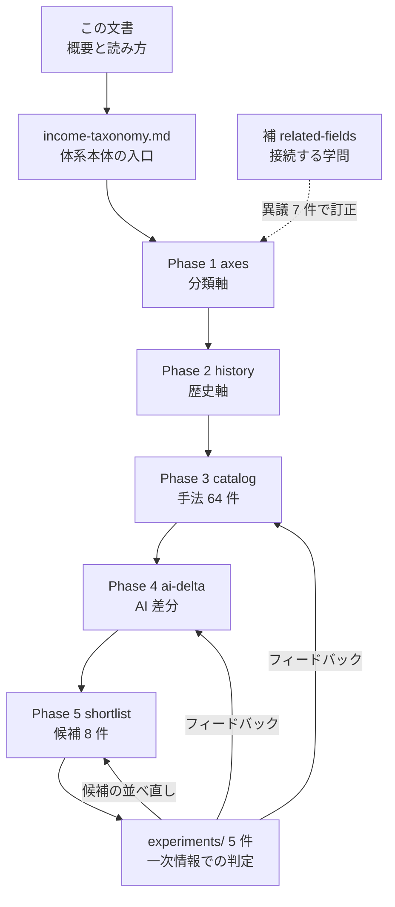
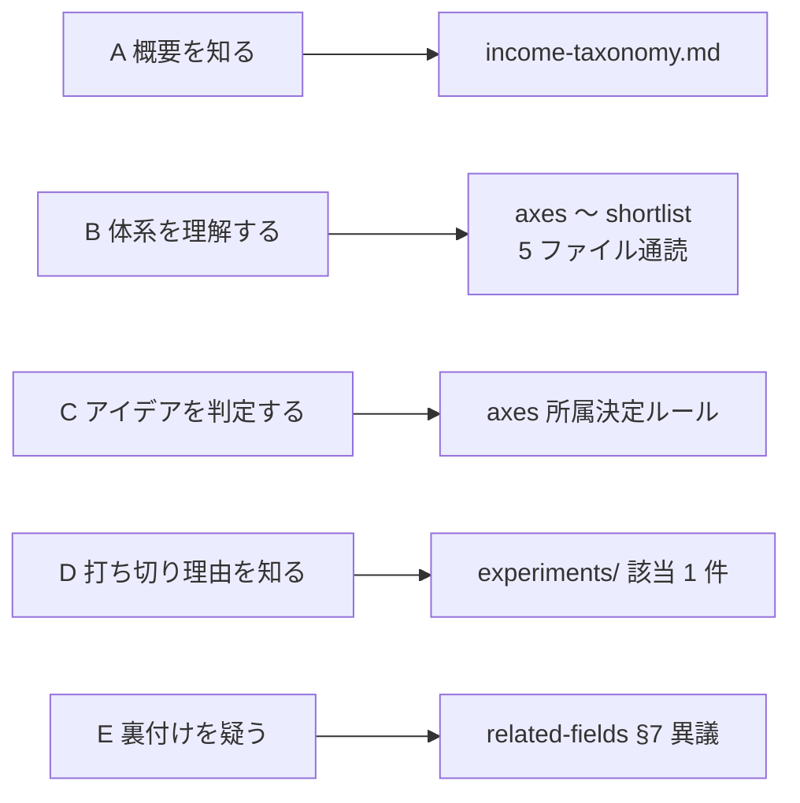

# 概要と読み方 — 資料の歩き方

このプロジェクトの成果物は **16 ファイル・約 7,800 行**ある。
全部を順に読む必要はない。**この 1 枚で「何がどこにあるか」「自分の目的ならどこから読むか」が分かる**ようにしてある。

- 体系そのものの要約と結論を読みたい → [income-taxonomy.md](income-taxonomy.md)（体系本体の入口）
- どのファイルを開くべきか決めたい → **この文書**

## 1. 3 行でいうと

1. **「AI で稼ぐ方法」を探す前に、そもそも金銭がどう発生するかの全体地図を作った**（**体系** = 入口 1 + Phase 1〜5 の 5 + 補 1 の 7 ファイル）
2. **その地図から自分の条件に合う候補を絞り、1 件ずつ一次情報で成立するかを判定している**（**検証記録** = 4 ファイル）
3. **判定して分かったことは地図側に書き戻す**（打ち切りも成果物。理由が残っている）

2026-08-27 に方針を変更し、**実際に資金・機材を動かす実行はしない**。
一次情報の調査と試算で「成立するか / 自分の条件で採れるか」を判定するところまでが成果物になる（[CLAUDE.md](../../CLAUDE.md)）。

## 2. 資料の地図

この図の主張: 体系は上から一方向に積み上がるが、検証記録だけは体系へ書き戻す — ここだけが循環している。

**縦の 5 段が体系、右の 1 件が学問側からの検算、下の 1 件が実地の判定**。この 3 種類しかない。

## 3. 目的別の読む順

自分の目的に一番近い行だけ読めばよい。所要時間は通読の目安。

| 目的 | 読む順 | 所要 |
| --- | --- | --- |
| **A. 何をやっているのか 10 分で知りたい** | この文書 §1〜§2 → [income-taxonomy.md](income-taxonomy.md) の「各層の要約」表と「主な結論」表 | 10 分 |
| **B. 体系そのものを理解したい** | [axes](income-taxonomy/axes.md) → [history](income-taxonomy/history.md) → [catalog](income-taxonomy/catalog.md) → [ai-delta](income-taxonomy/ai-delta.md) → [shortlist](income-taxonomy/shortlist.md) | 90 分 |
| **C. 思いついたアイデアを判定したい** | [axes](income-taxonomy/axes.md#所属を-1-つに決めるルール)（座標を出す） → [catalog](income-taxonomy/catalog.md)（同じ群の失敗理由） → [ai-delta](income-taxonomy/ai-delta.md)（消滅の隣にいないか） → [shortlist](income-taxonomy/shortlist.md)（自分の制約のセル） | 30 分 |
| **D. なぜ打ち切ったのかを知りたい** | この文書 §6 の結果表 → 該当する [experiments/](experiments/) のファイル（各 1 本で完結する） | 15 分／件 |
| **E. 主張の裏付けを疑いたい** | [related-fields](income-taxonomy/related-fields.md) §7「学問側からの異議」→ §8「読む順」 | 25 分 |

**B を選んだ場合の注意**: 5 ファイルは前から順に積み上がるので、飛ばすと記号が読めなくなる。
時間がないときは §5 の記号早見表だけ先に見て、[catalog](income-taxonomy/catalog.md) の集計節と
[ai-delta](income-taxonomy/ai-delta.md) の集計節の 2 箇所を読むのが最短（20 分）。

この図の主張: 目的が違えば入口が違う。全ファイルを通読する経路（B）は 5 つのうち 1 つだけ。

## 4. ファイル早見表

| ファイル | 何が書いてあるか | 開くとき | 行数 |
| --- | --- | ---: | ---: |
| [income-taxonomy.md](income-taxonomy.md) | 体系本体の入口。各層の 3 行要約、結論 7 件、受け入れ条件の検証結果、修正履歴 | 体系の全体像と結論だけ欲しいとき | 162 |
| [axes.md](income-taxonomy/axes.md) | **分類軸**。価値の源泉 9 × 人の関与度 3 段 × 当事者構成 6。所属を 1 つに決めるルール、属性、記法 | 記号の意味を引くとき／新しい手法を分類するとき | 234 |
| [history.md](income-taxonomy/history.md) | **歴史軸**。狩猟採集〜市場のアルゴリズム化の 10 時代。何が希少で、誰が取引から抜けたか | 「なぜ今この手法が成立しているのか」を遡りたいとき | 170 |
| [catalog.md](income-taxonomy/catalog.md) | **手法カタログ 64 件**。A1〜J4 の属性表と典型的な失敗理由、関与度・構成・資本の集計 | 個別の手法を引くとき（辞書として使う） | 272 |
| [ai-delta.md](income-taxonomy/ai-delta.md) | **AI 差分**。64 件に 消滅 7 / 残存 27 / 強化 25 / 新規 5 を判定。置換の実証の有無つき | ある手法が AI でどうなるかを見るとき | 345 |
| [shortlist.md](income-taxonomy/shortlist.md) | **候補抽出**。資金・時間・回収期間の 3 軸別テーブルと、確定セグメントの候補 8 件 | 「自分は次に何をやるか」を決めるとき | 464 |
| [related-fields.md](income-taxonomy/related-fields.md) | **接続する学問**。各層に対応する文献、学問側からの異議 7 件（A〜G）、文献の確認状況 | 主張の裏付けを取るとき／体系を疑うとき | 322 |
| [experiments/i7-dataset.md](experiments/i7-dataset.md) | I7 独自データセット。需要側・権利側の調査と、生成パイロットの【実測】 | データ販売・権利処理を調べるとき | 536 |
| [experiments/i8-gpu-rental.md](experiments/i8-gpu-rental.md) | I8 GPU 貸出。単価・電気代・機材価格と回収試算 | 設備を持つ手法の回収計算を見るとき | 283 |
| [experiments/c4c5-app-saas.md](experiments/c4c5-app-saas.md) | C4/C5 アプリ・SaaS。収益中央値、CAC と LTV、機会費用での回収 | 時間を投下する手法の期待値を見るとき | 228 |
| [experiments/d7-content-licensing.md](experiments/d7-content-licensing.md) | D7 既存コンテンツの AI 学習許諾。声・動画・写真の時間あたり収入と権利条件 | **唯一成立している候補**を見るとき | 358 |
| [online-tradable-assets.md](online-tradable-assets.md) | オンラインで売買が完結する資産の横断調査（**米国基準**）。4 ゲートによる定義、出口の確実性、E1・E2・E8 の順位 | 時間を使わない枠に**他に何があるか**を見るとき |
| [experiments/archive/online-tradable-assets-jp.md](experiments/archive/online-tradable-assets-jp.md) | ⚠ **上の旧版（日本居住前提）**。判定の枠組みはここで作られた。日本の出典 21 件つき | 居住地でどの結論が反転したかを追うとき | 534 |
| [market-data-availability.md](market-data-availability.md) | §14 の 96 件について、**過去の取引データ**が取れるサービスと粒度（L0〜L5）。無登録で取れるのは暗号資産・予測市場だけ | 「板がある」と「過去データがある」のずれを見るとき | 551 |
| [trading-api-availability.md](trading-api-availability.md) | 上の 56 件について、**リアルタイム価格の配信（RT0〜RT3）と発注 API（A0〜A4）**、無ければブラウザ自動操作の規約上の可否。成立 51 / 切れる 4 / 未確認 1 | 「過去データ → 予測 → 現在値 → 売買」の流れがどこで切れるかを見るとき | 637 |
| [trading-fee-comparison.md](trading-fee-comparison.md) | 上の API 側 21 提供元と Web 専用サービスの**手数料を 4 層（売買・API・データ・維持費）で比較**。API プレミアムは層 3（相場データ）に集中し、$0 の会場と月 $5〜130 の会場に二極化 | 「API 経路はいくら余計にかかるか」を見るとき | 481 |
| [trading-tax.md](trading-tax.md) | 上の会場で売買したときの**税**（連邦 ＋ WA 州 ＋ 日本側の確認）。保有期間と所得階層で 15〜40.8%、§1256 の 60/40、wash sale・予定納税・1099-DA、WA の長期益 7% / 9.9% と 2028 年からの州所得税、非居住者の日本の申告不要【推測】。手数料 4 層に「層 5 税」を足した回収期間の係数 | 「手数料 $0 でも税引後はいくら残るか」「日本で申告が要るか」を見るとき | 444 |
| [service-trust-assessment.md](service-trust-assessment.md) | 上の 23 提供元の**信用度を監督当局の一次情報で判定**（登録・処分・保護・自己資本／年数・規模／障害・API 廃止）。高 5 / 中 12 / 低 6。破綻時に資金がどうなる「壊れる形」を種類別に | 「その会場に資金と発注を預けて大丈夫か」を見るとき | 723 |
| [experiments/tastytrade-api-sample.md](experiments/tastytrade-api-sample.md) | 上で判定「高」の tastytrade の API を実際に動かした記録。6 手順の【実測】と 6 観点（認証・常駐・現在値・往復・制限・SDK）の判定 | 「その経路が本当にプログラムから動くか」を見るとき | 進行中 |
| [dashboard.md](dashboard.md) | 上の記録と口座を見る**管理画面の仕様とデプロイ契約**（監視・記録の差分・6 観点の自動判定・停止ボタン・公開面とローカル面の権限） | 「今どうなっているか」を見る場所と、その安全設計を知りたいとき | 2026-09-05 |

タスク管理は [TODO.md](../../TODO.md) と [DONE.md](../../DONE.md)、作業プランは [docs/plans/](../plans/)（完了分は `archive/`）にある。

## 5. 記号の早見表

**ここだけ覚えれば、どのファイルからでも読み始められる。** 定義の原典は [axes.md の記法](income-taxonomy/axes.md#記法)。

**軸 B: 人の関与度**（入金 1 件を追加で出すのに要る人手。維持工数は含めない）

| 記号 | 意味 | 例 |
| --- | --- | --- |
| L1 | 毎回関与。止めれば即ゼロ | 施術、受託開発 |
| L2 | 初回のみ関与。作り続けが要る | 書籍、買い切りソフト |
| L3 | 関与しない。元手・占有・仕組みに比例 | 配当、地代、API 課金 |

**軸 C: 当事者構成**（誰が誰に渡すか。P1 → P5 の順に人が抜ける）

| 記号 | 意味 | 記号 | 意味 |
| --- | --- | --- | --- |
| P1 | 人 → 人 | P4 | システム → 人 |
| P2 | 人 → 多数の人 | P5 | システム → システム |
| P3 | 人 → システム | P6 | 非人格の主体（法人・国家・ファンド） |

**軸 A: 価値の源泉と、手法 ID の頭文字**（`B5` なら「源泉 2 技能」の 5 番目）

| 頭文字 | 源泉 | 入金の直前に渡っているもの |
| --- | --- | --- |
| A | 1 時間 | 拘束された自分の可処分時間 |
| B | 2 技能 | 再現の難しい熟練・資格の行使 |
| C | 3 成果物 | 複製できる完成物のコピー |
| D | 4 権利 | 法が保証する排他的な使用許可 |
| E | 5 資本 | 元手そのものの一時的な提供 |
| F | 6 リスク引受 | 相手が抱えたくない不確実性の肩代わり |
| G | 7 仲介・場 | 需要と供給の距離を埋めること |
| H | 8 注目 | 他人の可処分注意 |
| I | 9 資源 | 占有している有限物の使用枠 |
| J | （非人格の主体） | 体系の完全性のための枠。徴税・公的運用など |

**数値の根拠**（ファイルによって使う記号が違う。強いものから順に）

| 記号 | 意味 | 主に使うファイル |
| --- | --- | --- |
| 【実測】 | 本プロジェクトで実際に投下・受領した値 | i7-dataset、i8-gpu-rental |
| 【公表値】 | 出典 URL と取得日つきの公表数値 | i8-gpu-rental、c4c5-app-saas |
| 【Web 確認済】 | 一次ページまたは報道で確認（（二次）付きは集計サイト等のみ） | i7-dataset |
| 【推測】 | 根拠のない見込み。**体系側（Phase 1〜5）は原則すべてこれ** | 体系 6 ファイル全部 |
| 【記憶・未確認】 | 古典など、記憶に基づき出典を取っていないもの | i7-dataset、related-fields |

> [d7-content-licensing.md](experiments/d7-content-licensing.md) だけは記号を使わず、
> 「第三者情報」「個人例」「規約の一次情報」と本文中で根拠を書き分け、出典は末尾にまとめている。

**その他**

| 記号 | 意味 |
| --- | --- |
| ⚠ | 法規制・利用規約に触れる。備考にその内容がある |
| 資本 ゼロ / 小 / 中 / 大 | 〜$1,000 / $1,000〜$10,000 / $10,000〜$100,000 / $100,000〜（本体系での**取り決め**であり相場ではない。2026-08-28 に USD へ。旧・円建てとの対応は [axes.md 属性](income-taxonomy/axes.md#属性)） |
| リード | 最初の入金までの期間（即日 / 〜3ヶ月 / 〜1年 / 1〜3年 / 3年〜） |

## 6. 現在地（2026-08-28）

**前提条件は確定済み**（[shortlist.md](income-taxonomy/shortlist.md#前提条件の確定2026-08-26)）。

| 項目 | 確定値 | 確定日 |
| --- | --- | --- |
| **税務上の居住地** | **米国・ワシントン州シアトル**。日本は**非居住**（住民票は除票済み）【本人申告。条文への当てはめは未確認】 | 2026-08-28（日本側の非居住は 2026-09-05 に追加） |
| 元手 | 大（$100,000 〜） | 2026-08-26（08-28 に USD へ） |
| 週あたり投下時間 | 5〜15 時間 | 2026-08-26 |
| 許容できる回収期間 | 6 ヶ月〜1 年 | 2026-08-28 |
| 既存スキル | ソフトウェア開発 | 2026-08-26 |

⚠ **2026-08-28 に居住地を前提条件へ追加し、5 件すべてを米国基準で再判定した。**
それまで前提条件に税務上の居住地が無く、experiments 5 件は暗黙に日本居住で書かれていた。
**居住地は換算で済む項目ではなく、結論の向きを変える項目だった**（下の表の「米国基準での変化」列）。

この条件で 5 件を一次情報で判定した（3 件が打ち切り、1 件が条件付き成立、1 件は候補の母集団を確定させる横断調査）。打ち切りを除いた現在の候補は 8 件。

| 手法 | 判定 | 決め手 | 米国基準での変化（08-28） | 記録 |
| --- | --- | --- | --- | --- |
| I7 独自データセット | **打ち切り**（08-26） | 個人が作って売った実例がゼロ。合法な源が自作・合成に限られる | **根拠が強くなった**。⚠ 唯一の需要側の論拠だった「日本語データ不足」が使えなくなる | [i7-dataset.md](experiments/i7-dataset.md) |
| I8 GPU 貸出 | **打ち切り**（08-27） | 稼働率 100%・電気代ゼロの上限テストでも回収 12 ヶ月に届かない | **維持。距離は縮んだ**（最良 30.5 → 22.8 ヶ月）。⚠ 主因は電気代でなく機材価格だった | [i8-gpu-rental.md](experiments/i8-gpu-rental.md) |
| C4/C5 アプリ・SaaS | **打ち切り**（08-27） | 収益中央値は 1 年後で月 $72。機会費用が回収できず、かつ CAC > LTV | **根拠が強くなった**。⚠ 機会費用の時給が $31 → $61 になり、唯一通っていたマスも落ちる | [c4c5-app-saas.md](experiments/c4c5-app-saas.md) |
| D7 AI 学習許諾 | **条件付き成立**（08-27） | 声は時間あたり $96〜1,280 で受託を上回る。動画は保留、写真は不成立 | **成立側に動いた**。最大リスクだった「日本語話者の実例ゼロ」と「Troveo の対応国が非公表」が消滅 | [d7-content-licensing.md](experiments/d7-content-licensing.md) |
| オンライン完結の資産（横断） | **母集団を確定**（08-28） | 4 ゲートを通るのは上場商品と国債だけ。新手法はゼロ | **順位が入れ替わった**。E2 債券が E1 株式配当を上回り、⚠ REIT の 1.9 倍優位は消えた | [online-tradable-assets.md](online-tradable-assets.md) |

**打ち切り 3 件に共通するのは「AI で作れるようになった＝供給が増えた」側に立っていたこと**で、
残った D7 だけが**既に在庫を持つ側**に立つ。この対比は候補の並べ方を見直す軸になる（[shortlist.md](income-taxonomy/shortlist.md#候補-8-件着手順)）。

⚠ **居住地の変更は、この対比をさらに裏づけた。** 作る側（C4/C5・I7）は居住地の時給が上がると
機会費用で不利になり、言語の希少性も失って**判定が悪化した**。
在庫を持つ側（D7）は**判定が改善した**。**同じ前提変更が、体系上の位置によって逆向きに効いている。**

**候補 8 件の内訳**: 判定済みの D7（条件付き成立）と、未判定の 7 件 —
E1 上場株の配当・E2 債券の利子・E8 譲渡益（いずれも L3。時間を使わない資金枠）と、
D1 印税・H4 有料メンバーシップ・B5 受託開発・B14 AI 開発者向け受託。

⚠ **時間を使う枠は D7 と B14 しか残っていない。** 時間を投下する候補が 3 件連続で打ち切られたため。
D7 の残論点は米国基準で入れ替わった: 実例ゼロの懸念は消えたが、
⚠ 比較対象 B14 の水準が $31〜65/時 → $65〜110/時 に上がり、⚠ ElevenLabs が BIPA 集団訴訟の被告になっている。

## 7. 読むときの注意

1. **体系側（Phase 1〜5）の数値は原則すべて【推測】である。** 実験を回して得た数値ではない。
   一次情報に当たっているのは `experiments/` の 5 ファイルと [related-fields.md](income-taxonomy/related-fields.md) だけ
2. **【実測】は原則として増えない。** 2026-08-27 の方針変更で、資金・機材を動かす実行はしないと決めた。
   既にある【実測】（i7 の生成パイロット等）はそのまま残してある
   - ⚠ **2026-09-05 に 1 件だけ例外を設けた。** tastytrade の API 検証（[experiments/tastytrade-api-sample.md](experiments/tastytrade-api-sample.md)）では、
     **API の挙動**（認証の寿命・遅延・レート制限・往復時間・約定価格と気配の差）を【実測】として取る。
     収入・費用の【実測】を取りにいくものではなく、他の手法にも広げない
3. **日付つきで読む。** 各ファイルの判定・訂正には日付が入っている。
   [income-taxonomy.md](income-taxonomy.md) の「修正履歴」と各 experiments の「出典（取得日）」が更新の履歴になる
4. **打ち切りも成果物として扱う。** 理由が残っていれば、条件が変わったとき（回収期間を延ばす、電気代が下がる等）に再開の判断ができる。
   ⚠ **2026-08-28 の居住地の変更がまさにその再判定にあたる。** 判定は 5 件とも動かなかったが、**理由の強さと順位は動いた**
5. **⚠ の付いた手法は、規約・法令の条件を先に読む。** 特に D7 は撤回条件が採否を分ける
6. **⚠ の指す法域は米国連邦法と WA 州法である**（2026-08-28 以降）。
   ⚠ **米国は州ごとに規制が違う**ため、州の免許・登録が要るものは WA 州の所管を併記している。
   2026-08-28 より前の版は日本法を指していた
